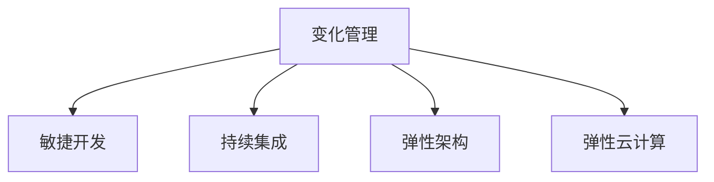

                 

## 1. 背景介绍

在当今快速发展的技术环境中，变化成为了唯一的常态。随着信息技术的迅猛发展和全球化进程的加速，组织和个人面临的环境和挑战正在不断演变。这要求我们不断学习、适应，甚至引领这些变化。在这个过程中，技术管理和适应变化的能力变得尤为重要。本文将探讨如何理解和接纳变化，通过有效管理变化来提升组织和个人应对未来挑战的能力。

### 1.1 变化的多维度

变化并非单一维度的现象，它涉及技术、市场、政策、文化等多个方面。技术的革新是驱动社会变革的重要力量，但同时也可能带来新的风险和挑战。在组织层面上，变化可能意味着业务模式的调整、组织结构的重组、人员的重新配置等。对于个人而言，技术能力的要求在不断提升，个人学习和发展速度必须与时代同步。

### 1.2 变化的重要性

变化不仅影响了技术的演变，也深刻影响了组织和个人的未来。接受并适应变化，意味着接受新的挑战，探索新的机会，提升竞争力和创新能力。面对不确定的未来，组织和个人必须具备快速学习、灵活调整、持续创新的能力。

## 2. 核心概念与联系

### 2.1 核心概念概述

本节将介绍几个核心概念，并通过逻辑图表展示这些概念之间的联系：

- **变化管理(Change Management)**：指通过系统化的方法识别、分析、计划和实施变化，以适应组织内部的新环境。
- **敏捷开发(Agile Development)**：一种适应变化的软件开发方法，强调快速响应变化、持续改进和客户反馈。
- **持续集成(Continuous Integration, CI)**：一种软件开发实践，通过频繁的代码集成和自动测试，确保软件质量并提升交付速度。
- **弹性架构(Flexible Architecture)**：一种设计原则，旨在通过模块化和可配置性提高系统的适应性和扩展性。
- **弹性云计算(Elastic Cloud Computing)**：一种云计算模型，提供可伸缩的资源，以适应变化的业务需求。

### 2.2 Mermaid流程图



这个流程图展示了变化管理与其他核心概念之间的联系：

- 敏捷开发通过快速响应变化，支持变化管理的目标。
- 持续集成通过频繁的代码集成和测试，保证了软件质量，为变化管理提供了技术基础。
- 弹性架构和弹性云计算通过提供模块化和可伸缩的资源，增强了系统的适应性和扩展性，为应对变化提供了底层支持。

## 3. 核心算法原理 & 具体操作步骤

### 3.1 算法原理概述

变化管理本质上是一种策略和过程，旨在通过系统的步骤识别、评估和实施变化，以实现组织目标。算法原理包括变化识别、评估、计划和实施四个阶段，每个阶段都需要特定的技术和工具支持。

### 3.2 算法步骤详解

变化管理的具体操作步骤可以分为以下步骤：

1. **变化识别**：通过定期的监控和评估，识别出可能的变化点。
2. **变化评估**：分析变化的必要性和影响，评估变化的价值和风险。
3. **变化计划**：制定详细的变化实施计划，包括资源配置、时间表、沟通策略等。
4. **变化实施**：按照计划执行变化，确保实施过程中的人员、技术和资源到位。
5. **变化监控和评估**：在变化实施后，持续监控变化效果，评估实施结果是否达到了预期目标。

### 3.3 算法优缺点

变化管理的优点包括：
- 帮助组织系统地应对变化，减少不确定性。
- 通过评估变化的价值和风险，选择最佳的变化路径。
- 通过计划的制定和实施，提升组织执行力和灵活性。

缺点包括：
- 实施成本和时间较高。
- 需要专业的人才和资源支持。
- 变化管理过程复杂，可能难以适应快速变化的环境。

### 3.4 算法应用领域

变化管理广泛应用于软件开发、企业转型、流程优化、市场扩展等多个领域。在技术开发中，敏捷开发和持续集成是变化管理的重要实践。在企业中，变化管理帮助组织应对市场变化、政策调整、技术升级等挑战。

## 4. 数学模型和公式 & 详细讲解 & 举例说明

### 4.1 数学模型构建

变化管理的数学模型可以描述为：

- **变化识别模型**：识别出可能的变化点，通过监控指标和评估函数进行。
- **变化评估模型**：评估变化的价值和风险，使用决策树、贝叶斯网络等模型。
- **变化计划模型**：制定实施计划，使用线性规划、优化算法等。
- **变化实施模型**：模拟变化实施过程，使用仿真模型、蒙特卡洛模拟等。
- **变化监控和评估模型**：监控变化效果，使用KPI、SLA等指标进行评估。

### 4.2 公式推导过程

以变化识别模型为例，假设变化识别涉及N个指标，每个指标有m种可能的值。识别变化的概率可以通过以下公式计算：

$$
P_{i,j} = \frac{\sum_{k=1}^m f_k(x_i)}{\sum_{k=1}^m \sum_{j=1}^N f_k(x_j)}
$$

其中，$f_k(x_i)$表示第k个指标在状态i下的概率分布。

### 4.3 案例分析与讲解

以一家软件开发公司为例，描述变化管理的实施过程。该公司通过敏捷开发方法快速响应市场需求，定期进行持续集成以确保软件质量。当市场出现新技术趋势时，通过变化管理流程识别和评估变化，制定实施计划并逐步实施。在实施过程中，使用弹性架构和云计算资源支持新系统的部署和扩展，最后通过监控和评估确保变化达到预期效果。

## 5. 项目实践：代码实例和详细解释说明

### 5.1 开发环境搭建

为了实施变化管理流程，我们需要搭建一个支持敏捷开发、持续集成、弹性架构和云计算的开发环境。

1. **敏捷开发环境**：使用JIRA、Confluence等工具支持敏捷项目管理。
2. **持续集成环境**：使用Jenkins、GitLab CI等工具实现自动构建和测试。
3. **弹性架构环境**：使用Docker、Kubernetes等容器化技术实现应用部署和扩展。
4. **云计算环境**：使用AWS、Azure等云平台提供资源支持。

### 5.2 源代码详细实现

以下是一个简单的敏捷开发项目的代码实现：

```python
# 使用JIRA API获取敏捷任务数据
import requests

def get_sprint_tasks(sprint_id):
    url = f"https://jira.example.com/rest/api/3/sprint/{sprint_id}/issue"
    headers = {"Authorization": "Bearer YOUR_API_TOKEN"}
    response = requests.get(url, headers=headers)
    tasks = response.json()["issues"]
    return tasks

# 使用GitLab CI进行持续集成
import git

def run_build(project_path):
    repo = git.Repo(project_path)
    ref = "master"
    build = repo.git.ls_files(f"--others --exclude-standard -p")
    if ".git" in build:
        build = "build"
    cmd = f"docker run --rm -v {project_path}:/app {BUILD_DOCKER_IMAGE} /app/{build}"
    process = subprocess.Popen(cmd, shell=True)
    process.communicate()
    return process.returncode

# 使用Docker和Kubernetes进行弹性架构部署
import kubernetes

def deploy_to_kubernetes(project_path, service_name):
    client = kubernetes.client.CoreV1Api()
    k8s_config = client.create_kubeconfig()
    config = ApiClient(api_key=k8s_config["api_key"], api_key_prefix="API_KEY_PREFIX")
    namespace = "default"
    deployment = app_deployment()
    client.create_namespaces(namespace)
    client.create_deployment(deployment)
    client.create_service(service_name, namespace)

# 使用AWS进行云计算资源管理
import boto3

def create_ec2_instance(instance_type, key_pair_name, security_group_id):
    ec2 = boto3.resource("ec2")
    instance = ec2.create_instances(
        ImageId="AMI_ID",
        InstanceType=instance_type,
        KeyName=key_pair_name,
        SecurityGroupIds=[security_group_id],
    )
    return instance

# 使用AWS进行弹性扩展
import cloudwatch

def scale_out(auto_scaling_group_name, min_size, max_size):
    auto_scaling = cloudwatch.AutomationService()
    auto_scaling.scale_out(auto_scaling_group_name, min_size, max_size)
```

### 5.3 代码解读与分析

这段代码展示了敏捷开发、持续集成、弹性架构和云计算的结合使用。通过JIRA API获取敏捷任务数据，使用GitLab CI进行持续集成，使用Docker和Kubernetes进行弹性架构部署，使用AWS进行云计算资源管理。这些工具和技术为变化管理的实施提供了坚实的技术基础。

### 5.4 运行结果展示

通过上述代码，可以在敏捷开发环境中实现任务管理，在持续集成环境中自动化构建和测试，在弹性架构环境中快速部署和扩展，在云计算环境中灵活调整资源。

## 6. 实际应用场景

### 6.1 软件开发

软件开发中的变化管理是敏捷开发的核心。通过持续集成和持续交付，快速响应市场变化，提升软件质量和交付速度。变化管理帮助团队识别和评估技术趋势，制定技术方案，确保技术演进顺利实施。

### 6.2 企业转型

企业转型需要系统化的变化管理。通过识别和评估变化机会，制定转型策略，并逐步实施，企业可以成功应对市场和技术的变化，提升竞争力。

### 6.3 流程优化

流程优化涉及业务流程的重新设计和实施。通过变化管理流程，企业可以逐步推进流程优化，提升运营效率和客户满意度。

### 6.4 未来应用展望

随着技术的不断演进，变化管理将更加智能化和自动化。人工智能和机器学习技术将帮助组织更准确地识别和评估变化，自动生成变化管理计划，实时监控变化效果。

## 7. 工具和资源推荐

### 7.1 学习资源推荐

1. **《敏捷开发实战》**：介绍敏捷开发的核心实践和工具。
2. **《持续集成：提高软件质量的最佳实践》**：探讨持续集成的实施方法和最佳实践。
3. **《弹性架构设计》**：讲解弹性架构的设计原则和实现技术。
4. **《云计算最佳实践》**：分享云计算环境下的资源管理和扩展策略。

### 7.2 开发工具推荐

1. **JIRA**：敏捷开发和项目管理工具。
2. **Jenkins**：持续集成工具。
3. **Docker**：容器化技术。
4. **Kubernetes**：容器编排工具。
5. **AWS**：云计算平台。

### 7.3 相关论文推荐

1. **《敏捷方法：从计划到执行》**：探讨敏捷开发的核心概念和实践。
2. **《持续集成和持续交付：构建高效的软件交付系统》**：介绍持续集成和持续交付的最佳实践。
3. **《弹性架构设计模式》**：讲解弹性架构的设计模式和实现技术。
4. **《云计算中的弹性扩展和资源管理》**：分享云计算环境下的资源管理策略。

## 8. 总结：未来发展趋势与挑战

### 8.1 研究成果总结

本文探讨了变化管理的重要性，并通过核心概念和算法原理详细讲解了变化管理的实施过程。通过具体的代码实现和实际应用场景，展示了变化管理的实践方法。

### 8.2 未来发展趋势

未来的变化管理将更加智能化、自动化和集成化。人工智能和机器学习技术将为变化管理提供更多支持，使其更精准、高效。

### 8.3 面临的挑战

变化管理仍面临诸多挑战，包括实施成本高、技术复杂、人才需求大等。这些挑战需要通过系统化的方法和先进的工具来逐步解决。

### 8.4 研究展望

未来研究应关注智能化、自动化、集成化的变化管理方法，探索如何利用新技术提升变化管理的效率和效果。

## 9. 附录：常见问题与解答

**Q1: 什么是变化管理？**

A: 变化管理是一种通过系统化的方法识别、评估和实施变化，以适应组织内部的新环境。

**Q2: 如何实施敏捷开发？**

A: 敏捷开发通过快速响应变化、持续改进和客户反馈，支持变化管理的目标。使用JIRA、Confluence等工具支持敏捷项目管理。

**Q3: 持续集成和持续交付的实施方法是什么？**

A: 持续集成通过频繁的代码集成和自动测试，确保软件质量。使用Jenkins、GitLab CI等工具实现自动构建和测试。

**Q4: 弹性架构的设计原则是什么？**

A: 弹性架构通过模块化和可配置性提高系统的适应性和扩展性。使用Docker、Kubernetes等容器化技术实现应用部署和扩展。

**Q5: 如何使用AWS进行云计算资源管理？**

A: 使用AWS进行云计算资源管理，需要创建EC2实例、配置安全组、设置自动扩展等操作。使用AWS提供的API和CLI工具进行操作。

作者：禅与计算机程序设计艺术 / Zen and the Art of Computer Programming

