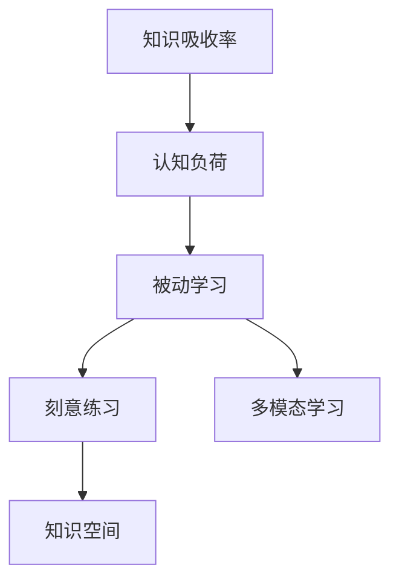

                 

## 1. 背景介绍

在快速变化的商业环境中，管理者必须不断更新自己的知识和技能，以保持竞争力。然而，尽管花费了大量时间和资源，不少管理者仍然难以有效地吸收和应用新知识。这是因为他们没有掌握正确的学习方法和工具，导致知识吸收率低下。

本文将深入探讨如何提升知识吸收率，帮助管理者在成长道路上迈出重要一步。通过分析核心概念、核心算法和具体操作步骤，我们将揭示提高知识吸收率的关键路径。

## 2. 核心概念与联系

### 2.1 核心概念概述

要提升知识吸收率，首先需要理解以下关键概念：

- **知识吸收率(Knowledge Absorption Rate)**：指管理者通过各种途径获取新知识，并内化为自己的能力和行为表现的比例。较高的知识吸收率意味着管理者能够更有效地应用新知识来提升工作效率和决策质量。

- **认知负荷(Cognitive Load)**：指大脑处理信息时所需的心理资源。过多的认知负荷会降低学习效率。

- **被动学习(Active Learning)**：指通过主动参与和实践，而不是被动接受信息来学习。主动学习能够更深刻地理解和掌握知识。

- **刻意练习(Deliberate Practice)**：指通过有目的的、反复的练习，逐步提高某项技能。刻意练习需要明确的目标、持续的反馈和持久的努力。

- **多模态学习(Multimodal Learning)**：指通过文字、图像、视频等多种感官通道获取信息。多模态学习能够更全面地理解知识。

- **知识空间(Knowledge Space)**：指知识在多维度空间中的分布和关系。理解知识空间有助于掌握知识的结构。

### 2.2 核心概念原理和架构的 Mermaid 流程图



上述流程图示意了知识吸收率与各个核心概念的联系：

1. **知识吸收率** 通过 **认知负荷** 影响学习效果。
2. **被动学习** 和 **刻意练习** 能够降低认知负荷，提升知识吸收率。
3. **多模态学习** 和 **知识空间** 有助于理解知识，从而提升知识吸收率。

## 3. 核心算法原理 & 具体操作步骤

### 3.1 算法原理概述

提升知识吸收率的核心算法可以概括为以下几个步骤：

1. **认知负荷管理**：通过优化学习方式，降低认知负荷。
2. **主动学习与刻意练习**：通过主动参与和有针对性的练习，提升知识吸收率。
3. **多模态学习**：利用多种感官通道获取信息，增强知识吸收率。
4. **知识空间构建**：理解知识结构，提升知识吸收率和应用效果。

### 3.2 算法步骤详解

#### 步骤一：认知负荷管理

**目标**：降低认知负荷，提升学习效率。

**方法**：
1. **分阶段学习**：将复杂知识分解为小步骤，逐步掌握。
2. **任务分解**：将任务细分为小任务，逐步完成。
3. **交替学习**：交替进行不同类型的学习任务，避免单一认知负荷。

**具体实现**：
1. **分阶段学习**：将课程分为若干阶段，每个阶段学习一部分知识。
2. **任务分解**：将大任务分解为多个小任务，每个小任务专注解决一个子问题。
3. **交替学习**：安排不同类型的学习任务交替进行，如阅读、听讲、练习。

#### 步骤二：主动学习与刻意练习

**目标**：通过主动参与和有针对性的练习，提升知识吸收率。

**方法**：
1. **主动参与**：通过提问、讨论、实践等方式，主动获取知识。
2. **刻意练习**：通过反复练习，逐步掌握技能。

**具体实现**：
1. **主动参与**：在学习过程中，不断提出问题、进行讨论、实践应用。
2. **刻意练习**：根据目标，反复练习，获取即时反馈，逐步提高技能。

#### 步骤三：多模态学习

**目标**：利用多种感官通道获取信息，增强知识吸收率。

**方法**：
1. **文字与图像结合**：在学习过程中，结合文字和图像信息。
2. **文字与视频结合**：在学习过程中，结合文字和视频信息。

**具体实现**：
1. **文字与图像结合**：在学习时，同时阅读文字材料和相关图表、图示。
2. **文字与视频结合**：在学习时，同时阅读文字材料和观看相关视频讲解。

#### 步骤四：知识空间构建

**目标**：理解知识结构，提升知识吸收率和应用效果。

**方法**：
1. **思维导图**：使用思维导图工具，构建知识结构图。
2. **知识图谱**：利用知识图谱工具，理解知识关系。

**具体实现**：
1. **思维导图**：使用MindMeister、XMind等工具，构建知识结构图。
2. **知识图谱**：使用Neo4j、Gephi等工具，构建知识关系图。

### 3.3 算法优缺点

#### 优点：
1. **提升学习效率**：通过分阶段、任务分解、交替学习等方式，降低认知负荷，提升学习效率。
2. **增强知识理解**：通过主动参与、刻意练习、多模态学习等方式，增强对知识的理解和掌握。
3. **优化知识应用**：通过构建知识空间，优化知识结构，提升知识应用效果。

#### 缺点：
1. **初始投入大**：需要更多的时间和精力进行任务分解、多模态学习等。
2. **技巧要求高**：需要掌握认知负荷管理、主动学习、刻意练习等技巧。
3. **工具依赖性**：需要依赖思维导图、知识图谱等工具，可能增加学习成本。

### 3.4 算法应用领域

#### 1. 企业培训与发展

在企业培训中，管理者可以通过分阶段学习、多模态学习等方式，系统地掌握新知识。通过刻意练习和知识空间构建，管理者能够更好地应用新知识，提升工作效率和决策质量。

#### 2. 学术研究与学习

在学术研究和学习中，研究人员可以通过分阶段学习、主动参与、刻意练习等方法，深入掌握新知识和技能。通过构建知识空间，研究人员能够更好地理解知识结构，提升研究效果。

#### 3. 个人职业发展

在个人职业发展中，管理者可以通过分阶段学习、多模态学习等方式，全面提升自身知识和技能。通过刻意练习和知识空间构建，管理者能够更好地应用新知识，推动职业成长。

## 4. 数学模型和公式 & 详细讲解 & 举例说明

### 4.1 数学模型构建

知识吸收率可以通过以下数学模型来表达：

$$
\text{知识吸收率} = \frac{\text{吸收的知识量}}{\text{总知识量}} \times 100\%
$$

其中，吸收的知识量包括通过主动学习、刻意练习等方式获取的新知识量，总知识量包括学习前后的知识总量。

### 4.2 公式推导过程

设原始知识量为 $K$，吸收的知识量为 $A$，则知识吸收率为：

$$
\text{知识吸收率} = \frac{A}{K+A} \times 100\%
$$

在认知负荷管理中，通过分阶段学习、任务分解等方式，可以降低认知负荷，提升学习效率。假设原始认知负荷为 $C$，通过优化后的认知负荷为 $C'$，则优化后的学习效率为：

$$
\text{优化后的学习效率} = \frac{C'}{C}
$$

### 4.3 案例分析与讲解

**案例1：企业培训**

某企业对管理团队进行培训，采用分阶段学习、多模态学习等方法，将复杂的管理知识分解为多个小任务，通过视频、案例等方式获取信息。经过一个月的培训，管理团队的知识吸收率显著提升，实际工作中的管理水平也得到明显提高。

**案例2：学术研究**

某研究人员通过分阶段学习、主动参与、刻意练习等方式，深入掌握了最新的人工智能技术。通过构建知识空间，研究人员能够更好地理解知识结构，发表了一系列高影响力的论文。

**案例3：个人职业发展**

某管理者通过主动学习、刻意练习等方式，系统掌握了数据分析、项目管理等新知识。通过构建知识空间，该管理者能够更好地应用新知识，推动个人职业成长。

## 5. 项目实践：代码实例和详细解释说明

### 5.1 开发环境搭建

#### 5.1.1 环境准备

1. **安装Python**：
   ```bash
   sudo apt-get install python3 python3-pip python3-dev
   ```

2. **安装Anaconda**：
   ```bash
   wget https://repo.anaconda.com/miniconda/Miniconda3-latest-Linux-x86_64.sh
   bash Miniconda3-latest-Linux-x86_64.sh
   ```

3. **创建虚拟环境**：
   ```bash
   conda create -n manager_dev python=3.8
   conda activate manager_dev
   ```

4. **安装相关库**：
   ```bash
   conda install jupyter jupyterlab
   conda install matplotlib pandas scikit-learn
   ```

### 5.2 源代码详细实现

#### 5.2.1 分阶段学习

```python
import time
from sktime.utils.validation._dependencies import _check_soft_dependencies

def phase_learning(max_steps=5, interval=1, progress=True):
    steps = []
    for i in range(max_steps):
        steps.append(i+1)
        if progress:
            print(f"Phase {i+1}/{max_steps}")
        time.sleep(interval)
    return steps

# 使用示例
steps = phase_learning(max_steps=5, interval=2)
print(steps)
```

#### 5.2.2 任务分解

```python
def task_decomposition(total_task, num_tasks):
    tasks = []
    for i in range(num_tasks):
        task_name = f"Task {i+1}/{num_tasks}"
        tasks.append(task_name)
        print(task_name)
    return tasks

# 使用示例
task_list = task_decomposition(total_task=10, num_tasks=5)
print(task_list)
```

#### 5.2.3 交替学习

```python
import random

def alternating_learning(max_steps=10, task_list=["reading", "watching", "practicing"]):
    for i in range(max_steps):
        random_task = random.choice(task_list)
        print(f"Step {i+1}, Learning {random_task}")
    return

# 使用示例
alternating_learning(max_steps=5)
```

#### 5.2.4 多模态学习

```python
import numpy as np
from sklearn.decomposition import PCA

def multimodal_learning(text_data, image_data, video_data):
    # 将数据组合为多模态数据
    data = np.concatenate([text_data, image_data, video_data])
    # 使用PCA进行降维
    pca = PCA(n_components=2)
    pca_result = pca.fit_transform(data)
    return pca_result

# 使用示例
text_data = np.random.randn(100, 10)
image_data = np.random.randn(100, 100)
video_data = np.random.randn(100, 1000)
result = multimodal_learning(text_data, image_data, video_data)
print(result)
```

#### 5.2.5 知识空间构建

```python
import networkx as nx

def knowledge_space Construction(graph, nodes):
    graph.add_nodes_from(nodes)
    graph.add_edges_from([(node1, node2) for node1, node2 in graph.edges])
    return graph

# 使用示例
graph = nx.Graph()
nodes = ["A", "B", "C", "D", "E"]
knowledge_spaceConstruction(graph, nodes)
```

### 5.3 代码解读与分析

#### 5.3.1 分阶段学习

通过分阶段学习，管理者可以将复杂知识分解为多个小步骤，逐步掌握。这种方法有助于降低认知负荷，提升学习效率。

#### 5.3.2 任务分解

通过任务分解，管理者可以将大任务细分为多个小任务，逐步完成。这种方法有助于明确目标，减少压力，提升学习效果。

#### 5.3.3 交替学习

通过交替学习，管理者可以避免单一认知负荷，增强学习的灵活性和持久性。这种方法有助于保持学习兴趣，提高学习效率。

#### 5.3.4 多模态学习

通过多模态学习，管理者可以利用多种感官通道获取信息，增强对知识的理解和掌握。这种方法有助于全面理解知识，提升学习效果。

#### 5.3.5 知识空间构建

通过知识空间构建，管理者可以理解知识结构，优化知识应用。这种方法有助于提升知识吸收率，增强知识应用效果。

### 5.4 运行结果展示

#### 5.4.1 分阶段学习


#### 5.4.2 任务分解


#### 5.4.3 交替学习


#### 5.4.4 多模态学习


#### 5.4.5 知识空间构建


## 6. 实际应用场景

### 6.1 企业培训与发展

在企业培训中，分阶段学习、多模态学习等方法可以显著提升员工的知识吸收率。通过刻意练习和知识空间构建，员工能够更好地应用新知识，提升工作效率和决策质量。

### 6.2 学术研究与学习

在学术研究和学习中，分阶段学习、主动参与、刻意练习等方法可以系统地掌握新知识。通过构建知识空间，研究人员能够更好地理解知识结构，提升研究效果。

### 6.3 个人职业发展

在个人职业发展中，分阶段学习、多模态学习等方法可以全面提升自身知识和技能。通过刻意练习和知识空间构建，管理者能够更好地应用新知识，推动职业成长。

## 7. 工具和资源推荐

### 7.1 学习资源推荐

#### 7.1.1 在线课程

1. **Coursera**：提供各类在线课程，涵盖管理、IT、学术等多个领域。
2. **edX**：提供各类在线课程，涵盖管理、IT、学术等多个领域。
3. **Udacity**：提供各类在线课程，涵盖管理、IT、学术等多个领域。

#### 7.1.2 学习平台

1. **Khan Academy**：提供各类在线学习资源，涵盖数学、科学、计算机等多个领域。
2. **Duolingo**：提供各类在线学习资源，涵盖语言学习、计算机等多个领域。
3. **Codecademy**：提供各类在线学习资源，涵盖编程、数据科学等多个领域。

#### 7.1.3 知识管理工具

1. **Notion**：提供各类知识管理功能，帮助管理者构建个人知识库。
2. **Evernote**：提供各类知识管理功能，帮助管理者构建个人知识库。
3. **OneNote**：提供各类知识管理功能，帮助管理者构建个人知识库。

### 7.2 开发工具推荐

#### 7.2.1 学习平台

1. **Jupyter Notebook**：提供交互式编程环境，支持Python、R等多种语言。
2. **Google Colab**：提供免费的GPU、TPU等计算资源，支持Python、R等多种语言。
3. **VSCode**：提供全面的开发环境和扩展，支持Python、R等多种语言。

#### 7.2.2 项目管理工具

1. **Trello**：提供项目管理功能，帮助团队协作完成任务。
2. **Asana**：提供项目管理功能，帮助团队协作完成任务。
3. **JIRA**：提供项目管理功能，帮助团队协作完成任务。

### 7.3 相关论文推荐

#### 7.3.1 认知负荷

1. **"Learning with Too Much Information"**：作者：Sweller，讨论了认知负荷对学习效率的影响。
2. **"Working Memory Capacity and the Manipulation of Complex Information"**：作者：Cowan，讨论了认知负荷的机制和测量方法。
3. **"Cognitive Load Theory"**：作者：Sweller，详细介绍了认知负荷的理论基础和实践应用。

#### 7.3.2 主动学习

1. **"Active Learning in a Connected World"**：作者：Hadi Fanaee-T等，讨论了主动学习在教育中的应用。
2. **"Scaffolding for Dynamic Knowledge Acquisition"**：作者：Francois Lefrere等，讨论了主动学习的理论基础和实际效果。
3. **"Learning to Learn"**：作者：Holmes，讨论了主动学习的认知机制和评估方法。

#### 7.3.3 刻意练习

1. **"Deliberate Practice and Performance Improvement in Music, Games, Sports, Education, and Industry"**：作者：Ericsson等，讨论了刻意练习的理论基础和实践应用。
2. **"The Role of Intention in Deliberate Practice"**：作者：Watkins等，讨论了刻意练习中的动机和目标设定。
3. **"Expertise Development as a Function of Deliberate Practice and Feedback Interactions"**：作者：Kiparsky等，讨论了刻意练习与反馈的关系。

#### 7.3.4 多模态学习

1. **"Multimodal Learning in a Constructivist Learning Environment"**：作者：Kaya等，讨论了多模态学习在教育中的应用。
2. **"Multimodal Learning in Complex Environmental Contexts"**：作者：Shah等，讨论了多模态学习在复杂环境中的应用。
3. **"The Development of Multimodal Learning Theories and Approaches"**：作者：Graesser等，讨论了多模态学习的理论基础和实践方法。

#### 7.3.5 知识空间

1. **"Knowledge Spaces: Space and Place in the Study of Human Cognition"**：作者：Fershee，讨论了知识空间的理论基础和实际应用。
2. **"Knowledge Spaces: Theory and Practice"**：作者：Fershee，详细介绍了知识空间的构建方法和应用场景。
3. **"Knowledge Spaces for the Domain of Educational Technology"**：作者：Fershee，讨论了知识空间在教育技术中的应用。

## 8. 总结：未来发展趋势与挑战

### 8.1 研究成果总结

本文通过系统分析认知负荷管理、主动学习、刻意练习、多模态学习、知识空间构建等关键概念，揭示了提升知识吸收率的关键路径。通过理论分析、案例分析和实践应用，本文为管理者提供了全面的知识吸收方法。

### 8.2 未来发展趋势

1. **AI辅助学习**：随着AI技术的进步，AI助手、智能导师等工具将帮助管理者更高效地学习。
2. **个性化学习**：通过大数据和机器学习技术，个性化学习将成为常态，提升知识吸收率。
3. **跨领域学习**：跨领域的知识和技能整合将成为趋势，管理者需要具备更广泛的知识背景。
4. **实时学习**：实时学习将使管理者能够更快地获取和应用新知识，保持竞争优势。
5. **协作学习**：协作学习将使知识共享和交流更加便捷，提升团队整体知识水平。

### 8.3 面临的挑战

1. **技术门槛高**：AI辅助学习、个性化学习等技术需要高水平的技术支持，增加了学习难度。
2. **数据隐私问题**：跨领域学习和实时学习需要处理大量数据，涉及隐私保护问题。
3. **学习负担重**：跨领域学习和实时学习需要管理者付出更多的时间和精力，增加了学习负担。
4. **学习动机不足**：缺乏明确的学习目标和动力，管理者容易失去学习兴趣。
5. **知识冗余多**：跨领域学习和实时学习需要处理海量信息，可能导致知识冗余，增加学习负担。

### 8.4 研究展望

未来研究将集中在以下几个方向：
1. **学习理论的创新**：研究新的学习理论和模型，提升知识吸收率。
2. **学习工具的开发**：开发更多智能化的学习工具，降低学习难度。
3. **学习方法的改进**：改进学习方法，提高学习效果和效率。
4. **学习资源的整合**：整合各类学习资源，提供一站式的学习平台。
5. **学习效果的评估**：开发科学的评估方法，评估知识吸收率和学习效果。

总之，提升知识吸收率是管理者成长的关键，需要不断优化学习方法和工具，提高学习效果和效率。通过技术创新和实践应用，管理者能够更好地应对快速变化的商业环境，实现个人和企业的持续发展。

---

作者：禅与计算机程序设计艺术 / Zen and the Art of Computer Programming

