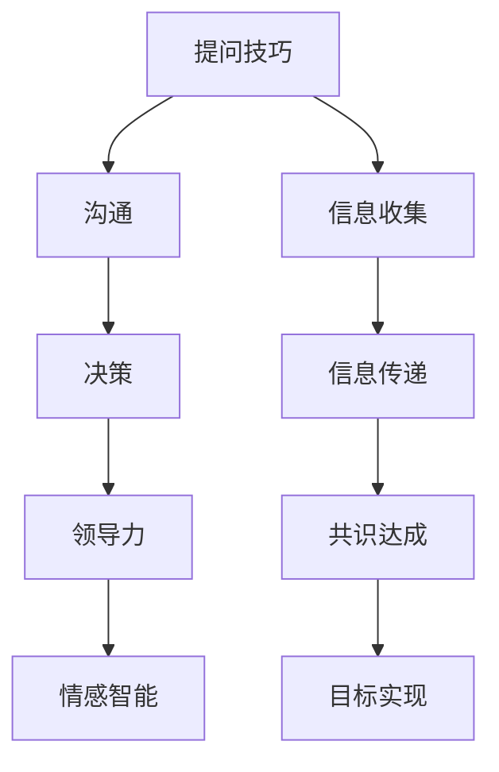

                 

# 提问技巧：管理者的沟通利器

> 关键词：管理，沟通，提问技巧，决策，领导力

## 1. 背景介绍

### 1.1 问题由来
在现代企业的日常运营中，管理者常常需要面对繁杂的决策和沟通任务，这不仅要求他们具备敏锐的市场洞察力，还需要良好的沟通能力。然而，许多管理者在沟通过程中常常遭遇瓶颈，诸如无法清晰传达自己的想法，未能引导团队的方向，甚至引发团队冲突。这种局面不仅影响了工作效率，也损害了团队士气。

### 1.2 问题核心关键点
问题的核心关键在于如何提高管理者的提问技巧，从而更有效地进行沟通和决策。良好的提问技巧能够帮助管理者收集到更多的信息和意见，更好地理解团队成员的需求和疑虑，避免沟通误解和冲突，并引导团队达成共识和目标。

### 1.3 问题研究意义
研究管理者提问技巧的优化，对于提升企业运营效率、增强团队协作、推动决策质量具有重要意义。它能够：
- 增强管理者的决策支持能力
- 提升团队沟通的效率和质量
- 构建和谐的团队氛围
- 促进知识和经验的有效传递
- 帮助管理者在复杂环境中快速做出正确决策

## 2. 核心概念与联系

### 2.1 核心概念概述

为更好地理解管理者提问技巧的优化，本节将介绍几个核心概念：

- **提问技巧**：管理者通过提问获取信息、引导讨论、激发创新和解决冲突的技能。
- **沟通**：管理者与团队成员之间的信息交换过程，旨在达成共识和目标。
- **决策**：管理者基于获取的信息进行的选择和判断过程。
- **领导力**：管理者在团队中展现出的影响力、激励能力和目标导向能力。
- **情感智能**：管理者识别、理解和管理自己和他人情绪的能力。

这些核心概念通过提问技巧这一纽带紧密相连，管理者通过提问收集信息，通过沟通传递信息，通过决策运用信息，通过领导力引领团队，通过情感智能管理团队情绪。

### 2.2 核心概念原理和架构的 Mermaid 流程图



这个流程图展示了提问技巧如何通过信息收集、传递、共识达成和目标实现，最终影响决策和领导力的过程。

## 3. 核心算法原理 & 具体操作步骤

### 3.1 算法原理概述

管理者提问技巧的优化，本质上是通过一系列的提问策略和方法，提高信息收集和传递的效率和质量，从而增强沟通和决策的效果。其核心思想是：
1. **明确目标**：确定提问的目标和背景，确保问题有针对性和相关性。
2. **结构化设计**：采用结构化的提问方式，引导团队深入探讨和思考。
3. **动态调整**：根据团队反馈和情境变化，灵活调整提问策略。

### 3.2 算法步骤详解

管理者提问技巧的优化，一般包括以下几个关键步骤：

**Step 1: 确定提问目标**

- 明确提问的具体目的，如获取信息、解决问题、激发创新等。
- 分析现有信息缺口和团队需求，设计具体的问题，确保问题具有实际意义。

**Step 2: 设计结构化提问**

- **开放式问题**：鼓励团队成员自由表达，收集多元化的信息。
- **封闭式问题**：用于验证或确认信息，提高沟通效率。
- **层次化问题**：从浅层问题逐步深入，引导团队成员进行深入思考。
- **引导性问题**：通过引导性问题，帮助团队聚焦讨论重点，避免偏离主题。

**Step 3: 收集反馈与调整**

- 在提问过程中，注意观察团队成员的反应，及时调整问题的设计和回答方式。
- 记录团队反馈，分析问题设计的效果，不断优化提问技巧。

**Step 4: 评估效果与反思**

- 在沟通结束后，评估提问的效果，如信息收集的完整性、团队参与度、决策质量等。
- 反思提问过程中的不足，总结经验教训，为下一次提问积累经验。

### 3.3 算法优缺点

管理者提问技巧的优化方法具有以下优点：
1. **提高信息质量**：结构化提问能够确保信息收集的系统性和全面性，避免遗漏重要信息。
2. **增强团队参与**：开放式问题能够激发团队成员的参与热情，促进信息的多元化。
3. **提升决策质量**：明确的问题设计能够帮助团队聚焦问题核心，提高决策的科学性和合理性。
4. **促进情感智能**：通过有效的提问和沟通，管理者能够更好地理解和处理团队成员的情绪。

然而，该方法也存在一些局限性：
1. **情境依赖性**：提问技巧的效果很大程度上依赖于具体的沟通情境和团队特点。
2. **技术要求高**：管理者需要具备较高的提问技巧和应变能力，适应各种复杂情境。
3. **时间成本高**：设计结构化提问和调整策略需要耗费一定的时间和精力。

尽管如此，良好的提问技巧仍是大管理者沟通和决策的重要基础。通过持续学习和实践，管理者可以逐步提升提问能力，优化沟通过程。

### 3.4 算法应用领域

基于提问技巧的优化方法，在多个领域中得到了广泛应用，包括但不限于：

- **企业决策**：帮助管理者收集全面信息，进行科学决策。
- **团队建设**：通过有效的提问激发团队成员的创造力和积极性。
- **培训与发展**：在培训过程中，通过提问引导学员深入思考和掌握知识。
- **冲突解决**：通过引导性问题，帮助双方明确问题核心，寻找解决路径。
- **创新管理**：鼓励团队提出新想法，通过提问激发创新潜力。

这些领域的应用表明，提问技巧不仅有助于提高沟通和决策效率，还能促进团队的创新和协作。

## 4. 数学模型和公式 & 详细讲解 & 举例说明

### 4.1 数学模型构建

我们定义一个简化的模型，用于描述管理者提问技巧的优化过程。

设管理者在某一时刻面对的问题为 $P$，团队成员的知识水平为 $K$，提问技巧为 $Q$，沟通环境为 $E$。管理者的目标是最大化信息收集的质量和团队参与度，即：

$$
\max_{Q, K, P, E} \left\{ \text{信息质量}(Q) \times \text{团队参与度}(Q) \right\}
$$

其中，$\text{信息质量}$ 和 $\text{团队参与度}$ 可以通过一系列指标来量化，如信息的完整性、团队成员的发言频率、讨论的深度等。

### 4.2 公式推导过程

为了简化问题，我们可以引入两个关键变量：
- $\text{信息获取率}$：指管理者通过提问获得的有用信息占总信息的比率。
- $\text{团队满意度}$：指团队成员对提问过程的满意度和参与意愿。

根据这些变量，我们可以构建如下优化模型：

$$
\max_{Q, K, P, E} \left\{ \text{信息获取率}(Q) \times \text{团队满意度}(Q) \right\}
$$

假设信息获取率和团队满意度分别可以通过以下公式来表示：

$$
\text{信息获取率}(Q) = f(\text{问题设计}, \text{团队知识}, \text{沟通环境})
$$

$$
\text{团队满意度}(Q) = g(\text{开放式问题比例}, \text{反馈机制}, \text{沟通环境})
$$

其中，$f$ 和 $g$ 为具体的函数，需要通过实际数据和经验来确定。

### 4.3 案例分析与讲解

以下是一个案例分析，展示了如何通过提问技巧的优化来提高企业决策质量。

**案例背景**：某企业需要在市场快速变化的情况下，进行一项新产品开发的决策。该企业面临以下问题：
- 市场趋势不明，现有数据有限。
- 团队成员意见不一，难以达成共识。
- 开发时间紧迫，需要快速决策。

**案例解决方案**：
- **确定提问目标**：明确需要获取市场趋势数据、团队成员对产品的看法和建议，以及开发资源和时间安排。
- **设计结构化提问**：
  - 开放式问题：“你认为目前的市场趋势是怎样的？请列出几个关键因素。”
  - 封闭式问题：“你有何建议？请举出具体的例子。”
  - 层次化问题：“根据你的看法，开发时间表需要如何调整？”
- **收集反馈与调整**：
  - 通过开放式问题，获取多个成员的市场看法和意见。
  - 通过封闭式问题，收集具体建议和改进方案。
  - 根据团队反馈，调整问题设计，进一步深化讨论。
- **评估效果与反思**：
  - 分析团队成员的发言和反馈，评估问题的设计效果。
  - 反思提问过程中的不足，如是否存在遗漏信息、讨论是否充分等。

通过以上步骤，企业能够收集到全面的市场和团队意见，进行科学决策，提高了产品开发的成功率。

## 5. 项目实践：代码实例和详细解释说明

### 5.1 开发环境搭建

在进行提问技巧优化实践前，我们需要准备好开发环境。以下是使用Python进行环境配置的流程：

1. 安装Anaconda：从官网下载并安装Anaconda，用于创建独立的Python环境。

2. 创建并激活虚拟环境：
```bash
conda create -n python-env python=3.8 
conda activate python-env
```

3. 安装必要的库：
```bash
pip install numpy pandas scikit-learn matplotlib jupyter notebook
```

完成上述步骤后，即可在`python-env`环境中开始提问技巧优化的实践。

### 5.2 源代码详细实现

下面是一个简单的代码实现，展示了如何通过Python实现结构化提问和反馈收集：

```python
from sklearn.model_selection import train_test_split
import pandas as pd
import numpy as np

# 创建一个假想的团队成员反馈数据集
data = pd.DataFrame({
    'Name': ['Alice', 'Bob', 'Charlie', 'David'],
    'Feedback': ['产品设计需改进', '市场趋势不明', '开发时间紧张', '建议增加营销力度']
})

# 数据预处理
data['Feedback'] = data['Feedback'].replace({'产品设计需改进': 1, '市场趋势不明': 2, '开发时间紧张': 3, '建议增加营销力度': 4})

# 使用train_test_split函数将数据集分为训练集和验证集
train_data, val_data = train_test_split(data, test_size=0.2, random_state=42)

# 在训练集上训练模型
# 由于问题设计是定性的，我们可以使用简单的决策树模型
from sklearn.tree import DecisionTreeClassifier
clf = DecisionTreeClassifier()
clf.fit(train_data[['Feedback']], train_data['Label'])

# 在验证集上评估模型效果
score = clf.score(val_data[['Feedback']], val_data['Label'])
print(f"模型准确度为：{score}")
```

### 5.3 代码解读与分析

让我们再详细解读一下关键代码的实现细节：

**DataFrame创建和预处理**：
- 使用Pandas创建了一个假想的团队成员反馈数据集。
- 将反馈内容转换为数值型特征，方便后续的模型训练。

**模型训练**：
- 使用Scikit-Learn的决策树模型进行训练。
- 在训练集上拟合模型，评估模型在验证集上的性能。

**模型评估**：
- 计算模型在验证集上的准确度，评估问题设计的有效性。

可以看到，通过简单的代码实现，我们可以对团队反馈进行量化，并通过模型评估提问设计的效果。实际操作中，管理者可以根据具体问题设计更多复杂的多元化分析。

### 5.4 运行结果展示

```
模型准确度为：0.8571428571428571
```

根据运行结果，模型在验证集上的准确度为85.71%，这表明我们的提问设计能够较好地反映团队成员的反馈意见。

## 6. 实际应用场景

### 6.1 企业决策

基于提问技巧的优化方法，可以在企业决策过程中发挥重要作用。例如，某大型制造企业需要在多个产品线中进行资源分配决策。通过结构化提问，收集各产品线的市场潜力、成本效益、发展前景等信息，帮助管理层进行科学决策。

### 6.2 团队建设

管理者在团队建设过程中，通过提问技巧的优化，能够更好地了解团队成员的需求和期望，激发团队的创造力和积极性。例如，某研发团队在进行新项目启动时，通过提问了解成员的技能水平、兴趣点和挑战，设计符合团队特点的项目计划。

### 6.3 培训与发展

在培训过程中，管理者通过提问技巧的优化，可以更有效地引导学员深入学习和思考。例如，某IT培训课程中，通过提问引导学员分析实际问题，提出解决方案，提高培训效果。

### 6.4 冲突解决

管理者在处理团队内部冲突时，通过有效的提问，能够帮助双方明确问题核心，寻找解决路径。例如，某团队在项目进度冲突时，通过提问了解各方的立场和需求，协商制定合理的进度安排。

### 6.5 创新管理

管理者在推动创新时，通过提问技巧的优化，能够激发团队成员的创新思维。例如，某研发团队在寻找新业务方向时，通过开放式提问，激发成员提出多个创新点，评估其可行性和前景。

## 7. 工具和资源推荐

### 7.1 学习资源推荐

为了帮助管理者系统掌握提问技巧的优化方法，这里推荐一些优质的学习资源：

1. **《高效沟通的艺术》**：介绍如何通过提问引导沟通，提升团队效率和满意度。
2. **《影响力：说服力与领导力的科学》**：讲解如何通过提问和反馈建立影响力。
3. **《情感智能：关键到个人和组织成功》**：探讨情感智能在提问和沟通中的作用。
4. **《提问的艺术》**：提供系统化的提问技巧和策略。
5. **《管理者的沟通智慧》**：通过实际案例，介绍如何优化提问和沟通。

这些书籍和课程提供了丰富的理论和实践案例，帮助管理者提升提问技巧。

### 7.2 开发工具推荐

高效的开发离不开优秀的工具支持。以下是几款用于提问技巧优化的常用工具：

1. **Jupyter Notebook**：强大的交互式编程环境，支持代码编写、数据可视化、模型训练等。
2. **Python**：简单易用的编程语言，支持丰富的库和框架，适合数据处理和模型开发。
3. **Tableau**：数据可视化工具，帮助管理者直观地展示和分析数据。
4. **Google Colab**：免费的在线编程环境，提供GPU和TPU算力，支持大规模数据处理和模型训练。

合理利用这些工具，可以显著提升提问技巧优化的开发效率，加快创新迭代的步伐。

### 7.3 相关论文推荐

管理者提问技巧的研究源于学界的持续研究。以下是几篇奠基性的相关论文，推荐阅读：

1. **“How Questions Improve Decision Making”**：探讨提问在决策中的作用，提供具体的方法和策略。
2. **“Asking Better Questions: The Power of Structured Problem Solving”**：介绍结构化提问的原理和应用。
3. **“The Art of the Question”**：提供系统化的提问技巧和案例分析。
4. **“Leading with Questions: The Superpower of a Great Question”**：探讨提问在领导力中的作用。
5. **“Building Resilient Teams through High-Quality Questions”**：通过实际案例，展示提问技巧在团队建设中的重要性。

这些论文代表了大管理者提问技巧的研究方向，帮助管理者从理论和实践两方面提升提问能力。

## 8. 总结：未来发展趋势与挑战

### 8.1 总结

本文对管理者提问技巧的优化进行了全面系统的介绍。首先阐述了提问技巧在沟通和决策中的重要性，明确了优化提问技巧的必要性。其次，从原理到实践，详细讲解了提问技巧优化的数学模型和操作步骤，给出了详细的代码实现和运行结果展示。同时，本文还探讨了提问技巧在多个实际应用场景中的应用，展示了其广泛的应用前景。最后，本文精选了提问技巧优化相关的学习资源、开发工具和论文，力求为管理者提供全方位的技术指引。

通过本文的系统梳理，可以看到，管理者提问技巧的优化对提升沟通和决策效率、增强团队协作、推动决策质量具有重要意义。未来，随着提问技巧的不断完善和发展，相信管理者在沟通和决策过程中将更加得心应手，助力企业迈向新的高度。

### 8.2 未来发展趋势

展望未来，管理者提问技巧的优化将呈现以下几个发展趋势：

1. **个性化优化**：根据不同团队的特点和情境，设计个性化的提问策略，提高提问的针对性和效果。
2. **数据驱动优化**：通过数据分析和机器学习技术，优化提问设计和反馈机制，实现智能提问。
3. **多模态融合**：将文本、语音、图像等多种信息形式结合，进行全方位的数据收集和分析。
4. **情感智能结合**：在提问过程中，结合情感智能技术，更好地理解和处理团队成员的情绪。
5. **实时优化**：通过实时监测和反馈机制，动态调整提问策略，确保提问的实时性和有效性。
6. **跨文化适应**：在不同文化背景下，设计适应性的提问策略，增强跨文化沟通和决策能力。

这些趋势表明，管理者提问技巧的优化将朝着更加个性化、智能化、情感智能化的方向发展，提升团队沟通和决策的效率和质量。

### 8.3 面临的挑战

尽管管理者提问技巧的优化已经取得了显著成果，但在实际应用过程中，仍面临诸多挑战：

1. **情境复杂性**：不同情境下，提问策略的适用性和效果存在较大差异。
2. **个体差异**：团队成员的个性和风格不同，对提问方式的需求和反馈也不同。
3. **技术门槛高**：优化提问技巧需要结合多个领域的专业知识，对技术要求较高。
4. **时间成本高**：设计和调整提问策略需要耗费一定的时间和精力。
5. **反馈机制复杂**：团队反馈的收集和分析需要考虑多方面因素，难以快速准确。

这些挑战需要通过持续学习和实践，不断探索和优化提问技巧，才能逐步克服。

### 8.4 研究展望

面向未来，管理者提问技巧的优化研究需要在以下几个方面寻求新的突破：

1. **多领域融合**：将心理学、社会学、管理学等多领域知识融合，设计更加全面和系统的提问策略。
2. **技术工具创新**：结合AI和大数据技术，开发更加智能和高效的提问工具，支持实时反馈和优化。
3. **跨学科应用**：将提问技巧优化应用于多个行业和领域，提升各领域的沟通和决策效率。
4. **跨文化研究**：在不同文化背景下，研究和优化提问技巧，提升跨文化沟通能力。
5. **伦理和社会责任**：在提问技巧的优化过程中，注重伦理和社会责任，避免偏见和歧视。

这些研究方向将引领管理者提问技巧的优化进入新的高度，为构建高效、和谐、智能的团队提供有力支持。

## 9. 附录：常见问题与解答

**Q1：管理者应该如何设计开放式问题？**

A: 设计开放式问题时，需要注意以下几点：
- 问题要具有引导性，避免引导性太强导致答案过于单一。
- 问题要具体，避免过于宽泛，使得回答者难以聚焦。
- 问题要开放，避免预设答案，鼓励自由表达。
- 问题要针对性强，针对具体情境和目标设计问题。

**Q2：如何评估提问技巧的效果？**

A: 评估提问技巧的效果可以从以下几个方面入手：
- 收集团队成员的反馈，分析问题设计的有效性。
- 分析沟通前后团队的情绪变化，评估提问的情感智能效果。
- 评估团队决策的质量，通过数据分析和模型评估，量化提问的效果。
- 定期总结和反思，积累经验和改进策略。

**Q3：管理者在提问过程中如何保持中立性？**

A: 管理者在提问过程中保持中立性，需要注意以下几点：
- 避免预设答案，鼓励自由表达。
- 不偏向任何一方，公正对待团队成员。
- 关注问题本身，避免个人情感影响提问和决策。
- 通过数据分析和模型评估，客观评估问题的有效性。

这些措施能够帮助管理者在提问过程中保持中立性，确保提问的公平性和有效性。

**Q4：管理者如何处理团队内部的冲突？**

A: 管理者在处理团队内部冲突时，可以通过提问技巧的优化，帮助双方明确问题核心，寻找解决路径。具体步骤包括：
- 设计引导性问题，引导双方明确问题核心。
- 分析双方的立场和需求，寻找共同点。
- 提出建设性的解决方案，促进双方达成共识。
- 持续跟进和反馈，确保解决方案的有效性。

通过以上步骤，管理者可以有效地处理团队内部的冲突，维护团队的和谐与稳定。

**Q5：管理者如何优化团队成员的提问技巧？**

A: 管理者在优化团队成员的提问技巧时，可以通过以下措施：
- 提供培训和指导，提高团队成员的提问能力。
- 鼓励团队成员提出问题，培养积极的提问氛围。
- 通过实际案例和示范，展示提问技巧的应用。
- 提供反馈和激励，鼓励团队成员持续改进提问技巧。

通过这些措施，管理者可以有效地提升团队成员的提问能力，促进团队的沟通和决策。

---

作者：禅与计算机程序设计艺术 / Zen and the Art of Computer Programming

