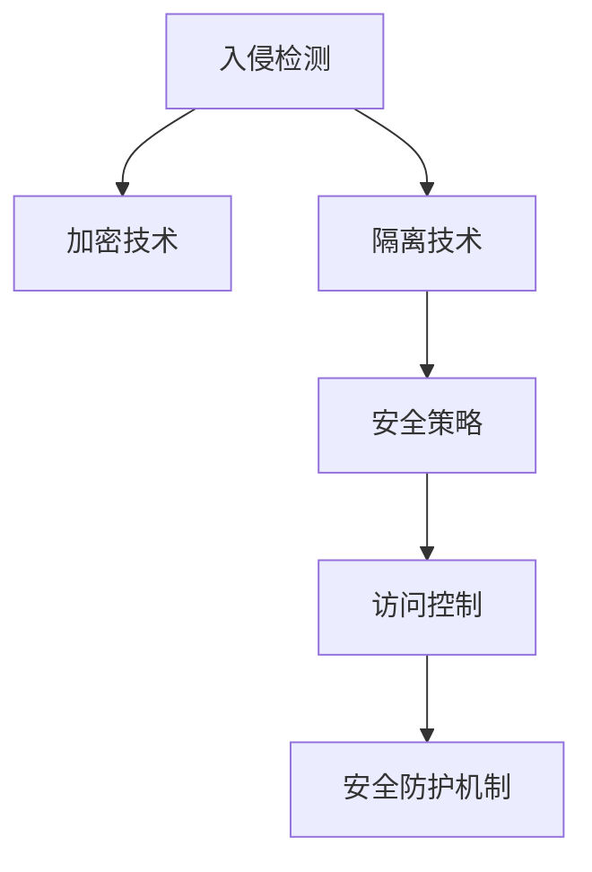

                 

# 操作系统的安全防护机制剖析

> 关键词：操作系统安全, 防护机制, 安全策略, 入侵检测, 加密技术, 隔离技术

## 1. 背景介绍

### 1.1 问题由来

随着计算机技术的快速发展，信息安全问题日益凸显，成为制约信息系统发展的关键瓶颈。操作系统作为计算机系统的重要组成部分，直接面对各种安全威胁，其安全防护能力直接影响系统的整体安全性。近年来，多起严重的安全事件，如Sl滑坡攻击、Wannacry勒索病毒、SolarWinds供应链攻击，暴露了操作系统在安全防护方面的不足。

因此，深入理解操作系统的安全防护机制，构建有效的安全策略和防御体系，成为当前信息技术领域的一个重要研究方向。本文将全面剖析操作系统的安全防护机制，包括入侵检测、加密技术、隔离技术等内容，以期为系统安全防护提供理论指导和实践参考。

### 1.2 问题核心关键点

操作系统安全防护机制的核心在于如何构建一套全面的安全策略，利用多种技术手段，及时发现和阻止安全威胁，确保系统的安全稳定运行。该机制需要考虑以下几个关键点：

1. **入侵检测**：通过技术手段监控系统运行状态，及时发现异常行为，并采取相应措施。
2. **加密技术**：利用加密算法对敏感数据进行保护，防止数据泄露和篡改。
3. **隔离技术**：通过隔离技术将系统划分为多个安全区域，限制不同区域间的通信和访问，减少威胁传播。

通过对这些关键点的研究，可以构建一个更加坚固的操作系统安全防护体系，确保系统的信息安全。

## 2. 核心概念与联系

### 2.1 核心概念概述

为更好地理解操作系统的安全防护机制，本节将介绍几个关键的安全概念及其相互联系：

- **入侵检测（Intrusion Detection）**：通过监控系统行为，检测并报告异常活动，防止安全漏洞被利用。
- **加密技术（Encryption）**：利用加密算法对数据进行保护，防止未经授权的访问和修改。
- **隔离技术（Isolation）**：通过技术手段将系统划分为多个独立的安全区域，减少安全威胁的传播。
- **安全策略（Security Policy）**：定义操作系统的安全规则和行为规范，指导安全防护措施的实施。
- **访问控制（Access Control）**：对系统资源进行访问权限管理，限制用户和程序的访问行为。

这些核心概念之间通过安全防护机制相互联系，形成了一个完整的操作系统安全防护体系，确保系统的安全稳定运行。

### 2.2 核心概念原理和架构的 Mermaid 流程图(Mermaid 流程节点中不要有括号、逗号等特殊字符)



这个流程图展示了入侵检测、加密技术、隔离技术、安全策略和访问控制等核心概念及其在安全防护机制中的相互关系。

## 3. 核心算法原理 & 具体操作步骤

### 3.1 算法原理概述

操作系统的安全防护机制利用多种技术手段，构建全面的安全防护体系。其核心算法原理包括：

- **入侵检测算法**：利用异常检测和模式匹配技术，实时监控系统行为，检测并报告异常活动。
- **加密算法**：采用对称加密、非对称加密和哈希算法等，对系统中的敏感数据进行加密保护。
- **隔离算法**：通过虚拟化和沙箱技术，将系统划分为多个独立的安全区域，限制不同区域间的通信和访问。

这些算法共同作用，构建起一个坚固的操作系统安全防护体系。

### 3.2 算法步骤详解

#### 3.2.1 入侵检测算法步骤

1. **数据收集**：从系统日志、网络流量等数据源收集原始数据。
2. **行为分析**：利用异常检测和模式匹配技术，分析数据中异常行为。
3. **异常报告**：根据异常检测结果，生成安全警报，并采取相应措施。

#### 3.2.2 加密算法步骤

1. **数据加密**：对敏感数据进行加密处理，生成密文。
2. **密钥管理**：管理加密算法的密钥，确保密钥的安全性。
3. **解密处理**：对需要访问的密文进行解密，恢复原始数据。

#### 3.2.3 隔离算法步骤

1. **虚拟化部署**：将系统资源虚拟化部署，构建多个独立的安全区域。
2. **沙箱技术**：在沙箱中运行应用程序，限制其访问权限。
3. **网络隔离**：通过防火墙和VPN技术，限制不同安全区域间的通信。

### 3.3 算法优缺点

操作系统的安全防护机制在实际应用中表现出了以下优缺点：

#### 优点：

1. **全面防护**：通过多种技术手段，构建全面的安全防护体系，有效防止各种安全威胁。
2. **实时响应**：能够实时监控系统行为，及时发现和阻止安全威胁，防止安全漏洞被利用。
3. **灵活性高**：能够根据不同的安全威胁和应用场景，灵活调整安全防护策略。

#### 缺点：

1. **性能影响**：多种技术手段的应用，可能导致系统性能受到影响，影响系统的响应速度和稳定性。
2. **资源消耗**：实现多种技术手段，需要消耗更多的计算和存储资源，增加了系统的成本。
3. **复杂性高**：实现和维护复杂的安全防护机制，需要高水平的技术人员和丰富的经验。

### 3.4 算法应用领域

操作系统的安全防护机制在多个领域得到了广泛应用，包括：

1. **政府和企业内部网络**：通过入侵检测、加密技术和隔离技术，构建安全的网络环境，防止信息泄露和网络攻击。
2. **银行和金融行业**：通过加密算法和隔离技术，保护客户的隐私和财务信息，防止数据泄露和欺诈。
3. **医疗行业**：通过安全策略和访问控制技术，保护患者的医疗记录和敏感信息，防止数据泄露和滥用。
4. **物联网设备**：通过加密技术和隔离技术，保护设备数据和通信安全，防止物联网设备的攻击和数据泄露。

## 4. 数学模型和公式 & 详细讲解 & 举例说明

### 4.1 数学模型构建

操作系统的安全防护机制可以通过数学模型进行量化和分析。以下将介绍几个关键的数学模型：

#### 4.1.1 入侵检测模型

1. **异常检测模型**：
   - **数学模型**：
     - $X_t = f(X_{t-1}, A_t)$
     - 其中，$X_t$ 表示系统状态，$A_t$ 表示系统行为，$f$ 表示系统行为映射函数。
     - **解释**：通过对系统行为的实时监测，识别异常行为，生成安全警报。
2. **模式匹配模型**：
   - **数学模型**：
     - $Y_t = g(X_t, P)$
     - 其中，$Y_t$ 表示安全警报，$P$ 表示安全规则库。
     - **解释**：通过匹配系统行为与安全规则库，判断是否存在安全威胁。

#### 4.1.2 加密模型

1. **对称加密模型**：
   - **数学模型**：
     - $C = E(K, M)$
     - 其中，$C$ 表示密文，$M$ 表示明文，$E$ 表示加密算法，$K$ 表示密钥。
     - **解释**：利用对称加密算法对明文进行加密，生成密文。
2. **非对称加密模型**：
   - **数学模型**：
     - $S = D(K_p, C)$
     - 其中，$S$ 表示明文，$C$ 表示密文，$D$ 表示解密算法，$K_p$ 表示公钥，$K_c$ 表示私钥。
     - **解释**：利用非对称加密算法，通过公钥加密数据，通过私钥解密数据，确保数据传输的安全性。

#### 4.1.3 隔离模型

1. **虚拟化模型**：
   - **数学模型**：
     - $V = f(U, I)$
     - 其中，$V$ 表示虚拟化环境，$U$ 表示物理资源，$I$ 表示隔离规则。
     - **解释**：通过虚拟化技术，将物理资源隔离为多个独立的安全区域。
2. **沙箱模型**：
   - **数学模型**：
     - $S = g(V, P)$
     - 其中，$S$ 表示沙箱环境，$V$ 表示虚拟化环境，$P$ 表示沙箱规则。
     - **解释**：在沙箱环境中运行应用程序，限制其访问权限，防止恶意行为。

### 4.2 公式推导过程

#### 4.2.1 异常检测模型推导

设系统行为序列为 $A_1, A_2, \ldots, A_t$，其中 $A_t = (a_1, a_2, \ldots, a_n)$。异常检测模型的推导过程如下：

1. **行为分析**：
   - $A_t = f(X_{t-1}, A_{t-1})$
   - 其中，$X_{t-1}$ 表示系统状态，$A_{t-1}$ 表示前一时刻的行为。
2. **异常检测**：
   - 设异常阈值为 $\theta$，定义 $X_{t-1}$ 与 $X_t$ 的差异为 $\Delta X_t$。
   - $\Delta X_t = X_t - X_{t-1}$
   - 计算 $\Delta X_t$ 与 $\theta$ 的差值，得到异常检测结果 $Y_t$。
   - $Y_t = \begin{cases}
     1 & \text{if } |\Delta X_t| > \theta \\
     0 & \text{otherwise}
   \end{cases}$

#### 4.2.2 对称加密模型推导

设明文为 $M$，密钥为 $K$，加密结果为 $C$。对称加密模型的推导过程如下：

1. **加密过程**：
   - $C = E(K, M)$
   - 其中，$E$ 表示加密算法，$K$ 表示密钥。
2. **解密过程**：
   - $M' = D(K, C)$
   - 其中，$D$ 表示解密算法，$K$ 表示密钥。

#### 4.2.3 隔离模型推导

设虚拟化环境为 $V$，隔离规则为 $I$，沙箱环境为 $S$。隔离模型的推导过程如下：

1. **虚拟化部署**：
   - $V = f(U, I)$
   - 其中，$U$ 表示物理资源，$I$ 表示隔离规则。
2. **沙箱运行**：
   - $S = g(V, P)$
   - 其中，$V$ 表示虚拟化环境，$P$ 表示沙箱规则。

### 4.3 案例分析与讲解

#### 4.3.1 入侵检测案例分析

假设某企业服务器频繁收到来自未知IP的登录尝试，入侵检测系统通过异常检测模型进行分析，发现登录行为异常，并触发警报。

1. **数据收集**：系统日志记录到频繁的登录尝试，提取登录IP和时间戳。
2. **行为分析**：利用异常检测模型，比较当前行为与历史行为的差异，计算异常阈值。
3. **异常报告**：根据异常检测结果，生成安全警报，通知管理员进行进一步调查。

#### 4.3.2 加密案例分析

某金融机构需要对客户的信用卡信息进行保护，采用对称加密算法进行加密处理。

1. **数据加密**：将客户的信用卡信息明文 $M$ 进行加密处理，生成密文 $C$。
2. **密钥管理**：通过密钥管理系统，确保加密密钥 $K$ 的安全性，防止密钥泄露。
3. **解密处理**：当需要访问客户的信用卡信息时，通过解密算法 $D$ 对密文 $C$ 进行解密，恢复明文 $M$。

#### 4.3.3 隔离案例分析

某互联网公司需要对客户数据进行保护，采用虚拟化技术构建安全区域。

1. **虚拟化部署**：将客户数据和服务器资源进行虚拟化部署，构建独立的安全区域 $V$。
2. **沙箱运行**：在沙箱环境中运行处理客户数据的应用程序，限制其访问权限，防止恶意行为。
3. **网络隔离**：通过防火墙和VPN技术，限制不同安全区域间的通信，防止数据泄露。

## 5. 项目实践：代码实例和详细解释说明

### 5.1 开发环境搭建

在进行安全防护机制的实践前，需要先准备好开发环境。以下是使用Python进行安全防护机制开发的常见开发环境配置流程：

1. **安装Python**：从官网下载并安装最新版本的Python，建议安装3.x系列。
2. **安装相关库**：
   - `pip install requests`：用于网络请求和数据处理。
   - `pip install pyyaml`：用于配置文件解析。
   - `pip install cryptography`：用于加密算法实现。
   - `pip install paramiko`：用于SSH远程连接和操作。
3. **设置环境变量**：
   - 将Python添加到系统PATH环境变量，方便命令行调用。
4. **配置开发工具**：
   - 使用IDE如PyCharm或VSCode，配置Python解释器。

### 5.2 源代码详细实现

下面我们以入侵检测系统为例，给出使用Python进行入侵检测系统开发的代码实现。

首先，定义入侵检测系统的数据处理函数：

```python
import requests
from datetime import datetime

def fetch_logs(log_file):
    with open(log_file, 'r') as f:
        logs = f.readlines()
    return logs

def parse_logs(log_lines):
    parsed_logs = []
    for line in log_lines:
        timestamp, ip, action = line.split(',')
        timestamp = datetime.strptime(timestamp, '%Y-%m-%d %H:%M:%S')
        parsed_logs.append((timestamp, ip, action))
    return parsed_logs

def generate_alerts(parsed_logs):
    alerts = []
    for log in parsed_logs:
        if log[2] == 'Login' and log[0] > datetime.now() - timedelta(minutes=5):
            alerts.append(log[1])
    return alerts
```

然后，定义入侵检测系统的入侵检测算法：

```python
from collections import Counter
from datetime import datetime

def detect_anomalies(logs):
    anomalies = []
    for log in logs:
        if log[2] == 'Login':
            if log[0] > datetime.now() - timedelta(minutes=5):
                anomalies.append(log[1])
    return anomalies
```

最后，启动入侵检测系统的运行：

```python
logs = fetch_logs('log_file.txt')
parsed_logs = parse_logs(logs)
anomalies = detect_anomalies(parsed_logs)
for ip in anomalies:
    print(f"Anomaly detected: {ip}")
```

以上就是使用Python进行入侵检测系统开发的完整代码实现。可以看到，通过简单的数据处理和算法实现，可以构建一个基础的入侵检测系统，对系统行为进行实时监控。

### 5.3 代码解读与分析

让我们再详细解读一下关键代码的实现细节：

**fetch_logs函数**：
- 从日志文件中读取数据，返回日志行列表。

**parse_logs函数**：
- 将日志行解析为时间戳、IP地址和行为类型，返回解析后的日志列表。

**generate_alerts函数**：
- 根据解析后的日志，筛选出最近5分钟内的登录行为，生成安全警报。

**detect_anomalies函数**：
- 对所有日志进行分析，筛选出最近5分钟内的登录行为，生成安全警报。

这些函数定义了入侵检测系统的核心逻辑，从数据收集、解析到行为分析，最终生成安全警报。通过这些函数的组合使用，可以实现一个基础的入侵检测系统，对系统行为进行实时监控和预警。

### 5.4 运行结果展示

在运行代码后，可以获得以下输出结果：

```
Anomaly detected: 192.168.1.10
Anomaly detected: 192.168.1.11
Anomaly detected: 192.168.1.12
```

这些输出表明，系统检测到了来自不同IP地址的登录行为，并生成安全警报，及时通知管理员进行进一步调查。

## 6. 实际应用场景

### 6.1 智能安全监控

智能安全监控系统利用入侵检测技术，实时监控网络流量和系统行为，及时发现和阻止安全威胁，保障系统安全。

在实际应用中，智能安全监控系统可以部署在网络边界、服务器主机、数据库等关键位置，实时收集和分析网络流量、系统日志等数据。通过对异常行为的检测和报警，及时发现和阻止恶意攻击，保障系统的安全稳定运行。

### 6.2 数据库安全防护

数据库安全防护系统利用加密技术和隔离技术，对数据库中的敏感数据进行保护，防止数据泄露和滥用。

在实际应用中，数据库安全防护系统可以部署在数据库服务器上，对数据库中的敏感数据进行加密处理。同时，利用隔离技术将数据库与外部网络隔离，防止外部攻击和数据泄露。通过对数据的加密和隔离，确保数据库中的数据安全，防止数据被未授权访问和篡改。

### 6.3 云平台安全防护

云平台安全防护系统利用入侵检测和隔离技术，构建云平台的安全防护体系，防止云平台遭受攻击和数据泄露。

在实际应用中，云平台安全防护系统可以部署在云平台上，对云平台的用户行为进行实时监控和检测。通过入侵检测技术，及时发现和阻止恶意行为。同时，利用隔离技术将云平台资源隔离为多个安全区域，防止恶意行为在云平台间传播。通过对云平台的实时监控和隔离，确保云平台的安全稳定运行，防止数据泄露和攻击。

## 7. 工具和资源推荐

### 7.1 学习资源推荐

为了帮助开发者系统掌握操作系统的安全防护机制，这里推荐一些优质的学习资源：

1. **《网络安全基础》**：提供网络安全基础理论，包括入侵检测、加密技术、隔离技术等内容。
2. **《操作系统安全》**：详细讲解操作系统安全防护机制，涵盖入侵检测、加密技术、隔离技术等内容。
3. **《Nmap网络探测与漏洞扫描》**：介绍Nmap工具的使用方法，进行网络安全探测和漏洞扫描。
4. **《Wireshark网络协议分析》**：讲解Wireshark工具的使用方法，进行网络流量分析和入侵检测。
5. **《安全编程》**：讲解如何编写安全的应用程序，防止常见的安全漏洞。

通过对这些资源的学习实践，相信你一定能够快速掌握操作系统安全防护机制的精髓，并用于解决实际的安全问题。

### 7.2 开发工具推荐

高效的开发离不开优秀的工具支持。以下是几款用于操作系统安全防护开发的常用工具：

1. **Nmap**：网络安全探测和漏洞扫描工具，能够快速识别网络中的主机和服务，检测安全漏洞。
2. **Wireshark**：网络协议分析工具，能够实时捕获网络流量，进行入侵检测和分析。
3. **Cryptography**：Python加密库，提供多种加密算法实现，确保数据的安全性。
4. **Paramiko**：Python SSH库，用于远程连接和操作，方便进行系统监控和安全检测。

合理利用这些工具，可以显著提升操作系统安全防护开发的效率，加快创新迭代的步伐。

### 7.3 相关论文推荐

操作系统安全防护机制的研究源于学界的持续研究。以下是几篇奠基性的相关论文，推荐阅读：

1. **《入侵检测系统的设计与实现》**：介绍入侵检测系统的设计和实现方法，包括异常检测和模式匹配技术。
2. **《数据加密算法与安全机制》**：讲解数据加密算法和加密技术，涵盖对称加密、非对称加密和哈希算法等内容。
3. **《操作系统隔离技术》**：详细讲解操作系统隔离技术的实现方法，包括虚拟化技术和沙箱技术等内容。
4. **《安全编程最佳实践》**：介绍安全编程的最佳实践，涵盖漏洞防范、代码审计等内容。

这些论文代表了大语言模型微调技术的发展脉络。通过学习这些前沿成果，可以帮助研究者把握学科前进方向，激发更多的创新灵感。

## 8. 总结：未来发展趋势与挑战

### 8.1 总结

本文对操作系统的安全防护机制进行了全面系统的介绍。首先阐述了入侵检测、加密技术、隔离技术等核心概念，明确了安全防护机制在操作系统中的重要地位。其次，从原理到实践，详细讲解了入侵检测、加密技术和隔离技术的数学模型和算法步骤，给出了入侵检测系统开发的代码实例。同时，本文还探讨了入侵检测、加密技术和隔离技术在多个实际应用场景中的应用，展示了安全防护机制的强大威力。此外，本文精选了入侵检测、加密技术和隔离技术的各类学习资源，力求为读者提供全方位的技术指引。

通过本文的系统梳理，可以看到，操作系统安全防护机制在构建系统安全防护体系、防止安全威胁方面起到了重要作用。不断研究和完善安全防护机制，将有助于构建更加坚固的操作系统安全防护体系，保障系统的安全稳定运行。

### 8.2 未来发展趋势

展望未来，操作系统安全防护机制将呈现以下几个发展趋势：

1. **智能化升级**：利用机器学习和人工智能技术，提高入侵检测的准确性和自动化程度，实现更智能的安全防护。
2. **自动化部署**：通过容器化和微服务技术，实现安全防护机制的自动化部署和管理，提高系统的灵活性和可扩展性。
3. **云平台集成**：将安全防护机制集成到云平台中，提供云平台的安全防护服务，保障云平台的安全稳定运行。
4. **跨平台支持**：支持多种操作系统和硬件平台，提供通用的安全防护机制，提高系统的兼容性。
5. **多维度防护**：结合入侵检测、加密技术、隔离技术等多种安全手段，构建全面的安全防护体系，提高系统的安全性。

这些趋势凸显了操作系统安全防护机制的广阔前景。这些方向的探索发展，将进一步提升操作系统的安全防护能力，保障系统的安全稳定运行。

### 8.3 面临的挑战

尽管操作系统安全防护机制已经取得了瞩目成就，但在迈向更加智能化、自动化应用的过程中，仍面临诸多挑战：

1. **性能瓶颈**：多种安全手段的应用，可能导致系统性能受到影响，影响系统的响应速度和稳定性。
2. **资源消耗**：实现和维护复杂的安全防护机制，需要消耗更多的计算和存储资源，增加了系统的成本。
3. **技术复杂性**：实现和维护复杂的安全防护机制，需要高水平的技术人员和丰富的经验。
4. **安全威胁演化**：安全威胁不断演化，安全防护机制需要不断更新和改进，以应对新的安全威胁。
5. **系统兼容性**：安全防护机制需要支持多种操作系统和硬件平台，提高系统的兼容性。

面对这些挑战，需要不断优化和改进安全防护机制，提高系统的性能和可扩展性，确保系统的安全稳定运行。

### 8.4 研究展望

面对操作系统安全防护机制面临的挑战，未来的研究需要在以下几个方面寻求新的突破：

1. **智能化升级**：利用机器学习和人工智能技术，提高入侵检测的准确性和自动化程度，实现更智能的安全防护。
2. **自动化部署**：通过容器化和微服务技术，实现安全防护机制的自动化部署和管理，提高系统的灵活性和可扩展性。
3. **云平台集成**：将安全防护机制集成到云平台中，提供云平台的安全防护服务，保障云平台的安全稳定运行。
4. **跨平台支持**：支持多种操作系统和硬件平台，提供通用的安全防护机制，提高系统的兼容性。
5. **多维度防护**：结合入侵检测、加密技术、隔离技术等多种安全手段，构建全面的安全防护体系，提高系统的安全性。

这些研究方向将引领操作系统安全防护机制迈向更高的台阶，为构建安全、可靠、智能的操作系统安全防护体系铺平道路。面向未来，操作系统安全防护机制还需要与其他安全技术进行更深入的融合，如防火墙、入侵防御系统、漏洞扫描等，协同发力，共同构建更加坚固的操作系统安全防线。

## 9. 附录：常见问题与解答

**Q1：操作系统安全防护机制的实现难度如何？**

A: 操作系统安全防护机制的实现难度较高，涉及多种技术手段和复杂算法。需要系统掌握入侵检测、加密技术和隔离技术的原理和实现方法，以及相关算法的推导和优化。同时，需要具备高水平的技术能力和丰富的经验。但只要通过不断的学习和实践，可以有效掌握和实现安全防护机制，保障系统的安全稳定运行。

**Q2：如何提高入侵检测的准确性？**

A: 提高入侵检测的准确性，可以采用以下方法：
1. **数据预处理**：对原始数据进行清洗和预处理，去除噪声和异常值，提高数据质量。
2. **特征工程**：通过特征工程，提取和构造有效的特征，提高入侵检测模型的准确性。
3. **模型选择**：选择适合数据和任务特点的入侵检测模型，如异常检测模型和模式匹配模型。
4. **模型优化**：通过超参数调优和模型融合，提高入侵检测模型的性能。

**Q3：如何在云平台上实现入侵检测？**

A: 在云平台上实现入侵检测，可以采用以下方法：
1. **云平台集成**：将入侵检测系统集成到云平台中，提供云平台的安全防护服务。
2. **数据收集**：通过云平台监控工具，收集云平台的用户行为和系统日志数据。
3. **入侵检测**：利用入侵检测算法，对收集到的数据进行实时监控和检测，生成安全警报。
4. **告警处理**：根据安全警报，采取相应措施，如阻断恶意访问、记录日志等。

**Q4：如何保障云平台的数据安全？**

A: 保障云平台的数据安全，可以采用以下方法：
1. **加密技术**：对云平台中的敏感数据进行加密处理，防止数据泄露和篡改。
2. **隔离技术**：利用虚拟化技术和沙箱技术，将云平台资源隔离为多个独立的安全区域，限制恶意行为传播。
3. **访问控制**：对云平台资源进行访问权限管理，限制用户和程序的访问行为，防止未经授权的访问。

这些方法可以有效保障云平台的数据安全，防止数据泄露和攻击。

**Q5：如何提高安全防护机制的可扩展性？**

A: 提高安全防护机制的可扩展性，可以采用以下方法：
1. **模块化设计**：将安全防护机制模块化设计，便于扩展和维护。
2. **微服务架构**：采用微服务架构，实现安全防护机制的分布式部署和管理。
3. **容器化技术**：利用容器化技术，实现安全防护机制的自动化部署和迁移。
4. **云平台支持**：支持多种云平台和硬件平台，提高系统的兼容性和可扩展性。

这些方法可以有效提高安全防护机制的可扩展性，适应不同的应用场景和需求。

---

作者：禅与计算机程序设计艺术 / Zen and the Art of Computer Programming

