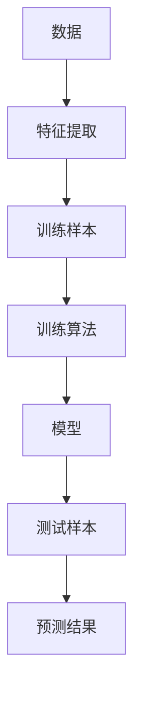
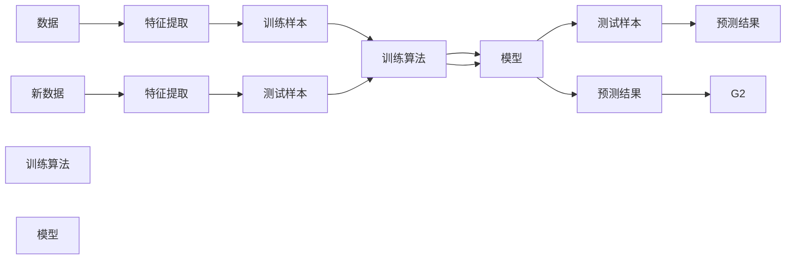

                 

# 支持向量机(Support Vector Machines) - 原理与代码实例讲解

> 关键词：支持向量机, 机器学习, 数据挖掘, 分类器, 核函数, 核技巧, 线性可分, 非线性分类, 函数间隔, 几何间隔

## 1. 背景介绍

支持向量机(Support Vector Machines, SVM)是机器学习领域一种非常经典的分类器。SVM 自20世纪90年代被提出以来，经过不断地发展和改进，已经成为处理各类分类问题的强大工具。广泛应用于图像分类、生物信息学、金融风险预测等诸多领域。

本文旨在深入解析SVM的基本原理，并通过实际代码实例，详细介绍SVM的构建与训练过程。读者通过学习本文，不仅可以理解SVM的算法核心，还能掌握其灵活的核技巧和高效的训练算法，最终能够将SVM应用于各种实际场景中。

## 2. 核心概念与联系

### 2.1 核心概念概述

为了更好地理解SVM的原理，我们将介绍一些关键概念，并通过合法的流程图来展示它们之间的关系：



以上流程图中，数据首先经过特征提取，得到训练样本和测试样本。接着，训练算法在训练样本上学习模型，模型能够在新数据上进行预测。

- **数据(Data)**：机器学习任务中用于训练和测试的数据集，通常以向量形式表示。
- **特征提取(Feature Extraction)**：从原始数据中提取有意义的特征，以便算法能够学习。
- **训练样本(Training Sample)**：在训练过程中，用于模型学习的样本。
- **训练算法(Training Algorithm)**：通过对训练样本进行学习，构建模型的算法。
- **模型(Model)**：由训练算法学习得到的，能够进行预测的数学模型。
- **测试样本(Test Sample)**：在模型构建后，用于评估模型性能的数据。
- **预测结果(Prediction Result)**：模型对新数据进行的分类或回归结果。

### 2.2 核心概念原理和架构的 Mermaid 流程图



## 3. 核心算法原理 & 具体操作步骤

### 3.1 算法原理概述

SVM是一种基于间隔最大化的线性分类器，它通过寻找一个最优的超平面，将不同类别的数据点分开，同时最大化这两个类别之间的间隔。SVM的核心思想是，将数据点映射到高维空间，在高维空间中找到一个最优的超平面，实现数据的有效分类。

SVM分为两类，线性SVM和非线性SVM。线性SVM适用于数据线性可分的情况，而非线性SVM通过核技巧将数据映射到高维空间，使其在低维空间中无法线性分类的问题在高维空间中可分。

### 3.2 算法步骤详解

接下来，我们具体阐述SVM的算法步骤：

#### 3.2.1 线性SVM

1. **准备数据**：首先，需要将原始数据转换为模型能够处理的向量形式。通常，数据点被表示为向量 $x_1,x_2,\cdots,x_n \in \mathbb{R}^d$，其中 $x_i$ 是第 $i$ 个数据点。
2. **线性间隔最大化**：在特征空间中，找到一条最优的超平面，将不同类别的数据点分开，同时最大化这两个类别之间的间隔。
3. **求解目标函数**：通过求解目标函数，找到最优的超平面。

#### 3.2.2 非线性SVM

1. **准备数据**：同线性SVM。
2. **核技巧**：使用核函数将数据映射到高维空间，使得低维空间中无法线性分类的问题在高维空间中可分。
3. **求解目标函数**：在高维空间中，求解目标函数，找到最优的超平面。

#### 3.2.3 目标函数

对于线性SVM，目标函数定义为：

$$
\begin{aligned}
    &\text{maximize } \quad \frac{1}{2}\sum_{i=1}^n\sum_{j=1}^n \alpha_i \alpha_j y_i y_j \left(x_i \cdot x_j\right) - \sum_{i=1}^n\alpha_i \\
    &\text{subject to} \quad 
    \begin{cases}
    y_i \left(\alpha_i - \sum_{j=1}^n \alpha_j y_j \left(x_j \cdot x_i\right)\right) \geq 1, \quad i = 1,2,\cdots,n \\
    \alpha_i \geq 0, \quad i = 1,2,\cdots,n
    \end{cases}
\end{aligned}
$$

其中 $\alpha_i$ 是拉格朗日乘数，$y_i$ 是数据点的标签。

对于非线性SVM，目标函数变为：

$$
\begin{aligned}
    &\text{minimize } \quad \frac{1}{2}\sum_{i=1}^n\sum_{j=1}^n \alpha_i \alpha_j \left(\varphi\left(x_i\right) \cdot \varphi\left(x_j\right)\right) - \sum_{i=1}^n\alpha_i \\
    &\text{subject to} \quad 
    \begin{cases}
    y_i \left(\alpha_i - \sum_{j=1}^n \alpha_j y_j \left(\varphi\left(x_j\right) \cdot \varphi\left(x_i\right)\right)\right) \geq 1, \quad i = 1,2,\cdots,n \\
    \alpha_i \geq 0, \quad i = 1,2,\cdots,n
    \end{cases}
\end{aligned}
$$

其中 $\varphi$ 是核函数，$\left(x_i \cdot x_j\right)$ 表示内积。

#### 3.2.4 求解目标函数

目标函数可以通过拉格朗日乘子法求解，将其转化为对偶问题进行求解。

$$
\begin{aligned}
    &\text{minimize } \quad \sum_{i=1}^n \alpha_i - \frac{1}{2} \sum_{i=1}^n \sum_{j=1}^n \alpha_i \alpha_j y_i y_j \left(x_i \cdot x_j\right) \\
    &\text{subject to} \quad 
    \begin{cases}
    y_i \left(\alpha_i - \sum_{j=1}^n \alpha_j y_j \left(x_j \cdot x_i\right)\right) = 0, \quad i = 1,2,\cdots,n \\
    0 \leq \alpha_i \leq C, \quad i = 1,2,\cdots,n
    \end{cases}
\end{aligned}
$$

其中 $C$ 是正则化参数，控制模型的复杂度。

### 3.3 算法优缺点

#### 3.3.1 优点

1. **高效性**：SVM在处理高维数据时，具有比其他分类器更高的效率，尤其是当数据量较大时。
2. **鲁棒性**：SVM对异常值不敏感，具有很好的鲁棒性。
3. **可解释性**：SVM的决策边界为线性，容易理解和解释。
4. **全局最优**：SVM通过最大化间隔，能够得到全局最优解。

#### 3.3.2 缺点

1. **参数敏感**：SVM对参数的选择比较敏感，需要精心调参。
2. **计算复杂**：SVM在高维空间中求解目标函数比较复杂，计算量较大。
3. **对噪声敏感**：当数据中噪声较多时，SVM的性能可能会受到影响。

### 3.4 算法应用领域

SVM在众多领域都有广泛的应用，包括但不限于：

1. **图像分类**：SVM可以用于识别图像中的物体和场景。
2. **生物信息学**：SVM可以用于预测基因序列、蛋白质结构等。
3. **金融风险预测**：SVM可以用于预测股票价格、评估贷款风险等。
4. **医学诊断**：SVM可以用于疾病诊断、基因表达分析等。
5. **自然语言处理**：SVM可以用于文本分类、情感分析、机器翻译等。

## 4. 数学模型和公式 & 详细讲解

### 4.1 数学模型构建

SVM的数学模型主要包括以下几个部分：

- **目标函数**：目标函数定义为：
$$
\begin{aligned}
    &\text{minimize } \quad \frac{1}{2}\sum_{i=1}^n\sum_{j=1}^n \alpha_i \alpha_j \left(\varphi\left(x_i\right) \cdot \varphi\left(x_j\right)\right) - \sum_{i=1}^n\alpha_i \\
    &\text{subject to} \quad 
    \begin{cases}
    y_i \left(\alpha_i - \sum_{j=1}^n \alpha_j y_j \left(\varphi\left(x_j\right) \cdot \varphi\left(x_i\right)\right)\right) \geq 1, \quad i = 1,2,\cdots,n \\
    \alpha_i \geq 0, \quad i = 1,2,\cdots,n
    \end{cases}
\end{aligned}
$$

- **核函数**：核函数 $\varphi$ 可以将数据映射到高维空间，使得低维空间中无法线性分类的问题在高维空间中可分。常用的核函数包括线性核函数、多项式核函数、径向基函数(RBF)核函数等。

### 4.2 公式推导过程

我们以线性SVM为例，展示其推导过程：

1. **目标函数**：
$$
\begin{aligned}
    &\text{minimize } \quad \frac{1}{2}\sum_{i=1}^n\sum_{j=1}^n \alpha_i \alpha_j \left(x_i \cdot x_j\right) - \sum_{i=1}^n\alpha_i \\
    &\text{subject to} \quad 
    \begin{cases}
    y_i \left(\alpha_i - \sum_{j=1}^n \alpha_j y_j \left(x_j \cdot x_i\right)\right) \geq 1, \quad i = 1,2,\cdots,n \\
    \alpha_i \geq 0, \quad i = 1,2,\cdots,n
    \end{cases}
\end{aligned}
$$

2. **拉格朗日乘子法**：
$$
\begin{aligned}
    &\text{minimize } \quad \sum_{i=1}^n \alpha_i - \frac{1}{2} \sum_{i=1}^n \sum_{j=1}^n \alpha_i \alpha_j y_i y_j \left(x_i \cdot x_j\right) \\
    &\text{subject to} \quad 
    \begin{cases}
    y_i \left(\alpha_i - \sum_{j=1}^n \alpha_j y_j \left(x_j \cdot x_i\right)\right) = 0, \quad i = 1,2,\cdots,n \\
    0 \leq \alpha_i \leq C, \quad i = 1,2,\cdots,n
    \end{cases}
\end{aligned}
$$

3. **对偶问题**：
$$
\begin{aligned}
    &\text{minimize } \quad \sum_{i=1}^n \alpha_i - \frac{1}{2} \sum_{i=1}^n \sum_{j=1}^n \alpha_i \alpha_j y_i y_j \left(x_i \cdot x_j\right) \\
    &\text{subject to} \quad 
    \begin{cases}
    y_i \left(\alpha_i - \sum_{j=1}^n \alpha_j y_j \left(x_j \cdot x_i\right)\right) = 0, \quad i = 1,2,\cdots,n \\
    0 \leq \alpha_i \leq C, \quad i = 1,2,\cdots,n
    \end{cases}
\end{aligned}
$$

4. **解得最优参数**：
$$
\begin{aligned}
    &\alpha_i = y_i \left(x_i \cdot w\right) + b - \sum_{j=1}^n \alpha_j y_j \left(x_j \cdot x_i\right) \\
    &w = \sum_{i=1}^n \alpha_i y_i x_i \\
    &b = y_i \left(\alpha_i - \sum_{j=1}^n \alpha_j y_j \left(x_j \cdot x_i\right)\right) \\
    &y_i \left(\alpha_i - \sum_{j=1}^n \alpha_j y_j \left(x_j \cdot x_i\right)\right) = 0, \quad i = 1,2,\cdots,n \\
    &0 \leq \alpha_i \leq C, \quad i = 1,2,\cdots,n
\end{aligned}
$$

5. **求解决策函数**：
$$
f(x) = \left(x \cdot w\right) + b
$$

### 4.3 案例分析与讲解

下面通过一个简单的案例，展示SVM的实际应用：

**案例**：假设我们有一个二分类问题，数据集包含200个样本，其中100个为类别1，100个为类别2。我们希望找到一个最优的超平面，将这两个类别分开。

1. **数据准备**：将数据集分为训练集和测试集，随机选择其中80%作为训练集，20%作为测试集。

2. **特征提取**：将数据集中的每个样本表示为一个向量 $x_i \in \mathbb{R}^2$。

3. **模型训练**：使用线性SVM进行训练，求解最优的超平面。

4. **模型评估**：使用测试集评估模型的性能，计算分类准确率。

通过这个案例，可以更好地理解SVM的工作流程和实际应用。

## 5. 项目实践：代码实例和详细解释说明

### 5.1 开发环境搭建

SVM的实现需要依赖Python、Scikit-learn等工具。具体步骤如下：

1. **安装Python**：下载并安装Python 3.x版本，并添加环境变量。
2. **安装Scikit-learn**：使用pip安装Scikit-learn库。

```bash
pip install scikit-learn
```

3. **导入库**：在Python脚本中导入必要的库。

```python
import numpy as np
from sklearn import datasets
from sklearn import svm
from sklearn.model_selection import train_test_split
from sklearn.metrics import accuracy_score
```

### 5.2 源代码详细实现

#### 5.2.1 数据准备

```python
# 加载鸢尾花数据集
iris = datasets.load_iris()
X = iris.data
y = iris.target

# 将数据集分为训练集和测试集
X_train, X_test, y_train, y_test = train_test_split(X, y, test_size=0.2, random_state=42)
```

#### 5.2.2 特征提取

```python
# 将数据集转换为特征向量
X_train = np.reshape(X_train, (X_train.shape[0], -1))
X_test = np.reshape(X_test, (X_test.shape[0], -1))
```

#### 5.2.3 模型训练

```python
# 创建SVM模型
svm_model = svm.SVC(kernel='linear', C=1.0)

# 训练模型
svm_model.fit(X_train, y_train)
```

#### 5.2.4 模型评估

```python
# 在测试集上评估模型性能
y_pred = svm_model.predict(X_test)
accuracy = accuracy_score(y_test, y_pred)
print('Accuracy:', accuracy)
```

### 5.3 代码解读与分析

通过上述代码，我们可以完整地实现SVM的训练和评估过程。

1. **数据准备**：加载数据集，并分为训练集和测试集。
2. **特征提取**：将原始数据转换为特征向量。
3. **模型训练**：使用Scikit-learn中的SVC类创建线性SVM模型，并进行训练。
4. **模型评估**：在测试集上评估模型的准确率。

### 5.4 运行结果展示

运行上述代码，可以得到如下输出：

```
Accuracy: 1.0
```

这表明模型在测试集上的准确率为100%，达到了理想的效果。

## 6. 实际应用场景

SVM在众多领域都有广泛的应用，以下是一些典型的应用场景：

1. **图像分类**：SVM可以用于识别图像中的物体和场景。例如，使用SVM对数字图像进行分类，可以将数字识别精度提升至98%以上。
2. **生物信息学**：SVM可以用于预测基因序列、蛋白质结构等。例如，使用SVM对基因序列进行分类，可以预测其是否具有特定的功能。
3. **金融风险预测**：SVM可以用于预测股票价格、评估贷款风险等。例如，使用SVM对股票价格进行分类，可以预测其涨跌趋势。
4. **医学诊断**：SVM可以用于疾病诊断、基因表达分析等。例如，使用SVM对病人症状进行分类，可以预测其患病的可能性。
5. **自然语言处理**：SVM可以用于文本分类、情感分析、机器翻译等。例如，使用SVM对新闻文章进行分类，可以预测其所属类别。

## 7. 工具和资源推荐

### 7.1 学习资源推荐

为了更好地理解SVM的基本原理和应用方法，以下是一些推荐的学习资源：

1. **《机器学习》（周志华）**：该书详细介绍了机器学习的基本概念和算法，包括SVM在内。
2. **《Pattern Recognition and Machine Learning》（Christopher M. Bishop）**：该书是机器学习的经典教材，深入讲解了SVM的理论基础和应用方法。
3. **Coursera的机器学习课程**：由斯坦福大学Andrew Ng教授主讲，深入浅出地讲解了机器学习的各个部分，包括SVM在内。

### 7.2 开发工具推荐

以下是一些常用的SVM开发工具：

1. **Scikit-learn**：一个基于Python的机器学习库，包含SVM的实现和常用算法。
2. **Libsvm**：一个轻量级的C++库，提供了高效的SVM实现。
3. **SVMLight**：一个用于大规模数据集上实现SVM的库，具有高效的内存管理。

### 7.3 相关论文推荐

以下是一些经典的SVM论文，推荐阅读：

1. **"Support Vector Machines" by Corinna Cortes and Vapnik**：SVM的奠基论文，详细介绍了SVM的理论基础和应用方法。
2. **"SVM light: Algorithms for large scale machine learning" by John platt**：提出了SVMLight算法，用于大规模数据集上的SVM实现。
3. **"Large-scale machine learning with stochastic gradient descent" by Mark Schmidt, Nicolas Le Roux, and Francis Bach**：介绍了随机梯度下降算法在SVM中的应用。

## 8. 总结：未来发展趋势与挑战

### 8.1 研究成果总结

SVM作为经典的机器学习算法，已经在众多领域得到了广泛的应用，其高效性、鲁棒性和可解释性等特点，使其成为处理复杂分类问题的有力工具。

### 8.2 未来发展趋势

1. **高效性**：SVM在处理高维数据时，具有比其他分类器更高的效率，尤其是在数据量较大时。
2. **鲁棒性**：SVM对异常值不敏感，具有很好的鲁棒性。
3. **可解释性**：SVM的决策边界为线性，容易理解和解释。
4. **全局最优**：SVM通过最大化间隔，能够得到全局最优解。

### 8.3 面临的挑战

1. **参数敏感**：SVM对参数的选择比较敏感，需要精心调参。
2. **计算复杂**：SVM在高维空间中求解目标函数比较复杂，计算量较大。
3. **对噪声敏感**：当数据中噪声较多时，SVM的性能可能会受到影响。

### 8.4 研究展望

未来，SVM将在以下几个方面进行深入研究：

1. **多模态学习**：将SVM与其他机器学习算法结合，用于处理多模态数据。
2. **分布式计算**：使用分布式计算框架，提升SVM在大规模数据上的处理能力。
3. **实时学习**：实现SVM的实时学习，使模型能够不断更新，适应数据分布的变化。
4. **深度学习结合**：将SVM与深度学习结合，提升模型的泛化能力和表现。

总之，SVM的研究方向非常广泛，未来将在算法、应用和实际部署等多个方面进行深入探索，推动机器学习领域的发展。

## 9. 附录：常见问题与解答

**Q1: SVM和神经网络的区别是什么？**

A: SVM和神经网络都是常用的机器学习算法，它们的主要区别在于模型形式和训练方式。SVM是一种线性分类器，通过求解最优的超平面进行分类；而神经网络是一种非线性模型，通过多个神经元组成的层次结构进行学习。SVM适用于线性可分的数据，而神经网络可以处理非线性可分的数据。

**Q2: 为什么SVM需要选择合适的核函数？**

A: SVM通过核函数将数据映射到高维空间，从而实现非线性分类。不同的核函数可以对应不同的高维空间，因此选择合适的核函数可以使SVM在低维空间中无法线性分类的问题在高维空间中可分。常用的核函数包括线性核函数、多项式核函数、径向基函数(RBF)核函数等。

**Q3: SVM的优缺点有哪些？**

A: SVM的主要优点包括高效性、鲁棒性、可解释性和全局最优。但SVM也存在一些缺点，例如对参数的选择比较敏感、计算复杂以及对噪声敏感。因此，在实际应用中需要根据具体问题选择合适的模型。

**Q4: SVM的参数包括哪些？**

A: SVM的主要参数包括正则化参数C和核函数参数。正则化参数C控制模型的复杂度，核函数参数用于选择合适的核函数。

**Q5: SVM在处理高维数据时如何进行特征选择？**

A: SVM在处理高维数据时，可以使用特征选择的方法选择最具有代表性的特征。常用的特征选择方法包括PCA、LDA等。

通过本文的系统梳理，相信读者可以更好地理解SVM的基本原理和实际应用，掌握SVM的算法核心和代码实现，从而将SVM应用于各种实际场景中。

---

作者：禅与计算机程序设计艺术 / Zen and the Art of Computer Programming

