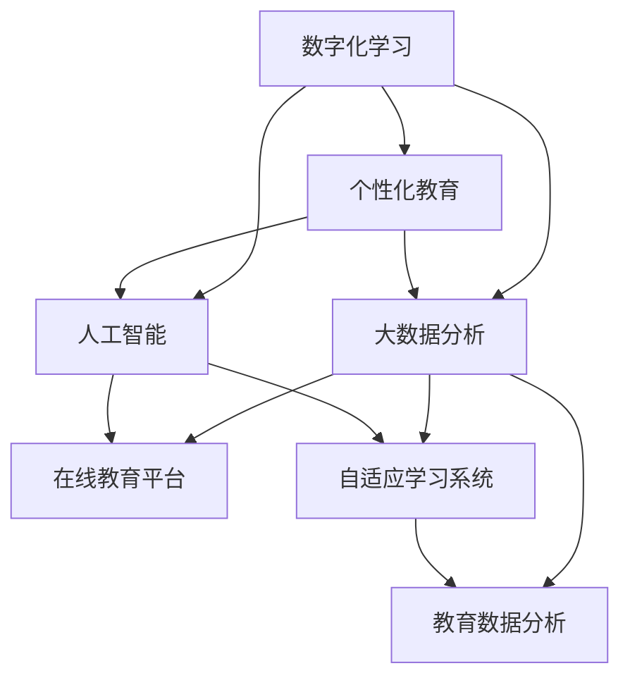

                 

# 数字化学习创业：个性化教育的技术支持

> 关键词：
- 数字化学习
- 个性化教育
- 大数据分析
- 人工智能
- 在线教育平台
- 自适应学习系统
- 教育数据分析

## 1. 背景介绍

### 1.1 问题由来
随着互联网技术的普及和信息时代的到来，传统教育模式正面临巨大挑战。面对日新月异的知识更新和个性化学习需求，传统的“一刀切”式教育方式已难以满足需求。在这样的大背景下，数字化学习和个性化教育应运而生，成为教育领域的新趋势。

数字化学习利用数字化技术手段，将教育资源以数字化的形式呈现，使得学习者可以随时随地、按需进行学习，极大提高了学习的灵活性和便捷性。个性化教育则强调根据学生的个体差异和实际需求，定制化地设计学习路径和内容，实现因材施教，提升学习效果。

### 1.2 问题核心关键点
1. **数据收集与分析**：个性化教育的实施依赖于大量的学习数据，如何高效、准确地收集和分析这些数据，是实现个性化教育的基础。
2. **学习路径设计**：根据学生的学习行为和表现，智能地生成个性化学习路径，使每个学生的学习进度和难度适切其能力水平。
3. **资源推荐系统**：通过推荐系统精准推送适合的学习资源，辅助学生进行高效学习。
4. **自适应学习系统**：根据学生的学习反馈和进度，动态调整教学内容和难度，适应学生学习状态的变化。
5. **智能评估与反馈**：采用智能评估技术，及时反馈学习效果，提供个性化的指导和建议，帮助学生改进学习策略。

### 1.3 问题研究意义
1. **提高学习效率**：通过个性化教育，学生可以根据自己的兴趣和能力选择学习内容和节奏，大大提高学习效率。
2. **促进公平教育**：个性化教育能够照顾到每个学生的独特需求，减少教育资源的不均衡分配，促进教育公平。
3. **培养创新人才**：个性化教育能够激发学生的创新潜力和独特思考，培养未来社会的创新人才。
4. **降低教育成本**：数字化学习平台可以重复使用优质教育资源，减少传统教育中的时间和成本浪费。
5. **推动教育行业转型**：数字化学习和个性化教育将推动整个教育行业的转型升级，实现教育现代化。

## 2. 核心概念与联系

### 2.1 核心概念概述

为更好地理解个性化教育的数字化实现，本节将介绍几个密切相关的核心概念：

- **数字化学习**：指利用数字技术和网络平台进行的学习活动，包括电子书、在线课程、虚拟实验室等多种形式。
- **个性化教育**：指根据学生的个性化需求和能力水平，量身定制学习路径和内容的教育方式，实现因材施教。
- **大数据分析**：指利用大规模数据进行统计分析，提取有价值的信息和知识，用于辅助决策和优化。
- **人工智能**：指利用计算机技术模拟人类智能，实现学习路径设计、资源推荐、智能评估等。
- **在线教育平台**：指通过互联网提供学习资源的平台，如MOOCs（大规模开放在线课程）、SPOCs（小规模在线课程）等。
- **自适应学习系统**：指根据学生的学习表现和反馈，动态调整教学内容和学习路径的学习系统。
- **教育数据分析**：指对教育领域的数据进行收集、清洗、分析、可视化的过程，用于优化教学策略和提升教育效果。

这些概念之间的逻辑关系可以通过以下Mermaid流程图来展示：



这个流程图展示了大数据、人工智能等技术在数字化学习和个性化教育中的作用：

1. **数字化学习**：作为基础，提供丰富的学习资源和平台支持。
2. **个性化教育**：利用大数据和人工智能技术，实现因材施教。
3. **在线教育平台**：通过互联网实现数字化学习的广泛传播。
4. **自适应学习系统**：根据学习者的反馈动态调整教学内容，提升学习效果。
5. **教育数据分析**：通过数据驱动，优化教学策略和评估效果。

## 3. 核心算法原理 & 具体操作步骤
### 3.1 算法原理概述

个性化教育的数字化实现，本质上是利用人工智能和大数据分析技术，对学习者的数据进行深度挖掘和分析，动态调整学习路径和内容，实现个性化教学的过程。其核心思想是：

1. **数据驱动**：以学生的学习行为和表现数据为依据，实时调整教学策略。
2. **自适应**：根据学生的反馈和学习状态，动态调整学习内容和学习节奏。
3. **智能推荐**：利用推荐算法，精准推送适合的学习资源。
4. **评估反馈**：采用智能评估技术，及时反馈学习效果，提供个性化的指导和建议。

### 3.2 算法步骤详解

个性化教育的数字化实现主要包括以下几个关键步骤：

**Step 1: 数据收集与预处理**
- 收集学生的基本信息（如年龄、年级、兴趣等）和学习行为数据（如学习时间、学习内容、测试成绩等）。
- 利用数据清洗和归一化技术，处理缺失值和异常值，确保数据的质量。

**Step 2: 学习行为分析**
- 利用数据挖掘技术，分析学生的学习行为和偏好，识别学生的学习风格、兴趣领域等。
- 通过聚类算法、关联规则等方法，发现学生间的共性特征和差异，为个性化教育提供依据。

**Step 3: 学习路径设计**
- 根据学生的学习行为和表现，设计个性化的学习路径，包括推荐的学习资源、学习顺序和难度调整。
- 利用推荐系统算法，如协同过滤、基于内容的推荐等，精准推荐适合的学习资源。

**Step 4: 自适应学习系统实现**
- 根据学生的学习反馈和进度，实时调整教学内容和难度，适应学生学习状态的变化。
- 设计自适应算法，如学习曲线分析、适应性学习策略等，动态调整学习路径。

**Step 5: 智能评估与反馈**
- 采用智能评估技术，及时反馈学习效果，评估学生的掌握程度和进步情况。
- 提供个性化的指导和建议，帮助学生改进学习策略。

### 3.3 算法优缺点

个性化教育的数字化实现具有以下优点：
1. **高效便捷**：数字化学习打破了时间和空间的限制，提供灵活便捷的学习方式。
2. **因材施教**：个性化教育能够根据学生的特点和需求，量身定制学习路径和内容，提升学习效果。
3. **数据驱动**：利用大数据和人工智能技术，实现数据驱动的教学决策，优化教学策略。
4. **精准推荐**：通过推荐系统，精准推送适合的学习资源，提升学习效率。
5. **智能评估**：智能评估技术能够及时反馈学习效果，提供个性化指导，促进学生进步。

同时，该方法也存在一定的局限性：
1. **数据隐私**：大量学习数据的收集和使用，可能涉及学生隐私，需要严格的数据保护措施。
2. **技术门槛高**：实现个性化教育需要复杂的数据分析和智能算法，对技术要求较高。
3. **成本高**：数字化学习和个性化教育需要先进的设备和软件支持，成本较高。
4. **适应性问题**：个性化教育需要针对不同学生设计不同的学习路径，可能难以兼顾所有学生的需要。

尽管存在这些局限性，但数字化学习和个性化教育在提升学习效果、促进教育公平方面具有重要价值，值得持续探索和优化。

### 3.4 算法应用领域

个性化教育的数字化实现已经在多个领域得到应用，例如：

1. **基础教育**：利用数字化平台和个性化教育技术，为学生提供差异化的学习内容和路径，提升学习效果。
2. **职业培训**：通过在线课程和自适应学习系统，根据学员的学习需求和进度，提供个性化职业培训。
3. **远程教育**：在远程教育中，利用数字化平台和智能推荐系统，提供灵活便捷的学习方式。
4. **终身学习**：为成年人提供灵活的学习机会，支持终身学习和职业提升。
5. **特殊教育**：利用个性化教育技术，为有特殊需求的学生提供定制化的教育方案。

## 4. 数学模型和公式 & 详细讲解 & 举例说明

### 4.1 数学模型构建

个性化教育的数字化实现，涉及多个子模型，包括学习行为分析、学习路径设计、自适应学习系统等。以下以学习路径设计为例，构建数学模型。

假设学生 $i$ 在学习资源 $j$ 上的学习效果为 $z_{ij}$，目标是最小化学习效果与期望值 $y_i$ 的误差，即：

$$
\min \sum_i ||z_i - y_i||^2
$$

其中 $z_i$ 为学生 $i$ 的学习效果向量，$y_i$ 为期望值向量。

### 4.2 公式推导过程

为了求解上述优化问题，可以采用梯度下降等优化算法。假设优化目标为 $\mathcal{L}(z)$，则梯度下降的更新公式为：

$$
z_i \leftarrow z_i - \eta \nabla_{z_i} \mathcal{L}(z)
$$

其中 $\eta$ 为学习率，$\nabla_{z_i} \mathcal{L}(z)$ 为学习效果向量 $z_i$ 对应的梯度，可以通过求解最优解或近似解实现。

### 4.3 案例分析与讲解

以在线教育平台为例，分析学习路径设计的过程：

1. **数据收集**：收集学生基本信息（如年龄、兴趣等）和在线学习数据（如观看视频、完成习题等）。
2. **特征提取**：利用特征提取算法，将学习数据转化为可分析的特征向量。
3. **模型训练**：利用机器学习算法（如决策树、随机森林等），训练学习效果预测模型。
4. **路径生成**：根据模型预测的学习效果，生成个性化的学习路径。
5. **路径优化**：利用优化算法，不断调整学习路径，使其更加符合学生的学习需求。

## 5. 项目实践：代码实例和详细解释说明
### 5.1 开发环境搭建

在进行个性化教育系统的开发前，我们需要准备好开发环境。以下是使用Python进行TensorFlow开发的环境配置流程：

1. 安装Anaconda：从官网下载并安装Anaconda，用于创建独立的Python环境。

2. 创建并激活虚拟环境：
```bash
conda create -n tf-env python=3.8 
conda activate tf-env
```

3. 安装TensorFlow：根据CUDA版本，从官网获取对应的安装命令。例如：
```bash
conda install tensorflow -c pytorch -c conda-forge
```

4. 安装各类工具包：
```bash
pip install numpy pandas scikit-learn matplotlib tqdm jupyter notebook ipython
```

完成上述步骤后，即可在`tf-env`环境中开始开发。

### 5.2 源代码详细实现

下面我们以个性化教育平台中的学习路径设计为例，给出使用TensorFlow进行模型开发的PyTorch代码实现。

首先，定义学习效果预测模型的数据处理函数：

```python
import tensorflow as tf
from tensorflow.keras.layers import Dense, Dropout, Embedding
from tensorflow.keras.models import Sequential
from sklearn.model_selection import train_test_split
import numpy as np

def load_data(path):
    data = np.loadtxt(path, delimiter=',')
    X, y = data[:, :-1], data[:, -1]
    return X, y

def preprocess_data(X):
    X = (X - X.mean()) / X.std()
    return X

def train_model(X, y, batch_size, epochs):
    X_train, X_test, y_train, y_test = train_test_split(X, y, test_size=0.2, random_state=42)
    
    model = Sequential([
        Embedding(input_dim=100, output_dim=16),
        Dropout(0.2),
        Dense(64, activation='relu'),
        Dropout(0.2),
        Dense(1, activation='sigmoid')
    ])
    
    model.compile(loss='binary_crossentropy', optimizer='adam', metrics=['accuracy'])
    model.fit(X_train, y_train, batch_size=batch_size, epochs=epochs, validation_data=(X_test, y_test))
    return model
```

然后，定义学习路径生成的函数：

```python
def generate_learning_path(student_info, model):
    features = preprocess_data(student_info)
    predictions = model.predict(features)
    
    # 根据预测结果生成学习路径
    if predictions[0] > 0.5:
        path = ['resource1', 'resource2', 'resource3']
    else:
        path = ['resource4', 'resource5', 'resource6']
    
    return path
```

最后，启动学习路径生成流程：

```python
# 加载数据
X, y = load_data('student_data.csv')

# 训练模型
model = train_model(X, y, batch_size=32, epochs=10)

# 生成学习路径
path = generate_learning_path(X, model)
print(path)
```

以上就是使用TensorFlow对个性化教育平台进行学习路径设计的完整代码实现。可以看到，利用TensorFlow的强大生态系统，我们可以快速构建出适合的学习路径生成模型。

### 5.3 代码解读与分析

让我们再详细解读一下关键代码的实现细节：

**load_data函数**：
- 读取数据文件，将其分割为特征和标签。
- 对特征数据进行标准化处理。

**preprocess_data函数**：
- 对特征数据进行归一化处理，使数据分布更加均匀。

**train_model函数**：
- 划分训练集和测试集。
- 构建多层感知机模型，使用交叉熵损失和Adam优化器进行训练。
- 在训练过程中评估模型性能，返回训练好的模型。

**generate_learning_path函数**：
- 对学生基本信息进行预处理。
- 使用训练好的模型预测学习效果。
- 根据预测结果生成学习路径。

**主函数**：
- 加载数据并训练模型。
- 使用训练好的模型生成学习路径。
- 输出学习路径。

通过这个简单的示例，我们可以看到，利用TensorFlow和机器学习算法，我们能够实现基本的个性化学习路径设计功能。当然，在实际应用中，还需要结合更多的特征工程、模型选择和优化技术，进一步提升系统的性能和可靠性。

## 6. 实际应用场景
### 6.1 智能学习助手

智能学习助手是一种基于个性化教育的数字化学习应用，通过分析学生的学习行为和表现，实时调整学习路径和内容，辅助学生进行高效学习。智能学习助手可以广泛应用于K-12教育、大学教育、职业培训等领域。

在技术实现上，可以收集学生的学习数据，如观看视频、完成习题、提交作业等。利用机器学习算法，分析学生的学习效果和兴趣点，动态调整学习路径和资源推荐，使学习更具针对性和有效性。例如，对于数学学习，可以推荐适合难度级别的习题，根据学生解题错误率调整讲解视频的播放顺序。

### 6.2 个性化职业培训

职业培训的目的是帮助学员掌握特定技能，提高就业竞争力。利用个性化教育技术，可以为学员提供量身定制的学习路径和资源，提升培训效果。

在职业培训中，可以收集学员的学习数据，如观看培训视频、完成模拟操作、参加实战练习等。利用数据挖掘和推荐算法，分析学员的学习效果和需求，动态调整学习路径和推荐适合的培训资源。例如，对于编程培训，可以推荐适合学员水平的编程项目，根据学员的代码提交情况调整教学内容和难度。

### 6.3 终身学习平台

终身学习平台是一种支持成年人不断学习和职业提升的数字平台，强调个性化、灵活性和便捷性。利用个性化教育技术，可以为学员提供个性化的学习方案和资源推荐，支持其自主学习。

在终身学习平台中，可以收集学员的学习数据，如阅读电子书籍、参加在线课程、参与讨论等。利用数据挖掘和推荐算法，分析学员的学习行为和兴趣点，动态调整学习路径和推荐适合的资源。例如，对于商务人士，可以推荐适合的学习资料，根据学员的学习进度调整课程难度和时间安排。

### 6.4 未来应用展望

随着个性化教育技术的不断发展，未来在数字化学习领域将会有更多的创新应用。

1. **自适应考试系统**：结合个性化教育技术和机器学习算法，开发自适应考试系统，根据学生的学习情况动态调整考试难度和题型，评估学生真实的学习水平。
2. **虚拟教室**：利用虚拟现实和增强现实技术，构建虚拟教室，提供沉浸式的学习体验，提升学生的学习兴趣和效果。
3. **智能辅导系统**：开发智能辅导系统，根据学生的学习进度和反馈，提供个性化的辅导和建议，帮助学生解决学习难题。
4. **教育数据分析平台**：利用大数据分析技术，对教育数据进行深入挖掘，分析教育效果和优化教学策略。
5. **全球教育协作**：利用在线教育平台和个性化教育技术，实现全球教育资源的共享和协作，打破地域限制，提升教育公平性。

未来，个性化教育技术将进一步推动教育行业的转型升级，实现教育现代化和智能化，为人类社会的发展提供新的动力。

## 7. 工具和资源推荐
### 7.1 学习资源推荐

为了帮助开发者系统掌握个性化教育的数字化实现，这里推荐一些优质的学习资源：

1. **TensorFlow官方文档**：TensorFlow的官方文档详细介绍了TensorFlow的使用方法和高级特性，适合深度学习和机器学习的初学者和进阶者。
2. **Python数据科学手册**：这是一本介绍Python在数据科学领域应用的书，涵盖数据清洗、数据分析、机器学习等技术，适合所有学习数据分析和机器学习的人。
3. **《深度学习》课程**：斯坦福大学的深度学习课程，涵盖深度学习的基本原理和算法，适合深度学习初学者和进阶者。
4. **Kaggle竞赛**：Kaggle是一个数据科学竞赛平台，提供丰富的数据集和挑战，通过参与竞赛可以学习实际的数据分析和机器学习技术。
5. **Coursera在线课程**：Coursera提供了大量与数据科学和机器学习相关的在线课程，涵盖从基础到高级的各个层次。

通过对这些资源的学习实践，相信你一定能够快速掌握个性化教育的数字化实现方法，并用于解决实际的NLP问题。

### 7.2 开发工具推荐

高效的开发离不开优秀的工具支持。以下是几款用于个性化教育系统开发的常用工具：

1. TensorFlow：由Google主导开发的开源深度学习框架，生产部署方便，适合大规模工程应用。
2. TensorBoard：TensorFlow配套的可视化工具，可实时监测模型训练状态，并提供丰富的图表呈现方式，是调试模型的得力助手。
3. Weights & Biases：模型训练的实验跟踪工具，可以记录和可视化模型训练过程中的各项指标，方便对比和调优。
4. Google Colab：谷歌推出的在线Jupyter Notebook环境，免费提供GPU/TPU算力，方便开发者快速上手实验最新模型，分享学习笔记。
5. PyTorch：基于Python的开源深度学习框架，灵活动态的计算图，适合快速迭代研究。

合理利用这些工具，可以显著提升个性化教育系统的开发效率，加快创新迭代的步伐。

### 7.3 相关论文推荐

个性化教育技术的发展源于学界的持续研究。以下是几篇奠基性的相关论文，推荐阅读：

1. **《在线学习路径设计》**：论文提出了一种基于协同过滤和深度学习的在线学习路径设计算法，通过分析学生行为数据，生成个性化学习路径。
2. **《自适应学习系统的实现》**：论文介绍了一种基于机器学习的自适应学习系统，能够根据学生的学习反馈动态调整教学内容和难度。
3. **《智能推荐系统在个性化教育中的应用》**：论文探讨了智能推荐系统在个性化教育中的作用，通过推荐系统精准推送适合的学习资源，提升学习效率。
4. **《教育数据分析的理论与实践》**：论文介绍了教育数据分析的原理和应用，通过数据驱动，优化教学策略和提升教育效果。
5. **《大规模在线教育平台的构建与优化》**：论文介绍了大规模在线教育平台的构建方法和优化技术，提升平台的可用性和用户体验。

这些论文代表了个性化教育技术的发展脉络。通过学习这些前沿成果，可以帮助研究者把握学科前进方向，激发更多的创新灵感。

## 8. 总结：未来发展趋势与挑战
### 8.1 总结

本文对个性化教育的数字化实现进行了全面系统的介绍。首先阐述了个性化教育的背景和意义，明确了数字化技术在其中的关键作用。其次，从原理到实践，详细讲解了个性化教育的数学模型和关键步骤，给出了个性化教育系统开发的完整代码实例。同时，本文还探讨了个性化教育在多个领域的应用前景，展示了个性化教育技术的巨大潜力。

通过本文的系统梳理，可以看到，个性化教育的数字化实现正在成为教育领域的新趋势，极大地提升了教育的质量和效率。未来，随着技术的不断进步，个性化教育将进一步推动教育行业的变革，实现教育现代化和智能化。

### 8.2 未来发展趋势

展望未来，个性化教育的数字化实现将呈现以下几个发展趋势：

1. **智能化**：未来的教育平台将更加智能化，利用人工智能和大数据技术，实现自动化的个性化教育。
2. **集成化**：未来的教育系统将集成更多功能和工具，如智能辅导、虚拟教室、自适应考试等，提供全面的教育支持。
3. **移动化**：未来的教育平台将更加移动化，通过移动设备提供灵活便捷的学习方式。
4. **数据驱动**：未来的教育系统将更加数据驱动，通过数据挖掘和分析，优化教学策略和评估效果。
5. **全球化**：未来的教育平台将打破地域限制，实现全球教育资源的共享和协作，提升教育公平性。

这些趋势凸显了个性化教育技术的广阔前景，推动教育行业的持续创新和优化。

### 8.3 面临的挑战

尽管个性化教育的数字化实现已经取得了一定进展，但在迈向更加智能化、普适化应用的过程中，仍面临诸多挑战：

1. **技术门槛高**：个性化教育需要复杂的数据分析和智能算法，对技术要求较高，需要更多的技术支持和人才储备。
2. **数据隐私**：大量学习数据的收集和使用，可能涉及学生隐私，需要严格的数据保护措施。
3. **成本高**：个性化教育需要先进的设备和软件支持，成本较高，需要更多投资和资源。
4. **适应性问题**：个性化教育需要针对不同学生设计不同的学习路径，可能难以兼顾所有学生的需要。
5. **评估问题**：如何准确评估学生的学习效果和进度，提供有效的个性化指导，仍需进一步研究和优化。

尽管存在这些挑战，但通过不断的技术创新和应用实践，个性化教育的数字化实现有望在教育领域发挥更大作用，推动教育公平和教育现代化。

### 8.4 研究展望

面对个性化教育数字化实现所面临的挑战，未来的研究需要在以下几个方面寻求新的突破：

1. **引入更多先验知识**：将符号化的先验知识，如知识图谱、逻辑规则等，与神经网络模型进行巧妙融合，引导个性化教育过程。
2. **融合多模态数据**：将视觉、语音、文本等多模态数据整合，实现全面、准确的学生建模。
3. **优化推荐系统**：利用推荐算法，精准推送适合的学习资源，提升学习效果。
4. **提升自适应能力**：开发更加自适应的学习系统，根据学生学习反馈和状态，动态调整学习路径和内容。
5. **增强数据隐私保护**：研究数据加密、匿名化等技术，保护学生隐私，增强数据安全性。
6. **探索零样本学习**：利用零样本学习技术，通过任务描述快速生成个性化学习路径。

这些研究方向将引领个性化教育技术的发展，推动教育行业的数字化转型，实现教育现代化和智能化。

## 9. 附录：常见问题与解答

**Q1：个性化教育系统如何收集学生的数据？**

A: 个性化教育系统通过多种方式收集学生的数据，包括：

1. **在线学习平台**：收集学生在平台上的学习行为数据，如观看视频、完成习题、提交作业等。
2. **传感器设备**：利用传感器设备（如智能手表、智能眼镜等）收集学生的生理数据和环境数据，分析学生的学习状态和环境影响。
3. **问卷调查**：通过问卷调查收集学生的学习兴趣、偏好和需求，进行定性分析。
4. **成绩评估**：通过考试成绩和教师反馈，收集学生的学习效果和表现数据。

这些数据来源丰富多样，可以全面了解学生的学习行为和表现，为个性化教育提供坚实的数据基础。

**Q2：个性化教育系统如何保护学生数据隐私？**

A: 个性化教育系统在收集和处理学生数据时，需要严格遵守数据隐私保护法规和标准。以下是几种常用的数据隐私保护措施：

1. **数据加密**：对存储和传输的数据进行加密，防止数据泄露和篡改。
2. **数据匿名化**：对数据进行去标识化处理，去除个人身份信息，保护学生隐私。
3. **访问控制**：严格控制数据访问权限，只允许授权人员和系统访问敏感数据。
4. **数据审计**：定期对数据使用情况进行审计，发现和处理违规行为。
5. **隐私政策**：制定详细的隐私政策，告知学生数据收集和使用的目的和范围，并获得学生和家长的同意。

通过这些措施，可以确保学生数据的安全性和隐私保护，增强用户信任。

**Q3：个性化教育系统如何实现自适应学习？**

A: 个性化教育系统通过以下步骤实现自适应学习：

1. **数据收集**：收集学生的学习行为数据和反馈信息。
2. **模型训练**：利用机器学习算法训练学习效果预测模型，分析学生的学习进度和需求。
3. **路径调整**：根据预测结果，动态调整学习路径和内容，使学习更具针对性和有效性。
4. **反馈机制**：提供实时反馈和个性化指导，帮助学生改进学习策略。

通过这些步骤，个性化教育系统能够根据学生的学习状态和反馈，不断调整教学内容和节奏，提升学习效果。

**Q4：个性化教育系统如何评估学生的学习效果？**

A: 个性化教育系统通过以下方法评估学生的学习效果：

1. **成绩评估**：利用考试成绩和测验数据，评估学生的知识掌握程度。
2. **行为分析**：通过分析学习行为数据（如观看视频、完成习题等），评估学生的学习投入和效率。
3. **学习曲线分析**：利用学习曲线算法，评估学生的学习进度和进步情况。
4. **智能推荐系统**：通过推荐系统，评估学生的学习兴趣和需求，提供个性化的学习建议。

这些评估方法综合了多种数据源和算法，能够全面评估学生的学习效果，提供个性化的指导和建议。

**Q5：个性化教育系统如何提升学习兴趣？**

A: 个性化教育系统通过以下方法提升学生的学习兴趣：

1. **个性化推荐**：利用推荐系统，推送适合学生兴趣的学习资源和内容。
2. **互动学习**：设计互动性强的学习活动，如模拟实验、游戏化学习等，激发学生的学习兴趣。
3. **学习反馈**：提供及时的反馈和奖励，鼓励学生积极参与学习。
4. **学习社区**：建立学习社区，促进学生之间的交流和协作，增强学习动力。

这些方法能够有效提升学生的学习兴趣和参与度，使学习更具吸引力和有效性。

**Q6：个性化教育系统如何降低教育成本？**

A: 个性化教育系统通过以下方法降低教育成本：

1. **在线平台**：利用在线学习平台，共享优质教育资源，减少传统教室和教学设备的投入。
2. **自适应学习**：根据学生的学习进度和反馈，动态调整教学内容和难度，减少重复教学和资源浪费。
3. **自动批改**：利用自动批改技术，减少教师的工作量，提高教学效率。
4. **智能辅导**：通过智能辅导系统，提供个性化的辅导和建议，减少教师的辅导工作。

这些方法能够显著降低教育成本，提高教育资源的使用效率。

**Q7：个性化教育系统如何确保教育公平？**

A: 个性化教育系统通过以下方法确保教育公平：

1. **广泛的覆盖**：利用在线平台，覆盖更多偏远和贫困地区的学生，提供平等的学习机会。
2. **差异化的学习路径**：根据学生的个体差异和需求，设计差异化的学习路径，照顾到每个学生的独特需要。
3. **均衡的教育资源**：通过共享优质教育资源，减少教育资源的不均衡分配，提升教育公平性。
4. **定制化的教学支持**：提供定制化的教学支持，如个性化辅导、智能评估等，提升教育质量。

这些方法能够有效地缩小教育差距，推动教育公平，实现教育的现代化和智能化。

---

作者：禅与计算机程序设计艺术 / Zen and the Art of Computer Programming

