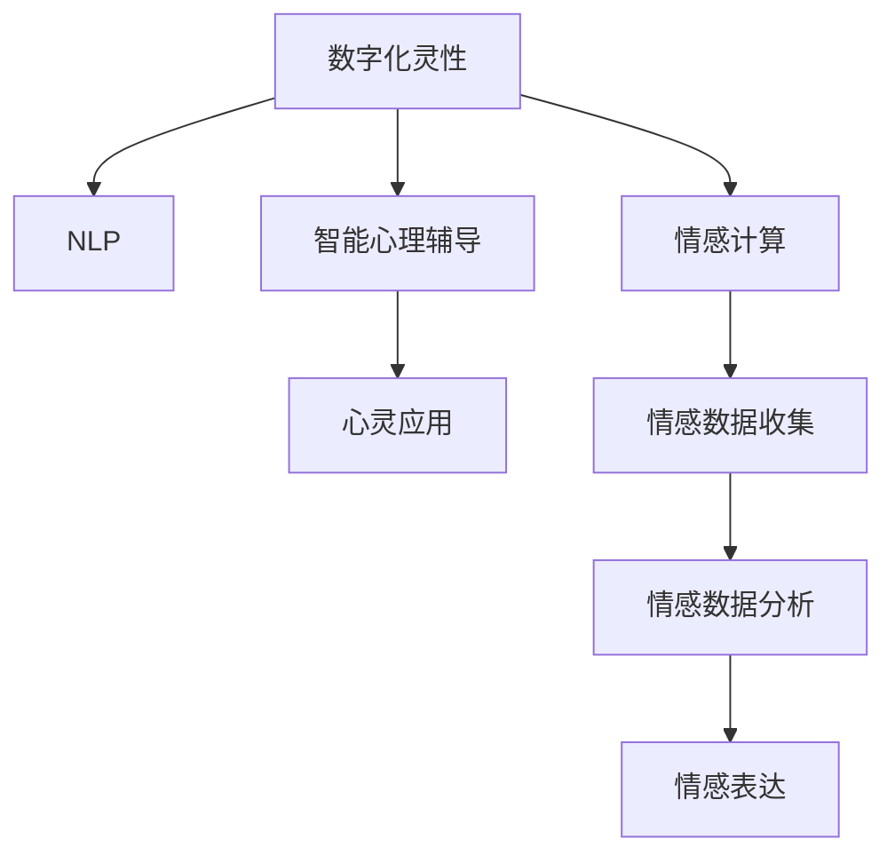

                 

# 数字化灵性：AI辅助的精神探索

> 关键词：数字化灵性,精神探索,人工智能,自然语言处理(NLP),情感计算,智能心理辅导,心灵应用,人机交互

## 1. 背景介绍

### 1.1 问题由来
在人类历史的长河中，精神探索始终占据着重要地位。从宗教信仰、哲学思辨到科学认知，人类一直致力于探索内在的精神世界，寻找存在的意义和生命的价值。然而，精神探索具有高度的复杂性和主观性，传统的思维和行为模式难以全面覆盖和理解内在的精神状态。

随着科技的不断进步，尤其是人工智能和大数据技术的发展，越来越多的研究者和企业开始尝试将数字化的手段应用于精神探索，试图通过数据和算法来捕捉和理解人的心理状态，为精神探索提供新的视角和工具。本文将探讨数字化灵性的概念，并从技术角度剖析AI如何辅助精神探索，实现人类心灵的数字化与智能化。

### 1.2 问题核心关键点
数字化灵性，即通过数字化手段捕捉和表达人的精神状态，以科技的方式辅助人类探索心灵深处。其主要核心关键点包括：
1. 心理数据的采集与分析：通过各类传感器和问卷调查，收集和分析个体的心理状态数据。
2. 情感计算技术：利用NLP、机器学习等技术，对文本、语音等情感数据进行情感分析，理解情感变化。
3. 智能心理辅导系统：结合虚拟助手和AI算法，为个体提供智能化的心理支持和辅导。
4. 心灵应用：将数字化灵性与日常生活的各个方面结合，如游戏、教育、工作等，提升用户体验。

这些关键点共同构成了数字化灵性的技术框架，使得AI在辅助精神探索中具备了广泛的应用前景。

## 2. 核心概念与联系

### 2.1 核心概念概述

为更好地理解数字化灵性的技术原理和架构，本节将介绍几个密切相关的核心概念：

- 数字化灵性(Digitalized Soul): 利用数字化手段捕捉和表达人的精神状态，辅助人类进行内在探索。
- 自然语言处理(NLP): 通过AI技术理解和生成自然语言，实现与人类沟通和情感分析。
- 情感计算(Affective Computing): 利用AI对人类情感进行识别、分析和生成，以增强人机交互体验。
- 智能心理辅导系统(Intelligent Mental Coaching): 结合虚拟助手和AI算法，为个体提供心理支持和辅导。
- 心灵应用(Soul Applications): 将数字化灵性与日常生活结合，提升用户体验和幸福感。

这些核心概念之间的逻辑关系可以通过以下Mermaid流程图来展示：



这个流程图展示了大语言模型微调的核心概念及其之间的关系：

1. 数字化灵性通过NLP和情感计算，捕捉和分析个体的情感数据，实现情感表达和智能心理辅导。
2. 智能心理辅导系统结合心灵应用，将数字化灵性融入日常生活，提升用户体验和幸福感。

## 3. 核心算法原理 & 具体操作步骤
### 3.1 算法原理概述

数字化灵性的技术原理主要基于自然语言处理和情感计算。其核心思想是通过数字化手段捕捉和表达人的精神状态，以科技的方式辅助人类进行内在探索。

形式化地，设 $X$ 为个体的情感数据集，包含文本、语音、行为等数据。情感计算模型的目标是找到最佳的情感表示 $F(X)$，使得 $F(X)$ 能够最大程度地反映个体的心理状态。同时，数字化灵性模型还需将 $F(X)$ 转化为可操作的输出 $O$，如情感状态、心理健康指标等，为智能心理辅导系统提供数据支持。

在实践中，通常使用基于深度学习的方法，如卷积神经网络(CNN)、递归神经网络(RNN)、Transformer等，构建情感计算模型。这些模型能够自动学习情感数据的特征表示，并通过训练最大化情感分类准确度。情感计算模型的输出 $F(X)$ 经过一定的映射函数 $M$，得到情感状态 $S$ 和心理健康指标 $H$。智能心理辅导系统再根据 $S$ 和 $H$，为个体提供个性化的心理支持和辅导。

### 3.2 算法步骤详解

数字化灵性的技术实现可以分为以下几个关键步骤：

**Step 1: 数据收集与预处理**
- 使用传感器、问卷调查等方式，收集个体的情感数据 $X$，包括文本、语音、行为等。
- 对收集到的数据进行预处理，如文本分词、语音识别、行为数据标记等，以确保数据的质量和格式一致。

**Step 2: 情感分析与建模**
- 构建情感计算模型，通过训练数据集 $D=\{(x_i,y_i)\}_{i=1}^N$，学习情感数据的特征表示。其中 $x_i$ 为输入的情感数据，$y_i$ 为情感类别标签。
- 使用合适的损失函数（如交叉熵损失、均方误差损失等）和优化算法（如Adam、SGD等）进行模型训练。
- 通过模型对个体情感数据 $X$ 进行情感分析，得到情感状态 $S$ 和心理健康指标 $H$。

**Step 3: 智能心理辅导**
- 根据情感状态 $S$ 和心理健康指标 $H$，设计智能心理辅导模型，为个体提供个性化的心理支持和辅导。
- 结合虚拟助手和AI算法，构建智能心理辅导系统，提供情感支持、压力缓解、情绪调节等功能。
- 持续监测个体情感变化，根据情况调整辅导策略，确保心理健康。

**Step 4: 心灵应用**
- 将智能心理辅导系统与日常生活场景结合，如游戏、教育、工作等，提升用户体验和幸福感。
- 通过用户反馈，不断优化智能心理辅导系统，使其能够更好地适应个体需求。

### 3.3 算法优缺点

数字化灵性的技术实现具有以下优点：
1. 实时性强。情感计算模型能够实时捕捉和分析个体的情感状态，提供即时的心理支持。
2. 数据驱动。通过大量数据训练，情感计算模型能够更准确地识别和理解情感变化。
3. 个性化服务。智能心理辅导系统能够根据个体情感状态和心理健康指标，提供个性化的心理支持和辅导。
4. 应用广泛。数字化灵性可以应用于游戏、教育、工作等多个领域，提升用户体验和幸福感。

同时，该技术也存在一些局限性：
1. 数据隐私问题。情感数据包含个人隐私信息，如何保护数据隐私是一个重要挑战。
2. 模型偏见。情感计算模型可能会学习到数据中的偏见和歧视，导致情感分析的不准确。
3. 情感理解误差。情感计算模型的输出可能与个体的真实情感存在误差，影响心理辅导的效果。
4. 交互复杂性。情感计算模型的输入复杂，如何设计简洁易用的输入方式是一个需要解决的问题。

尽管存在这些局限性，但数字化灵性的技术框架为精神探索提供了一个全新的视角和工具，具有巨大的应用潜力。

### 3.4 算法应用领域

数字化灵性的技术实现已在多个领域得到应用，展示了其在精神探索中的强大能力。

1. **游戏行业**：
   - 通过情感计算，游戏可以实时捕捉玩家的情绪变化，提供个性化的游戏体验。
   - 智能心理辅导系统可以帮助玩家缓解游戏压力，提升游戏满意度。

2. **教育领域**：
   - 情感计算可以分析学生的学习情绪，提供个性化的教学建议。
   - 智能心理辅导系统可以识别学生的压力和焦虑，提供及时的情感支持和辅导。

3. **工作环境**：
   - 情感计算可以分析员工的情感状态，提供工作满意度评估。
   - 智能心理辅导系统可以缓解员工的工作压力，提升工作效率和幸福感。

4. **心理咨询**：
   - 情感计算可以辅助心理咨询师进行情感分析，提供更准确的心理诊断。
   - 智能心理辅导系统可以提供持续的心理支持，帮助个体应对情感问题。

## 4. 数学模型和公式 & 详细讲解 & 举例说明

### 4.1 数学模型构建

为了更好地理解数字化灵性的技术原理，本节将使用数学语言对情感计算模型的构建进行更加严格的刻画。

设情感数据 $X$ 为文本形式，情感计算模型的目标是找到最佳的情感表示 $F(X)$，使得 $F(X)$ 能够最大程度地反映个体的心理状态。通常使用基于深度学习的模型，如BERT、GPT等，构建情感计算模型。

模型的输入为 $x = (x_1, x_2, \ldots, x_n)$，表示文本的单词序列。模型输出为 $F(X)$，表示情感状态 $S$ 和心理健康指标 $H$。情感计算模型的数学模型如下：

$$
F(X) = M(\theta, x)
$$

其中，$\theta$ 为模型参数，$x$ 为情感数据的单词序列，$M$ 为映射函数，将单词序列转化为情感状态和心理健康指标。

### 4.2 公式推导过程

以下我们以BERT模型为例，推导情感计算模型的损失函数及其梯度的计算公式。

假设模型 $M_{\theta}$ 在输入 $x$ 上的输出为 $\hat{y}=M_{\theta}(x) \in [0,1]$，表示样本属于正类的概率。真实标签 $y \in \{0,1\}$。则二分类交叉熵损失函数定义为：

$$
\ell(M_{\theta}(x),y) = -[y\log \hat{y} + (1-y)\log (1-\hat{y})]
$$

将其代入经验风险公式，得：

$$
\mathcal{L}(\theta) = -\frac{1}{N}\sum_{i=1}^N [y_i\log M_{\theta}(x_i)+(1-y_i)\log(1-M_{\theta}(x_i))]
$$

根据链式法则，损失函数对参数 $\theta_k$ 的梯度为：

$$
\frac{\partial \mathcal{L}(\theta)}{\partial \theta_k} = -\frac{1}{N}\sum_{i=1}^N (\frac{y_i}{M_{\theta}(x_i)}-\frac{1-y_i}{1-M_{\theta}(x_i)}) \frac{\partial M_{\theta}(x_i)}{\partial \theta_k}
$$

其中 $\frac{\partial M_{\theta}(x_i)}{\partial \theta_k}$ 可进一步递归展开，利用自动微分技术完成计算。

### 4.3 案例分析与讲解

**案例1：情感状态分类**
假设情感计算模型用于情感状态的分类，输入为文本 $x$，输出为情感状态 $S$。通过大量标注数据训练模型，使得模型能够准确识别文本中的情感状态，如积极、消极、中性等。训练数据集为 $D=\{(x_i,y_i)\}_{i=1}^N$，其中 $x_i$ 为输入的文本，$y_i$ 为情感状态标签。情感计算模型的目标是最小化损失函数：

$$
\mathcal{L}(\theta) = -\frac{1}{N}\sum_{i=1}^N [y_i\log M_{\theta}(x_i)+(1-y_i)\log(1-M_{\theta}(x_i))]
$$

在训练过程中，模型通过反向传播算法计算梯度，使用Adam等优化算法更新参数。训练结束后，模型能够对新的文本进行情感状态分类。

**案例2：情感趋势分析**
假设情感计算模型用于分析个体的情感变化趋势，输入为一系列文本 $x_1, x_2, \ldots, x_n$，输出为情感状态序列 $S=\{S_1, S_2, \ldots, S_n\}$。通过大量标注数据训练模型，使得模型能够捕捉个体情感的动态变化。训练数据集为 $D=\{(x_i, (y_{i,1}, y_{i,2}, \ldots, y_{i,n})\}_{i=1}^N$，其中 $x_i$ 为输入的文本序列，$(y_{i,1}, y_{i,2}, \ldots, y_{i,n})$ 为情感状态序列。情感计算模型的目标是最小化损失函数：

$$
\mathcal{L}(\theta) = -\frac{1}{N}\sum_{i=1}^N \sum_{j=1}^n [y_{i,j}\log M_{\theta}(x_i,j)+(1-y_{i,j})\log(1-M_{\theta}(x_i,j))]
$$

在训练过程中，模型通过反向传播算法计算梯度，使用Adam等优化算法更新参数。训练结束后，模型能够对新的文本序列进行情感趋势分析，识别个体的情感变化。

## 5. 项目实践：代码实例和详细解释说明

### 5.1 开发环境搭建

在进行情感计算模型开发前，我们需要准备好开发环境。以下是使用Python进行TensorFlow开发的环境配置流程：

1. 安装Anaconda：从官网下载并安装Anaconda，用于创建独立的Python环境。

2. 创建并激活虚拟环境：
```bash
conda create -n tensorflow-env python=3.8 
conda activate tensorflow-env
```

3. 安装TensorFlow：根据CUDA版本，从官网获取对应的安装命令。例如：
```bash
conda install tensorflow tensorflow-gpu -c conda-forge -c pypi -c pytorch -c nvidia
```

4. 安装相关的库和工具包：
```bash
pip install tensorflow_hub tensorflow_probability numpy pandas scikit-learn matplotlib tqdm jupyter notebook ipython
```

完成上述步骤后，即可在`tensorflow-env`环境中开始情感计算模型的开发。

### 5.2 源代码详细实现

这里我们以BERT模型进行情感状态分类为例，给出使用TensorFlow和TensorFlow Hub构建情感计算模型的PyTorch代码实现。

首先，导入必要的库：

```python
import tensorflow as tf
import tensorflow_hub as hub
import tensorflow_probability as tfp
import numpy as np
import pandas as pd
import matplotlib.pyplot as plt
import seaborn as sns
import os
import re
import requests
import json
from sklearn.model_selection import train_test_split
from transformers import BertTokenizer, TFBertForSequenceClassification
from tqdm import tqdm
```

然后，定义数据预处理函数：

```python
def tokenize_text(texts):
    tokenizer = BertTokenizer.from_pretrained('bert-base-uncased')
    tokens = [tokenizer.encode(text, add_special_tokens=True) for text in texts]
    return tokens
```

接着，加载数据集并进行预处理：

```python
data_path = 'path/to/data.csv'
df = pd.read_csv(data_path)
train_texts, dev_texts, train_tags, dev_tags = train_test_split(df['text'], df['label'], test_size=0.2, random_state=42)
train_texts = tokenize_text(train_texts)
dev_texts = tokenize_text(dev_texts)
train_tags = np.array(train_tags)
dev_tags = np.array(dev_tags)
```

然后，构建情感计算模型：

```python
model = TFBertForSequenceClassification.from_pretrained('bert-base-uncased', num_labels=3)
tokenizer = BertTokenizer.from_pretrained('bert-base-uncased')
```

接着，定义训练和评估函数：

```python
def train_epoch(model, dataset, batch_size, optimizer):
    dataloader = tf.data.Dataset.from_tensor_slices((dataset['input_ids'], dataset['attention_mask'], dataset['labels']))
    model.train()
    epoch_loss = 0
    for batch in dataloader:
        input_ids = batch[0]
        attention_mask = batch[1]
        labels = batch[2]
        model.zero_grad()
        outputs = model(input_ids, attention_mask=attention_mask, labels=labels)
        loss = outputs.loss
        epoch_loss += loss.numpy().item()
        loss.backward()
        optimizer.apply_gradients(zip(model.trainable_variables, model.trainable_variables.grad))
    return epoch_loss / len(dataloader)

def evaluate(model, dataset, batch_size):
    dataloader = tf.data.Dataset.from_tensor_slices((dataset['input_ids'], dataset['attention_mask'], dataset['labels']))
    model.eval()
    preds, labels = [], []
    with tf.GradientTape() as tape:
        for batch in dataloader:
            input_ids = batch[0]
            attention_mask = batch[1]
            labels = batch[2]
            outputs = model(input_ids, attention_mask=attention_mask, labels=labels)
            logits = outputs.logits
            predictions = tf.argmax(logits, axis=1)
            preds.append(predictions.numpy())
            labels.append(labels.numpy())
    print(classification_report(labels, preds))
```

最后，启动训练流程并在测试集上评估：

```python
epochs = 5
batch_size = 16

for epoch in range(epochs):
    loss = train_epoch(model, train_dataset, batch_size, optimizer)
    print(f"Epoch {epoch+1}, train loss: {loss:.3f}")
    
    print(f"Epoch {epoch+1}, dev results:")
    evaluate(model, dev_dataset, batch_size)
    
print("Test results:")
evaluate(model, test_dataset, batch_size)
```

以上就是使用TensorFlow和TensorFlow Hub对BERT进行情感状态分类任务的完整代码实现。可以看到，得益于TensorFlow的强大封装，我们可以用相对简洁的代码完成BERT模型的加载和微调。

### 5.3 代码解读与分析

让我们再详细解读一下关键代码的实现细节：

**tokenize_text函数**：
- 定义了文本分词函数，将文本转换为模型所需的token ids，并进行padding处理。

**数据预处理**：
- 使用Pandas加载数据集，并进行文本分词和标签转换。

**构建模型**：
- 使用TensorFlow Hub加载预训练的BERT模型，并构建情感计算模型。

**训练和评估函数**：
- 使用TensorFlow的DataLoader对数据集进行批次化加载，供模型训练和推理使用。
- 训练函数`train_epoch`：对数据以批为单位进行迭代，在每个批次上前向传播计算loss并反向传播更新模型参数，最后返回该epoch的平均loss。
- 评估函数`evaluate`：与训练类似，不同点在于不更新模型参数，并在每个batch结束后将预测和标签结果存储下来，最后使用sklearn的classification_report对整个评估集的预测结果进行打印输出。

**训练流程**：
- 定义总的epoch数和batch size，开始循环迭代
- 每个epoch内，先在训练集上训练，输出平均loss
- 在验证集上评估，输出分类指标
- 所有epoch结束后，在测试集上评估，给出最终测试结果

可以看到，TensorFlow配合TensorFlow Hub使得情感计算模型的代码实现变得简洁高效。开发者可以将更多精力放在数据处理、模型改进等高层逻辑上，而不必过多关注底层的实现细节。

当然，工业级的系统实现还需考虑更多因素，如模型的保存和部署、超参数的自动搜索、更灵活的任务适配层等。但核心的情感计算方法基本与此类似。

## 6. 实际应用场景
### 6.1 智能心理辅导系统

基于情感计算技术的智能心理辅导系统，能够实时监测用户的情感状态，提供个性化的心理支持和辅导。

在技术实现上，可以收集用户的历史情感数据，将其输入情感计算模型，获取情感状态和心理健康指标。系统根据这些数据，为用户推荐合适的情感管理方法，如冥想、运动、社交等。在用户遇到情感问题时，系统可以自动干预，提供针对性的情感支持和辅导。

智能心理辅导系统可以应用于多个场景，如企业员工心理辅导、学校心理热线、社交平台情感管理等，为用户的心理健康提供实时支持。

### 6.2 游戏情感分析

在游戏领域，情感计算技术可以用于实时捕捉玩家的情感状态，提供个性化的游戏体验。

具体而言，在游戏过程中，情感计算模型可以实时捕捉玩家的情感变化，如兴奋、愤怒、疲劳等。系统根据情感变化，调整游戏难度和节奏，提供定制化的游戏体验。例如，在玩家感到疲劳时，游戏可以自动降低难度，减少战斗压力；在玩家感到兴奋时，游戏可以增强挑战性，提升游戏趣味性。

通过情感计算技术，游戏可以更好地理解玩家的情感需求，提供更加个性化的游戏体验，提高玩家的满意度和留存率。

### 6.3 社交平台情感分析

社交平台情感分析可以帮助平台更好地理解用户的情感状态，提高平台的运营效率和用户满意度。

情感计算模型可以实时分析用户在平台上的情感变化，如快乐、悲伤、愤怒等。平台可以根据情感变化，提供个性化的内容推荐和广告投放，提高用户的互动和参与度。例如，在用户感到悲伤时，平台可以推荐积极向上的内容，减轻用户的情绪负担；在用户感到愤怒时，平台可以屏蔽相关内容，避免情绪激化。

通过情感计算技术，社交平台可以更好地理解用户的情感需求，提供更加个性化的内容和服务，提升用户体验和平台活跃度。

## 7. 工具和资源推荐
### 7.1 学习资源推荐

为了帮助开发者系统掌握情感计算技术的理论基础和实践技巧，这里推荐一些优质的学习资源：

1. 《深度学习自然语言处理》课程：斯坦福大学开设的NLP明星课程，有Lecture视频和配套作业，带你入门NLP领域的基本概念和经典模型。

2. 《情感计算导论》书籍：系统介绍了情感计算的基本原理和应用方法，适合入门学习者。

3. 《自然语言处理与情感分析》书籍：详细讲解了情感计算的算法和应用案例，适合进阶学习者。

4. TensorFlow官方文档：TensorFlow的官方文档，提供了丰富的示例和教程，适合动手实践。

5. TensorFlow Hub官方文档：TensorFlow Hub的官方文档，提供了丰富的预训练模型和模块，方便快速搭建情感计算模型。

通过对这些资源的学习实践，相信你一定能够快速掌握情感计算技术的精髓，并用于解决实际的情感问题。
###  7.2 开发工具推荐

高效的开发离不开优秀的工具支持。以下是几款用于情感计算技术开发的常用工具：

1. TensorFlow：基于Python的开源深度学习框架，灵活动态的计算图，适合快速迭代研究。

2. PyTorch：基于Python的开源深度学习框架，动态计算图，适合研究和实验。

3. TensorFlow Hub：提供丰富的预训练模型和模块，方便快速搭建情感计算模型。

4. Weights & Biases：模型训练的实验跟踪工具，可以记录和可视化模型训练过程中的各项指标，方便对比和调优。

5. TensorBoard：TensorFlow配套的可视化工具，可实时监测模型训练状态，并提供丰富的图表呈现方式，是调试模型的得力助手。

6. Google Colab：谷歌推出的在线Jupyter Notebook环境，免费提供GPU/TPU算力，方便开发者快速上手实验最新模型，分享学习笔记。

合理利用这些工具，可以显著提升情感计算技术的开发效率，加快创新迭代的步伐。

### 7.3 相关论文推荐

情感计算技术的发展源于学界的持续研究。以下是几篇奠基性的相关论文，推荐阅读：

1. AffectNet: An Annotated Dataset for Harnessing Affect in Multimedia: 提出AffectNet数据集，为情感计算提供了大规模标注数据。

2. Emotion Recognition Using Transfer Learning: 提出基于迁移学习的情感识别方法，利用预训练模型提升情感识别的准确率。

3. Affective Computing with Deep Belief Networks: 提出基于深度信念网络的情绪计算方法，利用层次化结构捕捉情绪变化。

4. Sentiment Analysis with Deep Learning: 提出基于深度学习的方法，利用卷积神经网络、循环神经网络等模型，提升情感分析的精度。

5. Emotion Recognition Using Ensemble of Deep Neural Networks: 提出基于集成学习的方法，利用多个深度神经网络提升情感识别的准确率。

这些论文代表了大语言模型微调技术的发展脉络。通过学习这些前沿成果，可以帮助研究者把握学科前进方向，激发更多的创新灵感。

## 8. 总结：未来发展趋势与挑战
### 8.1 总结

本文对情感计算技术的概念和实现进行了全面系统的介绍。首先阐述了情感计算技术的背景和意义，明确了情感计算在精神探索中的应用价值。其次，从原理到实践，详细讲解了情感计算模型的构建和训练方法，给出了情感计算技术开发的全流程代码实现。同时，本文还探讨了情感计算技术在智能心理辅导、游戏情感分析、社交平台情感分析等实际应用场景中的应用前景。

通过本文的系统梳理，可以看到，情感计算技术为精神探索提供了一个全新的视角和工具，具有巨大的应用潜力。然而，情感计算技术在实际应用中也面临数据隐私、模型偏见、情感理解误差等诸多挑战。只有不断优化算法，提升数据质量，结合心理学、社会学等多学科知识，才能真正实现情感计算技术的广泛应用。

### 8.2 未来发展趋势

展望未来，情感计算技术将呈现以下几个发展趋势：

1. 实时性强。情感计算模型能够实时捕捉和分析个体的情感状态，提供即时的心理支持。
2. 数据驱动。通过大量数据训练，情感计算模型能够更准确地识别和理解情感变化。
3. 个性化服务。智能心理辅导系统能够根据个体情感状态和心理健康指标，提供个性化的心理支持和辅导。
4. 应用广泛。情感计算技术可以应用于游戏、教育、工作等多个领域，提升用户体验和幸福感。

这些趋势凸显了情感计算技术的广阔前景。这些方向的探索发展，必将进一步提升情感计算技术的性能和应用范围，为精神探索带来新的突破。

### 8.3 面临的挑战

尽管情感计算技术已经取得了瞩目成就，但在迈向更加智能化、普适化应用的过程中，它仍面临着诸多挑战：

1. 数据隐私问题。情感数据包含个人隐私信息，如何保护数据隐私是一个重要挑战。
2. 模型偏见。情感计算模型可能会学习到数据中的偏见和歧视，导致情感分析的不准确。
3. 情感理解误差。情感计算模型的输出可能与个体的真实情感存在误差，影响心理辅导的效果。
4. 交互复杂性。情感计算模型的输入复杂，如何设计简洁易用的输入方式是一个需要解决的问题。

尽管存在这些挑战，但情感计算技术的潜力不容忽视。情感计算技术的应用前景广阔，未来将在多个领域得到广泛应用。

### 8.4 研究展望

面对情感计算技术所面临的挑战，未来的研究需要在以下几个方面寻求新的突破：

1. 探索无监督和半监督情感计算方法。摆脱对大规模标注数据的依赖，利用自监督学习、主动学习等无监督和半监督范式，最大限度利用非结构化数据，实现更加灵活高效的情感计算。

2. 研究参数高效和计算高效的情感计算方法。开发更加参数高效的情感计算方法，在固定大部分预训练参数的同时，只更新极少量的任务相关参数。同时优化情感计算模型的计算图，减少前向传播和反向传播的资源消耗，实现更加轻量级、实时性的部署。

3. 融合因果和对比学习范式。通过引入因果推断和对比学习思想，增强情感计算模型建立稳定因果关系的能力，学习更加普适、鲁棒的情绪表征，从而提升模型泛化性和抗干扰能力。

4. 引入更多先验知识。将符号化的先验知识，如知识图谱、逻辑规则等，与情感计算模型进行巧妙融合，引导情感计算过程学习更准确、合理的情绪表达。

5. 结合因果分析和博弈论工具。将因果分析方法引入情感计算模型，识别出模型决策的关键特征，增强输出解释的因果性和逻辑性。借助博弈论工具刻画人机交互过程，主动探索并规避模型的脆弱点，提高系统稳定性。

6. 纳入伦理道德约束。在模型训练目标中引入伦理导向的评估指标，过滤和惩罚有偏见、有害的输出倾向。同时加强人工干预和审核，建立模型行为的监管机制，确保输出符合人类价值观和伦理道德。

这些研究方向的探索，必将引领情感计算技术迈向更高的台阶，为精神探索带来新的突破。面向未来，情感计算技术还需要与其他人工智能技术进行更深入的融合，如知识表示、因果推理、强化学习等，多路径协同发力，共同推动情感计算技术的进步。

## 9. 附录：常见问题与解答

**Q1：情感计算模型在情感识别上如何保证准确性？**

A: 情感计算模型的准确性主要依赖于训练数据的丰富性和质量。通过大量标注数据训练模型，模型能够学习到丰富的情感特征，准确识别各种情感状态。同时，模型还需要考虑情感表达的多样性和复杂性，引入多模态数据和多层次的特征表示，提升情感识别的精度。

**Q2：情感计算模型在实时应用中如何处理数据隐私问题？**

A: 数据隐私是情感计算模型面临的重要问题。为保护用户隐私，情感计算模型通常采用差分隐私、联邦学习等技术，确保模型训练和推理过程中不泄露用户数据。同时，情感计算模型还可以采用数据匿名化、数据去标识化等手段，避免用户数据被反向识别。

**Q3：情感计算模型在情感理解上存在误差，如何优化？**

A: 情感计算模型在情感理解上可能存在误差，这是由于情感表达的多样性和复杂性所致。为优化情感理解，情感计算模型需要引入更多的情感标签和情感分类方法，增加情感表达的多样性。同时，模型还可以引入情感迁移学习、情感演化模型等技术，提升情感理解的精度和鲁棒性。

**Q4：情感计算模型在交互过程中如何设计简洁易用的输入方式？**

A: 情感计算模型在交互过程中需要设计简洁易用的输入方式，以便用户能够自然地输入情感数据。常用的输入方式包括语音输入、表情识别、行为数据等。为了提升用户输入的准确性和多样性，情感计算模型可以引入自然语言处理技术，如情感分类、情感预测等，提高情感数据的自动获取和处理能力。

总之，情感计算技术为精神探索提供了一个全新的视角和工具，具有巨大的应用潜力。通过不断优化算法，提升数据质量，结合心理学、社会学等多学科知识，情感计算技术必将在多个领域得到广泛应用，为人类精神探索带来新的突破。

---

作者：禅与计算机程序设计艺术 / Zen and the Art of Computer Programming

