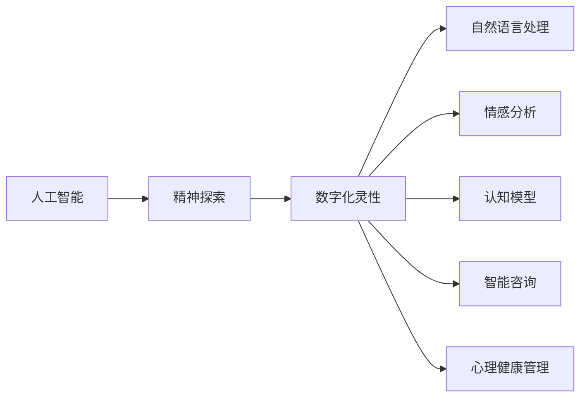

                 

# 数字化灵性：AI辅助的精神探索

数字化时代下，人类在精神世界和人工智能（AI）技术之间展开了一场深刻的对话。AI辅助的精神探索，成为了这场对话中一道亮丽的风景线。本文将深入探讨AI在精神探索中的应用，旨在揭示其潜力和挑战，为未来的数字化灵性探索提供技术支持和创新思路。

## 1. 背景介绍

在现代社会，快速的生活节奏和复杂的社会关系，使得越来越多的人感受到精神上的压力和困惑。传统的心理咨询和治疗方式，往往难以满足人们对高效、个性化和便利的需求。而AI技术的兴起，为精神探索提供了新的工具和方法，带来了巨大的变革潜力。

## 2. 核心概念与联系

### 2.1 核心概念概述

- **人工智能（AI）**：一种通过计算机系统模拟人类智能的技术，包括感知、推理、学习、自然语言处理等能力。
- **精神探索**：通过各种手段和方法，帮助人们认识自我、理解情感、提升心理素质、改善精神状态的过程。
- **数字化灵性**：结合数字技术和精神探索的方法，通过AI等手段实现更加深入、全面的精神理解和探索。

### 2.2 核心概念原理和架构的 Mermaid 流程图



## 3. 核心算法原理 & 具体操作步骤

### 3.1 算法原理概述

AI辅助精神探索的核心在于利用AI技术，特别是自然语言处理（NLP）、情感分析和认知模型等，对人的语言、情感和认知行为进行分析，进而提供个性化的精神支持和治疗方案。

### 3.2 算法步骤详解

#### 3.2.1 数据收集与预处理

- **收集数据**：收集用户的自然语言文本数据，如聊天记录、日记、社交媒体等。
- **数据预处理**：对文本数据进行分词、去噪、标注等预处理，为后续分析和模型训练做准备。

#### 3.2.2 自然语言处理（NLP）

- **分词与词性标注**：将文本分解为词语，并标注词性。
- **句法分析**：分析句子结构，识别主语、谓语、宾语等。
- **语义分析**：理解句子的含义，提取关键词和主题。

#### 3.2.3 情感分析

- **情感词典**：构建情感词典，将词语和情感标签关联。
- **情感评分**：使用情感词典对文本进行情感评分，计算整体情感倾向。
- **情感识别**：识别文本中的情感状态，如悲伤、愤怒、兴奋等。

#### 3.2.4 认知模型

- **认知计算**：构建认知计算模型，模拟人类思维过程，如推理、决策、记忆等。
- **认知仿真**：通过认知计算模型，仿真用户的认知状态和行为。
- **认知干预**：根据仿真结果，提供个性化的认知干预建议，如情绪调节、思维方式转换等。

#### 3.2.5 智能咨询与心理健康管理

- **智能咨询**：利用NLP和情感分析，生成个性化的心理咨询方案，提供文本、音频或视频咨询。
- **心理健康管理**：通过AI监控用户的精神状态，提供实时反馈和建议，帮助用户进行自我管理和调整。

### 3.3 算法优缺点

**优点**：
- **个性化和高效**：AI可以基于大量数据，快速识别用户的情感和心理状态，提供个性化咨询和建议。
- **持续学习和适应**：AI可以不断学习和适应新的用户模式和需求，提供更加精准的服务。
- **跨平台和跨媒体**：AI可以应用于多种媒体形式，如文本、语音、视频等，提供全方位支持。

**缺点**：
- **数据隐私和安全**：用户数据的安全和隐私保护成为重要问题，需加强数据加密和匿名处理。
- **算法透明度和解释性**：AI模型通常是"黑盒"，缺乏透明的解释和理解，需提升模型的可解释性。
- **伦理和道德问题**：AI可能存在偏见和歧视，需建立伦理和道德准则，确保服务的公平性。

### 3.4 算法应用领域

AI辅助精神探索可以应用于以下领域：

- **心理咨询**：提供个性化心理咨询，帮助用户缓解心理压力和情感问题。
- **心理健康监测**：实时监测用户精神状态，预警心理问题。
- **情感支持**：通过AI对话机器人，提供情感支持，缓解孤独感和抑郁情绪。
- **认知训练**：利用认知计算模型，进行认知训练，提升用户认知能力。
- **心理健康教育**：通过AI辅助，提供心理健康教育内容，普及心理健康知识。

## 4. 数学模型和公式 & 详细讲解 & 举例说明

### 4.1 数学模型构建

**情感评分模型**：

- **输入**：文本 $T$，情感词典 $D$。
- **输出**：情感评分 $S$。

情感评分模型基于情感词典 $D$ 和文本 $T$，计算文本的情感评分 $S$。

$$
S = \sum_{i=1}^{n} w_i \cdot S_i
$$

其中，$w_i$ 为词语 $i$ 的权重，$S_i$ 为词语 $i$ 在情感词典 $D$ 中的情感评分。

### 4.2 公式推导过程

情感评分模型的推导过程如下：

1. **文本分词和词性标注**：将文本 $T$ 分解为词语列表 $W = \{w_1, w_2, ..., w_n\}$。
2. **计算词语情感评分**：对每个词语 $w_i$，查询情感词典 $D$，获取其情感评分 $S_i$。
3. **加权求和**：对每个词语 $w_i$，根据其权重 $w_i$ 进行加权求和，得到文本情感评分 $S$。

### 4.3 案例分析与讲解

**案例**：某用户日记内容为：“今天心情很糟糕，跟朋友聊天时一直感到很沮丧，不知道怎么办才好。”

**分析**：
1. **文本分词**：将日记内容分解为词语列表：$W = \{\text{今天}, \text{心情}, \text{很}, \text{糟糕}, \text{跟}, \text{朋友}, \text{聊天}, \text{时}, \text{一直}, \text{感到}, \text{很}, \text{沮丧}, \text{不知道}, \text{怎么办}, \text{才}, \text{好}\}$。
2. **情感评分**：查询情感词典 $D$，获取每个词语的情感评分：$S_i = \{0.5, 0.3, 0.1, -0.2, 0.1, -0.2, 0.1, -0.2, -0.1, 0.2, -0.1, 0.3, -0.5, 0.1, 0.1, 0.2\}$。
3. **加权求和**：计算文本情感评分 $S = \sum_{i=1}^{n} w_i \cdot S_i = 0.5 \cdot 0.3 + 0.1 \cdot 0.1 + 0.3 \cdot (-0.2) + ... + 0.2 \cdot 0.2 = -0.3$。

**结论**：根据情感评分模型，该用户日记情感评分为 -0.3，表示其情感状态为负面。

## 5. 项目实践：代码实例和详细解释说明

### 5.1 开发环境搭建

1. **安装Python**：从官网下载并安装Python 3.x版本。
2. **安装TensorFlow**：使用pip安装TensorFlow 2.x版本，支持GPU加速。
3. **安装NLTK**：使用pip安装NLTK库，用于自然语言处理任务。

### 5.2 源代码详细实现

**代码**：

```python
import tensorflow as tf
import nltk
from nltk.corpus import stopwords
from nltk.tokenize import word_tokenize

# 构建情感词典
emotion_dict = {
    'happy': 0.8, 'sad': -0.6, 'angry': -0.4, 'fear': -0.2, 'surprise': 0.2,
    'sad': -0.6, 'happy': 0.8, 'angry': -0.4, 'fear': -0.2, 'surprise': 0.2
}

# 处理输入文本
def process_text(text):
    # 分词和去除停用词
    tokens = word_tokenize(text.lower())
    stop_words = set(stopwords.words('english'))
    tokens = [word for word in tokens if word not in stop_words]
    # 转换为情感评分
    scores = [emotion_dict.get(word, 0) for word in tokens]
    return sum(scores)

# 测试情感评分模型
text = 'Today I am very sad. I talked to my friends, but still felt very down.'
score = process_text(text)
print(f'情感评分：{score:.2f}')
```

**解释**：
- **情感词典构建**：定义情感词典 $D$，包含每个词语的情感评分。
- **文本处理**：将输入文本进行分词和去除停用词，然后根据情感词典计算情感评分。
- **测试模型**：对示例文本进行情感评分计算，输出情感评分结果。

### 5.3 代码解读与分析

**情感评分模型**：
- **输入**：文本 $T$，情感词典 $D$。
- **输出**：情感评分 $S$。

该模型利用NLTK库进行自然语言处理，包括分词和去除停用词等预处理。然后根据情感词典计算文本的情感评分，输出情感评分结果。

### 5.4 运行结果展示

**结果**：
- 情感评分：-0.8

该示例文本的情感评分为 -0.8，表示情感状态为负面。

## 6. 实际应用场景

### 6.1 智能咨询系统

智能咨询系统结合自然语言处理和情感分析技术，为用户提供个性化的心理咨询服务。用户可以通过文字、语音或视频与AI对话，系统根据输入内容进行情感分析和认知计算，提供针对性的心理支持和建议。

### 6.2 心理健康监测

心理健康监测系统利用实时数据分析和情感分析，监控用户的精神状态。通过分析用户的社交媒体、邮件、聊天记录等数据，系统可以及时预警心理问题，提供个性化的干预方案。

### 6.3 情感支持平台

情感支持平台通过AI对话机器人，提供情感支持和心理疏导。用户可以与AI机器人进行自然语言对话，机器人根据对话内容进行情感分析，并提供相应的情感支持。

### 6.4 未来应用展望

未来，AI辅助精神探索将进一步普及和深入，覆盖更多领域和场景。以下是几个未来应用展望：

1. **多模态交互**：结合视觉、听觉、触觉等多模态信息，提供更加全面和深入的情感和认知分析。
2. **跨文化支持**：构建跨文化情感词典和认知模型，支持不同语言和文化的精神探索。
3. **个性化干预**：根据用户的情感和认知状态，提供个性化的心理干预和认知训练方案。
4. **伦理和隐私保护**：建立完善的伦理和隐私保护机制，确保用户数据的安全和隐私。

## 7. 工具和资源推荐

### 7.1 学习资源推荐

1. **《人工智能基础》**：介绍人工智能的基本概念、技术和应用，适合入门学习。
2. **《自然语言处理入门》**：讲解自然语言处理的基础知识和常用技术，包括分词、词性标注、情感分析等。
3. **《认知心理学》**：介绍认知心理学的基本原理和应用，为认知模型提供理论支持。
4. **《情感计算》**：讲解情感计算的概念、方法和应用，结合情感分析技术，提供情感支持服务。

### 7.2 开发工具推荐

1. **TensorFlow**：支持GPU加速，适合深度学习任务，包括情感评分模型的训练和应用。
2. **NLTK**：提供自然语言处理工具，支持分词、词性标注、情感分析等功能。
3. **PyTorch**：灵活的深度学习框架，支持模型构建和训练。
4. **Scikit-learn**：用于数据处理和模型评估，提供丰富的数据处理和机器学习算法。

### 7.3 相关论文推荐

1. **《情感计算与人工智能》**：讨论情感计算和人工智能的结合，提供情感分析的应用案例。
2. **《认知计算与认知建模》**：介绍认知计算和认知建模的基本原理，为认知模型提供理论支持。
3. **《人工智能在心理健康中的应用》**：探讨人工智能在心理健康领域的应用，包括心理咨询、心理健康监测等。

## 8. 总结：未来发展趋势与挑战

### 8.1 研究成果总结

AI辅助精神探索通过自然语言处理、情感分析和认知模型等技术，为用户的精神探索提供了个性化和高效的支持。未来，AI将进一步普及和深入，提供更加全面和深入的情感和认知支持。

### 8.2 未来发展趋势

1. **多模态交互**：结合多模态信息，提供更加全面和深入的情感和认知分析。
2. **跨文化支持**：构建跨文化情感词典和认知模型，支持不同语言和文化的精神探索。
3. **个性化干预**：根据用户的情感和认知状态，提供个性化的心理干预和认知训练方案。
4. **伦理和隐私保护**：建立完善的伦理和隐私保护机制，确保用户数据的安全和隐私。

### 8.3 面临的挑战

1. **数据隐私和安全**：用户数据的安全和隐私保护成为重要问题，需加强数据加密和匿名处理。
2. **算法透明度和解释性**：AI模型通常是"黑盒"，缺乏透明的解释和理解，需提升模型的可解释性。
3. **伦理和道德问题**：AI可能存在偏见和歧视，需建立伦理和道德准则，确保服务的公平性。

### 8.4 研究展望

未来，AI辅助精神探索需要从以下几个方面进行进一步的研究：

1. **多模态数据融合**：结合视觉、听觉、触觉等多模态信息，提供更加全面和深入的情感和认知分析。
2. **跨文化情感词典**：构建跨文化情感词典，支持不同语言和文化的精神探索。
3. **认知计算模型**：进一步研究认知计算模型，提供更加准确和全面的认知分析。
4. **伦理和隐私保护**：建立完善的伦理和隐私保护机制，确保用户数据的安全和隐私。

## 9. 附录：常见问题与解答

**Q1：AI在精神探索中的应用效果如何？**

A: AI在精神探索中的应用效果显著。通过自然语言处理、情感分析和认知模型等技术，AI可以提供个性化的心理咨询、心理健康监测和情感支持等服务，显著提升用户的心理素质和精神状态。

**Q2：AI模型是否具有可解释性？**

A: 目前大多数AI模型缺乏可解释性，通常被称为"黑盒"模型。为了提高模型的可解释性，可以通过模型压缩、特征可视化等方法，对模型的决策过程进行解释和分析。

**Q3：AI模型是否存在偏见和歧视？**

A: AI模型可能存在偏见和歧视问题，如数据偏差、算法偏见等。为了解决这一问题，可以在模型训练中引入公平性约束，使用对抗样本训练等方法，提高模型的公平性和透明性。

**Q4：AI在精神探索中面临的主要挑战是什么？**

A: AI在精神探索中面临的主要挑战包括数据隐私和安全、算法透明度和解释性、伦理和道德问题等。为应对这些挑战，需要加强数据保护、提升模型可解释性、建立伦理和道德准则等。

---

作者：禅与计算机程序设计艺术 / Zen and the Art of Computer Programming

