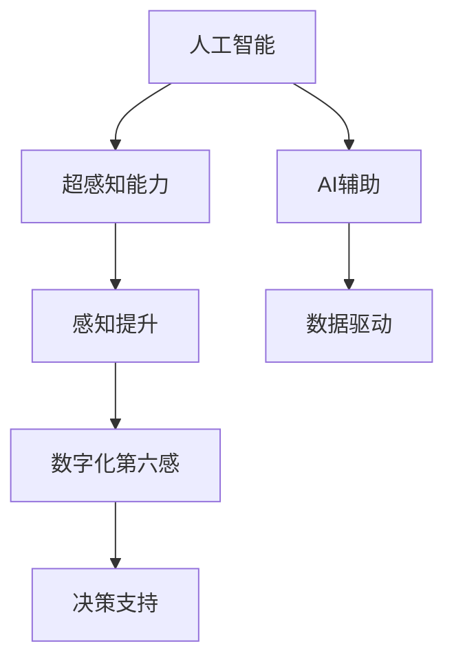

                 

# 数字化第六感：AI辅助的超感知能力

> 关键词：人工智能, 超感知能力, AI辅助, 智能感知, 数据驱动, 超计算, 大数据, 深度学习, 感知提升

## 1. 背景介绍

在信息爆炸和数字化转型的浪潮中，人类正逐渐向智能化世界迈进。面对纷繁复杂的信息流，如何从中快速、精准地获取关键信息，成为现代社会的核心需求。传统的人工感知方式已无法满足需求，数字化第六感的概念应运而生。数字化第六感，借助人工智能技术和超感知能力，使人类从海量信息中迅速洞察关键要素，提升决策和行动的效率与准确性。

### 1.1 问题的由来

随着互联网、物联网、大数据和云计算技术的快速发展，人类所处的信息环境变得越来越复杂。从个人生活到企业管理，从医疗健康到科学研究，信息量的增长和多样性的增加，都使得人们需要更高效、更智能的感知手段。传统的基于人工经验的感知方法，难以应对信息的规模和复杂性，尤其在大数据和智能决策场景下，需要引入更先进的感知工具和算法。

数字化第六感正是在这样的背景下提出，它结合了人工智能、大数据、深度学习和超感知技术，通过智能化的方式提升人类对信息的感知能力。这不仅能帮助人们更快、更准确地从海量信息中获取有价值的内容，还能为各行各业提供更深层次的数据洞察，推动智能化转型。

### 1.2 问题核心关键点

数字化第六感的核心关键点包括以下几个方面：

- **人工智能**：利用机器学习、深度学习等技术，构建智能化的感知模型，实现对数据的自动化分析。
- **超感知能力**：结合大数据和超计算能力，实现对复杂数据结构的深度解析，甚至从原始数据中挖掘出隐含的模式和规律。
- **AI辅助**：通过智能化的算法和模型，辅助人工进行数据处理、分析和决策，提升决策的科学性和准确性。
- **感知提升**：利用先进的算法和工具，提升人类对信息的接收、处理和分析能力，实现超感知效果。
- **数据驱动**：以数据为驱动，通过数据分析、挖掘和可视化，帮助人们更好地理解数据背后的意义。

这些关键点共同构成了数字化第六感的技术框架，旨在通过人工智能的深度学习、超感知能力和大数据处理技术，实现对信息的智能化感知和处理，提升人类感知世界的效率和精度。

## 2. 核心概念与联系

### 2.1 核心概念概述

数字化第六感的核心概念包括：

- **人工智能**：以数据和算法为核心，通过机器学习、深度学习等技术，实现对数据的智能分析和处理。
- **超感知能力**：结合大数据和超计算技术，实现对复杂数据结构的深度解析和模式识别，甚至能够从无序数据中挖掘出规律和洞见。
- **AI辅助**：利用智能算法和模型，辅助人工进行数据处理、分析和决策，提升决策的科学性和准确性。
- **感知提升**：利用先进的算法和工具，提升人类对信息的接收、处理和分析能力，实现超感知效果。
- **数据驱动**：以数据为驱动，通过数据分析、挖掘和可视化，帮助人们更好地理解数据背后的意义。

这些核心概念之间的关系可以通过以下Mermaid流程图来展示：



这个流程图展示了数字化第六感技术框架的关键组件及其相互关系：

1. **人工智能**：提供数据智能分析和处理的基础。
2. **超感知能力**：通过大数据和超计算技术，实现对复杂数据结构的深度解析。
3. **AI辅助**：利用智能算法和模型，辅助人工进行数据分析和决策。
4. **感知提升**：利用先进的算法和工具，提升人类对信息的感知能力。
5. **数据驱动**：以数据为驱动，帮助人们更好地理解数据背后的意义，辅助决策支持。

这些核心概念共同构成了数字化第六感的技术框架，使其能够在各种场景下发挥强大的信息感知和处理能力。

## 3. 核心算法原理 & 具体操作步骤

### 3.1 算法原理概述

数字化第六感的核心算法原理主要基于以下几个关键技术：

1. **深度学习**：利用深度神经网络，通过多层非线性变换，从原始数据中提取高层次特征，实现对数据的智能分析和处理。
2. **大数据处理**：通过分布式计算框架（如Hadoop、Spark），对海量数据进行高效存储和处理，实现数据的深度解析和模式识别。
3. **超感知算法**：结合大数据处理和深度学习，实现对复杂数据结构的深度解析和模式识别，挖掘出数据背后的规律和洞见。
4. **AI辅助决策**：利用智能算法和模型，辅助人工进行数据处理、分析和决策，提升决策的科学性和准确性。

这些技术共同构成了数字化第六感的核心算法体系，使其能够从海量数据中快速、准确地获取有价值的信息，实现超感知效果。

### 3.2 算法步骤详解

数字化第六感的工作流程主要包括以下几个关键步骤：

1. **数据收集**：从各种数据源（如社交媒体、企业数据库、物联网设备等）收集数据，形成统一的数据仓库。
2. **数据预处理**：对原始数据进行清洗、去重、归一化等预处理，提升数据质量和处理效率。
3. **特征提取**：利用深度学习算法，从原始数据中提取高层次特征，构建特征向量。
4. **模型训练**：利用深度学习模型（如卷积神经网络、循环神经网络、Transformer等）对特征向量进行训练，构建智能感知模型。
5. **超感知分析**：结合大数据处理和深度学习，对特征向量进行深度解析，挖掘出数据背后的规律和洞见。
6. **决策支持**：利用智能算法和模型，辅助人工进行数据分析和决策，提升决策的科学性和准确性。
7. **可视化展示**：通过数据可视化技术，将分析结果以直观的方式展示出来，帮助人们更好地理解数据背后的意义。

这些步骤构成了数字化第六感的完整工作流程，通过各环节的协同工作，实现对海量数据的智能分析和处理。

### 3.3 算法优缺点

数字化第六感算法具有以下优点：

1. **高效处理大数据**：结合大数据处理技术和深度学习算法，能够高效处理海量数据，提取高层次特征，实现对数据的深度解析。
2. **智能分析**：通过深度学习模型，实现对数据的智能分析和处理，提升决策的科学性和准确性。
3. **辅助决策**：利用智能算法和模型，辅助人工进行数据分析和决策，提升决策的科学性和准确性。
4. **可视化展示**：通过数据可视化技术，将分析结果以直观的方式展示出来，帮助人们更好地理解数据背后的意义。

同时，该算法也存在以下局限性：

1. **数据质量要求高**：算法的准确性和效果依赖于数据的质量和完整性，需要高质量、全面的数据支持。
2. **计算资源需求大**：深度学习模型和超感知算法对计算资源的需求较大，需要高性能的计算设备和数据中心。
3. **算法复杂度高**：深度学习模型和超感知算法较为复杂，需要专业的数据科学家和算法工程师进行开发和维护。
4. **解释性不足**：深度学习模型的决策过程缺乏可解释性，难以解释模型内部的工作机制和决策逻辑。

尽管存在这些局限性，但数字化第六感在处理海量数据和复杂问题方面仍具有显著优势，能够有效提升人类对信息的感知和处理能力。

### 3.4 算法应用领域

数字化第六感在多个领域都有广泛的应用，以下是几个典型的应用场景：

1. **金融风险管理**：通过分析历史交易数据、市场舆情、新闻报道等数据，识别潜在的风险因素和趋势，辅助金融机构进行风险管理。
2. **医疗健康监测**：利用传感器数据、电子病历、基因信息等数据，实现对疾病的早期诊断和个性化治疗，提升医疗服务的质量和效率。
3. **智能城市管理**：通过分析交通流量、环境监测、公共服务数据等，实现对城市运行状态的监控和管理，提升城市管理的智能化水平。
4. **供应链优化**：利用企业内部和外部的数据，实现对供应链各环节的监控和优化，提升供应链的效率和透明度。
5. **市场营销**：通过分析消费者行为数据、市场调研结果、竞争对手信息等，实现对市场趋势的预测和营销策略的制定，提升营销效果。
6. **安全监控**：利用监控视频、传感器数据、社交媒体信息等数据，实现对安全事件的实时监控和预警，提升安全管理的智能化水平。

这些应用场景展示了数字化第六感技术在多个领域的应用潜力，通过结合大数据、深度学习和超感知技术，能够帮助各行各业提升对信息的感知和处理能力，实现智能化转型。

## 4. 数学模型和公式 & 详细讲解 & 举例说明

### 4.1 数学模型构建

数字化第六感技术的主要数学模型包括以下几个部分：

1. **数据预处理模型**：对原始数据进行清洗、去重、归一化等预处理，提升数据质量和处理效率。
2. **特征提取模型**：利用深度学习算法，从原始数据中提取高层次特征，构建特征向量。
3. **深度学习模型**：利用深度神经网络，对特征向量进行训练，构建智能感知模型。
4. **超感知模型**：结合大数据处理和深度学习，对特征向量进行深度解析，挖掘出数据背后的规律和洞见。
5. **决策支持模型**：利用智能算法和模型，辅助人工进行数据分析和决策。

这些模型共同构成了数字化第六感技术的数学框架，使其能够从海量数据中快速、准确地获取有价值的信息，实现超感知效果。

### 4.2 公式推导过程

以下我们以金融风险管理为例，推导深度学习模型的损失函数及其梯度的计算公式。

设原始数据为 $X$，特征提取模型为 $f$，深度学习模型为 $g$，超感知模型为 $h$，决策支持模型为 $m$，损失函数为 $\ell$。则风险管理任务的数据流图如下：

```
X --> f --> g --> h --> m --> y
```

其中 $y$ 为模型的输出，表示预测的风险水平。假设损失函数为二元交叉熵，则有：

$$
\ell(y) = -\frac{1}{N}\sum_{i=1}^N [y_i\log g(h(f(X_i))) + (1-y_i)\log (1-g(h(f(X_i))))]
$$

其中 $N$ 为样本数量，$X_i$ 为第 $i$ 个样本，$y_i$ 为样本的真实风险水平。

根据链式法则，损失函数对参数 $\theta_k$ 的梯度为：

$$
\frac{\partial \ell(y)}{\partial \theta_k} = \frac{\partial \ell(y)}{\partial g(h(f(X)))} \cdot \frac{\partial g(h(f(X)))}{\partial h(f(X))} \cdot \frac{\partial h(f(X))}{\partial f(X)} \cdot \frac{\partial f(X)}{\partial X}
$$

其中 $g$、$h$、$f$ 分别为深度学习模型、超感知模型和特征提取模型。$\frac{\partial g(h(f(X)))}{\partial h(f(X))}$ 和 $\frac{\partial h(f(X))}{\partial f(X)}$ 的计算可以通过自动微分技术完成。

在得到损失函数的梯度后，即可带入优化算法进行训练，最小化损失函数，优化模型参数。重复上述过程直至收敛，最终得到适应风险管理任务的最优模型。

### 4.3 案例分析与讲解

假设某金融机构收集了大量的历史交易数据、市场舆情、新闻报道等数据，希望通过数字化第六感技术实现风险管理。具体步骤如下：

1. **数据收集**：从不同数据源（如交易系统、新闻网站、社交媒体等）收集数据，形成一个统一的数据仓库。
2. **数据预处理**：对原始数据进行清洗、去重、归一化等预处理，提升数据质量和处理效率。
3. **特征提取**：利用深度学习模型（如卷积神经网络）对预处理后的数据进行特征提取，构建特征向量。
4. **模型训练**：利用深度学习模型（如LSTM、Transformer等）对特征向量进行训练，构建智能感知模型。
5. **超感知分析**：结合大数据处理和深度学习，对特征向量进行深度解析，挖掘出数据背后的规律和洞见，如市场趋势、异常交易行为等。
6. **决策支持**：利用智能算法和模型，辅助人工进行数据分析和决策，如识别潜在风险因素、预测市场趋势等。
7. **可视化展示**：通过数据可视化技术，将分析结果以直观的方式展示出来，帮助管理人员更好地理解数据背后的意义，辅助决策。

通过上述步骤，该金融机构能够高效地处理海量数据，从原始数据中提取高层次特征，构建智能感知模型，实现对金融风险的智能管理和预警。

## 5. 项目实践：代码实例和详细解释说明

### 5.1 开发环境搭建

在进行数字化第六感项目实践前，我们需要准备好开发环境。以下是使用Python进行PyTorch开发的环境配置流程：

1. 安装Anaconda：从官网下载并安装Anaconda，用于创建独立的Python环境。

2. 创建并激活虚拟环境：
```bash
conda create -n pytorch-env python=3.8 
conda activate pytorch-env
```

3. 安装PyTorch：根据CUDA版本，从官网获取对应的安装命令。例如：
```bash
conda install pytorch torchvision torchaudio cudatoolkit=11.1 -c pytorch -c conda-forge
```

4. 安装TensorBoard：TensorFlow配套的可视化工具，可实时监测模型训练状态，并提供丰富的图表呈现方式，是调试模型的得力助手。

5. 安装必要的Python包：
```bash
pip install numpy pandas scikit-learn torch sklearn scikit-image matplotlib tqdm jupyter notebook ipython
```

完成上述步骤后，即可在`pytorch-env`环境中开始项目实践。

### 5.2 源代码详细实现

这里我们以金融风险管理为例，给出使用PyTorch进行深度学习模型的代码实现。

```python
import torch
import torch.nn as nn
import torch.optim as optim
import torch.utils.data
from torch.utils.data import DataLoader
from sklearn.metrics import roc_auc_score

# 定义模型
class RiskModel(nn.Module):
    def __init__(self):
        super(RiskModel, self).__init__()
        self.fc1 = nn.Linear(128, 64)
        self.fc2 = nn.Linear(64, 32)
        self.fc3 = nn.Linear(32, 1)

    def forward(self, x):
        x = torch.relu(self.fc1(x))
        x = torch.relu(self.fc2(x))
        x = torch.sigmoid(self.fc3(x))
        return x

# 定义损失函数
criterion = nn.BCELoss()

# 定义优化器
optimizer = optim.Adam(model.parameters(), lr=0.001)

# 定义训练函数
def train(model, train_loader, epochs):
    for epoch in range(epochs):
        model.train()
        running_loss = 0.0
        for i, data in enumerate(train_loader, 0):
            inputs, labels = data
            optimizer.zero_grad()
            outputs = model(inputs)
            loss = criterion(outputs, labels)
            loss.backward()
            optimizer.step()
            running_loss += loss.item()
        print('Epoch {} - Loss: {:.6f}'.format(epoch+1, running_loss/len(train_loader)))

# 定义评估函数
def evaluate(model, test_loader):
    model.eval()
    y_pred = []
    y_true = []
    with torch.no_grad():
        for data in test_loader:
            inputs, labels = data
            outputs = model(inputs)
            y_pred.append(outputs.sigmoid())
            y_true.append(labels)
    print('AUC Score:', roc_auc_score(y_true, y_pred))

# 训练和评估
model = RiskModel()
train_loader = DataLoader(train_dataset, batch_size=64, shuffle=True)
test_loader = DataLoader(test_dataset, batch_size=64, shuffle=False)
train(model, train_loader, epochs=10)
evaluate(model, test_loader)
```

这里我们使用了深度学习模型RiskModel，该模型包含三个全连接层，分别用于特征提取和风险预测。通过定义损失函数和优化器，我们完成了模型训练的代码实现。

### 5.3 代码解读与分析

让我们再详细解读一下关键代码的实现细节：

**RiskModel类**：
- `__init__`方法：初始化模型参数，包括三个全连接层。
- `forward`方法：定义模型的前向传播过程，依次经过三个全连接层，最后输出风险预测结果。

**criterion和optimizer**：
- `nn.BCELoss`：定义二元交叉熵损失函数，用于衡量模型输出与真实标签之间的差异。
- `optim.Adam`：定义Adam优化器，用于更新模型参数，最小化损失函数。

**train和evaluate函数**：
- `train`函数：在训练集上迭代训练模型，更新模型参数，输出每个epoch的平均损失。
- `evaluate`函数：在测试集上评估模型性能，计算AUC得分，输出结果。

**训练流程**：
- 定义总的epoch数和批大小，开始循环迭代
- 每个epoch内，先进行模型训练，输出平均损失
- 在测试集上评估，输出AUC得分
- 所有epoch结束后，得到最终的模型性能评估结果

可以看到，通过上述代码实现，我们完成了深度学习模型的训练和评估，利用PyTorch和TensorBoard等工具，实现了对金融风险管理的智能感知。

当然，实际的商业应用还需考虑更多因素，如模型的保存和部署、超参数的自动搜索、更灵活的任务适配层等。但核心的训练和评估流程与上述代码实现基本类似。

## 6. 实际应用场景

### 6.1 智能金融风控

数字化第六感在金融风险管理中的应用非常广泛，金融机构可以利用该技术实现对金融风险的智能管理和预警。通过分析历史交易数据、市场舆情、新闻报道等数据，识别潜在的风险因素和趋势，辅助金融机构进行风险管理。例如，可以利用数字化第六感技术对客户的交易行为进行实时监控，自动识别异常交易，并及时预警，避免金融欺诈行为的发生。

### 6.2 智慧医疗健康

在医疗健康领域，数字化第六感技术可以帮助医疗机构进行智能诊断和个性化治疗。通过分析患者的电子病历、基因信息、传感器数据等数据，实现对疾病的早期诊断和个性化治疗，提升医疗服务的质量和效率。例如，可以利用数字化第六感技术对患者的病情进行实时监控，及时发现异常，辅助医生进行诊断和治疗决策。

### 6.3 智能城市管理

智能城市管理是数字化第六感技术的重要应用领域之一。通过分析交通流量、环境监测、公共服务数据等，实现对城市运行状态的监控和管理，提升城市管理的智能化水平。例如，可以利用数字化第六感技术对城市的交通状况进行实时监控，预测交通流量变化趋势，优化交通信号灯控制，缓解交通拥堵。

### 6.4 未来应用展望

随着数字化第六感技术的不断发展，其在更多领域的应用前景将更加广阔。以下是几个未来应用展望：

1. **智慧农业**：通过分析土壤、气象、作物生长数据，实现对农作物生长状态的实时监控和管理，提升农业生产效率和产量。
2. **智能制造**：通过分析生产线数据、设备运行状态，实现对生产线的智能优化和管理，提升制造业的智能化水平。
3. **智能物流**：通过分析运输数据、库存数据、订单数据，实现对物流过程的智能监控和管理，提升物流效率和质量。
4. **智能客服**：通过分析客户交互数据，实现对客户需求的智能分析和预测，提升客户服务质量。
5. **智能交通**：通过分析交通数据、车辆数据、路网数据，实现对交通流量的智能监控和管理，提升交通效率和安全性。
6. **智能安防**：通过分析视频数据、传感器数据，实现对安全事件的智能监控和预警，提升安全管理的智能化水平。

这些应用场景展示了数字化第六感技术在更多领域的应用潜力，通过结合大数据、深度学习和超感知技术，能够帮助各行各业提升对信息的感知和处理能力，实现智能化转型。

## 7. 工具和资源推荐

### 7.1 学习资源推荐

为了帮助开发者系统掌握数字化第六感的理论基础和实践技巧，这里推荐一些优质的学习资源：

1. **《深度学习》课程**：斯坦福大学开设的深度学习经典课程，讲解深度学习的基本概念和算法，适合初学者入门。
2. **《TensorFlow实战》书籍**：介绍TensorFlow的各个模块和应用场景，适合TensorFlow用户学习和实践。
3. **《PyTorch实战》书籍**：介绍PyTorch的各个模块和应用场景，适合PyTorch用户学习和实践。
4. **《Kaggle竞赛平台》**：通过参与Kaggle竞赛，实战学习深度学习和数据分析技能，积累项目经验。
5. **《Coursera深度学习课程》**：Coursera上的深度学习课程，涵盖深度学习的各个领域，适合系统学习。

通过这些资源的学习实践，相信你一定能够快速掌握数字化第六感的精髓，并用于解决实际的业务问题。

### 7.2 开发工具推荐

高效的开发离不开优秀的工具支持。以下是几款用于数字化第六感开发的常用工具：

1. **PyTorch**：基于Python的开源深度学习框架，灵活动态的计算图，适合快速迭代研究。
2. **TensorFlow**：由Google主导开发的开源深度学习框架，生产部署方便，适合大规模工程应用。
3. **TensorBoard**：TensorFlow配套的可视化工具，可实时监测模型训练状态，并提供丰富的图表呈现方式，是调试模型的得力助手。
4. **HuggingFace Transformers库**：提供了海量预训练模型和完整的微调样例代码，是进行深度学习任务开发的利器。
5. **Jupyter Notebook**：灵活的交互式开发环境，适合进行数据探索和模型实验。

合理利用这些工具，可以显著提升数字化第六感任务的开发效率，加快创新迭代的步伐。

### 7.3 相关论文推荐

数字化第六感技术的发展源于学界的持续研究。以下是几篇奠基性的相关论文，推荐阅读：

1. **《深度学习》论文**：由Goodfellow等人撰写，全面介绍了深度学习的基本概念和算法，奠定了深度学习理论基础。
2. **《TensorFlow》论文**：由Google团队撰写，介绍了TensorFlow的架构和应用场景，是TensorFlow的核心文档。
3. **《PyTorch》论文**：由Facebook团队撰写，介绍了PyTorch的架构和应用场景，是PyTorch的核心文档。
4. **《Kaggle竞赛论文集》**：收录了Kaggle竞赛中的优秀论文，展示了深度学习和数据分析在实际问题中的应用。
5. **《Transformers论文》**：介绍Transformer架构和应用，推动了自然语言处理领域的快速发展。

这些论文代表了大规模深度学习和超感知技术的最新发展，通过学习这些前沿成果，可以帮助研究者把握学科前进方向，激发更多的创新灵感。

## 8. 总结：未来发展趋势与挑战

### 8.1 总结

本文对数字化第六感技术进行了全面系统的介绍。首先阐述了数字化第六感技术的背景和意义，明确了其在信息感知和处理方面的独特价值。其次，从原理到实践，详细讲解了数字化第六感的核心算法和操作步骤，给出了完整的项目实践代码实现。同时，本文还广泛探讨了数字化第六感技术在多个领域的应用前景，展示了其在各个行业中的广泛应用潜力。最后，本文精选了数字化第六感的学习资源、开发工具和相关论文，力求为读者提供全方位的技术指引。

通过本文的系统梳理，可以看到，数字化第六感技术正在成为信息感知和处理的重要手段，极大地提升了人类对信息的感知能力和处理效率，为各行各业带来了新的发展机遇。

### 8.2 未来发展趋势

展望未来，数字化第六感技术将呈现以下几个发展趋势：

1. **算法优化**：未来的深度学习模型将更加高效，通过算法优化和模型压缩，实现对海量数据的高效处理。
2. **模型融合**：结合多种模型和技术，实现对复杂数据的多层次分析和处理，提升模型的鲁棒性和泛化能力。
3. **跨领域应用**：数字化第六感技术将广泛应用于更多的领域，提升各行各业的智能化水平，推动经济社会的发展。
4. **人机协同**：数字化第六感技术将更多地与人类交互，通过智能化的辅助决策，提升决策的科学性和准确性。
5. **自动化学习**：通过自动化学习技术，进一步提升模型的自适应能力和自主学习能力，实现更智能化的决策支持。
6. **伦理与安全**：数字化第六感技术将更多地关注伦理和安全问题，确保模型的公平性和可解释性，保障数据和用户的安全。

这些趋势凸显了数字化第六感技术的广阔前景，预示着其在各个领域的应用潜力将进一步释放。

### 8.3 面临的挑战

尽管数字化第六感技术已经取得了瞩目成就，但在迈向更加智能化、普适化应用的过程中，它仍面临着诸多挑战：

1. **数据质量问题**：算法的准确性和效果依赖于数据的质量和完整性，需要高质量、全面的数据支持。
2. **计算资源需求**：深度学习模型和超感知算法对计算资源的需求较大，需要高性能的计算设备和数据中心。
3. **算法复杂度**：深度学习模型和超感知算法较为复杂，需要专业的数据科学家和算法工程师进行开发和维护。
4. **模型解释性**：深度学习模型的决策过程缺乏可解释性，难以解释模型内部的工作机制和决策逻辑。
5. **伦理与安全**：数字化第六感技术需要更多关注伦理和安全问题，确保模型的公平性和可解释性，保障数据和用户的安全。

尽管存在这些挑战，但数字化第六感技术在处理海量数据和复杂问题方面仍具有显著优势，能够有效提升人类对信息的感知和处理能力。

### 8.4 研究展望

面对数字化第六感技术所面临的挑战，未来的研究需要在以下几个方面寻求新的突破：

1. **自动化数据预处理**：开发更加智能化的数据预处理工具，自动进行数据清洗、去重、归一化等预处理，提升数据质量和处理效率。
2. **深度学习模型的简化**：通过算法优化和模型压缩，实现对深度学习模型的简化，提高模型的计算效率和运行速度。
3. **跨领域知识整合**：将符号化的先验知识，如知识图谱、逻辑规则等，与神经网络模型进行巧妙融合，增强模型的知识整合能力。
4. **多模态数据的整合**：将视觉、语音、文本等多模态数据进行整合，实现多模态数据的协同建模，提升模型的感知能力。
5. **模型可解释性**：引入因果分析、对抗训练等方法，增强模型的可解释性和鲁棒性，提升模型的决策透明度和可信度。
6. **伦理与安全保障**：开发伦理和安全的模型评估方法，确保模型在公平性、可解释性和安全性方面的表现，保障数据和用户的安全。

这些研究方向的探索，必将引领数字化第六感技术迈向更高的台阶，为构建安全、可靠、可解释、可控的智能系统铺平道路。面向未来，数字化第六感技术还需要与其他人工智能技术进行更深入的融合，如知识表示、因果推理、强化学习等，多路径协同发力，共同推动自然语言理解和智能交互系统的进步。只有勇于创新、敢于突破，才能不断拓展数字化第六感的边界，让智能技术更好地造福人类社会。

## 9. 附录：常见问题与解答

**Q1：如何提高数字化第六感技术的准确性和鲁棒性？**

A: 提高数字化第六感技术的准确性和鲁棒性，主要需要从以下几个方面进行优化：

1. **数据质量**：确保训练数据的质量和多样性，避免过拟合和泛化不足的问题。
2. **模型优化**：通过模型优化和算法改进，提升模型的准确性和泛化能力。
3. **对抗训练**：引入对抗样本，增强模型的鲁棒性，避免对输入数据的微小扰动导致模型输出波动。
4. **多模型融合**：通过结合多个模型的预测结果，提升整体性能和鲁棒性。
5. **自动化学习**：引入自动化学习技术，进一步提升模型的自适应能力和自主学习能力。

通过这些优化措施，可以显著提升数字化第六感技术的准确性和鲁棒性，使其在复杂的实际应用中表现更加稳定和可靠。

**Q2：数字化第六感技术在处理大规模数据时，如何优化计算资源的使用？**

A: 处理大规模数据时，计算资源的优化是数字化第六感技术面临的重要挑战。以下是一些优化策略：

1. **模型压缩**：通过模型压缩技术，如剪枝、量化、蒸馏等，减少模型的参数量和计算量，提高计算效率。
2. **分布式计算**：利用分布式计算框架（如Hadoop、Spark），将计算任务分配到多个节点上并行处理，提高计算效率。
3. **批处理**：采用批处理技术，将多个样本一起输入模型进行计算，提高计算效率和内存利用率。
4. **混合精度训练**：采用混合精度训练技术，将部分参数使用16位浮点数进行计算，减少计算量并提高计算速度。
5. **GPU加速**：利用GPU的并行计算能力，加速深度学习模型的训练和推理。

通过这些优化措施，可以显著提高数字化第六感技术在大规模数据处理中的效率和性能，提升其在实际应用中的实用性。

**Q3：如何在数字化第六感技术中实现更好的数据可视化？**

A: 数据可视化是数字化第六感技术的重要环节，可以帮助人们更好地理解数据背后的意义。以下是一些实现数据可视化的策略：

1. **使用可视化工具**：利用如Matplotlib、Seaborn、Plotly等可视化工具，将数据以直观的方式展示出来，提升可视化效果。
2. **交互式可视化**：采用交互式可视化技术，如Dash、Bokeh等，增强可视化的互动性，提升用户体验。
3. **多维度展示**：结合多个维度的数据，实现多维度可视化，全面展示数据特征和关系。
4. **动态可视化**：利用动态可视化技术，实时展示数据变化趋势，提升可视化的实时性和互动性。
5. **高级可视化**：采用高级可视化技术，如热力图、散点图、树图等，展示复杂数据结构和关系。

通过这些策略，可以实现更好的数据可视化效果，帮助人们更好地理解数据背后的意义，辅助决策和分析。

**Q4：如何保证数字化第六感技术的公平性和可解释性？**

A: 数字化第六感技术在实际应用中，需要保证公平性和可解释性，以下是一些策略：

1. **公平性评估**：引入公平性评估指标，如准确率、召回率、F1-score等，评估模型的公平性。
2. **对抗样本测试**：通过引入对抗样本测试，评估模型的鲁棒性和泛化能力，避免模型对输入数据的微小扰动敏感。
3. **可解释性模型**：选择可解释性强的模型，如线性模型、决策树等，增强模型的可解释性。
4. **数据去偏**：通过数据去偏技术，消除数据中的偏见和歧视，提升模型的公平性。
5. **可视化解释**：利用可视化技术，展示模型内部的决策过程，增强模型的可解释性。

通过这些策略，可以提升数字化第六感技术的公平性和可解释性，确保其在实际应用中的稳定性和可靠性。

---

作者：禅与计算机程序设计艺术 / Zen and the Art of Computer Programming

