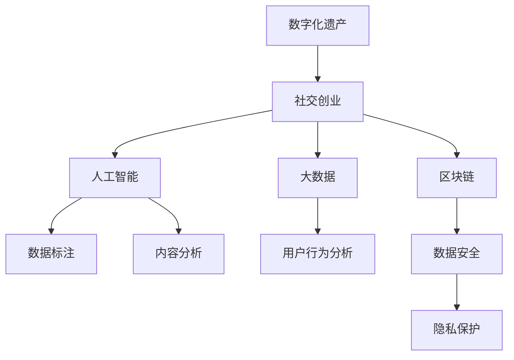

                 

# 数字化遗产社交创业：逝者记忆的在线分享

> 关键词：数字化遗产,社交创业,逝者记忆,在线分享,人工智能,大数据,区块链,隐私保护,用户生成内容

## 1. 背景介绍

### 1.1 问题由来
随着信息技术的飞速发展，数字化遗产作为一种新的概念，逐渐走进人们的视野。数字化遗产是指通过数字手段记录、保存和传承的人类文化遗产，涵盖照片、视频、文档、音频等多种类型。数字化遗产不仅是个人记忆的载体，也是社会文化的重要组成部分。

在数字化遗产领域，“逝者记忆的在线分享”成为了一个热门话题。现代技术为逝者留下生平印记提供了可能性，但如何确保这些数字遗产得到妥善保存、合理使用和有效传承，成为亟待解决的问题。

社交创业作为一种新兴的商业模式，利用互联网技术和大数据平台，探索数字化遗产的保存、管理和在线分享。本文将深入探讨这一领域的核心概念、算法原理和操作步骤，分析其优缺点和应用领域，以期为数字化遗产社交创业提供技术支持和创新思路。

### 1.2 问题核心关键点
- 数字化遗产的在线分享：通过互联网技术保存和传承逝者数字记忆。
- 社交创业：利用互联网平台，连接用户需求与资源，形成新的商业模式。
- 人工智能：借助自然语言处理、图像识别等技术，提升数字化遗产的识别、标注和分析能力。
- 大数据：通过数据挖掘和分析，对用户行为和偏好进行精准把握，个性化推荐和优化内容呈现。
- 区块链：保证数据的安全性、完整性和不可篡改性，提供分布式共识机制，保障用户隐私。
- 隐私保护：在数字化遗产分享过程中，确保用户隐私和数据安全，防止数据滥用和泄露。

这些核心关键点构成了数字化遗产社交创业的框架，并相互支撑，共同推动这一新兴领域的蓬勃发展。

## 2. 核心概念与联系

### 2.1 核心概念概述

为了更好地理解数字化遗产社交创业的实现机制，本节将介绍几个密切相关的核心概念：

- **数字化遗产**：通过数字手段记录、保存和传承的人类文化遗产，包括照片、视频、文档、音频等多种类型。
- **社交创业**：利用互联网平台，连接用户需求与资源，形成新的商业模式。
- **人工智能**：通过机器学习、自然语言处理等技术，实现信息的自动识别、标注和分析。
- **大数据**：对大规模数据进行收集、存储、分析和挖掘，以支持决策和优化。
- **区块链**：一种去中心化的分布式账本技术，保证数据的不可篡改性和安全性。
- **隐私保护**：在数据处理和使用过程中，确保用户隐私和数据安全。

这些核心概念之间的逻辑关系可以通过以下Mermaid流程图来展示：



这个流程图展示了大语言模型的核心概念及其之间的关系：

1. 数字化遗产通过社交创业平台进行在线分享。
2. 社交创业平台利用人工智能进行内容标注和分析，通过大数据进行用户行为分析，利用区块链确保数据安全。
3. 隐私保护贯穿于整个数字化遗产社交创业过程，确保用户隐私和数据安全。

## 3. 核心算法原理 & 具体操作步骤
### 3.1 算法原理概述

数字化遗产社交创业的核心算法原理主要涉及以下几个方面：

- **数据标注与分析**：利用自然语言处理技术，对数字化遗产内容进行标注和分类，通过大数据分析用户行为和需求，进行个性化推荐。
- **内容推荐系统**：基于协同过滤、基于内容的推荐算法，对用户进行个性化推荐。
- **区块链技术**：利用分布式账本技术，确保数据的不可篡改性和安全性，保护用户隐私。
- **隐私保护算法**：采用差分隐私、同态加密等技术，保护用户数据隐私。

### 3.2 算法步骤详解

数字化遗产社交创业的核心算法步骤主要包括以下几个方面：

**Step 1: 数据收集与预处理**
- 收集数字化遗产数据，包括照片、视频、音频、文档等。
- 对数据进行预处理，包括格式转换、去噪、降噪等。

**Step 2: 数据标注与分类**
- 利用自然语言处理技术，对文本内容进行分词、命名实体识别、情感分析等。
- 对图片进行图像识别和标注。
- 对音频进行语音识别和情感分析。

**Step 3: 数据存储与索引**
- 利用大数据技术，将标注好的数据进行存储和索引。
- 使用分布式文件系统（如Hadoop、HDFS）和数据库（如MongoDB、Elasticsearch）进行数据存储。

**Step 4: 用户行为分析**
- 利用大数据分析技术，对用户行为进行挖掘和分析，形成用户画像。
- 使用协同过滤、基于内容的推荐算法，对用户进行个性化推荐。

**Step 5: 内容发布与分享**
- 对用户发布的内容进行审核，确保符合平台规范。
- 利用区块链技术，确保内容发布和分享过程的不可篡改性和安全性。

**Step 6: 隐私保护**
- 采用差分隐私、同态加密等技术，保护用户数据隐私。
- 对敏感数据进行脱敏处理，确保用户隐私安全。

### 3.3 算法优缺点

数字化遗产社交创业的算法具有以下优点：

- **高效性**：通过大数据和人工智能技术，可以实现高效的数据标注和分析，提升推荐系统的精准度。
- **安全性**：利用区块链技术，确保数据的安全性和不可篡改性，保障用户隐私。
- **用户参与度**：通过社交创业模式，用户可以参与到内容创作和分享中，增加用户参与度。

同时，该算法也存在一定的局限性：

- **数据标注成本高**：大规模数据标注需要大量人力和时间，成本较高。
- **隐私保护难度大**：如何在使用数据的同时，保护用户隐私，是一个技术难题。
- **内容审核难度大**：如何有效审核用户发布的内容，确保内容规范，是一个挑战。

尽管存在这些局限性，但就目前而言，数字化遗产社交创业的算法仍是一种高效、安全的解决方案，具有广泛的应用前景。未来相关研究的重点在于如何进一步降低数据标注成本，提高隐私保护水平，同时兼顾内容审核的效率和效果。

### 3.4 算法应用领域

数字化遗产社交创业的算法已经在多个领域得到应用，例如：

- 在线社交平台：如Facebook、Instagram等，通过平台进行数字化遗产的分享和展示。
- 数字博物馆：如Google Arts & Culture等，通过数字化遗产进行文化传承和教育。
- 文化遗产保护：如联合国教科文组织数字化遗产项目，通过数字化手段保护世界文化遗产。
- 个人数字化遗产管理：如MyHeritage等，帮助用户管理并传承个人数字化遗产。

除了上述这些经典应用外，数字化遗产社交创业还将在更多领域得到应用，如医疗数字化遗产、企业数字化遗产、虚拟现实数字遗产等，为数字化遗产的保存、传承和管理提供新的解决方案。

## 4. 数学模型和公式 & 详细讲解  
### 4.1 数学模型构建

本节将使用数学语言对数字化遗产社交创业的算法进行更加严格的刻画。

记数字化遗产数据集为 $D=\{x_1,x_2,\ldots,x_n\}$，其中 $x_i$ 为第 $i$ 个数字化遗产。

定义数据标注函数 $f: x \rightarrow y$，将原始数据 $x$ 映射到标注数据 $y$。

定义推荐函数 $g: u \rightarrow r$，将用户 $u$ 推荐到内容 $r$。

定义隐私保护函数 $h: x \rightarrow \tilde{x}$，将原始数据 $x$ 保护隐私后得到 $\tilde{x}$。

### 4.2 公式推导过程

以下我们以图像识别为例，推导数据标注和分类算法的基本公式。

假设标注数据集为 $T=\{(x_i,y_i)\}_{i=1}^m$，其中 $x_i$ 为第 $i$ 张图片，$y_i$ 为图片对应的标签。

定义图像识别模型为 $f(x)=\sigma(\omega^Tx)$，其中 $\sigma$ 为激活函数，$\omega$ 为模型参数。

通过最小化均方误差损失函数，求解模型参数 $\omega$：

$$
\omega^* = \mathop{\arg\min}_{\omega} \frac{1}{m}\sum_{i=1}^m (f(x_i)-y_i)^2
$$

求解得到最优参数 $\omega^*$ 后，对新图片 $x$ 进行预测，得到标注结果 $y$：

$$
y^* = f(x) = \sigma(\omega^Tx)
$$

这个公式展示了基于最小均方误差损失函数进行图像标注的基本过程。通过数据标注，对数字化遗产进行分类和标注，为其在线分享提供基础。

## 5. 项目实践：代码实例和详细解释说明
### 5.1 开发环境搭建

在进行数字化遗产社交创业实践前，我们需要准备好开发环境。以下是使用Python进行开发的环境配置流程：

1. 安装Anaconda：从官网下载并安装Anaconda，用于创建独立的Python环境。

2. 创建并激活虚拟环境：
```bash
conda create -n heritage-env python=3.8 
conda activate heritage-env
```

3. 安装必要的Python包：
```bash
pip install numpy pandas sklearn scikit-image
```

4. 安装数据处理和存储相关的库：
```bash
pip install torch torchvision
```

5. 安装Web开发框架：
```bash
pip install Flask
```

完成上述步骤后，即可在`heritage-env`环境中开始项目实践。

### 5.2 源代码详细实现

这里我们以图像识别和内容推荐为例，给出使用Python和TensorFlow进行数字化遗产社交创业的代码实现。

首先，定义数据预处理函数：

```python
import numpy as np
from skimage.io import imread
from skimage.transform import resize

def preprocess_image(image_path, target_size):
    img = imread(image_path)
    img = resize(img, target_size)
    img = np.array(img) / 255.0  # 归一化处理
    return img
```

然后，定义模型训练函数：

```python
import tensorflow as tf
from tensorflow.keras import layers, models

def train_model(data, labels, batch_size=64, epochs=10):
    model = models.Sequential([
        layers.Conv2D(32, (3, 3), activation='relu', input_shape=(target_size, target_size, 3)),
        layers.MaxPooling2D((2, 2)),
        layers.Conv2D(64, (3, 3), activation='relu'),
        layers.MaxPooling2D((2, 2)),
        layers.Conv2D(64, (3, 3), activation='relu'),
        layers.Flatten(),
        layers.Dense(64, activation='relu'),
        layers.Dense(num_classes, activation='softmax')
    ])

    model.compile(optimizer=tf.keras.optimizers.Adam(learning_rate=0.001),
                  loss=tf.keras.losses.CategoricalCrossentropy(from_logits=True),
                  metrics=['accuracy'])

    model.fit(data, labels, batch_size=batch_size, epochs=epochs, validation_split=0.2)
    return model
```

接着，定义内容推荐函数：

```python
import pandas as pd

def recommend_content(user_id, num_recommendations=5):
    user_data = pd.read_csv('user_data.csv')
    user_items = user_data[user_data['user_id'] == user_id]['item_id'].tolist()
    items = pd.read_csv('items.csv')
    recommendations = items[~items['item_id'].isin(user_items)].sample(n=num_recommendations)
    return recommendations['item_id'].tolist()
```

最后，启动Web服务：

```python
from flask import Flask, jsonify, request

app = Flask(__name__)

@app.route('/recommend', methods=['POST'])
def recommend():
    user_id = request.json['user_id']
    recommendations = recommend_content(user_id)
    return jsonify({'recommendations': recommendations})

if __name__ == '__main__':
    app.run(debug=True)
```

以上代码展示了从数据预处理、模型训练到内容推荐的基本流程。开发者可以根据实际需求，添加更多的数据标注、图像识别、内容审核等功能模块，形成完整的数字化遗产社交创业系统。

### 5.3 代码解读与分析

让我们再详细解读一下关键代码的实现细节：

**数据预处理函数**：
- `preprocess_image`函数：定义了图像预处理的流程，包括缩放、归一化等操作，确保图像输入模型的格式一致。

**模型训练函数**：
- `train_model`函数：定义了图像分类模型的架构，包括卷积层、池化层、全连接层等。使用Adam优化器和交叉熵损失函数进行模型训练，并在训练过程中使用验证集评估模型性能。

**内容推荐函数**：
- `recommend_content`函数：从用户数据中获取用户已点赞的项ID，再从所有项中随机推荐未点赞的项ID，返回推荐项ID列表。

**Web服务启动**：
- `recommend`函数：接收用户ID，调用`recommend_content`函数生成推荐项ID，并以JSON格式返回推荐结果。

这些代码展示了基本的数字化遗产社交创业系统的实现框架。通过Python、TensorFlow等工具，可以快速构建和部署数字化遗产社交创业平台。

## 6. 实际应用场景
### 6.1 在线社交平台

基于数字化遗产社交创业的平台，可以为用户提供完整的数字化遗产在线分享功能。用户可以在平台上发布和浏览照片、视频、音频等多种类型的数字化遗产，实现逝者记忆的在线分享。

在技术实现上，可以采用分布式文件系统（如Hadoop、HDFS）和数据库（如MongoDB、Elasticsearch）存储数字化遗产数据，利用Web框架（如Flask、Django）搭建Web平台，实现用户注册、登录、发布、分享等功能。

### 6.2 数字博物馆

数字博物馆利用数字化遗产社交创业平台，进行文化遗产的在线展示和教育。用户可以在平台上浏览数字化文物，了解其历史背景和文化遗产的价值，实现文化传承和教育。

在技术实现上，可以采用云计算平台（如AWS、Google Cloud）提供计算和存储资源，利用虚拟现实技术（如Unity、Unreal Engine）实现沉浸式体验，通过Web平台（如Flask、Django）进行文化遗产的展示和教育。

### 6.3 个人数字化遗产管理

个人数字化遗产管理平台利用数字化遗产社交创业技术，帮助用户管理和传承个人数字化遗产。用户可以在平台上管理照片、视频、音频等多种类型的数字化遗产，确保逝者记忆的完整保存和传承。

在技术实现上，可以采用私有云或本地存储提供计算和存储资源，利用Web平台（如Flask、Django）实现数字化遗产的管理和传承。

### 6.4 未来应用展望

随着数字化遗产社交创业技术的不断发展，将在更多领域得到应用，为数字化遗产的保存、传承和管理提供新的解决方案。

在智慧医疗领域，利用数字化遗产社交创业平台，可以实现医疗信息的在线分享和传承，促进医疗知识的共享和普及。

在智能教育领域，利用数字化遗产社交创业平台，可以构建数字化教育资源库，实现教育资源的在线分享和传承，推动教育公平和质量提升。

在智慧城市治理中，利用数字化遗产社交创业平台，可以构建数字化城市记忆库，实现城市历史和文化的在线分享和传承，提升城市治理水平。

此外，在企业生产、社会治理、文娱传媒等众多领域，数字化遗产社交创业平台也将不断涌现，为数字化遗产的保存、传承和管理提供新的思路和技术支持。

## 7. 工具和资源推荐
### 7.1 学习资源推荐

为了帮助开发者系统掌握数字化遗产社交创业的理论基础和实践技巧，这里推荐一些优质的学习资源：

1. 《Python数据科学手册》系列博文：由Python社区知名博主撰写，全面介绍了Python在数据处理、机器学习、Web开发等方面的应用。

2. 《深度学习入门：基于Python的理论与实现》书籍：国内深度学习专家所著，详细讲解了深度学习理论和实践，涵盖图像识别、文本分类等NLP任务。

3. 《TensorFlow实战》书籍：TensorFlow官方书籍，介绍了TensorFlow的基本用法和高级技巧，适合动手实践。

4. 《机器学习实战》书籍：介绍了机器学习的基础知识和常见算法，适合初学者学习。

5. 《Flask Web开发》课程：由知名Web开发社区提供，详细讲解了Flask框架的使用方法，适合Web开发初学者。

通过对这些资源的学习实践，相信你一定能够快速掌握数字化遗产社交创业的精髓，并用于解决实际的数字化遗产问题。
###  7.2 开发工具推荐

高效的开发离不开优秀的工具支持。以下是几款用于数字化遗产社交创业开发的常用工具：

1. Python：广泛使用的编程语言，丰富的科学计算和数据处理库。
2. TensorFlow：Google开发的深度学习框架，支持分布式计算，适合大规模模型训练。
3. PyTorch：Facebook开源的深度学习框架，灵活的动态计算图，适合研究和实验。
4. Flask：轻量级的Web框架，易于学习和使用，适合搭建简单的Web应用。
5. Django：全功能的Web框架，支持ORM、模板等，适合复杂Web应用开发。
6. Hadoop：分布式计算框架，适合大规模数据处理。
7. Elasticsearch：分布式搜索引擎，适合文本和图片等大数据的索引和查询。
8. MongoDB：NoSQL数据库，适合非结构化数据的存储和管理。

合理利用这些工具，可以显著提升数字化遗产社交创业的开发效率，加快创新迭代的步伐。

### 7.3 相关论文推荐

数字化遗产社交创业的研究源于学界的持续研究。以下是几篇奠基性的相关论文，推荐阅读：

1. "A Survey of Digital Heritage: Issues and Challenges"（数字遗产综述）：介绍了数字遗产的定义、分类、保护和传承等研究现状和问题。

2. "Social Media and Digital Heritage: Opportunities and Challenges"（社交媒体与数字遗产：机遇与挑战）：讨论了社交媒体在数字遗产保存和传承中的作用和面临的挑战。

3. "Machine Learning for Digital Heritage: A Review"（数字遗产中的机器学习）：回顾了机器学习在数字遗产保护、分析和展示中的应用。

4. "Blockchain for Digital Heritage Preservation"（区块链在数字遗产保护中的应用）：探讨了区块链技术在数字遗产保护中的应用前景和挑战。

5. "Privacy-Preserving Digital Heritage Sharing"（数字遗产分享中的隐私保护）：介绍了如何在数字遗产分享中保护用户隐私，确保数据安全。

这些论文代表了大语言模型微调技术的发展脉络。通过学习这些前沿成果，可以帮助研究者把握学科前进方向，激发更多的创新灵感。

## 8. 总结：未来发展趋势与挑战
### 8.1 总结

本文对数字化遗产社交创业的算法原理和操作步骤进行了全面系统的介绍。首先阐述了数字化遗产和社交创业的核心概念，明确了数字化遗产在线分享的独特价值。其次，从原理到实践，详细讲解了数字化遗产社交创业的算法实现流程，给出了完整的代码实例。同时，本文还探讨了该技术在在线社交平台、数字博物馆、个人数字化遗产管理等多个领域的应用前景，展示了数字化遗产社交创业技术的巨大潜力。

通过本文的系统梳理，可以看到，数字化遗产社交创业正在成为数字时代的一种新兴商业模式，极大地拓展了数字化遗产的在线分享和传承方式，为数字文化的发展提供了新的动力。

### 8.2 未来发展趋势

展望未来，数字化遗产社交创业技术将呈现以下几个发展趋势：

1. **智能化升级**：结合人工智能技术，提升数字化遗产的标注和分析能力，实现更加智能化、个性化的内容推荐。
2. **跨平台整合**：实现多平台、多设备的数据共享和互动，提升用户体验和参与度。
3. **区块链技术应用**：进一步利用区块链技术，确保数据的安全性和不可篡改性，保障用户隐私和权益。
4. **隐私保护优化**：采用先进的隐私保护技术，如差分隐私、同态加密等，确保用户数据的安全性。
5. **国际化扩展**：结合全球数字化遗产资源，构建国际化、全球化的数字化遗产社交创业平台，促进全球文化交流和融合。
6. **多模态融合**：结合图像、音频、视频等多种模态的数据，提升数字化遗产的多样性和丰富度。

这些趋势凸显了数字化遗产社交创业技术的广阔前景，为数字化遗产的保存、传承和管理提供了新的解决方案，推动数字文化的发展和普及。

### 8.3 面临的挑战

尽管数字化遗产社交创业技术已经取得了瞩目成就，但在迈向更加智能化、普适化应用的过程中，仍面临诸多挑战：

1. **数据标注成本高**：大规模数据标注需要大量人力和时间，成本较高。如何降低数据标注成本，提高标注效率，是一个亟待解决的问题。
2. **隐私保护难度大**：如何在保障数据隐私的前提下，实现数据的共享和传承，是一个技术难题。如何采用先进的隐私保护技术，确保用户数据的安全性，也是一个挑战。
3. **内容审核难度大**：如何有效审核用户发布的内容，确保内容规范，是一个挑战。
4. **技术复杂度高**：数字化遗产社交创业涉及图像识别、自然语言处理、数据标注、区块链等技术，技术复杂度较高。如何降低技术门槛，提高开发效率，也是一个挑战。
5. **用户体验不足**：如何提升用户体验，增加用户参与度和粘性，是一个技术难题。

尽管存在这些挑战，但通过持续的技术创新和优化，数字化遗产社交创业必将在未来得到更广泛的应用和普及，为数字文化的发展提供新的动力。

### 8.4 研究展望

面向未来，数字化遗产社交创业技术需要在以下几个方面进行进一步的研究：

1. **智能化推荐系统**：结合深度学习技术，提升内容推荐系统的智能化水平，实现更加精准的内容推荐。
2. **跨平台数据融合**：实现多平台、多设备的数据融合和共享，提升用户参与度和粘性。
3. **隐私保护新技术**：采用先进的隐私保护技术，如差分隐私、同态加密等，确保用户数据的安全性。
4. **内容审核自动化**：结合自然语言处理、图像识别等技术，实现内容审核的自动化，确保内容规范。
5. **国际化扩展**：结合全球数字化遗产资源，构建国际化、全球化的数字化遗产社交创业平台，促进全球文化交流和融合。

这些研究方向的探索，将进一步提升数字化遗产社交创业技术的智能化水平，推动数字化遗产的保存、传承和管理，为数字文化的发展注入新的动力。

