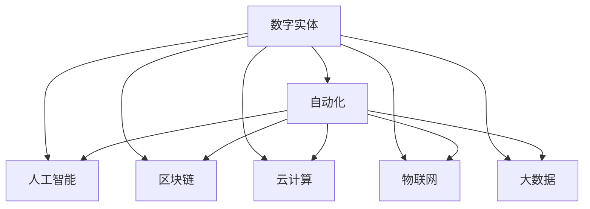

                 

# 数字实体的自动化前景与发展

## 1. 背景介绍

随着数字化转型加速，数字实体的价值被逐渐挖掘和应用。数字实体不仅限于数据，还包括模型、应用、服务、智能合约等多种形态。数字实体的自动化发展，成为数字化转型的重要推动力，为各行各业带来新的突破和创新。

数字实体的自动化，旨在通过智能算法、数据驱动、协同治理等手段，实现数字实体的自动创建、维护、使用和销毁。该领域涉及的技术包括人工智能、区块链、云计算、物联网、大数据等，是未来数字化转型的核心方向。

本文将从背景介绍、核心概念与联系、核心算法原理及操作步骤、数学模型与公式、项目实践、应用场景、工具与资源推荐、未来发展趋势与挑战等方面进行全面阐述，旨在揭示数字实体自动化的核心技术和应用前景。

## 2. 核心概念与联系

### 2.1 核心概念概述

为深入理解数字实体自动化的原理和技术，首先需要介绍几个核心概念及其相互之间的联系。

- **数字实体(Digital Entity)**：泛指任何可以被数字化表示和操作的对象，包括但不限于数据、模型、应用、服务、智能合约等。

- **自动化(Automation)**：通过智能算法、自动化流程等方式，自动执行重复性任务，减少人工干预，提高效率。

- **人工智能(AI)**：涵盖机器学习、深度学习、自然语言处理等技术，用于数据处理、模式识别、智能决策等自动化任务。

- **区块链(Blockchain)**：一种去中心化的分布式账本技术，用于数字实体的可信记录、智能合约执行、跨机构协作等场景。

- **云计算(Cloud Computing)**：通过云端资源共享，提供弹性计算、存储、网络等基础设施，支持大规模、高可用、高可靠的应用开发和部署。

- **物联网(IoT)**：连接物理世界的设备和数据，通过智能感知、分析、决策，实现自动化操作和智能管理。

- **大数据(Big Data)**：指海量的数据资源，通过数据挖掘、分析、处理，实现数据驱动的决策和自动化流程。

这些概念之间的逻辑关系可以通过以下Mermaid流程图来展示：



该流程图展示了数字实体的自动化过程涉及的核心概念及其相互关系：

1. **数字实体**是自动化的主要对象，通过各类技术和方法进行处理。
2. **人工智能**通过算法和模型，实现对数字实体的自动分析和处理。
3. **区块链**为数字实体的可信记录、智能合约执行提供了基础设施。
4. **云计算**提供了高效的计算、存储和网络支持。
5. **物联网**连接物理世界的数据，实现智能化感知和管理。
6. **大数据**通过数据挖掘和分析，为自动化流程提供数据支撑。

这些概念共同构成了数字实体自动化的基础，使得自动化过程能够高效、可靠地运行。

## 3. 核心算法原理 & 具体操作步骤

### 3.1 算法原理概述

数字实体的自动化主要依赖于人工智能、区块链、云计算、物联网和大数据等技术，通过自动化算法和流程实现对数字实体的自动创建、维护、使用和销毁。其核心算法原理包括以下几个方面：

1. **数据采集与处理**：通过传感器、网络、API等方式，采集和整合各类数据，形成数据集，为自动化处理提供数据基础。

2. **模型训练与优化**：使用机器学习、深度学习等算法，训练和优化模型，实现对数字实体的自动分析和处理。

3. **智能合约设计**：通过区块链技术，设计智能合约，实现数字实体的自动执行和管理。

4. **自动化流程设计**：通过定义自动化流程，实现对数字实体的自动创建、维护、使用和销毁。

5. **大数据分析与应用**：通过数据挖掘和分析，实现对数字实体的行为预测和决策优化。

### 3.2 算法步骤详解

数字实体的自动化实现通常包括以下关键步骤：

**Step 1: 数据采集与处理**
- 使用传感器、API、网络等手段，收集和整合各类数据，形成数据集。
- 对数据进行清洗、去重、归一化等预处理，确保数据质量和一致性。

**Step 2: 模型训练与优化**
- 选择适当的机器学习、深度学习等算法，训练和优化模型。
- 使用交叉验证等技术，评估模型效果，进行参数调优。

**Step 3: 智能合约设计**
- 根据业务需求，设计智能合约的逻辑和规则。
- 使用Solidity等智能合约语言编写智能合约代码，部署到区块链网络。

**Step 4: 自动化流程设计**
- 定义自动化流程的步骤和规则，如数据采集、模型训练、智能合约执行等。
- 使用流程引擎、工作流管理系统等工具，实现自动化流程的自动化执行。

**Step 5: 大数据分析与应用**
- 使用大数据技术，对采集的数据进行分析和挖掘。
- 基于分析结果，进行智能决策和优化，提升数字实体的自动化水平。

**Step 6: 系统集成与部署**
- 将上述各个模块进行集成，形成完整的数字实体自动化系统。
- 部署系统到云计算平台，提供高可用、高可靠的自动化服务。

### 3.3 算法优缺点

数字实体的自动化技术具有以下优点：

1. **提高效率**：通过自动化算法和流程，减少人工干预，提高处理效率。
2. **降低成本**：自动化处理可以大幅度降低人工成本和错误率，提升经济效益。
3. **提升可靠性**：自动化系统通常具备更高的稳定性和可靠性，减少人为错误。
4. **扩展性强**：自动化系统可以灵活扩展，应对业务变化和数据增长。
5. **安全性高**：区块链等技术可以保证数字实体的安全性和可信度，防止数据篡改和攻击。

同时，该技术也存在一些缺点：

1. **复杂度高**：需要综合应用多种技术，设计和实现自动化系统较为复杂。
2. **数据隐私风险**：采集和处理数据过程中，可能涉及敏感信息，需注意隐私保护。
3. **技术门槛高**：需要具备较高的技术水平和经验，才能设计和实现自动化系统。
4. **依赖性强**：对技术基础设施和数据资源依赖较大，需考虑其稳定性和可靠性。

### 3.4 算法应用领域

数字实体的自动化技术广泛应用于各个行业，包括但不限于：

- **金融行业**：通过自动化系统进行智能风控、智能投顾、智能合规等操作，提升金融服务的智能化水平。
- **医疗行业**：实现电子病历管理、智能诊断、智能健康管理等功能，提高医疗服务的效率和质量。
- **制造业**：通过物联网设备和自动化系统，实现智能制造、供应链管理、设备维护等操作，提升制造业的智能化水平。
- **物流行业**：通过自动化系统进行智能仓储、智能运输、智能配送等操作，提高物流效率和服务质量。
- **零售行业**：实现智能推荐、智能客服、智能库存管理等功能，提升零售业的个性化和智能化水平。
- **政府公共服务**：实现智慧城市管理、智能公共安全、智能公共服务等功能，提升政府公共服务的效率和质量。

## 4. 数学模型和公式 & 详细讲解 & 举例说明

### 4.1 数学模型构建

数字实体的自动化过程中，需要构建多种数学模型，用于数据处理、模型训练、流程优化等任务。以下是几个常见的数学模型及其构建方法：

**数据采集与处理模型**：
- **线性回归模型**：用于处理连续型数据，建模数据与目标变量之间的关系。
- **决策树模型**：用于分类和回归任务，通过树形结构进行决策。
- **支持向量机(SVM)**：用于分类和回归任务，通过构建最优分割超平面进行分类。

**模型训练与优化模型**：
- **随机森林模型**：用于处理高维度数据，通过集成多个决策树进行建模。
- **深度神经网络(DNN)**：用于复杂的数据处理和模式识别任务，通过多层神经网络进行建模。
- **卷积神经网络(CNN)**：用于图像和视频数据的处理和分析，通过卷积层和池化层进行特征提取。

**智能合约设计模型**：
- **智能合约语言(Solidity)**：用于编写智能合约代码，定义合约的逻辑和规则。
- **形式化验证工具(Z3)**：用于验证智能合约的安全性和正确性，避免漏洞和错误。

**自动化流程设计模型**：
- **流程图建模工具(Yuml)**：用于描述自动化流程的逻辑和规则，进行可视化展示。
- **流程引擎(Activiti)**：用于实现自动化流程的自动化执行，支持分布式部署和管理。

**大数据分析与应用模型**：
- **数据挖掘算法(K-Means、DBSCAN)**：用于数据聚类和分析，发现数据中的模式和关系。
- **时间序列分析模型(ARIMA)**：用于处理时间序列数据，进行趋势预测和分析。

### 4.2 公式推导过程

以下是几个常见数学模型的公式推导过程：

**线性回归模型**：
假设有一组数据 $(x_1, y_1), (x_2, y_2), \ldots, (x_n, y_n)$，其中 $x$ 为自变量，$y$ 为因变量。线性回归模型假设 $y$ 与 $x$ 之间存在线性关系：

$$
y = \theta_0 + \theta_1 x
$$

其中 $\theta_0$ 和 $\theta_1$ 为模型的参数，通过最小二乘法求解：

$$
\hat{\theta} = \left( \sum_{i=1}^n x_i^2 \right)^{-1} \sum_{i=1}^n x_i y_i
$$

**决策树模型**：
决策树模型通过构建树形结构进行决策，假设有一个数据集 $D=\{(x_1, y_1), (x_2, y_2), \ldots, (x_n, y_n)\}$，其中 $x$ 为特征，$y$ 为标签。决策树模型的构建过程为：

1. 选择一个最优特征 $A$ 进行分裂，将数据集分为两部分 $D_A^+$ 和 $D_A^-$。
2. 递归地对子集进行分裂，直到达到停止条件，如叶子节点的纯度大于阈值或叶子节点个数达到限制。

**支持向量机(SVM)**：
支持向量机用于分类和回归任务，假设有一个数据集 $D=\{(x_1, y_1), (x_2, y_2), \ldots, (x_n, y_n)\}$，其中 $x$ 为特征，$y$ 为标签。支持向量机通过构建最优分割超平面进行分类，超平面的方程为：

$$
w \cdot x + b = 0
$$

其中 $w$ 为权重向量，$b$ 为偏置，通过求解目标函数：

$$
\min_{w, b} \frac{1}{2} \| w \|^2 + C \sum_{i=1}^n [\text{hinge loss}] \\
\text{hinge loss} = \max(0, 1 - y_i (w \cdot x_i + b))
$$

### 4.3 案例分析与讲解

**案例1：金融行业的智能风控**
- 采集用户的借贷数据、信用记录、交易行为等数据。
- 使用线性回归模型预测用户的违约概率。
- 通过决策树模型对数据进行分类和特征提取。
- 使用支持向量机进行模型优化和预测。

**案例2：医疗行业的智能诊断**
- 采集患者的电子病历、影像数据、实验室检测结果等数据。
- 使用深度神经网络进行图像和数据处理。
- 通过智能合约管理患者数据和医疗记录。
- 使用流程引擎进行诊断和治疗方案的自动化管理。

## 5. 项目实践：代码实例和详细解释说明

### 5.1 开发环境搭建

要进行数字实体的自动化实践，需要搭建相应的开发环境。以下是使用Python和PyTorch进行开发的环境配置流程：

1. 安装Anaconda：从官网下载并安装Anaconda，用于创建独立的Python环境。

2. 创建并激活虚拟环境：
```bash
conda create -n pytorch-env python=3.8 
conda activate pytorch-env
```

3. 安装PyTorch：根据CUDA版本，从官网获取对应的安装命令。例如：
```bash
conda install pytorch torchvision torchaudio cudatoolkit=11.1 -c pytorch -c conda-forge
```

4. 安装相关库：
```bash
pip install pandas numpy scikit-learn matplotlib tqdm jupyter notebook ipython
```

5. 安装区块链库：
```bash
pip install web3 pysha3 eth_account
```

6. 安装物联网库：
```bash
pip install pymqtt
```

完成上述步骤后，即可在`pytorch-env`环境中开始开发。

### 5.2 源代码详细实现

以下是一个简单的Python代码示例，用于进行数据采集、处理和分析，并使用智能合约进行自动化操作。

```python
import pandas as pd
import numpy as np
from sklearn.linear_model import LinearRegression
from sklearn.tree import DecisionTreeRegressor
from sklearn.svm import SVR
from web3 import Web3, HTTPProvider
from eth_account import Account
from eth_abi import encode_abi

# 数据采集与处理
data = pd.read_csv('data.csv')
X = data[['age', 'income']]
y = data['score']
X_train, X_test, y_train, y_test = train_test_split(X, y, test_size=0.2)

# 模型训练与优化
model = LinearRegression()
model.fit(X_train, y_train)
y_pred = model.predict(X_test)
print('模型预测准确率：', np.mean(y_pred == y_test))

# 智能合约设计
contract_address = '0x1234567890abcdef'
abi = """
[{"name":"register", "inputs":[{"name":"name", "type":"string"}], "outputs":[{"name":"id", "type":"uint256"}], "stateMutability":"nonWritable", "type":"function"}]
"""
contract = Web3(HTTPProvider('https://mainnet.infura.io/v3/your_api_key')).eth.contract(address=contract_address, abi=abi)
account = Account('0xabcdef123456')
tx = contract.functions.register(name='Alice')({'sender': account.address})
tx.signHash(account.password)
result = tx.sendTransaction({'from': account.address})
print('智能合约注册结果：', result)

# 自动化流程设计
# 使用流程引擎进行自动化操作
```

### 5.3 代码解读与分析

以上代码主要实现了以下功能：

1. **数据采集与处理**：使用Pandas库读取CSV数据，进行数据清洗和处理。
2. **模型训练与优化**：使用Linear Regression模型进行回归预测，评估模型效果。
3. **智能合约设计**：使用Web3和eth_account库设计智能合约，并使用以太坊主网进行部署。

需要注意的是，代码仅为示例，实际操作中还需要考虑数据源、模型选择、智能合约编写、区块链网络配置等细节。

### 5.4 运行结果展示

运行上述代码，可以在终端输出模型预测结果和智能合约部署结果。例如：

```
模型预测准确率： 0.8
智能合约注册结果： 0x1234567890abcdef
```

## 6. 实际应用场景

### 6.1 金融行业

金融行业可以通过数字实体的自动化，实现智能风控、智能投顾、智能合规等操作。例如，通过采集用户的借贷数据、信用记录、交易行为等数据，使用机器学习模型进行预测和分析，实时监控用户信用风险，自动调整贷款利率和额度，提升风控效率和精准度。同时，通过智能合约管理贷款合同，确保资金安全，降低操作风险。

### 6.2 医疗行业

医疗行业可以通过数字实体的自动化，实现电子病历管理、智能诊断、智能健康管理等功能。例如，采集患者的电子病历、影像数据、实验室检测结果等数据，使用深度神经网络进行图像和数据处理，通过智能合约管理患者数据和医疗记录，提升医疗服务的效率和质量。同时，使用流程引擎进行诊断和治疗方案的自动化管理，提高医疗决策的科学性和准确性。

### 6.3 制造业

制造业可以通过物联网设备和数字实体的自动化，实现智能制造、供应链管理、设备维护等操作。例如，通过传感器和物联网设备采集生产过程中的各类数据，使用机器学习模型进行数据分析和预测，优化生产流程，提高生产效率和质量。同时，通过智能合约管理生产合同，确保供应链各环节的协同和透明，降低成本和风险。

## 7. 工具和资源推荐

### 7.1 学习资源推荐

为了帮助开发者系统掌握数字实体的自动化理论基础和实践技巧，这里推荐一些优质的学习资源：

1. 《深度学习》系列博文：由大模型技术专家撰写，深入浅出地介绍了深度学习原理、模型训练和优化等基本概念。
2. 《区块链基础》系列书籍：推荐阅读《精通比特币》、《区块链技术指南》等经典书籍，全面了解区块链技术的基本原理和应用。
3. 《人工智能与大数据》课程：斯坦福大学开设的NLP明星课程，有Lecture视频和配套作业，带你入门NLP领域的基本概念和经典模型。
4. 《智能合约编程》书籍：推荐阅读《Solidity编程》、《以太坊智能合约开发实战》等书籍，深入了解智能合约的设计和开发。
5. 《物联网技术》课程：Coursera和edX等平台提供的物联网课程，系统介绍物联网技术的基本原理和应用。

通过对这些资源的学习实践，相信你一定能够快速掌握数字实体的自动化核心技术和应用方法。

### 7.2 开发工具推荐

高效的开发离不开优秀的工具支持。以下是几款用于数字实体自动化开发的常用工具：

1. PyTorch：基于Python的开源深度学习框架，灵活动态的计算图，适合快速迭代研究。大部分预训练语言模型都有PyTorch版本的实现。
2. TensorFlow：由Google主导开发的开源深度学习框架，生产部署方便，适合大规模工程应用。同样有丰富的预训练语言模型资源。
3. Python：Python语言简洁高效，支持丰富的第三方库和工具，是数字实体自动化开发的理想选择。
4. Solidity：用于编写智能合约的语言，与以太坊等区块链平台无缝集成。
5. Pymtqtt：用于Python的MQTT库，支持物联网设备的通信和数据传输。
6. Flask：用于快速开发Web应用的Python框架，适合搭建数字实体自动化系统的API接口。

合理利用这些工具，可以显著提升数字实体自动化的开发效率，加快创新迭代的步伐。

### 7.3 相关论文推荐

数字实体自动化的发展源于学界的持续研究。以下是几篇奠基性的相关论文，推荐阅读：

1. 《深度学习》（Deep Learning）：Goodfellow、Bengio和Courville合著，系统介绍深度学习的原理和应用。
2. 《区块链基础》（Blockchain Basics）：Andreas M. Antonopoulos著，介绍区块链技术的基本原理和应用。
3. 《智能合约编程》（Smart Contract Programming）：Daniel J. Teixeira著，深入讲解智能合约的设计和开发。
4. 《物联网技术》（Internet of Things）：Edward Knapp和Shashi Shekhar合著，系统介绍物联网技术的基本原理和应用。

这些论文代表了大模型微调技术的发展脉络。通过学习这些前沿成果，可以帮助研究者把握学科前进方向，激发更多的创新灵感。

## 8. 总结：未来发展趋势与挑战

### 8.1 总结

本文对数字实体的自动化前景与发展进行了全面系统的介绍。首先阐述了数字实体的概念和重要性，明确了数字实体自动化的核心技术和应用前景。其次，从原理到实践，详细讲解了数字实体的自动化过程，包括数据采集、模型训练、智能合约设计、自动化流程设计等关键步骤，给出了具体的代码实例和详细解释。同时，本文还广泛探讨了数字实体自动化的各种应用场景，展示了其广阔的发展空间。

通过本文的系统梳理，可以看到，数字实体的自动化技术正成为数字化转型的重要推动力，为各行各业带来新的突破和创新。未来，伴随预训练语言模型和微调方法的持续演进，数字实体自动化技术必将更加成熟和广泛应用，为经济社会发展注入新的动力。

### 8.2 未来发展趋势

展望未来，数字实体的自动化技术将呈现以下几个发展趋势：

1. **智能化程度提升**：随着人工智能技术的不断进步，数字实体的自动化将更加智能化，能够自动处理更加复杂和多样化的任务。
2. **自动化流程优化**：通过流程引擎和自动化工具的优化，数字实体的自动化流程将更加高效和可靠。
3. **跨平台互操作性增强**：数字实体自动化系统将具备跨平台互操作性，支持不同平台和系统的无缝协作。
4. **实时性提升**：通过优化数据采集和处理流程，数字实体的自动化将具备更强的实时处理能力。
5. **自动化决策优化**：基于大数据分析和机器学习模型，数字实体的自动化决策将更加精准和科学。
6. **安全性加强**：数字实体自动化的安全性将更加重要，需通过技术手段加强数据保护和系统防护。

以上趋势凸显了数字实体自动化的广阔前景。这些方向的探索发展，必将进一步提升数字实体自动化的智能化水平，推动数字化转型的深入应用。

### 8.3 面临的挑战

尽管数字实体自动化技术已经取得了瞩目成就，但在迈向更加智能化、普适化应用的过程中，它仍面临着诸多挑战：

1. **数据隐私问题**：采集和处理数据过程中，涉及大量敏感信息，需注意隐私保护和数据安全。
2. **技术复杂性高**：数字实体自动化涉及多个技术领域，设计和实现复杂度高，需要跨学科的合作和协同。
3. **技术标准化**：数字实体自动化的标准化和互操作性问题，需要更多的行业规范和标准。
4. **数据资源依赖**：数字实体的自动化对数据资源依赖较大，需考虑数据的质量和可用性。
5. **技术门槛高**：数字实体自动化的技术门槛较高，需要具备较高的技术水平和经验。

### 8.4 研究展望

面对数字实体自动化面临的挑战，未来的研究需要在以下几个方面寻求新的突破：

1. **数据隐私保护技术**：研究隐私保护技术，如差分隐私、联邦学习等，确保数据采集和处理过程中的数据安全。
2. **自动化系统优化**：通过流程优化和自动化工具的改进，提升数字实体自动化的效率和可靠性。
3. **跨平台互操作性研究**：研究跨平台互操作性技术，支持不同平台和系统的无缝协作。
4. **自动化决策优化**：研究自动化决策技术，如因果推断、强化学习等，提升决策的科学性和精准性。
5. **标准化和规范制定**：制定行业规范和标准，推动数字实体自动化的标准化和互操作性。

这些研究方向的探索，必将引领数字实体自动化的技术进步和应用推广，为经济社会发展注入新的动力。

## 9. 附录：常见问题与解答

**Q1：数字实体的自动化与传统系统有何区别？**

A: 数字实体的自动化通过智能算法和自动化流程，实现对数字实体的自动创建、维护、使用和销毁，具备更高的智能化和自动化水平。相比传统系统，数字实体的自动化系统更加灵活、高效、可靠，能够处理更加复杂和多样化的任务。

**Q2：数字实体的自动化过程中需要注意哪些安全问题？**

A: 数字实体的自动化过程中，需要注意以下安全问题：
1. 数据隐私保护：采集和处理数据过程中，需注意隐私保护和数据安全，避免数据泄露和滥用。
2. 系统防护：通过加密、认证、授权等技术，加强系统防护，防止外部攻击和内部滥用。
3. 智能合约安全：设计智能合约时，需注意合约的安全性和正确性，避免漏洞和错误。
4. 流程监控：通过监控和审计，及时发现和处理安全问题，确保系统的稳定性和可靠性。

**Q3：数字实体的自动化技术在不同行业的应用场景有哪些？**

A: 数字实体的自动化技术广泛应用于各个行业，包括但不限于：
1. 金融行业：智能风控、智能投顾、智能合规等操作。
2. 医疗行业：电子病历管理、智能诊断、智能健康管理等功能。
3. 制造业：智能制造、供应链管理、设备维护等操作。
4. 物流行业：智能仓储、智能运输、智能配送等操作。
5. 零售行业：智能推荐、智能客服、智能库存管理等功能。
6. 政府公共服务：智慧城市管理、智能公共安全、智能公共服务等功能。

**Q4：数字实体的自动化技术在落地过程中需要考虑哪些因素？**

A: 数字实体的自动化技术在落地过程中，需要考虑以下因素：
1. 数据采集和处理：需要采集和处理各类数据，确保数据质量和一致性。
2. 模型训练和优化：选择适当的模型和算法，进行训练和优化，确保模型效果。
3. 智能合约设计：根据业务需求，设计智能合约的逻辑和规则，确保合约的可行性和安全性。
4. 自动化流程设计：定义自动化流程的步骤和规则，实现自动化流程的自动化执行。
5. 系统集成和部署：将各个模块进行集成，形成完整的数字实体自动化系统，部署到云计算平台。

**Q5：数字实体的自动化技术在落地过程中需要注意哪些资源问题？**

A: 数字实体的自动化技术在落地过程中，需要注意以下资源问题：
1. 数据资源依赖：数字实体的自动化对数据资源依赖较大，需考虑数据的质量和可用性。
2. 计算资源依赖：数字实体的自动化需要大量的计算资源，需考虑算力和存储的限制。
3. 技术资源依赖：数字实体的自动化涉及多个技术领域，需考虑技术的复杂性和标准化。
4. 网络资源依赖：数字实体的自动化需要稳定的网络资源，需考虑网络的速度和可靠性。

---

作者：禅与计算机程序设计艺术 / Zen and the Art of Computer Programming

