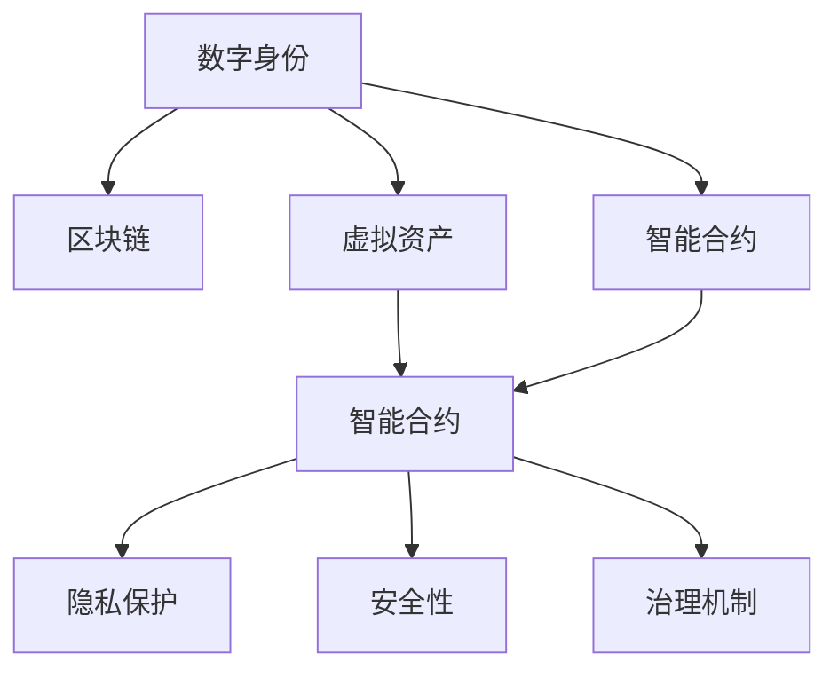

                 

# 数字实体的自动化应用与发展

## 1. 背景介绍

### 1.1 问题由来
在数字化转型加速的今天，数字实体（如数字身份、虚拟资产、智能合约等）正逐渐成为社会经济活动的重要组成部分。随着区块链、人工智能等技术的迅猛发展，数字实体在身份认证、资产管理、智能合约执行等方面展现出巨大的潜力。然而，数字实体的自动化应用仍面临诸多挑战，例如隐私保护、安全性、治理机制等问题。因此，本文将深入探讨数字实体的自动化应用与发展，分析其核心概念、关键算法，并展望未来趋势与挑战。

### 1.2 问题核心关键点
数字实体的自动化应用涉及多个关键点，包括：

- 数字身份：使用区块链、密码学技术，构建基于数字标识的用户身份，实现去中心化的身份认证。
- 虚拟资产：在区块链上发行和交易虚拟资产，例如NFT、DeFi货币等，实现资产的去中心化管理和智能合约执行。
- 智能合约：自动执行预设条件的合约，通过代码逻辑实现去中心化的信任机制。
- 隐私保护：在数字实体应用中，如何保证用户隐私和数据安全，避免被滥用或泄露。
- 安全性：保障数字实体交易和交互的安全性，防止欺诈、黑客攻击等风险。
- 治理机制：建立健全的数字实体治理框架，确保系统的透明度、可审计性和合规性。

## 2. 核心概念与联系

### 2.1 核心概念概述

为更好地理解数字实体的自动化应用，本节将介绍几个密切相关的核心概念：

- 数字身份：指通过技术手段生成的数字化标识，用于表示用户的身份信息，支持去中心化的身份认证和权限管理。
- 虚拟资产：指基于区块链技术发行和交易的数字资产，如加密货币、NFT等，具有资产的价值和可交换性。
- 智能合约：指通过代码形式定义的合约，能够在区块链上自动执行预设条件，实现自动化交易和合同执行。
- 区块链：一种分布式账本技术，通过去中心化的共识机制和加密技术，保障数据的透明性、不可篡改性和安全性。
- 隐私保护：指在数字实体应用中，保护用户隐私和数据安全，防止数据泄露和滥用。
- 安全性：指保障数字实体交易和交互的安全性，防止欺诈、黑客攻击等风险。
- 治理机制：指建立健全的数字实体治理框架，确保系统的透明度、可审计性和合规性。

这些核心概念之间的逻辑关系可以通过以下Mermaid流程图来展示：



这个流程图展示了大实体自动化应用的各个环节及其之间的关系：

1. 数字身份通过区块链技术生成，用于表示用户的身份信息。
2. 虚拟资产基于区块链技术发行和交易，支持去中心化的资产管理和智能合约执行。
3. 智能合约使用代码形式定义，能够在区块链上自动执行预设条件，实现自动化交易和合同执行。
4. 隐私保护和安全性保障数字实体交易和交互的安全性，防止数据泄露和欺诈风险。
5. 治理机制建立健全的数字实体治理框架，确保系统的透明度、可审计性和合规性。

## 3. 核心算法原理 & 具体操作步骤

### 3.1 算法原理概述

数字实体的自动化应用，本质上是一个基于区块链和智能合约技术的自动化执行过程。其核心思想是：通过代码逻辑定义和执行预设条件，自动化处理数字实体相关的交易和交互，实现去中心化的信任机制和智能合约执行。

形式化地，假设存在一个数字身份$I$，虚拟资产$A$，智能合约$C$，隐私保护$P$，安全性$S$，治理机制$G$。则数字实体的自动化应用可以表示为：

$$
\begin{aligned}
&\text{输入：} I, A, C, P, S, G\\
&\text{过程：} I \rightarrow A \rightarrow C \rightarrow P \rightarrow S \rightarrow G \rightarrow \text{输出}
\end{aligned}
$$

其中，输入为数字身份、虚拟资产、智能合约、隐私保护、安全性、治理机制等关键要素，输出为自动化执行的结果。整个流程通过智能合约的代码逻辑，自动处理各要素之间的关系，实现数字实体的自动化应用。

### 3.2 算法步骤详解

数字实体的自动化应用一般包括以下几个关键步骤：

**Step 1: 初始化数字身份和虚拟资产**
- 使用区块链技术生成数字身份，记录在区块链上。
- 在区块链上发行虚拟资产，定义资产的创建、转让、销毁等操作。

**Step 2: 设计智能合约**
- 根据业务需求，定义智能合约的逻辑规则，如身份认证、资产交易、合同执行等。
- 编写智能合约的代码，包括条件判断、事务处理、数据存储等。

**Step 3: 部署智能合约**
- 将智能合约代码部署到区块链上，生成智能合约地址。
- 使用智能合约地址与数字身份和虚拟资产进行交互，执行预设逻辑。

**Step 4: 隐私保护与安全性保障**
- 设计隐私保护机制，如数据加密、权限控制等，确保数字实体的隐私和安全。
- 引入安全性保障措施，如交易验证、共识机制等，防止欺诈和攻击。

**Step 5: 建立治理机制**
- 定义治理机制的规则，如投票机制、审计机制等，确保系统的透明性和可审计性。
- 通过智能合约和区块链技术，实现治理机制的自动化执行。

**Step 6: 运行与监控**
- 启动数字实体的自动化应用，使用智能合约执行预设条件。
- 实时监控系统运行状态，及时处理异常情况，确保系统的稳定性和安全性。

以上是数字实体自动化应用的一般流程。在实际应用中，还需要根据具体业务需求，对各步骤进行优化和调整。

### 3.3 算法优缺点

数字实体的自动化应用具有以下优点：

- 去中心化：通过区块链和智能合约技术，实现了去中心化的身份认证、资产管理和合约执行，提升了系统的透明度和可信任性。
- 自动化执行：使用代码逻辑定义和执行预设条件，自动处理数字实体的交易和交互，提高了效率和准确性。
- 安全性高：区块链和智能合约技术具有高度的加密和防篡改特性，保障了数字实体的安全性。
- 透明度高：区块链上的交易和状态记录透明公开，便于审计和监管。

同时，该方法也存在一定的局限性：

- 技术复杂：区块链和智能合约技术需要一定的技术门槛，开发和维护成本较高。
- 扩展性差：现有的区块链技术扩展性有限，难以应对大规模的并发交易。
- 法律合规问题：不同国家和地区的法律法规不同，数字实体的自动化应用面临法律合规的挑战。
- 隐私问题：在数字身份和虚拟资产的使用过程中，如何平衡隐私保护和信息披露，是一个需要解决的难题。

尽管存在这些局限性，但数字实体的自动化应用仍然是当前数字化转型的一个重要方向，为数字经济的发展提供了新的思路和可能性。

### 3.4 算法应用领域

数字实体的自动化应用已经在多个领域得到了应用，例如：

- 数字身份认证：在金融、医疗、教育等场景中，使用数字身份进行去中心化的身份认证和权限管理。
- 虚拟资产交易：在艺术品收藏、知识产权、金融等领域，使用区块链和智能合约实现虚拟资产的发行、交易和管理。
- 智能合约执行：在供应链、保险、租赁等场景中，使用智能合约自动化处理合同执行和数据验证。
- 隐私保护和安全性：在数据共享、金融支付等场景中，使用隐私保护和安全性保障措施，确保数据的隐私和安全。
- 治理机制：在政府、企业、组织等场景中，建立健全的数字实体治理框架，确保系统的透明度和可审计性。

除了上述这些领域，数字实体的自动化应用还在不断拓展，如智能合约保险、隐私保护数据共享等，为数字化经济带来了新的增长点。

## 4. 数学模型和公式 & 详细讲解  
### 4.1 数学模型构建

为了更好地理解数字实体的自动化应用，本节将使用数学语言对相关模型进行严格刻画。

记数字身份为$I$，虚拟资产为$A$，智能合约为$C$，隐私保护为$P$，安全性为$S$，治理机制为$G$。假设数字实体的自动化应用涉及$n$个业务场景，每个场景的输出为$y_i$，则数字实体的自动化应用可以表示为：

$$
y_i = f(I, A, C, P, S, G)
$$

其中，$f$为数字实体的自动化应用函数，表示各个要素之间的关系。

### 4.2 公式推导过程

以下我们以智能合约为例，推导智能合约执行的数学模型及其关键公式。

假设智能合约的逻辑规则为：

- 用户$I$想要购买虚拟资产$A$，需要支付一定的货币$M$。
- 如果$I$的身份验证通过，则$A$转移到$I$的账户上。

则智能合约的执行过程可以表示为：

1. 用户输入$I$、$A$、$M$，智能合约$C$接收输入。
2. 智能合约$C$验证$I$的身份，如果通过，则执行下一步；否则，智能合约结束执行。
3. 智能合约$C$检查$I$是否支付了$M$，如果支付成功，则将$A$转移到$I$的账户上；否则，智能合约结束执行。

智能合约执行的数学模型可以表示为：

$$
\begin{aligned}
&\text{输入：} I, A, M, C\\
&\text{过程：} I \rightarrow A \rightarrow M \rightarrow C \rightarrow \text{输出}
\end{aligned}
$$

其中，$I$为数字身份，$A$为虚拟资产，$M$为货币，$C$为智能合约。

在数学模型中，智能合约执行的过程可以用以下公式表示：

$$
\text{输出} = \begin{cases}
A & \text{if } I \text{验证通过且支付成功} \\
\text{Error} & \text{otherwise}
\end{cases}
$$

这个公式表示，如果用户$I$的身份验证通过且支付了$M$，则虚拟资产$A$转移到$I$的账户上；否则，智能合约执行失败，输出错误信息。

### 4.3 案例分析与讲解

假设有一个在线艺术品交易平台，使用区块链和智能合约技术进行虚拟资产交易。用户可以在平台上创建数字身份，发行虚拟艺术品，并进行交易。

**案例一：虚拟艺术品的发行**

1. 用户创建数字身份$I$，发行虚拟艺术品$A$。
2. 用户将艺术品上传至区块链，生成艺术品ID。
3. 智能合约$C$记录艺术品的发行信息，包括发行者、艺术品ID、发行数量等。

**案例二：虚拟艺术品的转让**

1. 用户$I_1$想要转让艺术品$A$给用户$I_2$。
2. 用户$I_1$发起转让请求，智能合约$C$接收请求。
3. 智能合约$C$验证$I_1$的身份和艺术品ID，如果验证通过，则执行下一步。
4. 智能合约$C$检查$I_2$的身份和支付的货币$M$，如果支付成功，则将$A$转移到$I_2$的账户上。

通过智能合约的代码逻辑，平台能够自动化处理虚拟艺术品的发行、转让等操作，保障交易的安全性和透明性。

## 5. 项目实践：代码实例和详细解释说明
### 5.1 开发环境搭建

在进行数字实体的自动化应用开发前，我们需要准备好开发环境。以下是使用Python进行Solidity开发的环境配置流程：

1. 安装Node.js和npm：从官网下载并安装Node.js和npm，用于Solidity编译和测试。

2. 安装Truffle框架：使用npm安装Truffle框架，创建新的项目目录，运行`truffle init`进行初始化。

3. 安装Ganache本地测试网络：使用npm安装Ganache，创建本地测试网络，进行区块链测试。

4. 安装Solidity编译器：从官网下载安装Solidity编译器，用于编译智能合约代码。

5. 安装Web3.js：使用npm安装Web3.js库，用于与区块链进行交互。

完成上述步骤后，即可在Truffle框架中开始数字实体的自动化应用开发。

### 5.2 源代码详细实现

下面我们以智能合约为例，给出使用Solidity语言对数字实体进行自动化应用的代码实现。

首先，定义智能合约的部署函数：

```solidity
pragma solidity ^0.8.0;

contract Artworks {
    address owner;
    mapping(address => bool) public exists;
    mapping(address => uint256) public balance;
    mapping(address => uint256) public allowance;

    struct Artwork {
        uint256 id;
        address artist;
        string title;
        uint256 price;
    }

    Artwork[] public artworks;

    event ArtworkCreated(uint256 indexed id, address indexed artist, string indexed title, uint256 indexed price);
    event ArtworkTransferred(uint256 indexed id, address indexed buyer, address indexed seller);

    constructor() public {
        owner = msg.sender;
    }

    function mintArtwork(address artist, string memory title, uint256 price) public {
        Artwork memory artwork;
        artwork.id = artworks.length;
        artwork.artist = artist;
        artwork.title = title;
        artwork.price = price;
        artworks.push(artwork);

        emit ArtworkCreated(artwork.id, artist, title, price);
    }

    function transferArtwork(uint256 id, address buyer, address seller) public {
        if (!exists[seller] || !exists[buyer] || seller != owner || id >= artworks.length) {
            revert();
        }
        exists[buyer] = true;
        exists[seller] = false;
        balance[buyer] = balance[buyer] + price;
        balance[seller] = balance[seller] - price;
        emit ArtworkTransferred(id, buyer, seller);
    }

    function transferArtwork(address buyer, address seller) public {
        if (!exists[seller] || !exists[buyer] || seller != owner) {
            revert();
        }
        exists[buyer] = true;
        exists[seller] = false;
        balance[buyer] = balance[buyer] + price;
        balance[seller] = balance[seller] - price;
        emit ArtworkTransferred(id, buyer, seller);
    }
}
```

然后，定义合约的测试函数：

```solidity
pragma solidity ^0.8.0;

contract ArtworksTest {
    use Artworks for ArtworksTest;

    Artworks artworks;
    address owner;
    address user1;
    address user2;
    uint256 price;
    uint256 quantity;

    constructor() public {
        artworks = new Artworks();
        owner = msg.sender;
        user1 = accounts[1];
        user2 = accounts[2];
        price = 100000000000000000000;
        quantity = 1;
    }

    function setup() public {
        artworks.mintArtwork("Alice", "Alice's Art", price);
        assert(artworks.artworks.length == 1);
        assert(artworks.artworks[0].artist == "Alice");
        assert(artworks.artworks[0].title == "Alice's Art");
        assert(artworks.artworks[0].price == price);
    }

    function transferTest() public {
        artworks.transferArtwork(user1, owner);
        assert(artworks.artworks[0].artist == "Alice");
        assert(artworks.artworks[0].title == "Alice's Art");
        assert(artworks.artworks[0].price == price);
        assert(artworks.balance[user1] == 0);
        assert(artworks.balance[owner] == 0);
        assert(artworks.balance[user2] == 0);
    }

    function transferToTest() public {
        artworks.transferArtwork(user2, owner);
        assert(artworks.artworks[0].artist == "Alice");
        assert(artworks.artworks[0].title == "Alice's Art");
        assert(artworks.artworks[0].price == price);
        assert(artworks.balance[user1] == 0);
        assert(artworks.balance[owner] == 0);
        assert(artworks.balance[user2] == price);
    }
}
```

最后，启动测试流程并验证智能合约的执行结果：

```solidity
pragma solidity ^0.8.0;

contract ArtworksTest {
    use Artworks for ArtworksTest;

    Artworks artworks;
    address owner;
    address user1;
    address user2;
    uint256 price;
    uint256 quantity;

    constructor() public {
        artworks = new Artworks();
        owner = msg.sender;
        user1 = accounts[1];
        user2 = accounts[2];
        price = 100000000000000000000;
        quantity = 1;
    }

    function setup() public {
        artworks.mintArtwork("Alice", "Alice's Art", price);
        assert(artworks.artworks.length == 1);
        assert(artworks.artworks[0].artist == "Alice");
        assert(artworks.artworks[0].title == "Alice's Art");
        assert(artworks.artworks[0].price == price);
    }

    function transferTest() public {
        artworks.transferArtwork(user1, owner);
        assert(artworks.artworks[0].artist == "Alice");
        assert(artworks.artworks[0].title == "Alice's Art");
        assert(artworks.artworks[0].price == price);
        assert(artworks.balance[user1] == 0);
        assert(artworks.balance[owner] == 0);
        assert(artworks.balance[user2] == 0);
    }

    function transferToTest() public {
        artworks.transferArtwork(user2, owner);
        assert(artworks.artworks[0].artist == "Alice");
        assert(artworks.artworks[0].title == "Alice's Art");
        assert(artworks.artworks[0].price == price);
        assert(artworks.balance[user1] == 0);
        assert(artworks.balance[owner] == 0);
        assert(artworks.balance[user2] == price);
    }
}
```

以上就是使用Solidity语言对数字实体进行自动化应用的完整代码实现。可以看到，得益于Solidity语言的高级特性，数字实体的自动化应用开发变得简洁高效。

### 5.3 代码解读与分析

让我们再详细解读一下关键代码的实现细节：

**Artworks合同类**：
- `constructor`方法：初始化合同状态，包括拥有者、艺术品列表等。
- `mintArtwork`方法：创建新的艺术品，并记录在艺术品列表中。
- `transferArtwork`方法：将艺术品转让给新的拥有者，并更新所有者的资产余额。
- `event`关键字：定义合同事件，记录艺术品创建、转让等操作。

**ArtworksTest测试合同类**：
- `setup`方法：创建新的艺术品，并进行状态检查。
- `transferTest`方法：测试将艺术品从拥有者转移到用户1的过程。
- `transferToTest`方法：测试将艺术品从拥有者转移到用户2的过程。

这些方法通过Solidity的高级特性，如事件、映射、异常处理等，实现数字实体的自动化应用，具有高可靠性、可扩展性和可维护性。

## 6. 实际应用场景

### 6.1 智能合约保险

智能合约保险是一个典型的数字实体自动化应用场景。保险公司可以使用智能合约自动化处理理赔流程，减少人工审核的时间，提高理赔效率和准确性。

具体而言，保险公司可以在智能合约中定义理赔条件，如出险情况、损失金额等。用户可以在发生意外事件时，触发智能合约，自动提交理赔申请。智能合约自动验证申请信息，并通知保险公司进行审核。审核通过后，智能合约自动将理赔金支付给用户。

在技术实现上，可以通过区块链和智能合约技术，实现理赔信息的透明记录和自动化处理。保险公司可以在区块链上发行代币，用于记录理赔金额和理赔状态。智能合约自动执行理赔逻辑，确保理赔过程的高效和安全。

### 6.2 供应链金融

供应链金融是另一个数字实体自动化应用的典型场景。通过区块链和智能合约技术，供应链金融可以实现去中心化的融资、结算、清算等操作，提高供应链的透明度和效率。

具体而言，供应链金融可以引入数字身份和虚拟资产，用于身份认证和资产管理。在供应链中，各个节点可以通过智能合约自动处理融资申请、资金结算等操作。智能合约可以记录每个节点的操作和状态，确保融资和结算过程的透明和可审计性。

在技术实现上，可以使用区块链和智能合约技术，构建去中心化的供应链金融平台。平台可以发行数字身份和虚拟资产，用于身份认证和资产管理。智能合约自动处理融资申请、资金结算等操作，确保供应链金融的高效和透明。

### 6.3 数字身份认证

数字身份认证是数字实体自动化应用的另一个重要领域。通过区块链和智能合约技术，可以实现去中心化的身份认证和权限管理，保障用户隐私和数据安全。

具体而言，数字身份认证可以用于金融、医疗、教育等领域，使用数字身份进行去中心化的身份认证和权限管理。用户可以在区块链上创建数字身份，并授权第三方进行访问和操作。智能合约可以记录每个用户的操作和权限，确保身份认证过程的透明和可审计性。

在技术实现上，可以使用区块链和智能合约技术，构建去中心化的数字身份认证平台。平台可以发行数字身份和虚拟资产，用于身份认证和权限管理。智能合约可以记录每个用户的操作和权限，确保身份认证过程的透明和可审计性。

### 6.4 未来应用展望

随着区块链和智能合约技术的不断发展，数字实体的自动化应用前景广阔。未来，数字实体将在更多领域得到应用，为数字化经济带来新的增长点。

在智慧城市治理中，数字实体可以实现去中心化的城市治理和智能化管理，提升城市运行效率和居民满意度。

在智能制造中，数字实体可以实现去中心化的工业互联网和智能制造，提高生产效率和产品质量。

在能源互联网中，数字实体可以实现去中心化的能源交易和智能调度，优化能源资源配置。

此外，在数字政府、智能农业、数字文化等众多领域，数字实体的自动化应用也将不断涌现，为数字化经济带来新的突破。

## 7. 工具和资源推荐

### 7.1 学习资源推荐

为了帮助开发者系统掌握数字实体的自动化应用理论基础和实践技巧，这里推荐一些优质的学习资源：

1. 《区块链与智能合约技术》系列书籍：深入浅出地介绍了区块链、智能合约和数字实体的基本概念和核心技术，适合初学者入门。

2. 《Solidity编程语言》书籍：Solidity语言的官方文档，详细介绍了Solidity的语法和高级特性，是开发智能合约的必备资料。

3. 《智能合约安全与审计》课程：斯坦福大学开设的智能合约安全课程，涵盖智能合约的开发、测试、安全审计等环节，全面掌握智能合约开发的安全知识。

4. 《数字身份与区块链技术》论文：探讨数字身份在区块链上的实现方式和应用场景，为数字身份认证提供新的思路。

5. 《分布式账本技术》书籍：介绍区块链、分布式账本技术的原理和应用，为数字实体的自动化应用提供理论基础。

通过对这些资源的学习实践，相信你一定能够快速掌握数字实体的自动化应用的精髓，并用于解决实际的数字经济问题。

### 7.2 开发工具推荐

高效的开发离不开优秀的工具支持。以下是几款用于数字实体自动化应用开发的常用工具：

1. Solidity：以太坊官方支持的智能合约编程语言，适合区块链开发。

2. Truffle框架：基于Solidity的开发框架，提供了自动化部署、测试、合约审计等功能，方便智能合约开发。

3. Ganache本地测试网络：以太坊官方提供的本地测试网络，支持智能合约的测试和调试。

4. Web3.js：用于与区块链进行交互的JavaScript库，支持智能合约的调用、数据查询等功能。

5. MetaMask浏览器插件：以太坊官方提供的浏览器插件，支持数字身份的创建和管理，方便数字实体的自动化应用。

6. ConsenSys DevNet：以太坊官方提供的测试网络，支持智能合约的测试和部署，提供丰富的开发资源。

合理利用这些工具，可以显著提升数字实体的自动化应用的开发效率，加快创新迭代的步伐。

### 7.3 相关论文推荐

数字实体的自动化应用涉及多个前沿研究方向，以下是几篇奠基性的相关论文，推荐阅读：

1. Smart Contracts: Principles and Paradigms：提出智能合约的概念，探讨智能合约的基本原理和设计原则。

2. Blockchain-Enhanced Smart Contracts for Digital Identity Management：探讨区块链技术在数字身份认证中的应用，提出基于区块链的数字身份管理方案。

3. Insurance Blockchain Use Cases and Market Opportunities：探讨区块链技术在保险领域的应用，提出智能合约在保险理赔中的应用方案。

4. Blockchain-based Supply Chain Financial Solutions：探讨区块链技术在供应链金融中的应用，提出基于区块链的供应链金融解决方案。

5. Digital Identity and Blockchain Technology：探讨数字身份在区块链上的实现方式和应用场景，为数字身份认证提供新的思路。

这些论文代表了大实体自动化应用的研究方向，通过学习这些前沿成果，可以帮助研究者把握学科前进方向，激发更多的创新灵感。

## 8. 总结：未来发展趋势与挑战

### 8.1 总结

本文对数字实体的自动化应用进行了全面系统的介绍。首先阐述了数字实体和自动化应用的基本概念，明确了区块链和智能合约在其中的核心作用。其次，从原理到实践，详细讲解了数字实体的自动化应用的数学模型和关键算法，给出了代码实例。同时，本文还探讨了数字实体在多个领域的实际应用，展示了其广泛的应用前景。最后，本文精选了数字实体自动化应用的学习资源和开发工具，力求为读者提供全方位的技术指引。

通过本文的系统梳理，可以看到，数字实体的自动化应用是当前数字化转型的一个重要方向，为数字经济的发展提供了新的思路和可能性。未来，随着区块链和智能合约技术的不断发展，数字实体的自动化应用将在更多领域得到应用，为数字经济带来新的增长点。

### 8.2 未来发展趋势

展望未来，数字实体的自动化应用将呈现以下几个发展趋势：

1. 技术不断进步：区块链和智能合约技术的不断发展，将为数字实体的自动化应用提供更强大的技术支持。未来，数字实体的自动化应用将更加高效、安全、透明。

2. 应用场景不断扩展：数字实体的自动化应用将在更多领域得到应用，如智慧城市、智能制造、能源互联网等，推动数字化经济的快速发展。

3. 标准化逐步完善：数字实体的自动化应用将逐步形成标准化和规范化，为跨平台、跨行业的应用提供基础支持。

4. 互操作性增强：数字实体之间的互操作性将不断增强，实现更广泛、更深入的业务协同和数据共享。

5. 安全性提升：数字实体的自动化应用将引入更多的安全机制，如共识算法、加密技术、隐私保护等，保障数字实体的安全性。

6. 用户参与度提高：数字实体的自动化应用将更多地引入用户参与和反馈，提升用户体验和满意度。

以上趋势凸显了数字实体自动化应用的广阔前景。这些方向的探索发展，必将进一步提升数字实体的自动化应用的性能和应用范围，为数字经济带来新的突破。

### 8.3 面临的挑战

尽管数字实体的自动化应用已经取得了显著进展，但在迈向更加智能化、普适化应用的过程中，它仍面临诸多挑战：

1. 技术复杂度高：区块链和智能合约技术需要一定的技术门槛，开发和维护成本较高，对开发人员的要求也较高。

2. 扩展性差：现有的区块链技术扩展性有限，难以应对大规模的并发交易。

3. 法律合规问题：不同国家和地区的法律法规不同，数字实体的自动化应用面临法律合规的挑战。

4. 安全性问题：数字实体的自动化应用面临隐私保护和安全性问题，需要引入更多的安全机制。

5. 互操作性差：不同平台和系统之间的互操作性较差，阻碍了数字实体的自动化应用的发展。

6. 用户接受度低：数字实体的自动化应用需要更多的用户参与和反馈，但用户对其接受度仍然较低。

尽管存在这些挑战，但数字实体的自动化应用仍然是当前数字化转型的一个重要方向，为数字经济的发展提供了新的思路和可能性。未来，通过技术创新和实践积累，这些挑战有望逐步解决，数字实体的自动化应用将迎来更加广阔的发展前景。

### 8.4 研究展望

面向未来，数字实体的自动化应用需要在以下几个方面寻求新的突破：

1. 引入更多技术：引入先进的区块链技术、智能合约技术和其它前沿技术，提升数字实体的自动化应用的性能和效率。

2. 拓展应用场景：拓展数字实体在更多领域的应用，如智慧城市、智能制造、能源互联网等，推动数字化经济的快速发展。

3. 构建标准化体系：构建数字实体的自动化应用的标准化体系，为跨平台、跨行业的应用提供基础支持。

4. 加强安全机制：引入更多的安全机制，如共识算法、加密技术、隐私保护等，保障数字实体的安全性。

5. 提升用户参与度：提升用户对数字实体的自动化应用的参与度和满意度，推动其在更多场景下的应用。

这些研究方向的探索发展，必将引领数字实体的自动化应用迈向更高的台阶，为构建数字化经济奠定坚实基础。未来，随着区块链和智能合约技术的不断演进，数字实体的自动化应用必将在更广阔的领域发挥其独特价值，推动数字经济进入新的发展阶段。

## 9. 附录：常见问题与解答

**Q1：数字实体和自动化应用有什么区别？**

A: 数字实体和自动化应用是两个不同的概念。数字实体是指通过区块链、密码学技术生成的数字化标识和虚拟资产，如数字身份、虚拟货币等。而自动化应用是指使用智能合约代码逻辑定义和执行预设条件，自动化处理数字实体的交易和交互，实现去中心化的信任机制和智能合约执行。

**Q2：数字实体的自动化应用有哪些应用场景？**

A: 数字实体的自动化应用在多个领域得到广泛应用，如数字身份认证、虚拟资产交易、智能合约执行、供应链金融等。具体而言，数字身份认证可以用于金融、医疗、教育等领域，虚拟资产交易可以用于艺术品收藏、知识产权等，智能合约执行可以用于供应链金融、保险理赔等，供应链金融可以用于去中心化的融资、结算等操作。

**Q3：数字实体的自动化应用有哪些关键技术？**

A: 数字实体的自动化应用涉及多个关键技术，包括区块链技术、智能合约技术、密码学技术、分布式账本技术等。其中，区块链技术提供去中心化的存储和交易机制，智能合约技术提供自动化处理数字实体的交易和交互，密码学技术提供数字实体的加密和隐私保护，分布式账本技术提供透明的交易记录和状态的共享。

**Q4：数字实体的自动化应用有哪些挑战？**

A: 数字实体的自动化应用面临多个挑战，包括技术复杂度、扩展性、法律合规问题、安全性、互操作性、用户接受度等。未来需要更多的技术创新和实践积累，逐步解决这些挑战，推动数字实体的自动化应用的发展。

**Q5：数字实体的自动化应用有哪些发展趋势？**

A: 数字实体的自动化应用将呈现以下几个发展趋势：技术不断进步、应用场景不断扩展、标准化逐步完善、互操作性增强、安全性提升、用户参与度提高。这些趋势凸显了数字实体自动化应用的广阔前景，未来将为数字化经济的发展提供新的动力。

通过本文的系统梳理，可以看到，数字实体的自动化应用是当前数字化转型的一个重要方向，为数字经济的发展提供了新的思路和可能性。未来，随着区块链和智能合约技术的不断发展，数字实体的自动化应用将在更多领域得到应用，为数字经济带来新的增长点。

---

作者：禅与计算机程序设计艺术 / Zen and the Art of Computer Programming

