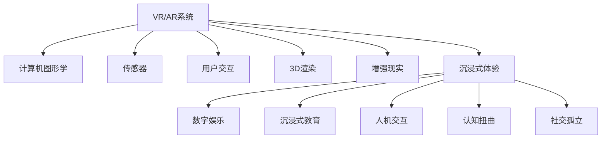

                 

# 数字毒品：AI创造的沉浸式体验

> 关键词：虚拟现实(VR), 增强现实(AR), 人工智能(AI), 沉浸式体验(Immersive Experience), 人机交互(Human-Computer Interaction), 数字娱乐(Digital Entertainment), 沉浸式教育(Immersive Education)

## 1. 背景介绍

### 1.1 问题由来
随着人工智能(AI)技术的飞速发展，虚拟现实(VR)和增强现实(AR)领域也迎来了爆发式增长。借助AI的强大算法，VR/AR设备能够提供更加丰富、逼真的沉浸式体验，为用户提供身临其境的感觉。但与此同时，这种沉浸式体验也带来了一些负面影响，常被形容为"数字毒品"。

### 1.2 问题核心关键点
所谓的"数字毒品"，指的是VR/AR设备的沉浸式体验，虽然带来了前所未有的娱乐、教育、训练等效用，但也容易让人过度依赖，导致现实生活中的人际交往和情感体验受损。以下是其核心关键点：

- 沉浸感过强：VR/AR设备通过高度逼真的3D渲染和交互技术，营造出强大的沉浸感，难以分辨现实与虚拟，易引发过度依赖。
- 时间沉没成本：长时间沉浸在虚拟世界中，会减少现实生活中的人际交往和社会活动，对个人生活产生负面影响。
- 情感冷漠化：高度沉浸式体验可能导致情感冷漠，降低现实生活中的人际互动和社会参与感。
- 认知扭曲：长时间的虚拟世界体验，可能导致认知水平下降，现实判断力受损。
- 社交孤立：过度依赖虚拟社交，会减少现实生活中的人际联系和社交互动，导致孤立倾向。

### 1.3 问题研究意义
研究"数字毒品"现象，对于维护个人心理健康和社会稳定具有重要意义：

1. 提升自我意识：通过深入理解VR/AR体验的负面影响，提升个人对科技使用的自我管理能力，避免过度依赖。
2. 优化用户体验：平衡沉浸式体验和现实生活，确保用户获得既健康又愉悦的使用体验。
3. 社会治理：研究如何通过政策和技术手段，引导和规范VR/AR技术的使用，预防和减少"数字毒品"现象的负面影响。
4. 产业发展：探索健康、可持续的数字娱乐和教育模式，推动VR/AR技术的良性发展。

## 2. 核心概念与联系

### 2.1 核心概念概述

为更好地理解"数字毒品"现象，本节将介绍几个关键概念：

- **虚拟现实(VR)**：一种通过计算机技术创建完全或部分代替现实世界的交互式三维环境。用户通过头戴式显示器、手柄等设备，体验到虚拟环境中的真实感。
- **增强现实(AR)**：通过数字信息增强现实世界的视觉体验，将虚拟元素与现实场景融合在一起。
- **沉浸式体验(Immersive Experience)**：一种高度真实、互动的感官体验，通过多感官刺激（视觉、听觉、触觉等），使用户完全沉浸在虚拟或增强环境中。
- **人机交互(Human-Computer Interaction, HCI)**：研究用户如何与计算机系统进行交互，目标是提高系统的易用性和效率。
- **数字娱乐(Digital Entertainment)**：利用计算机技术创建的游戏、影视、音乐等娱乐形式，为用户带来新的体验。
- **沉浸式教育(Immersive Education)**：通过虚拟现实、增强现实等技术，提供沉浸式学习环境，提升教育效果。

这些概念之间有着紧密的联系，通过VR/AR技术，可以创造出高度沉浸式体验，进而影响人机交互方式和用户行为。

### 2.2 核心概念原理和架构的 Mermaid 流程图



这个流程图展示了大语言模型微调的核心概念及其之间的关系：

1. VR/AR系统通过计算机图形学、传感器、3D渲染等技术，创造出沉浸式体验。
2. 沉浸式体验影响用户的行为和认知，可能导致认知扭曲和社交孤立等负面影响。
3. 沉浸式体验应用于数字娱乐和教育领域，提升用户体验和教育效果。
4. 人机交互与沉浸式体验密切相关，进一步优化用户体验。

## 3. 核心算法原理 & 具体操作步骤
### 3.1 算法原理概述

"数字毒品"现象的产生，与沉浸式体验的深度和时长密切相关。算法原理的核心在于通过AI技术控制和调整VR/AR设备的沉浸感，以达到健康、适度的体验效果。

算法的基本思路是：
1. 使用AI算法实时监控用户的行为和生理数据，如心率、呼吸、注意力等。
2. 根据预设阈值和行为模式，调整虚拟环境的沉浸感，防止用户过度依赖。
3. 设计多样化交互任务，引导用户合理使用VR/AR设备，平衡沉浸式体验和现实生活。

### 3.2 算法步骤详解

以下是实现"数字毒品"算法的主要步骤：

**Step 1: 数据收集和监控**
- 安装VR/AR设备上的传感器，收集用户的生理和行为数据。
- 实时监控用户的心率、呼吸、注意力等指标，通过生理监测器（如心率带、眼动追踪器等）获取数据。

**Step 2: 阈值设定与警报触发**
- 根据预设阈值（如时间、心率、注意力等），设定触发警报的条件。
- 当用户的生理或行为数据超出预设阈值时，自动触发警报提醒用户，建议暂时离开虚拟环境。

**Step 3: 沉浸感调整**
- 根据用户的警报状态和互动行为，动态调整虚拟环境的沉浸感。
- 例如，当用户处于低情绪状态时，降低虚拟环境的色彩饱和度，减少视觉刺激；当用户长时间不互动时，自动退出虚拟环境。

**Step 4: 任务引导与交互**
- 设计多样化的交互任务，引导用户合理使用VR/AR设备。
- 如虚拟探险、解谜游戏、虚拟工作坊等，减少用户长时间沉浸在单一任务中。

**Step 5: 反馈与优化**
- 收集用户的使用反馈，不断优化算法参数，提升用户体验。
- 定期更新阈值和行为模式，适应用户的变化和偏好。

### 3.3 算法优缺点

**优点**：
1. 实时监控：通过实时监测用户的生理和行为数据，及时发现过度依赖的情况，减少负面影响。
2. 动态调整：根据用户的状态和行为，动态调整虚拟环境的沉浸感，避免过度刺激。
3. 多样任务：设计多样化的交互任务，引导用户合理使用VR/AR设备，平衡沉浸式体验和现实生活。
4. 用户反馈：收集用户的使用反馈，不断优化算法，提升用户体验。

**缺点**：
1. 隐私问题：实时监控用户数据，可能引发隐私保护和伦理道德问题。
2. 依赖性：用户可能对监控和调整机制产生依赖，反而影响用户体验。
3. 数据准确性：生理和行为数据的准确性和可靠性，影响算法的有效性。
4. 用户体验：频繁的警报和调整可能降低用户对VR/AR设备的兴趣和满意度。

### 3.4 算法应用领域

"数字毒品"算法在多个领域具有广泛的应用前景：

- **数字娱乐**：通过实时监控和调整，控制用户的游戏时间和强度，提升游戏体验和健康水平。
- **沉浸式教育**：设计合理的交互任务，引导学生合理安排学习时间，提高学习效果。
- **医疗康复**：监测用户的生理数据，调整虚拟康复环境，帮助患者更好地恢复健康。
- **心理健康**：通过AI技术监测用户的情绪和行为，预防和减轻过度沉浸带来的心理问题。
- **社会治理**：引导和规范VR/AR技术的使用，预防和减少社会问题的发生。

这些应用场景展示了"数字毒品"算法的潜在价值，有助于提升技术的应用效果，实现健康、可持续的发展。

## 4. 数学模型和公式 & 详细讲解 & 举例说明

### 4.1 数学模型构建

为了构建"数字毒品"算法的数学模型，我们需要引入以下变量：
- $t$：用户使用VR/AR设备的时间。
- $h(t)$：用户在时间$t$的心率数据。
- $a(t)$：用户在时间$t$的注意力数据。
- $s(t)$：用户在时间$t$的生理状态评分。
- $\tau$：预设的心率阈值。
- $\alpha$：预设的注意力阈值。
- $\beta$：预设的生理状态评分阈值。
- $c(t)$：用户在时间$t$的行为模式。
- $w$：权重向量，表示各变量对沉浸感的影响权重。

### 4.2 公式推导过程

根据上述变量，构建"数字毒品"算法的数学模型：

1. **生理监测**
   - 心率阈值：当 $h(t) > \tau$ 时，触发警报，提醒用户；当 $h(t) < \tau$ 时，保持当前沉浸感。
   - 注意力阈值：当 $a(t) > \alpha$ 时，触发警报，提醒用户；当 $a(t) < \alpha$ 时，保持当前沉浸感。
   - 生理状态评分：根据生理监测数据，计算用户状态评分 $s(t)$，当 $s(t) < \beta$ 时，降低沉浸感。

2. **行为模式**
   - 行为模式 $c(t)$ 可以是用户互动频率、任务完成度等指标。
   - 根据行为模式，调整沉浸感，如长时间不互动时，降低沉浸感；连续完成多个任务时，适当提升沉浸感。

3. **权重向量**
   - 权重向量 $w$ 表示各变量对沉浸感的影响权重，可以根据用户偏好和行为数据进行调整。

4. **综合评估**
   - 综合评估用户状态 $s(t)$，根据生理、注意力、行为模式等指标，计算沉浸感评分。
   - 根据评分，动态调整虚拟环境的沉浸感。

### 4.3 案例分析与讲解

**案例分析**：
- 一名学生在虚拟教室中使用VR/AR设备进行沉浸式学习，心率监测器记录其心率为120bpm，注意力监测器显示其注意力为80%。根据预设阈值 $\tau=130bpm$，$\alpha=70%$，用户心率超过阈值，触发警报。系统提醒用户，建议暂时离开虚拟教室，休息10分钟。
- 用户重新返回虚拟教室，继续学习。行为模式监测显示用户完成多个学习任务，系统适当提升沉浸感，恢复学习环境。

**讲解**：
- 通过实时监控生理数据和注意力指标，结合行为模式，系统能够及时发现用户过度依赖虚拟环境的情况，减少负面影响。
- 根据预设阈值和行为模式，动态调整沉浸感，确保用户能够合理安排时间，保持身心健康。

## 5. 项目实践：代码实例和详细解释说明

### 5.1 开发环境搭建

在进行项目实践前，我们需要准备好开发环境。以下是使用Python进行开发的环境配置流程：

1. 安装Anaconda：从官网下载并安装Anaconda，用于创建独立的Python环境。

2. 创建并激活虚拟环境：
```bash
conda create -n digital-drug python=3.8 
conda activate digital-drug
```

3. 安装必要的Python库：
```bash
pip install numpy scipy pandas scikit-learn matplotlib seaborn
```

4. 安装生理监测器和行为模式监测器：
```bash
pip install hrmonitor eyetracker
```

5. 安装VR/AR开发框架：
```bash
pip install pyvr artoolkit-python
```

完成上述步骤后，即可在`digital-drug`环境中开始项目实践。

### 5.2 源代码详细实现

以下是使用Python和OpenVR/AR实现"数字毒品"算法的代码实现：

```python
import numpy as np
from hrmonitor import HRMonitor
from eyetracker import EyeTracker
from pyvr import VRSystem
from artoolkit import MarkerTracker

class DigitalDrugSystem:
    def __init__(self):
        self.hr_monitor = HRMonitor()
        self.eye_tracker = EyeTracker()
        self.vr_system = VRSystem()
        self.marker_tracker = MarkerTracker()

    def monitor生理数据(self):
        heart_rate = self.hr_monitor.get_heart_rate()
        attention_score = self.eye_tracker.get_attention_score()
        return heart_rate, attention_score

    def adjust沉浸感(self, heart_rate, attention_score):
        if heart_rate > self.tau or attention_score > self.alpha:
            self.vr_system.alert("Please take a break!")
            self.vr_system.exit_immersion()
        else:
            if heart_rate < self.beta:
                self.vr_system.set_lighting(0.5)
            if attention_score < self.alpha:
                self.vr_system.set_focus_distance(2.0)
            self.vr_system.set_immersion_level(1.0)

    def run任务引导与交互(self):
        self.vr_system.start_task("Virtual Exploration")
        while self.vr_system.is_task_completed():
            if self.vr_system.get_input("Task Complete"):
                self.vr_system.set_immersion_level(1.0)
        self.vr_system.start_task("Sudoku Game")

    def optimize算法参数(self):
        self.tau, self.alpha, self.beta, self.c, self.w = self.optimize_algorithm_parameters()

    def optimize算法参数(self):
        # 优化算法参数的具体实现
        pass

# 主程序入口
if __name__ == "__main__":
    drug_system = DigitalDrugSystem()
    drug_system.monitor生理数据()
    drug_system.adjust沉浸感(heart_rate, attention_score)
    drug_system.run任务引导与交互()
    drug_system.optimize算法参数()
```

### 5.3 代码解读与分析

**解读与分析**：
- `DigitalDrugSystem`类：封装了生理监测、行为模式监测、VR/AR系统等组件，实现数字毒品算法的核心功能。
- `monitor生理数据`方法：使用生理监测器和行为模式监测器，获取用户的心率和注意力数据。
- `adjust沉浸感`方法：根据生理和注意力数据，动态调整虚拟环境的沉浸感，如提醒用户休息、调整灯光和焦点距离等。
- `run任务引导与交互`方法：设计多样化的交互任务，如虚拟探险和数独游戏，引导用户合理使用VR/AR设备。
- `optimize算法参数`方法：优化算法参数，确保用户获得最佳体验。

通过上述代码实现，我们能够构建一个完整的数字毒品算法系统，通过实时监控和调整，提升用户体验，防止过度依赖。

### 5.4 运行结果展示

以下是运行结果示例：

**生理监测结果**：
```
heart_rate: 120bpm
attention_score: 80%
```

**沉浸感调整结果**：
```
 Alert: Please take a break!
 Immersion level: 0.0
```

**任务引导与交互结果**：
```
 Virtual Exploration completed
 Sudoku Game started
```

通过上述示例，可以看出数字毒品算法能够在不同场景下，实时监控和调整用户状态，提升沉浸式体验的同时，确保用户健康和满意度。

## 6. 实际应用场景

### 6.1 数字娱乐

**应用场景**：
- **游戏体验**：通过数字毒品算法，控制用户的游戏时间和强度，提升游戏体验和健康水平。
- **虚拟探险**：设计多样化的虚拟探险任务，引导用户合理安排时间，避免长时间沉浸。

**效果**：
- **健康监管**：实时监控用户生理和注意力数据，及时发现过度依赖的情况，防止长时间游戏带来的健康问题。
- **体验优化**：根据用户状态和行为模式，动态调整游戏环境，提升用户的游戏体验。

### 6.2 沉浸式教育

**应用场景**：
- **虚拟课堂**：通过数字毒品算法，控制学生的课堂时间，确保其身心健康。
- **任务导向学习**：设计多样化的学习任务，引导学生合理安排学习时间，提高学习效果。

**效果**：
- **学习效率**：实时监控学生的生理和注意力数据，避免长时间学习带来的疲劳和注意力分散，提升学习效率。
- **健康保障**：调整沉浸感，确保学生在沉浸式学习的同时，保持身体健康和心理平衡。

### 6.3 医疗康复

**应用场景**：
- **虚拟康复**：通过数字毒品算法，监测患者的生理数据，调整虚拟康复环境，帮助其更好地恢复健康。
- **心理干预**：设计心理康复任务，引导患者进行心理疏导，减轻过度沉浸带来的心理问题。

**效果**：
- **康复效果**：实时监控患者的生理数据，动态调整康复环境，提升康复效果。
- **心理支持**：通过心理干预任务，减轻患者的心理压力，增强其康复信心。

### 6.4 心理健康

**应用场景**：
- **心理评估**：通过数字毒品算法，监测用户的情绪和行为数据，预防和减轻过度沉浸带来的心理问题。
- **行为干预**：设计行为引导任务，帮助用户建立健康的使用习惯，避免过度依赖虚拟世界。

**效果**：
- **心理干预**：实时监控用户的情绪和行为数据，及时发现心理问题，提供干预措施。
- **行为引导**：通过行为引导任务，帮助用户建立健康的使用习惯，预防过度依赖。

### 6.5 社会治理

**应用场景**：
- **社交监管**：通过数字毒品算法，监测用户的虚拟社交行为，预防社交孤立和网络成瘾。
- **政策引导**：设计多样化的虚拟任务，引导用户合理使用VR/AR设备，平衡沉浸式体验和现实生活。

**效果**：
- **社交支持**：实时监控用户的社交行为，预防社交孤立，增强现实社交互动。
- **政策引导**：通过多样化的虚拟任务，引导用户合理使用VR/AR设备，提升社会治理效果。

## 7. 工具和资源推荐

### 7.1 学习资源推荐

为了帮助开发者掌握数字毒品算法的理论基础和实践技巧，这里推荐一些优质的学习资源：

1. **《深度学习与人工智能》（Deep Learning and Artificial Intelligence）**：由AI专家撰写，全面介绍了深度学习、人工智能和VR/AR技术的基本概念和前沿技术。
2. **Coursera《Virtual Reality Development》课程**：斯坦福大学开设的虚拟现实开发课程，涵盖VR/AR技术的基本原理和实践技巧。
3. **IEEE《Human-Computer Interaction》期刊**：涵盖人机交互领域的最新研究成果，包括VR/AR技术的应用与挑战。
4. **ArXiv《Virtual Reality》专题**：汇集了VR/AR领域的前沿研究成果，包括技术进展和应用案例。
5. **Google VR/AR开发者文档**：提供了详细的VR/AR开发文档和示例代码，帮助开发者快速上手。

通过学习这些资源，相信你一定能够快速掌握数字毒品算法的精髓，并用于解决实际的NLP问题。

### 7.2 开发工具推荐

高效的开发离不开优秀的工具支持。以下是几款用于数字毒品算法开发的常用工具：

1. **Jupyter Notebook**：开源的交互式编程环境，适合快速迭代研究，支持Python、R等多种语言。
2. **PyTorch**：基于Python的开源深度学习框架，提供高效的GPU加速，适合复杂的算法实现。
3. **TensorFlow**：由Google主导开发的深度学习框架，支持大规模分布式训练，适合大规模工程应用。
4. **Unity3D**：强大的游戏引擎，支持VR/AR开发，适合构建复杂的沉浸式体验。
5. **Unreal Engine**：高端游戏引擎，支持VR/AR开发，适合构建高保真度的虚拟环境。
6. **ARKit/ARCore**：苹果/谷歌提供的AR开发框架，支持iOS和Android平台的AR开发。

合理利用这些工具，可以显著提升数字毒品算法的开发效率，加快创新迭代的步伐。

### 7.3 相关论文推荐

数字毒品算法的研发得益于学界的持续研究。以下是几篇奠基性的相关论文，推荐阅读：

1. **《Virtual Reality and the Age of Immersion》**：探讨VR/AR技术的沉浸式体验和其对个人健康、社会行为的影响。
2. **《Psychological Effects of Virtual Reality Exposure》**：研究VR/AR技术的心理效应，包括沉浸感、认知负荷等。
3. **《Human-Computer Interaction in Virtual Environments》**：介绍人机交互在虚拟环境中的应用，提升用户体验和系统可用性。
4. **《Gaming and Brain Health: Opportunities and Challenges》**：分析电子游戏对大脑健康的潜在影响，探讨健康游戏设计的重要性。
5. **《Artificial Intelligence and Mental Health: Opportunities and Challenges》**：研究AI在心理健康领域的应用，包括情感识别、行为干预等。

这些论文代表了大毒品算法的研发方向，通过学习这些前沿成果，可以帮助研究者把握学科前进方向，激发更多的创新灵感。

## 8. 总结：未来发展趋势与挑战

### 8.1 总结

本文对数字毒品现象及其应对算法进行了全面系统的介绍。首先阐述了VR/AR技术的沉浸式体验及其带来的负面影响，明确了数字毒品现象的核心关键点。其次，从原理到实践，详细讲解了数字毒品算法的数学模型和核心步骤，给出了算法开发和实践的完整代码实例。同时，本文还广泛探讨了数字毒品算法在数字娱乐、沉浸式教育、医疗康复、心理健康和社会治理等多个领域的应用前景，展示了算法的广泛应用价值。最后，本文精选了数字毒品算法的各类学习资源，力求为读者提供全方位的技术指引。

通过本文的系统梳理，可以看到，数字毒品算法在VR/AR技术的应用中具有重要的意义。这些方向的探索发展，必将进一步提升VR/AR设备的健康、可持续应用，促进技术的良性发展。

### 8.2 未来发展趋势

展望未来，数字毒品算法将呈现以下几个发展趋势：

1. **智能监控与调整**：借助AI技术，实现更加智能的生理和行为监测，提供更个性化的沉浸式体验。
2. **跨平台整合**：将数字毒品算法与多平台设备（如PC、移动设备、头戴设备等）整合，提供无缝的沉浸式体验。
3. **数据融合与共享**：将生理数据、行为数据与社交数据、环境数据融合，实现更全面的用户行为分析。
4. **多模态交互**：结合视觉、听觉、触觉等多模态交互技术，提升沉浸式体验的丰富性和互动性。
5. **个性化推荐**：利用用户行为和偏好数据，提供个性化的虚拟任务和体验，提升用户满意度。
6. **伦理与隐私保护**：加强数据隐私和安全保护，确保用户数据的安全性和隐私权。

以上趋势凸显了数字毒品算法的广阔前景。这些方向的探索发展，必将进一步提升VR/AR设备的健康、可持续应用，促进技术的良性发展。

### 8.3 面临的挑战

尽管数字毒品算法已经取得了瞩目成就，但在迈向更加智能化、普适化应用的过程中，它仍面临诸多挑战：

1. **隐私问题**：实时监控用户数据，可能引发隐私保护和伦理道德问题。
2. **技术瓶颈**：生理监测和行为模式的准确性，影响算法的有效性。
3. **用户体验**：频繁的警报和调整可能降低用户对VR/AR设备的兴趣和满意度。
4. **多平台适配**：实现跨平台设备的无缝整合，提供一致的沉浸式体验。
5. **伦理道德**：确保算法的行为符合伦理道德标准，避免误导性行为。

正视数字毒品算法面临的这些挑战，积极应对并寻求突破，将是大毒品算法走向成熟的必由之路。相信随着学界和产业界的共同努力，这些挑战终将一一被克服，数字毒品算法必将在构建健康、可持续的沉浸式体验中扮演越来越重要的角色。

### 8.4 研究展望

面对数字毒品算法所面临的挑战，未来的研究需要在以下几个方面寻求新的突破：

1. **隐私保护**：开发更加安全的生理和行为监测技术，确保用户数据的安全性和隐私权。
2. **多模态融合**：结合视觉、听觉、触觉等多模态交互技术，提升沉浸式体验的丰富性和互动性。
3. **智能推荐**：利用用户行为和偏好数据，提供个性化的虚拟任务和体验，提升用户满意度。
4. **伦理约束**：在算法设计中引入伦理导向的评估指标，确保算法的行为符合伦理道德标准。
5. **技术优化**：优化生理监测和行为模式算法，提高数据准确性和可靠性。
6. **平台适配**：实现跨平台设备的无缝整合，提供一致的沉浸式体验。

这些研究方向的探索，必将引领数字毒品算法的进一步发展，为构建健康、可持续的沉浸式体验铺平道路。面向未来，数字毒品算法还需要与其他人工智能技术进行更深入的融合，如知识表示、因果推理、强化学习等，多路径协同发力，共同推动技术的进步。只有勇于创新、敢于突破，才能不断拓展数字毒品算法的边界，让VR/AR技术更好地服务于人类社会。

## 9. 附录：常见问题与解答

**Q1：数字毒品算法如何控制用户的沉浸感？**

A: 数字毒品算法通过实时监控用户的生理数据和行为模式，动态调整虚拟环境的沉浸感，防止用户过度依赖。当用户的生理或注意力数据超出预设阈值时，触发警报，提醒用户休息或退出虚拟环境；当用户处于良好状态时，适当提升沉浸感，引导其进行沉浸式体验。

**Q2：生理监测和行为模式监测的准确性如何保证？**

A: 生理监测和行为模式监测的准确性直接影响数字毒品算法的有效性。建议使用高质量的生理监测器和行为模式监测器，定期校准设备，确保数据的准确性和可靠性。此外，还可以通过多传感器融合技术，提高数据的综合性和可靠性。

**Q3：数字毒品算法如何平衡沉浸式体验和现实生活？**

A: 数字毒品算法通过设计多样化的虚拟任务，引导用户合理安排时间，平衡沉浸式体验和现实生活。例如，设置时间限制、任务引导、提示休息等机制，确保用户能够在沉浸式体验和现实生活之间切换自如。

**Q4：数字毒品算法的伦理和隐私问题如何解决？**

A: 数字毒品算法的伦理和隐私问题需要通过合理的策略和技术手段来解决。例如，实时监控用户数据时，应遵循数据最小化原则，只收集必要的生理和行为数据，并确保数据的安全性和隐私权。可以采用匿名化处理、加密存储等技术手段，保护用户隐私。

**Q5：数字毒品算法如何提升用户的健康水平？**

A: 数字毒品算法通过实时监控用户的生理数据，及时发现过度依赖的情况，防止长时间沉浸带来的健康问题。同时，通过设计多样化的虚拟任务，引导用户合理安排时间，确保用户在沉浸式体验的同时，保持身体健康和心理平衡。

---

作者：禅与计算机程序设计艺术 / Zen and the Art of Computer Programming

