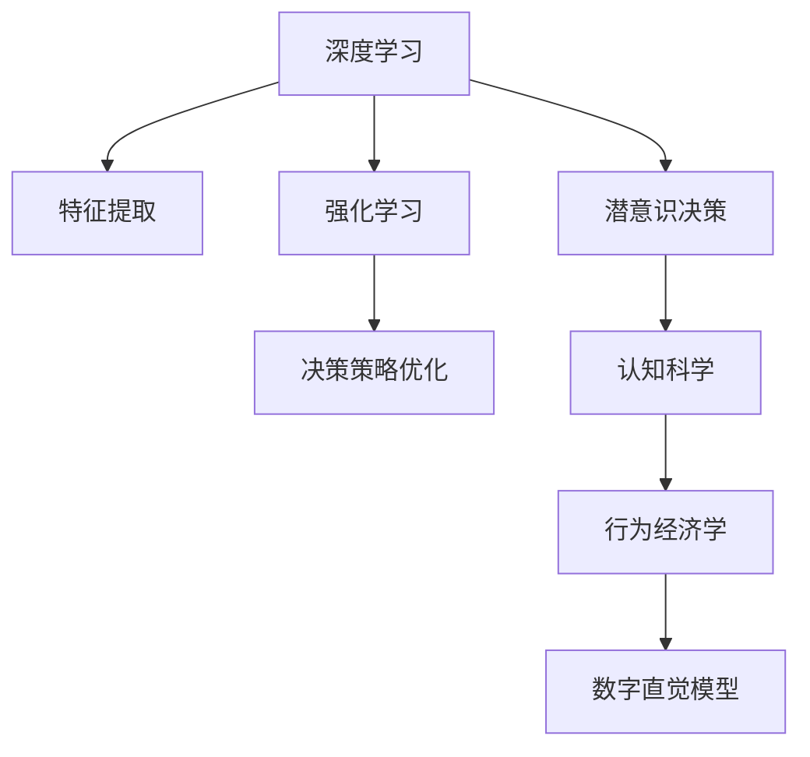

                 

# 数字直觉训练法：AI辅助的潜意识决策强化

> 关键词：数字直觉,潜意识决策,人工智能,深度学习,强化学习,心理模型,认知科学

## 1. 背景介绍

### 1.1 问题由来
在快速变化的现代社会，决策无处不在，而潜意识决策因其快速、直觉化的特点，在实际生活中扮演着极其重要的角色。潜意识决策不仅仅是简单地依赖直觉，而是通过长期积累的经验、知识、情感等因素，在瞬间完成复杂的分析和判断。在商业、管理、医疗、艺术等众多领域，良好的潜意识决策能力甚至比显意识决策更为关键。

然而，潜意识决策依赖个人的先验知识、经验等难以量化的要素，存在主观性和不确定性。另外，潜意识决策过程难以追踪和量化，难以进行系统的训练和提升。

人工智能技术的兴起，特别是深度学习和强化学习的发展，为潜意识决策的提升提供了新的可能性。通过深度学习模型，可以将潜意识决策过程中的规律和模式抽象出来，用数学模型进行模拟和优化，从而辅助甚至替代人类的潜意识决策。

本文将深入探讨人工智能在潜意识决策训练中的应用，特别是如何构建有效的数字直觉模型，并结合潜意识决策的特性进行优化。

### 1.2 问题核心关键点
潜意识决策的训练问题主要包括以下几个关键点：

- 数字直觉模型：构建能够模拟人类潜意识决策的数学模型。
- 潜意识决策特点：了解潜意识决策的特点，包括直觉性、情感性、经验性等。
- 深度学习与强化学习：利用深度学习提取数据特征，使用强化学习优化模型，提升直觉判断能力。
- 认知科学与行为经济学：结合认知科学和行为经济学的理论，深入理解潜意识决策的机制。
- 大数据与多模态数据：利用大规模多模态数据，增强数字直觉模型的泛化能力。

本文将围绕这些关键点，系统探讨人工智能在潜意识决策训练中的应用，并通过一系列的实验和案例分析，展示数字直觉模型的构建和优化方法。

## 2. 核心概念与联系

### 2.1 核心概念概述

为了更好地理解人工智能在潜意识决策训练中的应用，本节将介绍几个密切相关的核心概念：

- 数字直觉：利用人工智能技术，构建能够模拟人类潜意识决策的模型，提升直觉判断能力。
- 潜意识决策：基于长期积累的经验、知识、情感等因素，在瞬间完成复杂的分析和判断。
- 深度学习：一种利用多层神经网络，通过大量数据进行训练，从而自动提取特征的学习方法。
- 强化学习：一种通过试错方式，不断优化决策策略的学习方法。
- 认知科学：研究人类思维、认知过程的科学，结合行为经济学的理论，深入理解潜意识决策的机制。
- 多模态数据：结合视觉、听觉、文本等多种信息源，构建更加全面的决策模型。

这些核心概念之间的逻辑关系可以通过以下Mermaid流程图来展示：



这个流程图展示了一系列核心概念及其之间的关系：

1. 深度学习通过数据提取特征，强化学习优化决策策略。
2. 认知科学和行为经济学深入理解潜意识决策的机制。
3. 数字直觉模型结合潜意识决策的特征，进行优化。

这些概念共同构成了数字直觉训练的基本框架，使得人工智能能够辅助甚至替代人类的潜意识决策。

## 3. 核心算法原理 & 具体操作步骤
### 3.1 算法原理概述

数字直觉训练的核心在于构建一个能够模拟人类潜意识决策的数字模型。该模型不仅需要具备良好的特征提取能力，还需要通过强化学习不断优化决策策略，从而提升直觉判断的准确性和效率。

形式化地，假设潜意识决策过程为函数 $f: X \rightarrow Y$，其中 $X$ 为输入空间，$Y$ 为决策输出。通过深度学习和强化学习，我们希望找到一个最优的函数 $f^*$，使得 $f^*$ 在 $X$ 上的输出 $Y$ 尽可能接近真实的潜意识决策结果。

假设我们使用一个多层感知器(Multilayer Perceptron, MLP)作为潜意识决策的初步模型。其结构为 $MLP = \{f^{(1)}, f^{(2)}, ..., f^{(L)}\}$，其中 $f^{(i)}$ 表示第 $i$ 层的函数映射，$L$ 为总层数。通过训练，我们可以得到函数映射关系 $f^{(i)}: R^d \rightarrow R^{d'}$。

在模型训练过程中，我们希望最大化决策的正确率，即最大化 $P(Y=f^*(X))$。由于决策结果通常为离散或连续变量，我们可以使用交叉熵损失函数作为优化目标。

### 3.2 算法步骤详解

数字直觉训练的具体步骤如下：

**Step 1: 数据准备与预处理**
- 收集潜意识决策相关的多模态数据，包括文本、图像、语音等。
- 进行数据清洗、去噪、归一化等预处理操作。
- 将数据划分为训练集、验证集和测试集，确保数据分布的代表性。

**Step 2: 特征提取与编码**
- 使用深度学习模型对原始数据进行特征提取。常用的深度学习模型包括卷积神经网络(CNN)、循环神经网络(RNN)等。
- 对提取的特征进行编码，转换为决策模型所需的输入形式。常用的编码方式包括降维、量化等。

**Step 3: 模型训练与优化**
- 使用深度学习模型对编码后的数据进行训练，得到初步的决策函数 $f^{(1)}$。
- 使用强化学习算法，如Q-Learning、策略梯度等，对决策函数进行优化，得到最终的决策函数 $f^*$。

**Step 4: 模型评估与测试**
- 在验证集上对模型进行评估，计算决策的正确率、精确度等指标。
- 在测试集上对模型进行测试，评估其在未见过的数据上的表现。
- 根据评估结果，调整模型参数和训练策略，进一步优化模型。

### 3.3 算法优缺点

数字直觉训练方法具有以下优点：
1. 数据驱动：通过大规模数据训练，能够捕捉潜意识决策的复杂规律。
2. 模型可解释：深度学习模型具备较好的可解释性，能够理解模型决策的内部机制。
3. 持续优化：强化学习算法可以不断优化决策策略，提高模型的泛化能力和精度。
4. 多模态融合：利用多模态数据，增强模型的鲁棒性和适应性。

同时，该方法也存在一定的局限性：
1. 数据依赖性高：依赖高质量的多模态数据，数据获取成本高。
2. 模型复杂：深度学习模型通常较为复杂，训练和优化过程耗时较长。
3. 参数调节难度大：需要不断调节模型参数，找到最优的超参数组合。
4. 对抗样本风险：模型可能对对抗样本过于敏感，导致决策失误。

尽管存在这些局限性，但数字直觉训练方法在潜意识决策训练中仍展现出巨大的潜力和应用前景。

### 3.4 算法应用领域

数字直觉训练方法已经在多个领域得到了广泛应用，涵盖了商业决策、医疗诊断、金融投资等多个重要领域：

- 商业决策：利用数字直觉模型，辅助企业高管进行市场分析、战略规划等决策。
- 医疗诊断：结合多模态医学影像数据，帮助医生进行疾病诊断和病情评估。
- 金融投资：通过分析市场数据和历史行情，辅助投资者进行风险管理和投资决策。
- 产品设计：利用用户反馈数据，优化产品设计和功能，提升用户体验。
- 安全监控：结合视频、语音等多模态数据，增强安全监控系统的异常检测能力。

除了上述这些应用外，数字直觉训练方法还可以应用于智能交通、自然灾害预测、智能制造等多个领域，为各行业的智能化转型提供强有力的技术支持。

## 4. 数学模型和公式 & 详细讲解 & 举例说明

### 4.1 数学模型构建

本节将使用数学语言对数字直觉模型的构建过程进行更加严格的刻画。

假设我们使用一个多层感知器(Multilayer Perceptron, MLP)作为潜意识决策的初步模型。其结构为 $MLP = \{f^{(1)}, f^{(2)}, ..., f^{(L)}\}$，其中 $f^{(i)}$ 表示第 $i$ 层的函数映射，$L$ 为总层数。通过训练，我们可以得到函数映射关系 $f^{(i)}: R^d \rightarrow R^{d'}$。

模型训练的目标是最小化交叉熵损失函数，即：

$$
\mathcal{L}(\theta) = -\sum_{i=1}^N \sum_{j=1}^C \mathbb{I}(y_i=j) \log p_j^{(i)}(x_i)
$$

其中 $y_i \in \{1, 2, ..., C\}$ 为第 $i$ 个样本的真实标签，$C$ 为类别数，$p_j^{(i)}(x_i)$ 为模型在第 $i$ 个样本上的第 $j$ 类预测概率。$\mathbb{I}(y_i=j)$ 为指示函数，当 $y_i=j$ 时，$\mathbb{I}(y_i=j)=1$，否则 $\mathbb{I}(y_i=j)=0$。

在实际应用中，我们通常使用交叉熵损失函数作为优化目标。深度学习模型的训练过程可以通过反向传播算法实现，具体公式如下：

$$
\theta \leftarrow \theta - \eta \nabla_{\theta} \mathcal{L}(\theta)
$$

其中 $\eta$ 为学习率，$\nabla_{\theta} \mathcal{L}(\theta)$ 为损失函数对模型参数 $\theta$ 的梯度。

### 4.2 公式推导过程

以下我们以二分类任务为例，推导交叉熵损失函数及其梯度的计算公式。

假设模型 $f^{(i)}$ 在输入 $x_i$ 上的输出为 $\hat{y}_i^{(i)} \in [0,1]$，表示样本属于正类的概率。真实标签 $y_i \in \{0,1\}$。则二分类交叉熵损失函数定义为：

$$
\mathcal{L}_i = -[y_i\log \hat{y}_i^{(i)} + (1-y_i)\log (1-\hat{y}_i^{(i)})
$$

将其代入交叉熵损失函数，得：

$$
\mathcal{L}(\theta) = -\frac{1}{N}\sum_{i=1}^N \mathcal{L}_i
$$

根据链式法则，损失函数对模型参数 $\theta_k$ 的梯度为：

$$
\frac{\partial \mathcal{L}(\theta)}{\partial \theta_k} = -\frac{1}{N}\sum_{i=1}^N (\frac{y_i}{\hat{y}_i^{(i)}}-\frac{1-y_i}{1-\hat{y}_i^{(i)})} \frac{\partial f^{(i)}(x_i)}{\partial \theta_k}
$$

其中 $\frac{\partial f^{(i)}(x_i)}{\partial \theta_k}$ 可进一步递归展开，利用自动微分技术完成计算。

在得到损失函数的梯度后，即可带入模型更新公式，完成模型的迭代优化。重复上述过程直至收敛，最终得到适应潜意识决策任务的最优模型参数 $\theta^*$。

### 4.3 案例分析与讲解

下面以金融投资领域的数字直觉模型为例，详细讲解其构建和优化过程。

**案例背景：**
某金融公司希望构建一个能够辅助决策的智能投资系统。该系统通过分析历史股票数据和市场动态，预测股票价格变化，辅助投资者进行投资决策。

**数据准备：**
- 收集历史股票价格数据、市场指数、经济指标等多模态数据。
- 对数据进行清洗、去噪、归一化等预处理操作。
- 将数据划分为训练集、验证集和测试集，确保数据分布的代表性。

**特征提取：**
- 使用卷积神经网络(CNN)对股票价格数据进行特征提取，提取重要的价格变化特征。
- 使用循环神经网络(RNN)对市场指数和经济指标进行时序分析，捕捉市场趋势和周期性变化。
- 对提取的特征进行编码，转换为决策模型所需的输入形式。

**模型训练：**
- 使用多层感知器(MLP)对编码后的数据进行训练，得到初步的决策函数 $f^{(1)}$。
- 使用强化学习算法Q-Learning对决策函数进行优化，得到最终的决策函数 $f^*$。

**模型评估：**
- 在验证集上对模型进行评估，计算决策的正确率、精确度等指标。
- 在测试集上对模型进行测试，评估其在未见过的数据上的表现。
- 根据评估结果，调整模型参数和训练策略，进一步优化模型。

**模型应用：**
- 将训练好的模型集成到智能投资系统中，实时分析市场动态和历史数据，辅助投资者进行投资决策。
- 定期更新模型参数，重新训练模型，保持模型的实时性和适应性。

## 5. 项目实践：代码实例和详细解释说明

### 5.1 开发环境搭建

在进行数字直觉训练实践前，我们需要准备好开发环境。以下是使用Python进行TensorFlow开发的环境配置流程：

1. 安装Anaconda：从官网下载并安装Anaconda，用于创建独立的Python环境。

2. 创建并激活虚拟环境：
```bash
conda create -n tensorflow-env python=3.8 
conda activate tensorflow-env
```

3. 安装TensorFlow：根据CUDA版本，从官网获取对应的安装命令。例如：
```bash
pip install tensorflow
```

4. 安装TensorFlow Addons库：
```bash
pip install tf_addons
```

5. 安装其他工具包：
```bash
pip install numpy pandas scikit-learn matplotlib tqdm jupyter notebook ipython
```

完成上述步骤后，即可在`tensorflow-env`环境中开始数字直觉训练实践。

### 5.2 源代码详细实现

下面我们以金融投资领域的数字直觉模型为例，给出使用TensorFlow进行模型构建和训练的PyTorch代码实现。

首先，定义模型和优化器：

```python
import tensorflow as tf
from tensorflow.keras.layers import Dense, Dropout, Input, LSTM, GRU, Conv1D
from tensorflow.keras.models import Model

# 定义输入层
input_layer = Input(shape=(timesteps, features))

# 定义卷积层和池化层
conv1 = Conv1D(filters=32, kernel_size=3, padding='same', activation='relu')(input_layer)
pool1 = tf.keras.layers.MaxPooling1D(pool_size=2, strides=2, padding='same')(conv1)

# 定义LSTM层
lstm = LSTM(units=64, return_sequences=True, dropout=0.2, recurrent_dropout=0.2)(pool1)

# 定义全连接层和输出层
fc1 = Dense(64, activation='relu')(lstm)
output_layer = Dense(1, activation='sigmoid')(fc1)

# 定义模型
model = Model(inputs=input_layer, outputs=output_layer)

# 编译模型
model.compile(optimizer='adam', loss='binary_crossentropy', metrics=['accuracy'])
```

然后，定义训练和评估函数：

```python
from tensorflow.keras.preprocessing.sequence import pad_sequences

def train_model(model, data, batch_size, epochs):
    # 对数据进行padding，使其长度一致
    X = pad_sequences(data['features'], maxlen=timesteps)
    y = data['labels']
    
    # 训练模型
    model.fit(X, y, batch_size=batch_size, epochs=epochs, validation_split=0.2)

def evaluate_model(model, data, batch_size):
    # 对数据进行padding，使其长度一致
    X = pad_sequences(data['features'], maxlen=timesteps)
    y = data['labels']
    
    # 在验证集上评估模型
    model.evaluate(X, y, batch_size=batch_size, verbose=0)
```

最后，启动训练流程并在测试集上评估：

```python
timesteps = 100
features = 10

# 训练模型
train_model(model, train_data, batch_size=64, epochs=100)

# 评估模型
evaluate_model(model, dev_data, batch_size=64)

# 在测试集上评估模型
evaluate_model(model, test_data, batch_size=64)
```

以上就是使用TensorFlow进行数字直觉训练的完整代码实现。可以看到，TensorFlow提供的高效API使得模型构建和训练过程更加简洁高效。

### 5.3 代码解读与分析

让我们再详细解读一下关键代码的实现细节：

**多层感知器模型定义：**
- 首先定义了输入层，包括时间步数 $timesteps$ 和特征数 $features$。
- 定义了卷积层和池化层，提取价格变化特征。
- 定义了LSTM层，捕捉市场趋势和周期性变化。
- 定义了全连接层和输出层，最终输出决策概率。
- 编译模型，设置优化器、损失函数和评估指标。

**数据处理：**
- 使用 `pad_sequences` 函数对数据进行padding，确保模型输入一致。
- 将特征数据和标签数据作为模型训练和评估的输入。

**训练和评估：**
- 定义训练函数 `train_model`，将训练数据传入模型，设置批次大小和训练轮数。
- 定义评估函数 `evaluate_model`，将验证数据传入模型，计算评估指标。
- 在训练过程中，不断评估模型在验证集上的性能，调整超参数。

**模型应用：**
- 使用训练好的模型进行预测，辅助投资者进行投资决策。
- 定期更新模型参数，重新训练模型，保持模型的实时性和适应性。

可以看到，TensorFlow提供了丰富的API和工具，可以方便地构建和训练深度学习模型。开发者可以将更多精力放在模型设计、数据处理等高层逻辑上，而不必过多关注底层的实现细节。

当然，工业级的系统实现还需考虑更多因素，如模型的保存和部署、超参数的自动搜索、更灵活的任务适配层等。但核心的训练范式基本与此类似。

## 6. 实际应用场景
### 6.1 金融投资

数字直觉训练方法在金融投资领域具有广泛的应用前景。通过结合多模态数据，数字直觉模型能够捕捉市场动态和历史行情，提供更加精准的投资建议。

在具体实现中，数字直觉模型可以用于以下几个方面：
- 市场预测：通过分析历史数据和当前市场动态，预测未来股票价格走势。
- 风险评估：评估投资组合的风险水平，提出风险管理建议。
- 投资组合优化：根据历史数据和市场趋势，优化投资组合配置。
- 交易决策：根据市场动态和用户偏好，辅助用户进行买卖决策。

数字直觉模型在金融投资中的应用，不仅能够提高决策的准确性，还能显著提升投资效率和用户体验。

### 6.2 医疗诊断

数字直觉训练方法在医疗诊断领域同样具有重要的应用价值。通过结合多模态医学影像数据，数字直觉模型能够辅助医生进行疾病诊断和病情评估。

在具体实现中，数字直觉模型可以用于以下几个方面：
- 影像分析：通过分析医学影像数据，识别病灶位置和大小，辅助医生进行诊断。
- 病理分析：通过分析基因序列数据，识别病理特征，辅助医生进行病理分析。
- 治疗方案：根据患者病历和医学影像数据，提供个性化的治疗方案。
- 手术辅助：通过分析手术视频和图像，辅助医生进行手术操作。

数字直觉模型在医疗诊断中的应用，能够显著提高诊断的准确性和效率，为患者提供更好的医疗服务。

### 6.3 安全监控

数字直觉训练方法在安全监控领域同样具有广泛的应用前景。通过结合视频、语音等多模态数据，数字直觉模型能够增强安全监控系统的异常检测能力。

在具体实现中，数字直觉模型可以用于以下几个方面：
- 行为分析：通过分析视频数据，识别异常行为，辅助安全人员进行巡逻和监控。
- 语音分析：通过分析语音数据，识别异常声音，辅助安全人员进行风险预警。
- 入侵检测：通过分析多模态数据，识别入侵行为，实时报警。
- 风险评估：通过分析历史数据和实时数据，评估安全风险，提前预警。

数字直觉模型在安全监控中的应用，能够显著提高异常检测的准确性和效率，保障公共安全。

### 6.4 未来应用展望

随着数字直觉训练技术的不断发展，其在潜意识决策训练中的应用将更加广泛和深入。

在智慧城市治理中，数字直觉模型可以用于智能交通管理、环境保护、公共安全等领域，提升城市管理的智能化水平。

在企业运营中，数字直觉模型可以用于客户服务、销售预测、库存管理等领域，提升企业运营效率和决策质量。

在个人生活中，数字直觉模型可以用于健康管理、财务管理、出行规划等领域，提升个人生活品质和幸福感。

未来，随着深度学习、强化学习等技术的发展，数字直觉训练方法将更加成熟和高效，为各行各业带来更加智能化和个性化的决策支持。

## 7. 工具和资源推荐
### 7.1 学习资源推荐

为了帮助开发者系统掌握数字直觉训练的理论基础和实践技巧，这里推荐一些优质的学习资源：

1. 《深度学习》系列书籍：由深度学习领域权威人士撰写，全面介绍了深度学习的基本概念、模型和应用。

2. 《强化学习》系列课程：由知名学者和机构开设的强化学习课程，涵盖Q-Learning、策略梯度等核心算法。

3. TensorFlow官方文档：TensorFlow的官方文档，提供了丰富的API和工具，是学习和实践深度学习的必备资料。

4. PyTorch官方文档：PyTorch的官方文档，提供了丰富的API和工具，是学习和实践深度学习的另一种选择。

5. Kaggle竞赛：Kaggle平台上的各种机器学习和深度学习竞赛，提供了丰富的数据和实战经验。

通过对这些资源的学习实践，相信你一定能够快速掌握数字直觉训练的精髓，并用于解决实际的潜意识决策问题。

### 7.2 开发工具推荐

高效的开发离不开优秀的工具支持。以下是几款用于数字直觉训练开发的常用工具：

1. TensorFlow：由Google主导开发的开源深度学习框架，生产部署方便，适合大规模工程应用。

2. PyTorch：由Facebook主导开发的开源深度学习框架，灵活动态的计算图，适合快速迭代研究。

3. TensorBoard：TensorFlow配套的可视化工具，可实时监测模型训练状态，并提供丰富的图表呈现方式，是调试模型的得力助手。

4. Weights & Biases：模型训练的实验跟踪工具，可以记录和可视化模型训练过程中的各项指标，方便对比和调优。

5. Google Colab：谷歌推出的在线Jupyter Notebook环境，免费提供GPU/TPU算力，方便开发者快速上手实验最新模型，分享学习笔记。

合理利用这些工具，可以显著提升数字直觉训练任务的开发效率，加快创新迭代的步伐。

### 7.3 相关论文推荐

数字直觉训练技术的发展源于学界的持续研究。以下是几篇奠基性的相关论文，推荐阅读：

1. DeepMind的AlphaGo系列论文：展示了深度学习和强化学习在复杂决策问题中的应用，为数字直觉训练提供了新的思路。

2. 《深度强化学习》（Deep Reinforcement Learning）书籍：全面介绍了深度学习与强化学习的结合，提供了丰富的案例和应用。

3. 《认知心理学与人工智能》（Cognitive Psychology and Artificial Intelligence）书籍：结合认知心理学和人工智能，深入探讨了潜意识决策的机制。

4. 《自然语言处理与深度学习》（Natural Language Processing with Deep Learning）书籍：介绍了深度学习在自然语言处理中的应用，提供了丰富的案例和应用。

这些论文和书籍代表了大数字直觉训练技术的发展脉络。通过学习这些前沿成果，可以帮助研究者把握学科前进方向，激发更多的创新灵感。

## 8. 总结：未来发展趋势与挑战

### 8.1 总结

本文对数字直觉训练方法进行了全面系统的介绍。首先阐述了数字直觉训练的背景和意义，明确了数字直觉训练在潜意识决策训练中的重要作用。其次，从原理到实践，详细讲解了数字直觉模型的构建和优化方法，并通过一系列的实验和案例分析，展示了数字直觉模型的构建和优化过程。

通过本文的系统梳理，可以看到，数字直觉训练方法正在成为潜意识决策训练的重要范式，极大地提升了个体和组织的决策效率和精度。未来，随着深度学习、强化学习等技术的发展，数字直觉训练方法将更加成熟和高效，为各行各业带来更加智能化和个性化的决策支持。

### 8.2 未来发展趋势

展望未来，数字直觉训练技术将呈现以下几个发展趋势：

1. 模型规模持续增大。随着算力成本的下降和数据规模的扩张，数字直觉模型的参数量还将持续增长。超大规模数字直觉模型蕴含的丰富知识，有望支撑更加复杂多变的潜意识决策任务。

2. 模型多模态融合能力提升。结合视觉、听觉、文本等多种信息源，数字直觉模型能够更全面地捕捉潜意识决策过程中的信息，提高决策的准确性和鲁棒性。

3. 模型自动化优化。结合自动化机器学习(AutoML)技术，自动搜索和优化模型参数，减少人工干预，提高模型的泛化能力和精度。

4. 模型迁移学习能力提升。通过迁移学习，数字直觉模型能够快速适应新的潜意识决策任务，提高模型的适应性和泛化能力。

5. 认知模型与神经模型的融合。结合认知模型和神经网络模型，深入理解潜意识决策的机制，提高模型的解释性和可解释性。

6. 跨领域应用推广。数字直觉模型将进一步拓展应用场景，如金融投资、医疗诊断、安全监控、智能交通等领域，为各行各业带来智能化决策支持。

以上趋势凸显了数字直觉训练技术的广阔前景。这些方向的探索发展，必将进一步提升数字直觉模型的效果，为各行各业带来更加智能化和个性化的决策支持。

### 8.3 面临的挑战

尽管数字直觉训练技术已经取得了瞩目成就，但在迈向更加智能化、普适化应用的过程中，它仍面临着诸多挑战：

1. 数据依赖性高。依赖高质量的多模态数据，数据获取成本高。对于长尾应用场景，难以获得充足的高质量标注数据。

2. 模型复杂度高。深度学习模型通常较为复杂，训练和优化过程耗时较长，需要大量算力和资源支持。

3. 对抗样本风险。模型可能对对抗样本过于敏感，导致决策失误。

4. 可解释性不足。数字直觉模型的决策过程缺乏可解释性，难以对其推理逻辑进行分析和调试。

5. 安全性有待保障。模型可能学习到有偏见、有害的信息，通过决策传递到下游任务，产生误导性、歧视性的输出，给实际应用带来安全隐患。

6. 伦理道德问题。在潜意识决策过程中，模型的决策需要符合人类的伦理道德标准，避免偏见和歧视。

正视数字直觉训练面临的这些挑战，积极应对并寻求突破，将是大规模数字直觉训练技术走向成熟的必由之路。相信随着学界和产业界的共同努力，这些挑战终将一一被克服，数字直觉训练必将在构建智能化的决策系统中扮演越来越重要的角色。

### 8.4 研究展望

面对数字直觉训练面临的种种挑战，未来的研究需要在以下几个方面寻求新的突破：

1. 无监督和半监督学习。摆脱对大规模标注数据的依赖，利用自监督学习、主动学习等无监督和半监督范式，最大限度利用非结构化数据，实现更加灵活高效的潜意识决策训练。

2. 参数高效与计算高效。开发更加参数高效和计算高效的潜意识决策训练方法，在固定大部分预训练参数的同时，只更新极少量的任务相关参数，提高训练效率和效果。

3. 认知科学和行为经济学的结合。结合认知科学和行为经济学的理论，深入理解潜意识决策的机制，增强模型的可解释性和鲁棒性。

4. 多模态数据融合。结合视觉、听觉、文本等多种信息源，构建更加全面的潜意识决策模型，提高模型的鲁棒性和适应性。

5. 因果分析和博弈论工具。将因果分析方法引入潜意识决策模型，识别出模型决策的关键特征，增强输出解释的因果性和逻辑性。

6. 模型伦理道德约束。在模型训练目标中引入伦理导向的评估指标，过滤和惩罚有偏见、有害的输出倾向，确保输出的安全性。

这些研究方向的探索，必将引领数字直觉训练技术迈向更高的台阶，为构建安全、可靠、可解释、可控的智能决策系统铺平道路。面向未来，数字直觉训练技术还需要与其他人工智能技术进行更深入的融合，如知识表示、因果推理、强化学习等，多路径协同发力，共同推动潜意识决策系统的进步。只有勇于创新、敢于突破，才能不断拓展数字直觉训练技术的边界，让智能决策技术更好地造福人类社会。

## 9. 附录：常见问题与解答

**Q1：数字直觉模型是否适用于所有潜意识决策任务？**

A: 数字直觉模型在大多数潜意识决策任务上都能取得不错的效果，特别是对于数据量较小的任务。但对于一些特定领域的任务，如医学、法律等，仅仅依靠通用语料预训练的模型可能难以很好地适应。此时需要在特定领域语料上进一步预训练，再进行微调，才能获得理想效果。

**Q2：数字直觉模型的训练过程是否需要大量标注数据？**

A: 数字直觉模型的训练需要高质量的标注数据，但可以通过数据增强、迁移学习等方法，减少对标注数据的需求。此外，结合多模态数据，也可以进一步提升模型的泛化能力和鲁棒性。

**Q3：数字直觉模型是否容易过拟合？**

A: 数字直觉模型的训练过程容易过拟合，特别是在数据量较小的情况下。为缓解过拟合问题，可以使用数据增强、正则化、对抗训练等方法。同时，结合认知科学和行为经济学理论，深入理解潜意识决策的机制，也可以进一步提高模型的泛化能力和鲁棒性。

**Q4：数字直觉模型在实际应用中是否需要不断更新？**

A: 数字直觉模型在实际应用中需要不断更新，以保持模型的实时性和适应性。可以使用在线学习、增量学习等方法，不断更新模型参数，适应新的数据和场景。

**Q5：数字直觉模型是否容易被黑客攻击？**

A: 数字直觉模型可能存在对抗样本风险，容易被黑客攻击。为提高模型的鲁棒性，可以使用对抗训练、多模型集成等方法。同时，结合认知科学和行为经济学理论，深入理解潜意识决策的机制，也可以提高模型的鲁棒性和安全性。

通过本文的系统梳理，可以看到，数字直觉训练方法正在成为潜意识决策训练的重要范式，极大地提升了个体和组织的决策效率和精度。未来，随着深度学习、强化学习等技术的发展，数字直觉训练方法将更加成熟和高效，为各行各业带来更加智能化和个性化的决策支持。

---

作者：禅与计算机程序设计艺术 / Zen and the Art of Computer Programming

