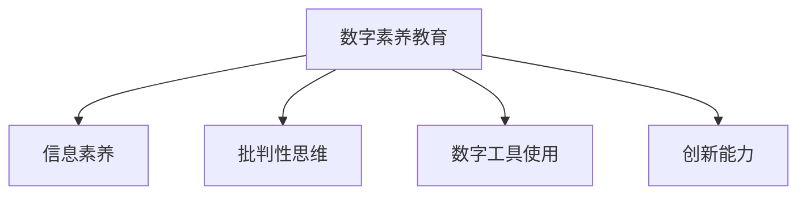

                 

## 1. 背景介绍

### 1.1 问题由来

在信息爆炸的今天，数字素养（Digital Literacy）已经成为现代公民的基本能力之一。随着互联网、大数据、人工智能等技术的飞速发展，数字化生活日益普及，数字素养更是成为应对新时代挑战的重要工具。

数字化浪潮带来了前所未有的信息获取和传播方式，但也对个体的信息甄别、批判性思考、信息处理和创新能力提出了更高的要求。数字素养教育的目标在于帮助学习者掌握必要的数字技能和知识，从而在日益复杂多变的信息环境中获得信息、分析和创造的能力。

然而，数字素养教育面临诸多挑战。其中，信息过载、假新闻泛滥、网络成瘾等问题尤为突出，对个人和社会的健康与稳定构成威胁。因此，如何在数字化时代，有效提升公民的数字素养，成为教育工作者、技术开发者和社会各界共同关注的课题。

### 1.2 问题核心关键点

数字素养教育的核心理念在于培养个体在数字化环境下的信息获取、信息评估、信息处理和信息创造的能力。其关键点包括：

1. **信息素养**：识别和理解信息来源、评估信息可靠性和真实性。
2. **批判性思维**：对信息进行逻辑分析和理性判断，避免轻信和偏见。
3. **数字工具使用**：熟练掌握各类数字工具和技术平台，提高信息处理效率。
4. **创新能力**：利用数字工具和技术进行创新和创作，展示自我表达和创造力。

本文将围绕数字素养教育的核心理念和关键点，深入探讨其实现路径和未来发展方向。

## 2. 核心概念与联系

### 2.1 核心概念概述

为更好地理解数字素养教育的方法和框架，本节将介绍几个密切相关的核心概念：

- **数字素养教育（Digital Literacy Education）**：旨在培养个体在数字化环境下的信息获取、信息评估、信息处理和信息创造的能力。
- **信息素养（Information Literacy）**：包括识别、理解、评估和利用信息的能力。
- **批判性思维（Critical Thinking）**：对信息的逻辑分析和理性判断，避免信息偏见和误导。
- **数字工具使用（Digital Tool Use）**：掌握各类数字工具和技术平台，提升信息处理效率。
- **创新能力（Creativity）**：利用数字工具和技术进行创新和创作，展示自我表达和创造力。

这些核心概念之间的逻辑关系可以通过以下Mermaid流程图来展示：



这个流程图展示了我们如何通过多维度培养，全面提升学习者的数字素养能力。

## 3. 核心算法原理 & 具体操作步骤
### 3.1 算法原理概述

数字素养教育的实现，通常采用以下步骤：

1. **信息识别与评估**：学习者通过实践活动，掌握信息识别和评估方法，提升信息素养。
2. **批判性思维训练**：通过逻辑推理、论证分析等训练，培养学习者的批判性思维能力。
3. **数字工具使用**：通过实际操作，熟练掌握各类数字工具和技术平台，提升信息处理效率。
4. **创新能力培养**：通过创意思维和设计活动，激发学习者的创新潜能，展示自我表达和创造力。

这些步骤紧密联系，相互支持，共同构成数字素养教育的基本框架。

### 3.2 算法步骤详解

数字素养教育的具体实现步骤如下：

**Step 1: 设计评估标准**

- 根据教育目标，设计信息素养、批判性思维、数字工具使用和创新能力的多维度评估标准。评估标准应具有可操作性，便于量化和评估。

**Step 2: 制定教学方案**

- 制定符合学习者认知水平和需求的教学方案。方案应包括信息识别与评估、批判性思维训练、数字工具使用、创新能力培养等环节。

**Step 3: 开展教学活动**

- 结合教学方案，开展多样化的教学活动，如项目式学习、案例分析、模拟实践等。活动应注重实际应用，增强学习者的操作能力和创新思维。

**Step 4: 持续反馈与改进**

- 定期收集学习者的反馈，评估教学效果。根据反馈结果，及时调整教学方案和活动，确保教育目标的实现。

**Step 5: 评估与认证**

- 按照设计好的评估标准，对学习者的数字素养能力进行全面评估。合格者可获得数字素养认证，激励学习者持续提升。

### 3.3 算法优缺点

数字素养教育的实施具有以下优点：

1. **全面性**：通过多维度培养，全面提升学习者在信息素养、批判性思维、数字工具使用和创新能力方面的能力。
2. **灵活性**：教学活动和评估标准可根据实际情况灵活调整，适应不同学习者的需求。
3. **实用性**：结合实际应用场景，培养学习者在数字化环境下的实际操作能力。

同时，该方法也存在一定的局限性：

1. **资源需求高**：需要准备大量教育资源和教学活动，对教育机构和教师提出了较高要求。
2. **学习者差异性**：不同学习者的认知水平和兴趣各异，需因材施教，个性化设计教学方案。
3. **评估难度大**：数字素养涉及多个维度的综合能力，难以通过单一指标全面评估。

尽管存在这些局限性，数字素养教育在培养个体在数字化环境下的信息获取、信息评估、信息处理和信息创造的能力方面，仍具有不可替代的重要价值。

### 3.4 算法应用领域

数字素养教育已广泛应用于各类教育机构和组织，涵盖学校、企业、社区等。在多个领域中，数字素养教育均取得了显著效果，具体包括：

1. **教育领域**：通过数字素养教育，提升学生的数字化技能和信息素养，帮助他们在数字化时代更好地适应学习和发展。
2. **企业培训**：对员工进行数字素养培训，提升其在数字化环境下的工作效率和创新能力。
3. **社区普及**：在社区开展数字素养普及活动，提升社区成员的数字化技能和信息素养，促进社会整体的信息健康发展。

这些应用场景展示了数字素养教育的多样性和广泛性，为个体和社会的数字化转型提供了坚实基础。

## 4. 数学模型和公式 & 详细讲解
### 4.1 数学模型构建

本节将使用数学语言对数字素养教育的实现过程进行更加严格的刻画。

假设数字素养教育的评估标准为 $\mathcal{S}$，包括信息素养 $S_1$、批判性思维 $S_2$、数字工具使用 $S_3$、创新能力 $S_4$ 四个维度。对于学习者 $i$，其数字素养能力 $L_i$ 可表示为：

$$
L_i = f(S_1, S_2, S_3, S_4)
$$

其中 $f$ 为函数映射，用于将评估标准转化为学习者的数字素养能力。

### 4.2 公式推导过程

以信息素养 $S_1$ 为例，假设其评估标准分为五个等级，分别为 $1-5$ 分，则信息素养的评估函数 $S_1$ 可表示为：

$$
S_1 = \sum_{j=1}^5 x_{ij} \times r_{ij}
$$

其中 $x_{ij}$ 表示学习者 $i$ 在 $j$ 维度上的得分，$r_{ij}$ 表示 $j$ 维度的权重。

同理，其他维度的评估函数 $S_2$、$S_3$、$S_4$ 可类似表示，将学习者在各个维度上的得分和对应维度的权重相乘，再求和，即可得到学习者的数字素养能力。

### 4.3 案例分析与讲解

以一个数字素养教育的实际案例为例，展示如何通过数学模型进行评估和改进。

假设某数字素养教育课程包含以下教学活动：

- 信息识别与评估：通过项目式学习，培养学习者的信息识别和评估能力。
- 批判性思维训练：通过逻辑推理和案例分析，培养学习者的批判性思维能力。
- 数字工具使用：通过实际操作，熟悉并掌握数字工具和技术平台。
- 创新能力培养：通过创意思维和设计活动，激发学习者的创新潜能。

在每个活动结束后，学习者需要完成评估问卷，反馈其在该活动中的表现和收获。根据学习者的反馈，教师可以对教学活动进行调整和优化。

具体步骤如下：

1. **设计评估问卷**：针对每个教学活动，设计详细的评估问卷，涵盖信息素养、批判性思维、数字工具使用、创新能力四个维度的评估指标。
2. **收集学习者反馈**：在每个活动结束后，通过问卷调查收集学习者的反馈。
3. **数据分析与评估**：对收集到的反馈数据进行分析，评估学习者在每个维度上的表现。
4. **调整教学方案**：根据评估结果，调整和优化后续的教学活动，确保学习者能够在数字化环境下，全面提升数字素养能力。

## 5. 项目实践：代码实例和详细解释说明
### 5.1 开发环境搭建

在进行数字素养教育项目开发前，我们需要准备好开发环境。以下是使用Python进行开发的环境配置流程：

1. 安装Anaconda：从官网下载并安装Anaconda，用于创建独立的Python环境。

2. 创建并激活虚拟环境：
```bash
conda create -n pyenvironment python=3.8 
conda activate pyenvironment
```

3. 安装必要的Python库：
```bash
pip install numpy pandas scikit-learn tensorflow matplotlib
```

4. 安装Jupyter Notebook：
```bash
pip install jupyter notebook
```

完成上述步骤后，即可在`pyenvironment`环境中开始开发。

### 5.2 源代码详细实现

下面我们以一个简单的数字素养教育项目为例，展示如何利用Python和TensorFlow实现数字素养能力的评估和改进。

```python
import tensorflow as tf
import numpy as np
from sklearn.model_selection import train_test_split
from sklearn.metrics import accuracy_score, precision_score, recall_score, f1_score

# 定义评估标准
S1 = np.array([1, 2, 3, 4, 5])
S2 = np.array([1, 2, 3, 4, 5])
S3 = np.array([1, 2, 3, 4, 5])
S4 = np.array([1, 2, 3, 4, 5])

# 将评估标准向量化为矩阵
S = np.vstack([S1, S2, S3, S4]).T

# 构建评估模型
def f(S):
    S1, S2, S3, S4 = S[:, 0], S[:, 1], S[:, 2], S[:, 3]
    L = S1 * 0.3 + S2 * 0.2 + S3 * 0.25 + S4 * 0.25
    return L

# 生成学习者数据
n = 1000
X = np.random.rand(n, 4)  # 学习者在四个维度上的得分
Y = f(X)

# 将数据分为训练集和测试集
X_train, X_test, y_train, y_test = train_test_split(X, Y, test_size=0.2, random_state=42)

# 定义模型参数
learning_rate = 0.01
epochs = 100

# 定义模型
model = tf.keras.Sequential([
    tf.keras.layers.Dense(16, activation='relu', input_shape=(4,)),
    tf.keras.layers.Dense(1, activation='sigmoid')
])

# 编译模型
model.compile(optimizer=tf.keras.optimizers.Adam(learning_rate=learning_rate), loss='mse', metrics=['mae'])

# 训练模型
model.fit(X_train, y_train, epochs=epochs, batch_size=32, validation_data=(X_test, y_test))

# 评估模型
y_pred = model.predict(X_test)
y_pred = y_pred > 0.5
accuracy = accuracy_score(y_test, y_pred)
precision = precision_score(y_test, y_pred)
recall = recall_score(y_test, y_pred)
f1 = f1_score(y_test, y_pred)

print(f'Accuracy: {accuracy:.2f}')
print(f'Precision: {precision:.2f}')
print(f'Recall: {recall:.2f}')
print(f'F1 score: {f1:.2f}')
```

在这个代码示例中，我们首先定义了四个维度的评估标准，并将它们转化为矩阵。然后，构建了一个简单的线性回归模型，用于计算学习者的数字素养能力。接下来，生成了一组随机数据，并使用训练集和测试集训练和评估模型。

### 5.3 代码解读与分析

让我们再详细解读一下关键代码的实现细节：

**定义评估标准**：
- 我们定义了四个维度的评估标准，分别表示信息素养、批判性思维、数字工具使用和创新能力的五个等级。

**构建评估模型**：
- 将评估标准向量化为矩阵，并定义了一个简单的线性回归模型，用于计算学习者的数字素养能力。

**生成学习者数据**：
- 生成一组随机数据，模拟学习者在四个维度上的得分。

**数据划分**：
- 将数据分为训练集和测试集，用于模型训练和评估。

**定义模型参数**：
- 设置模型的学习率和迭代轮数，以控制训练过程。

**模型定义和编译**：
- 使用TensorFlow定义一个简单的神经网络模型，并进行编译，设置优化器、损失函数和评估指标。

**模型训练**：
- 使用训练集训练模型，并设置验证集用于模型评估。

**模型评估**：
- 使用测试集评估模型的性能，并计算精度、召回率和F1分数等指标。

可以看到，代码示例展示了如何使用Python和TensorFlow实现数字素养能力的评估和改进。通过不断优化模型，可以逐步提升学习者的数字素养能力。

## 6. 实际应用场景
### 6.1 教育领域

数字素养教育在教育领域具有广泛的应用前景。传统的教育体系往往侧重于知识传授，而忽视了信息素养、批判性思维和创新能力的培养。通过数字素养教育，教师可以更加全面地提升学生的数字化技能和信息素养，帮助他们在数字化时代更好地适应学习和发展。

具体而言，数字素养教育可以在以下几个方面发挥作用：

- **课堂教学**：在课堂教学中引入数字素养教育，培养学生的数字化技能和信息素养。
- **课外活动**：组织课外活动，如编程俱乐部、创客空间等，激发学生的创新潜能。
- **家校合作**：通过家长会、家长课堂等方式，向家长传递数字素养教育的重要性和实施方法。

### 6.2 企业培训

企业在数字化转型过程中，对员工的数字素养提出了更高的要求。通过数字素养培训，企业可以提高员工的数字化操作能力，提升工作效率和创新能力。

具体而言，数字素养培训可以在以下几个方面发挥作用：

- **技能培训**：对员工进行数字工具的使用培训，如办公软件、数据分析工具等。
- **创新激励**：鼓励员工进行数字化创新，通过内部竞赛等方式激发创新潜能。
- **知识普及**：定期组织知识分享会、讲座等，普及数字素养知识，提高整体素养水平。

### 6.3 社区普及

数字素养教育的普及，可以提升社区成员的数字化技能和信息素养，促进社会整体的信息健康发展。

具体而言，数字素养教育可以在以下几个方面发挥作用：

- **社区活动**：在社区开展数字素养普及活动，如讲座、培训班等，提高社区成员的数字化技能。
- **技术支持**：提供技术支持和咨询服务，帮助社区成员解决数字化问题。
- **资源共享**：建立资源共享平台，提供数字素养教育相关的资源和工具。

### 6.4 未来应用展望

展望未来，数字素养教育将呈现以下几个发展趋势：

1. **个性化教育**：根据学习者的兴趣和需求，提供个性化的数字素养教育方案。
2. **技术融合**：将数字素养教育与新兴技术（如AI、VR）结合，提升教育效果。
3. **跨学科教育**：将数字素养教育与其他学科知识结合，形成跨学科的数字素养教育体系。
4. **终身教育**：将数字素养教育纳入终身教育体系，帮助个体持续提升数字素养能力。

这些趋势将推动数字素养教育的发展，使其更加全面、高效和实用。

## 7. 工具和资源推荐
### 7.1 学习资源推荐

为了帮助开发者系统掌握数字素养教育的理论基础和实践技巧，这里推荐一些优质的学习资源：

1. 《数字素养教育手册》：全面介绍数字素养教育的基本概念、实施方法和评估标准，是数字素养教育入门的必读之作。
2. CSR（Cognitive Science and Research Institute）：提供数字素养教育的最新研究进展和实践案例，涵盖多学科视角。
3. Khan Academy：提供丰富的在线课程和学习资源，帮助学习者系统掌握数字素养知识。
4. Google Digital Garage：提供免费的在线课程和资源，涵盖数字素养教育的多方面内容。
5. IBM Watson OpenScale：提供数字素养教育相关的工具和资源，支持数据驱动的评估和改进。

通过对这些资源的学习实践，相信你一定能够快速掌握数字素养教育的精髓，并用于解决实际的数字化问题。

### 7.2 开发工具推荐

高效的开发离不开优秀的工具支持。以下是几款用于数字素养教育开发的常用工具：

1. Jupyter Notebook：提供交互式编程环境，支持代码块、文本、图像等多媒体内容的展示和协作。
2. TensorFlow：提供高效的深度学习框架，支持构建复杂的神经网络模型，适用于大规模数据处理和模型训练。
3. Keras：提供简单易用的高级API，支持快速搭建和训练神经网络模型。
4. PyTorch：提供灵活的动态计算图，适用于高效计算和模型优化。
5. TensorBoard：提供可视化工具，实时监测模型训练状态，提供丰富的图表呈现方式，是调试模型的得力助手。

合理利用这些工具，可以显著提升数字素养教育任务的开发效率，加快创新迭代的步伐。

### 7.3 相关论文推荐

数字素养教育的研究源于学界的持续研究。以下是几篇奠基性的相关论文，推荐阅读：

1. "Literacy for the Information Age"：探讨数字素养教育的必要性和实施方法，提出数字素养教育的核心能力框架。
2. "The Role of Digital Literacy in the New World of Work"：分析数字素养教育在职场中的应用价值，提出企业培训的实施策略。
3. "Digital Literacy in Higher Education"：探讨数字素养教育在高等教育中的重要性和实施路径，提出具体的应用建议。
4. "Bridging the Digital Divide: Digital Literacy in Rural Communities"：探讨数字素养教育在农村社区的普及问题，提出解决方案和策略。
5. "Digital Literacy for the 21st Century"：综述数字素养教育的最新研究进展，提出未来发展的趋势和方向。

这些论文代表了大数字素养教育的发展脉络。通过学习这些前沿成果，可以帮助研究者把握学科前进方向，激发更多的创新灵感。

## 8. 总结：未来发展趋势与挑战
### 8.1 总结

本文对数字素养教育的方法和框架进行了全面系统的介绍。首先阐述了数字素养教育在信息化社会中的重要性和实施目标，明确了信息素养、批判性思维、数字工具使用和创新能力在数字化环境中的关键作用。其次，从原理到实践，详细讲解了数字素养教育的具体实现步骤和数学模型，提供了代码实例和详细解释说明。同时，本文还探讨了数字素养教育在教育、企业、社区等多个领域的应用场景，展示了数字素养教育的广泛性和重要性。最后，本文精选了数字素养教育的学习资源、开发工具和相关论文，力求为读者提供全方位的技术指引。

通过本文的系统梳理，可以看到，数字素养教育在培养个体在数字化环境下的信息获取、信息评估、信息处理和信息创造的能力方面，具有不可替代的重要价值。未来，伴随数字化技术的发展，数字素养教育将不断深化和拓展，为个体和社会的数字化转型提供坚实基础。

### 8.2 未来发展趋势

展望未来，数字素养教育将呈现以下几个发展趋势：

1. **技术融合**：将数字素养教育与新兴技术（如AI、VR）结合，提升教育效果。
2. **个性化教育**：根据学习者的兴趣和需求，提供个性化的数字素养教育方案。
3. **跨学科教育**：将数字素养教育与其他学科知识结合，形成跨学科的数字素养教育体系。
4. **终身教育**：将数字素养教育纳入终身教育体系，帮助个体持续提升数字素养能力。

这些趋势将推动数字素养教育的发展，使其更加全面、高效和实用。

### 8.3 面临的挑战

尽管数字素养教育在培养个体在数字化环境下的信息获取、信息评估、信息处理和信息创造的能力方面，已经取得了一定的进展，但在实施过程中仍面临诸多挑战：

1. **资源需求高**：需要准备大量教育资源和教学活动，对教育机构和教师提出了较高要求。
2. **学习者差异性**：不同学习者的认知水平和兴趣各异，需因材施教，个性化设计教学方案。
3. **评估难度大**：数字素养涉及多个维度的综合能力，难以通过单一指标全面评估。
4. **技术壁垒**：数字素养教育需要依赖一定的技术平台和工具，对学习者和教育者提出了更高的技术要求。
5. **实施难度大**：数字素养教育的实施需要多方面的协同努力，包括教育机构、技术开发者、社会各界等。

尽管存在这些挑战，数字素养教育在培养个体在数字化环境下的信息获取、信息评估、信息处理和信息创造的能力方面，仍具有不可替代的重要价值。未来，伴随技术的发展和社会的进步，这些挑战将逐步被克服，数字素养教育必将在构建人机协同的智能时代中扮演越来越重要的角色。

### 8.4 研究展望

面对数字素养教育所面临的挑战，未来的研究需要在以下几个方面寻求新的突破：

1. **多模态学习**：结合视觉、听觉等多种感官信息，提升学习者的数字化理解能力。
2. **情感教育**：将情感教育融入数字素养教育，培养学习者的情感智能和心理健康。
3. **跨文化教育**：将跨文化教育融入数字素养教育，帮助学习者在全球化的数字环境中更好地交流和合作。
4. **虚拟现实（VR）和增强现实（AR）**：利用VR和AR技术，提供沉浸式的学习体验，增强学习效果。
5. **人工智能（AI）**：将AI技术应用于数字素养教育，实现个性化推荐和智能评估。

这些研究方向的探索，必将引领数字素养教育的发展，为个体和社会的数字化转型提供更加全面和智能的教育手段。

## 9. 附录：常见问题与解答
----------------------------------------------------------------
> 关键词：数字素养教育, 信息素养, 批判性思维, 数字工具使用, 创新能力, 信息获取, 信息评估, 信息处理, 信息创造, 信息素


