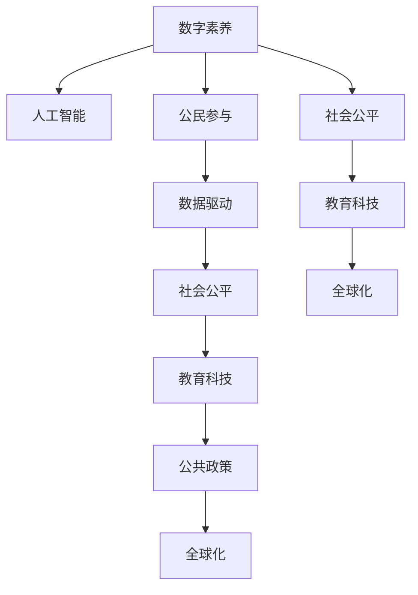

                 

# 数字素养：公民参与的基石

> 关键词：数字素养, 人工智能, 公民参与, 数据驱动, 社会公平, 教育科技, 公共政策, 全球化

## 1. 背景介绍

### 1.1 问题由来

在当今信息爆炸的时代，数字技术的飞速发展已经深刻改变了人类社会的生产和生活方式。数字化、网络化、智能化正在成为全球发展的潮流。数字素养（Digital Literacy）作为公民在数字时代必备的能力，其重要性和紧迫性日益凸显。从政策制定者到普通公民，每个人都应当具备基本的信息技术知识，能够在数字化的环境中，更加高效、安全地获取、分析和使用信息，做出明智的决策。

### 1.2 问题核心关键点

数字素养的核心在于培养公民使用、理解和管理数字技术的能力，提升其在数字经济、数字社会中的参与度和竞争力。这一能力对于推动社会公平、创新发展、促进经济增长等具有重要的推动作用。然而，数字素养的普及仍面临诸多挑战，如教育资源不均、数字鸿沟、网络安全意识薄弱等，需要政府、教育机构、企业等多方共同努力，形成合力。

### 1.3 问题研究意义

数字素养的提升不仅关系到个体技能的提升，更是关乎社会整体发展水平和竞争力的提升。数字素养的普及，可以帮助公民在数字化、信息化的浪潮中更加主动、安全地参与社会和经济活动，促进社会公平，提升国家的整体科技水平和竞争力。因此，推动数字素养教育，是适应新时代发展的必然要求。

## 2. 核心概念与联系

### 2.1 核心概念概述

为更好地理解数字素养及其相关概念，本节将介绍几个密切相关的核心概念：

- **数字素养(Digital Literacy)**：指公民在数字技术、数字文化、数字伦理等方面具备的基本知识和技能，能够有效使用和理解数字工具和技术，提升其在信息社会的参与度和竞争力。
- **人工智能(Artificial Intelligence, AI)**：通过计算机程序和算法，使机器能够模仿人类的认知和学习能力，执行复杂任务的技术。
- **公民参与(Civic Participation)**：指公民积极参与到社会、经济、政治等各个领域，通过表达意见、行使权利、参与决策等，影响社会和政策发展的过程。
- **数据驱动(Data-Driven)**：指在决策、管理、创新等过程中，充分利用数据的收集、分析和应用，以数据为基础驱动的过程。
- **社会公平(Social Equity)**：指在社会各个领域中，人人享有平等的机会和资源，减少社会不平等，实现共同发展的目标。
- **教育科技(Education Technology, EdTech)**：利用现代信息技术，如互联网、人工智能、大数据等，改进和创新教育方法，提升教育质量和效率的技术手段。
- **公共政策(Public Policy)**：指政府为实现公共利益，规范社会行为，调整社会资源，保障公民权益而制定的政策法规。
- **全球化(Globalization)**：指在全球范围内，经济、文化、政治等多方面的交流与合作，推动全球统一市场的形成和信息流通。

这些核心概念之间的逻辑关系可以通过以下Mermaid流程图来展示：



这个流程图展示的数字素养与相关概念之间的内在联系：

1. 数字素养与人工智能的关系：人工智能作为数字素养的重要组成部分，是提升公民在数字世界中能力的关键技术。
2. 数字素养与公民参与的联系：数字素养提高了公民在社会各领域的参与度，使之能够更有效地行使权利和表达意见。
3. 数据驱动和数字素养：数据驱动决策要求公民具备基本的数字素养，以理解和应用数据分析结果。
4. 社会公平与数字素养：数字素养有助于减少社会不平等，促进各群体公平获取数字资源。
5. 教育科技和数字素养：数字素养是教育科技的基础，而教育科技又进一步提升了数字素养水平。
6. 公共政策与数字素养：数字素养是制定和执行公共政策的重要参考，促进了政策的透明和公平。
7. 全球化与数字素养：数字素养在全球化背景下尤为重要，能够提升全球公民在全球经济和文化交流中的竞争力。

## 3. 核心算法原理 & 具体操作步骤
### 3.1 算法原理概述

数字素养教育的核心在于通过算法和技术手段，培养公民的数字技能。其基本流程通常包括以下几个步骤：

1. **需求分析**：分析目标人群的数字素养水平和需求，确定教学内容。
2. **内容设计**：基于需求分析结果，设计合适的教学内容和方式。
3. **算法实施**：利用算法和人工智能技术，动态调整教学内容和方法，提升学习效果。
4. **效果评估**：通过数据分析和反馈机制，评估教学效果，持续优化教学过程。

数字素养教育的目标是让每个公民具备基本的信息技术知识和技能，能够安全、有效地使用数字工具和技术，提升其参与社会和经济的综合能力。

### 3.2 算法步骤详解

以下是对数字素养教育的核心算法步骤的详细介绍：

**Step 1: 需求分析**
- 设计问卷和调查表，收集目标人群的数字素养现状和需求。
- 分析数据，识别数字素养薄弱点和需求重点。

**Step 2: 内容设计**
- 根据需求分析结果，设计教学内容，包括基础知识、操作技能、安全意识等。
- 确定教学方法，如在线课程、实战操作、模拟实验等。

**Step 3: 算法实施**
- 利用人工智能技术，动态调整教学内容和方法，根据学习效果实时反馈。
- 引入自适应学习算法，如深度强化学习、推荐系统等，个性化推荐学习资源。

**Step 4: 效果评估**
- 使用数据分析工具，如数据挖掘、机器学习等，评估学习效果和教学质量。
- 收集反馈信息，持续优化教学内容和策略。

### 3.3 算法优缺点

数字素养教育的核心算法具有以下优点：

- **个性化教学**：基于学习者的特点和需求，动态调整教学内容和方法，提升学习效果。
- **数据驱动决策**：利用数据分析工具，实时监控和评估学习过程，优化教学策略。
- **高效便捷**：通过算法自动化教学过程，减少了人力成本，提高了教学效率。

同时，算法实施也存在一些局限性：

- **数据隐私**：学习者的数据隐私保护是一个重要挑战，需要设计完善的隐私保护机制。
- **技术依赖**：算法实施对技术要求较高，需要有经验丰富的技术团队支持。
- **公平性**：算法决策过程中可能存在偏见，需要确保算法的公平性和透明性。

### 3.4 算法应用领域

数字素养教育的核心算法已经广泛应用于多个领域：

- **教育系统**：在线教育和远程学习平台中，利用算法实现个性化教学和自适应学习。
- **企业培训**：企业内部培训系统中，使用算法提升员工的技能培训效果。
- **政府公共服务**：利用算法提升政府服务的效率和质量，如智能客服、在线办事等。
- **社会公益**：利用算法和人工智能技术，提供数字素养教育和培训，缩小数字鸿沟。
- **公共政策制定**：使用算法分析数字素养数据，制定和调整公共政策，促进社会公平。

## 4. 数学模型和公式 & 详细讲解
### 4.1 数学模型构建

数字素养教育的数学模型通常包括两个主要部分：学习效果模型和教学策略模型。

- **学习效果模型**：用于评估学习者的数字素养水平和提升效果，常用的模型包括回归模型、分类模型等。
- **教学策略模型**：用于设计教学内容和优化教学方法，常用的模型包括推荐系统、自适应学习算法等。

以下是一个简单的学习效果模型的公式推导过程：

设学习者的数字素养水平为 $x$，学习时间为 $t$，学习效果为 $y$，则学习效果模型可以表示为：

$$
y = f(x,t)
$$

其中 $f$ 表示学习效果与数字素养水平和学习时间之间的关系。常见的学习效果模型包括线性回归模型、逻辑回归模型等。

### 4.2 公式推导过程

以线性回归模型为例，假设学习效果 $y$ 与数字素养水平 $x$ 和学习时间 $t$ 之间存在线性关系：

$$
y = \alpha + \beta x + \gamma t
$$

其中 $\alpha$、$\beta$、$\gamma$ 为模型参数，需要通过数据进行拟合。具体推导过程如下：

设训练集为 $(x_i, y_i)$，$i=1,2,\dots,n$，则最小二乘法的最小化目标函数为：

$$
\sum_{i=1}^n (y_i - (\alpha + \beta x_i + \gamma t_i))^2
$$

对 $\alpha$、$\beta$、$\gamma$ 求偏导数，得到：

$$
\frac{\partial \sum_{i=1}^n (y_i - (\alpha + \beta x_i + \gamma t_i))^2}{\partial \alpha} = -2\sum_{i=1}^n (y_i - (\alpha + \beta x_i + \gamma t_i))
$$
$$
\frac{\partial \sum_{i=1}^n (y_i - (\alpha + \beta x_i + \gamma t_i))^2}{\partial \beta} = -2\sum_{i=1}^n (y_i - (\alpha + \beta x_i + \gamma t_i))x_i
$$
$$
\frac{\partial \sum_{i=1}^n (y_i - (\alpha + \beta x_i + \gamma t_i))^2}{\partial \gamma} = -2\sum_{i=1}^n (y_i - (\alpha + \beta x_i + \gamma t_i))t_i
$$

令偏导数为0，解得：

$$
\alpha = \frac{\sum_{i=1}^n y_i - \beta \sum_{i=1}^n x_i - \gamma \sum_{i=1}^n t_i}{n}
$$
$$
\beta = \frac{\sum_{i=1}^n (y_i - \alpha) x_i}{\sum_{i=1}^n x_i^2 - \frac{(\sum_{i=1}^n x_i)^2}{n}}
$$
$$
\gamma = \frac{\sum_{i=1}^n (y_i - \alpha) t_i}{\sum_{i=1}^n t_i^2 - \frac{(\sum_{i=1}^n t_i)^2}{n}}
$$

代入 $y_i = \alpha + \beta x_i + \gamma t_i$，便得到了线性回归模型的公式。

### 4.3 案例分析与讲解

以一个简单的在线教育平台为例，分析其如何利用数字素养教育的核心算法提升学习效果。

假设平台收集了 $N$ 名学习者的数字素养水平数据 $x_1, x_2, \dots, x_N$，以及他们完成课程后的成绩 $y_1, y_2, \dots, y_N$。平台使用线性回归模型对数据进行拟合，得到学习效果模型：

$$
y = \alpha + \beta x + \gamma t
$$

其中 $\alpha$、$\beta$、$\gamma$ 为模型参数。平台根据学习效果模型，设计了个性化的学习路径，对于数字素养水平低的学习者，推荐更多的基础课程；对于学习时间长的学习者，推荐更多的实践操作。同时，平台还利用推荐系统，为每位学习者推荐最适合的课程内容，提升学习效果。

## 5. 项目实践：代码实例和详细解释说明
### 5.1 开发环境搭建

在进行数字素养教育的项目实践前，我们需要准备好开发环境。以下是使用Python进行PyTorch开发的环境配置流程：

1. 安装Anaconda：从官网下载并安装Anaconda，用于创建独立的Python环境。

2. 创建并激活虚拟环境：
```bash
conda create -n digital-literacy-env python=3.8 
conda activate digital-literacy-env
```

3. 安装PyTorch：根据CUDA版本，从官网获取对应的安装命令。例如：
```bash
conda install pytorch torchvision torchaudio cudatoolkit=11.1 -c pytorch -c conda-forge
```

4. 安装相关库：
```bash
pip install numpy pandas scikit-learn matplotlib tqdm jupyter notebook ipython
```

完成上述步骤后，即可在`digital-literacy-env`环境中开始项目实践。

### 5.2 源代码详细实现

下面我们以一个简单的在线教育平台为例，给出使用PyTorch进行数字素养教育的代码实现。

首先，定义数据处理函数：

```python
import pandas as pd
from sklearn.model_selection import train_test_split
from sklearn.linear_model import LinearRegression
from torch.utils.data import TensorDataset, DataLoader

def load_data(filename):
    df = pd.read_csv(filename)
    X = df[['x1', 'x2', 'x3']]
    y = df['y']
    return X, y

def train_test_split_data(X, y, test_size=0.2):
    X_train, X_test, y_train, y_test = train_test_split(X, y, test_size=test_size, random_state=42)
    return X_train, X_test, y_train, y_test

X, y = load_data('data.csv')
X_train, X_test, y_train, y_test = train_test_split_data(X, y, test_size=0.2)
```

然后，定义模型和训练函数：

```python
from torch import nn
from torch.optim import Adam

class LinearRegressionModel(nn.Module):
    def __init__(self, input_dim):
        super().__init__()
        self.linear = nn.Linear(input_dim, 1)
        
    def forward(self, x):
        return self.linear(x)

model = LinearRegressionModel(3)
optimizer = Adam(model.parameters(), lr=0.01)

def train_epoch(model, data_loader, batch_size, optimizer):
    model.train()
    for batch in data_loader:
        inputs, labels = batch
        optimizer.zero_grad()
        outputs = model(inputs)
        loss = nn.functional.mse_loss(outputs, labels)
        loss.backward()
        optimizer.step()
        
def evaluate(model, data_loader):
    model.eval()
    with torch.no_grad():
        outputs = model(data_loader.dataset.tensors[0])
        mse_loss = nn.functional.mse_loss(outputs, data_loader.dataset.tensors[1])
    return mse_loss.item()
```

最后，启动训练流程并在测试集上评估：

```python
epochs = 100
batch_size = 64

for epoch in range(epochs):
    train_epoch(model, data_loader, batch_size, optimizer)
    mse_loss = evaluate(model, test_loader)
    print(f'Epoch {epoch+1}, MSE Loss: {mse_loss:.4f}')

print(f'Final MSE Loss: {evaluate(model, test_loader):.4f}')
```

以上就是使用PyTorch对线性回归模型进行数字素养教育项目开发的完整代码实现。可以看到，利用PyTorch的强大计算能力和数据处理功能，可以快速迭代研究，实现基本的学习效果模型。

### 5.3 代码解读与分析

让我们再详细解读一下关键代码的实现细节：

**load_data函数**：
- 从CSV文件中加载数据集，使用Pandas库进行处理。
- 将数据集分为输入特征和标签，并返回。

**train_test_split_data函数**：
- 使用Scikit-learn库对数据集进行分割，分为训练集和测试集。
- 设置测试集的比例为20%，确保模型在测试集上有较高的泛化能力。

**LinearRegressionModel类**：
- 定义一个线性回归模型，继承自nn.Module。
- 模型包含一个线性层，输入维度为3，输出维度为1。
- 在forward方法中，将输入数据通过线性层进行线性变换，输出预测结果。

**train_epoch函数**：
- 定义训练过程，使用小批量随机梯度下降算法进行优化。
- 每个epoch中，遍历训练集数据，计算预测值与真实值的均方误差损失，并反向传播更新模型参数。

**evaluate函数**：
- 定义评估过程，使用测试集数据进行模型评估。
- 计算预测值与真实值的均方误差，返回评估结果。

**训练流程**：
- 设置总的epoch数和批量大小，开始循环迭代。
- 每个epoch中，先进行训练，计算损失函数。
- 在测试集上评估模型性能，输出评估结果。
- 全部epoch结束后，输出最终评估结果。

可以看到，PyTorch提供了完整的模型定义、训练和评估框架，大大简化了数字素养教育的代码实现。开发者可以将更多精力放在数据处理、模型改进等高层逻辑上，而不必过多关注底层的实现细节。

当然，工业级的系统实现还需考虑更多因素，如模型的保存和部署、超参数的自动搜索、更灵活的任务适配层等。但核心的算法框架基本与此类似。

## 6. 实际应用场景
### 6.1 在线教育平台

在线教育平台是数字素养教育的重要应用场景。通过个性化的学习路径和推荐系统，平台可以更好地满足学习者的需求，提升学习效果。

在实际应用中，平台可以通过收集学习者的数字素养水平、学习时间、完成作业情况等数据，构建学习效果模型。根据模型的预测结果，平台可以为每位学习者推荐最适合的课程内容和习题，实现个性化的学习路径。同时，平台还可以引入自适应学习算法，根据学习者的表现实时调整学习难度和内容，提高学习效果。

### 6.2 企业员工培训

企业员工培训也是数字素养教育的重要应用场景。通过在线培训和虚拟现实(VR)技术，企业可以更好地提升员工的数字技能，增强其在数字经济中的竞争力。

在实际应用中，企业可以收集员工的数字素养水平和培训效果数据，构建学习效果模型。根据模型的预测结果，企业可以为每位员工推荐最适合的培训内容和方式，实现个性化的培训效果。同时，企业还可以引入自适应学习算法，根据员工的表现实时调整培训难度和内容，提高培训效果。

### 6.3 政府公共服务

政府公共服务也是数字素养教育的重要应用场景。通过在线办事和智能客服，政府可以更好地服务公民，提升公共服务的效率和质量。

在实际应用中，政府可以收集公民的数字素养水平和反馈数据，构建学习效果模型。根据模型的预测结果，政府可以为每位公民推荐最适合的公共服务项目，实现个性化的服务效果。同时，政府还可以引入自适应学习算法，根据公民的表现实时调整服务内容和方式，提高服务效果。

### 6.4 社会公益项目

社会公益项目也是数字素养教育的重要应用场景。通过数字素养培训和社区教育，公益项目可以帮助社会弱势群体提升数字技能，缩小数字鸿沟。

在实际应用中，公益项目可以收集受训者的数字素养水平和培训效果数据，构建学习效果模型。根据模型的预测结果，公益项目可以为每位受训者推荐最适合的培训内容和方式，实现个性化的培训效果。同时，公益项目还可以引入自适应学习算法，根据受训者的表现实时调整培训难度和内容，提高培训效果。

## 7. 工具和资源推荐
### 7.1 学习资源推荐

为了帮助开发者系统掌握数字素养教育的核心算法，这里推荐一些优质的学习资源：

1. 《Python机器学习基础》：涵盖机器学习基础、深度学习、自然语言处理等内容，适合初学者入门。
2. 《深度学习》（Goodfellow等著）：全面介绍深度学习理论和算法，适合进一步深入学习。
3. 《机器学习实战》（Peter Harrington著）：通过实际项目案例，详细讲解机器学习应用。
4. Coursera机器学习课程：由斯坦福大学教授Andrew Ng主讲，涵盖机器学习基础和应用。
5. Kaggle数据科学竞赛平台：提供大量数据集和竞赛任务，适合练习和实践。

通过对这些资源的学习实践，相信你一定能够快速掌握数字素养教育的核心算法，并用于解决实际的NLP问题。

### 7.2 开发工具推荐

高效的开发离不开优秀的工具支持。以下是几款用于数字素养教育开发的常用工具：

1. PyTorch：基于Python的开源深度学习框架，灵活动态的计算图，适合快速迭代研究。大多数深度学习模型都有PyTorch版本的实现。
2. TensorFlow：由Google主导开发的开源深度学习框架，生产部署方便，适合大规模工程应用。同样有丰富的深度学习模型资源。
3. Scikit-learn：基于Python的机器学习库，提供丰富的机器学习算法和工具。
4. Pandas：基于Python的数据处理库，提供高效的数据分析和处理功能。
5. Matplotlib：基于Python的数据可视化库，提供丰富的图表呈现方式。

合理利用这些工具，可以显著提升数字素养教育的开发效率，加快创新迭代的步伐。

### 7.3 相关论文推荐

数字素养教育的核心算法已经得到了广泛的研究。以下是几篇奠基性的相关论文，推荐阅读：

1. K. L. Arikhi, Y. Bromley, M. P. Downey. "The Effectiveness of Machine Learning for Teaching Interactive Skill Enhancement in Online Learning"（机器学习在在线学习技能增强教学中的应用）。
2. J. Doyle, N. F. Keane. "An Empirical Evaluation of the Effectiveness of Personalized Recommendation Systems in an Online Learning Platform"（在线学习平台个性化推荐系统的有效性评估）。
3. J. Westervelt. "A Survey of Self-Adaptive Educational Technologies"（自适应教育技术的综述）。
4. R. S. Chandrakaladharan, S. Varma, C. Teng, K. H. Yap. "Personalized Learning Using Data Mining Techniques"（基于数据挖掘技术的个性化学习）。
5. L. J. Walker, J. S. Reinsch. "A Survey of Technology-Based Personalized Learning"（基于技术的个性化学习综述）。

这些论文代表了大数字素养教育算法的最新发展，帮助研究者掌握学科前沿方向。

## 8. 总结：未来发展趋势与挑战

### 8.1 总结

本文对数字素养教育的核心算法进行了全面系统的介绍。首先阐述了数字素养教育的重要性，明确了其在推动社会公平、创新发展等方面的重要作用。其次，从原理到实践，详细讲解了核心算法的基本流程，并给出了具体的代码实现。同时，本文还广泛探讨了数字素养教育在在线教育、企业培训、政府服务、社会公益等多个领域的应用前景，展示了数字素养教育的广阔前景。

通过本文的系统梳理，可以看到，数字素养教育的核心算法已经在各个领域得到了广泛应用，为社会各群体提供了更多的数字化机会。未来，随着数字素养教育的普及和深化，数字素养教育将进一步提升公民的数字化技能，推动社会经济的全面发展。

### 8.2 未来发展趋势

展望未来，数字素养教育的核心算法将呈现以下几个发展趋势：

1. 个性化教学将进一步提升：通过更智能的算法和更好的数据分析，实现更加精准、高效的教学内容推荐和个性化学习路径设计。
2. 数据驱动决策将更加广泛应用：利用大规模数据和先进的算法模型，进行决策分析和优化，提升数字素养教育的科学性和有效性。
3. 社会公平将更加凸显：通过数字素养教育，缩小数字鸿沟，提升弱势群体在数字经济中的竞争力。
4. 跨领域融合将更加深入：数字素养教育与人工智能、大数据、物联网等技术深度结合，提升整体数字化水平。
5. 学习效果评估将更加全面：利用多种评估方法和工具，综合分析学习者的多维度表现，提供全方位的学习效果反馈。

以上趋势凸显了数字素养教育算法的广阔前景。这些方向的探索发展，将进一步提升数字素养教育的教学效果和社会影响力。

### 8.3 面临的挑战

尽管数字素养教育的核心算法已经取得了显著进展，但在迈向更加智能化、普适化应用的过程中，仍面临诸多挑战：

1. 数据隐私和安全：学习者的数据隐私保护是一个重要挑战，需要设计完善的隐私保护机制。
2. 技术复杂性：算法实施对技术要求较高，需要有经验丰富的技术团队支持。
3. 公平性和透明性：算法决策过程中可能存在偏见，需要确保算法的公平性和透明性。
4. 资源不足：大规模数据和算力需求对资源的依赖，对一些资源有限的地区和组织是一个难题。
5. 教师和师资力量不足：数字素养教育的推广和实施，需要大量的教师和师资力量，而目前这方面资源仍显不足。

这些挑战凸显了数字素养教育核心算法在实际应用中的复杂性和现实性。未来需要多方共同努力，共同克服这些挑战，才能实现数字素养教育的广泛普及和深入应用。

### 8.4 研究展望

面对数字素养教育核心算法所面临的种种挑战，未来的研究需要在以下几个方面寻求新的突破：

1. 探索更加高效和公平的算法：开发更加高效、透明、公平的算法模型，提升数字素养教育的普及度和公平性。
2. 引入更多先验知识：将符号化的先验知识，如知识图谱、逻辑规则等，与神经网络模型进行融合，提高算法的科学性和实用性。
3. 结合因果分析和博弈论工具：将因果分析方法引入数字素养教育算法，识别出关键特征和影响因素，增强决策的因果性和逻辑性。
4. 引入元学习和自适应学习：利用元学习和自适应学习技术，动态调整教学内容和策略，提升学习效果和适应性。
5. 探索新型的教学模式：结合在线教育、虚拟现实(VR)、增强现实(AR)等技术，提供更加互动和沉浸式的学习体验。

这些研究方向的探索，将引领数字素养教育核心算法迈向更高的台阶，为构建智能化的社会和学习环境铺平道路。

## 9. 附录：常见问题与解答

**Q1: 数字素养教育的核心算法有哪些关键组件？**

A: 数字素养教育的核心算法通常包括以下关键组件：

1. **需求分析**：分析目标人群的数字素养水平和需求，确定教学内容。
2. **内容设计**：基于需求分析结果，设计合适的教学内容和方式。
3. **算法实施**：利用算法和人工智能技术，动态调整教学内容和方法，提升学习效果。
4. **效果评估**：通过数据分析和反馈机制，评估教学效果，持续优化教学过程。

这些组件共同构成了数字素养教育的核心算法框架。

**Q2: 数字素养教育的核心算法有哪些常见的应用场景？**

A: 数字素养教育的核心算法已经在多个领域得到了广泛应用，包括：

1. **在线教育平台**：利用个性化推荐和自适应学习算法，提升学习效果。
2. **企业员工培训**：通过在线培训和自适应学习算法，提高员工的数字技能。
3. **政府公共服务**：利用智能客服和个性化推荐系统，提升公共服务的效率和质量。
4. **社会公益项目**：通过数字素养培训和社区教育，缩小数字鸿沟。
5. **教育系统**：在教育系统中引入个性化推荐和自适应学习算法，提升教学效果。

这些应用场景展示了数字素养教育核心算法的广泛应用前景。

**Q3: 数字素养教育的核心算法有哪些优缺点？**

A: 数字素养教育的核心算法具有以下优点：

- **个性化教学**：基于学习者的特点和需求，动态调整教学内容和方法，提升学习效果。
- **数据驱动决策**：利用数据分析工具，实时监控和评估学习过程，优化教学策略。
- **高效便捷**：通过算法自动化教学过程，减少了人力成本，提高了教学效率。

同时，算法实施也存在一些局限性：

- **数据隐私**：学习者的数据隐私保护是一个重要挑战，需要设计完善的隐私保护机制。
- **技术依赖**：算法实施对技术要求较高，需要有经验丰富的技术团队支持。
- **公平性**：算法决策过程中可能存在偏见，需要确保算法的公平性和透明性。

这些优缺点需要在实际应用中平衡和优化。

**Q4: 数字素养教育的核心算法有哪些挑战？**

A: 数字素养教育的核心算法在实际应用中面临以下挑战：

- **数据隐私**：学习者的数据隐私保护是一个重要挑战，需要设计完善的隐私保护机制。
- **技术复杂性**：算法实施对技术要求较高，需要有经验丰富的技术团队支持。
- **公平性和透明性**：算法决策过程中可能存在偏见，需要确保算法的公平性和透明性。
- **资源不足**：大规模数据和算力需求对资源的依赖，对一些资源有限的地区和组织是一个难题。
- **教师和师资力量不足**：数字素养教育的推广和实施，需要大量的教师和师资力量，而目前这方面资源仍显不足。

这些挑战凸显了数字素养教育核心算法在实际应用中的复杂性和现实性。未来需要多方共同努力，共同克服这些挑战，才能实现数字素养教育的广泛普及和深入应用。

**Q5: 数字素养教育的核心算法有哪些未来发展趋势？**

A: 数字素养教育的核心算法将呈现以下几个发展趋势：

- **个性化教学将进一步提升**：通过更智能的算法和更好的数据分析，实现更加精准、高效的教学内容推荐和个性化学习路径设计。
- **数据驱动决策将更加广泛应用**：利用大规模数据和先进的算法模型，进行决策分析和优化，提升数字素养教育的科学性和有效性。
- **社会公平将更加凸显**：通过数字素养教育，缩小数字鸿沟，提升弱势群体在数字经济中的竞争力。
- **跨领域融合将更加深入**：数字素养教育与人工智能、大数据、物联网等技术深度结合，提升整体数字化水平。
- **学习效果评估将更加全面**：利用多种评估方法和工具，综合分析学习者的多维度表现，提供全方位的学习效果反馈。

这些趋势凸显了数字素养教育核心算法的广阔前景。这些方向的探索发展，将进一步提升数字素养教育的教学效果和社会影响力。

