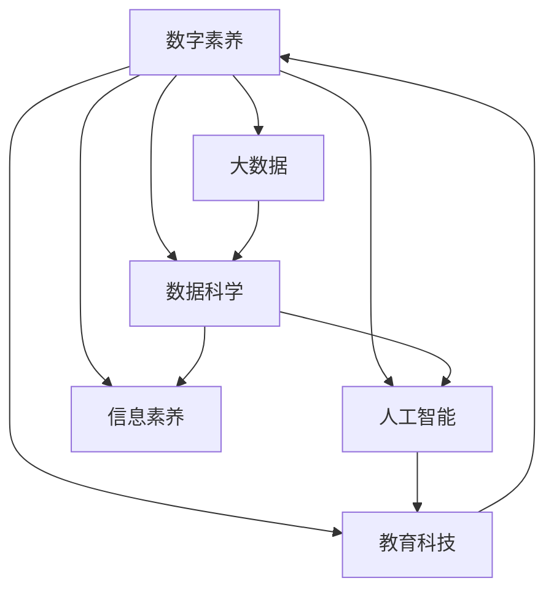

                 

# 数字素养：公民参与的基石

> 关键词：数字素养,公民参与,人工智能,大数据,数据科学,教育科技

## 1. 背景介绍

### 1.1 问题由来

在数字化时代，信息技术的普及让我们的生活变得更加便捷，但同时也带来了新的挑战。互联网的开放性让各种信息得以自由流通，同时也导致虚假信息和网络谣言的泛滥。数字素养（Digital Literacy）作为公民必备的技能，已成为了现代教育的重要组成部分。数字素养不仅能帮助我们有效识别和抵制虚假信息，还能提高我们的数据处理能力和技术应用水平，从而更好地参与社会建设，推动经济发展。

### 1.2 问题核心关键点

数字素养的核心关键点包括：

- **基本技能**：如搜索引擎、办公软件、网络安全等基础技术工具的使用。
- **批判性思维**：能够对在线信息进行甄别，辨识信息的真实性和可靠性。
- **数据理解**：能够理解和处理数据，从中提取有价值的信息。
- **信息创造**：利用技术工具创造信息，如编写代码、制作视频、设计网页等。

这些核心关键点共同构成了数字素养，使其成为现代公民不可或缺的“第四类教育”。

### 1.3 问题研究意义

提高公民的数字素养，具有以下几方面的意义：

1. **保障信息安全**：增强公民对网络环境的敏感度，有效防范网络诈骗和隐私泄露。
2. **提升决策能力**：利用数据分析增强决策依据，提高个人和企业决策质量。
3. **促进经济发展**：培养符合技术发展的劳动力市场，推动产业升级和经济创新。
4. **强化民主参与**：通过数字化手段参与政治、社会活动，提高社会参与度和透明度。
5. **促进文化交流**：利用技术手段推广多元文化，促进全球文化交流与融合。

## 2. 核心概念与联系

### 2.1 核心概念概述

为了更好地理解数字素养的内涵及其与其他技术概念的关系，本节将介绍几个紧密相关的核心概念：

- **数字素养**：指掌握和使用数字技术的能力，包括对信息技术的理解、应用和评估。
- **大数据**：指超大规模的数据集，通常包含各种类型的结构化和非结构化数据。
- **数据科学**：涉及数据收集、处理、分析和解释的学科，旨在从数据中提取有用信息。
- **人工智能**：使计算机能够模拟人类智能的技术，包括机器学习、自然语言处理等。
- **教育科技**：利用信息技术改进教育过程，提高教育质量和学习效率。
- **信息素养**：指处理、分析和创造信息的能力，强调批判性思维和信息评估。

这些概念之间的逻辑关系可以通过以下Mermaid流程图来展示：



这个流程图展示了几大核心概念及其之间的关系：

1. 数字素养是其他技术概念的基础。
2. 大数据、数据科学和人工智能等技术，都是数字素养的重要组成部分。
3. 教育科技和信息素养也是数字素养不可或缺的组成部分。
4. 这些概念共同构成了数字素养的核心内涵，使其成为公民参与社会事务的关键能力。

## 3. 核心算法原理 & 具体操作步骤
### 3.1 算法原理概述

数字素养的核心算法原理主要涉及以下几个方面：

- **信息识别**：通过爬虫技术、搜索引擎等工具，获取和识别网络信息。
- **数据处理**：使用数据库、大数据平台等技术，处理和存储海量数据。
- **数据分析**：运用机器学习、统计分析等算法，从数据中提取有价值的信息。
- **信息创造**：使用编程、编辑等工具，生成和传播新的信息内容。

这些算法原理共同构成了数字素养的核心技术框架，使公民能够有效地参与数字化社会。

### 3.2 算法步骤详解

以下是一个基本的数字素养技术实现步骤：

**Step 1: 信息收集与识别**

1. 使用爬虫技术从网络中抓取公开可用的信息。
2. 使用搜索引擎获取相关网页。
3. 通过爬虫和搜索引擎，收集用户需要的信息，并进行预处理和筛选。

**Step 2: 数据存储与管理**

1. 使用数据库（如MySQL、MongoDB等）存储数据。
2. 对数据进行结构化处理，如去重、格式化、归档等。
3. 使用数据管理工具（如Tableau、PowerBI等）进行数据可视化。

**Step 3: 数据分析与处理**

1. 使用机器学习算法（如分类、聚类、回归等）分析数据。
2. 使用统计工具（如Python的Pandas库）处理数据。
3. 对分析结果进行可视化展示，提取关键信息。

**Step 4: 信息创造与传播**

1. 使用编程工具（如Python、R等）编写代码，生成新的信息。
2. 使用内容管理系统（如WordPress、Joomla等）创建和管理网站内容。
3. 使用社交媒体平台（如Facebook、Twitter等）传播信息。

### 3.3 算法优缺点

数字素养技术具有以下优点：

- **效率高**：自动化信息处理大大提高了数据处理的效率。
- **准确性高**：机器学习算法可以从大数据中提取有价值的信息，减少人为误差。
- **灵活性强**：大数据和人工智能技术可以根据需求进行灵活调整和优化。
- **应用广泛**：数字素养技术可以应用于各个领域，如医疗、教育、金融等。

同时，这些技术也存在一些缺点：

- **技术门槛高**：需要掌握一定的编程和数据分析技能，对于非技术背景的人可能较难上手。
- **隐私风险**：数据的收集和处理可能涉及隐私问题，需要谨慎处理。
- **技术依赖性强**：数字素养技术依赖于各种软硬件平台，对技术基础设施要求较高。
- **学习成本高**：需要投入大量时间和精力进行学习和实践。

### 3.4 算法应用领域

数字素养技术在多个领域都有着广泛的应用：

- **医疗健康**：通过大数据分析，提供个性化的医疗建议和预防措施。
- **教育培训**：利用人工智能技术，提供智能化的教学和学习平台。
- **金融科技**：使用数据科学方法，进行风险评估和投资决策。
- **公共治理**：通过数据分析，优化政府服务和公共政策。
- **媒体传播**：利用信息创造技术，生成和传播高质量的内容。

## 4. 数学模型和公式 & 详细讲解 & 举例说明

### 4.1 数学模型构建

数字素养技术的数学模型主要涉及以下几个方面：

- **信息识别模型**：基于搜索引擎和爬虫技术，构建网页爬取和信息抽取模型。
- **数据处理模型**：使用数据库和数据管理工具，构建数据存储和处理模型。
- **数据分析模型**：使用机器学习和统计分析算法，构建数据分析和可视化模型。
- **信息创造模型**：基于编程和内容管理系统，构建信息生成和传播模型。

### 4.2 公式推导过程

以信息识别模型为例，以下是一个基本的爬虫技术实现流程：

1. 网页抓取：使用Python的requests库获取网页内容。
2. 信息提取：使用BeautifulSoup库解析HTML，提取关键信息。
3. 数据存储：使用MySQL存储抓取的数据。
4. 信息处理：使用Python的pandas库进行数据清洗和处理。

### 4.3 案例分析与讲解

以数据科学在金融领域的应用为例：

1. 数据收集：收集用户的历史交易数据、市场行情等。
2. 数据清洗：使用Python的pandas库进行数据预处理，去除异常值和噪声。
3. 数据分析：使用机器学习算法（如随机森林、梯度提升等）进行风险评估。
4. 结果展示：使用Tableau进行数据可视化，生成风险报告。

## 5. 项目实践：代码实例和详细解释说明

### 5.1 开发环境搭建

在进行数字素养技术实践前，我们需要准备好开发环境。以下是使用Python进行项目开发的环境配置流程：

1. 安装Anaconda：从官网下载并安装Anaconda，用于创建独立的Python环境。
2. 创建并激活虚拟环境：
```bash
conda create -n digital-literacy python=3.8 
conda activate digital-literacy
```
3. 安装Python相关库：
```bash
pip install requests beautifulsoup4 pandas mysql-connector-python scikit-learn tableau-py
```

完成上述步骤后，即可在`digital-literacy`环境中开始项目开发。

### 5.2 源代码详细实现

这里我们以爬虫技术为例，给出使用Python实现信息收集和处理的代码。

```python
import requests
from bs4 import BeautifulSoup
import pandas as pd
import mysql.connector

# 爬取网页内容
def fetch_web_content(url):
    response = requests.get(url)
    return response.content

# 解析网页内容
def parse_web_content(html_content):
    soup = BeautifulSoup(html_content, 'html.parser')
    return soup

# 存储数据
def store_data(data, table_name):
    cnx = mysql.connector.connect(user='username', password='password', host='localhost', database='database_name')
    cursor = cnx.cursor()
    query = "INSERT INTO {} (col1, col2, col3) VALUES (%s, %s, %s)".format(table_name)
    for row in data:
        cursor.execute(query, row)
    cnx.commit()
    cnx.close()

# 数据处理
def process_data(data):
    df = pd.DataFrame(data)
    df = df.drop_duplicates()
    return df

# 运行示例
url = 'https://example.com'
html_content = fetch_web_content(url)
soup = parse_web_content(html_content)
data = []
for link in soup.find_all('a'):
    data.append((link.get('href'), link.get('title'), link.get('target')))
store_data(data, 'links')
df = process_data(data)
```

以上代码实现了基本的网页抓取、解析、存储和处理功能，是数字素养技术开发的典型示例。

### 5.3 代码解读与分析

让我们再详细解读一下关键代码的实现细节：

**fetch_web_content函数**：
- 使用requests库获取网页内容，返回字节流。

**parse_web_content函数**：
- 使用BeautifulSoup库解析HTML，提取网页中的链接、标题和目标属性。

**store_data函数**：
- 使用MySQL库将数据存储到数据库中。

**process_data函数**：
- 使用Pandas库对数据进行去重和清洗。

**代码运行示例**：
- 定义要爬取的网页URL。
- 使用fetch_web_content函数获取网页内容。
- 解析网页内容，提取出链接、标题和目标属性，存储到数据库中。
- 对数据进行处理，生成Pandas数据框。

可以看到，数字素养技术的开发涉及爬虫技术、数据库技术、数据处理技术等多个方面，需要综合运用多种技术工具。

## 6. 实际应用场景

### 6.1 智能健康平台

数字素养技术在智能健康平台中的应用，可以显著提升用户的健康管理体验。用户通过智能设备收集健康数据，数字素养技术可以对其进行分析和可视化，生成个性化的健康报告和建议。平台还可以根据用户的历史数据和行为，提供精准的健康管理方案，从而帮助用户更好地管理自己的健康。

### 6.2 在线教育平台

在线教育平台利用数字素养技术，可以提供个性化的学习方案。平台通过分析学生的学习行为和成绩，生成学习报告和建议，帮助学生更好地理解课程内容，提高学习效率。同时，数字素养技术还可以用于生成自动化的教学材料，减少教师的备课时间，提升教学质量。

### 6.3 智能投顾系统

金融领域的智能投顾系统利用数字素养技术，可以提供精准的风险评估和投资建议。系统通过分析用户的投资行为和市场行情，生成个性化的投资报告和建议，帮助用户做出更明智的投资决策。同时，数字素养技术还可以用于实时监控市场动态，及时调整投资策略，提升投资回报率。

### 6.4 未来应用展望

随着数字素养技术的不断发展，未来在更多领域将得到应用，为各行各业带来变革性影响：

1. **智慧城市**：通过数据分析和智能管理，提升城市治理效率和服务质量。
2. **智慧医疗**：利用大数据分析和人工智能，提高医疗服务的精准性和可及性。
3. **智慧教育**：通过个性化学习和智能评估，提升教育公平和质量。
4. **智慧金融**：利用数据科学和机器学习，提升金融服务的智能化和个性化。
5. **智慧农业**：通过智能监测和数据分析，优化农业生产和管理。
6. **智慧交通**：利用数据分析和智能管理，提升交通系统的效率和安全性。

## 7. 工具和资源推荐

### 7.1 学习资源推荐

为了帮助开发者系统掌握数字素养技术的理论基础和实践技巧，这里推荐一些优质的学习资源：

1. **《Python爬虫实战》**：详细介绍了爬虫技术的基本原理和常用工具。
2. **《数据库系统概论》**：系统介绍了数据库技术的概念、原理和应用。
3. **《机器学习实战》**：介绍了机器学习算法的基本原理和应用案例。
4. **《数据科学实战》**：系统介绍了数据科学技术的全流程，包括数据收集、处理、分析和可视化。
5. **《数字素养教育培训课程》**：提供系统的数字素养培训课程，涵盖基础知识和实践技能。

通过对这些资源的学习实践，相信你一定能够快速掌握数字素养技术的精髓，并用于解决实际的问题。

### 7.2 开发工具推荐

高效的开发离不开优秀的工具支持。以下是几款用于数字素养技术开发的常用工具：

1. **Python**：Python是目前最流行的编程语言之一，广泛用于数据处理和分析。
2. **Jupyter Notebook**：一个交互式的编程环境，便于编写和运行Python代码，支持实时展示结果。
3. **MySQL**：一个广泛使用的大型关系型数据库系统，用于存储和管理数据。
4. **Tableau**：一个强大的数据可视化工具，支持多种数据源和分析方法。
5. **BeautifulSoup**：一个Python库，用于解析HTML和XML文档，提取数据。

合理利用这些工具，可以显著提升数字素养技术的开发效率，加快创新迭代的步伐。

### 7.3 相关论文推荐

数字素养技术的发展源于学界的持续研究。以下是几篇奠基性的相关论文，推荐阅读：

1. **《Python爬虫原理与实战》**：介绍爬虫技术的基本原理和实现方法。
2. **《大数据与数据科学基础》**：介绍大数据技术的概念、原理和应用。
3. **《机器学习算法与应用》**：介绍机器学习算法的基本原理和应用案例。
4. **《数据科学实践指南》**：介绍数据科学技术的全流程，涵盖基础知识和实践技能。
5. **《数字素养与信息素养研究综述》**：总结数字素养和信息素养的研究进展，提供系统化的理论框架。

这些论文代表了大规模语言模型微调技术的发展脉络。通过学习这些前沿成果，可以帮助研究者把握学科前进方向，激发更多的创新灵感。

## 8. 总结：未来发展趋势与挑战

### 8.1 总结

本文对数字素养的核心概念及其与其他技术概念的联系进行了系统梳理。首先阐述了数字素养的重要性和意义，明确了其在数字化社会中的关键作用。其次，从原理到实践，详细讲解了数字素养技术的基本实现步骤，给出了代码实例和详细解释。同时，本文还广泛探讨了数字素养技术在智能健康、在线教育、智能投顾等领域的实际应用场景，展示了其广阔的应用前景。此外，本文精选了数字素养技术的各类学习资源，力求为读者提供全方位的技术指引。

通过本文的系统梳理，可以看到，数字素养技术正在成为现代公民必备的技能，其涉及的知识和技术涵盖多个领域，具有广泛的应用前景。数字素养技术的持续演进，将进一步提升数字化社会的智能化水平，推动各行各业的转型升级。

### 8.2 未来发展趋势

展望未来，数字素养技术将呈现以下几个发展趋势：

1. **技术融合加速**：数字素养技术与物联网、云计算、人工智能等技术的融合，将进一步提升数字素养的应用广度和深度。
2. **数据安全强化**：随着数据量的增大，数据安全和隐私保护将成为数字素养技术的重要关注点。
3. **应用场景拓展**：数字素养技术将在更多领域得到应用，如智慧旅游、智慧政务、智慧交通等。
4. **智能化水平提升**：数字素养技术将进一步提升智能化水平，支持更多复杂的数据处理和分析任务。
5. **用户参与度提高**：数字素养技术将更加注重用户参与，提供更加个性化的服务和体验。

这些趋势展示了数字素养技术的广阔前景，预示着其在未来将发挥更加重要的作用。

### 8.3 面临的挑战

尽管数字素养技术已经取得了一定的成就，但在实际应用中仍面临诸多挑战：

1. **技术门槛高**：数字素养技术涉及多种技术和工具，对用户的技术水平要求较高。
2. **数据隐私问题**：数据的收集和处理可能涉及隐私问题，需要谨慎处理。
3. **数据质量问题**：数据的质量和完整性直接影响数字素养技术的效果，需要采取有效的数据清洗和预处理措施。
4. **应用场景多样性**：不同的应用场景对数字素养技术的需求不同，需要灵活应对。
5. **用户接受度**：数字素养技术的推广需要用户的广泛接受和参与，需要提升用户的数字素养意识。

这些挑战将需要在技术、管理和社会层面上进行综合应对，以实现数字素养技术的全面普及和应用。

### 8.4 研究展望

面向未来，数字素养技术的研究需要在以下几个方面寻求新的突破：

1. **简化技术使用**：开发更加易用、易理解的技术工具，降低技术门槛。
2. **强化数据安全**：建立健全的数据安全和隐私保护机制，确保数据的安全和合法使用。
3. **提升数据质量**：改进数据清洗和预处理技术，提高数据的质量和完整性。
4. **拓展应用场景**：将数字素养技术应用于更多领域，提升各行各业的数字化水平。
5. **提升用户接受度**：加强数字素养教育和宣传，提升公众的数字素养意识和技能。

这些研究方向的探索，必将引领数字素养技术的持续发展，为构建数字化社会奠定坚实的基础。

## 9. 附录：常见问题与解答

**Q1: 数字素养技术在实际应用中需要哪些技能？**

A: 数字素养技术在实际应用中需要掌握以下技能：

1. 编程技能：如Python、JavaScript等，用于数据处理和自动化任务。
2. 数据库技术：如SQL、MySQL等，用于数据存储和管理。
3. 数据分析技能：如数据清洗、统计分析、机器学习等，用于从数据中提取有用信息。
4. 可视化技术：如Tableau、PowerBI等，用于数据展示和分析。
5. 网络安全技能：如网络安全、隐私保护等，确保数据的安全性和合法性。

这些技能共同构成了数字素养技术的基础，需要综合运用才能发挥其最大价值。

**Q2: 数字素养技术在开发过程中需要注意哪些问题？**

A: 数字素养技术的开发过程中需要注意以下问题：

1. 数据隐私：在数据收集和处理过程中，需要确保用户隐私的保护。
2. 数据质量：数据的质量直接影响数字素养技术的效果，需要进行有效的数据清洗和预处理。
3. 技术选型：需要根据应用场景和需求选择合适的技术工具和算法。
4. 系统性能：需要考虑系统的响应速度、计算资源和存储能力。
5. 用户界面：需要设计友好的用户界面，提升用户的使用体验。

这些问题需要在技术开发过程中进行综合考虑和处理，以确保数字素养技术的可靠性和易用性。

**Q3: 数字素养技术在实际应用中有哪些潜在风险？**

A: 数字素养技术在实际应用中存在以下潜在风险：

1. 数据泄露：数据的收集和存储可能涉及隐私问题，需要进行有效的安全防护。
2. 算法偏见：数字素养技术的算法可能存在偏见，需要进行公平性和透明度的审查。
3. 技术滥用：数字素养技术可能被用于恶意用途，如虚假信息传播、网络诈骗等。
4. 用户依赖：用户过度依赖数字素养技术，可能失去独立思考和解决问题的能力。
5. 社会分化：数字素养技术的普及可能加剧社会分化，需要进行公平性和包容性的考虑。

这些风险需要在技术应用过程中进行全面的风险评估和管理，确保数字素养技术的安全和公正性。

---

作者：禅与计算机程序设计艺术 / Zen and the Art of Computer Programming

