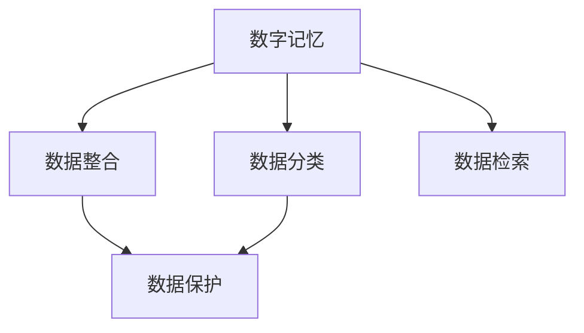
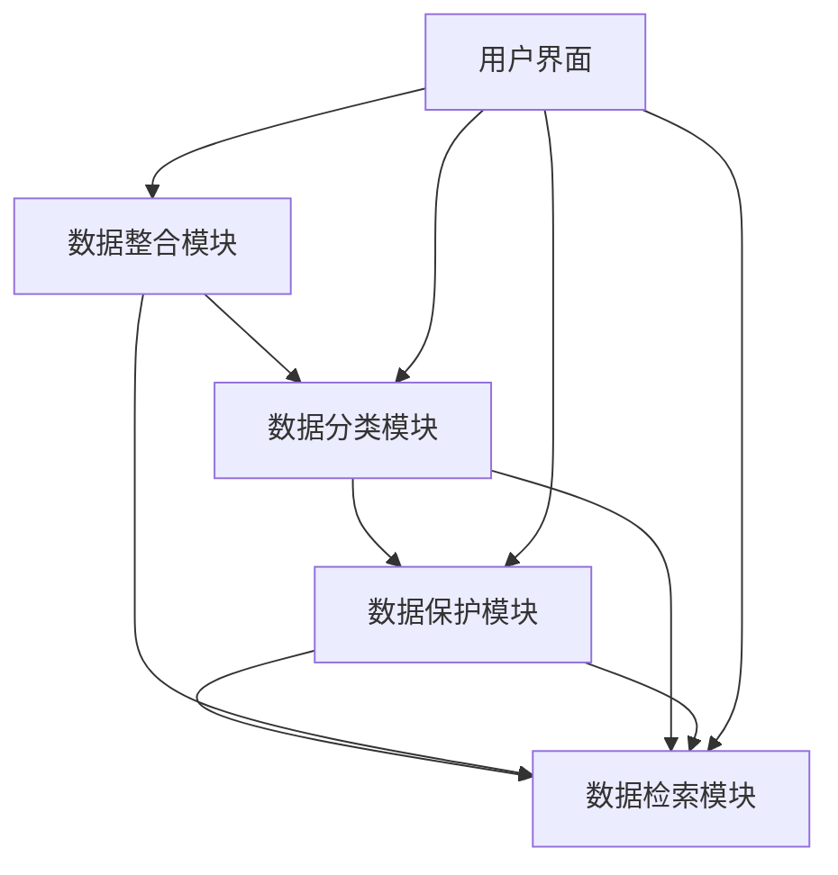

                 

# 数字记忆银行：AI管理的个人经历存储

在数字化时代，数据正以前所未有的速度增长，从海量的社交媒体帖子和电子邮件到个人健康记录和财务信息，每个人的生活都充斥着大量的数字足迹。但如何管理和保护这些数据，使之成为个人数字资产的一部分，却是一个不小的挑战。本文将探讨一种基于AI的解决方案——数字记忆银行，帮助个人存储和保护其最珍视的数字记忆。

## 1. 背景介绍

### 1.1 问题由来
随着智能手机和智能设备的普及，我们每个人的生活都被数字化了。从日常通讯到商务往来，从社交娱乐到健康管理，无处不在的数字足迹记录着我们的生活。然而，这些数据往往分散在不同的平台上，缺乏有效的管理和整合。如何在数据爆炸的时代，保护和管理这些宝贵的数字记忆，成为当今技术社会的一个重要问题。

### 1.2 问题核心关键点
数字记忆银行的核心在于通过AI技术对个人数据进行高效整合、分类、保护和检索。这不仅包括日常的通讯记录、社交媒体动态、照片和视频等，更延伸到健康数据、财务记录、职业履历等敏感信息。其关键点包括：
- 数据整合：将分散在不同平台和个人设备上的数据进行整合。
- 数据分类：对整合后的数据进行智能分类，提取有价值的信息。
- 数据保护：利用AI技术对数据进行加密和安全存储，防止数据泄露和未经授权的访问。
- 数据检索：通过智能检索算法，快速定位需要的数据，方便个人或机构使用。

### 1.3 问题研究意义
数字记忆银行不仅能够帮助个人更好地管理和保护其数字资产，还能提升数据的利用效率，为学术研究、健康管理和商业决策等提供有力支持。其研究意义在于：

- 数据保护：通过AI技术，实现对个人敏感信息的保护，防止数据泄露和滥用。
- 数据利用：提升数据分类和检索的效率，使个人和机构能够更高效地利用数据。
- 隐私管理：提供隐私保护机制，确保用户数据在存储和检索过程中的隐私安全。

## 2. 核心概念与联系

### 2.1 核心概念概述

数字记忆银行通过AI技术，将个人分散的数据进行整合、分类、保护和检索，构成一个集成的数字记忆管理平台。其核心概念包括：

- **数字记忆**：指个人在数字化生活中产生的各种数据，包括社交媒体动态、健康记录、财务信息等。
- **数字记忆银行**：基于AI技术，对个人数字记忆进行整合、分类、保护和检索的系统平台。
- **数据整合**：通过API接口、数据同步工具等方式，将分散的数据进行统一管理和整合。
- **数据分类**：利用机器学习算法对数据进行智能分类，提取有价值的信息。
- **数据保护**：通过加密技术和访问控制机制，保护数据的隐私和安全。
- **数据检索**：利用智能检索算法，快速定位需要的数据。

这些概念之间的联系可以通过以下Mermaid流程图来展示：



### 2.2 核心概念原理和架构的 Mermaid 流程图



## 3. 核心算法原理 & 具体操作步骤

### 3.1 算法原理概述

数字记忆银行的运行主要基于以下算法原理：

- **数据整合**：通过API接口、数据同步工具等方式，将分散在不同的平台和个人设备上的数据进行统一管理和整合。
- **数据分类**：利用机器学习算法对整合后的数据进行智能分类，提取有价值的信息。
- **数据保护**：通过加密技术和访问控制机制，保护数据的隐私和安全。
- **数据检索**：利用智能检索算法，快速定位需要的数据。

### 3.2 算法步骤详解

#### 3.2.1 数据整合

数据整合是数字记忆银行的基础。具体步骤如下：

1. **API集成**：将个人的社交媒体账户、邮箱、健康记录等平台的数据API集成到系统中，获取原始数据。
2. **数据同步**：通过定期同步或实时推送的方式，将各个平台的数据定期更新到系统中。
3. **数据清洗**：对获取的数据进行清洗和标准化处理，去除噪声和冗余数据，保证数据质量。

#### 3.2.2 数据分类

数据分类是数字记忆银行的核心功能之一。具体步骤如下：

1. **特征提取**：使用自然语言处理（NLP）技术，从文本数据中提取关键词、情感、主题等信息。
2. **模型训练**：利用机器学习算法，训练分类模型，对数据进行自动分类。
3. **分类应用**：将训练好的模型应用到实际数据中，实现对数据的智能分类。

#### 3.2.3 数据保护

数据保护是数字记忆银行的重要功能。具体步骤如下：

1. **数据加密**：对敏感数据进行加密处理，如使用AES加密算法对健康记录和财务信息进行加密。
2. **访问控制**：设置访问权限，确保只有授权用户可以访问敏感数据。
3. **安全审计**：记录和监控数据访问日志，防止未授权访问和数据泄露。

#### 3.2.4 数据检索

数据检索是数字记忆银行的另一个关键功能。具体步骤如下：

1. **索引建立**：对数据进行索引建立，如对邮件附件进行内容索引，对照片进行标签索引。
2. **查询处理**：根据用户输入的关键词或条件，快速定位需要的数据。
3. **结果返回**：将查询结果返回给用户，并提供快速查看和下载功能。

### 3.3 算法优缺点

数字记忆银行的优点：

- **高效整合**：通过API集成和数据同步，高效地整合分散的数据。
- **智能分类**：利用机器学习算法，实现对数据的智能分类，提取有价值的信息。
- **安全保护**：通过加密和访问控制，保护数据的隐私和安全。
- **快速检索**：利用智能检索算法，快速定位需要的数据。

其缺点包括：

- **数据隐私**：涉及到敏感数据的存储和保护，隐私风险较高。
- **技术复杂度**：需要涉及API集成、数据同步、机器学习等多项技术，技术难度较大。
- **成本投入**：需要投入大量的人力、物力和财力，建设和管理数字记忆银行平台。

### 3.4 算法应用领域

数字记忆银行的应用领域广泛，主要包括以下几个方面：

- **个人数据管理**：帮助个人管理日常的通讯记录、社交媒体动态、健康记录、财务信息等。
- **企业员工管理**：帮助企业管理员工的履历、工作表现、项目记录等。
- **学术研究**：帮助研究人员整合和分类学术数据，提升研究效率。
- **健康管理**：帮助患者管理健康数据，如病历、体检报告、治疗记录等。
- **金融理财**：帮助个人和家庭管理财务数据，如银行流水、投资记录、财务报表等。

## 4. 数学模型和公式 & 详细讲解 & 举例说明

### 4.1 数学模型构建

数字记忆银行的数据分类和检索功能主要基于机器学习算法。以邮件分类为例，构建数学模型的过程如下：

1. **数据预处理**：对原始邮件数据进行分词、去除停用词等预处理，得到特征向量。
2. **模型训练**：利用监督学习算法，如朴素贝叶斯、支持向量机、随机森林等，训练邮件分类模型。
3. **模型评估**：使用测试集对模型进行评估，计算分类准确率、召回率等指标。

### 4.2 公式推导过程

以朴素贝叶斯分类算法为例，公式推导过程如下：

设邮件数据集为 $D=\{(x_i,y_i)\}_{i=1}^N$，其中 $x_i$ 为邮件文本特征向量， $y_i$ 为分类标签。朴素贝叶斯分类器的目标是最大化后验概率：

$$
P(y|x) = \frac{P(x|y)P(y)}{P(x)}
$$

其中 $P(x)$ 为邮件数据的先验概率，可以视为样本总数与邮件总数之比。 $P(y)$ 为类别概率，可以通过训练集统计得到。 $P(x|y)$ 为条件概率，可以通过训练集中的邮件和标签对计算得到。

具体计算公式如下：

$$
P(x|y) = \frac{N_{y_i}(x)}{\sum_{j=1}^C N_{y_j}(x)}
$$

其中 $N_{y_i}(x)$ 为类别 $y_i$ 中特征向量 $x$ 出现的次数， $C$ 为类别总数。

### 4.3 案例分析与讲解

以医疗健康数据为例，对数字记忆银行进行案例分析：

1. **数据整合**：通过API集成，将患者在不同医院的电子病历、体检报告、影像数据等整合到一个平台上。
2. **数据分类**：利用机器学习算法，对病历数据进行分类，如疾病类型、治疗方案、病情进展等。
3. **数据保护**：对敏感数据进行加密处理，如使用AES加密算法对电子病历和影像数据进行加密。
4. **数据检索**：患者可以通过关键词搜索，快速定位其历史病历数据，如寻找特定疾病的治疗方案和病情进展。

## 5. 项目实践：代码实例和详细解释说明

### 5.1 开发环境搭建

为了实现数字记忆银行，我们需要搭建一个具备数据整合、分类、保护和检索功能的平台。以下是一套常用的开发环境搭建流程：

1. **云计算平台**：选择如AWS、阿里云等云平台，搭建虚拟服务器。
2. **编程语言**：选择Python，支持数据处理和机器学习算法的实现。
3. **开发工具**：安装如PyCharm、Jupyter Notebook等IDE和Jupyter环境。
4. **数据存储**：选择如AWS S3、阿里云OSS等云存储服务，用于存储和管理数据。
5. **数据同步工具**：选择如IFTTT、Airtable等工具，实现数据的自动同步。

### 5.2 源代码详细实现

以下是一个简单的邮件分类模型的Python代码实现：

```python
from sklearn.feature_extraction.text import CountVectorizer
from sklearn.naive_bayes import MultinomialNB
from sklearn.metrics import accuracy_score
from sklearn.model_selection import train_test_split

# 加载邮件数据集
emails = load_emails('spam.csv')

# 数据预处理
vectorizer = CountVectorizer(stop_words='english')
X = vectorizer.fit_transform([email['text'] for email in emails])
y = [email['label'] for email in emails]

# 分割数据集
X_train, X_test, y_train, y_test = train_test_split(X, y, test_size=0.2, random_state=42)

# 训练模型
clf = MultinomialNB()
clf.fit(X_train, y_train)

# 评估模型
y_pred = clf.predict(X_test)
print('Accuracy:', accuracy_score(y_test, y_pred))
```

### 5.3 代码解读与分析

1. **数据加载**：使用 `load_emails` 函数加载邮件数据集。
2. **数据预处理**：使用 `CountVectorizer` 进行文本特征提取，将邮件文本转换为向量表示。
3. **模型训练**：使用 `MultinomialNB` 训练朴素贝叶斯分类模型。
4. **模型评估**：使用 `accuracy_score` 计算模型在测试集上的准确率。

## 6. 实际应用场景

### 6.1 智能客服

数字记忆银行可以应用于智能客服系统的构建，帮助客户快速定位和访问其历史聊天记录和客服记录，提升客服效率和客户满意度。

### 6.2 健康管理

患者可以通过数字记忆银行管理其健康数据，如病历、体检报告、治疗记录等，快速定位和查看其健康历史，帮助医生更好地了解其病情。

### 6.3 金融理财

数字记忆银行可以应用于个人和家庭的财务管理，帮助用户管理其银行流水、投资记录、财务报表等，提升财务管理效率。

### 6.4 学术研究

研究人员可以通过数字记忆银行整合和分类其学术数据，提升研究效率和成果质量，同时保障其数据的隐私和安全。

### 6.5 企业员工管理

企业可以通过数字记忆银行管理员工的履历、工作表现、项目记录等，提升员工管理和绩效评估的效率和准确性。

## 7. 工具和资源推荐

### 7.1 学习资源推荐

1. **Python机器学习入门**：通过《Python机器学习》等书籍和在线课程，掌握Python机器学习的基本概念和实现方法。
2. **自然语言处理基础**：通过《自然语言处理综论》等书籍和课程，了解NLP技术和算法。
3. **云平台管理**：通过《云计算基础》等课程，掌握云平台的基本管理和优化方法。
4. **数据隐私保护**：通过《数据隐私保护》等书籍和课程，了解数据隐私保护的基本知识和实践方法。

### 7.2 开发工具推荐

1. **Python IDE**：如PyCharm、Jupyter Notebook等，支持Python代码的开发和运行。
2. **云平台管理工具**：如AWS Management Console、阿里云ECS管理控制台等，支持云平台的资源管理和监控。
3. **数据处理工具**：如Pandas、NumPy等，支持数据的清洗、转换和处理。
4. **机器学习框架**：如TensorFlow、PyTorch等，支持机器学习模型的训练和优化。

### 7.3 相关论文推荐

1. **机器学习算法论文**：通过《机器学习》等书籍和期刊，了解机器学习算法的基本原理和实现方法。
2. **自然语言处理论文**：通过《自然语言处理综述》等书籍和期刊，了解NLP技术和算法。
3. **云计算论文**：通过《云计算原理与实践》等书籍和期刊，了解云计算技术和平台的基本原理和实现方法。
4. **数据隐私保护论文**：通过《数据隐私保护》等书籍和期刊，了解数据隐私保护的基本原理和实践方法。

## 8. 总结：未来发展趋势与挑战

### 8.1 研究成果总结

数字记忆银行作为AI技术在个人数据管理中的应用，已经取得了初步的研究成果。主要体现在以下几个方面：

- **数据整合**：通过API集成和数据同步，实现了个人数据的集中管理和整合。
- **数据分类**：利用机器学习算法，实现了数据的智能分类和提取。
- **数据保护**：通过加密和访问控制，保障了数据的隐私和安全。
- **数据检索**：通过智能检索算法，实现了快速定位和查看数据的便捷方式。

### 8.2 未来发展趋势

数字记忆银行的发展趋势包括：

- **智能分类**：利用更加先进的机器学习算法，提升数据分类的准确性和效率。
- **实时同步**：通过实时同步技术，确保数据的新鲜度和及时性。
- **跨平台支持**：支持更多平台的数据整合和同步，如社交媒体、云存储等。
- **多模态数据融合**：支持图像、视频等多模态数据的整合和分类，提升数据的全面性和丰富性。

### 8.3 面临的挑战

数字记忆银行面临的挑战包括：

- **隐私保护**：涉及敏感数据的存储和保护，隐私风险较高。
- **技术复杂度**：涉及API集成、数据同步、机器学习等多项技术，技术难度较大。
- **成本投入**：需要投入大量的人力、物力和财力，建设和管理数字记忆银行平台。

### 8.4 研究展望

数字记忆银行的研究展望包括：

- **隐私保护技术**：研究更加先进的隐私保护技术，保障用户数据的安全和隐私。
- **跨平台数据管理**：研究跨平台数据管理的技术和方法，支持更多平台的数据整合和同步。
- **多模态数据处理**：研究多模态数据的整合和分类技术，提升数据的全面性和丰富性。
- **个性化推荐**：结合用户行为数据和偏好信息，提供个性化的数据推荐和服务。

## 9. 附录：常见问题与解答

**Q1：数字记忆银行如何保护用户隐私？**

A: 数字记忆银行通过以下方式保护用户隐私：

- **数据加密**：对敏感数据进行加密处理，如使用AES加密算法对健康记录和财务信息进行加密。
- **访问控制**：设置访问权限，确保只有授权用户可以访问敏感数据。
- **安全审计**：记录和监控数据访问日志，防止未授权访问和数据泄露。

**Q2：数字记忆银行如何处理数据的实时同步？**

A: 数字记忆银行通过以下方式处理数据的实时同步：

- **API集成**：将个人的社交媒体账户、邮箱、健康记录等平台的数据API集成到系统中，获取原始数据。
- **定时同步**：通过定时任务，定期同步各个平台的数据到系统中。
- **实时推送**：通过实时推送技术，将最新的数据实时更新到系统中。

**Q3：数字记忆银行如何实现智能分类？**

A: 数字记忆银行通过以下方式实现智能分类：

- **特征提取**：使用自然语言处理（NLP）技术，从文本数据中提取关键词、情感、主题等信息。
- **模型训练**：利用机器学习算法，如朴素贝叶斯、支持向量机、随机森林等，训练分类模型。
- **分类应用**：将训练好的模型应用到实际数据中，实现对数据的智能分类。

**Q4：数字记忆银行如何实现数据检索？**

A: 数字记忆银行通过以下方式实现数据检索：

- **索引建立**：对数据进行索引建立，如对邮件附件进行内容索引，对照片进行标签索引。
- **查询处理**：根据用户输入的关键词或条件，快速定位需要的数据。
- **结果返回**：将查询结果返回给用户，并提供快速查看和下载功能。

**Q5：数字记忆银行如何处理数据整合？**

A: 数字记忆银行通过以下方式处理数据整合：

- **API集成**：将个人的社交媒体账户、邮箱、健康记录等平台的数据API集成到系统中，获取原始数据。
- **数据清洗**：对获取的数据进行清洗和标准化处理，去除噪声和冗余数据，保证数据质量。
- **数据同步**：通过定期同步或实时推送的方式，将各个平台的数据定期更新到系统中。

---

作者：禅与计算机程序设计艺术 / Zen and the Art of Computer Programming

