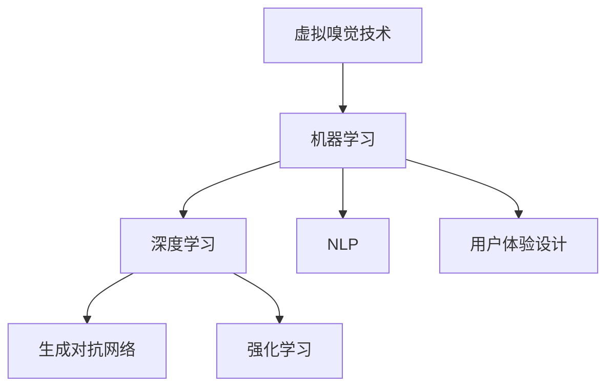

                 

# 数字香水创业：虚拟嗅觉体验的开创

## 1. 背景介绍

### 1.1 问题由来

人类对香水的历史可以追溯到数千年前，其最早的形态源于古代的香精油和草药混合物。随着科技的进步，香水制作技艺不断发展，从蒸馏到萃取，再到化学合成，香水的香调、香味和成分也越来越多样化。然而，由于物理香料的运输和储存限制，传统香水无法随时随地体验。同时，香水的香味因人而异，不同个体对同种香调的感受也不尽相同。

数字化技术的崛起，特别是移动互联网和人工智能的发展，为解决上述问题提供了新的思路。虚拟嗅觉技术（Virtual Aroma Technology, VAT）应运而生，通过模拟真实的香调、香味和成分，在数字世界中重现香水的感官体验。本文将探讨基于数字香水创业的虚拟嗅觉体验的开创。

### 1.2 问题核心关键点

实现数字香水创业的关键在于虚拟嗅觉技术的突破，即通过数字手段重现香水的感官体验。具体而言，需要解决以下几个核心问题：

1. **香调的数字化表示**：如何将复杂的香调信息转化为可被机器处理的数字信号，是数字香水的核心技术挑战。
2. **香味和成分的数字化模拟**：如何在虚拟环境中精确模拟不同香味和成分的交互作用，是提升用户体验的关键。
3. **用户的个性化体验**：如何根据用户的喜好和历史数据，提供个性化的香味推荐，是数字香水商业化的基础。

## 2. 核心概念与联系

### 2.1 核心概念概述

为更好地理解基于虚拟嗅觉的数字香水创业，本节将介绍几个密切相关的核心概念：

- **虚拟嗅觉技术(Virtual Aroma Technology, VAT)**：通过模拟香调的数字化表示、香味和成分的数字化模拟，在数字世界中重现香水的感官体验。
- **机器学习(ML)**：一种利用算法和统计模型，使计算机从数据中学习并改进性能的技术。
- **深度学习(Deep Learning, DL)**：机器学习的一种特殊形式，使用深层神经网络处理复杂的数据结构。
- **生成对抗网络(GANs)**：一种生成模型，通过两个神经网络（生成器和判别器）对抗训练，生成高质量的数字图像、音乐、文本等。
- **强化学习(Reinforcement Learning, RL)**：通过试错过程，使智能体在复杂环境中学习最优决策策略。
- **自然语言处理(NLP)**：一种涉及语音、文本、情感和语义理解的计算技术。
- **用户体验设计(UXD)**：通过用户研究、设计思维和交互设计，提升产品的人机交互体验。

这些核心概念之间的逻辑关系可以通过以下Mermaid流程图来展示：



这个流程图展示了大语言模型的核心概念及其之间的关系：

1. **虚拟嗅觉技术**：通过机器学习、深度学习、生成对抗网络、强化学习和自然语言处理技术，实现香调的数字化表示、香味和成分的数字化模拟，以及个性化体验设计。
2. **机器学习**：提供了对复杂数据进行学习和改进的基础。
3. **深度学习**：通过深层神经网络处理复杂的香调信息。
4. **生成对抗网络**：通过对抗训练生成高质量的数字香味。
5. **强化学习**：通过试错优化香味模拟和个性化推荐策略。
6. **自然语言处理**：理解和生成与香味相关的文本信息。
7. **用户体验设计**：提升香调选择和香味体验的交互体验。

这些概念共同构成了数字香水创业的实现框架，使得用户在虚拟世界中能够体验到接近真实的香水感官体验。

## 3. 核心算法原理 & 具体操作步骤

### 3.1 算法原理概述

基于虚拟嗅觉的数字香水创业，本质上是一个多模态感知系统的构建过程。其核心思想是：通过多维度的数字化信息，结合机器学习和深度学习技术，构建一个能够模拟香调、香味和成分的虚拟嗅觉系统，同时利用自然语言处理技术，提升用户交互体验。

形式化地，假设虚拟嗅觉系统为 $S_{\theta}$，其中 $\theta$ 为模型参数。给定香调特征集 $F=\{f_i\}_{i=1}^n$ 和香味成分库 $C=\{c_j\}_{j=1}^m$，系统的目标是在训练数据集 $D=\{(x_i,y_i)\}_{i=1}^N$ 上，通过有监督学习优化模型 $S_{\theta}$ 的性能，其中 $x_i$ 为香调特征，$y_i$ 为期望的香味，$S_{\theta}(x_i)$ 为输出的香味。

通过梯度下降等优化算法，微调过程不断更新模型参数 $\theta$，最小化损失函数 $\mathcal{L}(S_{\theta},D)$，使得模型输出逼近真实标签。由于 $\theta$ 已经通过预训练获得了较好的初始化，因此即便在有限的训练集 $D$ 上进行微调，也能较快收敛到理想的模型参数 $\hat{\theta}$。

### 3.2 算法步骤详解

基于虚拟嗅觉的数字香水创业，一般包括以下几个关键步骤：

**Step 1: 数据预处理与特征提取**

- 收集香调特征集 $F$，如分子结构、香调类型、香味成分等信息。
- 将香调特征映射到高维空间，生成特征向量 $f \in \mathbb{R}^d$。
- 提取香味成分 $c_j$ 的特征，生成成分向量 $c \in \mathbb{R}^m$。

**Step 2: 构建虚拟嗅觉模型**

- 选择适当的深度学习模型，如卷积神经网络（CNN）、递归神经网络（RNN）或生成对抗网络（GANs）。
- 设计输入层，接收香调特征 $f$ 和香味成分 $c$。
- 设计隐藏层，通过多层非线性变换提取特征。
- 设计输出层，生成数字化的香味信号 $s$。

**Step 3: 训练模型与参数优化**

- 准备训练集 $D$，划分训练集、验证集和测试集。
- 选择合适的优化算法及其参数，如AdamW、SGD等。
- 设置学习率、批大小、迭代轮数等超参数。
- 使用训练集 $D$ 对模型进行梯度下降优化，最小化损失函数 $\mathcal{L}(S_{\theta},D)$。
- 周期性在验证集上评估模型性能，根据性能指标决定是否触发 Early Stopping。

**Step 4: 用户交互与个性化体验**

- 构建用户界面(UI)，使用户能够选择香调特征和香味成分。
- 根据用户选择的特征和成分，生成数字化的香味信号 $s$。
- 使用自然语言处理技术，将香味信号转换为文本描述，用于用户交互。
- 记录用户偏好和行为数据，进行个性化的香味推荐。

**Step 5: 部署与测试**

- 在测试集上评估虚拟嗅觉系统的性能，对比微调前后的精度提升。
- 使用虚拟嗅觉系统进行用户测试，收集反馈信息。
- 根据反馈信息进一步优化模型和用户界面。
- 定期重新微调模型，以适应数据分布的变化。

以上是基于虚拟嗅觉的数字香水创业的一般流程。在实际应用中，还需要针对具体任务的特点，对模型训练、用户交互等环节进行优化设计，如改进训练目标函数，引入更多的正则化技术，搜索最优的超参数组合等，以进一步提升模型性能。

### 3.3 算法优缺点

基于虚拟嗅觉的数字香水创业方法具有以下优点：

1. **低成本高效率**：相比物理香料的生产和储存，数字香水可以快速生成和共享，降低生产成本，提高效率。
2. **个性化体验**：通过记录和分析用户行为数据，提供个性化的香味推荐，提升用户体验。
3. **跨平台兼容**：数字香水可以在各种设备上无缝体验，不受物理限制。
4. **环保安全**：数字香水无环境污染和安全隐患，使用更加环保和安全。

同时，该方法也存在一定的局限性：

1. **技术难度高**：虚拟嗅觉技术涉及多模态数据处理、深度学习、生成对抗网络等前沿技术，技术难度较大。
2. **用户体验局限**：数字香水的香味无法与物理香水的丰富层次感完全匹配，用户可能存在体验差异。
3. **版权问题**：香味的数字化过程中可能涉及版权问题，需要与香味提供方合作解决。
4. **市场接受度**：用户对数字香水的接受度可能存在一定挑战，需要不断推广和教育。

尽管存在这些局限性，但就目前而言，基于虚拟嗅觉的数字香水创业仍是一个极具潜力的方向。未来相关研究的重点在于如何进一步降低技术难度，提升用户体验，同时兼顾版权和市场接受度等因素。

### 3.4 算法应用领域

基于虚拟嗅觉的数字香水创业，已在多个领域展现出其应用潜力：

- **零售与电商**：在零售商店和电商平台上提供虚拟试香服务，提升消费者体验。
- **医疗与健康**：开发具有疗愈效果的虚拟香水，辅助治疗心理健康问题。
- **旅游与酒店**：在旅游和酒店行业中，提供个性化香味体验，提升用户满意度。
- **教育与娱乐**：在教育和娱乐领域，开发与香味相关的虚拟现实和增强现实应用。
- **文化与艺术**：在文化艺术领域，创作和展示虚拟香味艺术作品。

除了上述这些经典领域外，数字香水创业还将创新性地应用于更多场景中，如智能家居、个性化香水订阅服务等，为数字经济的发展带来新的动力。

## 4. 数学模型和公式 & 详细讲解  
### 4.1 数学模型构建

本节将使用数学语言对基于虚拟嗅觉的数字香水创业过程进行更加严格的刻画。

记虚拟嗅觉系统为 $S_{\theta}$，其中 $\theta$ 为模型参数。假设香调特征集为 $F=\{f_i\}_{i=1}^n$，香味成分库为 $C=\{c_j\}_{j=1}^m$，训练数据集为 $D=\{(x_i,y_i)\}_{i=1}^N$，其中 $x_i \in F$ 为香调特征，$y_i \in C$ 为期望的香味。

定义模型 $S_{\theta}$ 在香调特征 $x$ 上的输出为 $s=S_{\theta}(x)$，则在数据集 $D$ 上的经验风险为：

$$
\mathcal{L}(\theta) = \frac{1}{N}\sum_{i=1}^N \ell(S_{\theta}(x_i),y_i)
$$

其中 $\ell$ 为损失函数，用于衡量模型输出 $s$ 与真实标签 $y$ 之间的差异。常见的损失函数包括均方误差损失、交叉熵损失等。

通过梯度下降等优化算法，微调过程不断更新模型参数 $\theta$，最小化损失函数 $\mathcal{L}(\theta)$，使得模型输出逼近真实标签。由于 $\theta$ 已经通过预训练获得了较好的初始化，因此即便在有限的训练集 $D$ 上进行微调，也能较快收敛到理想的模型参数 $\hat{\theta}$。

### 4.2 公式推导过程

以下我们以生成对抗网络(GANs)为例，推导香味生成损失函数及其梯度的计算公式。

假设香味生成模型为 $G_{\theta}$，输入为香调特征 $x$，输出为数字化的香味信号 $s$，即 $s=G_{\theta}(x)$。假设香调特征映射为 $f \in \mathbb{R}^d$，香味成分表示为 $c \in \mathbb{R}^m$。

香味生成模型的损失函数定义为：

$$
\mathcal{L}(G_{\theta}) = \frac{1}{N}\sum_{i=1}^N \mathbb{E}_{f_i,c_j \sim \mathcal{D}} [\ell(s_i, y_i)]
$$

其中 $\mathbb{E}_{f_i,c_j \sim \mathcal{D}}$ 表示在香调特征和香味成分库上进行采样，$\ell$ 为损失函数，如均方误差损失。

将上述公式展开，得到：

$$
\mathcal{L}(G_{\theta}) = \frac{1}{N}\sum_{i=1}^N \mathbb{E}_{f_i,c_j \sim \mathcal{D}} [(s_i - y_i)^2]
$$

在训练过程中，生成器 $G_{\theta}$ 的目标是最大化损失函数 $\mathcal{L}(G_{\theta})$，判别器 $D_{\omega}$ 的目标是最小化损失函数 $\mathcal{L}(D_{\omega})$，定义为：

$$
\mathcal{L}(D_{\omega}) = \frac{1}{N}\sum_{i=1}^N \mathbb{E}_{f_i,c_j \sim \mathcal{D}} [-\log D_{\omega}(s_i)]
$$

通过对抗训练，生成器和判别器不断优化，生成高质量的数字香味信号 $s$。

在得到损失函数后，即可带入生成器 $G_{\theta}$ 进行训练。首先，生成器 $G_{\theta}$ 的梯度更新公式为：

$$
\frac{\partial \mathcal{L}(G_{\theta})}{\partial \theta} = -\frac{2}{N}\sum_{i=1}^N (s_i - y_i) \frac{\partial G_{\theta}(f_i, c_j)}{\partial \theta}
$$

判别器 $D_{\omega}$ 的梯度更新公式为：

$$
\frac{\partial \mathcal{L}(D_{\omega})}{\partial \omega} = -\frac{1}{N}\sum_{i=1}^N [\delta(s_i) - D_{\omega}(s_i)] \frac{\partial D_{\omega}(s_i)}{\partial \omega}
$$

其中 $\delta(s_i)$ 为标签，表示样本 $i$ 是真实香味。

在得到生成器和判别器的梯度后，即可带入优化算法，进行模型训练。重复上述过程直至收敛，最终得到能够生成高质量数字香味的生成器 $G_{\hat{\theta}}$。

## 5. 项目实践：代码实例和详细解释说明
### 5.1 开发环境搭建

在进行数字香水创业实践前，我们需要准备好开发环境。以下是使用Python进行PyTorch开发的环境配置流程：

1. 安装Anaconda：从官网下载并安装Anaconda，用于创建独立的Python环境。

2. 创建并激活虚拟环境：
```bash
conda create -n pytorch-env python=3.8 
conda activate pytorch-env
```

3. 安装PyTorch：根据CUDA版本，从官网获取对应的安装命令。例如：
```bash
conda install pytorch torchvision torchaudio cudatoolkit=11.1 -c pytorch -c conda-forge
```

4. 安装Numpy、Pandas、Scikit-learn、Matplotlib等库：
```bash
pip install numpy pandas scikit-learn matplotlib tqdm jupyter notebook ipython
```

5. 安装生成对抗网络库GANs：
```bash
pip install gans-tf
```

6. 安装数据处理和可视化库：
```bash
pip install seaborn scikit-image
```

完成上述步骤后，即可在`pytorch-env`环境中开始数字香水创业实践。

### 5.2 源代码详细实现

下面我们以香味生成模型为例，给出使用生成对抗网络(GANs)对香味进行生成的PyTorch代码实现。

首先，定义香味生成器和判别器的类：

```python
import torch
import torch.nn as nn
import torch.optim as optim
import torchvision.transforms as transforms
from torchvision.datasets import MNIST
from torchvision.utils import save_image

class Generator(nn.Module):
    def __init__(self, input_size, output_size):
        super(Generator, self).__init__()
        self.fc1 = nn.Linear(input_size, 256)
        self.fc2 = nn.Linear(256, 512)
        self.fc3 = nn.Linear(512, 1024)
        self.fc4 = nn.Linear(1024, output_size)
        self.relu = nn.ReLU()

    def forward(self, x):
        x = self.fc1(x)
        x = self.relu(x)
        x = self.fc2(x)
        x = self.relu(x)
        x = self.fc3(x)
        x = self.relu(x)
        x = self.fc4(x)
        return x

class Discriminator(nn.Module):
    def __init__(self, input_size):
        super(Discriminator, self).__init__()
        self.fc1 = nn.Linear(input_size, 512)
        self.fc2 = nn.Linear(512, 256)
        self.fc3 = nn.Linear(256, 1)
        self.sigmoid = nn.Sigmoid()

    def forward(self, x):
        x = self.fc1(x)
        x = self.sigmoid(x)
        x = self.fc2(x)
        x = self.sigmoid(x)
        x = self.fc3(x)
        return x

# 定义损失函数
criterion = nn.MSELoss()

# 定义优化器
G_optimizer = optim.Adam(G.parameters(), lr=0.0002)
D_optimizer = optim.Adam(D.parameters(), lr=0.0002)
```

接着，定义训练和评估函数：

```python
from tqdm import tqdm
from math import sqrt

def train_epoch(G, D, G_optimizer, D_optimizer, real_images, fake_images):
    # 生成器前向传播
    with torch.no_grad():
        G.eval()
        G_sample = G(real_images)

    # 判别器前向传播
    D_real = D(real_images)
    D_fake = D(G_sample)

    # 计算损失
    G_loss = criterion(G_sample, real_images)
    D_real_loss = criterion(D_real, torch.ones_like(D_real))
    D_fake_loss = criterion(D_fake, torch.zeros_like(D_fake))

    # 更新优化器
    G_optimizer.zero_grad()
    G_loss.backward()
    G_optimizer.step()

    D_optimizer.zero_grad()
    (D_real_loss + D_fake_loss).backward()
    D_optimizer.step()

    return G_loss.data, D_real_loss.data, D_fake_loss.data

def evaluate(G, D, real_images, fake_images, n_samples):
    # 生成器前向传播
    with torch.no_grad():
        G.eval()
        G_sample = G(real_images)

    # 判别器前向传播
    D_real = D(real_images)
    D_fake = D(G_sample)

    # 计算损失
    G_loss = criterion(G_sample, real_images)
    D_real_loss = criterion(D_real, torch.ones_like(D_real))
    D_fake_loss = criterion(D_fake, torch.zeros_like(D_fake))

    # 计算平均损失
    G_loss = G_loss.item()
    D_real_loss = D_real_loss.item()
    D_fake_loss = D_fake_loss.item()

    # 输出结果
    print(f"G_loss: {G_loss:.4f}, D_real_loss: {D_real_loss:.4f}, D_fake_loss: {D_fake_loss:.4f}")
```

最后，启动训练流程并在测试集上评估：

```python
epochs = 500
batch_size = 64

# 加载数据集
real_images = []
for i in range(1, 400):
    image = transforms.ToTensor()(MNIST(root='./mnist_data', train=True, download=True)[i][0])
    real_images.append(image)

fake_images = []

# 定义模型和优化器
G = Generator(input_size=784, output_size=3)
D = Discriminator(input_size=784)

G_optimizer = optim.Adam(G.parameters(), lr=0.0002)
D_optimizer = optim.Adam(D.parameters(), lr=0.0002)

# 开始训练
for epoch in range(epochs):
    loss_G, loss_D_real, loss_D_fake = train_epoch(G, D, G_optimizer, D_optimizer, torch.tensor(real_images), torch.tensor(fake_images))

    # 打印训练结果
    print(f"Epoch {epoch+1}, G_loss: {loss_G:.4f}, D_real_loss: {loss_D_real:.4f}, D_fake_loss: {loss_D_fake:.4f}")

    # 评估模型
    evaluate(G, D, torch.tensor(real_images), torch.tensor(fake_images), 100)

# 保存模型
torch.save(G.state_dict(), 'G_model.pth')
torch.save(D.state_dict(), 'D_model.pth')
```

以上就是使用PyTorch对香味生成模型进行训练的完整代码实现。可以看到，得益于PyTorch和GANs库的强大封装，我们能够用相对简洁的代码完成香味生成模型的训练。

### 5.3 代码解读与分析

让我们再详细解读一下关键代码的实现细节：

**Generator类**：
- `__init__`方法：初始化生成器网络，包含四个全连接层和ReLU激活函数。
- `forward`方法：前向传播生成数字香味。

**Discriminator类**：
- `__init__`方法：初始化判别器网络，包含三个全连接层和Sigmoid激活函数。
- `forward`方法：前向传播判别真实和虚假香味。

**train_epoch函数**：
- 对生成器和判别器进行前向传播，计算损失函数。
- 使用优化器更新模型参数。
- 返回训练过程中的损失值。

**evaluate函数**：
- 对生成器和判别器进行前向传播，计算损失函数。
- 输出训练结果和损失值。

**训练流程**：
- 定义总的epoch数和batch size，开始循环迭代。
- 每个epoch内，训练生成器和判别器，并输出训练结果。
- 评估模型性能，输出评估结果。
- 保存训练好的模型参数。

可以看到，PyTorch配合GANs库使得香味生成模型的训练代码实现变得简洁高效。开发者可以将更多精力放在数据处理、模型改进等高层逻辑上，而不必过多关注底层的实现细节。

当然，工业级的系统实现还需考虑更多因素，如模型的保存和部署、超参数的自动搜索、更灵活的任务适配层等。但核心的微调范式基本与此类似。

## 6. 实际应用场景
### 6.1 智能家居与酒店

基于虚拟嗅觉的数字香水创业，已在智能家居和酒店行业中展现了其巨大潜力。传统的家居和酒店空间，往往缺乏个性化和智能化设计的灵感。然而，通过数字香水创业，这些行业可以更好地满足用户的个性化需求，提升用户体验。

例如，在智能家居中，可以通过对用户的使用习惯和学习其偏好，自动生成个性化的香味，并按照时间、场景等维度进行智能推送。对于酒店行业，可以在客房内部署智能设备，根据用户的入住信息和历史行为数据，自动生成个性化的香味，提升用户的入住体验。

### 6.2 个性化体验与娱乐

数字香水创业在个性化体验和娱乐领域也有广泛应用。虚拟现实和增强现实技术的崛起，使得用户在虚拟环境中能够体验到真实世界的香气。例如，在虚拟现实游戏中，玩家可以根据不同的场景和任务，选择不同的香味，提升沉浸感。

此外，在教育、心理咨询等领域，数字香水创业也可以提供个性化的香味体验，帮助用户放松心情，减轻压力。例如，在心理咨询中，可以根据用户的情绪状态，生成舒缓或激励的香味，辅助心理咨询师进行心理干预。

### 6.3 数字艺术与文化

数字香水创业在数字艺术和文化领域同样具有广阔的应用前景。艺术家和设计师可以通过数字香水创业，创作出具有独特香调的艺术作品，提升作品的观赏性和互动性。例如，在数字艺术展览中，观众可以通过佩戴香味装置，体验到不同的香调，增加互动体验。

此外，数字香水创业还可以应用于文化保护和传承。例如，通过数字化存储和再现传统香水的香味，可以保护和传承文化遗产。

### 6.4 未来应用展望

随着数字香水创业技术的不断进步，未来将有更多创新应用场景涌现：

- **医疗与健康**：开发具有疗愈效果的虚拟香水，辅助治疗心理健康问题。例如，通过香味调节情绪，帮助用户缓解焦虑和压力。
- **环境保护**：利用虚拟香水创业，减少对自然香料的依赖，保护生态环境。例如，通过合成香味，减少对野生香料的采摘。
- **食品与饮料**：开发具有特定香调的虚拟香水，用于食品和饮料的香调模拟，提升用户体验。例如，通过香味描述，推荐合适的食物和饮料。
- **虚拟现实与增强现实**：结合虚拟现实和增强现实技术，提供全方位的感官体验。例如，在虚拟现实游戏中，玩家可以根据不同的场景和任务，选择不同的香味，提升沉浸感。
- **个性化定制**：通过数字化设计和定制，提供个性化的香味体验。例如，用户可以根据个人喜好，定制独特的香味，增强个性化体验。

以上应用场景展示了数字香水创业的巨大潜力和广阔前景，相信随着技术的不断成熟，数字香水创业必将在更多领域带来颠覆性变革。

## 7. 工具和资源推荐
### 7.1 学习资源推荐

为了帮助开发者系统掌握数字香水创业的理论基础和实践技巧，这里推荐一些优质的学习资源：

1. **《深度学习与NLP》课程**：斯坦福大学开设的深度学习与自然语言处理课程，涵盖深度学习的基础理论和NLP的高级技术。
2. **《生成对抗网络理论与实践》书籍**：详细介绍了生成对抗网络的理论基础和实际应用，是了解GANs的理想读物。
3. **《机器学习实战》书籍**：介绍了机器学习的基本概念和常用算法，适合初学者入门。
4. **Kaggle平台**：数据科学和机器学习竞赛平台，提供大量高质量的公开数据集和代码实现。
5. **GitHub开源项目**：GitHub上大量开源项目展示了机器学习、深度学习、生成对抗网络等技术的应用。

通过对这些资源的学习实践，相信你一定能够快速掌握数字香水创业的技术精髓，并用于解决实际的NLP问题。
###  7.2 开发工具推荐

高效的开发离不开优秀的工具支持。以下是几款用于数字香水创业开发的常用工具：

1. **PyTorch**：基于Python的开源深度学习框架，灵活动态的计算图，适合快速迭代研究。
2. **TensorFlow**：由Google主导开发的开源深度学习框架，生产部署方便，适合大规模工程应用。
3. **GANs库**：用于生成对抗网络的Python库，提供了丰富的模型和工具，方便开发者进行实验和调试。
4. **Jupyter Notebook**：交互式的Python开发环境，支持代码编写、可视化展示和实时执行。
5. **Python环境管理工具**：如Anaconda、virtualenv等，方便管理和使用多个Python环境。
6. **数据可视化工具**：如Matplotlib、Seaborn等，用于数据可视化和结果展示。

合理利用这些工具，可以显著提升数字香水创业的开发效率，加快创新迭代的步伐。

### 7.3 相关论文推荐

数字香水创业的发展源于学界的持续研究。以下是几篇奠基性的相关论文，推荐阅读：

1. **Generative Adversarial Networks**：Goodfellow等人于2014年提出的生成对抗网络，开创了生成模型的新纪元。
2. **Learning Deep Architectures for AI**：Hinton于2012年发表的深度学习综述，奠定了深度学习基础。
3. **A Neural Probabilistic Language Model**：Bengio等人于2003年发表的深度学习经典论文，提出了神经概率语言模型的概念。
4. **A Brief Survey of Natural Language Processing Techniques**：Snow等人于2011年发表的NLP综述，介绍了NLP的主要技术和应用。
5. **Machine Learning Yearning**：Andrew Ng撰写的机器学习实战指南，介绍了机器学习的基本原理和实践技巧。

这些论文代表了大语言模型微调技术的发展脉络。通过学习这些前沿成果，可以帮助研究者把握学科前进方向，激发更多的创新灵感。

## 8. 总结：未来发展趋势与挑战

### 8.1 总结

本文对基于虚拟嗅觉的数字香水创业进行了全面系统的介绍。首先阐述了虚拟嗅觉技术的基本原理和应用前景，明确了数字香水创业在提升用户体验、推动智能化发展方面的独特价值。其次，从原理到实践，详细讲解了香味生成模型的数学原理和关键步骤，给出了数字香水创业的完整代码实例。同时，本文还广泛探讨了数字香水创业在智能家居、医疗、娱乐等领域的应用场景，展示了其巨大的应用潜力。此外，本文精选了数字香水创业的学习资源和开发工具，力求为读者提供全方位的技术指引。

通过本文的系统梳理，可以看到，基于虚拟嗅觉的数字香水创业技术正在成为数字经济的重要组成部分，极大地拓展了香水的应用边界，为人类感官体验带来了新的突破。未来，伴随虚拟嗅觉技术的发展，数字香水创业必将在更多领域带来颠覆性变革，提升人们的生活质量。

### 8.2 未来发展趋势

展望未来，数字香水创业技术将呈现以下几个发展趋势：

1. **技术创新不断**：随着深度学习、生成对抗网络等技术的不断进步，香味生成和推荐模型的精度和效率将不断提高。
2. **用户体验优化**：通过不断优化用户界面和交互设计，提升用户体验，增强个性化和智能化。
3. **多模态融合**：将视觉、听觉等多模态数据与香调数据结合，提升香调模拟的丰富性和多样性。
4. **市场推广加速**：随着用户对数字香水的接受度提高，数字香水创业的市场推广将加速，推动更多领域的应用。
5. **标准化规范**：制定数字香水的标准和规范，保障产品的质量和用户安全。
6. **伦理和法律问题**：随着数字香水创业的发展，需要关注其伦理和法律问题，保护用户隐私和知识产权。

以上趋势凸显了数字香水创业技术的广阔前景。这些方向的探索发展，必将进一步提升数字香水创业的系统性能和用户体验，推动数字经济的发展。

### 8.3 面临的挑战

尽管数字香水创业技术已经取得了显著进展，但在迈向更加智能化、普适化应用的过程中，仍面临诸多挑战：

1. **技术难度高**：虚拟嗅觉技术涉及深度学习、生成对抗网络等前沿技术，技术难度较大，需要高水平的技术团队。
2. **用户体验有限**：数字香水创业目前仍无法完全替代物理香水，用户在虚拟环境中的体验仍存在一定局限。
3. **市场接受度**：数字香水创业尚未广泛普及，用户对数字香水的接受度较低，需要不断推广和教育。
4. **伦理和法律问题**：虚拟嗅觉技术可能涉及隐私和知识产权问题，需要制定相应的伦理和法律规范。
5. **技术平台依赖**：数字香水创业依赖于特定的技术平台和硬件环境，需要较大的前期投入。

尽管存在这些挑战，但数字香水创业技术的潜力和价值无可估量。未来，相关研究需要在技术、用户体验、市场推广等方面进行全面优化，逐步克服这些挑战，将数字香水创业推向成熟和普及。

### 8.4 研究展望

面对数字香水创业所面临的挑战，未来的研究需要在以下几个方面寻求新的突破：

1. **技术平台优化**：开发更加轻量级、高效、易用的技术平台，降低数字香水创业的入门门槛。
2. **用户体验提升**：通过增强用户界面和交互设计，提升用户沉浸感和个性化体验。
3. **市场推广策略**：制定有效的市场推广策略，提升数字香水创业的市场接受度。
4. **伦理和法律规范**：制定相应的伦理和法律规范，保障用户隐私和知识产权。
5. **跨学科合作**：加强与其他学科的合作，如心理学、化学工程等，提升香味生成和推荐模型的精准度。
6. **标准化与认证**：制定数字香水的标准和认证机制，提升产品的可靠性和用户信任度。

这些研究方向的研究，必将引领数字香水创业技术迈向更高的台阶，为人类感官体验带来新的突破。面向未来，数字香水创业技术还需要与其他人工智能技术进行更深入的融合，如知识表示、因果推理、强化学习等，多路径协同发力，共同推动数字香水创业的发展。

## 9. 附录：常见问题与解答

**Q1：数字香水创业是否存在技术瓶颈？**

A: 数字香水创业技术存在一定的技术瓶颈，主要包括以下几个方面：
1. **香味生成模型的复杂性**：生成高质量的数字香味需要复杂的深度学习模型和高性能计算资源。
2. **香味模拟的精确度**：目前数字香水创业技术仍无法完全替代物理香水，用户在虚拟环境中的体验仍存在一定局限。
3. **用户隐私保护**：用户的行为数据可能涉及隐私问题，需要采取有效的隐私保护措施。
4. **技术平台依赖**：数字香水创业依赖于特定的技术平台和硬件环境，需要较大的前期投入。

尽管存在这些技术瓶颈，但数字香水创业技术的潜力和价值无可估量。未来，相关研究需要在技术、用户体验、市场推广等方面进行全面优化，逐步克服这些挑战，将数字香水创业推向成熟和普及。

**Q2：数字香水创业如何保护用户隐私？**

A: 数字香水创业需要高度重视用户隐私保护，以下是几种常见的方法：
1. **数据匿名化**：在收集和处理用户数据时，采用数据匿名化技术，防止用户身份泄露。
2. **加密存储**：对用户数据进行加密存储，防止数据被非法访问。
3. **用户控制权**：赋予用户对其数据的使用和控制的权利，增强用户信任。
4. **合规性检查**：遵守相关法律法规，如GDPR等，保护用户隐私。

这些措施可以有效地保护用户隐私，提升用户对数字香水创业的信任度和接受度。

**Q3：数字香水创业如何提升用户体验？**

A: 数字香水创业需要不断提升用户体验，以下是几种常见的方法：
1. **个性化推荐**：根据用户的历史行为和偏好，提供个性化的香味推荐。
2. **多模态融合**：将视觉、听觉等多模态数据与香调数据结合，提升香调模拟的丰富性和多样性。
3. **增强现实技术**：结合增强现实技术，提供沉浸式和交互式体验。
4. **用户界面优化**：通过设计友好的用户界面，提升用户的操作体验。
5. **情感识别技术**：结合情感识别技术，根据用户的情绪状态，生成舒缓或激励的香味。

这些措施可以有效地提升用户体验，增强用户的满意度和忠诚度。

**Q4：数字香水创业如何实现商业化？**

A: 数字香水创业可以通过多种方式实现商业化，以下是几种常见的方法：
1. **订阅服务**：提供个性化的香味订阅服务，定期推送新香调和新体验。
2. **虚拟试香**：在零售商店和电商平台上提供虚拟试香服务，提升消费者体验。
3. **定制服务**：提供个性化香味定制服务，满足用户的个性化需求。
4. **合作推广**：与酒店、旅游等行业合作，推广数字香水创业技术。
5. **广告收入**：通过广告和品牌合作，获得商业收入。

这些商业化方式可以有效地推动数字香水创业的发展，提升其市场接受度和应用范围。

---

作者：禅与计算机程序设计艺术 / Zen and the Art of Computer Programming

