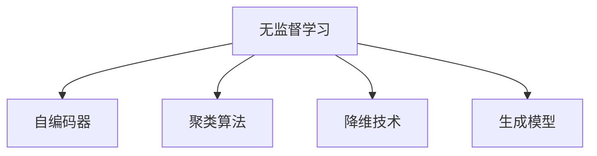

                 

# 数据丰富但标注贵，无监督学习是软件2.0的未来？

## 1. 背景介绍

### 1.1 问题由来

在当前的数字时代，数据如同石油般宝贵，它们不仅是AI技术发展的基石，更是众多商业决策的重要参考。然而，数据的获取和标注成本极高，特别是对于自然语言处理(NLP)等任务，高质量标注数据更是稀缺资源。高昂的标注成本直接限制了大数据和AI技术在各个领域的应用，尤其在对标注精度要求严格的领域，如医疗、法律、金融等，标注数据的获取成为瓶頸。

在这样的背景下，如何降低标注成本，提高数据利用效率，成为AI领域的一大挑战。近年来，无监督学习作为一种无需标注数据、仅依靠数据自身特征进行模型训练的方法，因其高效、灵活、自适应的特点，正在引起广泛关注。无监督学习不仅能够在大规模数据集上训练高质量的模型，还能在未知数据分布上保持良好的泛化性能，有望成为软件2.0时代的重要技术范式。

### 1.2 问题核心关键点

无监督学习通过利用数据中隐藏的统计特性，自动发现数据的内在结构，无需标注数据即可进行模型训练。其核心思想在于利用数据的共现关系、密度分布等统计特性，实现对数据的自动归纳和表示学习。无监督学习通常包括以下几种关键技术：

- 自编码器(Autonomous Encoder): 通过将输入数据压缩到低维空间，再从低维空间恢复原数据，学习到数据的隐含表示。
- 聚类算法(Clustering): 将相似的数据点聚为一类，揭示数据的分布特征。
- 降维技术(Dimensionality Reduction): 通过线性或非线性变换，将高维数据映射到低维空间，减少数据的维度和计算复杂度。
- 生成模型(Generative Models): 通过建立数据生成模型，模拟数据分布，生成新的数据样本。

这些技术不仅可以用于数据特征提取和模型训练，还能应用于数据异常检测、主题建模、用户行为分析等诸多场景。但同时，无监督学习也存在一定的局限性，如模型可解释性较差、对数据质量依赖度高、适用范围有限等问题，需在实践中灵活应用。

### 1.3 问题研究意义

研究和应用无监督学习，对于降低数据标注成本，提高数据利用效率，提升AI技术在实际场景中的落地应用，具有重要意义：

1. 降低数据标注成本。无监督学习通过自动学习数据特征，无需标注数据，可以大大降低标注成本，使得AI技术能够更容易地应用于各种领域。
2. 提高数据利用效率。大数据的获取和标注成本极高，无监督学习能够充分利用大数据集，挖掘数据的潜在价值，避免数据浪费。
3. 提升模型泛化能力。无监督学习通过自动发现数据的内在结构，可以增强模型的泛化性能，使其在不同数据分布上表现稳定。
4. 推动AI技术的普及应用。无监督学习降低了AI技术的应用门槛，使得更多人能够更容易地使用AI技术进行数据分析和决策支持。
5. 为未知数据分布提供参考。无监督学习在未标注数据上的泛化能力，可以用于探索未知数据分布，为数据生成和分析提供新的视角。

基于以上分析，无监督学习作为数据丰富但标注贵时代的必然选择，有望成为软件2.0的重要技术范式，引领AI技术向更高效、更普及的方向发展。

## 2. 核心概念与联系

### 2.1 核心概念概述

为更好地理解无监督学习的核心概念，本节将介绍几个密切相关的核心概念：

- 无监督学习(Unsupervised Learning)：通过数据自身特征进行模型训练，无需标注数据，学习数据的潜在结构和模式。
- 自编码器(Autonomous Encoder)：通过将数据压缩到低维空间再恢复，学习数据的隐含表示。
- 聚类算法(Clustering)：将相似的数据点聚为一类，揭示数据的分布特征。
- 降维技术(Dimensionality Reduction)：将高维数据映射到低维空间，减少数据的维度和计算复杂度。
- 生成模型(Generative Models)：通过建立数据生成模型，模拟数据分布，生成新的数据样本。

这些核心概念之间的逻辑关系可以通过以下Mermaid流程图来展示：



这个流程图展示的无监督学习的核心概念及其之间的关系：

1. 无监督学习是利用数据自身特征进行模型训练的核心范式。
2. 自编码器、聚类算法、降维技术和生成模型是无监督学习中常用的关键技术。
3. 这些技术可以用于数据特征提取、模型训练、数据分布探索等诸多场景。

## 3. 核心算法原理 & 具体操作步骤
### 3.1 算法原理概述

无监督学习的核心思想是通过数据自身的统计特性，自动发现数据的内在结构和模式，无需标注数据即可进行模型训练。其核心算法主要包括自编码器、聚类算法、降维技术和生成模型。

### 3.2 算法步骤详解

无监督学习算法主要包括以下几个关键步骤：

**Step 1: 数据准备**
- 收集和预处理数据集，确保数据质量和完整性。
- 对数据进行归一化、标准化等预处理，提高数据处理效率。
- 对异常值和噪声进行清洗，确保数据的干净度。

**Step 2: 特征提取**
- 通过自编码器、降维技术等方法，提取数据的隐含特征。
- 对提取的特征进行降维、去噪等处理，提高特征质量。
- 根据任务需求，选择适当的特征空间和表示方法。

**Step 3: 模型训练**
- 选择适当的无监督学习模型，如自编码器、聚类算法、生成模型等。
- 设置模型的超参数，如学习率、正则化强度等。
- 利用训练数据对模型进行迭代训练，不断优化模型参数。
- 通过交叉验证等技术，评估模型的泛化性能。

**Step 4: 模型评估**
- 利用测试数据集对模型进行评估，计算模型指标如准确率、召回率、F1值等。
- 通过可视化工具展示模型的学习结果，如特征分布图、聚类图等。
- 对模型的性能进行综合分析，评估其适用性和可靠性。

**Step 5: 应用部署**
- 将训练好的模型应用于实际任务，进行数据分析和决策支持。
- 对模型进行优化和调优，提升其在实际应用中的性能。
- 集成模型到生产系统中，实现数据驱动的自动化决策。

以上是无监督学习的典型流程，适用于多种应用场景。在实际应用中，还需要根据具体任务和数据特点，灵活调整步骤和参数。

### 3.3 算法优缺点

无监督学习的优点在于：
1. 高效灵活。无监督学习无需标注数据，能够在大规模数据集上高效训练高质量的模型。
2. 自适应强。无监督学习能够自动发现数据的内在结构，适应数据分布的变化。
3. 泛化性好。无监督学习在未知数据分布上表现稳定，具有良好的泛化性能。

同时，无监督学习也存在一定的局限性：
1. 可解释性差。无监督学习模型的决策过程难以解释，难以进行详细的逻辑分析。
2. 对数据质量依赖高。无监督学习模型的性能依赖于数据的质量和完整性，需要数据清洗和预处理。
3. 适用范围有限。无监督学习在特定领域和任务上可能表现不佳，需要结合其他技术进行优化。

尽管存在这些局限性，但无监督学习作为数据丰富但标注贵时代的必然选择，正在逐步成为人工智能技术的核心范式。未来相关研究的重点在于如何进一步提高无监督学习模型的可解释性，拓展其适用范围，提升其对标注数据的依赖度，从而实现更加高效、普适的AI技术应用。

### 3.4 算法应用领域

无监督学习技术在诸多领域已经得到了广泛的应用，包括但不限于以下场景：

- 自然语言处理(NLP)：通过自编码器和生成模型，提取文本数据的隐含语义特征，进行主题建模、文本生成、语言模型训练等。
- 计算机视觉(Computer Vision)：通过自编码器和生成模型，学习图像数据的隐含特征，进行图像识别、图像生成、图像去噪等。
- 推荐系统：通过聚类算法和降维技术，发现用户和物品之间的关系特征，进行个性化推荐。
- 金融风险控制：通过聚类算法和生成模型，分析金融数据的分布特征，进行风险预警和异常检测。
- 社交网络分析：通过聚类算法和降维技术，发现用户行为和兴趣特征，进行社交关系分析。
- 自然语言生成(NLG)：通过生成模型和降维技术，学习文本数据的生成规律，进行自动摘要、自动翻译、智能对话等。

随着无监督学习技术的不断发展和应用，其在AI技术中的地位将日益重要，有望引领AI技术向更加高效、普适、智能的方向发展。

## 4. 数学模型和公式 & 详细讲解  
### 4.1 数学模型构建

无监督学习的数学模型主要基于数据的概率分布和统计特性，通过优化目标函数，自动发现数据的内在结构和模式。

假设数据集 $D=\{x_1, x_2, ..., x_n\}$，其中 $x_i \in \mathcal{X}$。在无监督学习中，我们希望学习到数据的概率分布 $P(x)$，即：

$$
P(x) = \frac{1}{n} \sum_{i=1}^n \delta(x_i)
$$

其中，$\delta(x)$ 为Dirac delta函数，表示数据 $x_i$ 的概率密度函数。

无监督学习的目标是最大化数据的似然函数，即：

$$
L(D) = \frac{1}{n} \sum_{i=1}^n \log P(x_i)
$$

通过最大化似然函数，无监督学习能够学习到数据的概率分布，从而发现数据的隐含结构和模式。

### 4.2 公式推导过程

以自编码器为例，推导其数学模型和目标函数。

自编码器由编码器和解码器两部分组成，其目标是将输入数据 $x$ 压缩到低维空间 $z$，再从低维空间 $z$ 恢复原数据 $x$。自编码器的目标函数为：

$$
L(D) = \frac{1}{2} \sum_{i=1}^n \Vert x_i - h(D, z_i) \Vert^2
$$

其中 $h(D, z)$ 为解码器的输出，$\Vert \cdot \Vert$ 为L2范数，表示重构误差。

自编码器的目标是通过最小化重构误差，学习到数据的隐含表示 $z$。优化目标函数为：

$$
\mathop{\min}_{\theta} L(D)
$$

其中 $\theta$ 为编码器和解码器的权重参数。

通过反向传播算法，对编码器和解码器的权重参数进行迭代优化，最小化目标函数 $L(D)$，最终得到最优的隐含表示 $z$。

### 4.3 案例分析与讲解

以下以聚类算法为例，分析其在无监督学习中的具体应用。

K-means算法是一种常用的聚类算法，其目标是将数据集 $D$ 分为 $K$ 个聚类中心，使得每个数据点到最近的聚类中心的距离最小。K-means算法的目标函数为：

$$
L(D) = \sum_{i=1}^n \min_{k=1,...,K} \Vert x_i - c_k \Vert^2
$$

其中 $c_k$ 为聚类中心的坐标，$\Vert \cdot \Vert$ 为L2范数。

K-means算法通过迭代优化目标函数，不断更新聚类中心的坐标，直至收敛。其优缺点如下：

- 优点：简单高效，适用于大规模数据集。
- 缺点：对初始聚类中心敏感，可能导致聚类结果不稳定。

## 5. 项目实践：代码实例和详细解释说明
### 5.1 开发环境搭建

在进行无监督学习项目实践前，我们需要准备好开发环境。以下是使用Python进行Scikit-learn开发的环境配置流程：

1. 安装Anaconda：从官网下载并安装Anaconda，用于创建独立的Python环境。

2. 创建并激活虚拟环境：
```bash
conda create -n unsupervised-env python=3.8 
conda activate unsupervised-env
```

3. 安装Scikit-learn：
```bash
pip install scikit-learn
```

4. 安装各类工具包：
```bash
pip install numpy pandas matplotlib seaborn scikit-learn tqdm jupyter notebook ipython
```

完成上述步骤后，即可在`unsupervised-env`环境中开始无监督学习实践。

### 5.2 源代码详细实现

这里我们以K-means聚类算法为例，使用Scikit-learn库进行无监督学习实践。

首先，导入必要的库和数据：

```python
import numpy as np
from sklearn import datasets
from sklearn.cluster import KMeans
from sklearn.decomposition import PCA
import matplotlib.pyplot as plt

iris = datasets.load_iris()
```

然后，选择数据集，并对其进行PCA降维：

```python
X = iris.data
y = iris.target
pca = PCA(n_components=2)
X = pca.fit_transform(X)
```

接着，进行K-means聚类：

```python
kmeans = KMeans(n_clusters=3, random_state=0)
kmeans.fit(X)
```

最后，可视化聚类结果：

```python
plt.scatter(X[:, 0], X[:, 1], c=kmeans.labels_)
plt.show()
```

以上就是使用Scikit-learn库对K-means聚类算法进行无监督学习的完整代码实现。可以看到，Scikit-learn库提供了简单易用的API，可以快速实现各种无监督学习算法，进行数据建模和分析。

### 5.3 代码解读与分析

让我们再详细解读一下关键代码的实现细节：

**PCA降维**：
- 使用PCA算法对原始数据进行降维，减少数据的维度和计算复杂度。
- 通过设置`n_components`参数，将数据降维到2维，方便可视化。

**K-means聚类**：
- 使用K-means算法对降维后的数据进行聚类，将数据分为3类。
- 通过设置`n_clusters`参数，指定聚类中心的个数。
- 使用`random_state`参数，保证每次聚类结果的一致性。

**可视化聚类结果**：
- 通过绘制散点图，展示聚类结果，不同颜色的点表示不同的聚类。
- 使用`plt.scatter`函数，指定数据点的坐标和颜色，展示聚类效果。

通过这些步骤，可以看出，无监督学习算法通过数据自身的统计特性，自动发现数据的内在结构和模式，无需标注数据即可进行模型训练。通过可视化结果，可以直观地展示聚类效果，评估模型的性能。

当然，工业级的系统实现还需考虑更多因素，如超参数的自动搜索、多模态数据的融合、异常检测等。但核心的无监督学习范式基本与此类似。

## 6. 实际应用场景
### 6.1 社交网络分析

在社交网络分析中，无监督学习技术可以用于发现用户行为和兴趣特征，进行社交关系分析和社区挖掘。例如，通过K-means算法对用户行为数据进行聚类，可以发现不同的用户群体，分析其兴趣和行为模式，为推荐系统和个性化服务提供数据支持。

### 6.2 金融风险控制

在金融领域，无监督学习技术可以用于分析金融数据的分布特征，进行风险预警和异常检测。例如，通过K-means算法对交易数据进行聚类，可以发现异常交易行为，提前预警金融风险。

### 6.3 推荐系统

在推荐系统中，无监督学习技术可以用于发现用户和物品之间的关系特征，进行个性化推荐。例如，通过K-means算法对用户行为数据进行聚类，可以发现不同用户的需求和偏好，实现更加精准的推荐。

### 6.4 未来应用展望

随着无监督学习技术的不断发展和应用，其在AI技术中的地位将日益重要，有望引领AI技术向更加高效、普适、智能的方向发展。

在智慧医疗领域，无监督学习技术可以用于医疗数据的异常检测、疾病预测等，提升医疗服务的智能化水平，辅助医生诊疗。

在智慧城市治理中，无监督学习技术可以用于城市事件监测、舆情分析、应急指挥等环节，提高城市管理的自动化和智能化水平，构建更安全、高效的未来城市。

在智慧农业领域，无监督学习技术可以用于农作物的生长监测、病虫害预测等，提升农业生产的智能化水平，促进农业生产方式的变革。

此外，在智慧教育、智慧制造、智慧能源等领域，无监督学习技术也将有广阔的应用前景。相信随着无监督学习技术的不断发展和应用，其在AI技术中的地位将日益重要，有望引领AI技术向更加高效、普适、智能的方向发展。

## 7. 工具和资源推荐
### 7.1 学习资源推荐

为了帮助开发者系统掌握无监督学习的理论基础和实践技巧，这里推荐一些优质的学习资源：

1. 《深度学习》系列课程：斯坦福大学、北京大学等名校开设的深度学习课程，系统介绍了深度学习的基本原理和算法，包括无监督学习在内。

2. 《Pattern Recognition and Machine Learning》书籍：斯坦福大学统计学习课程讲义，深入讲解了机器学习的基本概念和算法，包括无监督学习在内。

3. 《Handbook of Unsupervised Learning》书籍：由多位机器学习专家编写，全面介绍了无监督学习的理论、算法和应用，适合深入学习和研究。

4. 《Unsupervised Learning with Scikit-learn》书籍：由Scikit-learn官方编写，详细介绍了Scikit-learn库中的无监督学习算法，包括PCA、K-means、Autoencoder等。

5. 《Python Machine Learning》书籍：由机器学习专家编写，系统介绍了Python中的机器学习算法，包括无监督学习在内。

通过对这些资源的学习实践，相信你一定能够快速掌握无监督学习的精髓，并用于解决实际的AI问题。

### 7.2 开发工具推荐

无监督学习算法的实现主要依赖于开源机器学习库，如Scikit-learn、TensorFlow、PyTorch等。以下是几款常用的开发工具：

1. Scikit-learn：一个基于Python的机器学习库，提供了丰富的无监督学习算法和工具，包括PCA、K-means、Autoencoder等。

2. TensorFlow：由Google主导的开源深度学习框架，提供了多种无监督学习算法的实现，包括VAE、GAN等。

3. PyTorch：一个基于Python的深度学习框架，提供了丰富的无监督学习算法和工具，包括Autoencoder、GAN等。

4. Weights & Biases：模型训练的实验跟踪工具，可以记录和可视化模型训练过程中的各项指标，方便对比和调优。

5. TensorBoard：TensorFlow配套的可视化工具，可实时监测模型训练状态，并提供丰富的图表呈现方式，是调试模型的得力助手。

合理利用这些工具，可以显著提升无监督学习模型的开发效率，加快创新迭代的步伐。

### 7.3 相关论文推荐

无监督学习的研究始于学界的持续研究。以下是几篇奠基性的相关论文，推荐阅读：

1. K-means: Theory and Applications（K-means算法）：介绍了K-means算法的原理和应用，是聚类算法中的经典之作。

2. t-SNE: A Tutorial on t-Distributed Stochastic Neighbor Embedding：介绍了t-SNE算法，用于将高维数据映射到低维空间，可视化数据分布特征。

3. Autoencoder: Deep Learning for Unsupervised Feature Learning and Transfer Learning（自编码器）：介绍了自编码器的原理和应用，是深度学习中的经典之作。

4. Variational Autoencoder（VAE）：介绍了一种基于变分推断的自编码器，用于生成新的数据样本，具有很好的生成能力。

5. Generative Adversarial Networks（GAN）：介绍了生成对抗网络，用于生成新的数据样本，具有很好的生成能力和多样性。

这些论文代表了大规模无监督学习的研究脉络。通过学习这些前沿成果，可以帮助研究者把握学科前进方向，激发更多的创新灵感。

## 8. 总结：未来发展趋势与挑战
### 8.1 总结

本文对无监督学习的核心概念和应用范式进行了全面系统的介绍。首先阐述了无监督学习在数据丰富但标注贵时代的必要性，明确了无监督学习在降低标注成本、提高数据利用效率、提升模型泛化能力等方面的优势。其次，从原理到实践，详细讲解了无监督学习的数学模型和算法步骤，给出了无监督学习任务开发的完整代码实例。同时，本文还广泛探讨了无监督学习技术在多个领域的应用前景，展示了无监督学习范式的巨大潜力。此外，本文精选了无监督学习的各类学习资源，力求为读者提供全方位的技术指引。

通过本文的系统梳理，可以看到，无监督学习作为数据丰富但标注贵时代的必然选择，正在逐步成为人工智能技术的核心范式，引领AI技术向更加高效、普适、智能的方向发展。

### 8.2 未来发展趋势

展望未来，无监督学习技术将呈现以下几个发展趋势：

1. 深度学习与无监督学习的结合。深度学习算法在处理高维、复杂数据方面具有优势，无监督学习能够自动发现数据的潜在结构和模式，两者结合能够提升模型的性能和泛化能力。

2. 自动化超参数优化。无监督学习模型的超参数优化一直是瓶颈问题，未来的研究将更多关注自动化超参数优化，通过强化学习、贝叶斯优化等技术，实现超参数的自动化调优。

3. 跨领域迁移学习能力。无监督学习模型具有很强的跨领域迁移能力，未来的研究将更多关注跨领域迁移学习，使得模型在多个领域都能够保持稳定的性能。

4. 联合学习和联邦学习。联合学习和联邦学习能够在不共享原始数据的情况下，通过多源数据协同学习，提升模型的性能和泛化能力，无监督学习技术将更多应用于联合学习和联邦学习中。

5. 模型压缩和轻量化。无监督学习模型的参数量往往较大，未来的研究将更多关注模型压缩和轻量化，通过剪枝、量化等技术，减少模型的计算资源消耗，提升模型的推理速度。

6. 自监督学习与半监督学习。自监督学习和半监督学习是无监督学习的变种，未来将更多关注其在实际应用中的表现，特别是在标注数据较少的情况下，自监督学习和半监督学习能够提升模型的性能和泛化能力。

以上趋势凸显了无监督学习技术的广阔前景。这些方向的探索发展，必将进一步提升无监督学习模型的性能和应用范围，为构建安全、可靠、可解释、可控的智能系统铺平道路。面向未来，无监督学习技术还需要与其他人工智能技术进行更深入的融合，如知识表示、因果推理、强化学习等，多路径协同发力，共同推动自然语言理解和智能交互系统的进步。只有勇于创新、敢于突破，才能不断拓展无监督学习技术的边界，让智能技术更好地造福人类社会。

### 8.3 面临的挑战

尽管无监督学习技术已经取得了一定的成果，但在迈向更加智能化、普适化应用的过程中，它仍面临着诸多挑战：

1. 模型可解释性不足。无监督学习模型往往缺乏可解释性，难以进行详细的逻辑分析。如何在不降低模型性能的情况下，提升模型的可解释性，仍需进一步研究。

2. 对数据质量依赖高。无监督学习模型的性能依赖于数据的质量和完整性，如何处理数据噪声和异常值，提升数据质量，仍需进一步研究。

3. 适用范围有限。无监督学习模型在某些特定领域和任务上可能表现不佳，需要结合其他技术进行优化。

4. 计算资源消耗大。无监督学习模型通常具有较大的参数量和计算量，如何在保证模型性能的前提下，减少计算资源消耗，仍需进一步研究。

5. 缺乏自动化调参。无监督学习模型的超参数优化一直是瓶颈问题，如何实现自动化的超参数优化，仍需进一步研究。

6. 模型泛化能力不足。无监督学习模型在某些特定领域和任务上可能表现不佳，需要结合其他技术进行优化。

尽管存在这些挑战，但无监督学习技术作为数据丰富但标注贵时代的必然选择，正在逐步成为人工智能技术的核心范式，引领AI技术向更加高效、普适、智能的方向发展。相信随着学界和产业界的共同努力，这些挑战终将一一被克服，无监督学习技术必将在构建安全、可靠、可解释、可控的智能系统铺平道路。

### 8.4 研究展望

未来的研究将在以下几个方向展开：

1. 模型压缩和轻量化：通过剪枝、量化等技术，减少无监督学习模型的计算资源消耗，提升模型的推理速度。

2. 自动化超参数优化：通过强化学习、贝叶斯优化等技术，实现无监督学习模型的自动化超参数优化。

3. 跨领域迁移学习能力：通过多源数据协同学习，提升无监督学习模型的跨领域迁移能力。

4. 联合学习和联邦学习：通过多源数据协同学习，提升无监督学习模型的性能和泛化能力。

5. 模型可解释性：通过引入可解释性技术和知识图谱，提升无监督学习模型的可解释性。

6. 多模态数据融合：通过融合视觉、语音、文本等多种模态的数据，提升无监督学习模型的性能和泛化能力。

这些研究方向将进一步推动无监督学习技术的进步，拓展其在各个领域的应用范围，提升AI技术的性能和智能化水平。

## 9. 附录：常见问题与解答

**Q1：无监督学习是否适用于所有数据集？**

A: 无监督学习在处理非结构化数据和分布不确定数据方面具有优势，但面对结构化数据和分布已知的任务，其表现可能不及监督学习。因此，在选择数据集时，需要综合考虑数据类型、数据分布、任务需求等因素，选择适合的算法。

**Q2：无监督学习如何处理缺失值和噪声？**

A: 处理缺失值和噪声是无监督学习中的重要问题。常见的处理方法包括：
1. 数据清洗：通过预处理将缺失值和噪声处理干净，确保数据质量。
2. 插值法：通过插值方法填补缺失值，如均值填补、中位数填补等。
3. 噪声过滤：通过统计方法或机器学习方法过滤噪声，如基于统计的噪声过滤、基于密度的噪声过滤等。

**Q3：无监督学习是否需要大量的计算资源？**

A: 无监督学习通常需要大量的计算资源，特别是在高维数据和大规模数据集上。但通过合理优化算法和模型结构，可以有效降低计算资源消耗，提升模型效率。例如，使用降维技术减少数据的维度，使用稀疏化存储减少内存占用，使用模型压缩技术减少计算量等。

**Q4：无监督学习如何应用于推荐系统？**

A: 无监督学习可以通过聚类算法和降维技术，发现用户和物品之间的关系特征，进行个性化推荐。具体步骤包括：
1. 收集用户行为数据，提取特征。
2. 对用户行为数据进行PCA降维，减小数据的维度。
3. 对降维后的数据进行K-means聚类，发现用户和物品之间的关系特征。
4. 根据聚类结果，进行个性化推荐。

**Q5：无监督学习与深度学习的关系是什么？**

A: 无监督学习和深度学习密切相关，深度学习中的自编码器、生成对抗网络等算法，本质上是无监督学习的一种实现。无监督学习能够自动发现数据的潜在结构和模式，提升深度学习的性能和泛化能力。同时，深度学习中的预训练模型也能够提升无监督学习的效果，两者相辅相成，共同推动AI技术的发展。

通过本文的系统梳理，可以看到，无监督学习作为数据丰富但标注贵时代的必然选择，正在逐步成为人工智能技术的核心范式，引领AI技术向更加高效、普适、智能的方向发展。面向未来，无监督学习技术还需要与其他人工智能技术进行更深入的融合，如知识表示、因果推理、强化学习等，多路径协同发力，共同推动自然语言理解和智能交互系统的进步。只有勇于创新、敢于突破，才能不断拓展无监督学习技术的边界，让智能技术更好地造福人类社会。

---

作者：禅与计算机程序设计艺术 / Zen and the Art of Computer Programming

