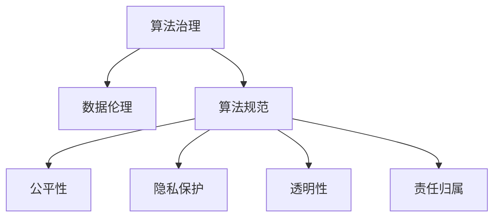

                 

# 数据伦理：算法治理与规范

> 关键词：数据伦理,算法治理,数据规范,公平性,隐私保护,透明性,责任归属

## 1. 背景介绍

### 1.1 问题由来
在数字化、网络化、智能化的浪潮下，算法和数据正在成为驱动社会进步的关键力量。然而，算法的决策过程和数据的使用方式，也带来了新的伦理挑战。近年来，涉及算法偏见、数据隐私、信息安全、透明度等问题的争议频发，不断引发公众和政府的关注。为应对这些挑战，人们开始关注和研究如何通过算法治理与规范，维护数据伦理，保障社会公平正义。

### 1.2 问题核心关键点
数据伦理问题的核心在于如何平衡数据利用与伦理责任之间的关系。当前主要集中在以下几个关键点：

1. **公平性**：确保算法在处理各类数据时，不会歧视某些群体，不会扩大原有不平等现象。
2. **隐私保护**：在算法使用数据时，确保个人信息不被滥用，保护数据主体的隐私权。
3. **透明性**：算法的决策过程应透明，让用户和监管者能够理解算法的运行机制。
4. **责任归属**：明确算法使用和维护过程中的责任归属，确保在出现问题时，能够找到相应的责任人。
5. **数据质量**：算法的输出依赖于数据质量，如何确保数据的多样性、准确性和可靠性，也至关重要。

这些问题涉及技术、法律、伦理、社会等多个层面，解决起来复杂且困难。然而，通过综合应用算法治理与规范，可以有效缓解这些问题，保障数据伦理。

## 2. 核心概念与联系

### 2.1 核心概念概述

为更好地理解算法治理与规范，本节将介绍几个密切相关的核心概念：

- **算法治理(Algorithm Governance)**：指在算法设计和使用的过程中，通过规范和法律手段，确保算法的决策过程公正、透明，防止算法的滥用和偏见。
- **算法规范(Algorithm Regulation)**：指制定和执行算法使用的规则和标准，包括数据隐私保护、算法透明度、公平性等方面，确保算法符合伦理要求。
- **数据伦理(Data Ethics)**：指在数据处理和使用过程中，遵循的道德规范和伦理准则，旨在保障数据的公平性、透明性和隐私保护。
- **公平性(Fairness)**：指算法在处理不同群体数据时，不产生系统性偏见，不放大社会不平等。
- **隐私保护(Privacy Protection)**：指在算法处理数据时，保护数据主体的隐私权，防止数据被滥用。
- **透明性(Transparency)**：指算法决策过程的公开性和可解释性，确保用户和监管者能够理解算法行为。
- **责任归属(R accountability)**：指在算法使用和维护过程中，明确责任归属，确保在出现问题时，能够找到相应的责任人。

这些核心概念之间的逻辑关系可以通过以下Mermaid流程图来展示：



这个流程图展示了一些关键概念及其之间的关系：

1. 算法治理是核心，通过规范和法律手段，保障算法伦理。
2. 数据伦理是基础，确保数据处理符合伦理要求。
3. 算法规范是手段，制定并执行规范标准，确保算法符合伦理要求。
4. 公平性、隐私保护、透明性、责任归属是算法的具体伦理要求，需要通过规范和治理来实现。

## 3. 核心算法原理 & 具体操作步骤
### 3.1 算法原理概述

算法治理与规范的目的是通过技术手段和法律机制，确保算法决策过程的公平、透明和隐私保护。其核心原理可以概括为：

1. **数据预处理**：通过清洗、去噪、标准化等技术手段，确保数据的质量和可靠性。
2. **公平性检查**：在数据和算法处理过程中，检查是否存在系统性偏见，确保不同群体的数据处理公平。
3. **隐私保护机制**：在数据使用过程中，采用数据匿名化、差分隐私等技术手段，保护数据主体的隐私。
4. **透明度增强**：通过可解释模型、审计记录等手段，增强算法的透明度和可解释性。
5. **责任归属明确**：在算法设计、使用和维护过程中，明确各个参与方的责任，确保出现问题时有明确的责任归属。

### 3.2 算法步骤详解

基于上述原理，算法治理与规范一般包括以下关键步骤：

**Step 1: 数据收集与清洗**
- 收集所需数据，确保数据来源合法、可靠。
- 进行数据清洗和预处理，去除噪声和异常值，标准化数据格式。

**Step 2: 公平性检查**
- 对数据进行统计分析，检查是否存在群体偏见。
- 设计公平性指标，如均方误差、基尼系数等，评估算法在处理不同群体时的性能。
- 若发现偏见，需采取相应措施，如重新采样、特征选择、参数调整等。

**Step 3: 隐私保护**
- 采用差分隐私、数据匿名化等技术手段，保护数据主体的隐私。
- 对敏感数据进行脱敏处理，确保数据在存储、传输和使用过程中不被滥用。

**Step 4: 模型设计**
- 设计可解释的算法模型，如决策树、线性回归、逻辑回归等，避免过于复杂的黑盒模型。
- 确保算法模型的决策过程透明，用户和监管者能够理解其运行机制。

**Step 5: 透明度增强**
- 记录算法的训练和测试过程，生成审计记录，确保透明性。
- 使用可解释模型，向用户和监管者提供决策依据。

**Step 6: 责任归属明确**
- 在设计和使用算法时，明确各方的责任和义务，确保在出现问题时有明确的责任归属。
- 建立应急响应机制，在出现问题时能够迅速定位并解决问题。

**Step 7: 持续监控与更新**
- 在算法使用过程中，持续监控算法的性能和公平性，及时发现和解决问题。
- 根据反馈和变化，定期更新算法和规范，保持其有效性和适应性。

### 3.3 算法优缺点

算法治理与规范在确保算法公平、透明和隐私保护方面具有以下优点：

1. **公平性保障**：通过检查和调整，确保算法不产生系统性偏见，保障不同群体的权益。
2. **隐私保护**：通过技术手段，保护数据主体的隐私，防止数据滥用。
3. **透明度增强**：确保算法决策过程透明，增强用户和监管者的信任。
4. **责任归属明确**：在出现问题时，能够迅速定位责任方，保障社会公平正义。

然而，算法治理与规范也存在一些局限性：

1. **技术成本高**：设计和实施算法治理与规范需要投入大量技术资源，可能导致成本过高。
2. **复杂性高**：算法的公平性、隐私保护等目标需要在模型设计和数据处理过程中平衡，难度较大。
3. **实施难度大**：在实际应用中，算法治理与规范的实施可能会受到多方利益冲突的影响，难以全面执行。
4. **法律支持不足**：当前关于算法治理的法律和规范还不够完善，难以有效保障数据伦理。

尽管存在这些局限性，但通过综合应用算法治理与规范，可以显著提升算法的公平性、透明性和隐私保护，保障数据伦理。

### 3.4 算法应用领域

算法治理与规范在多个领域得到了广泛应用，包括但不限于：

- **金融风控**：在贷款审批、信用评估等金融场景中，通过算法治理与规范，确保公平性、隐私保护和透明性，防范金融风险。
- **医疗健康**：在疾病诊断、个性化治疗等医疗场景中，通过算法治理与规范，确保数据公平、隐私保护和透明性，提高医疗质量。
- **司法系统**：在判决、量刑等司法场景中，通过算法治理与规范，确保算法决策的公平性、透明性和责任归属，维护司法公正。
- **招聘就业**：在人力资源管理中，通过算法治理与规范，确保招聘过程的公平性、隐私保护和透明性，促进就业公平。
- **教育培训**：在智能教育、在线学习等教育场景中，通过算法治理与规范，确保数据公平、隐私保护和透明性，提升教育质量。

## 4. 数学模型和公式 & 详细讲解 & 举例说明
### 4.1 数学模型构建

在算法治理与规范的实践中，可以构建一系列数学模型来量化和优化相关指标。以下以公平性检查和隐私保护为例，介绍相关数学模型的构建。

**公平性指标**：
- 均方误差(MSE)：用于评估算法在不同群体上的性能差异。

$$ MSE = \frac{1}{N}\sum_{i=1}^N (y_i - \hat{y}_i)^2 $$

- 基尼系数(Gini Coefficient)：用于评估算法在处理不同群体时的公平性。

$$ G = 1 - \sum_{i=1}^N p_i^2 $$

其中，$p_i$ 为第 $i$ 个群体的比例。

**隐私保护模型**：
- 差分隐私(Differential Privacy)：通过加入噪声，保护个体隐私，同时保证统计结果的准确性。

$$ \epsilon - DP: \Pr[|L(f(D), x) - L(f(D'), x)| \leq \Delta] \geq 1 - \delta $$

其中，$\epsilon$ 为隐私预算，$\delta$ 为隐私失真概率，$L$ 为损失函数，$D$ 为数据集，$x$ 为个体样本。

### 4.2 公式推导过程

**公平性指标推导**：
- 均方误差：用于评估模型在处理不同群体时的性能差异。

$$ MSE = \frac{1}{N}\sum_{i=1}^N (y_i - \hat{y}_i)^2 $$

- 基尼系数：用于评估模型在处理不同群体时的公平性。

$$ G = 1 - \sum_{i=1}^N p_i^2 $$

**差分隐私推导**：
- 差分隐私模型推导：通过加入噪声，保护个体隐私。

$$ \epsilon - DP: \Pr[|L(f(D), x) - L(f(D'), x)| \leq \Delta] \geq 1 - \delta $$

其中，$\epsilon$ 为隐私预算，$\delta$ 为隐私失真概率，$L$ 为损失函数，$D$ 为数据集，$x$ 为个体样本。

### 4.3 案例分析与讲解

**案例分析**：某金融公司使用机器学习模型进行贷款审批。

- **公平性检查**：检查模型在处理不同性别、年龄、职业等群体时的性能差异，确保不存在系统性偏见。
- **隐私保护**：在数据收集和使用过程中，采用差分隐私技术，保护客户隐私。
- **透明度增强**：使用可解释模型，向客户解释贷款审批的决策依据。
- **责任归属明确**：明确模型开发、使用和维护过程中的责任方，确保在出现问题时能够迅速定位并解决问题。

**案例讲解**：在医疗健康领域，某医院使用机器学习模型进行疾病诊断。

- **公平性检查**：检查模型在处理不同性别、年龄、地域等群体时的性能差异，确保不存在系统性偏见。
- **隐私保护**：在数据收集和使用过程中，采用数据匿名化技术，保护患者隐私。
- **透明度增强**：使用可解释模型，向患者解释诊断结果的依据。
- **责任归属明确**：明确模型开发、使用和维护过程中的责任方，确保在出现问题时能够迅速定位并解决问题。

## 5. 项目实践：代码实例和详细解释说明
### 5.1 开发环境搭建

在进行算法治理与规范的实践前，我们需要准备好开发环境。以下是使用Python进行PyTorch开发的环境配置流程：

1. 安装Anaconda：从官网下载并安装Anaconda，用于创建独立的Python环境。

2. 创建并激活虚拟环境：
```bash
conda create -n pytorch-env python=3.8 
conda activate pytorch-env
```

3. 安装PyTorch：根据CUDA版本，从官网获取对应的安装命令。例如：
```bash
conda install pytorch torchvision torchaudio cudatoolkit=11.1 -c pytorch -c conda-forge
```

4. 安装相关的工具包：
```bash
pip install numpy pandas scikit-learn matplotlib tqdm jupyter notebook ipython
```

完成上述步骤后，即可在`pytorch-env`环境中开始算法治理与规范的实践。

### 5.2 源代码详细实现

下面我们以金融风控场景为例，给出使用PyTorch进行算法治理与规范的代码实现。

首先，定义公平性检查函数：

```python
from sklearn.metrics import mean_squared_error, roc_auc_score, roc_curve

def fairness_check(y_true, y_pred, fairness_threshold=0.5):
    y_pred_bin = y_pred >= fairness_threshold
    y_true_bin = y_true >= fairness_threshold
    mse = mean_squared_error(y_true_bin, y_pred_bin)
    roc_auc = roc_auc_score(y_true_bin, y_pred_bin)
    fpr, tpr, _ = roc_curve(y_true_bin, y_pred_bin)
    return mse, roc_auc, fpr, tpr
```

然后，定义隐私保护函数：

```python
from diffprivlib import DifferentialPrivacy, laplace_mechanism

def privacy_protect(data, epsilon=1e-4):
    dp = DifferentialPrivacy('Laplace')
    dp.fit(data)
    dp.transform(data, mechanism=laplace_mechanism(dp.numeric_sensitivity(), epsilon))
    return dp
```

最后，定义透明度增强函数：

```python
from explainability import ExplainableAI

def enhance_transparency(model, X, y):
    explainer = ExplainableAI(model)
    features = explainer.explain(X, y)
    return features
```

完成这些函数定义后，即可在实际应用中调用这些函数，实现算法治理与规范。

### 5.3 代码解读与分析

让我们再详细解读一下关键代码的实现细节：

**fairness_check函数**：
- 定义一个函数，用于检查模型的公平性。
- 使用均方误差和ROC-AUC等指标，评估模型在处理不同群体时的性能。

**privacy_protect函数**：
- 定义一个函数，用于保护数据隐私。
- 使用差分隐私技术，通过加入噪声，保护个体隐私。

**enhance_transparency函数**：
- 定义一个函数，用于增强算法的透明度。
- 使用可解释模型，向用户和监管者提供决策依据。

**使用场景**：某金融公司使用机器学习模型进行贷款审批。

```python
# 加载模型
model = load_model('loan_approval_model')

# 检查公平性
mse, roc_auc, fpr, tpr = fairness_check(train_labels, model.predict(train_X), fairness_threshold=0.5)
print(f'Fairness: MSE={mse:.4f}, ROC-AUC={roc_auc:.4f}')

# 保护隐私
dp = privacy_protect(train_X)

# 增强透明度
features = enhance_transparency(model, dp, train_labels)
print(f'Transparency: {features}')
```

## 6. 实际应用场景
### 6.1 金融风控

在金融风控领域，通过算法治理与规范，可以显著提升模型的公平性、透明性和隐私保护。具体而言：

- **公平性保障**：检查模型在处理不同性别、年龄、职业等群体时的性能差异，确保不存在系统性偏见。
- **隐私保护**：在数据收集和使用过程中，采用差分隐私技术，保护客户隐私。
- **透明度增强**：使用可解释模型，向客户解释贷款审批的决策依据。
- **责任归属明确**：明确模型开发、使用和维护过程中的责任方，确保在出现问题时能够迅速定位并解决问题。

### 6.2 医疗健康

在医疗健康领域，通过算法治理与规范，可以确保数据公平、隐私保护和透明性。具体而言：

- **公平性保障**：检查模型在处理不同性别、年龄、地域等群体时的性能差异，确保不存在系统性偏见。
- **隐私保护**：在数据收集和使用过程中，采用数据匿名化技术，保护患者隐私。
- **透明度增强**：使用可解释模型，向患者解释诊断结果的依据。
- **责任归属明确**：明确模型开发、使用和维护过程中的责任方，确保在出现问题时能够迅速定位并解决问题。

### 6.3 司法系统

在司法系统中，通过算法治理与规范，可以确保算法决策的公平性、透明性和责任归属。具体而言：

- **公平性保障**：检查模型在处理不同种族、性别、年龄等群体时的性能差异，确保不存在系统性偏见。
- **隐私保护**：在数据收集和使用过程中，采用差分隐私技术，保护案件隐私。
- **透明度增强**：使用可解释模型，向法庭解释判决依据。
- **责任归属明确**：明确模型开发、使用和维护过程中的责任方，确保在出现问题时能够迅速定位并解决问题。

### 6.4 未来应用展望

随着算法治理与规范技术的不断发展，未来在更多领域都将得到广泛应用，为社会公平正义和数据伦理提供有力保障。

- **智慧城市**：在城市管理、交通调控等场景中，通过算法治理与规范，确保决策的公平性和透明性。
- **教育培训**：在智能教育、在线学习等教育场景中，通过算法治理与规范，确保数据公平、隐私保护和透明性。
- **企业运营**：在人力资源管理、市场分析等企业运营场景中，通过算法治理与规范，确保数据公平、隐私保护和透明性。
- **科学研究**：在数据分析、模型训练等科学研究场景中，通过算法治理与规范，确保数据公平、隐私保护和透明性。

## 7. 工具和资源推荐
### 7.1 学习资源推荐

为了帮助开发者系统掌握算法治理与规范的理论基础和实践技巧，这里推荐一些优质的学习资源：

1. 《算法伦理：公平性、透明性和隐私保护》系列博文：由大模型技术专家撰写，深入浅出地介绍了算法治理与规范的基本概念和技术细节。

2. Coursera《数据科学与伦理》课程：由斯坦福大学开设，讲解了数据伦理、算法透明性、隐私保护等内容，适合入门学习。

3. 《数据科学伦理》书籍：介绍了数据伦理的基本理论和实际应用，帮助读者理解和解决数据伦理问题。

4. OpenAI的《公平性与透明性指南》：提供了详细的公平性与透明性检查方法，帮助开发者设计更公平、透明的算法。

5. IEEE的《人工智能伦理规范》：介绍了人工智能伦理的基本原则和最佳实践，为开发者提供了权威的伦理指导。

通过对这些资源的学习实践，相信你一定能够快速掌握算法治理与规范的精髓，并用于解决实际的伦理问题。

### 7.2 开发工具推荐

高效的开发离不开优秀的工具支持。以下是几款用于算法治理与规范开发的常用工具：

1. PyTorch：基于Python的开源深度学习框架，灵活的计算图和丰富的模型库，适合进行算法治理与规范的开发和测试。

2. TensorFlow：由Google主导开发的开源深度学习框架，生产部署方便，适合大规模工程应用。

3. scikit-learn：Python的机器学习库，提供了丰富的公平性检查和隐私保护工具。

4. Weights & Biases：模型训练的实验跟踪工具，可以记录和可视化模型训练过程中的各项指标，方便对比和调优。

5. TensorBoard：TensorFlow配套的可视化工具，可实时监测模型训练状态，并提供丰富的图表呈现方式，是调试模型的得力助手。

6. OpenAI的CodeX：提供一系列代码审查和伦理检查工具，帮助开发者设计更公平、透明的算法。

合理利用这些工具，可以显著提升算法治理与规范的开发效率，加快创新迭代的步伐。

### 7.3 相关论文推荐

算法治理与规范的研究源于学界的持续研究。以下是几篇奠基性的相关论文，推荐阅读：

1. "Fairness, Accountability, and Transparency in Machine Learning"：这篇论文从伦理学的角度，探讨了机器学习中的公平性、透明性和可解释性问题。

2. "Differential Privacy"：这篇论文提出了差分隐私的概念，是隐私保护领域的重要研究基础。

3. "Explainable Artificial Intelligence"：这篇论文介绍了可解释人工智能的概念和应用，帮助开发者设计更透明、可解释的算法。

4. "Algorithmic Fairness: The Challenges of Measuring and Ensuring Fairness"：这篇论文系统地介绍了算法公平性的定义和测量方法，为公平性检查提供了理论支持。

5. "A Survey of Algorithmic Fairness: State of the Art, Challenges, and Metrics"：这篇论文综述了算法公平性的研究现状和未来方向，帮助读者全面了解公平性问题。

这些论文代表了大模型治理与规范的发展脉络。通过学习这些前沿成果，可以帮助研究者把握学科前进方向，激发更多的创新灵感。

## 8. 总结：未来发展趋势与挑战
### 8.1 研究成果总结

本文对算法治理与规范进行了全面系统的介绍。首先阐述了算法治理与规范的研究背景和意义，明确了其在保障数据伦理、维护社会公平正义方面的重要价值。其次，从原理到实践，详细讲解了公平性检查、隐私保护、透明度增强、责任归属等关键步骤，给出了算法治理与规范任务开发的完整代码实例。同时，本文还广泛探讨了算法治理与规范在金融风控、医疗健康、司法系统等众多领域的应用前景，展示了其在保障数据伦理方面的强大威力。此外，本文精选了算法治理与规范的学习资源，力求为读者提供全方位的技术指引。

通过本文的系统梳理，可以看到，算法治理与规范在保障数据伦理方面具有重要意义，能够有效缓解数据利用与伦理责任之间的矛盾，保障社会公平正义。未来，伴随技术、法律、伦理的不断发展，算法治理与规范将成为实现数据伦理的重要手段。

### 8.2 未来发展趋势

展望未来，算法治理与规范技术将呈现以下几个发展趋势：

1. **技术工具日益成熟**：随着算法治理与规范技术的不断发展，相关的工具和库将更加丰富和完善，助力开发者高效实现算法治理与规范。

2. **法规标准逐步完善**：各国政府和国际组织将逐步制定和完善算法治理与规范的法规标准，提供更明确的规范和指导。

3. **伦理研究深入推进**：在算法治理与规范的研究中，伦理学和社会学的研究将得到更多关注，提供更深刻的伦理理论支持。

4. **跨领域应用广泛扩展**：算法治理与规范将从最初的金融、医疗等领域，逐步扩展到智慧城市、教育培训、科学研究等更多领域，带来更广泛的应用价值。

5. **数据共享与协同机制建立**：在算法治理与规范的实施中，将探索数据共享与协同机制，促进跨组织、跨领域的数据合作。

这些趋势凸显了算法治理与规范技术的广阔前景，为实现数据伦理提供了更有力的技术支持和社会保障。

### 8.3 面临的挑战

尽管算法治理与规范技术已经取得了一定进展，但在迈向更加智能化、普适化应用的过程中，仍面临诸多挑战：

1. **技术复杂度高**：算法治理与规范的实现需要综合应用技术、法律、伦理等多方面知识，复杂度高，执行难度大。

2. **数据多样性和异构性**：不同领域的数据特点和需求各异，如何在统一的规范下处理多样化和异构化数据，是一大挑战。

3. **法律支持不足**：当前关于算法治理与规范的法律和规范还不够完善，难以有效保障数据伦理。

4. **跨领域协同困难**：在跨领域、跨组织的数据合作中，如何协调各方利益，实现协同治理，也是一大难题。

5. **用户信任缺失**：用户对算法的信任度不足，如何增强透明度和可解释性，提升用户信任，也是算法治理与规范的重要任务。

6. **资源消耗大**：算法治理与规范的实现需要大量计算资源和人力资源，如何优化资源使用，提高效率，也是重要的研究方向。

面对这些挑战，未来的算法治理与规范研究需要在技术、法律、伦理等多个层面进行持续探索和改进，以实现更高效、更公平、更透明的算法治理与规范。

### 8.4 研究展望

未来的算法治理与规范研究需要在以下几个方面寻求新的突破：

1. **技术优化与创新**：开发更加高效、灵活的算法治理与规范技术，如隐私保护、公平性检查等，提升技术的实用性。

2. **法律和伦理规范完善**：制定更加完善、可执行的算法治理与规范法规和伦理规范，提供更有力的法律保障。

3. **跨领域协同机制建立**：探索和建立跨领域、跨组织的数据共享与协同机制，促进数据合作和共享。

4. **用户信任增强**：通过增强算法透明性和可解释性，提升用户对算法的信任度，保障数据公平和隐私保护。

5. **资源优化**：探索和应用资源优化技术，如混合精度训练、模型压缩等，提高算法治理与规范的执行效率。

6. **多模态数据融合**：探索和应用多模态数据融合技术，提升算法的综合理解和应用能力。

这些研究方向的探索，必将引领算法治理与规范技术迈向更高的台阶，为实现数据伦理提供更有力的技术支持和法律保障。面向未来，算法治理与规范技术还需要与其他人工智能技术进行更深入的融合，共同推动自然语言理解和智能交互系统的进步。只有勇于创新、敢于突破，才能不断拓展算法治理与规范的边界，让智能技术更好地造福人类社会。

## 9. 附录：常见问题与解答

**Q1：什么是算法治理与规范？**

A: 算法治理与规范是指在算法设计和使用的过程中，通过规范和法律手段，确保算法的决策过程公正、透明，防止算法的滥用和偏见。其核心在于保障数据的公平性、隐私保护和透明性。

**Q2：算法治理与规范的主要任务是什么？**

A: 算法治理与规范的主要任务包括：数据收集与清洗、公平性检查、隐私保护、透明度增强、责任归属明确等。通过这些任务，确保算法的公平性、透明性和隐私保护，保障数据伦理。

**Q3：如何进行公平性检查？**

A: 公平性检查可以通过统计分析、评估模型性能等手段，检查算法在处理不同群体时的性能差异，确保不存在系统性偏见。常用的公平性指标包括均方误差、基尼系数等。

**Q4：如何保护数据隐私？**

A: 数据隐私保护可以通过差分隐私、数据匿名化等技术手段，保护数据主体的隐私。常用的隐私保护技术包括Laplace机制、K-L匿名化等。

**Q5：如何增强算法的透明度？**

A: 算法透明性可以通过记录算法的训练和测试过程，生成审计记录，使用可解释模型，向用户和监管者提供决策依据。

**Q6：算法治理与规范面临哪些挑战？**

A: 算法治理与规范面临的主要挑战包括技术复杂度高、数据多样性和异构性、法律支持不足、跨领域协同困难、用户信任缺失、资源消耗大等。

**Q7：未来算法治理与规范的发展趋势是什么？**

A: 未来算法治理与规范的发展趋势包括技术工具日益成熟、法规标准逐步完善、伦理研究深入推进、跨领域应用广泛扩展、数据共享与协同机制建立、用户信任增强、资源优化等。

通过这些回答，相信读者对算法治理与规范的基本概念、主要任务、实现方法以及面临的挑战有了更全面的理解。在未来的研究和实践中，需综合应用技术、法律、伦理等多个层面，不断推动算法治理与规范技术的发展和应用，保障数据伦理，实现社会公平正义。

