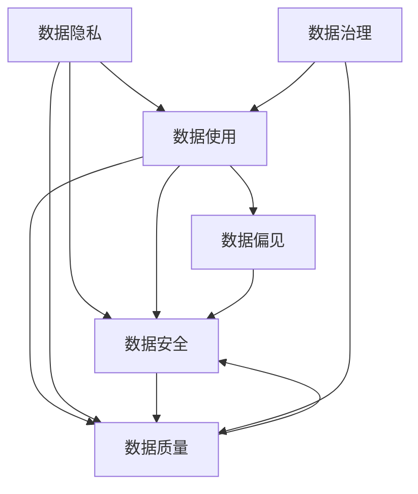

                 

# 数据伦理：算法治理与规范

## 1. 背景介绍

在人工智能(AI)时代，数据作为算法模型的核心输入，其质量和特性将直接决定AI系统的表现与影响。然而，数据并非总是客观的，其来源、采集、使用方式等均可能包含伦理问题，如数据隐私、数据偏见、数据安全等。如何在技术层面实现对数据的伦理治理，成为人工智能发展中一个关键而复杂的任务。

### 1.1 数据伦理问题的现状

当前数据伦理问题主要体现在以下几个方面：

- **数据隐私**：包括个人身份信息的泄露、行为跟踪、数据滥用等，这些问题可能导致个人隐私受损，甚至引发社会风险。
- **数据偏见**：由于数据采集、标注等环节的偏差，AI模型可能具有系统性偏见，导致决策不公或歧视。
- **数据安全**：数据在传输、存储、处理过程中可能遭遇黑客攻击、数据泄露等风险，影响系统安全。
- **数据质量**：数据标注不准确、数据噪声高、数据分布不均衡等，会严重影响AI模型的性能和泛化能力。

数据伦理问题不仅对个体造成影响，还可能对社会造成深远影响，包括但不限于引发社会不公、加剧社会分裂、损害社会信任等。因此，在AI系统开发与部署过程中，必须重视数据的伦理治理，确保AI系统的透明性、公正性和安全性。

### 1.2 数据伦理问题的挑战

数据伦理问题的复杂性在于其涉及多方的利益、多维度的伦理规范和多样化的数据使用场景。具体来说，面临以下挑战：

- **多方利益冲突**：在数据收集、使用和共享过程中，各利益相关方（如数据提供者、数据使用者、监管机构）的利益可能存在冲突，导致伦理规范的执行难度增加。
- **伦理规范模糊**：不同领域、不同文化背景下，对数据使用的伦理规范有不同的理解和定义，导致伦理治理标准的难以统一。
- **技术复杂性**：AI算法模型的复杂性使得数据伦理问题难以在技术层面得到彻底解决，需要结合伦理、法律等多方面知识进行综合治理。

面对这些挑战，如何在技术层面实现对数据的伦理治理，成为了当前AI研究与应用中的重要课题。

## 2. 核心概念与联系

### 2.1 核心概念概述

为更好地理解数据伦理问题及其治理方法，本节将介绍几个关键概念：

- **数据隐私**：指保护个体数据免遭未经授权的访问、收集、使用和共享。隐私保护的核心在于限制数据的使用范围和用途。
- **数据偏见**：指由于数据集中的某些偏差，导致模型训练出的结果存在不公或歧视。偏见可能是有意的也可能是无意的。
- **数据安全**：指保护数据在传输、存储和处理过程中不被非法访问、篡改或破坏。安全保障的关键在于数据加密、访问控制等技术手段。
- **数据质量**：指数据的准确性、完整性、一致性和可用性。高质量数据是实现AI模型高性能的基础。

这些核心概念之间存在密切的联系，数据隐私、数据偏见和数据安全构成了数据伦理问题的三大主要方面，而数据质量则对这三者产生直接影响。此外，数据的质量和安全性也对算法治理和模型训练提出了要求，确保算法的透明性、公正性和可靠性。

### 2.2 核心概念的 Mermaid 流程图(Mermaid 流程节点中不要有括号、逗号等特殊字符)



这个流程图展示了数据隐私、数据偏见、数据安全与数据质量之间的关系。其中，数据治理是确保数据质量、安全性和隐私保护的重要手段。

## 3. 核心算法原理 & 具体操作步骤

### 3.1 算法原理概述

数据伦理治理的算法原理主要围绕数据隐私保护、数据偏见纠正和数据质量提升三大方面展开。以下是其主要原理概述：

- **数据隐私保护**：通过加密、匿名化、访问控制等技术手段，确保数据在存储、传输和处理过程中不被非法访问和滥用。
- **数据偏见纠正**：通过数据分析和模型训练，识别和纠正数据集中的系统性偏见，保证模型输出公平公正。
- **数据质量提升**：通过数据清洗、数据增强、异常检测等技术手段，提升数据集的质量，保证模型训练的高效性和泛化能力。

### 3.2 算法步骤详解

#### 3.2.1 数据隐私保护

数据隐私保护的主要技术手段包括：

- **数据加密**：对数据进行加密存储和传输，防止数据在未经授权的访问中被读取和篡改。常用的加密算法包括对称加密和非对称加密。
- **数据匿名化**：通过数据扰动、数据聚合等方式，使得数据无法直接关联到个体，从而保护个体隐私。常用的匿名化方法包括k-匿名化、l-多样性和t-接近性。
- **访问控制**：通过身份认证、权限管理等手段，限制数据访问的范围和用途，确保数据仅用于授权的目的。常用的访问控制技术包括基于角色的访问控制（RBAC）和属性基础访问控制（ABAC）。

具体实现步骤如下：

1. 对数据进行加密处理，确保数据在传输和存储过程中不被窃听和篡改。
2. 对数据进行匿名化处理，使得数据无法直接关联到个体，保护隐私。
3. 实施严格的访问控制措施，确保数据仅在授权情况下被使用。

#### 3.2.2 数据偏见纠正

数据偏见纠正的主要技术手段包括：

- **数据筛选**：通过筛选数据集，去除包含偏见的样本。常用的数据筛选方法包括去除异常值和处理缺失值。
- **数据增强**：通过生成新的数据样本，增加数据集的多样性，缓解数据偏见。常用的数据增强方法包括对抗样本生成和样本重采样。
- **模型训练**：通过调整模型训练目标和优化算法，降低模型对数据偏见的敏感度。常用的方法包括自适应学习率和公平性约束。

具体实现步骤如下：

1. 对数据集进行筛选和清洗，去除包含偏见的样本。
2. 生成新的数据样本，增加数据集的多样性，缓解数据偏见。
3. 调整模型训练目标和优化算法，降低模型对数据偏见的敏感度。

#### 3.2.3 数据质量提升

数据质量提升的主要技术手段包括：

- **数据清洗**：通过去除噪声数据、处理缺失值、标准化数据格式等方式，提升数据质量。常用的数据清洗方法包括数据去重和数据填充。
- **数据增强**：通过生成新的数据样本，增加数据集的多样性，提升数据质量。常用的数据增强方法包括数据增强和生成对抗网络（GAN）。
- **异常检测**：通过检测数据中的异常值，提升数据质量。常用的异常检测方法包括基于统计方法和基于机器学习的方法。

具体实现步骤如下：

1. 对数据进行清洗处理，去除噪声数据、处理缺失值、标准化数据格式等方式。
2. 生成新的数据样本，增加数据集的多样性，提升数据质量。
3. 检测数据中的异常值，提升数据质量。

### 3.3 算法优缺点

数据伦理治理的算法具有以下优点：

- **增强隐私保护**：通过加密、匿名化、访问控制等技术手段，增强数据的隐私保护，防止数据泄露和滥用。
- **缓解数据偏见**：通过数据筛选、数据增强、模型训练等手段，缓解数据偏见，提升模型公平性。
- **提升数据质量**：通过数据清洗、数据增强、异常检测等技术手段，提升数据质量，保证模型训练的高效性和泛化能力。

然而，这些算法也存在一些局限性：

- **技术复杂性**：数据隐私保护、数据偏见纠正和数据质量提升的技术手段复杂多样，需要结合具体应用场景进行综合治理。
- **成本高昂**：加密、匿名化、数据增强等技术手段往往需要较高的计算资源和时间成本，增加了系统开发的复杂度。
- **依赖外部环境**：算法的效果依赖于外部环境（如法律法规、伦理标准等）的支持，不同领域和地区的伦理标准可能存在差异。

### 3.4 算法应用领域

数据伦理治理的算法在多个领域中得到了广泛应用，具体包括：

- **医疗健康**：保护患者隐私，防止医疗数据泄露，确保医疗数据的安全性和公平性。
- **金融服务**：保护用户隐私，防止金融数据滥用，确保金融服务的透明性和公平性。
- **公共安全**：保护公众隐私，防止数据滥用，确保公共安全的透明性和公平性。
- **电子商务**：保护消费者隐私，防止数据滥用，确保电子商务的透明性和公平性。
- **智能制造**：保护生产数据隐私，防止数据滥用，确保智能制造的透明性和公平性。

## 4. 数学模型和公式 & 详细讲解 & 举例说明

### 4.1 数学模型构建

数据伦理治理的算法模型主要涉及以下几类：

- **数据加密模型**：通过对数据进行加密，确保数据在传输和存储过程中的安全性。常用的加密模型包括对称加密模型（如AES）和非对称加密模型（如RSA）。
- **数据匿名化模型**：通过对数据进行匿名化处理，使得数据无法直接关联到个体，保护隐私。常用的匿名化模型包括k-匿名化模型和l-多样性模型。
- **数据偏见纠正模型**：通过识别和纠正数据集中的系统性偏见，保证模型输出公平公正。常用的模型包括自适应学习率模型和公平性约束模型。
- **数据质量提升模型**：通过数据清洗、数据增强、异常检测等手段，提升数据集的质量。常用的模型包括数据去重模型和数据填充模型。

### 4.2 公式推导过程

#### 4.2.1 数据加密模型

以AES加密模型为例，其公式推导如下：

- **加密过程**：
$$
C = E(K, M)
$$

其中，$C$为密文，$M$为明文，$E$为加密算法，$K$为密钥。

- **解密过程**：
$$
M = D(K, C)
$$

其中，$D$为解密算法，$M$为明文，$C$为密文，$K$为密钥。

#### 4.2.2 数据匿名化模型

以k-匿名化模型为例，其公式推导如下：

- **k-匿名化**：
$$
A = (a_1, a_2, ..., a_k)
$$

其中，$A$为匿名化后的数据集，$k$为匿名化因子，$a_i$为数据集中的第$i$个匿名化记录。

- **l-多样性**：
$$
\{a_i\} \cap \{a_j\} \neq \emptyset
$$

其中，$\{a_i\}$为数据集中的第$i$个匿名化记录，$\{a_j\}$为数据集中的第$j$个匿名化记录。

#### 4.2.3 数据偏见纠正模型

以自适应学习率模型为例，其公式推导如下：

- **自适应学习率**：
$$
\eta_t = \frac{\eta_0}{1 + \frac{\eta_0 \gamma}{\beta_1 t}}
$$

其中，$\eta_t$为第$t$步的学习率，$\eta_0$为初始学习率，$\gamma$为学习率衰减系数，$\beta_1$为动量参数，$t$为迭代次数。

- **公平性约束**：
$$
\mathcal{L}_{fair} = \mathcal{L}_{\text{base}} + \lambda \mathcal{L}_{\text{bias}}
$$

其中，$\mathcal{L}_{fair}$为公平性约束损失，$\mathcal{L}_{\text{base}}$为基本损失，$\mathcal{L}_{\text{bias}}$为偏见损失，$\lambda$为公平性约束系数。

#### 4.2.4 数据质量提升模型

以数据清洗模型为例，其公式推导如下：

- **数据去重**：
$$
D = \{d_1, d_2, ..., d_n\}
$$

其中，$D$为去重后的数据集，$d_i$为数据集中的第$i$个记录。

- **数据填充**：
$$
F = \{f_1, f_2, ..., f_n\}
$$

其中，$F$为填充后的数据集，$f_i$为数据集中的第$i$个填充记录。

### 4.3 案例分析与讲解

#### 4.3.1 医疗健康领域的数据隐私保护

以某医疗健康平台为例，其数据隐私保护技术如下：

- **数据加密**：对用户健康数据进行AES加密，确保数据在传输和存储过程中的安全性。
- **数据匿名化**：对用户健康数据进行k-匿名化处理，防止数据泄露。
- **访问控制**：实施严格的访问控制措施，确保数据仅在授权情况下被使用。

#### 4.3.2 金融服务领域的数据偏见纠正

以某金融贷款平台为例，其数据偏见纠正技术如下：

- **数据筛选**：筛选包含偏见的样本，去除高龄用户、低收入用户的贷款申请。
- **数据增强**：生成新的数据样本，增加数据集的多样性，缓解数据偏见。
- **模型训练**：调整模型训练目标和优化算法，降低模型对数据偏见的敏感度。

#### 4.3.3 智能制造领域的数据质量提升

以某智能制造系统为例，其数据质量提升技术如下：

- **数据清洗**：对生产数据进行清洗处理，去除噪声数据、处理缺失值、标准化数据格式等方式。
- **数据增强**：生成新的数据样本，增加数据集的多样性，提升数据质量。
- **异常检测**：检测数据中的异常值，提升数据质量。

## 5. 项目实践：代码实例和详细解释说明

### 5.1 开发环境搭建

在进行数据伦理治理的算法实践前，我们需要准备好开发环境。以下是使用Python进行开发的环境配置流程：

1. 安装Anaconda：从官网下载并安装Anaconda，用于创建独立的Python环境。

2. 创建并激活虚拟环境：
```bash
conda create -n data-ethics-env python=3.8 
conda activate data-ethics-env
```

3. 安装相关库：
```bash
pip install cryptography pandas numpy scikit-learn matplotlib
```

4. 配置环境变量：
```bash
export PYTHONPATH=$PYTHONPATH:$HOME/your_project_folder
```

完成上述步骤后，即可在`data-ethics-env`环境中开始实践。

### 5.2 源代码详细实现

我们以数据加密模型为例，使用Python实现AES加密算法。具体实现如下：

```python
from cryptography.hazmat.primitives import serialization, hashes, hmac
from cryptography.hazmat.primitives.ciphers import Cipher, algorithms, modes
from cryptography.hazmat.primitives import padding
from cryptography.hazmat.backends import default_backend

# 生成密钥和IV
key = b'Sixteen byte key'
iv = b'IV'
cipher = Cipher(algorithms.AES(key), modes.CBC(iv), backend=default_backend())
encryptor = cipher.encryptor()
padder = padding.PKCS7(128).padder()
data = b'This is the data to be encrypted.'

# 加密数据
ciphertext = encryptor.update(data)
ciphertext = encryptor.finalize()

# 解密数据
decryptor = cipher.decryptor()
plaintext = decryptor.update(ciphertext)
plaintext = decryptor.finalize()
```

### 5.3 代码解读与分析

以上代码实现了一个简单的AES加密算法，用于对数据进行加密处理。具体步骤如下：

1. 生成密钥和IV，用于加密和解密。
2. 使用AES算法和CBC模式，生成Cipher对象，并进行初始化。
3. 使用加密器对数据进行加密，并在最后完成加密操作。
4. 使用解密器对加密数据进行解密，并在最后完成解密操作。

### 5.4 运行结果展示

运行以上代码，可以得到加密和解密后的数据，从而验证加密算法的正确性。

## 6. 实际应用场景

### 6.1 医疗健康

在医疗健康领域，数据伦理治理尤为重要。医疗机构需要保护患者隐私，防止医疗数据泄露，确保医疗数据的安全性和公平性。具体应用场景包括：

- **患者隐私保护**：对患者健康数据进行加密和匿名化处理，防止数据泄露和滥用。
- **数据偏见纠正**：通过数据分析和模型训练，识别和纠正数据集中的系统性偏见，保证医疗决策的公平公正。
- **数据质量提升**：通过数据清洗、数据增强、异常检测等手段，提升数据集的质量，确保医疗系统的稳定性和可靠性。

### 6.2 金融服务

在金融服务领域，数据伦理治理同样至关重要。金融机构需要保护用户隐私，防止金融数据滥用，确保金融服务的透明性和公平性。具体应用场景包括：

- **用户隐私保护**：对用户金融数据进行加密和匿名化处理，防止数据泄露和滥用。
- **数据偏见纠正**：通过数据分析和模型训练，识别和纠正数据集中的系统性偏见，保证金融决策的公平公正。
- **数据质量提升**：通过数据清洗、数据增强、异常检测等手段，提升数据集的质量，确保金融系统的稳定性和可靠性。

### 6.3 智能制造

在智能制造领域，数据伦理治理同样重要。智能制造系统需要保护生产数据隐私，防止数据滥用，确保智能制造的透明性和公平性。具体应用场景包括：

- **生产数据隐私保护**：对生产数据进行加密和匿名化处理，防止数据泄露和滥用。
- **数据偏见纠正**：通过数据分析和模型训练，识别和纠正数据集中的系统性偏见，保证生产决策的公平公正。
- **数据质量提升**：通过数据清洗、数据增强、异常检测等手段，提升数据集的质量，确保智能制造系统的稳定性和可靠性。

### 6.4 未来应用展望

随着数据伦理治理技术的不断发展，其在各领域中的应用前景广阔。未来，数据伦理治理将更加深入地应用于：

- **智慧城市**：在智慧城市治理中，数据伦理治理将确保市民隐私的保护，防止数据滥用，提升公共服务的透明性和公平性。
- **智能交通**：在智能交通系统中，数据伦理治理将确保交通数据的安全性和隐私保护，提升交通系统的稳定性和可靠性。
- **能源管理**：在能源管理系统中，数据伦理治理将确保能源数据的隐私保护，提升能源系统的透明性和公平性。
- **环境保护**：在环境保护领域，数据伦理治理将确保环境数据的隐私保护，提升环境保护系统的透明性和公平性。

## 7. 工具和资源推荐

### 7.1 学习资源推荐

为帮助开发者系统掌握数据伦理治理的理论基础和实践技巧，这里推荐一些优质的学习资源：

1. **《数据科学与隐私工程》**：该书详细介绍了数据伦理、数据隐私保护和数据治理等基本概念和技术。
2. **《数据科学与人工智能》**：该书涵盖了数据伦理、数据治理、数据安全等多方面的内容。
3. **《机器学习中的伦理问题》**：该书探讨了机器学习中的伦理问题，包括数据偏见、算法公平性等。
4. **《数据科学导论》**：该书介绍了数据科学的基本概念、技术和应用，包括数据伦理和数据治理。
5. **《数据治理实践》**：该书提供了数据治理的实用案例和最佳实践，帮助企业在数据治理中取得成功。

通过对这些资源的学习实践，相信你一定能够全面掌握数据伦理治理的技术要点，并应用于实际开发中。

### 7.2 开发工具推荐

高效的数据伦理治理需要依赖优秀的工具支持。以下是几款用于数据伦理治理开发的常用工具：

1. **Python**：Python是一种高效灵活的编程语言，适合处理复杂的数据处理任务。
2. **Cryptography**：Python的加密库，提供了多种加密算法的实现。
3. **Pandas**：Python的数据分析库，提供了高效的数据处理和分析功能。
4. **NumPy**：Python的科学计算库，提供了高效的数据计算和处理功能。
5. **Scikit-learn**：Python的机器学习库，提供了多种数据处理和模型训练功能。
6. **TensorFlow**：谷歌的深度学习框架，适合大规模数据处理和模型训练。

合理利用这些工具，可以显著提升数据伦理治理任务的开发效率，加速技术创新的步伐。

### 7.3 相关论文推荐

数据伦理治理技术的发展得益于学界的持续研究。以下是几篇奠基性的相关论文，推荐阅读：

1. **《保护数据隐私：一种综合框架》**：提出了一种数据隐私保护的综合框架，包括数据加密、数据匿名化、访问控制等技术手段。
2. **《公平性约束：一种新型的数据偏见纠正方法》**：提出了一种公平性约束方法，通过调整模型训练目标和优化算法，降低模型对数据偏见的敏感度。
3. **《数据质量提升：一种新型的数据清洗方法》**：提出了一种数据清洗方法，通过去除噪声数据、处理缺失值、标准化数据格式等方式，提升数据质量。

这些论文代表了大数据伦理治理技术的发展脉络。通过学习这些前沿成果，可以帮助研究者把握学科前进方向，激发更多的创新灵感。

## 8. 总结：未来发展趋势与挑战

### 8.1 研究成果总结

数据伦理治理技术在近年来取得了显著进展，并在多个领域中得到了广泛应用。主要研究成果包括：

- **数据隐私保护**：通过加密、匿名化、访问控制等技术手段，保护数据隐私。
- **数据偏见纠正**：通过数据分析和模型训练，缓解数据偏见，提升模型公平性。
- **数据质量提升**：通过数据清洗、数据增强、异常检测等手段，提升数据集的质量。

这些研究成果为数据伦理治理提供了有力的技术支持，帮助企业在数据处理和应用中更好地保护隐私、公平和质量。

### 8.2 未来发展趋势

未来，数据伦理治理技术将呈现以下几个发展趋势：

1. **技术进步**：随着算力成本的下降和数据处理技术的进步，数据伦理治理技术将更加高效和精确。
2. **伦理规范统一**：不同领域和地区的伦理规范可能存在差异，未来需要推动伦理规范的统一和标准化。
3. **多技术融合**：数据伦理治理将与大数据、区块链、人工智能等技术进一步融合，提升数据处理和应用的安全性和公平性。
4. **跨界合作**：企业、政府、学术界等各方将加强合作，共同推动数据伦理治理技术的进步。
5. **社会监督**：社会各界将对数据伦理治理提出更高的要求，推动技术应用的透明性和公平性。

这些趋势将推动数据伦理治理技术向更加全面、高效、公平的方向发展，为社会带来更多的安全与福祉。

### 8.3 面临的挑战

尽管数据伦理治理技术取得了显著进展，但在实际应用中仍面临诸多挑战：

1. **技术复杂性**：数据隐私保护、数据偏见纠正和数据质量提升的技术手段复杂多样，需要结合具体应用场景进行综合治理。
2. **成本高昂**：加密、匿名化、数据增强等技术手段往往需要较高的计算资源和时间成本，增加了系统开发的复杂度。
3. **伦理规范模糊**：不同领域和地区的伦理规范可能存在差异，导致伦理治理标准的难以统一。
4. **数据质量不稳定**：数据清洗、数据增强等技术手段的精度和效果不稳定，可能导致数据质量波动。
5. **数据偏见纠正难度大**：数据偏见纠正的难度大，需要结合多种技术手段才能有效降低模型偏见。

这些挑战需要研究者不断创新和优化技术手段，提高数据伦理治理的效率和效果。

### 8.4 研究展望

未来的数据伦理治理研究需要在以下几个方面寻求新的突破：

1. **无监督和半监督数据治理**：摆脱对大规模标注数据的依赖，利用自监督学习、主动学习等无监督和半监督范式，最大限度利用非结构化数据。
2. **参数高效数据治理**：开发更加参数高效的数据治理方法，在固定大部分预训练参数的同时，只更新极少量的任务相关参数。
3. **因果推断与数据治理结合**：引入因果推断思想，识别模型决策的关键特征，增强输出解释的因果性和逻辑性。
4. **多模态数据治理**：将符号化的先验知识，如知识图谱、逻辑规则等，与神经网络模型进行巧妙融合，引导数据治理过程学习更准确、合理的语言模型。
5. **道德约束与数据治理结合**：在模型训练目标中引入伦理导向的评估指标，过滤和惩罚有偏见、有害的输出倾向。

这些研究方向将引领数据伦理治理技术迈向更高的台阶，为构建安全、可靠、可解释、可控的智能系统铺平道路。面向未来，数据伦理治理技术还需要与其他人工智能技术进行更深入的融合，如知识表示、因果推理、强化学习等，多路径协同发力，共同推动自然语言理解和智能交互系统的进步。只有勇于创新、敢于突破，才能不断拓展语言模型的边界，让智能技术更好地造福人类社会。

## 9. 附录：常见问题与解答

**Q1：数据隐私保护有哪些具体技术手段？**

A: 数据隐私保护的具体技术手段包括：

- **数据加密**：对数据进行加密存储和传输，防止数据泄露和滥用。常用的加密算法包括对称加密和非对称加密。
- **数据匿名化**：通过数据扰动、数据聚合等方式，使得数据无法直接关联到个体，保护隐私。常用的匿名化方法包括k-匿名化、l-多样性和t-接近性。
- **访问控制**：通过身份认证、权限管理等手段，限制数据访问的范围和用途，确保数据仅在授权情况下被使用。常用的访问控制技术包括基于角色的访问控制（RBAC）和属性基础访问控制（ABAC）。

**Q2：如何缓解数据偏见问题？**

A: 缓解数据偏见的主要技术手段包括：

- **数据筛选**：通过筛选数据集，去除包含偏见的样本。常用的数据筛选方法包括去除异常值和处理缺失值。
- **数据增强**：通过生成新的数据样本，增加数据集的多样性，缓解数据偏见。常用的数据增强方法包括对抗样本生成和样本重采样。
- **模型训练**：通过调整模型训练目标和优化算法，降低模型对数据偏见的敏感度。常用的方法包括自适应学习率和公平性约束。

**Q3：数据质量提升有哪些具体技术手段？**

A: 数据质量提升的具体技术手段包括：

- **数据清洗**：通过去除噪声数据、处理缺失值、标准化数据格式等方式，提升数据质量。常用的数据清洗方法包括数据去重和数据填充。
- **数据增强**：通过生成新的数据样本，增加数据集的多样性，提升数据质量。常用的数据增强方法包括数据增强和生成对抗网络（GAN）。
- **异常检测**：通过检测数据中的异常值，提升数据质量。常用的异常检测方法包括基于统计方法和基于机器学习的方法。

**Q4：数据伦理治理对AI系统的影响有哪些？**

A: 数据伦理治理对AI系统的影响主要体现在以下几个方面：

- **提升系统透明度**：通过数据隐私保护、数据偏见纠正和数据质量提升，提升AI系统的透明度，增强用户信任。
- **保障数据公平性**：通过数据分析和模型训练，确保AI系统输出公平公正，避免数据偏见带来的不公平现象。
- **提高系统安全性**：通过数据加密、数据匿名化等技术手段，保护数据安全，防止数据泄露和滥用。

**Q5：如何评估数据伦理治理的效果？**

A: 评估数据伦理治理的效果主要从以下几个方面进行：

- **数据隐私保护**：评估数据隐私保护的强度和效果，确保数据在传输和存储过程中的安全性。
- **数据偏见纠正**：评估数据偏见纠正的精度和效果，确保AI系统输出公平公正。
- **数据质量提升**：评估数据质量提升的精度和效果，确保AI系统训练的高效性和泛化能力。

通过以上评估指标，可以全面衡量数据伦理治理的效果，确保AI系统的透明性、公正性和安全性。

