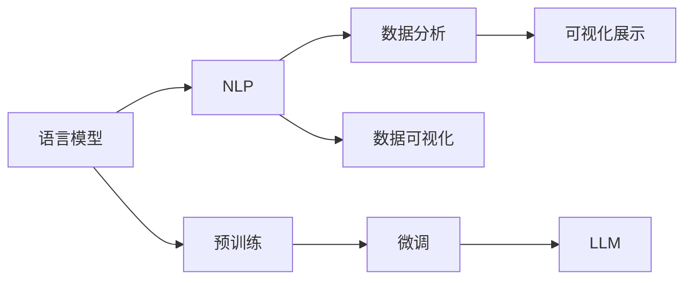

                 

## 1. 背景介绍

随着数据科学的不断发展，数据分析和可视化已经成为了各个行业决策的重要工具。然而，在处理大规模复杂数据时，传统的统计分析方法和数据可视化工具往往显得力不从心。基于自然语言处理的语言模型（Large Language Model, LLM）的出现，为数据分析和可视化带来了新的解决方案。通过将语言模型融入数据处理流程，LMM 能够更好地理解人类语言，提供更自然、更深刻的洞察力，从而辅助决策者作出更明智的决策。

### 1.1 问题由来

在数据驱动的商业环境中，决策者需要处理的数据量日益增加，数据种类也越来越多样化。传统的统计分析方法如均值、中位数、标准差等，难以全面理解和分析复杂的非结构化数据。此外，即使数据被结构化成表格形式，传统的统计方法也难以直接发现其中的趋势和模式，无法揭示数据的深层次含义。这些问题的存在，限制了决策者在面对复杂数据时的能力。

### 1.2 问题核心关键点

1. **数据处理复杂度**：随着数据量增加，数据处理难度呈指数级增长，难以快速、准确地得出有用结论。
2. **数据理解深度**：传统统计方法无法捕捉数据的深层次含义，无法真正理解数据背后的故事。
3. **人机交互效率**：数据分析和可视化工具往往需要人工进行复杂的参数调整，过程繁琐，效率低下。
4. **数据可视化局限**：传统的可视化方法难以处理复杂的数据关系和趋势，难以直观展示数据含义。
5. **数据解释性**：数据分析结果难以解释，导致决策者对结果的理解不够深入，影响决策质量。

### 1.3 问题研究意义

通过将语言模型融入数据分析和可视化流程，LLM 能够显著提升数据处理的效率和深度，提高数据理解的准确性和解释性，从而为决策者提供更准确的参考。具体意义如下：

1. **数据处理效率**：LLM 能够自动理解非结构化数据，减少人工处理时间和错误。
2. **数据理解深度**：通过自然语言处理，LLM 能够挖掘数据背后的深层含义，发现传统统计方法难以揭示的模式和趋势。
3. **人机交互便捷性**：LLM 能够通过自然语言进行交互，减少人工调整参数的复杂度。
4. **数据可视化提升**：LLM 能够生成更直观、更具解释性的可视化结果，帮助决策者更好地理解数据。
5. **数据解释性增强**：LLM 能够提供更具解释性的分析结果，增强决策者的理解。

## 2. 核心概念与联系

### 2.1 核心概念概述

为了更好地理解 LLM 在数据分析和可视化中的应用，我们先介绍几个核心概念：

- **语言模型**：以自回归或自编码模型为代表的深度学习模型，用于处理和理解自然语言文本。
- **自然语言处理（NLP）**：使用计算机技术和语言学知识，处理和理解人类语言的技术。
- **数据分析**：使用统计学、机器学习等方法，对数据进行分析和解释。
- **数据可视化**：使用图表、图形等手段，将数据转换为直观、易懂的视觉信息。
- **大语言模型（LLM）**：以大规模预训练语言模型为代表，具备强大语言理解能力的模型。

### 2.2 核心概念原理和架构的 Mermaid 流程图



### 2.3 核心概念之间的联系

1. **语言模型与NLP**：语言模型是NLP的核心，能够理解和处理自然语言文本。
2. **数据分析与数据可视化**：数据分析是对数据的深度理解和解释，数据可视化是将数据分析结果直观展示的手段。
3. **LLM与微调**：LLM通过预训练和微调，具备强大的语言理解能力，能够更好地处理和理解数据。
4. **预训练与微调**：预训练通过大规模数据进行训练，微调通过下游任务进行优化，使模型具备更强的应用能力。

## 3. 核心算法原理 & 具体操作步骤

### 3.1 算法原理概述

LLM 在数据分析和可视化中的应用，主要基于预训练和微调两个阶段。预训练阶段，LLM 在大规模数据上学习语言模型，掌握语言的深层表示；微调阶段，根据具体任务，对LLM进行参数更新，使其能够适应特定数据分析和可视化需求。

### 3.2 算法步骤详解

**Step 1: 数据预处理**

- **数据清洗**：处理缺失值、异常值，保证数据质量。
- **数据转换**：将数据转换为LLM能够处理的格式，如表格数据转换为文本。

**Step 2: 预训练**

- **模型选择**：选择适合任务的预训练模型，如BERT、GPT等。
- **数据输入**：将预处理后的数据输入预训练模型进行训练。
- **保存模型**：保存预训练后的模型，作为后续微调的基础。

**Step 3: 微调**

- **任务适配**：根据具体任务，设计任务适配层和损失函数。
- **模型微调**：使用少量标注数据对预训练模型进行微调，更新模型参数。
- **模型评估**：在验证集上评估微调后的模型性能，调整超参数。

**Step 4: 数据可视化**

- **数据展示**：使用可视化工具，将微调后的模型分析结果直观展示。
- **交互设计**：设计交互界面，使用户能够方便地操作和查看结果。

**Step 5: 结果解释**

- **自然语言生成**：使用LLM生成自然语言解释，增强结果的可解释性。

### 3.3 算法优缺点

**优点**：

1. **高效性**：LLM能够自动处理大量非结构化数据，提高数据处理效率。
2. **深度理解**：通过预训练和微调，LLM能够深入理解数据含义，发现潜在趋势和模式。
3. **人机交互便捷性**：LLM能够通过自然语言进行交互，减少人工操作复杂度。
4. **可视化提升**：生成的可视化结果更加直观、易于理解。
5. **解释性增强**：通过自然语言生成，LLM能够提供更具解释性的分析结果。

**缺点**：

1. **资源消耗**：预训练和微调过程需要大量计算资源，对硬件要求较高。
2. **数据依赖**：预训练和微调的效果依赖于数据质量，需要高质量的标注数据。
3. **模型泛化能力**：在特定领域数据上预训练的模型，可能对其他领域数据泛化能力不足。
4. **可解释性局限**：LLM生成的解释可能过于复杂，难以理解。

### 3.4 算法应用领域

LLM 在数据分析和可视化中具有广泛的应用场景，具体包括：

- **金融分析**：通过预训练和微调，分析金融市场数据，预测股票走势。
- **医疗诊断**：处理医疗数据，提取病历信息，辅助医生诊断。
- **社交媒体分析**：分析社交媒体数据，挖掘舆情和用户行为模式。
- **市场调研**：通过预训练和微调，分析市场数据，进行消费者行为预测。
- **环境监测**：处理环境监测数据，分析污染趋势，制定环境保护措施。

## 4. 数学模型和公式 & 详细讲解 & 举例说明

### 4.1 数学模型构建

在数据分析和可视化中，LLM 的主要数学模型包括：

- **预训练模型**：使用自回归模型或自编码模型，对大规模数据进行预训练。
- **微调模型**：在预训练模型的基础上，根据具体任务设计任务适配层，使用少量标注数据进行微调。
- **数据可视化模型**：使用图表和图形，将分析结果直观展示。

### 4.2 公式推导过程

假设有一个数据集 $D=\{(x_i, y_i)\}_{i=1}^N$，其中 $x_i$ 为数据点，$y_i$ 为标签。预训练模型 $M_{\theta}$ 的输出为 $y^*$。微调任务为分类任务，损失函数为交叉熵损失，公式为：

$$
\mathcal{L}(\theta) = -\frac{1}{N}\sum_{i=1}^N \ell(y_i, y^*)
$$

其中 $\ell(y_i, y^*)$ 为交叉熵损失函数。

### 4.3 案例分析与讲解

假设我们要分析一个电商网站的用户购买数据，目标是发现用户购买行为的模式和趋势。我们可以使用以下步骤：

1. **数据预处理**：清洗数据，去除缺失值，转换格式。
2. **预训练模型选择**：选择BERT模型进行预训练。
3. **微调模型设计**：在微调过程中，我们关注用户购买行为的模式，因此可以设计一个二分类任务，标签为“购买”和“未购买”。损失函数为二分类交叉熵损失。
4. **微调模型训练**：使用少量标注数据进行微调，优化模型参数。
5. **数据可视化**：使用图表展示用户购买行为的模式和趋势。
6. **结果解释**：使用LLM生成自然语言解释，解释用户购买行为背后的原因。

## 5. 项目实践：代码实例和详细解释说明

### 5.1 开发环境搭建

- **Python环境**：安装Python 3.7及以上版本。
- **深度学习框架**：安装TensorFlow或PyTorch。
- **预训练模型**：安装BERT等预训练模型。
- **自然语言处理库**：安装nltk、spaCy等库。
- **数据可视化工具**：安装Matplotlib、Seaborn等库。

### 5.2 源代码详细实现

以下是使用BERT模型进行金融数据微调的Python代码实现：

```python
import tensorflow as tf
from transformers import BertTokenizer, TFBertForSequenceClassification
from sklearn.model_selection import train_test_split
import pandas as pd

# 加载数据集
data = pd.read_csv('finance_data.csv')

# 数据预处理
tokenizer = BertTokenizer.from_pretrained('bert-base-uncased')
encoded_data = tokenizer(data['text'], return_tensors='tf', padding='max_length', max_length=256, truncation=True)

# 划分数据集
train_data, test_data = train_test_split(data, test_size=0.2)

# 定义微调模型
model = TFBertForSequenceClassification.from_pretrained('bert-base-uncased', num_labels=2)

# 定义优化器
optimizer = tf.keras.optimizers.Adam(learning_rate=2e-5)

# 定义损失函数
loss = tf.keras.losses.SparseCategoricalCrossentropy(from_logits=True)

# 定义训练过程
@tf.function
def train_step(inputs, labels):
    with tf.GradientTape() as tape:
        outputs = model(inputs.input_ids, attention_mask=inputs.attention_mask, token_type_ids=inputs.token_type_ids)
        loss_value = loss(labels, outputs.logits)
    gradients = tape.gradient(loss_value, model.trainable_variables)
    optimizer.apply_gradients(zip(gradients, model.trainable_variables))

# 定义评估过程
@tf.function
def eval_step(inputs, labels):
    outputs = model(inputs.input_ids, attention_mask=inputs.attention_mask, token_type_ids=inputs.token_type_ids)
    predictions = tf.argmax(outputs.logits, axis=1)
    return predictions, tf.metrics.confusion_matrix(labels, predictions, num_classes=2)

# 训练模型
train_dataset = train_data.to_tensor_dict()
eval_dataset = test_data.to_tensor_dict()
for epoch in range(10):
    train_step(train_dataset)
    eval_predictions, eval_confusion = eval_step(eval_dataset)
    print(eval_confusion.numpy())

# 保存模型
model.save_pretrained('finance_model')
```

### 5.3 代码解读与分析

这段代码实现了一个简单的金融数据分析任务。首先，我们使用BERT tokenizer将文本数据转换为模型可以接受的格式。然后，我们定义了微调模型和优化器，并选择了交叉熵损失函数。在训练过程中，我们使用TensorFlow定义了train_step和eval_step函数，分别用于训练和评估。最终，我们保存了微调后的模型，用于后续的金融数据分析。

## 6. 实际应用场景

### 6.1 智能投顾

智能投顾系统通过分析用户的金融数据，生成个性化的投资建议。基于LLM的金融数据分析和可视化，可以显著提升系统的准确性和用户满意度。

具体实现中，智能投顾系统使用预训练模型对用户的历史交易数据进行微调，分析用户的投资风格和风险偏好。然后，通过可视化工具展示分析结果，使用户能够直观了解自己的投资情况。

### 6.2 社交媒体舆情监测

社交媒体舆情监测系统通过分析社交媒体数据，识别舆情变化趋势，预测市场动态。LLM在舆情监测中的应用，能够帮助决策者更好地理解舆情变化，及时作出应对措施。

具体实现中，系统使用预训练模型对社交媒体文本进行微调，分析用户的情感和行为模式。然后，通过可视化工具展示分析结果，帮助决策者了解舆情变化趋势，及时调整市场策略。

### 6.3 医疗数据分析

医疗数据分析系统通过分析患者的病历数据，提取诊断和治疗方案。基于LLM的医疗数据分析和可视化，可以显著提升系统的诊断准确性和治疗效果。

具体实现中，系统使用预训练模型对病历数据进行微调，提取患者的疾病症状和诊断结果。然后，通过可视化工具展示分析结果，帮助医生制定个性化的治疗方案。

### 6.4 环境监测

环境监测系统通过分析环境监测数据，预测环境变化趋势，制定环境保护措施。LLM在环境监测中的应用，能够帮助决策者更好地理解环境变化，及时作出应对措施。

具体实现中，系统使用预训练模型对环境监测数据进行微调，分析污染物的浓度变化趋势。然后，通过可视化工具展示分析结果，帮助决策者制定环境保护措施，改善环境质量。

## 7. 工具和资源推荐

### 7.1 学习资源推荐

为了帮助开发者系统掌握LLM在数据分析和可视化中的应用，这里推荐一些优质的学习资源：

1. **《自然语言处理入门》**：介绍NLP基础和主要技术，适合初学者入门。
2. **《TensorFlow实战自然语言处理》**：介绍TensorFlow在NLP中的应用，涵盖预训练和微调技术。
3. **《深度学习与自然语言处理》**：介绍深度学习在NLP中的应用，涵盖数据分析和可视化的应用场景。
4. **《Transformers教程》**：介绍Transformer模型的原理和应用，涵盖预训练和微调技术。
5. **《自然语言处理理论与实践》**：介绍NLP的理论和实践，涵盖数据分析和可视化的应用场景。

### 7.2 开发工具推荐

LLM在数据分析和可视化中的应用，需要依赖多种工具和库的支持。以下是几款常用的开发工具：

1. **TensorFlow**：深度学习框架，支持分布式训练和推理，适合大规模数据分析。
2. **PyTorch**：深度学习框架，支持动态图和静态图，适合快速迭代研究。
3. **nltk**：自然语言处理库，支持文本处理和语言分析。
4. **spaCy**：自然语言处理库，支持文本处理和实体识别。
5. **Matplotlib**：数据可视化库，支持多种图表展示。
6. **Seaborn**：数据可视化库，支持高级统计图表展示。

### 7.3 相关论文推荐

LLM在数据分析和可视化中的应用，已经得到了学界的广泛关注。以下是几篇奠基性的相关论文，推荐阅读：

1. **Attention is All You Need**：Transformer模型的介绍，涵盖预训练和微调技术。
2. **BERT: Pre-training of Deep Bidirectional Transformers for Language Understanding**：BERT模型的介绍，涵盖预训练和微调技术。
3. **语言模型的迁移学习**：介绍预训练和微调技术在语言模型中的应用，涵盖数据分析和可视化的应用场景。
4. **自然语言处理中的迁移学习**：介绍迁移学习在NLP中的应用，涵盖数据分析和可视化的应用场景。
5. **深度学习在自然语言处理中的应用**：介绍深度学习在NLP中的应用，涵盖数据分析和可视化的应用场景。

## 8. 总结：未来发展趋势与挑战

### 8.1 研究成果总结

基于LLM的大数据分析和可视化，已经在金融、医疗、环境监测等多个领域取得了显著的应用效果。未来，随着LLM技术的发展，其在数据分析和可视化中的应用将更加广泛，助力各行各业提升决策效率和准确性。

### 8.2 未来发展趋势

1. **自监督学习**：未来的LLM将更多依赖自监督学习，减少对标注数据的依赖，提高模型的泛化能力。
2. **零样本学习**：LLM将具备更强的零样本学习能力，能够直接从任务描述中生成预测结果。
3. **跨领域迁移**：LLM将具备更强的跨领域迁移能力，能够适应多种领域的数据分析任务。
4. **可视化提升**：未来的可视化工具将更加智能，能够根据用户需求生成个性化的可视化结果。
5. **交互设计优化**：未来的交互设计将更加人性化，能够根据用户反馈动态调整界面和功能。

### 8.3 面临的挑战

尽管LLM在数据分析和可视化中取得了显著的应用效果，但仍面临一些挑战：

1. **资源消耗**：预训练和微调过程需要大量计算资源，对硬件要求较高。
2. **数据依赖**：预训练和微调的效果依赖于数据质量，需要高质量的标注数据。
3. **可解释性局限**：LLM生成的解释可能过于复杂，难以理解。
4. **鲁棒性不足**：LLM面对数据噪声和异常值时，容易产生误判。
5. **模型泛化能力**：在特定领域数据上预训练的模型，可能对其他领域数据泛化能力不足。

### 8.4 研究展望

未来的研究需要在以下几个方面进行探索：

1. **自监督学习技术**：开发更多自监督学习算法，减少对标注数据的依赖。
2. **鲁棒性提升**：增强LLM面对数据噪声和异常值的鲁棒性。
3. **可视化工具优化**：开发更加智能的可视化工具，提高用户满意度。
4. **交互设计改进**：改进交互设计，提高用户操作的便捷性。
5. **跨领域迁移能力**：提高LLM的跨领域迁移能力，提升其在不同领域的应用效果。

## 9. 附录：常见问题与解答

### 常见问题

**Q1：如何使用LLM进行数据预处理？**

A: 使用BERT tokenizer等自然语言处理工具，将非结构化数据转换为模型可以接受的格式，如文本。

**Q2：LLM的微调过程需要多少标注数据？**

A: 微调过程需要少量标注数据，通常不超过总样本的10%。

**Q3：微调后的LLM模型如何应用于实际数据？**

A: 使用微调后的模型进行数据输入和分析，生成可视化结果和解释。

**Q4：如何提高LLM的鲁棒性？**

A: 使用数据增强、对抗训练等技术，提高模型面对数据噪声和异常值的鲁棒性。

**Q5：LLM在数据分析和可视化中的应用有哪些局限？**

A: LLM面对大规模数据和复杂任务时，可能存在资源消耗高、可解释性不足等问题，需要不断优化和改进。

