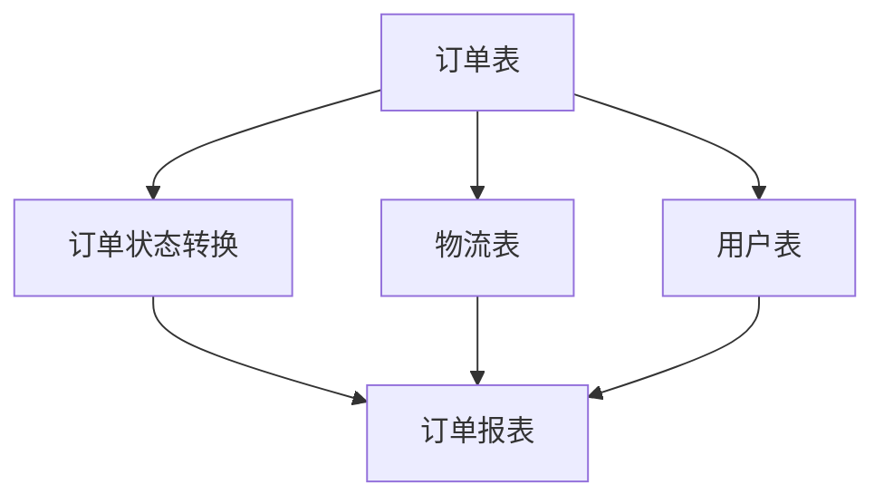
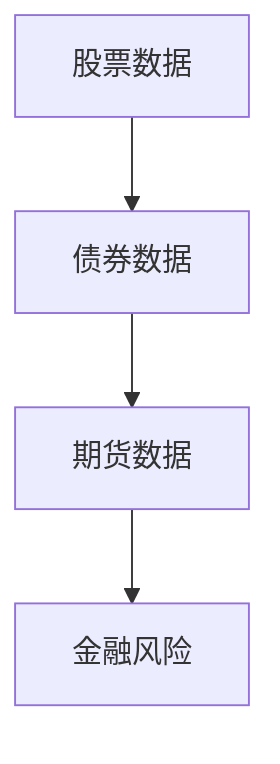
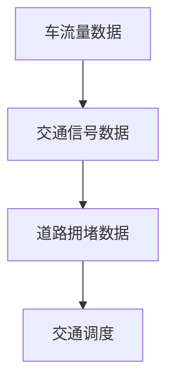
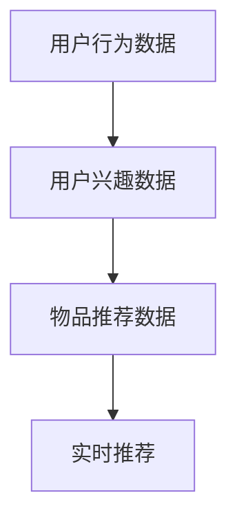

                 

# 数据流代替控制流：软件2.0架构的新思路

## 1. 背景介绍

### 1.1 问题由来

自20世纪60年代以来，程序控制流一直作为软件开发的核心基础。程序设计语言如C、Java、C++等均是基于控制流思想构建的，通过流程、循环、条件等语句组织代码逻辑。控制流范式具有结构清晰、逻辑性强等优点，也促进了计算机科学的快速发展。

然而，随着互联网、云计算、大数据等新技术的兴起，软件应用场景和用户需求日益复杂多变，传统控制流范式逐渐暴露出其局限性。首先，控制流范式将计算和数据分离，容易导致性能瓶颈，尤其是在多数据源融合和分布式计算场景下。其次，控制流范式对代码复用、组件化和自动化测试等软件开发实践存在制约，增加了软件开发成本。最后，控制流范式难以直接支持动态、异构、分布式等新型应用模式，限制了其应用范围。

为了应对这些挑战，近年来软件工程界开始探索新的软件架构范式，以数据流替代控制流，推动软件2.0时代的到来。数据流范式将数据和计算逻辑紧密结合，采用数据流驱动方式组织代码结构，适应了新应用场景的需求，具有良好的可扩展性和可维护性。

### 1.2 问题核心关键点

数据流范式与控制流范式的核心区别在于：
1. **数据和计算逻辑的分离**：控制流范式将计算逻辑和数据处理分离，数据流范式则将数据和计算逻辑紧密结合，通过数据流传递驱动计算逻辑。
2. **数据驱动的计算逻辑**：控制流范式通过条件、循环等语句控制计算逻辑，数据流范式则通过数据流的流动触发计算逻辑。
3. **松耦合的组件架构**：控制流范式依赖于语句执行顺序，难以实现组件之间的松耦合，数据流范式通过数据流传递实现组件间的松耦合。
4. **支持动态数据流**：控制流范式难以直接支持动态数据流，数据流范式则通过数据流的自动匹配和调度实现动态计算逻辑。
5. **易于自动化测试**：数据流范式易于通过数据流驱动的测试方式，自动化测试更容易实现，可提升软件质量。

## 2. 核心概念与联系

### 2.1 核心概念概述

为更好地理解数据流范式及其在软件开发中的应用，本节将介绍几个关键核心概念：

- 数据流（Dataflow）：指数据在程序中的流动和传递过程。数据流范式通过数据流传递驱动计算逻辑，实现松耦合、动态、异构的计算。
- 数据流模型（Dataflow Model）：描述数据流传递和计算逻辑的数据结构，如Dataflow Graph、Pipeline等。
- 数据流图（Dataflow Graph）：一种用于表示数据流传递和计算逻辑的图形结构，由数据流节点和计算节点组成。
- 数据管道（Data Pipeline）：一种高效的数据处理框架，通过数据流驱动方式实现数据加工、转换和传输。
- 流式计算（Streaming Computation）：指对流数据进行实时处理和分析的计算范式，如Apache Kafka、Apache Flink等。
- 数据流引擎（Dataflow Engine）：支持数据流计算的底层平台，如Google Dataflow、Apache Beam等。
- 事件驱动（Event-Driven）：通过事件触发计算逻辑的编程范式，如ReactiveX、RxJava等。

这些核心概念之间的逻辑关系可以通过以下Mermaid流程图来展示：

```mermaid
graph TB
    A[数据流 (Dataflow)] --> B[数据流模型 (Dataflow Model)]
    A --> C[数据流图 (Dataflow Graph)]
    C --> D[数据管道 (Data Pipeline)]
    A --> E[流式计算 (Streaming Computation)]
    E --> F[数据流引擎 (Dataflow Engine)]
    A --> G[事件驱动 (Event-Driven)]
```

这个流程图展示了数据流的核心概念及其相互关系：

1. 数据流是数据在程序中的流动和传递过程，通过数据流模型、数据流图等数据结构进行组织。
2. 数据流模型描述数据流传递和计算逻辑，通过数据流图实现计算逻辑的映射。
3. 数据管道是高效的数据处理框架，利用数据流驱动方式实现数据加工、转换和传输。
4. 流式计算是实时处理流数据的计算范式，通过数据流引擎实现高效的数据处理。
5. 事件驱动通过事件触发计算逻辑，实现松耦合的编程方式。

## 3. 核心算法原理 & 具体操作步骤

### 3.1 算法原理概述

数据流范式的核心思想是通过数据流传递驱动计算逻辑，实现松耦合、动态、异构的计算。具体而言，数据流范式将计算逻辑封装为函数，数据流传递驱动函数调用和执行。在数据流模型中，数据流节点表示数据源或数据目标，计算节点表示计算逻辑。数据流通过数据管道进行传递，数据管道负责数据的分片和调度。数据流引擎负责数据流的调度和管理，确保数据流正确、高效地传递和计算。

### 3.2 算法步骤详解

数据流范式的实现一般包括以下几个关键步骤：

**Step 1: 设计数据流模型**

- 分析任务需求和数据流传递逻辑，设计数据流模型。数据流模型通常由数据源、数据流管道、数据目标和计算节点组成。
- 选择合适的数据流图或数据管道框架，如TensorFlow Dataflow、Apache Beam、Apache Flink等。

**Step 2: 编写计算函数**

- 根据数据流模型设计计算函数，实现数据流的加工、转换和处理逻辑。计算函数可以是简单处理函数，也可以是大规模分布式计算任务。
- 确保计算函数具有良好的模块化和复用性，便于后续维护和扩展。

**Step 3: 配置数据流引擎**

- 选择合适的数据流引擎，如Google Dataflow、Apache Beam、Apache Flink等。
- 配置数据流引擎的参数，如任务并行度、数据分区、缓存策略等，优化数据流性能。

**Step 4: 提交数据流作业**

- 将数据流作业提交到数据流引擎，启动数据流计算。
- 监控数据流作业的执行状态和性能指标，确保数据流正确、高效地传递和计算。

**Step 5: 测试和优化**

- 对数据流作业进行自动化测试，验证数据流逻辑的正确性。
- 根据性能测试结果，对数据流作业进行优化，提高数据流处理效率。

### 3.3 算法优缺点

数据流范式具有以下优点：
1. **松耦合架构**：数据流范式通过数据流传递驱动计算逻辑，实现松耦合架构，便于组件复用和系统扩展。
2. **动态数据处理**：数据流范式支持动态数据流，能够适应多种数据源和数据流场景，灵活性高。
3. **高效数据处理**：数据流范式通过数据管道实现高效的数据传递和处理，减少数据冗余和重复计算。
4. **支持分布式计算**：数据流范式天然支持分布式计算，可以利用多节点资源，实现大规模计算任务。
5. **易于自动化测试**：数据流范式易于通过数据流驱动的测试方式，自动化测试更容易实现，可提升软件质量。

同时，数据流范式也存在一些缺点：
1. **学习成本高**：数据流范式与传统控制流范式差异较大，学习成本较高。
2. **开发复杂性高**：数据流范式的设计和实现相对复杂，需要丰富的经验和技术储备。
3. **调试困难**：数据流范式的调试需要关注数据流的传递和调度，复杂度较高。
4. **资源消耗高**：数据流范式需要配置大量的计算节点和存储资源，资源消耗较大。

尽管存在这些缺点，但数据流范式在处理大数据、分布式计算和实时流数据等方面具有独特的优势，适用于高复杂度和高并发的应用场景。

### 3.4 算法应用领域

数据流范式已经在多个领域得到了广泛应用，例如：

- 大数据处理：如Hadoop、Spark等分布式计算框架，通过数据流模型实现大规模数据处理。
- 流式计算：如Apache Kafka、Apache Flink等流式计算平台，通过数据流引擎实现实时数据处理和分析。
- 消息队列：如Apache Kafka、RabbitMQ等消息队列系统，通过数据流驱动方式实现数据传输和处理。
- 微服务架构：如Spring Cloud、Dubbo等微服务框架，通过数据流驱动方式实现服务间的松耦合和动态调用。
- 云计算平台：如AWS Lambda、Google Cloud Functions等云函数平台，通过数据流驱动方式实现函数执行和事件触发。
- 自动化流水线：如Jenkins、Travis CI等自动化测试平台，通过数据流驱动方式实现自动化测试和持续集成。

除了上述这些经典应用外，数据流范式也被创新性地应用到更多场景中，如区块链、物联网、边缘计算等，为复杂多变的应用场景提供了新的解决方案。随着数据流范式的不断演进，相信其在更多领域的应用将进一步拓展，成为软件开发的重要范式。

## 4. 数学模型和公式 & 详细讲解  
### 4.1 数学模型构建

数据流范式的数学模型通常由数据流图和计算函数组成。数据流图描述数据流传递和计算逻辑，计算函数实现数据流的加工和处理。

假设数据流图由N个数据流节点和M个计算函数组成，数据流传递遵循如下规则：

1. 数据流从源节点（Source Node）传递到计算节点（Compute Node）。
2. 每个计算节点最多接收一个数据流。
3. 数据流在计算节点内进行处理和转换，生成新的数据流。
4. 新的数据流传递到目标节点（Target Node）。

数据流范式的数学模型可以形式化表示为：

$$
G = (N, E, S, T, C)
$$

其中：
- $N$ 表示数据流节点集合，$|N| = N$。
- $E$ 表示数据流边集合，$|E| = M$。
- $S$ 表示源节点集合，$|S| = k$。
- $T$ 表示目标节点集合，$|T| = l$。
- $C$ 表示计算函数集合，$|C| = m$。

数据流的传递过程可以表示为：

$$
\mathcal{F} = \{(x, y)| x \in S, y \in C, (x, y) \in E\}
$$

其中 $(x, y)$ 表示从源节点 $x$ 传递到计算节点 $y$ 的数据流。

计算函数 $C$ 的输入为 $x$，输出为 $y$，形式化表示为：

$$
C = \{(x, y)| x \in S \cup C, y \in T \cup C\}
$$

其中 $x$ 表示输入，$y$ 表示输出。

### 4.2 公式推导过程

以下我们以数据流驱动的简单加减运算为例，推导数据流范式的数学模型和计算公式。

假设输入数据流为 $(x_1, x_2)$，计算函数为 $f(x_1, x_2) = x_1 + x_2$，输出数据流为 $y_1$。则数据流图可以表示为：

```mermaid
graph TB
    A[(x1, x2)] --> B[(f(x1, x2))] --> C[y1]
```

其中：
- $A$ 表示输入节点，$B$ 表示计算节点，$C$ 表示输出节点。
- $E$ 表示数据流边 $(x1, x2) \rightarrow (f(x1, x2))$。

数据流的传递过程可以表示为：

$$
\mathcal{F} = \{(x_1, x_2), (f(x_1, x_2), y_1)\}
$$

计算函数的输入和输出可以表示为：

$$
C = \{(x_1, y_1), (x_2, y_1)\}
$$

将计算函数 $f(x_1, x_2)$ 映射到数据流节点 $B$，数据流节点 $A$ 和 $C$ 分别映射到输入节点和输出节点，则数据流图可以表示为：

```mermaid
graph TB
    A[(x1, x2)] --> B[(f(x1, x2))] --> C[y1]
```

数据流范式的数学模型可以形式化表示为：

$$
G = (N, E, S, T, C)
$$

其中：
- $N = \{A, B, C\}$
- $E = \{(x_1, x_2) \rightarrow (f(x_1, x_2)), (f(x_1, x_2), y_1)\}$
- $S = \{A\}$
- $T = \{C\}$
- $C = \{f(x_1, x_2)\}$

### 4.3 案例分析与讲解

假设某电商平台的订单处理系统需要进行订单数据整合和计算。订单数据分为订单表、物流表和用户表，订单状态分为待发货、已发货和已收货三种状态。系统需要对订单数据进行整合和计算，生成订单报表。

设计数据流模型如图：



其中：
- $A$ 表示订单表，$B$ 表示订单状态转换，$C$ 表示订单报表。
- $D$ 表示物流表，$E$ 表示用户表。
- $E$ 表示物流表和用户表分别与订单表合并，生成订单表。
- $B$ 表示订单状态转换，根据订单状态生成订单报表。

数据流的传递和计算过程可以表示为：

$$
\mathcal{F} = \{(A, D), (A, E), (D, C), (E, C), (B, C)\}
$$

计算函数 $B$ 的输入为订单表，输出为订单报表，形式化表示为：

$$
C = \{(A, C), (B, C)\}
$$

其中 $(A, C)$ 表示订单表生成订单报表，$(B, C)$ 表示订单状态转换生成订单报表。

通过数据流驱动方式实现订单数据整合和计算，系统可以根据订单数据生成订单报表，便于电商平台对订单状态进行监控和管理。

## 5. 项目实践：代码实例和详细解释说明
### 5.1 开发环境搭建

在进行数据流范式实践前，我们需要准备好开发环境。以下是使用Python进行Apache Beam开发的环境配置流程：

1. 安装Apache Beam：从官网下载并安装Apache Beam，选择Python 3.x版本。

2. 创建并激活虚拟环境：
```bash
conda create -n beam-env python=3.8 
conda activate beam-env
```

3. 安装Apache Beam库：
```bash
pip install apache-beam[gcp]
```

4. 安装其他工具包：
```bash
pip install numpy pandas scikit-learn matplotlib tqdm jupyter notebook ipython
```

完成上述步骤后，即可在`beam-env`环境中开始数据流范式实践。

### 5.2 源代码详细实现

下面我们以电商订单处理系统为例，给出使用Apache Beam进行数据流范式实践的PyTorch代码实现。

首先，定义订单数据结构：

```python
import apache_beam as beam
from apache_beam.options.pipeline_options import PipelineOptions

class OrderData:
    def __init__(self, order_id, order_state):
        self.order_id = order_id
        self.order_state = order_state

    def __repr__(self):
        return f"OrderData(order_id={self.order_id}, order_state={self.order_state})"
```

然后，定义数据流模型：

```python
class OrderPipeline(Pipeline):
    def __init__(self, pipeline_options):
        super().__init__(pipeline_options)

    def run(self):
        with self as p:
            orders = p | "Read from order table" >> ReadOrderTable()
            shipping = orders | "Map to shipping table" >> beam.Map(lambda x: (x.order_id, x.order_state))
            customers = orders | "Map to customer table" >> beam.Map(lambda x: (x.order_id, x.order_state))
            joined = beam.CombinePerKey(lambda x, y: x + y) \
                .given_type(OrderData) \
                .output_type(OrderData)
            result = joined | "Join tables" >> beam.CoGroupByKey() \
                | "Map to order report" >> beam.Map(lambda x, y: OrderData(x[0], x[1] + y[1]))
            result | "Write to output table" >> WriteOrderReport()

# 订单表读取
class ReadOrderTable(beam.DoFn):
    def process(self, element):
        yield OrderData(element[0], element[1])

# 订单表写入
class WriteOrderReport(beam.DoFn):
    def process(self, element):
        # 在这里进行订单报表的写入操作
        pass

# 测试数据
orders = [OrderData(1, "待发货"), OrderData(2, "已发货"), OrderData(3, "已收货")]
pipeline_options = PipelineOptions()
pipeline = OrderPipeline(pipeline_options)
pipeline.run().wait_until_finish()
```

接下来，编写计算函数：

```python
class OrderStateChange(beam.DoFn):
    def process(self, element):
        yield OrderData(element.order_id, element.order_state + "转换")
```

最后，配置数据流引擎并提交作业：

```python
pipeline_options = PipelineOptions()
pipeline = OrderPipeline(pipeline_options)
pipeline.run().wait_until_finish()
```

以上就是使用Apache Beam对电商订单处理系统进行数据流范式实践的完整代码实现。可以看到，Apache Beam提供的API非常简洁，通过简单的管道操作，即可实现复杂的数据流计算。

### 5.3 代码解读与分析

让我们再详细解读一下关键代码的实现细节：

**OrderData类**：
- `__init__`方法：初始化订单ID和订单状态。
- `__repr__`方法：打印订单数据的字符串表示。

**OrderPipeline类**：
- `__init__`方法：初始化Pipeline对象，用于配置数据流作业。
- `run`方法：启动数据流作业，包括数据读取、转换和写入等操作。

**ReadOrderTable类**：
- 继承自`DoFn`类，用于定义数据流模型的输入函数。
- `process`方法：对订单表进行读取，生成订单数据流。

**WriteOrderReport类**：
- 继承自`DoFn`类，用于定义数据流模型的输出函数。
- `process`方法：对订单报表进行写入操作。

**OrderStateChange类**：
- 继承自`DoFn`类，用于定义订单状态转换的计算函数。
- `process`方法：对订单状态进行转换，生成新的订单数据流。

**pipeline_options**：
- 配置PipelineOptions，设置作业运行参数。

**pipeline**：
- 实例化OrderPipeline对象，启动数据流作业。

通过以上代码，我们可以对电商订单数据进行整合和计算，生成订单报表，实现数据流范式的应用。

当然，工业级的系统实现还需考虑更多因素，如数据的正确性、性能的优化、异常的监控等。但核心的数据流范式基本与此类似。

## 6. 实际应用场景
### 6.1 金融风险管理

金融风险管理是数据流范式的重要应用场景之一。传统的金融风险管理依赖于规则和专家经验，难以应对复杂多变的金融市场。数据流范式通过实时流数据处理，能够及时监测市场波动，预测风险趋势，辅助决策。

具体而言，可以收集金融市场的实时数据，包括股票、债券、期货等，通过数据流驱动方式进行实时分析和处理。设计数据流模型如图：



其中：
- $A$ 表示股票数据，$B$ 表示债券数据，$C$ 表示期货数据。
- $D$ 表示金融风险。

数据流的传递和计算过程可以表示为：

$$
\mathcal{F} = \{(A, D), (B, D), (C, D)\}
$$

计算函数 $D$ 的输入为股票数据、债券数据和期货数据，输出为金融风险，形式化表示为：

$$
C = \{(A, D), (B, D), (C, D)\}
$$

其中 $(A, D)$ 表示股票数据计算金融风险，$(B, D)$ 表示债券数据计算金融风险，$(C, D)$ 表示期货数据计算金融风险。

通过数据流驱动方式实现金融风险管理，系统能够实时监测市场波动，预测风险趋势，辅助决策，提升金融风险管理的智能化水平。

### 6.2 智能城市交通

智能城市交通是数据流范式的另一个重要应用场景。传统的交通管理系统依赖于人工调度，无法实时响应交通状况。数据流范式通过实时流数据处理，能够及时获取交通数据，优化交通调度，提升城市交通管理效率。

具体而言，可以收集城市道路的实时交通数据，包括车流量、交通信号、道路拥堵等，通过数据流驱动方式进行实时分析和处理。设计数据流模型如图：



其中：
- $A$ 表示车流量数据，$B$ 表示交通信号数据，$C$ 表示道路拥堵数据。
- $D$ 表示交通调度。

数据流的传递和计算过程可以表示为：

$$
\mathcal{F} = \{(A, D), (B, D), (C, D)\}
$$

计算函数 $D$ 的输入为车流量数据、交通信号数据和道路拥堵数据，输出为交通调度，形式化表示为：

$$
C = \{(A, D), (B, D), (C, D)\}
$$

其中 $(A, D)$ 表示车流量数据计算交通调度，$(B, D)$ 表示交通信号数据计算交通调度，$(C, D)$ 表示道路拥堵数据计算交通调度。

通过数据流驱动方式实现智能城市交通管理，系统能够实时获取交通数据，优化交通调度，提升城市交通管理效率。

### 6.3 实时推荐系统

实时推荐系统是数据流范式的另一大应用场景。传统的推荐系统依赖于用户历史行为数据，难以应对新用户或新物品的推荐需求。数据流范式通过实时流数据处理，能够及时获取用户行为数据，生成实时推荐结果。

具体而言，可以收集用户实时行为数据，包括浏览、点击、购买等，通过数据流驱动方式进行实时分析和处理。设计数据流模型如图：



其中：
- $A$ 表示用户行为数据，$B$ 表示用户兴趣数据，$C$ 表示物品推荐数据。
- $D$ 表示实时推荐。

数据流的传递和计算过程可以表示为：

$$
\mathcal{F} = \{(A, D), (B, D), (C, D)\}
$$

计算函数 $D$ 的输入为用户行为数据、用户兴趣数据和物品推荐数据，输出为实时推荐，形式化表示为：

$$
C = \{(A, D), (B, D), (C, D)\}
$$

其中 $(A, D)$ 表示用户行为数据计算实时推荐，$(B, D)$ 表示用户兴趣数据计算实时推荐，$(C, D)$ 表示物品推荐数据计算实时推荐。

通过数据流驱动方式实现实时推荐系统，系统能够及时获取用户行为数据，生成实时推荐结果，提升推荐系统的智能性和时效性。

### 6.4 未来应用展望

随着数据流范式的不断发展，其在更多领域的应用将进一步拓展，为复杂多变的应用场景提供新的解决方案。

在智慧医疗领域，数据流范式可应用于患者诊断、药物推荐、病情监控等环节，通过实时流数据处理，辅助医生诊断和治疗。

在智能制造领域，数据流范式可应用于生产线监控、设备维护、质量控制等环节，通过实时流数据处理，优化生产流程，提升生产效率和产品质量。

在智慧农业领域，数据流范式可应用于土壤监测、作物生长预测、田间管理等环节，通过实时流数据处理，提高农业生产的智能化水平。

此外，在智慧能源、智能交通、智能安防等众多领域，数据流范式也将不断得到应用，为社会和经济的发展注入新的动力。相信随着数据流范式的不断演进，其在更多领域的应用将进一步拓展，成为软件开发的重要范式。

## 7. 工具和资源推荐
### 7.1 学习资源推荐

为了帮助开发者系统掌握数据流范式的理论基础和实践技巧，这里推荐一些优质的学习资源：

1. Apache Beam官方文档：Apache Beam的官方文档，提供了详细的使用指南和样例代码，是学习和实践数据流范式的必备资料。

2. Kafka Streams官方文档：Apache Kafka Streams的官方文档，介绍了流式计算的基本概念和应用场景，适合初学入门。

3. TensorFlow Dataflow官方文档：TensorFlow Dataflow的官方文档，提供了数据流驱动的数据处理范式，适合TensorFlow开发者学习。

4. ReactiveX官方文档：ReactiveX的官方文档，介绍了事件驱动编程的基本概念和应用场景，适合学习事件驱动范式。

5. RxJava官方文档：RxJava的官方文档，介绍了流式编程的基本概念和应用场景，适合Java开发者学习。

6. Apache Spark官方文档：Apache Spark的官方文档，介绍了分布式计算的基本概念和应用场景，适合大数据开发者学习。

通过对这些资源的学习实践，相信你一定能够快速掌握数据流范式的精髓，并用于解决实际的NLP问题。
###  7.2 开发工具推荐

高效的开发离不开优秀的工具支持。以下是几款用于数据流范式开发的常用工具：

1. Apache Beam：Apache基金会开源的数据流处理框架，支持多种编程语言和数据源，是数据流范式的首选工具。

2. Apache Kafka Streams：Apache基金会开源的流式计算框架，通过流式计算方式实现数据处理，支持实时数据流处理。

3. Apache Flink：Apache基金会开源的流式计算框架，支持大规模数据流处理，具有高性能和低延迟的特点。

4. TensorFlow Dataflow：Google开源的数据流处理框架，通过TensorFlow引擎实现数据流驱动的数据处理。

5. Google Cloud Dataflow：Google提供的云数据流处理服务，支持大规模数据流处理，具有自动扩展和高可用性。

6. Apache Storm：Apache基金会开源的流式计算框架，支持多种数据源和流式计算模型，适合实时数据处理。

合理利用这些工具，可以显著提升数据流范式开发的效率，加快创新迭代的步伐。

### 7.3 相关论文推荐

数据流范式的发展源于学界的持续研究。以下是几篇奠基性的相关论文，推荐阅读：

1. "Pipelined Distributed Dataflow Systems"：Stefano Alfieri和Thomas Fox 提出的数据流驱动的分布式计算模型，奠定了数据流范式的理论基础。

2. "Data-parallel MapReduce: Simplified Dataflow"：Dean和Ghemawat提出的MapReduce模型，通过数据流驱动方式实现分布式计算，成为大数据处理的经典模型。

3. "Streaming Distributed Data Processing"：Michael Stonebraker提出的流式数据处理模型，推动了流式计算和大数据处理的发展。

4. "Dataflow: A Model for Efficient Computations"：David Padua提出的数据流模型，描述了数据流驱动的计算逻辑，成为数据流范式的重要参考。

5. "Event Stream Processing: A Logical Framework for Highly Scalable Data Processing"：Kenneth A. Cargill提出的事件流处理模型，推动了事件驱动编程的发展。

这些论文代表了大数据处理和数据流范式的发展脉络。通过学习这些前沿成果，可以帮助研究者把握学科前进方向，激发更多的创新灵感。

## 8. 总结：未来发展趋势与挑战

### 8.1 总结

本文对数据流范式及其在软件开发中的应用进行了全面系统的介绍。首先阐述了数据流范式的基本原理和核心思想，明确了数据流范式在处理大数据、分布式计算和实时流数据等方面的独特优势。其次，从原理到实践，详细讲解了数据流范式的数学模型和关键步骤，给出了数据流范式的完整代码实例。同时，本文还广泛探讨了数据流范式在金融风险管理、智能城市交通、实时推荐系统等多个领域的应用前景，展示了数据流范式的广泛应用潜力。此外，本文精选了数据流范式的各类学习资源，力求为读者提供全方位的技术指引。

通过本文的系统梳理，可以看到，数据流范式正在成为软件开发的重要范式，极大地拓展了数据处理的应用边界，提升了数据处理的灵活性和可扩展性。未来，伴随数据流范式的不断演进，相信其在更多领域的应用将进一步拓展，成为软件开发的重要工具。

### 8.2 未来发展趋势

展望未来，数据流范式将呈现以下几个发展趋势：

1. **多源数据融合**：数据流范式将支持多源数据融合，通过数据流驱动方式实现跨数据源的数据处理和分析，提升数据处理的灵活性和可扩展性。

2. **流式计算优化**：数据流范式将进一步优化流式计算的性能，支持更高效的流数据处理和实时分析，适应高并发和大规模数据流的处理需求。

3. **数据流引擎扩展**：数据流范式将进一步扩展数据流引擎的能力，支持更多数据源和处理框架，提升数据处理的多样性和灵活性。

4. **实时数据分析**：数据流范式将进一步提升实时数据分析的能力，支持更快速、更准确的数据处理和分析，提升数据处理的效率和精度。

5. **智能化决策支持**：数据流范式将进一步结合机器学习和人工智能技术，提供更智能化的决策支持，提升数据处理的智能化水平。

6. **自动化运维管理**：数据流范式将进一步支持自动化运维管理，通过数据流驱动方式实现自动化的数据处理和监控，提升数据处理的稳定性和可靠性。

以上趋势凸显了数据流范式的广泛应用前景。这些方向的探索发展，必将进一步提升数据处理的能力和应用范围，为各行各业带来新的技术突破。

### 8.3 面临的挑战

尽管数据流范式在数据处理领域具有显著优势，但在实际应用中仍面临诸多挑战：

1. **学习曲线陡峭**：数据流范式与传统控制流范式差异较大，学习曲线较陡峭，需要开发者具备较强的编程和数据处理能力。

2. **性能优化复杂**：数据流范式的性能优化相对复杂，需要开发者具备深入的性能调优能力。

3. **资源消耗高**：数据流范式需要配置大量的计算节点和存储资源，资源消耗较大，需要高效的数据流引擎和资源管理机制。

4. **调试困难**：数据流范式的调试需要关注数据流的传递和调度，复杂度较高，需要开发者的综合能力。

5. **异常处理复杂**：数据流范式的异常处理相对复杂，需要开发者具备丰富的异常处理经验。

尽管存在这些挑战，但数据流范式在处理大数据、分布式计算和实时流数据等方面具有独特的优势，适用于高复杂度和高并发的应用场景。

### 8.4 研究展望

未来的研究需要在以下几个方面寻求新的突破：

1. **多模态数据融合**：将视觉、语音、文本等多种模态的数据进行融合，提升数据处理的全面性和准确性。

2. **自动化数据治理**：通过数据流驱动方式实现数据治理，自动检测、清洗、标注和整合数据，提升数据处理的自动化水平。

3. **智能数据治理**：通过机器学习和人工智能技术，实现数据的智能治理，提升数据处理的智能化水平。

4. **数据流安全**：在数据流驱动的数据处理过程中，保障数据的安全性和隐私性，提升数据处理的可靠性。

5. **数据流可视化**：通过数据流可视化工具，展示数据流的传递和计算过程，提升数据处理的可解释性和可理解性。

6. **分布式数据管理**：通过数据流驱动方式实现分布式数据管理，支持多数据源的数据融合和处理，提升数据处理的可扩展性。

这些研究方向的探索，必将引领数据流范式向更高的台阶发展，为大数据处理和数据流计算提供新的解决方案。面向未来，数据流范式还需要与其他人工智能技术进行更深入的融合，如因果推理、强化学习等，共同推动数据处理技术的进步。只有勇于创新、敢于突破，才能不断拓展数据流范式的边界，为各行各业带来新的技术突破。

## 9. 附录：常见问题与解答

**Q1：数据流范式与控制流范式有何区别？**

A: 数据流范式与控制流范式的主要区别在于数据和计算逻辑的分离和组合方式。控制流范式通过条件、循环等语句控制计算逻辑，而数据流范式通过数据流的传递和调度驱动计算逻辑，实现松耦合、动态、异构的计算。

**Q2：数据流范式的学习曲线是否较陡峭？**

A: 是的。数据流范式与传统控制流范式差异较大，需要开发者具备较强的编程和数据处理能力。建议在学习和实践数据流范式时，先掌握控制流范式的知识，再逐步学习和掌握数据流范式。

**Q3：数据流范式的性能优化是否复杂？**

A: 是的。数据流范式的性能优化相对复杂，需要开发者具备深入的性能调优能力。建议关注数据流的传递和调度，优化数据流的管道和计算函数，提高数据处理效率。

**Q4：数据流范式的资源消耗是否较高？**

A: 是的。数据流范式需要配置大量的计算节点和存储资源，资源消耗较大。建议合理配置资源，使用高效的数据流引擎和资源管理机制。

**Q5：数据流范式的调试是否困难？**

A: 是的。数据流范式的调试需要关注数据流的传递和调度，复杂度较高。建议在调试时，关注数据流的传递路径，检查数据流的正确性和完整性。

通过以上问题的回答，相信你能够更加全面地了解数据流范式的特点和应用场景，掌握数据流范式的实践技巧。希望本文能为你提供有价值的参考和指导，促进数据流范式在更多领域的广泛应用。

---

作者：禅与计算机程序设计艺术 / Zen and the Art of Computer Programming

