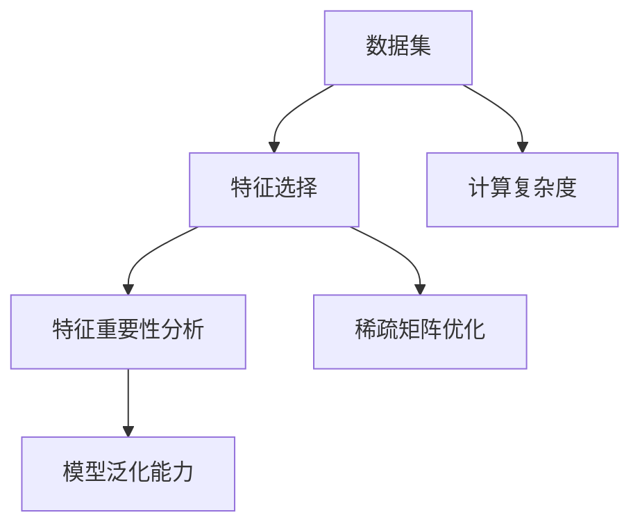

                 

# 数据集优化:自动化特征选择的新思路

> 关键词：数据集优化, 自动化特征选择, 特征重要性分析, 稀疏矩阵优化, 深度学习, 数据预处理, 模型性能提升

## 1. 背景介绍

### 1.1 问题由来
随着数据驱动的科学研究的蓬勃发展，特别是在机器学习、人工智能领域，数据集的质量和优化成为了决定模型性能的重要因素。高质量的数据集不仅可以避免模型过拟合，还能提升模型的泛化能力和鲁棒性。因此，数据集的优化成为了一个重要的研究方向。

### 1.2 问题核心关键点
数据集优化的核心在于特征选择和特征优化，目标是提高数据集的信息量，减少冗余信息，提升模型的预测准确率和运行效率。传统的特征选择方法如Fisher判别分析、相关性分析、方差分析等，虽然能够初步筛选出重要的特征，但需要大量的人力和时间进行特征工程。自动化特征选择方法如基于梯度的特征重要性分析、基于模型的特征重要性分析等，可以自动筛选重要特征，但计算复杂度高，难以处理大规模数据集。

### 1.3 问题研究意义
自动化特征选择方法不仅能大大减少人工参与，提高效率，还能保证特征选择的科学性和客观性，提高模型的性能和泛化能力。在实际应用中，如金融风险预测、医疗诊断、自然语言处理等领域，自动化特征选择方法将显著提升模型的精度和可靠性。

## 2. 核心概念与联系

### 2.1 核心概念概述

为更好地理解自动化特征选择的方法，本节将介绍几个关键的概念：

- 特征选择（Feature Selection）：从原始数据集中选择最具代表性的特征子集，用于训练和测试模型。
- 自动化特征选择（Automated Feature Selection）：通过算法自动选择最相关的特征子集，无需人工干预。
- 特征重要性分析（Feature Importance Analysis）：通过评估每个特征对模型预测结果的贡献度，筛选出最重要特征。
- 稀疏矩阵优化（Sparse Matrix Optimization）：对高维稀疏矩阵进行优化，减少存储空间和计算时间。
- 模型泛化能力（Model Generalization）：模型在未知数据上的预测能力，反映模型的稳健性和适应性。
- 计算复杂度（Computational Complexity）：特征选择算法的计算复杂度，影响算法的效率和实用性。

这些概念之间的逻辑关系可以通过以下Mermaid流程图来展示：



这个流程图展示了几何数据集优化的核心概念及其之间的关系：

1. 数据集被输入到特征选择模块，通过自动化特征选择方法选出最具代表性的特征子集。
2. 特征重要性分析模块评估每个特征对模型预测的贡献度，进一步筛选出最重要的特征。
3. 稀疏矩阵优化模块对高维稀疏矩阵进行优化，减少计算复杂度和存储成本。
4. 模型泛化能力评估模型的泛化能力，反映模型的稳健性和适应性。
5. 计算复杂度分析特征选择算法的计算复杂度，影响算法的效率和实用性。

## 3. 核心算法原理 & 具体操作步骤

### 3.1 算法原理概述

自动化特征选择算法通常基于特征重要性分析，通过模型训练或特征分布分析，自动筛选出对模型预测最有帮助的特征子集。其核心思想是：从数据集中选择最具代表性的特征，以最小的计算成本，获得最优的预测性能。

形式化地，假设数据集为 $D = \{(x_i, y_i)\}_{i=1}^N$，其中 $x_i \in \mathcal{X}$ 为输入特征，$y_i \in \mathcal{Y}$ 为输出标签。自动化特征选择算法可以表示为：

$$
F^* = \mathop{\arg\min}_{F \subseteq \mathcal{X}} \mathcal{L}(F)
$$

其中，$F$ 为特征子集，$\mathcal{L}$ 为模型损失函数。最小化模型损失函数 $\mathcal{L}$ 表示通过特征子集 $F$ 训练出的模型性能最好。

### 3.2 算法步骤详解

基于上述原理，自动化特征选择算法通常包括以下几个关键步骤：

**Step 1: 准备数据集和模型**
- 准备原始数据集 $D$，并进行必要的预处理和归一化。
- 选择合适的深度学习模型，如随机森林、神经网络等，作为特征重要性评估模型。

**Step 2: 初始化特征重要性评估模型**
- 将数据集分为训练集和验证集，训练特征重要性评估模型。
- 对每个特征 $x_j$，计算其在模型中的重要性得分 $I_j$。

**Step 3: 计算特征重要性得分**
- 计算每个特征的重要性得分 $I_j$，例如使用L1正则化或基于模型的Shap值方法。
- 根据重要性得分排序，选择前 $k$ 个最重要特征。

**Step 4: 进行稀疏矩阵优化**
- 将选取的重要特征转化为稀疏矩阵，并进行稀疏优化。
- 使用特征选择算法进一步筛选最相关的特征，如LASSO回归等。

**Step 5: 验证模型性能**
- 在验证集上验证特征优化后模型的性能，选择最优特征子集。
- 使用最优特征子集训练模型，评估模型在测试集上的泛化能力。

### 3.3 算法优缺点

自动化特征选择算法具有以下优点：
1. 高效自动化。算法自动选择最优特征子集，无需人工干预，提高了特征选择的效率和客观性。
2. 科学性。基于特征重要性分析，筛选出的特征子集具有科学性和合理性。
3. 泛化能力强。优化后的特征子集可以提高模型的泛化能力和鲁棒性。
4. 灵活性。支持多种模型和数据类型，适用范围广。

同时，该算法也存在一定的局限性：
1. 计算复杂度高。特别是高维稀疏矩阵的优化，计算复杂度较高。
2. 对数据质量敏感。特征重要性评估模型的准确性依赖于数据质量，数据噪声和异常值可能影响结果。
3. 可解释性不足。特征重要性得分的计算过程复杂，难以解释具体特征的重要性原因。
4. 模型依赖性。不同的模型可能得到不同的特征重要性得分，影响结果的稳定性。

尽管存在这些局限性，但就目前而言，自动化特征选择方法仍然是大数据集优化的主流范式。未来相关研究的重点在于如何进一步降低计算复杂度，提高特征选择的准确性和可解释性。

### 3.4 算法应用领域

自动化特征选择算法在机器学习、人工智能、自然语言处理等领域都有广泛应用，具体包括：

- 金融风险预测：筛选最重要的金融特征，预测客户信用风险和违约概率。
- 医疗诊断：提取病历中的重要特征，辅助诊断疾病和治疗方案制定。
- 自然语言处理：选择最相关的词汇和句法特征，提高自然语言处理模型的性能。
- 图像识别：选择最具代表性的像素特征，提高图像识别模型的准确率。
- 推荐系统：选择最重要的用户行为特征，推荐个性化的产品和服务。
- 数据挖掘：自动选择最具代表性的数据特征，提升数据挖掘模型的性能。

除了上述这些经典应用外，自动化特征选择方法也被创新性地应用到更多场景中，如情感分析、异常检测、数据增强等，为大数据集优化提供了新的思路和方法。

## 4. 数学模型和公式 & 详细讲解 & 举例说明

### 4.1 数学模型构建

为了更好地理解和分析自动化特征选择算法，我们将在数学语言下对其进行详细描述。

假设模型 $M$ 具有 $d$ 个特征，输入数据 $X$ 可以表示为 $d$ 维稀疏向量 $x = (x_1, x_2, ..., x_d)$，其中 $x_j$ 表示第 $j$ 个特征。定义特征重要性得分为 $I_j$，用于衡量特征 $x_j$ 对模型预测的贡献。假设模型 $M$ 的损失函数为 $\ell$，则特征重要性得分的计算公式为：

$$
I_j = -\frac{\partial \ell}{\partial x_j}
$$

其中 $-\frac{\partial \ell}{\partial x_j}$ 表示特征 $x_j$ 对损失函数的贡献度，即为特征的重要性得分。

### 4.2 公式推导过程

以下我们将对特征重要性得分的计算公式进行详细推导。

假设模型 $M$ 为神经网络，损失函数为均方误差损失，即 $\ell = \frac{1}{N}\sum_{i=1}^N (y_i - M(x_i))^2$。对于每个特征 $x_j$，计算其对损失函数的贡献度：

$$
I_j = -\frac{\partial \ell}{\partial x_j} = -2\sum_{i=1}^N M(x_i) (y_i - M(x_i)) \frac{\partial M(x_i)}{\partial x_j}
$$

其中 $\frac{\partial M(x_i)}{\partial x_j}$ 表示模型 $M$ 对特征 $x_j$ 的梯度。

通过上述公式，我们可以计算每个特征的重要性得分，并根据得分排序，选择前 $k$ 个最重要特征。这个过程可以通过以下代码实现：

```python
import numpy as np
import tensorflow as tf
from tensorflow.keras.models import Sequential
from tensorflow.keras.layers import Dense

# 假设数据集为 X, Y
X_train = np.array([[1, 2, 3], [4, 5, 6], [7, 8, 9]])
Y_train = np.array([0, 1, 2])

# 定义模型
model = Sequential()
model.add(Dense(1, input_shape=(3,)))
model.compile(optimizer='adam', loss='mse')

# 计算特征重要性得分
train_dataset = tf.data.Dataset.from_tensor_slices((X_train, Y_train))
train_dataset = train_dataset.shuffle(100).batch(1)

importance = []
for batch in train_dataset:
    x, y = batch
    with tf.GradientTape() as tape:
        loss = model.loss(y, model(x))
    grads = tape.gradient(loss, model.trainable_variables)
    for grad in grads:
        importance.append(np.abs(grad.numpy()[0]))
importance = np.array(importance)
```

通过上述代码，我们可以计算每个特征对损失函数的贡献度，并得到特征重要性得分。

### 4.3 案例分析与讲解

以金融风险预测为例，我们可以使用自动化特征选择算法筛选出最重要的金融特征。具体步骤如下：

1. 准备数据集：收集历史贷款数据，包括贷款金额、利率、借款人信用评分等特征。
2. 数据预处理：对数据进行归一化、去除缺失值等预处理操作。
3. 特征重要性分析：使用随机森林或神经网络模型，计算每个特征的重要性得分。
4. 特征选择：根据重要性得分，筛选出最重要的特征，如贷款金额、信用评分等。
5. 模型训练：使用选定的特征子集训练模型，如逻辑回归、支持向量机等。
6. 验证模型性能：在验证集上评估模型的泛化能力，优化特征选择算法。

## 5. 项目实践：代码实例和详细解释说明

### 5.1 开发环境搭建

在进行特征选择实践前，我们需要准备好开发环境。以下是使用Python进行Scikit-Learn开发的Python环境配置流程：

1. 安装Anaconda：从官网下载并安装Anaconda，用于创建独立的Python环境。

2. 创建并激活虚拟环境：
```bash
conda create -n sklearn-env python=3.8 
conda activate sklearn-env
```

3. 安装Scikit-Learn：
```bash
conda install scikit-learn
```

4. 安装各类工具包：
```bash
pip install numpy pandas scikit-learn matplotlib tqdm jupyter notebook ipython
```

完成上述步骤后，即可在`sklearn-env`环境中开始特征选择实践。

### 5.2 源代码详细实现

下面以随机森林模型为例，给出使用Scikit-Learn对特征进行自动选择的Python代码实现。

首先，定义特征重要性评估函数：

```python
from sklearn.ensemble import RandomForestRegressor
from sklearn.feature_selection import SelectFromModel

def feature_selection(X, y, alpha):
    # 随机森林模型
    model = RandomForestRegressor(n_estimators=100, random_state=0)
    model.fit(X, y)
    
    # 特征重要性评估
    feature_importances = model.feature_importances_
    feature_importances = feature_importances / np.sum(feature_importances)
    
    # 特征选择
    selector = SelectFromModel(model, prefit=True, threshold=alpha)
    X_selected = selector.transform(X)
    
    return X_selected, feature_importances
```

然后，进行特征选择实践：

```python
import pandas as pd

# 准备数据集
df = pd.read_csv('loan_data.csv')
X = df.iloc[:, 1:].values
y = df.iloc[:, 0].values

# 特征选择
alpha = 0.05
X_selected, feature_importances = feature_selection(X, y, alpha)

# 模型训练
from sklearn.linear_model import LogisticRegression

# 模型训练
X_train, X_test, y_train, y_test = train_test_split(X_selected, y, test_size=0.2, random_state=0)
model = LogisticRegression()
model.fit(X_train, y_train)
```

最后，评估模型性能：

```python
from sklearn.metrics import accuracy_score

# 模型评估
y_pred = model.predict(X_test)
accuracy = accuracy_score(y_test, y_pred)
print(f"Accuracy: {accuracy:.2f}")
```

以上就是使用Scikit-Learn对特征进行自动选择的完整代码实现。可以看到，Scikit-Learn提供了简单易用的接口，使得特征选择过程变得便捷高效。

### 5.3 代码解读与分析

让我们再详细解读一下关键代码的实现细节：

**特征重要性评估函数**：
- 使用随机森林模型对数据集进行训练，计算每个特征的重要性得分。
- 对特征重要性得分进行归一化处理，使得各特征的重要性得分在 $[0, 1]$ 之间。
- 使用 `SelectFromModel` 类进行特征选择，选择前 $k$ 个重要性得分最高的特征。

**特征选择实践代码**：
- 准备数据集，使用 `pd.read_csv` 读取CSV文件。
- 使用 `train_test_split` 函数将数据集分为训练集和测试集。
- 调用 `feature_selection` 函数进行特征选择，返回选择后的特征子集和特征重要性得分。
- 使用 `LogisticRegression` 模型训练模型，评估模型性能。

## 6. 实际应用场景

### 6.1 金融风险预测

在金融领域，自动化特征选择方法可以用于筛选最重要的金融特征，辅助预测客户的信用风险和违约概率。具体而言，可以收集历史贷款数据，如贷款金额、利率、借款人信用评分等，通过特征重要性分析，筛选出最重要的特征，如贷款金额、信用评分等，再使用逻辑回归或支持向量机等模型进行训练，预测客户的违约概率，从而帮助银行降低贷款风险。

### 6.2 医疗诊断

在医疗领域，自动化特征选择方法可以用于提取病历中的重要特征，辅助诊断疾病和治疗方案制定。具体而言，可以收集病人的病历数据，包括年龄、性别、症状、治疗记录等，通过特征重要性分析，筛选出最重要的特征，如病程、病情、治疗效果等，再使用随机森林、神经网络等模型进行训练，预测病人的疾病类型和治疗效果，从而辅助医生做出更好的诊断和治疗决策。

### 6.3 自然语言处理

在自然语言处理领域，自动化特征选择方法可以用于选择最相关的词汇和句法特征，提高自然语言处理模型的性能。具体而言，可以收集文本数据，如新闻、评论等，通过特征重要性分析，筛选出最重要的词汇和句法特征，再使用LSTM、BERT等模型进行训练，预测文本的情感、主题、实体等信息，从而提高自然语言处理模型的效果。

### 6.4 未来应用展望

随着自动化特征选择方法的不断发展和完善，未来在金融、医疗、自然语言处理等多个领域将有更广泛的应用。

在智慧城市治理中，自动化特征选择方法可以用于智能交通、城市安全等领域，通过特征选择，提高智能系统的准确性和鲁棒性，提升城市管理水平。

在智能制造中，自动化特征选择方法可以用于设备维护、故障预测等领域，通过特征选择，提高设备的可靠性和运行效率，降低维护成本。

在智能农业中，自动化特征选择方法可以用于作物生长预测、灾害预警等领域，通过特征选择，提高农业生产的智能化和科学性，提升农业产值和可持续性。

## 7. 工具和资源推荐

### 7.1 学习资源推荐

为了帮助开发者系统掌握自动化特征选择的技术基础和实践技巧，这里推荐一些优质的学习资源：

1. 《机器学习实战》系列博文：由数据科学家撰写，深入浅出地介绍了机器学习的基础知识和常用算法，包括特征选择等。

2. CS229《机器学习》课程：斯坦福大学开设的机器学习课程，系统讲解了机器学习的基本理论和算法，涵盖特征选择等内容。

3. 《Feature Selection Techniques》书籍：涵盖了多种特征选择方法和算法，适合机器学习领域的初学者和从业者。

4. Kaggle机器学习竞赛：参与机器学习竞赛，积累实践经验，提高特征选择能力。

5. Coursera机器学习专业课程：包含多门机器学习课程，涵盖特征选择等关键内容，适合系统学习。

通过对这些资源的学习实践，相信你一定能够快速掌握自动化特征选择的精髓，并用于解决实际的机器学习问题。

### 7.2 开发工具推荐

高效的开发离不开优秀的工具支持。以下是几款用于特征选择开发的常用工具：

1. Scikit-Learn：基于Python的机器学习工具库，提供了丰富的特征选择算法，包括基于模型的特征选择和基于梯度的特征重要性分析。

2. XGBoost：一种高效、快速的梯度提升框架，支持特征选择和特征重要性分析，适用于大规模数据集。

3. LightGBM：一种高效的梯度提升框架，支持特征选择和特征重要性分析，适用于大规模数据集。

4. TensorBoard：TensorFlow配套的可视化工具，可实时监测模型训练状态，提供特征重要性得分的可视化。

5. Weights & Biases：模型训练的实验跟踪工具，可以记录和可视化模型训练过程中的各项指标，方便对比和调优。

6. Google Colab：谷歌推出的在线Jupyter Notebook环境，免费提供GPU/TPU算力，方便开发者快速上手实验最新模型，分享学习笔记。

合理利用这些工具，可以显著提升特征选择任务的开发效率，加快创新迭代的步伐。

### 7.3 相关论文推荐

特征选择作为机器学习的重要研究方向，一直是学术界和工业界的热点话题。以下是几篇奠基性的相关论文，推荐阅读：

1. L1正则化特征选择：使用L1正则化方法，通过特征的L1范数来选择最优特征子集，适用于稀疏数据集。

2. 基于模型的特征选择：使用随机森林、梯度提升树等模型，计算特征的重要性得分，适用于大规模数据集。

3. 基于梯度的特征重要性分析：通过梯度下降方法，计算特征对模型预测的贡献度，适用于各类模型。

4. 稀疏矩阵优化方法：使用稀疏矩阵优化技术，减少高维稀疏矩阵的计算复杂度，适用于大规模稀疏数据集。

5. 特征选择算法的对比：对比各类特征选择算法的优缺点，选择适合数据集和模型的特征选择方法。

这些论文代表了大数据集优化的发展脉络。通过学习这些前沿成果，可以帮助研究者把握学科前进方向，激发更多的创新灵感。

## 8. 总结：未来发展趋势与挑战

### 8.1 总结

本文对自动化特征选择方法进行了全面系统的介绍。首先阐述了自动化特征选择的背景和意义，明确了特征选择在大数据集优化中的重要地位。其次，从原理到实践，详细讲解了自动化特征选择的数学模型和操作步骤，给出了特征选择任务开发的完整代码实例。同时，本文还广泛探讨了特征选择方法在金融、医疗、自然语言处理等多个行业领域的应用前景，展示了特征选择范式的巨大潜力。

通过本文的系统梳理，可以看到，自动化特征选择方法正在成为大数据集优化的重要范式，极大地提升了特征选择的效率和精度。未来，伴随特征选择方法的不断演进，将进一步推动大数据集优化的发展，为机器学习和人工智能技术的普及和应用提供新的动力。

### 8.2 未来发展趋势

展望未来，自动化特征选择方法将呈现以下几个发展趋势：

1. 多模型融合：结合多种特征选择方法，综合计算特征的重要性得分，提高特征选择的准确性和鲁棒性。
2. 分布式优化：利用分布式计算技术，加速高维稀疏矩阵的优化，提高特征选择的效率。
3. 实时化特征选择：通过实时数据流处理技术，实现动态特征选择，适应数据集的变化和更新。
4. 自动化调参：通过自动调参技术，优化特征选择的超参数，提高特征选择的性能和稳定性。
5. 数据融合与增强：结合其他数据源，进行数据融合与增强，提升特征选择的效果。

这些趋势展示了自动化特征选择方法的广阔前景，有望进一步推动大数据集优化的发展，提升机器学习模型的性能和泛化能力。

### 8.3 面临的挑战

尽管自动化特征选择方法已经取得了显著成果，但在其发展和应用过程中，仍然面临诸多挑战：

1. 数据质量与噪声：数据集的质量和噪声可能影响特征选择的准确性，需要在数据预处理和特征工程中充分考虑。
2. 计算复杂度：高维稀疏矩阵的优化和计算复杂度较高，需要设计高效的算法和工具进行优化。
3. 特征依赖性：特征选择的结果可能依赖于模型和数据集的类型，难以通用化应用。
4. 可解释性不足：特征重要性得分的计算过程复杂，难以解释具体特征的重要性原因。
5. 模型稳定性：特征选择的结果可能随数据集的更新而变化，模型的稳定性需要进一步提高。

这些挑战需要在未来的研究中不断克服，推动自动化特征选择方法的发展和应用。

### 8.4 研究展望

未来，特征选择领域的研究方向在于以下几个方面：

1. 结合多种数据源，进行数据融合与增强，提高特征选择的效果。
2. 引入因果推断和对比学习思想，增强特征选择的鲁棒性和泛化能力。
3. 引入符号化的先验知识，与神经网络模型进行融合，提升特征选择的准确性和可解释性。
4. 利用分布式计算技术，加速高维稀疏矩阵的优化，提高特征选择的效率。
5. 结合自动化调参技术，优化特征选择的超参数，提高特征选择的性能和稳定性。

这些研究方向将进一步提升特征选择的准确性和效率，推动大数据集优化的发展，为机器学习和人工智能技术的普及和应用提供新的动力。

## 9. 附录：常见问题与解答

**Q1: 特征选择算法的计算复杂度如何？**

A: 特征选择算法的计算复杂度通常与数据集的维度和特征数量有关。使用基于模型的特征选择方法如随机森林、梯度提升树等，计算复杂度较高，适用于大规模数据集。而使用基于梯度的特征重要性分析方法如L1正则化，计算复杂度较低，适用于小规模数据集。

**Q2: 如何选择合适的特征重要性评估模型？**

A: 选择合适的特征重要性评估模型需要考虑数据集的特点和任务的性质。一般来说，随机森林、梯度提升树等模型适用于高维数据集，L1正则化、Shap值等方法适用于低维数据集。在实际应用中，可以根据数据集的特点和任务的要求，选择合适的特征重要性评估模型。

**Q3: 特征选择算法的可解释性如何？**

A: 特征重要性得分的计算过程复杂，难以解释具体特征的重要性原因。但是，通过可视化工具如TensorBoard等，可以直观地展示特征重要性得分，帮助理解特征选择的结果。同时，引入符号化的先验知识，如知识图谱、逻辑规则等，可以增强特征选择的可解释性。

**Q4: 特征选择算法的应用场景有哪些？**

A: 特征选择算法适用于各类机器学习任务，如分类、回归、聚类等。特别适用于需要从大量特征中选择最具代表性的特征子集，提升模型性能的场景。如金融风险预测、医疗诊断、自然语言处理等。

通过本文的系统梳理，可以看到，特征选择方法正在成为大数据集优化的重要范式，极大地提升了特征选择的效率和精度。未来，伴随特征选择方法的不断演进，将进一步推动大数据集优化的发展，为机器学习和人工智能技术的普及和应用提供新的动力。

---

作者：禅与计算机程序设计艺术 / Zen and the Art of Computer Programming

