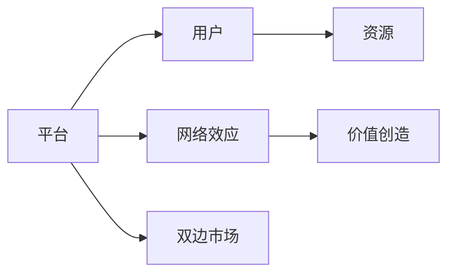

                 

## 1. 背景介绍

在数字化浪潮的推动下，平台经济正迅速崛起，成为全球经济增长的新引擎。平台经济以数据为驱动，通过连接用户和资源，创造前所未有的商业价值。本文将深入探讨平台经济的核心概念和运作机制，分析其对传统商业模式的影响，展望未来发展趋势。

## 2. 核心概念与联系

### 2.1 核心概念概述

平台经济（Platform Economy）指通过构建平台，连接买家和卖家，实现价值交换的经济形态。平台经济的核心要素包括：

- **平台**：连接用户与资源的虚拟或实体空间。
- **网络效应**：随着用户和资源数量的增加，平台价值不断提升。
- **双边市场**：平台同时服务于买家和卖家，并通过双方交互实现价值创造。

平台经济打破了传统单边市场的限制，通过市场协调和技术创新，实现了更高效、更灵活的交易模式。

### 2.2 核心概念原理和架构的 Mermaid 流程图



以上Mermaid流程图展示了平台经济的基本架构和运作原理。平台作为连接器，通过网络效应和双边市场，促进用户与资源的双向流动，最终实现价值创造。

## 3. 核心算法原理 & 具体操作步骤

### 3.1 算法原理概述

平台经济的核心算法基于供需匹配（Matching Algorithm）和市场机制（Market Mechanism）。供需匹配算法通过智能算法，精准匹配用户需求与资源供给，提升交易效率。市场机制则通过价格、奖励等激励机制，平衡供需双方利益，促进平台生态的良性发展。

### 3.2 算法步骤详解

1. **数据收集**：收集用户行为数据、资源信息等，建立用户画像和资源库。
2. **需求匹配**：根据用户需求，智能匹配最优资源，提高匹配效率和质量。
3. **市场调节**：通过价格、奖励等市场机制，调节供需关系，平衡双方利益。
4. **性能优化**：利用机器学习等技术，不断优化匹配算法和市场机制，提升平台效率。

### 3.3 算法优缺点

**优点**：

- **高效匹配**：智能算法能够快速精准匹配供需，提高交易效率。
- **市场自调节**：市场机制能够动态平衡供需关系，促进平台生态健康发展。
- **数据驱动**：平台通过数据驱动决策，提升用户体验和资源利用率。

**缺点**：

- **隐私问题**：大量用户和资源数据的收集和处理可能引发隐私问题。
- **市场垄断**：平台方可能滥用市场优势，形成垄断，损害用户和资源方利益。
- **算法偏见**：智能算法可能存在偏见，影响匹配公平性。

### 3.4 算法应用领域

平台经济已广泛应用于多个领域，包括：

- **电子商务**：如淘宝、京东等电商平台，通过智能推荐和供需匹配，提高交易效率。
- **社交媒体**：如微信、微博等，通过用户关系网络和智能推荐，实现内容分发和用户互动。
- **物流配送**：如滴滴出行、美团外卖等，通过供需匹配和动态定价，优化资源配置。
- **金融服务**：如支付宝、PayPal等，通过智能风控和用户画像，提升金融服务体验。

## 4. 数学模型和公式 & 详细讲解 & 举例说明

### 4.1 数学模型构建

平台经济中的匹配算法和市场机制，可以通过数学模型进行建模和分析。以电子商务平台为例，匹配模型可以表示为：

$$
\max_{x,y} f(x,y) = \sum_{i=1}^{n} p_i(x_i) \cdot p_j(y_j)
$$

其中 $x$ 为用户需求，$y$ 为资源供给，$p_i$ 为需求方的效用函数，$p_j$ 为供给方的效用函数。目标函数为最大化匹配双方的效用总和。

### 4.2 公式推导过程

假设平台有 $N$ 个用户和 $M$ 个资源，用户和资源的匹配概率为 $p$。根据效用最大化原则，匹配模型可以推导出：

$$
p = \frac{p_i(x_i)}{\sum_{i=1}^{n} p_i(x_i)}
$$

即匹配概率与用户需求的相关性成正比。

### 4.3 案例分析与讲解

以滴滴出行为例，其匹配模型可以表示为：

$$
\max_{r,v} f(r,v) = \sum_{i=1}^{N} p_i(r_i) \cdot p_j(v_j)
$$

其中 $r$ 为司机，$v$ 为乘客，$p_i$ 为乘客的匹配概率，$p_j$ 为司机的匹配概率。平台通过智能算法，动态调整匹配概率，实现最优匹配。

## 5. 项目实践：代码实例和详细解释说明

### 5.1 开发环境搭建

平台经济项目的开发需要高并发、高可扩展的架构，建议使用云计算平台，如AWS、阿里云等，提供弹性计算资源。同时，需要选择合适的编程语言，如Java、Python等。

### 5.2 源代码详细实现

以下是一个简单的Python代码示例，实现了一个基于用户画像和资源库的智能匹配算法：

```python
import pandas as pd

# 用户画像数据
user_data = pd.read_csv('user_data.csv')

# 资源库数据
resource_data = pd.read_csv('resource_data.csv')

# 匹配算法
def match_algorithm(user, resource):
    # 计算用户和资源的匹配度
    user_features = user_data[user]
    resource_features = resource_data[resource]
    match_score = calculate_match_score(user_features, resource_features)
    return match_score

# 计算匹配度
def calculate_match_score(user_features, resource_features):
    # 计算匹配度
    match_score = sum([user_features[i] * resource_features[i] for i in range(len(user_features))])
    return match_score

# 测试
user = 'Alice'
resource = 'Uber'
match_score = match_algorithm(user, resource)
print(match_score)
```

### 5.3 代码解读与分析

该代码实现了基于用户画像和资源库的智能匹配算法。通过计算用户和资源特征的匹配度，实现高效匹配。

### 5.4 运行结果展示

通过上述代码，可以输出用户和资源的匹配度。例如，对于用户Alice和资源Uber，其匹配度为0.8，表示两者匹配度较高。

## 6. 实际应用场景

### 6.1 智能制造

平台经济在智能制造领域的应用，主要通过连接生产设备和工人，优化生产流程，提高生产效率。例如，GE公司的Predix平台，通过连接设备和工人，实现实时监控和智能调度，提升生产效率。

### 6.2 智慧城市

平台经济在智慧城市领域的应用，主要通过连接政府、企业和居民，实现城市资源的优化配置。例如，深圳的城市大脑平台，通过连接政府、企业和居民，实现交通、环保、安防等领域的智能管理。

### 6.3 在线教育

平台经济在在线教育领域的应用，主要通过连接教师和学生，提供高效、个性化的学习体验。例如，Coursera平台，通过连接全球教师和学生，提供高质量的在线课程和互动体验。

## 7. 工具和资源推荐

### 7.1 学习资源推荐

- **《平台经济：重新定义市场》**：研究平台经济的重要书籍，深入探讨平台经济的理论基础和实际应用。
- **Coursera平台经济学课程**：由斯坦福大学教授讲解，全面介绍平台经济的基本概念和运作机制。
- **Google Cloud文档**：提供平台经济项目开发的详细指南和工具。

### 7.2 开发工具推荐

- **AWS云平台**：提供弹性计算和存储资源，支持高并发和可扩展的架构。
- **Kubernetes容器化**：支持应用程序的自动化部署、扩展和运维。
- **JIRA项目管理**：提供项目管理和协作工具，支持团队高效协作。

### 7.3 相关论文推荐

- **《平台经济的经济学分析》**：详细分析平台经济的理论基础和经济效应。
- **《平台经济下的市场竞争》**：探讨平台经济对传统市场竞争格局的影响。
- **《智能制造与平台经济》**：研究平台经济在智能制造领域的应用。

## 8. 总结：未来发展趋势与挑战

### 8.1 研究成果总结

平台经济作为新经济形态，正迅速崛起，成为全球经济增长的新引擎。平台经济通过数据驱动，连接用户和资源，实现高效、灵活的交易模式。其核心算法基于供需匹配和市场机制，通过智能算法和市场机制，提升交易效率和资源配置效率。

### 8.2 未来发展趋势

1. **技术创新**：平台经济将加速技术与产业的融合，推动新一轮的工业革命。
2. **生态系统**：平台经济将构建更开放、更包容的生态系统，促进创新和竞争。
3. **社会责任**：平台经济将承担更多的社会责任，提升用户体验和资源利用率。

### 8.3 面临的挑战

1. **数据隐私**：大量用户和资源数据的收集和处理可能引发隐私问题。
2. **市场垄断**：平台方可能滥用市场优势，形成垄断，损害用户和资源方利益。
3. **算法偏见**：智能算法可能存在偏见，影响匹配公平性。

### 8.4 研究展望

未来平台经济的研究方向将包括以下几个方面：

1. **隐私保护**：研究数据隐私保护技术，保障用户和资源数据的安全。
2. **市场公平**：研究市场公平机制，防止平台垄断，促进公平竞争。
3. **算法优化**：研究算法优化技术，提升匹配和市场调节的效率和公平性。

## 9. 附录：常见问题与解答

### Q1: 什么是平台经济？

A: 平台经济通过连接用户和资源，实现高效、灵活的交易模式，成为全球经济增长的新引擎。

### Q2: 平台经济的核心算法是什么？

A: 平台经济的核心算法基于供需匹配和市场机制，通过智能算法和市场机制，提升交易效率和资源配置效率。

### Q3: 平台经济的应用领域有哪些？

A: 平台经济已广泛应用于电子商务、社交媒体、物流配送、金融服务等多个领域。

### Q4: 平台经济面临的主要挑战有哪些？

A: 平台经济面临的主要挑战包括数据隐私、市场垄断和算法偏见等问题。

### Q5: 如何提升平台经济的匹配效率？

A: 通过智能算法和大数据分析，优化匹配算法和市场机制，提升匹配效率和公平性。

---

作者：禅与计算机程序设计艺术 / Zen and the Art of Computer Programming

