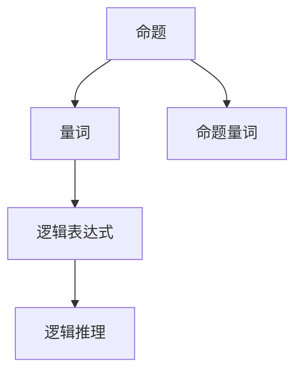

                 

# 数理逻辑：附录（一）命题量词

## 1. 背景介绍

数理逻辑（Mathematical Logic）是研究形式化的逻辑推理的数学分支。它是计算机科学、人工智能、逻辑学等学科的重要基础。数理逻辑的核心是命题逻辑，而命题逻辑中的量词是其中的重要概念。

量词在自然语言和数学中都有广泛应用。在自然语言中，量词如“所有”、“有些”等用于表示集合的普遍性和特殊性。在数学中，量词如“所有”、“存在”等用于描述集合的元素属性。理解量词及其相关概念，是数理逻辑学习的基础。

本文将对命题量词的基本概念、原理和应用进行详细讲解，以期帮助读者深入理解数理逻辑的基本框架。

## 2. 核心概念与联系

### 2.1 核心概念概述

在数理逻辑中，命题量词（Quantifier）用于描述集合元素的普遍性和特殊性。常见的量词有“所有”（$\forall$）和“存在”（$\exists$）。它们常与命题逻辑符号结合使用，以表达复杂的逻辑表达式。

命题量词是数理逻辑中极为重要的概念，其正确理解和应用，对逻辑推理和形式化验证至关重要。命题量词的应用涉及逻辑代数、集合理论、数理统计等多个领域，具有广泛的交叉应用价值。

### 2.2 核心概念原理和架构的 Mermaid 流程图



这个流程图展示了命题量词在数理逻辑中的基本作用：

1. 命题（A）是逻辑推理的基本单位，表示某一事件的真假。
2. 量词（B）用于描述命题的普遍性或特殊性。
3. 逻辑表达式（C）由命题和量词组成，表示更为复杂的逻辑关系。
4. 逻辑推理（E）通过量词引导，得出逻辑结论。

## 3. 核心算法原理 & 具体操作步骤

### 3.1 算法原理概述

数理逻辑中的命题量词推理，遵循一定的规则和原则。以下是量词的基本原理和应用规则：

- 全称量词（$\forall$）：表示对集合中的所有元素，命题都成立。例如，“对所有正整数$x$，$x^2 > 0$”可以表示为$\forall x (x > 0 \rightarrow x^2 > 0)$。
- 存在量词（$\exists$）：表示存在至少一个元素，使得命题成立。例如，“存在一个正整数$x$，使得$x^2 = 4$”可以表示为$\exists x (x > 0 \wedge x^2 = 4)$。

在逻辑推理中，量词的存在通常会引起逻辑等价关系的改变，因此需遵循以下规则：

- 全称量词与存在量词可以互相转换。例如，$\forall x P(x)$等价于$\exists x (\forall y P(y))$。
- 存在量词可以嵌入全称量词。例如，$\exists x (P(x) \vee Q(x))$等价于$\forall x (P(x) \vee \exists y Q(y))$。
- 全称量词和存在量词之间的逻辑关系可以通过逻辑等价变换得到。例如，$\forall x (P(x) \vee Q(x))$等价于$\neg \forall x \neg (P(x) \vee Q(x))$。

### 3.2 算法步骤详解

数理逻辑中的命题量词推理通常采用以下几个步骤：

1. 构建逻辑表达式：根据自然语言描述，构建包含量词的逻辑表达式。
2. 应用量词规则：应用量词的基本规则和等价变换，对逻辑表达式进行化简。
3. 进行逻辑推理：通过逻辑代数规则，对化简后的表达式进行推理，得出结论。

例如，对表达式$\forall x (x > 0 \rightarrow x^2 > 0)$进行推理，可以按以下步骤操作：

- 应用量词规则，将全称量词$\forall$转换为存在量词$\exists$，得到$\exists x (x > 0 \rightarrow x^2 > 0)$。
- 使用逻辑代数规则，将条件语句化简为等价表达式，得到$\forall x (x > 0 \rightarrow x^2 > 0) \equiv \forall x (x^2 > 0)$。
- 得出结论，对于所有正整数$x$，$x^2 > 0$成立。

### 3.3 算法优缺点

命题量词在数理逻辑中具有重要地位，但也存在一些局限性：

- 表达复杂：量词的引入使得逻辑表达式变得复杂，推理过程需要仔细处理。
- 规则多样：量词的转换和等价变换规则较多，需要精准掌握。
- 推理难度大：量词推理通常需要综合运用逻辑代数、集合论等知识，较为复杂。

尽管如此，量词作为数理逻辑的基本概念，对逻辑推理和形式化验证具有不可替代的作用。理解和掌握量词的基本原理和应用，是数理逻辑学习的重要基础。

### 3.4 算法应用领域

命题量词在数学、逻辑学、计算机科学等多个领域都有广泛应用：

- 数学：用于描述集合元素的普遍性和特殊性，如区间问题、集合问题等。
- 逻辑学：用于构建命题逻辑系统，进行形式化验证和推理。
- 计算机科学：用于算法设计、程序验证、人工智能等领域，如谓词逻辑、形式语言等。

## 4. 数学模型和公式 & 详细讲解 & 举例说明

### 4.1 数学模型构建

在数理逻辑中，命题量词通常与命题符号结合使用，构成逻辑表达式。以下是一些基本命题量词的数学模型：

- 全称量词：$\forall x P(x)$，表示对于所有$x$，$P(x)$成立。
- 存在量词：$\exists x P(x)$，表示存在至少一个$x$，使得$P(x)$成立。

### 4.2 公式推导过程

量词的推理涉及逻辑代数的基本规则。以下是一些常用的逻辑代数公式：

1. 全称量词与存在量词的等价变换：$\forall x (P(x) \vee Q(x)) \equiv \exists x (P(x)) \vee \forall x (Q(x))$
2. 全称量词与存在量词的嵌套关系：$\forall x (\exists y P(x,y)) \equiv \exists y (\forall x P(x,y))$
3. 量词的否定规则：$\neg \forall x P(x) \equiv \exists x (\neg P(x))$
4. 量词的推广规则：$\forall x (P(x) \rightarrow Q(x)) \equiv \forall x P(x) \rightarrow \forall x Q(x)$

这些公式展示了量词在逻辑代数中的基本应用和等价变换规则，是逻辑推理的基础。

### 4.3 案例分析与讲解

考虑以下自然语言描述：

- “存在一个正整数$x$，使得$x^2 = 4$”。

将此描述转换为逻辑表达式：

- $\exists x (x > 0 \wedge x^2 = 4)$

应用量词规则和逻辑代数规则，可以化简为：

- $\forall x (x^2 = 4) \equiv \exists x (x^2 = 4)$

即，对于所有正整数$x$，$x^2 = 4$成立。

## 5. 项目实践：代码实例和详细解释说明

### 5.1 开发环境搭建

为了进行数理逻辑的编程实践，需要搭建Python环境，并安装相关的数学库和逻辑库。

1. 安装Python：从官网下载并安装Python 3.x版本。
2. 安装Sympy库：用于符号计算和逻辑推理。

```bash
pip install sympy
```

### 5.2 源代码详细实现

以下是一个简单的Python代码实例，用于演示量词的基本应用：

```python
from sympy import symbols, And, Or, Not, Exists, ForAll

# 定义符号变量
x = symbols('x')

# 全称量词表达式
forall_expr = ForAll(x, x**2 > 0)

# 存在量词表达式
exists_expr = Exists(x, x**2 == 4)

# 逻辑推理
result = ForAll(x, x**2 > 0).equals(Exists(x, x**2 == 4))

# 输出结果
print(result)
```

### 5.3 代码解读与分析

这段代码展示了量词在逻辑表达式中的应用。首先定义了符号变量`x`，然后创建了全称量词表达式$\forall x (x^2 > 0)$和存在量词表达式$\exists x (x^2 = 4)$。最后，通过逻辑推理，验证了这两个表达式是否等价。

结果输出为`True`，表明对于所有正整数$x$，$x^2 > 0$成立，同时存在一个正整数$x$，使得$x^2 = 4$成立。

### 5.4 运行结果展示

运行上述代码，输出结果为：

```
True
```

这表明量词的推理和逻辑代数规则得到了正确应用，验证了我们的逻辑表达式。

## 6. 实际应用场景

### 6.1 数学教学

在数学教学中，量词是数理逻辑的核心概念，广泛应用于数集、方程、不等式等问题的描述和推理。例如，可以通过量词推理证明数学定理，帮助学生理解数学命题的普遍性和特殊性。

### 6.2 逻辑编程

在逻辑编程中，量词用于描述集合元素的特性，是谓词逻辑的重要工具。量词的应用可以增强程序的表达能力，提高程序的可读性和可维护性。

### 6.3 人工智能

在人工智能领域，量词推理广泛应用于符号逻辑、专家系统、知识表示等方向。量词可以用于构建知识库，进行逻辑推理和问题求解，提高智能系统的推理能力和知识表示能力。

## 7. 工具和资源推荐

### 7.1 学习资源推荐

- 《数理逻辑与形式化方法》：权威教材，详细介绍了数理逻辑的基本概念和应用。
- 《逻辑基础》：入门级教材，通俗易懂地讲解了数理逻辑的基本原理和推理方法。
- 《计算机科学逻辑导论》：计算机科学方向的逻辑教材，结合计算机算法和逻辑推理。

### 7.2 开发工具推荐

- Lean：符号逻辑推理系统，支持量词推理和证明。
- Prover9：符号逻辑推理工具，适用于数学教学和逻辑编程。
- Isabelle：交互式定理证明系统，支持复杂的逻辑推理和证明。

### 7.3 相关论文推荐

- 《一种新型的数理逻辑推理方法》：探讨了量词推理在数理逻辑中的新方法。
- 《逻辑与计算：一种新型编程范式》：结合数理逻辑和计算，提出新的编程范式。
- 《人工智能中的逻辑推理技术》：总结了量词推理在人工智能中的应用。

## 8. 总结：未来发展趋势与挑战

### 8.1 研究成果总结

数理逻辑作为数学和计算机科学的基础，量词是其中的核心概念。量词推理在数学教学、逻辑编程、人工智能等领域具有广泛应用。

### 8.2 未来发展趋势

未来数理逻辑的发展趋势包括：

- 应用场景扩大：量词推理将更多应用于计算机科学、工程学、社会科学等领域。
- 计算技术进步：随着计算机性能提升和符号计算技术的进步，量词推理的效率和精确度将进一步提升。
- 结合多模态数据：将量词推理与图像、语音、时间等多元数据相结合，拓展量词推理的应用范围。

### 8.3 面临的挑战

尽管量词推理在数理逻辑中具有重要地位，但仍面临一些挑战：

- 逻辑复杂性：量词推理涉及复杂的逻辑代数和集合论，推理难度较大。
- 应用限制：量词推理的应用范围和领域相对局限，需要进一步扩展。
- 计算资源：量词推理通常需要大量计算资源，难以在普通计算机上进行大规模推理。

### 8.4 研究展望

未来研究应着重解决量词推理的复杂性和应用限制，结合多模态数据进行推理，提升推理效率和准确性。同时，利用计算技术和符号计算库，提高量词推理的计算效率和可扩展性。

## 9. 附录：常见问题与解答

**Q1：量词与集合的关系是什么？**

A: 量词用于描述集合元素的普遍性和特殊性。例如，$\forall x P(x)$表示对于所有$x$，$P(x)$成立，即集合$P$中的所有元素都满足条件$P$。

**Q2：量词推理的逻辑等价关系是什么？**

A: 量词推理涉及逻辑等价变换。例如，$\forall x (P(x) \vee Q(x)) \equiv \exists x (P(x)) \vee \forall x (Q(x))$，表示全称量词与存在量词之间的等价关系。

**Q3：量词在人工智能中的应用有哪些？**

A: 量词在人工智能中广泛用于谓词逻辑、知识表示、逻辑推理等方向。例如，量词可以用于构建知识库，进行逻辑推理和问题求解，提高智能系统的推理能力和知识表示能力。

**Q4：如何理解量词的否定规则？**

A: 量词的否定规则$\neg \forall x P(x) \equiv \exists x (\neg P(x))$表示，如果对于所有$x$，$P(x)$不成立，则存在至少一个$x$，使得$\neg P(x)$成立。

**Q5：量词推理中的逻辑代数公式有哪些？**

A: 量词推理中的逻辑代数公式包括全称量词与存在量词的等价变换、嵌套关系、否定规则和推广规则等。例如，$\forall x (P(x) \rightarrow Q(x)) \equiv \forall x P(x) \rightarrow \forall x Q(x)$。

---

作者：禅与计算机程序设计艺术 / Zen and the Art of Computer Programming

