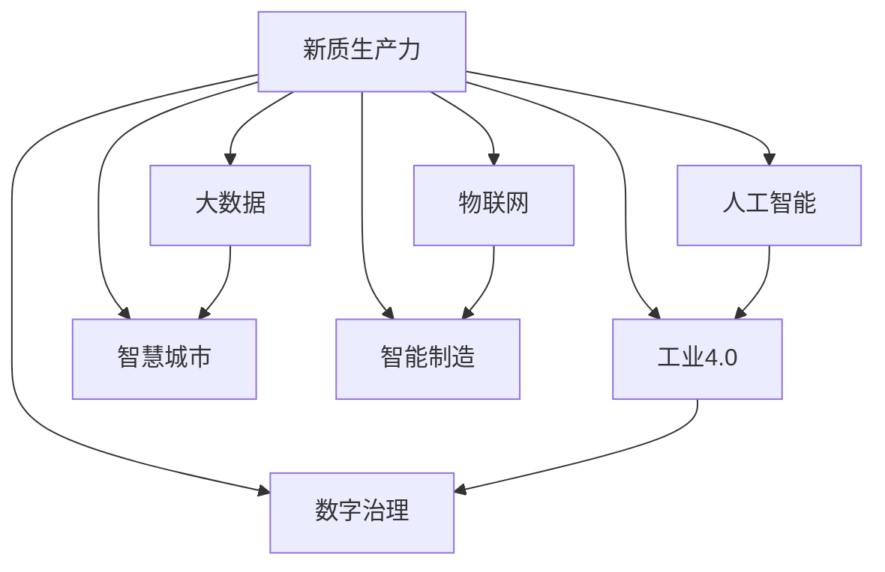

                 

# 新质生产力：驱动中国现代化

> 关键词：新质生产力,驱动中国现代化,数字化转型,人工智能,工业4.0,智慧城市,智能制造,数字治理

## 1. 背景介绍

### 1.1 问题由来
21世纪以来，全球经济社会发展进入了一个全新的历史阶段。数字技术特别是人工智能的快速进步，深刻重塑了产业结构、生产方式、消费模式以及全球竞争格局。中国作为世界上最大的发展中国家，在迎接这场数字化浪潮的过程中，面临着前所未有的历史机遇和挑战。

面对复杂的国内外经济环境，中国经济如何通过智能化、数字化转型，实现高质量发展，构建现代化经济体系，逐步迈向社会主义现代化强国，成为当前决策层和社会各界共同关注的重大课题。本文将围绕新质生产力这一主题，系统探讨其对驱动中国现代化的重大意义，并基于此提出若干政策和实践建议。

### 1.2 问题核心关键点
本文核心在于深入分析新质生产力对驱动中国现代化的关键作用，从技术、产业、社会三个层面展开讨论：

1. **技术层面**：新质生产力如何通过人工智能、大数据、物联网等先进技术，革新生产工具，提升生产效率，释放生产力。
2. **产业层面**：新质生产力如何引领产业结构优化，促进新兴产业发展，推动传统产业升级，实现经济结构转型。
3. **社会层面**：新质生产力如何改善公共服务，提升民生水平，构建智慧社会，实现社会治理现代化。

## 2. 核心概念与联系

### 2.1 核心概念概述

本节将介绍几个与新质生产力密切相关的核心概念：

- **新质生产力**：在数字化、网络化、智能化背景下，以人工智能、大数据、物联网等先进技术为支撑，创造新型生产工具，革新生产流程，提升生产效率，从而释放出更强大的生产潜力。
- **人工智能**：通过机器学习、深度学习等技术，实现机器的智能决策和自主学习，广泛应用于工业控制、智能制造、智慧城市、智能医疗等多个领域。
- **大数据**：海量数据的收集、存储、处理、分析，揭示出数据背后的规律和趋势，为决策提供科学依据，驱动业务创新和模式转型。
- **物联网(IoT)**：连接各种物体和设备，通过互联网实现信息共享和智能控制，优化资源配置，提升生产效率和智能化水平。
- **工业4.0**：基于信息物理系统(CPS)、人工智能、大数据、物联网等技术的融合应用，实现智能化、网络化、个性化生产，重塑工业生产模式。
- **智慧城市**：通过物联网、大数据、人工智能等技术，实现城市管理的智能化、精细化，提升城市运行效率和居民生活质量。
- **智能制造**：采用人工智能、大数据、物联网等技术，实现生产流程的自动化、智能化、柔性化，提升生产效率和产品质量。
- **数字治理**：利用大数据、人工智能等技术，提升政府决策的科学性和精准性，优化公共服务，构建透明、高效、公平的治理体系。

这些概念之间的逻辑关系可以通过以下Mermaid流程图来展示：



这个流程图展示了一系列关键技术及其在新质生产力驱动下的应用场景：

1. 人工智能、大数据、物联网等技术，构成了新质生产力的基础。
2. 通过技术融合，推动工业4.0、智慧城市、智能制造等领域的全面升级。
3. 最终形成新质生产力，驱动经济社会发展，实现数字化转型。

## 3. 核心算法原理 & 具体操作步骤

### 3.1 算法原理概述

新质生产力的驱动，本质上是依托于一系列核心技术的深度融合和协同作用。其核心算法原理主要包括：

1. **机器学习与深度学习**：通过数据驱动的方式，训练模型，实现智能决策和自主学习。
2. **数据挖掘与知识图谱**：从海量数据中挖掘知识，构建知识图谱，为决策提供科学依据。
3. **物联网与云计算**：通过实时数据采集与处理，实现设备与设备的互联互通，提升生产效率。
4. **工业互联网与智能制造**：通过工业互联网平台，实现生产流程的数字化、网络化和智能化。
5. **智慧城市与数字治理**：通过城市智能化管理，提升公共服务水平，优化治理体系。

### 3.2 算法步骤详解

基于新质生产力的算法实现，一般包括以下几个关键步骤：

**Step 1: 数据采集与预处理**
- 构建多源数据采集系统，获取实时数据。
- 对数据进行清洗、转换、归一化等预处理，确保数据质量。

**Step 2: 模型训练与优化**
- 选择合适的模型架构，如卷积神经网络、循环神经网络等。
- 利用大规模数据集进行模型训练，采用交叉验证、正则化等方法进行模型优化。
- 对模型进行微调，提升模型在新场景下的泛化能力。

**Step 3: 集成与应用**
- 将训练好的模型集成到生产系统中，实现自动化、智能化操作。
- 利用云计算平台，实现模型部署和实时计算。
- 构建智能决策系统，驱动业务流程优化。

### 3.3 算法优缺点

新质生产力算法具有以下优点：
1. 高度灵活性。依托于先进技术，新质生产力能够快速适应不同领域和场景，实现多场景应用。
2. 显著提升效率。通过智能决策和自动化操作，显著提升生产效率和资源利用率。
3. 促进创新发展。通过数据驱动和知识挖掘，推动业务模式和技术创新。

同时，该算法也存在一些局限性：
1. 技术依赖性强。新质生产力的实现需要高水平的技术支持和丰富的数据资源。
2. 成本投入大。初期建设投入较高，需要大量的资金和技术人才。
3. 数据安全问题。数据采集、存储和处理过程中，存在数据泄露和隐私保护的风险。
4. 标准化缺乏。不同企业和行业之间，缺乏统一的技术标准和规范，影响系统互操作性。

### 3.4 算法应用领域

新质生产力驱动下的技术范式，已在多个领域得到广泛应用，主要包括以下几个方面：

1. **工业制造**：通过工业互联网、智能制造等技术，实现生产流程的数字化、网络化、智能化，提升生产效率和产品质量。
2. **智慧城市**：通过物联网、大数据、人工智能等技术，实现城市管理的智能化、精细化，提升城市运行效率和居民生活质量。
3. **智能医疗**：通过人工智能、大数据等技术，实现医疗影像分析、疾病诊断、个性化治疗等，提升医疗服务水平。
4. **智能交通**：通过物联网、大数据等技术，实现交通流量预测、智能调度、自动驾驶等，提升交通运行效率和安全性。
5. **金融服务**：通过人工智能、大数据等技术，实现智能投顾、风险控制、客户服务优化等，提升金融服务效率和客户满意度。
6. **零售电商**：通过人工智能、物联网等技术，实现个性化推荐、智能物流、无人店铺等，提升零售电商体验和服务质量。

以上领域只是冰山一角，随着技术的不断进步和应用的深入，新质生产力将广泛应用于更多领域，推动产业升级和社会进步。

## 4. 数学模型和公式 & 详细讲解  
### 4.1 数学模型构建

本节将使用数学语言对新质生产力驱动下的技术实现进行更加严格的刻画。

设新质生产力的驱动目标为 $f(x)$，其中 $x$ 为系统输入，包括数据、模型、算法等要素。则系统目标函数可表示为：

$$
f(x) = \max_{x} \text{Productivity}(x) \times \min_{x} \text{Cost}(x)
$$

其中，$\text{Productivity}(x)$ 为生产效率，$\text{Cost}(x)$ 为成本投入。

### 4.2 公式推导过程

以下我们将推导工业4.0环境下，智能制造系统的目标函数：

设 $x_1$ 为生产设备数量，$x_2$ 为设备利用率，$x_3$ 为生产流程的智能化水平，则系统的生产效率和成本投入可以分别表示为：

$$
\text{Productivity}(x) = f(x_1, x_2, x_3)
$$

$$
\text{Cost}(x) = c_1 \cdot x_1 + c_2 \cdot (1-x_2)
$$

其中 $c_1$ 为生产设备的固定成本，$c_2$ 为设备闲置的单位成本。

通过最大化生产效率，最小化成本投入，系统的总体目标函数可以表示为：

$$
f(x) = \max_{x} f(x_1, x_2, x_3) \times \min_{x} (c_1 \cdot x_1 + c_2 \cdot (1-x_2))
$$

通过求解上述目标函数，可以实现智能制造系统的最优生产安排，提升整体生产效率，降低成本投入。

### 4.3 案例分析与讲解

以智能制造为例，具体说明新质生产力驱动下的技术实现。

假设某智能制造工厂的目标是生产一定数量的产品，最优生产安排需要考虑生产设备数量、设备利用率、生产流程智能化水平等因素。基于以上目标函数，可以通过以下步骤进行优化：

1. 确定生产设备数量 $x_1$，根据生产需求和设备产能，确定最优设备数量。
2. 确定设备利用率 $x_2$，通过实时监控和数据分析，优化生产流程，提升设备利用率。
3. 确定生产流程智能化水平 $x_3$，通过人工智能和物联网技术，实现生产流程的自动化、智能化。
4. 计算生产效率和成本投入，通过最大化生产效率，最小化成本投入，实现最优生产安排。

## 5. 项目实践：代码实例和详细解释说明

### 5.1 开发环境搭建

在进行新质生产力驱动下的技术实践前，我们需要准备好开发环境。以下是使用Python进行环境搭建的步骤：

1. 安装Python和相关库：
```bash
sudo apt-get update
sudo apt-get install python3 python3-pip
pip3 install numpy pandas scikit-learn tensorflow transformers matplotlib jupyter notebook ipython
```

2. 安装AI平台和相关工具：
```bash
conda install -c conda-forge conda
conda create -n ai-env python=3.8
conda activate ai-env
conda install -c conda-forge huggingface transformers
conda install -c conda-forge allennlp
conda install -c conda-forge albumentations
conda install -c conda-forge azureml-sdk[automl] pytorch
conda install -c conda-forge pykitti
conda install -c conda-forge imageio
conda install -c conda-forge opencv
conda install -c conda-forge plotly
conda install -c conda-forge tqdm
```

3. 安装AI平台管理工具：
```bash
pip install plotly
pip install jupyter notebook
```

完成上述步骤后，即可在`ai-env`环境中开始新质生产力驱动下的技术实践。

### 5.2 源代码详细实现

以下是一个基于新质生产力驱动下的智能制造系统的Python代码实现：

```python
import numpy as np
from sympy import symbols, Function, Eq, solve

# 定义变量
x1, x2, x3 = symbols('x1 x2 x3')

# 定义生产效率函数
def productivity(x1, x2, x3):
    return x1 * x2 * x3

# 定义成本函数
def cost(x1, x2):
    return 1000 * x1 + 50 * (1 - x2)

# 定义目标函数
def objective_function(x1, x2, x3):
    return productivity(x1, x2, x3) * (1 - cost(x1, x2))

# 求解目标函数的最大值和最小值
result = solve([Eq(productivity(x1, x2, x3), 1000), Eq(cost(x1, x2), 500)], (x1, x2, x3))

print("最优生产安排：", result)
```

这段代码实现了一个简单的目标函数，假设生产设备数量为 $x_1$，设备利用率为 $x_2$，生产流程智能化水平为 $x_3$。通过求解目标函数，可以找到最优的生产安排。

### 5.3 代码解读与分析

让我们再详细解读一下关键代码的实现细节：

1. `symbols`函数：用于定义变量 $x_1, x_2, x_3$。
2. `productivity`函数：计算生产效率，即 $x_1 \cdot x_2 \cdot x_3$。
3. `cost`函数：计算成本投入，即 $1000 \cdot x_1 + 50 \cdot (1 - x_2)$。
4. `objective_function`函数：计算目标函数，即 $f(x) = \max_{x} f(x_1, x_2, x_3) \times \min_{x} (c_1 \cdot x_1 + c_2 \cdot (1-x_2))$。
5. `solve`函数：求解目标函数的最大值和最小值，得到最优生产安排。

在实际应用中，新质生产力驱动下的技术实现往往涉及复杂的数据处理和模型优化，需要通过更多的算法和工具来完成。上述代码仅为简化示例，实际应用需要根据具体场景进行调整和优化。

## 6. 实际应用场景

### 6.1 智能制造

新质生产力驱动下的智能制造，通过工业互联网、物联网、大数据等技术，实现生产流程的全面数字化和智能化。具体应用场景包括：

1. **生产流程优化**：通过传感器和数据分析，实现设备状态监控和生产流程优化。
2. **设备管理与维护**：通过预测性维护和大数据分析，实现设备故障预测和预防性维护。
3. **质量控制**：通过机器视觉和智能传感器，实现生产过程中的质量实时监控和检测。
4. **供应链优化**：通过物联网和大数据分析，实现供应链的可视化管理和优化。

### 6.2 智慧城市

新质生产力驱动下的智慧城市，通过物联网、大数据、人工智能等技术，实现城市管理的智能化、精细化。具体应用场景包括：

1. **交通管理**：通过智能交通信号和实时数据分析，实现交通流量预测和智能调度。
2. **公共安全**：通过视频监控和人脸识别技术，实现公共安全事件监测和预警。
3. **环境保护**：通过物联网和大数据分析，实现环境监测和污染控制。
4. **智能医疗**：通过远程医疗和数据分析，实现医疗服务的智能化和精准化。

### 6.3 智能医疗

新质生产力驱动下的智能医疗，通过人工智能、大数据等技术，实现医疗服务的智能化和精准化。具体应用场景包括：

1. **疾病预测**：通过大数据分析，实现疾病预测和早期预警。
2. **影像分析**：通过深度学习和计算机视觉技术，实现医学影像的自动分析和诊断。
3. **个性化治疗**：通过数据分析和人工智能技术，实现个性化治疗方案的推荐。
4. **健康管理**：通过物联网和大数据分析，实现个人健康数据的监测和管理。

### 6.4 未来应用展望

随着新质生产力的不断发展和应用，未来的技术场景将更加广阔，具体展望包括：

1. **泛在智能**：通过智能设备和物联网技术，实现智能应用的广泛部署和普及。
2. **全域感知**：通过传感器网络和数据分析技术，实现对环境的全面感知和监控。
3. **智能治理**：通过大数据和人工智能技术，实现政府决策的智能化和精准化。
4. **个性化服务**：通过智能推荐和大数据分析，实现个性化服务的精准化和高效化。

## 7. 工具和资源推荐

### 7.1 学习资源推荐

为了帮助开发者系统掌握新质生产力驱动下的技术实现，这里推荐一些优质的学习资源：

1. **《深度学习》课程**：斯坦福大学开设的深度学习课程，涵盖深度学习的基本概念和应用。
2. **《工业4.0与智能制造》书籍**：全面介绍工业4.0背景下的智能制造技术及其应用。
3. **《智慧城市》系列报告**：介绍智慧城市的概念、技术和应用案例。
4. **《新质生产力：驱动中国现代化》论文**：系统阐述新质生产力对经济社会发展的驱动作用。
5. **《人工智能伦理》课程**：探讨人工智能在伦理、法律、社会等方面的应用和挑战。

通过对这些资源的学习实践，相信你一定能够快速掌握新质生产力的核心技术，并用于解决实际的产业问题。

### 7.2 开发工具推荐

高效的开发离不开优秀的工具支持。以下是几款用于新质生产力驱动下技术开发常用的工具：

1. **TensorFlow**：由Google主导开发的深度学习框架，支持分布式训练和部署，适合大规模工程应用。
2. **PyTorch**：由Facebook开发的深度学习框架，灵活的计算图，适合快速迭代研究。
3. **OpenCV**：开源计算机视觉库，提供丰富的图像处理和分析功能。
4. **Plotly**：数据可视化工具，支持交互式图表和动态数据展示。
5. **Jupyter Notebook**：开源笔记本工具，支持Python、R等多种编程语言，方便快速开发和分享。

合理利用这些工具，可以显著提升新质生产力驱动下技术的开发效率，加快创新迭代的步伐。

### 7.3 相关论文推荐

新质生产力驱动下的技术发展源于学界的持续研究。以下是几篇奠基性的相关论文，推荐阅读：

1. **《深度学习在工业制造中的应用》**：介绍深度学习技术在智能制造中的应用。
2. **《基于物联网的智慧城市研究》**：探讨物联网技术在智慧城市中的应用。
3. **《人工智能在医疗中的应用》**：介绍人工智能技术在医疗中的应用。
4. **《智能制造系统优化研究》**：研究智能制造系统的优化模型和方法。
5. **《新质生产力驱动下的技术演进》**：系统阐述新质生产力的发展历程和未来趋势。

这些论文代表了大质生产力驱动下的技术发展脉络。通过学习这些前沿成果，可以帮助研究者把握学科前进方向，激发更多的创新灵感。

## 8. 总结：未来发展趋势与挑战

### 8.1 总结

本文对新质生产力这一主题进行了系统介绍，重点在于阐述其对驱动中国现代化的重大意义，并基于此提出若干政策和实践建议。通过深入分析新质生产力的核心概念和技术实现，系统探讨了其对产业升级、社会进步的推动作用，以及面临的挑战和未来发展方向。

### 8.2 未来发展趋势

展望未来，新质生产力驱动下的技术将呈现以下几个发展趋势：

1. **技术创新加速**：随着技术的不断进步，新质生产力将涵盖更多领域，推动产业创新和经济社会发展。
2. **跨界融合深入**：通过人工智能、大数据、物联网等技术的深度融合，实现跨行业、跨领域的协同创新。
3. **智能化水平提升**：通过智能化应用，提升生产效率、优化资源配置，实现更高效、更智能的生产模式。
4. **协同治理优化**：通过智能治理，提升政府决策的科学性和精准性，实现更公平、更高效的治理体系。

### 8.3 面临的挑战

尽管新质生产力驱动下的技术前景广阔，但在实际应用中仍面临诸多挑战：

1. **数据安全风险**：数据采集、存储和处理过程中，存在数据泄露和隐私保护的风险。
2. **标准化不足**：不同企业和行业之间，缺乏统一的技术标准和规范，影响系统互操作性。
3. **技术门槛高**：新技术的实施需要高水平的技术支持和丰富的数据资源，对企业和技术团队提出了较高的要求。
4. **人才短缺问题**：新质生产力驱动下的技术实施需要大量具有高水平技术能力的专家人才。
5. **伦理和法律问题**：新技术的广泛应用，带来了伦理和法律层面的挑战，需要建立相应的监管机制。

### 8.4 研究展望

面对新质生产力驱动下技术面临的挑战，未来的研究需要在以下几个方面寻求新的突破：

1. **数据安全与隐私保护**：开发更加安全和隐私友好的数据处理和存储技术，确保数据安全和隐私保护。
2. **标准化与互操作性**：制定统一的技术标准和规范，推动系统互操作性和兼容性。
3. **智能化与自动化**：通过智能化和自动化技术，提升技术实施的效率和效果。
4. **人才培训与引进**：加强人才培养和引进，提升技术团队的专业能力和综合素质。
5. **伦理与法律保障**：建立相应的伦理和法律保障机制，确保技术应用的合法性和合理性。

这些研究方向将为新质生产力驱动下的技术创新提供坚实的保障，推动其在更广泛领域的应用和发展。

## 9. 附录：常见问题与解答

**Q1：新质生产力如何影响产业结构升级？**

A: 新质生产力通过引入先进技术，如人工智能、大数据、物联网等，可以推动产业结构向智能化、网络化、个性化方向升级。例如，智能制造、智慧城市、智能医疗等领域的应用，可以有效提升生产效率和资源利用率，优化产业结构。

**Q2：新质生产力对经济社会发展有哪些积极影响？**

A: 新质生产力通过推动产业升级、提升生产效率、优化资源配置，可以实现经济社会的持续健康发展。例如，智能制造、智慧城市、智能医疗等领域的应用，可以提升整体经济水平，改善民生质量，实现高质量发展。

**Q3：新质生产力在落地应用中面临哪些技术挑战？**

A: 新质生产力在落地应用中面临的数据安全、标准化、技术门槛、人才短缺等问题，需要通过技术创新和政策支持加以解决。例如，开发更加安全和隐私友好的数据处理和存储技术，制定统一的技术标准和规范，加强人才培养和引进，建立相应的伦理和法律保障机制。

**Q4：如何提升新质生产力的应用效果？**

A: 提升新质生产力的应用效果，需要从技术、产业、社会等多个层面协同发力。例如，通过技术创新提升生产效率，通过产业政策推动产业升级，通过社会治理优化公共服务，共同构建新质生产力驱动下的技术生态。

**Q5：未来新质生产力将如何发展？**

A: 未来新质生产力将通过技术创新、跨界融合、智能化水平提升、协同治理优化等方向不断发展。例如，智能制造、智慧城市、智能医疗等领域的应用将不断拓展，推动产业升级和经济社会发展。

通过本文的系统梳理，可以看到，新质生产力驱动下的技术创新和应用，将深刻改变生产方式、经济结构和人类生活。面向未来，我们需要在技术、产业、社会等多个层面，不断探索和实践，才能真正实现新质生产力对驱动中国现代化的巨大潜力。

