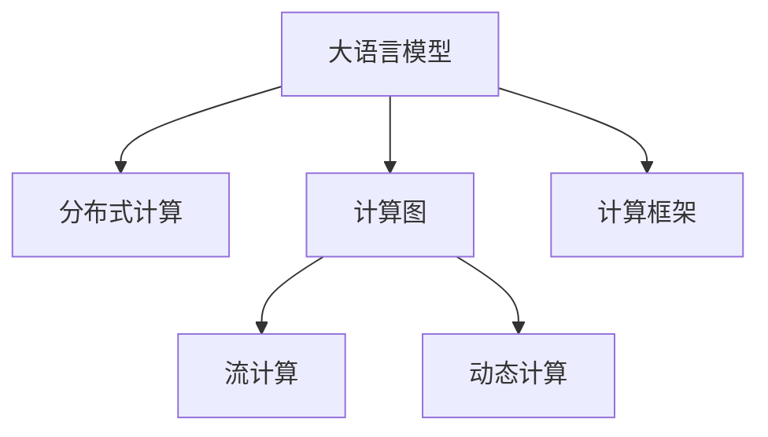

                 

# 时刻推理:LLM计算的独特本质

> 关键词：大语言模型(LLM),时刻推理,分布式计算,计算图,流计算,动态计算,计算框架

## 1. 背景介绍

### 1.1 问题由来
随着深度学习技术的迅猛发展，大语言模型(LLM)在自然语言处理(NLP)领域取得了巨大的突破。这些模型通过在大规模无标签文本数据上进行预训练，学习到了丰富的语言知识和常识。然而，由于其庞大的参数量和复杂的计算过程，LLM的计算复杂度成为了制约其应用的一个重大挑战。特别是对于大规模分布式计算环境，如何高效地进行大模型的计算，成为了学术界和工业界共同关注的问题。

### 1.2 问题核心关键点
LLM的计算特性与其独特的架构设计密切相关。LLM通常采用基于Transformer的架构，其计算过程涉及大量的矩阵乘法和复杂非线性变换，难以在传统集中式计算环境下进行优化。而分布式计算、流计算和动态计算等新兴计算范式，为LLM提供了新的计算路径，也为提高其效率、降低计算成本提供了可能。

### 1.3 问题研究意义
深入研究LLM的计算本质，开发高效计算框架，不仅可以解决大模型在实际应用中的计算瓶颈问题，还可以推动LLM技术的进一步普及和应用。大语言模型的高效计算能力，对于提升NLP任务的实时性、降低计算成本、提高模型训练和推理的效率具有重要意义。

## 2. 核心概念与联系

### 2.1 核心概念概述

为了更好地理解LLM的计算本质和其背后的核心概念，本节将介绍几个关键概念：

- 大语言模型(LLM)：以自回归(如GPT)或自编码(如BERT)模型为代表的大规模预训练语言模型。通过在大规模无标签文本语料上进行预训练，学习通用的语言表示，具备强大的语言理解和生成能力。

- 分布式计算(Distributed Computing)：指通过多台计算机共同分担计算任务，提升计算效率和资源利用率的一种计算方式。

- 计算图(Computational Graph)：表示计算过程的图形化表示，通过节点和边构建计算流程，适合于高效自动化并行计算。

- 流计算(Stream Computing)：指对数据流进行实时处理和分析的计算方式，适用于连续数据流和高并发的场景。

- 动态计算(Dynamic Computing)：指计算过程能够根据数据流实时调整计算策略的计算方式，适用于数据流变化频繁的场景。

- 计算框架(Computational Framework)：提供一套完整的工具和规范，帮助开发者高效构建和优化计算流程，如TensorFlow、PyTorch等。

这些核心概念之间的逻辑关系可以通过以下Mermaid流程图来展示：



这个流程图展示了LLM计算过程中涉及的关键概念及其相互关系：

1. LLM通过计算图进行复杂计算。
2. 计算图可以采用分布式计算和流计算方式进行并行计算。
3. 动态计算根据数据流实时调整计算策略，提升计算效率。
4. 计算框架提供优化工具和规范，支持高效的LLM计算。

这些概念共同构成了LLM的计算框架，使其能够在各种场景下发挥强大的语言理解和生成能力。通过理解这些核心概念，我们可以更好地把握LLM的工作原理和计算优化方向。

## 3. 核心算法原理 & 具体操作步骤
### 3.1 算法原理概述

LLM的计算过程涉及大量的矩阵乘法和复杂非线性变换，计算量巨大。分布式计算、流计算和动态计算等新兴计算范式，为LLM提供了新的计算路径。以下我们将深入探讨LLM计算的原理和具体操作步骤。

### 3.2 算法步骤详解

#### 3.2.1 数据划分

在分布式计算环境中，需要将数据划分为若干子集，分别分配到不同的计算节点上进行并行计算。这一步骤通常称为数据分割(data partitioning)。

#### 3.2.2 分布式并行计算

每个计算节点独立进行本地计算，通过消息传递机制交换中间结果。常见的分布式并行计算框架包括Apache Spark、Hadoop等。

#### 3.2.3 计算图优化

分布式计算过程中，计算图需要进行优化以提高并行度。常见的优化策略包括：

- 将计算图中的节点按照数据依赖关系进行合理的划分，使得每个节点可以独立运行。
- 利用消息传递机制，减少节点之间的数据传输量。
- 使用分布式缓存技术，避免重复计算。

#### 3.2.4 流计算和动态计算

对于动态数据流，可以采用流计算方式，实时处理数据流并生成结果。流计算框架如Apache Flink、Apache Storm等支持高效的数据流处理。

### 3.3 算法优缺点

LLM计算采用分布式和流计算方式，具有以下优点：

1. 高效并行：分布式计算可以将计算任务分散到多台计算机上，提升计算效率。
2. 实时处理：流计算可以对数据流进行实时处理，适用于连续数据流的场景。
3. 动态调整：动态计算可以根据数据流实时调整计算策略，提高资源利用率。

但同时也存在一些局限性：

1. 通信开销：分布式计算中数据传输和消息传递会增加额外的开销，降低计算效率。
2. 容错性问题：分布式系统需要考虑故障恢复和数据一致性等问题，增加了系统复杂度。
3. 编程复杂度：分布式计算需要编写复杂的网络通信代码，增加了开发难度。

### 3.4 算法应用领域

基于LLM的分布式计算方法，已经在自然语言处理、机器学习、推荐系统等多个领域得到应用，提升了模型训练和推理的效率，降低了计算成本。

- 自然语言处理：如文本分类、情感分析、机器翻译等任务，可以使用分布式计算加速模型训练和推理。
- 机器学习：如推荐系统、广告投放等任务，可以使用分布式计算优化模型训练过程，提高计算效率。
- 推荐系统：如基于深度学习的推荐系统，可以使用分布式计算加速模型训练，提升推荐精度。

## 4. 数学模型和公式 & 详细讲解 & 举例说明

### 4.1 数学模型构建

在分布式计算环境下，LLM的计算模型可以表示为：

$$
Y = f(X; \theta) = g(h(z_{W}; \theta_{W}) h(z_{B}; \theta_{B}) \ldots)
$$

其中 $X$ 为输入数据，$\theta$ 为模型参数，$f$ 为计算过程，$z_W, z_B, \ldots$ 为中间结果，$\theta_W, \theta_B, \ldots$ 为对应层的参数。

在分布式计算环境中，可以将 $z_W, z_B, \ldots$ 划分为多个子集，分别在多个计算节点上进行计算，然后将结果合并。

### 4.2 公式推导过程

以BERT模型为例，其计算过程可以表示为：

1. 输入数据 $X$ 经过嵌入层转换为向量 $Z$。
2. 将 $Z$ 划分为若干子集，分别在多个计算节点上进行计算。
3. 每个节点对 $Z_i$ 进行Transformer层计算，得到中间结果 $H_i$。
4. 将 $H_i$ 合并，再经过多层Transformer层，最终得到输出结果 $Y$。

### 4.3 案例分析与讲解

以文本分类任务为例，使用分布式计算框架Apache Spark进行模型训练和推理。具体步骤如下：

1. 将数据集划分为若干子集，每个子集大小适中。
2. 使用Apache Spark的SparkRDD对数据进行分布式计算。
3. 在每个节点上运行模型计算过程，生成中间结果。
4. 使用SparkRDD的map函数对中间结果进行合并，得到最终输出。

## 5. 项目实践：代码实例和详细解释说明

### 5.1 开发环境搭建

在进行LLM计算实践前，我们需要准备好开发环境。以下是使用Python进行Apache Spark开发的环境配置流程：

1. 安装Apache Spark：从官网下载并安装Apache Spark，在Hadoop环境下运行。
2. 创建PySpark环境：使用pyspark创建PySpark环境。
3. 安装必要工具包：安装必要的Python工具包，如pandas、numpy、pyarrow等。
4. 配置环境变量：配置PySpark和其他环境变量，确保Spark可以正常运行。

### 5.2 源代码详细实现

下面我们以BERT模型为例，使用Apache Spark进行文本分类的实现。

```python
from pyspark.sql import SparkSession
from pyspark.ml.feature import HashingTF, IDF, Tokenizer, StopWordsRemover, VectorAssembler
from pyspark.ml.classification import LogisticRegressionModel
from pyspark.sql.functions import col, split

# 创建Spark环境
spark = SparkSession.builder.appName('BERTClassifier').getOrCreate()

# 读取数据集
data = spark.read.text('data.txt')

# 预处理数据
tokenizer = Tokenizer(inputCol='sentence', outputCol='tokens')
stopwordsRemover = StopWordsRemover(inputCol='tokens', outputCol='tokens')
hashingTF = HashingTF(inputCol='tokens', outputCol='features', numFeatures=2**20)
idf = IDF(inputCol='features', outputCol='features', minDocFreq=2)
vectorAssembler = VectorAssembler(inputCols=['features'], outputCol='features_vector')

# 训练模型
trainer = LogisticRegressionModel(trainingData=trainData, labelCol='label', featuresCol='features_vector')
model = trainer.fit(trainData)

# 预测结果
testData = spark.read.text('test.txt')
testData = tokenizer.transform(testData)
testData = stopwordsRemover.transform(testData)
testData = hashingTF.transform(testData)
testData = idf.transform(testData)
testData = vectorAssembler.transform(testData)
predictions = model.transform(testData)

# 输出结果
predictions.select('sentence', 'prediction').show(truncate=False)
```

以上代码展示了使用Spark进行文本分类的完整流程，包括数据预处理、模型训练、预测结果输出等步骤。

### 5.3 代码解读与分析

让我们再详细解读一下关键代码的实现细节：

**数据预处理**：
- 使用Tokenizer将句子切分成单词。
- 使用StopWordsRemover去除停用词。
- 使用HashingTF进行特征提取，转换为向量。
- 使用IDF进行特征加权，减少噪音。
- 使用VectorAssembler将特征向量转换为模型所需的格式。

**模型训练**：
- 使用LogisticRegressionModel进行二分类模型的训练。
- 通过特征向量进行模型训练，输出预测结果。

**预测结果输出**：
- 对测试集数据进行预处理，得到模型所需的输入格式。
- 使用训练好的模型进行预测，输出句子分类结果。

可以看出，Apache Spark提供了强大的分布式计算能力，可以方便地进行大规模数据处理和计算。同时，PySpark的编程模型与Python的接口紧密结合，使得开发过程更加直观和高效。

## 6. 实际应用场景

### 6.1 智能客服系统

基于LLM的分布式计算技术，可以构建高效的智能客服系统。传统客服系统通常依赖人力进行文本分类和自动回复，效率低、成本高。而使用分布式计算的LLM模型，可以在短时间内处理大量客户咨询，提供实时回复，提升客户满意度。

在技术实现上，可以将客户咨询的文本数据划分为若干子集，分别在多个计算节点上进行并行处理。模型通过分布式计算得到实时响应，大大提升了客服系统的处理能力。

### 6.2 金融舆情监测

金融机构需要实时监测网络舆情，以预测市场变化，规避风险。传统方法通常依赖人工监控，效率低下。使用分布式计算的LLM模型，可以实时分析大规模文本数据，快速识别舆情变化，预测市场趋势。

具体而言，可以将新闻、评论等数据划分为若干子集，分别在多个计算节点上进行并行处理。模型通过流计算实时分析数据流，得到舆情变化趋势，帮助金融机构及时应对市场风险。

### 6.3 个性化推荐系统

当前的推荐系统往往依赖用户行为数据进行推荐，难以把握用户的真实兴趣偏好。使用分布式计算的LLM模型，可以更好地挖掘用户行为背后的语义信息，提升推荐系统的个性化程度。

在实践中，可以将用户浏览、点击、评论等行为数据划分为若干子集，分别在多个计算节点上进行并行处理。模型通过分布式计算得到用户兴趣分析结果，再结合其他特征综合排序，提供个性化推荐。

### 6.4 未来应用展望

随着LLM计算技术的不断发展，基于分布式和流计算的LLM将在更多领域得到应用，为传统行业带来变革性影响。

在智慧医疗领域，基于LLM的分布式计算技术，可以实现实时诊断、智能问诊等功能，提高医疗服务的智能化水平。

在智能教育领域，LLM可以用于智能批改作业、推荐学习资源等，因材施教，促进教育公平。

在智慧城市治理中，LLM可以用于智能监控、应急响应等，提高城市管理的自动化和智能化水平。

此外，在企业生产、社会治理、文娱传媒等众多领域，基于LLM的分布式计算技术都将发挥重要作用，推动人工智能技术的普及应用。

## 7. 工具和资源推荐

### 7.1 学习资源推荐

为了帮助开发者掌握LLM计算技术，这里推荐一些优质的学习资源：

1. Apache Spark官方文档：提供Spark的详细API和使用指南，是学习Spark的最佳资源。
2. PySpark官方文档：提供PySpark的详细API和使用指南，是学习PySpark的最佳资源。
3. TensorFlow分布式计算文档：介绍TensorFlow在分布式环境下的使用方式，适合深入学习分布式计算技术。
4. PyTorch分布式计算文档：介绍PyTorch在分布式环境下的使用方式，适合深入学习分布式计算技术。
5. 《分布式深度学习》一书：系统介绍分布式深度学习技术，涵盖多种分布式计算框架和应用场景。

通过对这些资源的学习实践，相信你一定能够掌握LLM计算技术的精髓，并用于解决实际的NLP问题。

### 7.2 开发工具推荐

高效的开发离不开优秀的工具支持。以下是几款用于LLM计算开发的常用工具：

1. Apache Spark：提供了强大的分布式计算能力，适合大规模数据处理和计算。
2. PySpark：提供了简单易用的API，适合Python开发。
3. TensorFlow：提供了丰富的分布式计算功能，适合深度学习模型的训练和推理。
4. PyTorch：提供了灵活的计算图API，适合深度学习模型的训练和推理。
5. Apache Flink：提供了流计算和动态计算能力，适合实时数据处理。

合理利用这些工具，可以显著提升LLM计算任务的开发效率，加快创新迭代的步伐。

### 7.3 相关论文推荐

LLM计算技术的发展源于学界的持续研究。以下是几篇奠基性的相关论文，推荐阅读：

1. "Distributed Deep Learning" by Tao Yan et al.：介绍分布式深度学习的原理和实现方法。
2. "Large-Scale Distributed Machine Learning with Parameter-Server Algorithms" by Michael I. Jordan et al.：介绍分布式机器学习算法。
3. "Stream Computing in Big Data" by Yue Zhou et al.：介绍流计算的原理和应用场景。
4. "Distributed Deep Learning with TensorFlow" by Vincent Vanhoucke et al.：介绍TensorFlow在分布式环境下的使用方式。
5. "Parameter-Efficient Transfer Learning for NLP" by Adam Roberts et al.：介绍参数高效微调方法。

这些论文代表了大语言模型计算技术的发展脉络。通过学习这些前沿成果，可以帮助研究者把握学科前进方向，激发更多的创新灵感。

## 8. 总结：未来发展趋势与挑战

### 8.1 总结

本文对基于LLM的分布式计算方法进行了全面系统的介绍。首先阐述了LLM的计算特性和分布式计算技术的背景，明确了LLM计算的本质和重要性。其次，从原理到实践，详细讲解了LLM计算的数学模型和具体操作步骤，给出了LLM计算任务开发的完整代码实例。同时，本文还广泛探讨了LLM计算技术在智能客服、金融舆情、个性化推荐等多个行业领域的应用前景，展示了LLM计算范式的巨大潜力。此外，本文精选了LLM计算技术的各类学习资源，力求为读者提供全方位的技术指引。

通过本文的系统梳理，可以看到，基于分布式和流计算的LLM计算技术正在成为LLM应用的重要范式，极大地拓展了LLM的应用边界，催生了更多的落地场景。得益于分布式计算技术，LLM可以在大规模数据处理和实时处理中发挥重要作用，推动NLP技术向更广阔的应用领域加速渗透。未来，伴随计算技术的发展，LLM计算技术的效率和精度将进一步提升，为构建智能社会提供更强大的技术支持。

### 8.2 未来发展趋势

展望未来，LLM计算技术将呈现以下几个发展趋势：

1. 大规模分布式计算：随着硬件设备的不断进步，LLM的分布式计算能力将进一步提升，支持更大规模的数据处理和计算。
2. 实时流计算：随着数据流处理的不断成熟，LLM的流计算能力将更加强大，能够实时处理大规模数据流。
3. 动态计算优化：随着动态计算技术的不断进步，LLM的计算策略将更加灵活，能够根据数据流实时调整计算策略。
4. 分布式框架优化：未来的分布式计算框架将更加智能化、自动化，能够自动进行资源优化和任务调度。
5. 多模态数据融合：未来的LLM计算技术将支持多模态数据的融合，如文本、图像、语音等，实现更加全面、准确的信息整合。
6. 异构计算融合：未来的LLM计算技术将支持异构计算资源的融合，如GPU、FPGA等，进一步提升计算效率。

这些趋势凸显了LLM计算技术的广阔前景。这些方向的探索发展，必将进一步提升LLM的计算效率和应用范围，为构建智能社会提供更强大的技术支持。

### 8.3 面临的挑战

尽管LLM计算技术已经取得了瞩目成就，但在迈向更加智能化、普适化应用的过程中，它仍面临着诸多挑战：

1. 数据传输瓶颈：分布式计算中的数据传输开销大，制约了计算效率。未来需要进一步优化数据传输机制。
2. 资源调度复杂：分布式计算中需要考虑任务调度和资源分配，增加了系统复杂度。未来需要开发更智能的资源调度算法。
3. 计算精度问题：分布式计算中不同节点的计算精度不一致，影响最终结果的准确性。未来需要进一步提高计算精度。
4. 计算框架限制：当前主流的计算框架（如TensorFlow、PyTorch）对分布式计算的支持不足，限制了计算效率。未来需要开发更强大的分布式计算框架。
5. 实时性问题：流计算中需要考虑实时性，不同节点的计算时间不一致，影响实时处理效果。未来需要优化实时计算机制。
6. 故障容忍度不足：分布式计算中需要考虑故障容忍和数据一致性，增加了系统复杂度。未来需要提高系统的容错能力。

这些挑战需要研究者不断探索和解决，才能使LLM计算技术在实际应用中发挥最大效能。

### 8.4 研究展望

面对LLM计算技术面临的挑战，未来的研究需要在以下几个方面寻求新的突破：

1. 研究高效的数据传输机制：开发更高效的数据传输协议，减少数据传输开销。
2. 开发智能资源调度算法：开发更智能的资源调度算法，提高系统效率和稳定性。
3. 提高计算精度和一致性：优化计算过程，提高计算精度和一致性，保证最终结果的准确性。
4. 开发更强大的分布式计算框架：开发更强大的分布式计算框架，支持大规模分布式计算。
5. 优化实时计算机制：优化实时计算机制，提高流计算的实时性。
6. 提高系统的容错能力：提高系统的容错能力，增强系统的稳定性。

这些研究方向将为LLM计算技术的未来发展提供新的动力，推动LLM计算技术在更广泛的应用场景中发挥作用，推动人工智能技术在各行各业的落地应用。

## 9. 附录：常见问题与解答

**Q1：LLM计算是否适用于所有NLP任务？**

A: LLM计算适用于大部分NLP任务，特别是那些需要大规模数据处理和实时计算的场景。但对于一些需要高度精确计算的任务，如机器翻译，传统的集中式计算方式可能更加合适。

**Q2：分布式计算和流计算相比，哪种方式更适合LLM计算？**

A: 分布式计算和流计算各有优缺点。分布式计算适合大规模数据处理和复杂计算，但需要考虑节点间的通信开销；流计算适合实时数据处理，但需要考虑数据流的动态变化。实际应用中，需要根据具体任务的需求选择合适的计算方式。

**Q3：如何优化LLM计算的资源利用率？**

A: 优化LLM计算的资源利用率，可以采取以下措施：
1. 优化计算图：通过合理划分计算节点和优化计算流程，提高并行度。
2. 使用缓存技术：利用分布式缓存技术，减少重复计算。
3. 动态调整计算策略：根据数据流的变化，实时调整计算策略，提高资源利用率。
4. 使用高效的网络通信协议：优化网络通信协议，减少数据传输开销。

**Q4：LLM计算的实时性如何保证？**

A: 保证LLM计算的实时性，可以采取以下措施：
1. 优化计算图：通过合理划分计算节点和优化计算流程，提高并行度。
2. 使用缓存技术：利用分布式缓存技术，减少重复计算。
3. 动态调整计算策略：根据数据流的变化，实时调整计算策略，提高资源利用率。
4. 使用高效的流计算框架：选择高效的流计算框架，支持实时数据处理。

**Q5：LLM计算在实际应用中需要注意哪些问题？**

A: 在实际应用中，LLM计算需要注意以下问题：
1. 数据传输开销：优化数据传输机制，减少数据传输开销。
2. 资源调度复杂度：开发更智能的资源调度算法，提高系统效率和稳定性。
3. 计算精度问题：优化计算过程，提高计算精度和一致性，保证最终结果的准确性。
4. 实时性问题：优化实时计算机制，提高流计算的实时性。
5. 故障容忍度：提高系统的容错能力，增强系统的稳定性。

通过解决这些问题，可以确保LLM计算技术在实际应用中发挥最大效能，推动NLP技术向更广阔的应用领域加速渗透。

---

作者：禅与计算机程序设计艺术 / Zen and the Art of Computer Programming

