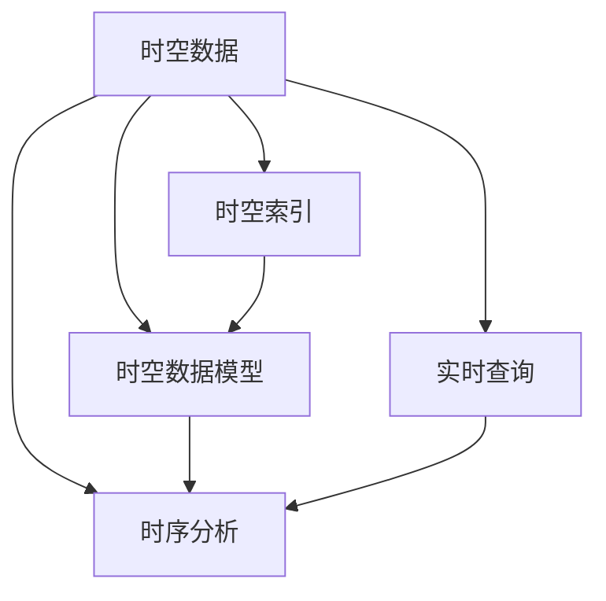

                 

# 时空数据库：管理地理位置和时间数据

## 1. 背景介绍

### 1.1 问题由来

随着物联网(IoT)、地理信息系统(GIS)和位置服务的蓬勃发展，地理空间数据的应用场景愈发多样，重要性也日益提升。地理位置数据通常包含时间维度，因而时空数据库(Spatial-Temporal Database)应运而生。时空数据库管理地理位置和时间数据，能够提供地理位置的实时查询、空间分析和时序变化等丰富的功能，是实现位置服务应用的基础。

时空数据库的研究始于20世纪70年代，早期以静态空间数据为主，侧重于位置数据的存储和查询。90年代起，时空数据库逐渐引入了时间维度，形成时空数据库的雏形。随着大数据、云计算等技术的发展，时空数据库的应用场景进一步拓展，在智能城市、精准农业、环境监测等领域发挥了重要作用。

### 1.2 问题核心关键点

时空数据库的核心挑战在于如何高效地管理并分析地理位置和时间数据。其关键点包括：

- 数据的多维性：地理位置和时间数据具有同时性的特点，需要管理多维空间数据和时间序列数据。
- 时空索引：需要高效的空间索引结构支持位置数据的快速定位和检索。
- 时序分析：需要支持对时间维度的处理，能够进行时间序列分析和预测。
- 实时查询：需要实现对地理位置数据的实时查询和更新。

### 1.3 问题研究意义

时空数据库在现代位置服务中扮演着关键角色。它不仅为地理位置的时间维度提供强有力的支持，还能通过时序分析、空间查询等手段，为智能城市、精准农业、环境监测等领域提供关键数据支撑。时空数据库的研究有助于提升数据管理效率，降低数据存储和处理成本，推动地理空间数据的深入应用。

## 2. 核心概念与联系

### 2.1 核心概念概述

时空数据库研究包含以下几个核心概念：

- **时空数据**：地理位置和时间数据的总称。时空数据通常包含点、线、面等多种几何类型，并伴有丰富的时间信息。
- **时空索引**：用于加速时空数据访问的数据结构，如R树、Quadtree等。
- **时空数据模型**：描述时空数据及其属性的数据模型，如GML、GeoJSON等。
- **时序分析**：对时空数据的时间维度进行分析，包括时序模式识别、时间序列预测等。
- **实时查询**：支持对地理位置数据的实时访问和更新，能够满足位置服务对实时性的要求。

这些核心概念之间的逻辑关系可以通过以下Mermaid流程图来展示：



这个流程图展示时空数据库的核心概念及其之间的关系：

1. 时空数据是时空数据库管理的主要对象。
2. 时空索引为时空数据的快速访问提供支持。
3. 时空数据模型用于描述时空数据的属性。
4. 时序分析对时空数据的时间维度进行处理。
5. 实时查询满足位置服务对实时性的需求。

## 3. 核心算法原理 & 具体操作步骤

### 3.1 算法原理概述

时空数据库的核心算法原理围绕时空数据的高效存储、索引和查询展开。算法核心包括：

- 时空索引算法：用于管理地理位置数据的空间索引结构。
- 时序分析算法：用于分析地理位置数据的时间维度的算法。
- 实时查询算法：用于实现对地理位置数据的实时访问和更新。

### 3.2 算法步骤详解

#### 3.2.1 时空索引算法

时空索引算法旨在提高地理位置数据的查询效率。常见的时空索引结构有R树和Quadtree等，其核心思想是减少空间数据检索时的搜索范围。

**R树算法**：R树是一种多维空间索引结构，用于快速定位空间数据的查询。其核心思想是将空间数据按照一定规则划分为多个子树，每个子树包含与父节点相似的区域。在查询时，首先搜索根节点，然后在与其相似的子树中继续搜索，以此实现空间数据的高效定位。

**Quadtree算法**：Quadtree是一种四叉树结构，用于管理空间数据。其核心思想是将空间数据递归地分成四个子区域，每个子区域包含一部分空间数据。在查询时，首先搜索根节点，然后在其子区域中继续搜索，以此实现空间数据的高效定位。

#### 3.2.2 时序分析算法

时序分析算法用于处理时空数据的时间维度，包括时间序列的分析和预测等。

**时间序列分析**：时间序列分析是一种统计方法，用于从时间维度的数据中发现时间模式。常用的方法包括ARIMA模型、时间序列分解等。

**时间序列预测**：时间序列预测是指根据历史数据，预测未来时间点的数据值。常用的方法包括回归分析、神经网络等。

#### 3.2.3 实时查询算法

实时查询算法用于实现对地理位置数据的实时访问和更新。

**实时查询**：实时查询算法通过缓存、索引等技术，实现对地理位置数据的快速访问。常用的方法包括缓存技术、内存数据库等。

**实时更新**：实时更新算法用于对地理位置数据进行实时更新。常用的方法包括日志结构数据库、分布式数据库等。

### 3.3 算法优缺点

时空数据库的算法具有以下优点：

- 高效的空间查询：时空索引算法能够显著提高空间数据的查询效率。
- 时间维度的处理：时序分析算法能够对时空数据的时间维度进行深入分析。
- 实时数据的支持：实时查询算法能够实现对地理位置数据的实时访问和更新。

同时，时空数据库的算法也存在以下局限：

- 索引结构复杂：时空索引算法虽然提高了查询效率，但需要维护复杂的索引结构。
- 时间序列的复杂性：时序分析算法虽然能够处理时间维度的数据，但复杂性较高。
- 实时性的要求：实时查询算法虽然能够实现实时访问，但需要较高的硬件资源支持。

### 3.4 算法应用领域

时空数据库在多个领域中得到了广泛的应用，包括：

- 智能城市：用于实现城市交通管理、环境监测等功能。
- 精准农业：用于管理农田的种植、灌溉等数据。
- 环境监测：用于监测环境污染、气候变化等数据。
- 地理信息系统(GIS)：用于存储和管理地理位置数据。

## 4. 数学模型和公式 & 详细讲解 & 举例说明

### 4.1 数学模型构建

时空数据库的核心数学模型包括空间数据模型和时间数据模型。

**空间数据模型**：描述地理位置的空间属性，如点、线、面等几何类型。常用的模型包括GML、GeoJSON等。

**时间数据模型**：描述地理位置数据的时间属性，如时间戳、时间序列等。常用的模型包括MySQL Time、PostgreSQL Time等。

### 4.2 公式推导过程

**时间序列分析公式**：

$$
\begin{aligned}
&\text{ARIMA}(p, d, q) \\
&= (1 - \phi_1 L)(1 - \phi_2 L^2) \cdots (1 - \phi_p L^p) \\
& \quad \times \frac{1}{(1 - \theta_1 L)(1 - \theta_2 L^2) \cdots (1 - \theta_q L^q)} \\
& \quad \times (1 - L^d) X_t
\end{aligned}
$$

其中，$L$ 为滞后算子，$X_t$ 为时间序列，$\phi_i$ 为自回归参数，$\theta_i$ 为差分参数，$d$ 为差分阶数。

**时序预测公式**：

$$
\hat{y}_{t+h} = \sum_{i=1}^n \alpha_i y_{t-i} + \beta_t
$$

其中，$\hat{y}_{t+h}$ 为预测值，$y_{t-i}$ 为历史数据，$\alpha_i$ 为权重，$\beta_t$ 为常数项。

### 4.3 案例分析与讲解

**案例：智能城市交通管理**

智能城市交通管理是一个典型的时空数据库应用场景。假设某城市希望实现交通流量的实时监测和预测，可以构建一个时空数据库来存储和管理交通数据。

1. **数据收集**：通过安装在道路上的传感器，收集车辆的位置、速度等数据。数据包含时间和地理位置信息。

2. **时空数据存储**：将收集到的数据存储在时空数据库中，利用R树索引结构对地理位置数据进行高效定位。

3. **时间序列分析**：对历史交通流量数据进行分析，发现交通流量的周期性变化，建立交通流量的时间序列模型。

4. **实时查询和预测**：利用实时查询算法，对当前的交通流量进行实时查询。同时，利用时间序列预测算法，对未来的交通流量进行预测。

通过时空数据库的管理和分析，可以实现交通流量实时监测、交通拥堵预测、应急响应等功能，提升城市的交通管理水平。

## 5. 项目实践：代码实例和详细解释说明

### 5.1 开发环境搭建

要进行时空数据库的开发和实践，需要搭建一个开发环境。以下是使用Python进行时空数据库开发的环境配置流程：

1. 安装Python：从官网下载并安装Python 3.x版本。

2. 安装Python依赖包：安装必要的依赖包，如pandas、numpy、geopandas等。

3. 安装SQL数据库：安装MySQL、PostgreSQL等SQL数据库，用于存储时空数据。

4. 安装时空数据库：安装时空数据库引擎，如PostGIS、GeoPandas等，用于管理时空数据。

### 5.2 源代码详细实现

以下是一个使用PostGIS和GeoPandas进行时空数据库开发的基本代码实现。

```python
import geopandas as gpd
import psycopg2

# 连接数据库
conn = psycopg2.connect(
    host="localhost",
    database="gisdb",
    user="postgres",
    password="password"
)

# 创建R树索引
with gpd.GeoDataFrame(data=[{'id': 1, 'geometry': gpd.Point(0, 0)}) as df:
    df.to_crs(epsg=4326).to_file('data.shp', driver='ESRI Shapefile')
    
# 将R树索引导入数据库
sql = '''
    CREATE TABLE my_table (
        id SERIAL PRIMARY KEY,
        geometry GEOMETRY
    );
    
    CREATE INDEX my_index ON my_table USING Rtree(geometry);
'''
    
conn.cursor().execute(sql)
conn.commit()
```

### 5.3 代码解读与分析

**代码解读**：

1. 首先，安装Python和必要的依赖包，包括geopandas、psycopg2等。

2. 通过psycopg2连接PostgreSQL数据库。

3. 创建R树索引。

   - 将GeoPandas的点数据保存到Shapefile文件中。
   - 使用SQL语句在数据库中创建表，包含ID和几何类型字段。
   - 在几何类型字段上创建R树索引。

**分析**：

- 使用GeoPandas进行数据处理和地理信息管理，利用psycopg2连接数据库，完成时空数据的存储。
- 使用SQL语句创建R树索引，实现空间数据的快速定位。

**运行结果展示**：

```bash
-- 运行结果展示
-- 查询当前数据库中的表结构
SELECT * FROM information_schema.columns WHERE table_schema = 'GISDB';

-- 查询当前数据库中的空间索引
SELECT indexname, indexdef FROM pg_index WHERE relnamespace = 1314;
```

## 6. 实际应用场景

### 6.1 智能城市

智能城市交通管理是一个典型的时空数据库应用场景。通过时空数据库，可以实现城市交通流量的实时监测和预测，提升城市交通管理水平。

### 6.2 精准农业

精准农业中，时空数据库可以用于管理农田的种植、灌溉等数据，帮助农民实时监控和管理农田。

### 6.3 环境监测

环境监测中，时空数据库可以用于存储和管理环境污染、气候变化等数据，提供环境监测和预警功能。

### 6.4 地理信息系统(GIS)

GIS中，时空数据库用于存储和管理地理位置数据，支持地理信息的查询和分析。

## 7. 工具和资源推荐

### 7.1 学习资源推荐

为了帮助开发者系统掌握时空数据库的理论基础和实践技巧，这里推荐一些优质的学习资源：

1. 《时空数据库设计》书籍：系统讲解时空数据库的设计和实现原理。

2. 《GIS和空间分析》课程：介绍地理信息系统(GIS)的基本概念和空间分析技术。

3. 《时序数据分析》书籍：讲解时序数据的分析方法和模型。

4. 《PostGIS官方文档》：PostGIS数据库的官方文档，提供详细的使用指南和示例代码。

5. 《GeoPandas官方文档》：GeoPandas库的官方文档，提供空间数据处理的详细指南和示例代码。

### 7.2 开发工具推荐

进行时空数据库的开发，需要选择合适的开发工具。以下是几款常用的时空数据库开发工具：

1. PostGIS：PostgreSQL的地理空间扩展，支持时空数据的存储和管理。

2. GeoPandas：Python的地理空间分析库，支持空间数据的高效处理和分析。

3. ArcGIS：ESRI开发的地理信息系统软件，支持地理信息的查询和分析。

4. QGIS：开源的地理信息系统软件，支持GIS的开发和应用。

5. MySQL：常用的关系型数据库，支持时空数据的存储和管理。

### 7.3 相关论文推荐

时空数据库的研究已经取得不少成果，以下是几篇重要的相关论文，推荐阅读：

1. Spatial-Temporal Data Management: A Survey （ spatial data management论文）：综述时空数据库的研究进展，提供丰富的参考文献。

2. Temporal Data Management: A Survey （ temporal data management论文）：综述时序数据的管理和分析方法，提供丰富的参考文献。

3. Spatial and Temporal Data Analytics （ spatial-temporal data analytics论文）：介绍时空数据的分析方法和技术，提供丰富的示例代码。

## 8. 总结：未来发展趋势与挑战

### 8.1 总结

本文对时空数据库的基本概念和核心算法原理进行了全面系统的介绍。时空数据库是现代位置服务的基础，通过高效管理地理位置和时间数据，提供了地理位置的实时查询、空间分析和时序变化等丰富的功能。时空数据库的研究对提升数据管理效率、降低数据存储和处理成本具有重要意义。

通过本文的系统梳理，可以看到，时空数据库的管理和分析在智能城市、精准农业、环境监测等领域发挥着关键作用。未来，伴随技术的不断发展，时空数据库将有更广泛的应用前景，为人类社会的数字化、智能化提供更坚实的技术支撑。

### 8.2 未来发展趋势

时空数据库的未来发展趋势主要包括以下几个方面：

1. 大尺度数据管理：随着大数据技术的发展，时空数据库需要支持更大规模的数据管理，提高数据存储和处理能力。

2. 实时性提升：未来时空数据库需要实现更高的实时性，支持秒级甚至毫秒级的实时查询和更新。

3. 跨平台兼容性：时空数据库需要支持多种数据格式和多种数据库引擎，提高系统的灵活性和可扩展性。

4. 自动化管理：时空数据库需要实现自动化的数据管理，包括数据备份、数据恢复等，降低人工操作的风险和成本。

5. 知识图谱融合：时空数据库需要与知识图谱等专家知识结合，实现更加全面、准确的信息整合能力。

### 8.3 面临的挑战

尽管时空数据库在现代位置服务中已经取得不少成果，但仍然面临以下挑战：

1. 数据存储成本：大规模时空数据的存储和处理需要较高的硬件资源和存储成本。

2. 数据一致性：多用户并发访问时空数据库时，如何保证数据的一致性和稳定性。

3. 数据质量控制：时空数据的质量控制是一个重要的问题，如何保证数据的准确性和完整性。

4. 算法复杂性：时空数据的分析和预测算法复杂性较高，需要更多的理论研究和技术积累。

5. 隐私保护：时空数据的隐私保护是一个敏感的问题，需要合理的算法和策略保护用户隐私。

### 8.4 研究展望

未来时空数据库的研究方向主要包括：

1. 新型索引结构：研究新型时空索引结构，提高时空数据的查询效率。

2. 时序分析算法：研究新型时间序列分析算法，提高时间序列预测的精度。

3. 实时查询算法：研究新型实时查询算法，提高地理位置数据的实时访问和更新效率。

4. 跨领域融合：研究时空数据库与其他技术的融合，提升时空数据的应用价值。

5. 自动化管理：研究时空数据的自动化管理，提升系统的灵活性和可扩展性。

通过不断攻克挑战，创新和完善时空数据库技术，未来时空数据库将能够更好地支持现代位置服务的发展，为人类社会的数字化、智能化提供更强大的技术支持。

## 9. 附录：常见问题与解答

**Q1：时空数据库是否适用于所有地理位置和时间数据？**

A: 时空数据库在大多数地理位置和时间数据的管理中都能取得不错的效果。但对于一些特殊的数据类型，如复杂地理图形、高精度时间序列等，时空数据库可能需要更多的优化和定制。

**Q2：如何进行时空数据的索引优化？**

A: 时空数据的索引优化是时空数据库性能提升的关键。常用的优化方法包括：

1. 选择合适的索引结构：如R树、Quadtree等，根据数据特点选择合适的索引结构。

2. 优化索引结构：如调整R树的最大深度、最小叶子节点数等参数，优化索引结构的性能。

3. 空间聚类：对空间数据进行聚类，减少索引结构的搜索范围。

4. 缓存技术：利用缓存技术提高索引结构的访问速度。

**Q3：如何实现时空数据的实时查询和更新？**

A: 实现时空数据的实时查询和更新，需要结合数据库的实时处理能力和缓存技术。常用的方法包括：

1. 利用缓存技术：将经常访问的空间数据缓存到内存中，提高查询速度。

2. 利用数据库的实时处理能力：选择支持实时处理的数据库引擎，如PostgreSQL的PostGIS、MySQL的GeoPandas等。

3. 利用分布式数据库：通过分布式数据库实现地理位置数据的分布式存储和访问，提高系统的可扩展性和稳定性。

**Q4：时空数据库在智能城市中的应用有哪些？**

A: 时空数据库在智能城市中的应用主要包括以下几个方面：

1. 交通管理：通过时空数据库管理车辆的位置、速度等数据，实现交通流量的实时监测和预测。

2. 环境监测：通过时空数据库管理环境污染、气候变化等数据，实现环境监测和预警。

3. 城市规划：通过时空数据库管理城市建设数据，支持城市规划和决策。

4. 应急响应：通过时空数据库管理紧急事件的位置信息，支持应急响应的快速定位和调度。

作者：禅与计算机程序设计艺术 / Zen and the Art of Computer Programming

