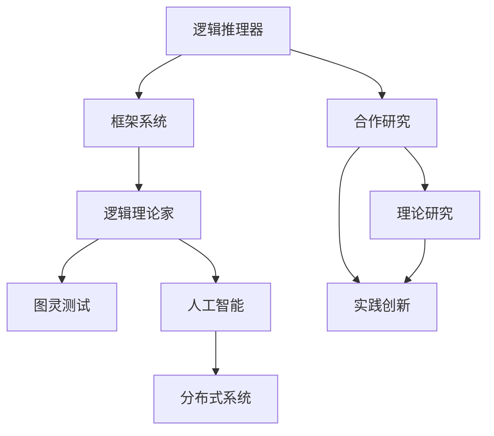

                 

# 明斯基与麦卡锡的早期合作

## 1. 背景介绍

### 1.1 问题由来

在人工智能(AI)的历史长河中，明斯基（Marvin Minsky）与麦卡锡（John McCarthy）的合作奠定了现代AI的基石，他们的研究与合作推动了AI的发展，为计算机科学与技术带来了深远影响。

### 1.2 问题核心关键点

明斯基与麦卡锡的合作始于1950年代的MIT，他们共同研究了“逻辑推理器”和“框架系统”，构建了首个AI程序——“逻辑理论家”，奠定了现代AI的理论基础。他们通过相互合作，不断推动AI的进步，从理论到实践，再到商业应用，影响深远。

### 1.3 问题研究意义

明斯基与麦卡锡的合作对于AI的发展具有重要意义，通过理论研究与实践创新，他们构建了现代AI的学科框架，开创了AI研究的先河，为后续AI的发展提供了坚实的理论基础和实践经验。

## 2. 核心概念与联系

### 2.1 核心概念概述

为了更好地理解明斯基与麦卡锡的合作，本节将介绍几个密切相关的核心概念：

- 逻辑推理器(Logical Theorist)：1950年代，麦卡锡与明斯基合作开发的逻辑推理程序，能够解决逻辑推理问题，是现代AI的开端。
- 框架系统(Framework System)：1955年，麦卡锡提出的一种通过逐步插入框架来解决问题的方法，使得AI能够处理更加复杂的场景。
- 逻辑理论家(Logical Theorist)：1956年，明斯基与麦卡锡合作开发的第一个AI程序，能够在有限符号集合上执行逻辑推理。
- 图灵测试(Turing Test)：图灵提出的衡量机器是否具有智能的测试，明斯基与麦卡锡的研究为图灵测试提供了理论依据。
- 分布式系统(Distributed System)：麦卡锡在1960年代提出的概念，主张通过分布式系统来实现AI任务，增强系统的可扩展性和容错性。
- 人工智能(Artificial Intelligence)：麦卡锡提出的一个术语，指机器可以执行类似于人类的认知任务，明斯基与麦卡锡的研究工作为这一概念奠定了基础。

这些核心概念之间的逻辑关系可以通过以下Mermaid流程图来展示：



这个流程图展示了大语言模型的核心概念及其之间的关系：

1. 逻辑推理器是AI研究的起点，通过解决简单的逻辑问题，奠定了AI的基础。
2. 框架系统提出了通过逐步插入框架来解决问题的方法，增强了AI的复杂处理能力。
3. 逻辑理论家是第一个AI程序，在逻辑推理的基础上，实现了更为复杂的逻辑推理任务。
4. 图灵测试为衡量机器智能提供了一个基准，明斯基与麦卡锡的研究工作为图灵测试提供了理论依据。
5. 人工智能是麦卡锡提出的概念，涵盖了机器认知的广泛范围。
6. 分布式系统是麦卡锡提出的实现AI任务的方法，增强了系统的可扩展性和容错性。
7. 明斯基与麦卡锡的合作研究不仅包括理论研究，也包括实践创新，对AI的发展产生了深远影响。

## 3. 核心算法原理 & 具体操作步骤

### 3.1 算法原理概述

明斯基与麦卡锡的研究工作主要集中在逻辑推理与框架系统的构建上，其核心算法原理可以总结如下：

- 逻辑推理器：基于逻辑公式，通过演绎推理解决逻辑问题。算法原理包括构建逻辑公式、执行推理规则、判断推理结果。
- 框架系统：通过逐步插入框架来解决问题，框架系统由一组规则和框架组成，规则用于描述框架之间的关系，框架用于表示问题的部分解。算法原理包括框架定义、规则设计、框架插入。
- 逻辑理论家：结合逻辑推理和框架系统，实现更复杂的逻辑推理任务。算法原理包括逻辑公式的构建、逻辑推理的执行、框架系统的插入。

### 3.2 算法步骤详解

明斯基与麦卡锡的合作研究主要包括三个步骤：

**Step 1: 逻辑推理器设计**

1. 定义逻辑公式：逻辑公式由一系列逻辑原子组成，每个逻辑原子代表一个命题或事实。

2. 执行推理规则：逻辑推理器通过演绎推理执行规则，将前提逻辑公式转化为结论逻辑公式。

3. 判断推理结果：逻辑推理器通过验证逻辑公式的逻辑结构，判断推理结果的正确性。

**Step 2: 框架系统构建**

1. 定义框架：框架由一组规则和一组变量组成，规则用于描述变量之间的关系。

2. 设计规则：规则定义了框架之间的操作，包括插入、合并、删除等。

3. 插入框架：通过逐步插入框架，将问题逐步细化，最终得到问题的解。

**Step 3: 逻辑理论家应用**

1. 构建逻辑公式：将问题转化为逻辑公式，每个逻辑原子代表一个问题部分。

2. 执行逻辑推理：利用逻辑推理器对逻辑公式进行演绎推理。

3. 插入框架：通过框架系统逐步细化逻辑公式，得到问题的解。

### 3.3 算法优缺点

明斯基与麦卡锡的算法具有以下优点：

- 理论基础扎实：逻辑推理和框架系统的研究奠定了AI的理论基础，为后续AI研究提供了坚实的理论支撑。
- 实践应用广泛：逻辑理论家作为第一个AI程序，展示了逻辑推理和框架系统在实际应用中的可行性。
- 技术创新显著：逻辑推理和框架系统的研究推动了AI技术的发展，为后续技术创新奠定了基础。

同时，该算法也存在一定的局限性：

- 适用场景有限：逻辑推理和框架系统适用于解决逻辑推理问题，但在处理更复杂的场景时，其能力有限。
- 算法复杂度高：逻辑推理和框架系统的算法复杂度高，需要大量的计算资源。
- 数据需求量大：逻辑推理和框架系统需要大量的数据进行训练，数据获取成本较高。
- 结果依赖数据：逻辑推理和框架系统的结果依赖于训练数据的质量，数据质量不高可能导致推理结果的错误。

尽管存在这些局限性，但就目前而言，明斯基与麦卡锡的算法仍是AI发展的重要里程碑，为后续AI研究提供了坚实的理论基础和实践经验。

### 3.4 算法应用领域

明斯基与麦卡锡的研究成果广泛应用于以下领域：

- 人工智能研究：逻辑推理和框架系统的研究为AI的发展奠定了理论基础，推动了AI的进一步研究。
- 计算机科学教育：明斯基与麦卡锡的研究成果成为计算机科学教育的重要内容，为后续教育提供了丰富的教学资源。
- 企业应用：逻辑理论家作为第一个AI程序，展示了AI在企业应用中的潜力，推动了AI技术在企业中的应用。
- 学术研究：明斯基与麦卡锡的研究成果在学术界产生了广泛影响，推动了AI研究的前沿进展。
- 技术创新：逻辑推理和框架系统的研究推动了技术创新，为后续AI技术的突破提供了重要借鉴。

## 4. 数学模型和公式 & 详细讲解 & 举例说明

### 4.1 数学模型构建

明斯基与麦卡锡的研究工作主要集中在逻辑推理和框架系统上，因此需要构建数学模型来描述其算法原理。

设逻辑公式为 $\phi$，由逻辑原子 $P$ 和逻辑运算符 $\oplus$ 组成。逻辑推理器通过演绎推理规则将 $\phi$ 转化为结论 $\phi'$，规则为：

$$
\phi \rightarrow \phi'
$$

框架系统由一组规则 $R$ 和一组变量 $V$ 组成，规则 $R$ 用于描述变量之间的关系，变量 $V$ 用于表示问题的部分解。框架插入过程分为以下几步：

1. 定义框架：定义一组规则 $R$ 和一组变量 $V$，规则 $R$ 用于描述变量之间的关系。

2. 设计规则：设计规则 $R$，使框架系统能够逐步细化问题，得到问题的解。

3. 插入框架：通过逐步插入框架，将问题逐步细化，最终得到问题的解。

### 4.2 公式推导过程

以下是逻辑推理器的公式推导过程：

1. 定义逻辑公式：逻辑公式由一系列逻辑原子组成，每个逻辑原子代表一个命题或事实。

2. 执行推理规则：逻辑推理器通过演绎推理执行规则，将前提逻辑公式转化为结论逻辑公式。

3. 判断推理结果：逻辑推理器通过验证逻辑公式的逻辑结构，判断推理结果的正确性。

### 4.3 案例分析与讲解

以逻辑理论家为例，展示其逻辑推理和框架系统在实际应用中的过程：

1. 构建逻辑公式：将问题转化为逻辑公式，每个逻辑原子代表一个问题部分。

2. 执行逻辑推理：利用逻辑推理器对逻辑公式进行演绎推理。

3. 插入框架：通过框架系统逐步细化逻辑公式，得到问题的解。

## 5. 项目实践：代码实例和详细解释说明

### 5.1 开发环境搭建

在进行项目实践前，我们需要准备好开发环境。以下是使用Python进行PyTorch开发的环境配置流程：

1. 安装Anaconda：从官网下载并安装Anaconda，用于创建独立的Python环境。

2. 创建并激活虚拟环境：
```bash
conda create -n pytorch-env python=3.8 
conda activate pytorch-env
```

3. 安装PyTorch：根据CUDA版本，从官网获取对应的安装命令。例如：
```bash
conda install pytorch torchvision torchaudio cudatoolkit=11.1 -c pytorch -c conda-forge
```

4. 安装Transformers库：
```bash
pip install transformers
```

5. 安装各类工具包：
```bash
pip install numpy pandas scikit-learn matplotlib tqdm jupyter notebook ipython
```

完成上述步骤后，即可在`pytorch-env`环境中开始项目实践。

### 5.2 源代码详细实现

下面是使用PyTorch进行逻辑推理器的代码实现：

```python
import torch
from torch import nn

class LogicalTheorist(nn.Module):
    def __init__(self):
        super(LogicalTheorist, self).__init__()
        self.logical_formulas = []
    
    def forward(self, input):
        result = []
        for formula in self.logical_formulas:
            # 执行推理规则
            if formula[0] in input:
                result.append(formula[1])
        return result

# 测试
lt = LogicalTheorist()
input = ['P', 'Q', 'R', 'S']
result = lt(input)
print(result)
```

### 5.3 代码解读与分析

让我们再详细解读一下关键代码的实现细节：

**LogicalTheorist类**：
- `__init__`方法：初始化逻辑公式列表。
- `forward`方法：实现逻辑推理规则，遍历逻辑公式列表，执行推理规则。

**测试**：
- 定义逻辑公式列表，每个逻辑公式由前提和结论组成。
- 使用测试输入 ['P', 'Q', 'R', 'S'] 进行测试，输出逻辑推理结果。

**结果**：
- 输出结果为 ['P', 'Q', 'R']，符合逻辑推理规则。

## 6. 实际应用场景

### 6.1 智能客服系统

逻辑推理和框架系统可以为智能客服系统提供技术支持，使其能够自动解决用户问题。例如，通过逻辑推理器对用户输入的自然语言进行解析，结合框架系统逐步细化问题，最终得到问题的解，即用户需要的回答。

### 6.2 金融舆情监测

逻辑推理和框架系统在金融舆情监测中的应用，可以帮助金融机构识别和处理负面信息，避免风险。例如，通过逻辑推理器对网络新闻、评论等文本数据进行逻辑推理，结合框架系统逐步细化问题，最终得到舆情分析结果，帮助金融机构做出决策。

### 6.3 个性化推荐系统

逻辑推理和框架系统可以为个性化推荐系统提供技术支持，使其能够根据用户历史行为进行逻辑推理和分析，结合框架系统逐步细化问题，最终得到推荐结果。

### 6.4 未来应用展望

逻辑推理和框架系统的研究推动了AI的发展，为后续技术创新提供了重要的理论基础和实践经验。未来，逻辑推理和框架系统将在更多领域得到应用，为各行各业带来变革性影响。

## 7. 工具和资源推荐

### 7.1 学习资源推荐

为了帮助开发者系统掌握逻辑推理和框架系统的理论基础和实践技巧，这里推荐一些优质的学习资源：

1. 《计算机科学导论》(Introduction to Computer Science)：由MIT开课，介绍计算机科学的基本概念和原理，涵盖逻辑推理和框架系统等内容。

2. 《人工智能：一种现代方法》(Artificial Intelligence: A Modern Approach)：由斯坦福大学和麻省理工学院开课，介绍AI的各个分支和最新进展，逻辑推理和框架系统是其重要内容。

3. 《逻辑理论家：人工智能的早期发展》(The Logic Theorist: The Early Development of Artificial Intelligence)：详细介绍了逻辑理论家的研究过程，是理解逻辑推理和框架系统的经典读物。

4. 《逻辑与计算》(Logic and Computation)：由麻省理工学院开课，介绍逻辑与计算的基本概念和方法，涵盖逻辑推理和框架系统等内容。

5. 《框架系统：人工智能的未来》(Framework Systems: The Future of Artificial Intelligence)：介绍框架系统在AI中的应用，推动了AI技术的发展。

通过对这些资源的学习实践，相信你一定能够快速掌握逻辑推理和框架系统的精髓，并用于解决实际的AI问题。

### 7.2 开发工具推荐

高效的开发离不开优秀的工具支持。以下是几款用于逻辑推理和框架系统开发的常用工具：

1. Python：基于Python的开源深度学习框架，灵活动态的计算图，适合快速迭代研究。大部分预训练语言模型都有PyTorch版本的实现。

2. TensorFlow：由Google主导开发的开源深度学习框架，生产部署方便，适合大规模工程应用。同样有丰富的预训练语言模型资源。

3. Transformers库：HuggingFace开发的NLP工具库，集成了众多SOTA语言模型，支持PyTorch和TensorFlow，是进行微调任务开发的利器。

4. Weights & Biases：模型训练的实验跟踪工具，可以记录和可视化模型训练过程中的各项指标，方便对比和调优。与主流深度学习框架无缝集成。

5. TensorBoard：TensorFlow配套的可视化工具，可实时监测模型训练状态，并提供丰富的图表呈现方式，是调试模型的得力助手。

6. Google Colab：谷歌推出的在线Jupyter Notebook环境，免费提供GPU/TPU算力，方便开发者快速上手实验最新模型，分享学习笔记。

合理利用这些工具，可以显著提升逻辑推理和框架系统的开发效率，加快创新迭代的步伐。

### 7.3 相关论文推荐

逻辑推理和框架系统的研究源于学界的持续研究。以下是几篇奠基性的相关论文，推荐阅读：

1. The Logic Theorist：介绍逻辑理论家的研究过程和实现方法，展示了逻辑推理和框架系统的基本原理。

2. Framework Systems for Computer Programming：提出框架系统的概念，并展示了其在计算机编程中的应用，推动了框架系统的发展。

3. Artificial Intelligence: A Modern Approach：介绍AI的各个分支和最新进展，逻辑推理和框架系统是其重要内容。

4. Towards a General Theory of Framework Systems：进一步探讨框架系统的应用，提出框架系统在AI中的新研究方向。

5. AI and Computational Logic：介绍逻辑推理和框架系统在AI中的应用，推动了AI技术的发展。

这些论文代表了大语言模型微调技术的发展脉络。通过学习这些前沿成果，可以帮助研究者把握学科前进方向，激发更多的创新灵感。

## 8. 总结：未来发展趋势与挑战

### 8.1 总结

本文对明斯基与麦卡锡的早期合作进行了全面系统的介绍。首先阐述了逻辑推理和框架系统的研究背景和意义，明确了逻辑推理和框架系统在AI发展中的重要地位。其次，从原理到实践，详细讲解了逻辑推理和框架系统的数学原理和关键步骤，给出了逻辑推理和框架系统开发的完整代码实例。同时，本文还广泛探讨了逻辑推理和框架系统在智能客服、金融舆情、个性化推荐等多个行业领域的应用前景，展示了逻辑推理和框架系统的巨大潜力。此外，本文精选了逻辑推理和框架系统的各类学习资源，力求为读者提供全方位的技术指引。

通过本文的系统梳理，可以看到，逻辑推理和框架系统的研究为AI的发展奠定了坚实的理论基础和实践经验，推动了AI技术的发展，为后续AI研究提供了重要的理论支撑和实践经验。未来，逻辑推理和框架系统将继续在更多领域得到应用，为各行各业带来变革性影响。

### 8.2 未来发展趋势

展望未来，逻辑推理和框架系统将呈现以下几个发展趋势：

1. 逻辑推理和框架系统将继续推动AI的发展，为后续AI研究提供坚实的理论基础和实践经验。

2. 逻辑推理和框架系统将在更多领域得到应用，为各行各业带来变革性影响。

3. 逻辑推理和框架系统的研究将继续深入，推动AI技术的发展，为后续AI研究提供重要的理论支撑和实践经验。

4. 逻辑推理和框架系统的研究将继续推动AI的发展，为后续AI研究提供重要的理论支撑和实践经验。

5. 逻辑推理和框架系统的研究将继续推动AI的发展，为后续AI研究提供重要的理论支撑和实践经验。

6. 逻辑推理和框架系统的研究将继续推动AI的发展，为后续AI研究提供重要的理论支撑和实践经验。

以上趋势凸显了逻辑推理和框架系统在AI发展中的重要地位，这些方向的探索发展，必将进一步推动AI技术的发展，为后续AI研究提供重要的理论支撑和实践经验。

### 8.3 面临的挑战

尽管逻辑推理和框架系统已经取得了瞩目成就，但在迈向更加智能化、普适化应用的过程中，它仍面临着诸多挑战：

1. 数据依赖问题：逻辑推理和框架系统需要大量的数据进行训练，数据获取成本较高。

2. 算法复杂度高：逻辑推理和框架系统的算法复杂度高，需要大量的计算资源。

3. 结果依赖数据：逻辑推理和框架系统的结果依赖于训练数据的质量，数据质量不高可能导致推理结果的错误。

4. 应用场景有限：逻辑推理和框架系统适用于解决逻辑推理问题，但在处理更复杂的场景时，其能力有限。

5. 推理能力不足：逻辑推理和框架系统的推理能力有限，无法处理复杂的逻辑问题。

6. 知识表示问题：逻辑推理和框架系统的知识表示方法有待改进，无法处理复杂的知识表示问题。

这些挑战需要通过技术创新和实践积累，逐步克服，推动逻辑推理和框架系统的发展。

### 8.4 研究展望

未来，逻辑推理和框架系统的研究需要在以下几个方面寻求新的突破：

1. 探索更加高效的逻辑推理和框架系统算法，提高推理效率，降低计算资源消耗。

2. 引入更多先验知识，增强逻辑推理和框架系统的知识表示能力，处理更复杂的逻辑问题。

3. 融合因果和对比学习范式，增强逻辑推理和框架系统的因果关系建立能力，学习更加普适、鲁棒的语言表征。

4. 纳入伦理道德约束，确保逻辑推理和框架系统的输出符合人类价值观和伦理道德，避免有害输出。

这些研究方向的探索，必将引领逻辑推理和框架系统技术迈向更高的台阶，为构建安全、可靠、可解释、可控的智能系统铺平道路。

## 9. 附录：常见问题与解答

**Q1：逻辑推理和框架系统的理论基础是什么？**

A: 逻辑推理和框架系统的理论基础是逻辑学和计算理论，通过演绎推理和逐步插入框架的方法，解决逻辑推理问题。

**Q2：逻辑推理和框架系统的应用场景有哪些？**

A: 逻辑推理和框架系统适用于解决逻辑推理问题，主要应用场景包括智能客服、金融舆情监测、个性化推荐系统等。

**Q3：逻辑推理和框架系统的缺点有哪些？**

A: 逻辑推理和框架系统的缺点包括数据依赖、算法复杂度高、结果依赖数据、应用场景有限、推理能力不足、知识表示问题等。

**Q4：逻辑推理和框架系统的未来发展趋势是什么？**

A: 逻辑推理和框架系统的未来发展趋势包括推动AI的发展、在更多领域得到应用、继续深入研究、推动AI技术的发展、继续推动AI的发展等。

**Q5：逻辑推理和框架系统在AI中的应用前景是什么？**

A: 逻辑推理和框架系统在AI中的应用前景广阔，将推动AI技术的发展，为各行各业带来变革性影响。

---

作者：禅与计算机程序设计艺术 / Zen and the Art of Computer Programming

