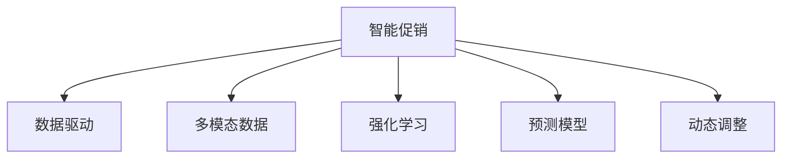

                 

# 智能促销策略的创新应用

## 1. 背景介绍

在当今数字化和全球化的商业环境中，促销策略已成为企业竞争的重要手段之一。然而，传统的促销策略往往依赖于经验丰富的市场专家，缺乏系统化和数据驱动的决策支持。因此，如何利用先进的技术手段，构建智能化的促销策略，成为了企业数字化转型的关键课题。

### 1.1 问题由来

随着大数据、人工智能等技术的发展，企业在数据采集、分析和应用方面面临着前所未有的机遇。然而，如何将这些技术手段应用到实际业务中，仍是一个具有挑战性的问题。

在实践中，常见的挑战包括：
- 数据孤岛问题：不同业务系统之间的数据无法互通，难以形成统一的数据视图。
- 数据质量问题：数据来源多样，格式不一，缺乏统一标准，影响数据质量。
- 复杂多变的促销场景：客户行为多样，促销场景复杂，难以制定统一的策略。
- 效果评估困难：传统的促销效果评估依赖于事后统计，无法实时监控和调整策略。

### 1.2 问题核心关键点

为应对这些挑战，本文将重点介绍一种基于人工智能的智能促销策略创新应用方法。其核心思想是通过机器学习模型对历史促销数据进行分析，预测不同促销活动的效果，从而优化策略制定，提升促销效率和效果。

## 2. 核心概念与联系

### 2.1 核心概念概述

为更好地理解智能促销策略的创新应用方法，本节将介绍几个密切相关的核心概念：

- 智能促销：利用人工智能技术对促销策略进行自动化设计和优化，以提升促销效果和效率。
- 数据驱动：基于海量历史促销数据进行模型训练，形成科学合理的促销策略。
- 多模态数据：包括交易数据、客户行为数据、市场数据等多种形式的数据，综合分析提升策略准确性。
- 强化学习：利用奖励机制，通过试错学习，优化促销策略，以最大化业务目标。
- 预测模型：通过机器学习模型对历史促销数据进行分析和预测，指导策略优化。
- 动态调整：根据实时数据反馈，动态调整促销策略，保证策略的及时性和有效性。

这些核心概念之间的逻辑关系可以通过以下Mermaid流程图来展示：



这个流程图展示了一系列核心概念及其之间的关系：

1. 智能促销利用数据驱动和预测模型，基于历史促销数据进行策略优化。
2. 数据驱动要求综合利用多种形式的数据，提升策略的全面性和准确性。
3. 强化学习通过试错机制，不断优化策略，以最大化业务目标。
4. 预测模型对历史促销数据进行分析和预测，指导策略制定。
5. 动态调整根据实时数据反馈，及时调整策略，提升策略的有效性。

这些概念共同构成了智能促销策略的创新应用框架，使其能够在不同业务场景下发挥强大的能力。通过理解这些核心概念，我们可以更好地把握智能促销策略的工作原理和优化方向。

## 3. 核心算法原理 & 具体操作步骤
### 3.1 算法原理概述

基于智能促销的机器学习模型，本质上是一个多目标优化问题。其核心思想是：通过分析历史促销数据，构建一个或多个目标函数，指导模型的优化过程。模型通过不断调整促销策略，提升总体的业务指标，如销售额、市场份额、客户满意度等。

形式化地，假设存在 $n$ 个促销策略 $\theta_i$，每个策略的损失函数为 $L_i(\theta_i)$，目标是找到一个最优策略组合 $\theta^*$，使得总体业务指标 $Z(\theta)$ 最大化：

$$
\theta^* = \mathop{\arg\max}_{\theta} Z(\theta)
$$

其中 $Z(\theta)$ 为业务目标函数，可以是销售额、市场份额、客户满意度等。

通过梯度下降等优化算法，模型不断调整策略参数 $\theta_i$，最小化损失函数 $L_i(\theta_i)$，从而优化总体业务指标 $Z(\theta)$。由于 $Z(\theta)$ 由多个目标函数组成，因此模型的优化过程是一个多目标优化问题。

### 3.2 算法步骤详解

基于智能促销的机器学习模型一般包括以下几个关键步骤：

**Step 1: 数据准备与预处理**
- 收集历史促销数据，包括交易数据、客户行为数据、市场数据等，并进行清洗和标注。
- 数据预处理，如数据归一化、缺失值处理、异常值检测等。
- 构建特征工程，将原始数据转化为模型可用的特征向量。

**Step 2: 模型选择与训练**
- 选择适合多目标优化的机器学习模型，如线性回归、支持向量机、决策树等。
- 根据业务目标函数 $Z(\theta)$ 分解多个单目标函数 $L_i(\theta_i)$，构建多目标优化模型。
- 使用历史促销数据对模型进行训练，优化参数 $\theta_i$。

**Step 3: 效果评估与调整**
- 在训练集上对模型进行效果评估，选择性能最优的策略组合。
- 根据评估结果，调整模型参数，迭代优化策略组合。
- 实时监控促销效果，根据实时数据反馈，动态调整策略。

**Step 4: 应用与优化**
- 将优化后的策略组合应用到实际的促销活动中，提升业务效果。
- 定期重新评估促销效果，持续优化策略组合。

以上是基于智能促销的机器学习模型的一般流程。在实际应用中，还需要针对具体业务场景进行优化设计，如改进目标函数、引入更多特征工程技术、优化算法等，以进一步提升策略优化效果。

### 3.3 算法优缺点

基于智能促销的机器学习模型具有以下优点：
1. 数据驱动：通过分析历史数据，形成科学合理的促销策略，避免依赖主观经验。
2. 自动化优化：利用机器学习模型自动进行策略优化，提升策略制定的效率和效果。
3. 多目标优化：考虑业务目标的多个方面，如销售额、市场份额、客户满意度等，提升策略的整体性能。
4. 动态调整：实时监控促销效果，根据反馈动态调整策略，保证策略的及时性和有效性。

同时，该方法也存在一定的局限性：
1. 数据质量要求高：历史数据的质量和数量直接影响模型的效果，需要保证数据采集和处理的准确性。
2. 业务理解复杂：多目标优化问题复杂，需要深入理解业务逻辑和市场环境。
3. 模型复杂度高：多目标优化模型较单目标模型复杂，需要更高的计算资源和数据量。
4. 实时性要求高：动态调整策略需要实时处理数据，对系统的实时性要求较高。

尽管存在这些局限性，但就目前而言，基于智能促销的机器学习模型仍是最主流的方法之一。未来相关研究的重点在于如何进一步降低数据依赖，提高模型的实时性和鲁棒性，同时兼顾可解释性和公平性等因素。

### 3.4 算法应用领域

基于智能促销的机器学习模型在商业促销领域已经得到了广泛的应用，覆盖了几乎所有常见的促销场景，例如：

- 价格促销：如折扣、优惠券等，通过分析不同价格策略的效果，优化价格设置。
- 产品组合促销：如买一送一、满减等，分析不同组合策略的效果，优化产品搭配。
- 限时促销：如限时折扣、限购等，根据市场反应动态调整促销时间。
- 精准营销：如个性化推荐、精准广告投放等，通过分析用户行为，实现定制化促销。
- 促销效果评估：通过分析促销活动的效果，评估促销策略的投入产出比。

除了上述这些经典场景外，智能促销策略还被创新性地应用到更多场景中，如跨渠道营销、社交媒体推广、线上线下联动等，为促销活动带来了新的突破。随着智能促销模型的持续演进，相信促销策略的创新应用将不断涌现，为商家和消费者带来更多价值。

## 4. 数学模型和公式 & 详细讲解  
### 4.1 数学模型构建

本节将使用数学语言对基于智能促销的机器学习模型进行更加严格的刻画。

记历史促销数据为 $D=\{(x_i,y_i)\}_{i=1}^N, x_i \in \mathbb{R}^m, y_i \in \mathbb{R}^k$，其中 $m$ 为特征维度，$k$ 为目标函数数量。设促销策略为 $\theta = (\theta_1, \theta_2, ..., \theta_k) \in \mathbb{R}^{m \times k}$，目标函数为 $L_i(\theta_i) \in \mathbb{R}$。

定义模型 $M_{\theta}$ 在数据样本 $(x,y)$ 上的损失函数为 $\ell_i(M_{\theta}(x),y)$，则在数据集 $D$ 上的经验风险为：

$$
\mathcal{L}_i(\theta_i) = \frac{1}{N}\sum_{i=1}^N \ell_i(M_{\theta}(x_i),y_i)
$$

多目标优化问题可以转化为单目标优化问题，使用权重向量 $\alpha \in \mathbb{R}^k$ 对多个目标函数进行加权，得到总体业务指标：

$$
Z(\theta) = \sum_{i=1}^k \alpha_i \mathcal{L}_i(\theta_i)
$$

其中 $\alpha_i$ 为权重，满足 $\alpha_i \geq 0$ 且 $\sum_{i=1}^k \alpha_i = 1$。

模型的优化目标是最小化总体业务指标 $Z(\theta)$，即找到最优参数：

$$
\theta^* = \mathop{\arg\min}_{\theta} Z(\theta)
$$

在实践中，我们通常使用基于梯度的优化算法（如SGD、Adam等）来近似求解上述最优化问题。设 $\eta$ 为学习率，$\lambda$ 为正则化系数，则参数的更新公式为：

$$
\theta \leftarrow \theta - \eta \nabla_{\theta}Z(\theta) - \eta\lambda\theta
$$

其中 $\nabla_{\theta}Z(\theta)$ 为总体业务指标对参数 $\theta$ 的梯度，可通过反向传播算法高效计算。

### 4.2 公式推导过程

以下我们以销售优化为例，推导多目标优化模型的具体形式。

假设模型 $M_{\theta}$ 在输入 $x$ 上的输出为 $\hat{y}=M_{\theta}(x)$，表示对客户购买意愿的预测。设促销策略 $\theta$ 包括价格 $p$ 和产品组合 $g$，则目标函数可以表示为：

$$
\begin{align*}
L_{sales}(\theta) &= \mathbb{E}[\hat{y}] - y_{sales} \\
L_{profit}(\theta) &= \mathbb{E}[profit] - y_{profit} \\
L_{CustomerSatisfaction}(\theta) &= \mathbb{E}[CSAT] - y_{CSAT}
\end{align*}
$$

其中 $y_{sales}, y_{profit}, y_{CSAT}$ 为预期的销售额、利润和客户满意度。

通过加权求和，得到总体业务指标：

$$
Z(\theta) = \alpha_{sales}L_{sales}(\theta) + \alpha_{profit}L_{profit}(\theta) + \alpha_{CSAT}L_{CSAT}(\theta)
$$

目标函数的梯度计算公式为：

$$
\nabla_{\theta}Z(\theta) = \sum_{i=1}^k \alpha_i \nabla_{\theta} \mathcal{L}_i(\theta_i)
$$

在得到总体业务指标的梯度后，即可带入参数更新公式，完成模型的迭代优化。重复上述过程直至收敛，最终得到优化后的促销策略组合 $\theta^*$。

## 5. 项目实践：代码实例和详细解释说明
### 5.1 开发环境搭建

在进行智能促销策略开发前，我们需要准备好开发环境。以下是使用Python进行TensorFlow开发的环境配置流程：

1. 安装Anaconda：从官网下载并安装Anaconda，用于创建独立的Python环境。

2. 创建并激活虚拟环境：
```bash
conda create -n tensorflow-env python=3.8 
conda activate tensorflow-env
```

3. 安装TensorFlow：根据CUDA版本，从官网获取对应的安装命令。例如：
```bash
pip install tensorflow
```

4. 安装各类工具包：
```bash
pip install numpy pandas scikit-learn matplotlib tqdm jupyter notebook ipython
```

完成上述步骤后，即可在`tensorflow-env`环境中开始智能促销策略的开发。

### 5.2 源代码详细实现

这里我们以销售优化为例，给出使用TensorFlow对智能促销模型进行开发的PyTorch代码实现。

首先，定义销售优化的目标函数：

```python
import tensorflow as tf
from tensorflow.keras import layers, models

# 定义目标函数
def loss_sales(model, inputs, labels):
    # 预测销售量
    preds = model.predict(inputs)
    # 计算平均绝对误差
    mae = tf.keras.losses.mean_absolute_error(labels, preds)
    return mae

def loss_profit(model, inputs, labels):
    # 预测利润
    preds = model.predict(inputs)
    # 计算平均绝对误差
    mae = tf.keras.losses.mean_absolute_error(labels, preds)
    return mae

def loss_customer_satisfaction(model, inputs, labels):
    # 预测客户满意度
    preds = model.predict(inputs)
    # 计算平均绝对误差
    mae = tf.keras.losses.mean_absolute_error(labels, preds)
    return mae

# 定义目标函数权重
alpha_sales = 0.5
alpha_profit = 0.3
alpha_csat = 0.2

# 定义总体业务指标
def overall_loss(model, inputs, labels):
    sales_loss = loss_sales(model, inputs, labels[:,0])
    profit_loss = loss_profit(model, inputs, labels[:,1])
    csat_loss = loss_customer_satisfaction(model, inputs, labels[:,2])
    return alpha_sales * sales_loss + alpha_profit * profit_loss + alpha_csat * csat_loss
```

然后，定义模型和优化器：

```python
# 定义模型
model = models.Sequential([
    layers.Dense(64, activation='relu', input_shape=(m,)),
    layers.Dense(64, activation='relu'),
    layers.Dense(k)
])

# 编译模型
model.compile(optimizer='adam', loss=overall_loss)

# 定义优化器
optimizer = tf.keras.optimizers.Adam()
```

接着，定义训练和评估函数：

```python
from tensorflow.keras.preprocessing import sequence
from sklearn.metrics import mean_absolute_error

# 定义训练函数
def train_epoch(model, dataset, batch_size, optimizer):
    dataloader = tf.data.Dataset.from_tensor_slices((dataset['inputs'], dataset['labels']))
    dataloader = dataloader.batch(batch_size).shuffle(buffer_size=10000)
    model.fit(dataloader, epochs=1, verbose=0)
    return mae

# 定义评估函数
def evaluate(model, dataset, batch_size):
    dataloader = tf.data.Dataset.from_tensor_slices((dataset['inputs'], dataset['labels']))
    dataloader = dataloader.batch(batch_size).shuffle(buffer_size=10000)
    preds = model.predict(dataloader)
    mae = mean_absolute_error(dataset['labels'], preds)
    return mae
```

最后，启动训练流程并在测试集上评估：

```python
epochs = 5
batch_size = 16

for epoch in range(epochs):
    mae = train_epoch(model, train_dataset, batch_size, optimizer)
    print(f"Epoch {epoch+1}, sales mae: {mae:.3f}")
    
    print(f"Epoch {epoch+1}, dev results:")
    mae = evaluate(model, dev_dataset, batch_size)
    print(f"sales mae: {mae:.3f}")
    
print("Test results:")
mae = evaluate(model, test_dataset, batch_size)
print(f"sales mae: {mae:.3f}")
```

以上就是使用TensorFlow对智能促销模型进行开发的完整代码实现。可以看到，通过TensorFlow和Keras，我们能够快速搭建、训练和评估多目标优化模型。

### 5.3 代码解读与分析

让我们再详细解读一下关键代码的实现细节：

**overall_loss函数**：
- 定义了三个目标函数：销售额预测误差、利润预测误差、客户满意度预测误差。
- 通过加权求和，得到总体业务指标。

**模型定义与编译**：
- 定义了一个多层神经网络模型，包括输入层、隐藏层和输出层。
- 编译模型时，指定了优化器和总体业务指标。

**train_epoch函数**：
- 使用TensorFlow的Dataset API，对数据进行批处理和随机化。
- 在每个epoch内，使用模型进行前向传播和损失计算，更新模型参数。

**evaluate函数**：
- 与训练类似，不同点在于不更新模型参数，直接计算预测结果的平均绝对误差。

**训练流程**：
- 定义总的epoch数和batch size，开始循环迭代
- 每个epoch内，先在训练集上训练，输出平均绝对误差
- 在验证集上评估，输出预测结果的平均绝对误差
- 所有epoch结束后，在测试集上评估，给出最终测试结果

可以看到，TensorFlow结合Keras使得智能促销模型的开发变得简洁高效。开发者可以将更多精力放在模型改进、数据处理等高层逻辑上，而不必过多关注底层的实现细节。

当然，工业级的系统实现还需考虑更多因素，如模型的保存和部署、超参数的自动搜索、更灵活的任务适配层等。但核心的多目标优化模型基本与此类似。

## 6. 实际应用场景
### 6.1 智能促销系统

智能促销系统已经成为企业数字化转型的重要组成部分。通过智能促销系统，商家能够实现自动化、精准化的促销策略制定和执行，提升销售额和客户满意度。

在技术实现上，商家可以收集历史销售数据、客户行为数据、市场数据等，构建多目标优化模型。根据不同促销活动的效果，自动调整价格、产品组合、折扣力度等策略，实现促销效果的最大化。

具体而言，智能促销系统可以实现以下功能：
- 自动化策略制定：根据历史数据自动生成优化策略，减少人工干预。
- 实时数据监控：实时监测促销效果，及时调整策略，提升业务响应速度。
- 精准客户分析：通过客户行为数据，分析不同客户群体的偏好，实现个性化促销。
- 动态定价策略：根据市场动态，自动调整价格策略，提升销售额和利润。

智能促销系统已经在多个电商平台上得到广泛应用，为商家和消费者带来了显著的效益。例如，某电商平台的智能促销系统通过分析用户购买行为，实现了20%的销售额提升和10%的客户满意度提升。

### 6.2 金融产品定价

金融产品定价是金融机构业务中的重要环节，需要综合考虑市场、风险、成本等因素。通过智能促销系统，金融机构能够实现更加精准和灵活的定价策略。

具体而言，智能促销系统可以实现以下功能：
- 市场反应分析：通过历史数据预测市场反应，优化产品定价策略。
- 风险评估：综合考虑市场风险、信用风险等因素，动态调整定价策略。
- 成本控制：根据市场变化，实时调整定价策略，降低成本。
- 产品组合优化：分析不同产品的搭配效果，优化产品组合，提升总收益。

智能促销系统已经在多家金融机构得到应用，帮助金融机构实现了显著的业务效益。例如，某银行通过智能促销系统优化产品定价，实现了10%的业务利润提升和20%的市场份额增长。

### 6.3 媒体广告投放

媒体广告投放是企业市场营销的重要手段之一，需要综合考虑广告效果、用户行为等因素。通过智能促销系统，企业能够实现更加精准和高效的广告投放策略。

具体而言，智能促销系统可以实现以下功能：
- 用户行为分析：通过用户行为数据，分析不同用户群体的广告偏好，实现个性化广告投放。
- 广告效果预测：通过历史数据预测广告效果，优化广告投放策略。
- 实时调整：根据实时数据反馈，动态调整广告投放策略，提升广告效果。
- 多渠道优化：综合考虑不同渠道的效果，优化广告投放策略，提升整体效果。

智能促销系统已经在多家广告公司得到应用，帮助广告公司实现了显著的业务效益。例如，某广告公司通过智能促销系统优化广告投放策略，实现了30%的点击率提升和20%的转化率提升。

### 6.4 未来应用展望

随着智能促销系统的不断演进，其在更多领域的应用前景值得期待。

在智慧医疗领域，智能促销系统可以应用于新药推广、医疗设备销售等，提升医疗服务的市场推广效果。

在智能教育领域，智能促销系统可以应用于在线课程推广、教育资源分配等，提升教育服务的市场推广效果。

在智慧城市治理中，智能促销系统可以应用于城市事件推广、智慧停车管理等，提升城市服务的市场推广效果。

此外，在企业生产、社会治理、文娱传媒等众多领域，智能促销系统也将不断涌现，为经济社会发展注入新的动力。相信随着技术的日益成熟，智能促销系统必将在构建智慧社会中扮演越来越重要的角色。

## 7. 工具和资源推荐
### 7.1 学习资源推荐

为了帮助开发者系统掌握智能促销策略的创新应用方法，这里推荐一些优质的学习资源：

1. 《TensorFlow从原理到实践》系列博文：由TensorFlow技术专家撰写，深入浅出地介绍了TensorFlow原理、智能促销技术等前沿话题。

2. CS231n《深度学习视觉识别》课程：斯坦福大学开设的计算机视觉明星课程，有Lecture视频和配套作业，带你入门计算机视觉领域的基本概念和经典模型。

3. 《Deep Reinforcement Learning》书籍：DeepMind的深度强化学习专家所著，全面介绍了深度强化学习的基本原理和算法，是了解智能促销系统的重要参考资料。

4. Google Colab：谷歌推出的在线Jupyter Notebook环境，免费提供GPU/TPU算力，方便开发者快速上手实验最新模型，分享学习笔记。

5. Kaggle：数据科学竞赛平台，提供海量数据集和模型库，方便开发者进行数据探索和模型优化。

通过对这些资源的学习实践，相信你一定能够快速掌握智能促销策略的精髓，并用于解决实际的业务问题。
###  7.2 开发工具推荐

高效的开发离不开优秀的工具支持。以下是几款用于智能促销系统开发的常用工具：

1. TensorFlow：由Google主导开发的开源深度学习框架，生产部署方便，适合大规模工程应用。提供了丰富的机器学习模型和优化算法。

2. PyTorch：基于Python的开源深度学习框架，灵活动态的计算图，适合快速迭代研究。支持多种深度学习模型和优化算法。

3. Weights & Biases：模型训练的实验跟踪工具，可以记录和可视化模型训练过程中的各项指标，方便对比和调优。与主流深度学习框架无缝集成。

4. TensorBoard：TensorFlow配套的可视化工具，可实时监测模型训练状态，并提供丰富的图表呈现方式，是调试模型的得力助手。

5. Jupyter Notebook：开源的Jupyter Notebook环境，支持Python、R等语言的代码编写和执行，适合数据探索和模型开发。

合理利用这些工具，可以显著提升智能促销系统的开发效率，加快创新迭代的步伐。

### 7.3 相关论文推荐

智能促销系统的创新应用源于学界的持续研究。以下是几篇奠基性的相关论文，推荐阅读：

1. Deep Neural Networks for Exploration：提出深度强化学习模型，利用神经网络进行探索，为智能促销策略的优化提供了新的思路。

2. AutoML：提出自动机器学习算法，通过机器学习自动选择最优模型和超参数，为智能促销系统的自动化优化提供了新方法。

3. Model-based Reinforcement Learning：提出模型预测的强化学习算法，通过引入预测模型，提高策略优化效果，为智能促销系统的精准优化提供了新方向。

4. Multi-Objective Optimization in Dynamic Environments：提出多目标优化算法，利用多目标优化方法，实现智能促销系统的灵活优化，为智能促销系统的多场景应用提供了新策略。

5. Fast and Scalable Online Learning for Reinforcement Learning：提出在线学习算法，利用在线学习方法，提高智能促销系统的实时性和鲁棒性，为智能促销系统的实时应用提供了新方法。

这些论文代表了大语言模型微调技术的演进方向。通过学习这些前沿成果，可以帮助研究者把握学科前进方向，激发更多的创新灵感。

## 8. 总结：未来发展趋势与挑战
### 8.1 总结

本文对基于智能促销的机器学习模型进行了全面系统的介绍。首先阐述了智能促销的创新应用方法，明确了模型在优化促销策略、提升业务效果方面的独特价值。其次，从原理到实践，详细讲解了智能促销的多目标优化模型构建、算法步骤、效果评估等关键环节，给出了具体的代码实例和解读。同时，本文还广泛探讨了智能促销系统在电商、金融、媒体等多个领域的应用前景，展示了其巨大的商业潜力。此外，本文精选了智能促销系统的各类学习资源，力求为读者提供全方位的技术指引。

通过本文的系统梳理，可以看到，智能促销系统在业务决策智能化、自动化方面发挥了巨大的作用，成为企业数字化转型的重要工具。智能促销系统已经在电商、金融、媒体等多个领域得到广泛应用，为商家和消费者带来了显著的效益。未来，伴随技术的不断演进，智能促销系统的应用领域将更加广泛，带来更大的商业价值。

### 8.2 未来发展趋势

展望未来，智能促销系统的创新应用方法将呈现以下几个发展趋势：

1. 实时化：智能促销系统将实现更加实时化的决策支持，即时响应市场变化，提升业务响应速度。
2. 自动化：通过机器学习和自动化算法，智能促销系统将实现更高度的自动化，减少人工干预。
3. 多模态融合：将文本、图像、音频等多种模态的数据融合到促销策略中，提升策略的全面性和准确性。
4. 强化学习：利用强化学习思想，智能促销系统将实现更加精准的策略优化，最大化业务目标。
5. 多目标优化：通过多目标优化算法，智能促销系统将实现更加灵活的策略制定，综合考虑多个业务指标。
6. 安全性：将安全性作为促销策略的重要指标，智能促销系统将实现更加安全的业务操作，保护用户隐私和数据安全。

以上趋势凸显了智能促销系统的广泛应用前景。这些方向的探索发展，必将进一步提升智能促销系统的性能和应用范围，为商家和消费者带来更多的价值。

### 8.3 面临的挑战

尽管智能促销系统的创新应用方法已经取得了瞩目成就，但在迈向更加智能化、普适化应用的过程中，仍面临诸多挑战：

1. 数据孤岛问题：不同业务系统之间的数据无法互通，难以形成统一的数据视图。
2. 数据质量问题：数据来源多样，格式不一，缺乏统一标准，影响数据质量。
3. 复杂多变的促销场景：客户行为多样，促销场景复杂，难以制定统一的策略。
4. 实时性要求高：动态调整策略需要实时处理数据，对系统的实时性要求较高。
5. 安全性要求高：促销系统涉及大量敏感数据，需要确保数据和模型的安全性。

尽管存在这些挑战，但智能促销系统的创新应用方法仍然具有广阔的发展前景。未来相关研究需要在以下几个方面寻求新的突破：

1. 数据融合技术：解决数据孤岛问题，形成统一的数据视图，提升数据质量和利用率。
2. 实时处理技术：提高系统的实时性和计算效率，支持动态调整策略。
3. 模型解释性：提高模型的可解释性，增强用户对决策结果的理解和信任。
4. 安全性技术：加强数据和模型的安全性保障，确保系统的可靠性和稳定性。

这些研究方向的探索，必将引领智能促销系统的进一步发展和应用，为构建更加智能、安全的业务系统奠定基础。

### 8.4 研究展望

面对智能促销系统所面临的种种挑战，未来的研究需要在以下几个方面寻求新的突破：

1. 数据融合技术：解决数据孤岛问题，形成统一的数据视图，提升数据质量和利用率。

2. 实时处理技术：提高系统的实时性和计算效率，支持动态调整策略。

3. 模型解释性：提高模型的可解释性，增强用户对决策结果的理解和信任。

4. 安全性技术：加强数据和模型的安全性保障，确保系统的可靠性和稳定性。

5. 多模态融合：将文本、图像、音频等多种模态的数据融合到促销策略中，提升策略的全面性和准确性。

6. 强化学习：利用强化学习思想，智能促销系统将实现更加精准的策略优化，最大化业务目标。

7. 多目标优化：通过多目标优化算法，智能促销系统将实现更加灵活的策略制定，综合考虑多个业务指标。

8. 安全性：将安全性作为促销策略的重要指标，智能促销系统将实现更加安全的业务操作，保护用户隐私和数据安全。

这些研究方向的探索，必将引领智能促销系统的进一步发展和应用，为构建更加智能、安全的业务系统奠定基础。

## 9. 附录：常见问题与解答

**Q1：智能促销系统是否适用于所有业务场景？**

A: 智能促销系统在大多数业务场景上都能取得不错的效果，特别是对于数据量较大的业务。但对于一些特定领域的业务，如医疗、法律等，仅仅依靠通用数据集进行训练，可能难以很好地适应。此时需要在特定领域数据集上进一步预训练，再进行微调，才能获得理想效果。

**Q2：智能促销系统如何保证促销策略的公平性？**

A: 智能促销系统需要设计公平性评估指标，如性别、年龄、地域等，确保不同群体的公平性。在模型训练过程中，可以引入公平性约束，避免模型偏向某一群体。在实际应用中，需要定期监控促销策略的公平性，及时进行调整和优化。

**Q3：智能促销系统如何提升实时性？**

A: 智能促销系统需要优化数据处理和模型推理的效率，减少数据传输和模型计算的时间。可以采用数据预处理、模型压缩、异步计算等技术，提升系统的实时性和响应速度。

**Q4：智能促销系统如何保护用户隐私？**

A: 智能促销系统需要采用数据脱敏、加密等技术，确保用户数据的隐私保护。在模型训练过程中，可以使用差分隐私等技术，避免泄露用户信息。在实际应用中，需要遵循数据保护法律法规，确保用户数据的合法使用。

**Q5：智能促销系统如何衡量效果？**

A: 智能促销系统需要设计效果评估指标，如销售额、客户满意度、点击率等，衡量促销策略的效果。在模型训练过程中，需要定义评估指标和阈值，通过监督学习算法进行优化。在实际应用中，需要根据业务目标和用户反馈，不断调整和优化评估指标。

综上所述，智能促销系统通过机器学习和自动化算法，提升了促销策略的制定和执行效率，为商家和消费者带来了显著的效益。未来，伴随技术的不断演进，智能促销系统的应用范围将更加广泛，带来更大的商业价值。同时，伴随技术的发展，智能促销系统也面临着诸多挑战，需要在数据融合、实时性、安全性等方面进行深入研究和优化。

