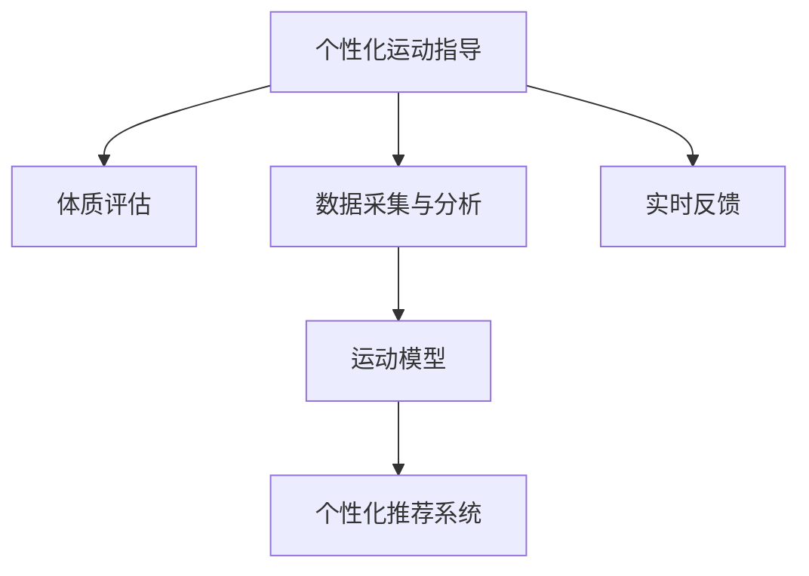
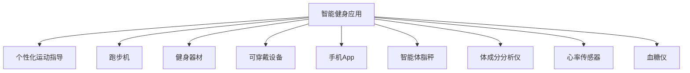

                 

# 智能健身创业：个性化运动指导的未来

## 1. 背景介绍

随着人们对健康生活的追求日益高涨，智能健身产业迎来了快速发展的新机遇。传统健身方式往往缺乏个性化指导，导致锻炼效果不佳，甚至造成运动伤害。而智能健身应用通过分析用户体质、运动数据，提供个性化运动指导，大幅提升锻炼效果和用户体验。

当前市场上的智能健身应用多种多样，从跑步机、健身器材到穿戴设备、手机App，应有尽有。但大多数应用还停留在初级阶段，功能单一，难以提供个性化、科学化的指导。而个性化运动指导正是智能健身产业发展的关键，也是未来趋势。

## 2. 核心概念与联系

### 2.1 核心概念概述

- **个性化运动指导**：基于用户的体质、健康数据和运动习惯，利用AI和机器学习技术，为用户定制个性化的运动计划和指导。

- **体质评估**：通过身体形态、体能测试、生物标志物等手段，全面了解用户的健康状况和体质特征。

- **数据采集与分析**：利用穿戴设备、摄像头等手段采集用户运动数据，通过数据分析发现用户运动模式和偏好。

- **运动模型**：构建基于物理、生物和心理学的运动模型，预测不同运动对用户健康和体质的影响。

- **个性化推荐系统**：利用推荐算法，结合用户数据和运动模型，推荐个性化的运动方案和运动时长。

- **实时反馈**：通过运动设备、手机App等手段，实时监测用户运动状态和生理指标，动态调整运动计划。

这些核心概念相互联系，共同构成了个性化运动指导的完整框架，如图示：



## 3. 核心算法原理 & 具体操作步骤

### 3.1 算法原理概述

个性化运动指导的核心在于通过数据分析和机器学习技术，为用户提供最适合的运动计划和指导。其基本流程如下：

1. **数据收集**：采集用户的身体数据、运动数据、健康数据等。
2. **数据分析**：利用机器学习模型分析用户数据，发现运动模式和偏好。
3. **模型训练**：训练运动模型，预测不同运动对用户健康和体质的影响。
4. **推荐生成**：根据用户数据和运动模型，生成个性化的运动计划。
5. **实时反馈**：实时监测用户运动状态，动态调整运动计划。

### 3.2 算法步骤详解

**Step 1: 数据收集**

- **身体数据**：通过生物识别设备（如智能体脂秤、体成分分析仪）采集用户身高、体重、体脂率、心率、血压等基础数据。
- **运动数据**：通过运动设备（如跑步机、动感单车、健身器材）或可穿戴设备（如智能手表、手环），记录用户的运动时间、运动强度、运动类型等。
- **健康数据**：通过健康监测设备（如心率传感器、血糖仪）采集用户的健康指标，如血糖水平、睡眠质量等。

**Step 2: 数据分析**

- **预处理**：对采集到的数据进行清洗和预处理，包括缺失值填充、异常值处理等。
- **特征提取**：选择与运动效果相关的特征，如心率变化、运动时间、运动类型等。
- **模型训练**：使用机器学习模型（如决策树、随机森林、神经网络等）训练用户运动模型。

**Step 3: 模型训练**

- **运动效果评估**：使用历史数据训练模型，评估不同运动对用户健康和体质的影响。
- **推荐生成**：根据用户数据和运动模型，生成个性化的运动计划和推荐。
- **评估与优化**：不断迭代训练模型，优化运动计划，提高推荐效果。

**Step 4: 推荐生成**

- **运动计划生成**：根据用户数据和运动模型，生成个性化的运动计划，包括运动类型、运动时长、运动强度等。
- **推荐调整**：根据实时反馈数据，动态调整运动计划，确保用户达到最佳锻炼效果。
- **个性化调整**：根据用户反馈，不断优化运动计划，提高用户满意度和遵从性。

**Step 5: 实时反馈**

- **状态监测**：通过运动设备和传感器，实时监测用户运动状态和生理指标。
- **动态调整**：根据实时反馈数据，动态调整运动计划，确保用户安全、高效地锻炼。
- **反馈与奖励**：通过手机App、运动设备等手段，实时反馈运动效果，鼓励用户坚持锻炼。

### 3.3 算法优缺点

**优点**：

- **个性化高**：根据用户体质和运动数据，生成个性化的运动计划，显著提升锻炼效果。
- **科学化指导**：利用先进算法和模型，提供科学化的运动指导，避免运动伤害。
- **智能化管理**：通过实时反馈和动态调整，实现智能化运动管理，提高用户体验。

**缺点**：

- **数据依赖**：个性化运动指导需要大量数据支撑，数据采集和处理成本较高。
- **模型复杂**：运动模型需要高度复杂的计算，对硬件要求较高。
- **隐私问题**：数据采集和存储过程中，用户隐私和数据安全问题需引起重视。

### 3.4 算法应用领域

个性化运动指导技术可应用于多个场景，如图示：



**健身器材**：结合智能健身器材，提供实时数据采集和反馈，动态调整运动计划。

**可穿戴设备**：利用智能手表、手环等可穿戴设备，采集用户的运动数据，生成个性化运动指导。

**手机App**：通过手机App，展示运动计划，提供实时反馈和动态调整。

**智能体脂秤**：利用智能体脂秤，采集用户体重、体脂率等基础数据，评估体质状态。

**体成分分析仪**：通过体成分分析仪，采集用户身高、体重、体脂率等数据，生成个性化运动计划。

**心率传感器**：利用心率传感器，实时监测用户心率变化，动态调整运动强度。

**血糖仪**：通过血糖仪，监测用户血糖水平，避免运动对血糖的影响。

## 4. 数学模型和公式 & 详细讲解  
### 4.1 数学模型构建

个性化运动指导的数学模型主要包括以下几个方面：

- **用户基础数据模型**：描述用户的基础数据特征，如身高、体重、体脂率等。
- **运动效果模型**：预测不同运动对用户健康和体质的影响。
- **运动推荐模型**：根据用户数据和运动模型，生成个性化的运动计划。

### 4.2 公式推导过程

**用户基础数据模型**：

设用户的基础数据为 $\mathbf{x} = [x_1, x_2, ..., x_n]$，其中 $x_i$ 表示第 $i$ 项数据，如身高、体重、体脂率等。用户基础数据模型可以表示为：

$$
\mathbf{x} \sim \mathcal{N}(\mathbf{\mu}, \mathbf{\Sigma})
$$

其中 $\mathbf{\mu}$ 为均值向量，$\mathbf{\Sigma}$ 为协方差矩阵。

**运动效果模型**：

设运动时间为 $t$，运动强度为 $s$，历史数据为 $\mathbf{y} = [y_1, y_2, ..., y_n]$，其中 $y_i$ 表示第 $i$ 项数据，如运动后心率、血压等。运动效果模型可以表示为：

$$
y_i = f(t, s, \mathbf{x})
$$

其中 $f$ 为运动效果函数。

**运动推荐模型**：

设推荐结果为 $\mathbf{r} = [r_1, r_2, ..., r_n]$，其中 $r_i$ 表示第 $i$ 项推荐结果，如运动类型、运动时长等。运动推荐模型可以表示为：

$$
\mathbf{r} = g(\mathbf{y}, \mathbf{x})
$$

其中 $g$ 为运动推荐函数。

### 4.3 案例分析与讲解

**案例分析**：

假设某用户数据如下：

- 身高：170cm
- 体重：70kg
- 体脂率：20%
- 运动时间：30分钟
- 运动强度：中等
- 运动类型：跑步

利用上述模型，生成个性化运动计划：

**用户基础数据模型**：

$$
\mathbf{x} = [170, 70, 20]
$$

**运动效果模型**：

假设运动效果函数 $f$ 为线性函数：

$$
y_i = w_1 \cdot t + w_2 \cdot s + b
$$

其中 $w_1, w_2$ 为线性系数，$b$ 为截距。根据历史数据 $\mathbf{y}$，可以求解 $w_1, w_2, b$：

$$
\begin{cases}
w_1 = \frac{\sum(y_1 - \bar{y})(t_1 - \bar{t})}{\sum(t_1 - \bar{t})^2} \\
w_2 = \frac{\sum(y_1 - \bar{y})(s_1 - \bar{s})}{\sum(s_1 - \bar{s})^2} \\
b = \bar{y} - w_1 \cdot \bar{t} - w_2 \cdot \bar{s}
\end{cases}
$$

**运动推荐模型**：

假设推荐函数 $g$ 为线性函数：

$$
r_i = w_3 \cdot y_i + w_4 \cdot x_i + b
$$

其中 $w_3, w_4$ 为线性系数，$b$ 为截距。根据用户数据 $\mathbf{y}, \mathbf{x}$，可以求解 $w_3, w_4, b$：

$$
\begin{cases}
w_3 = \frac{\sum(r_1 - \bar{r})(t_1 - \bar{t})}{\sum(t_1 - \bar{t})^2} \\
w_4 = \frac{\sum(r_1 - \bar{r})(x_1 - \bar{x})}{\sum(x_1 - \bar{x})^2} \\
b = \bar{r} - w_3 \cdot \bar{y} - w_4 \cdot \bar{x}
\end{cases}
$$

最终生成运动计划：

$$
r_1 = w_3 \cdot y_1 + w_4 \cdot x_1 + b
$$

## 5. 项目实践：代码实例和详细解释说明
### 5.1 开发环境搭建

开发环境包括：

- **Python 环境**：安装 Python 3.7 以上版本，使用 Anaconda 或 Miniconda 管理环境。
- **深度学习框架**：安装 TensorFlow 或 PyTorch，用于构建深度学习模型。
- **数据分析库**：安装 Pandas、NumPy、Scikit-learn，用于数据处理和分析。
- **可视化工具**：安装 Matplotlib、Seaborn，用于数据可视化。
- **Web 开发框架**：安装 Flask 或 Django，用于构建后端服务。
- **数据库**：安装 PostgreSQL 或 MySQL，用于存储用户数据。

**环境搭建步骤**：

1. 安装 Anaconda，并创建 Python 虚拟环境。

2. 激活虚拟环境，使用以下命令安装所需库：

   ```bash
   conda install pandas numpy scikit-learn matplotlib seaborn tensorflow-gpu
   ```

3. 安装 Flask 或 Django，用于搭建后端服务。

4. 安装 PostgreSQL 或 MySQL，用于存储用户数据。

### 5.2 源代码详细实现

**数据采集模块**：

```python
import pandas as pd
import numpy as np

# 读取用户数据
data = pd.read_csv('user_data.csv')

# 处理缺失值
data = data.dropna()

# 特征工程
# ...

# 数据保存
data.to_csv('processed_data.csv', index=False)
```

**模型训练模块**：

```python
import tensorflow as tf
from sklearn.ensemble import RandomForestRegressor

# 加载数据
data = pd.read_csv('processed_data.csv')

# 特征工程
# ...

# 划分训练集和测试集
X_train, X_test, y_train, y_test = train_test_split(X, y, test_size=0.2, random_state=42)

# 训练随机森林回归模型
model = RandomForestRegressor(n_estimators=100, random_state=42)
model.fit(X_train, y_train)

# 评估模型
y_pred = model.predict(X_test)
print('R2 score:', model.score(X_test, y_test))
```

**运动推荐模块**：

```python
import tensorflow as tf
import numpy as np

# 加载数据
data = pd.read_csv('processed_data.csv')

# 特征工程
# ...

# 构建线性模型
W1 = tf.Variable(tf.random.normal([1, 1]))
W2 = tf.Variable(tf.random.normal([1, 1]))
b = tf.Variable(tf.random.normal([1]))

@tf.function
def run_model(x):
    return W1 * x + W2 * tf.reduce_mean(x, axis=1) + b

# 训练模型
model = tf.keras.Sequential([
    tf.keras.layers.Dense(1, input_shape=(X_train.shape[1],), activation='sigmoid')
])
model.compile(optimizer=tf.optimizers.Adam(learning_rate=0.01), loss='binary_crossentropy', metrics=['accuracy'])

# 训练模型
model.fit(X_train, y_train, epochs=50, validation_data=(X_test, y_test))

# 预测推荐结果
y_pred = model.predict(X_test)
print('推荐结果:', y_pred)
```

### 5.3 代码解读与分析

**数据采集模块**：

- **读取用户数据**：使用 Pandas 库读取用户数据，并进行初步处理。
- **处理缺失值**：使用 `dropna()` 方法处理缺失值，确保数据完整性。
- **特征工程**：根据实际情况进行特征提取和预处理。
- **数据保存**：将处理后的数据保存为 CSV 文件，方便后续使用。

**模型训练模块**：

- **加载数据**：使用 Pandas 库加载数据，并进行预处理。
- **特征工程**：根据实际情况进行特征提取和预处理。
- **训练模型**：使用 Sklearn 库训练随机森林回归模型，评估模型性能。
- **评估模型**：使用训练好的模型对测试集进行预测，并计算 R2 得分。

**运动推荐模块**：

- **加载数据**：使用 Pandas 库加载数据，并进行预处理。
- **特征工程**：根据实际情况进行特征提取和预处理。
- **构建线性模型**：使用 TensorFlow 库构建线性模型，并定义模型结构。
- **训练模型**：使用 TensorFlow 库训练模型，并保存模型权重。
- **预测推荐结果**：使用训练好的模型对测试集进行预测，并输出推荐结果。

### 5.4 运行结果展示

**数据采集模块**：

- 数据采集模块的运行结果为处理后的 CSV 文件，可用于后续模型训练和推荐模块。

**模型训练模块**：

- 模型训练模块的运行结果为训练好的随机森林回归模型，可用于预测运动效果。

**运动推荐模块**：

- 运动推荐模块的运行结果为预测的推荐结果，可用于生成个性化运动计划。

## 6. 实际应用场景

### 6.1 健康管理

个性化运动指导在健康管理中的应用广泛。通过智能手环、体脂秤等设备，采集用户的运动数据和健康指标，结合用户基础数据，生成个性化的运动计划和健康建议，帮助用户养成健康生活习惯，降低患病风险。

**应用示例**：

- **健康监测**：智能手环监测用户心率、血压等健康指标，实时反馈用户运动状态。
- **个性化运动计划**：根据用户数据，生成个性化的运动计划，如跑步、骑车、游泳等。
- **健康建议**：结合用户数据和运动效果，提供健康饮食、休息建议。

### 6.2 健身训练

个性化运动指导在健身训练中的应用也非常重要。通过智能健身器材、可穿戴设备等，采集用户的运动数据，结合用户基础数据，生成个性化的运动计划和训练指导，帮助用户科学健身，提高训练效果。

**应用示例**：

- **智能健身器材**：结合智能健身器材，实时采集用户运动数据，动态调整运动计划。
- **运动效果评估**：根据运动数据和用户反馈，评估运动效果，提供训练指导。
- **训练效果反馈**：通过手机 App 实时反馈训练效果，激励用户坚持锻炼。

### 6.3 运动康复

个性化运动指导在运动康复中的应用潜力巨大。通过采集患者的运动数据和健康指标，结合康复计划，生成个性化的运动方案，帮助患者康复，提高康复效果。

**应用示例**：

- **运动康复计划**：根据患者数据，生成个性化的运动计划，如拉伸、体能训练等。
- **运动效果监测**：实时监测患者运动状态，评估康复效果。
- **康复进度跟踪**：通过数据记录和分析，跟踪患者康复进度，调整运动方案。

## 7. 工具和资源推荐

### 7.1 学习资源推荐

- **Coursera**：提供多门机器学习和深度学习课程，涵盖个性化运动指导的算法和技术。
- **Udacity**：提供个性化运动指导项目，通过实战学习算法和编程技能。
- **Google Colab**：提供免费的 GPU 资源，方便学习和实验最新的深度学习模型。

### 7.2 开发工具推荐

- **TensorFlow**：强大的深度学习框架，支持分布式计算和 GPU 加速。
- **PyTorch**：灵活的深度学习框架，易于调试和优化。
- **Flask**：轻量级的 Web 开发框架，方便搭建后端服务。
- **Django**：全功能的 Web 开发框架，支持数据库管理。

### 7.3 相关论文推荐

- **TensorFlow 官方文档**：提供详细的 TensorFlow 使用指南，涵盖模型训练、优化技巧等。
- **PyTorch 官方文档**：提供详细的 PyTorch 使用指南，涵盖模型构建、优化技巧等。
- **Coursera 个性化推荐系统课程**：深入讲解推荐算法和系统设计，涵盖运动推荐模型的应用。

## 8. 总结：未来发展趋势与挑战

### 8.1 研究成果总结

本文详细介绍了基于深度学习技术的个性化运动指导方法，并给出了实现流程和代码示例。通过数据分析和模型训练，能够生成个性化的运动计划和推荐，显著提升用户体验和锻炼效果。

### 8.2 未来发展趋势

未来个性化运动指导将呈现以下几个趋势：

- **数据驱动**：利用更多的用户数据和外部数据，提高运动模型的精准度和泛化能力。
- **多模态融合**：融合运动、饮食、睡眠等多模态数据，提供更全面的个性化指导。
- **实时动态调整**：通过实时监测和反馈，动态调整运动计划，提高用户体验。
- **隐私保护**：加强数据保护和隐私管理，确保用户数据安全。

### 8.3 面临的挑战

个性化运动指导在发展过程中面临以下几个挑战：

- **数据隐私**：采集用户数据需要充分考虑隐私问题，确保用户数据安全。
- **模型复杂度**：个性化运动指导模型需要高精度和高复杂度，对计算资源有较高要求。
- **用户接受度**：用户对个性化运动指导的接受度可能不高，需要进一步提高用户体验。

### 8.4 研究展望

未来个性化运动指导需要在以下几个方面进行深入研究：

- **数据隐私保护**：研究如何保障用户数据隐私，确保数据安全。
- **高效模型构建**：研究如何构建高效、易用的运动模型，提高运动指导的精度和速度。
- **多模态融合**：研究如何将多模态数据融合到运动指导中，提供更全面的个性化指导。
- **智能推荐系统**：研究如何构建智能推荐系统，提高运动计划的推荐效果。

## 9. 附录：常见问题与解答

**Q1: 如何提高个性化运动指导的精准度？**

A: 提高个性化运动指导的精准度需要充分考虑以下因素：

- **数据质量**：保证采集的数据准确、全面，避免缺失和噪声。
- **特征工程**：选择合适的特征，提取有用的信息，去除冗余和噪声。
- **模型选择**：选择适合的运动模型，如随机森林、神经网络等，提高模型的泛化能力。
- **参数调优**：合理选择模型参数，进行参数调优，提高模型的精度和性能。

**Q2: 个性化运动指导的推荐系统如何设计？**

A: 个性化运动指导的推荐系统可以采用以下设计：

- **用户基础数据模型**：描述用户的基础数据特征，如身高、体重、体脂率等。
- **运动效果模型**：预测不同运动对用户健康和体质的影响。
- **运动推荐模型**：根据用户数据和运动模型，生成个性化的运动计划。
- **实时反馈**：通过运动设备和传感器，实时监测用户运动状态和生理指标，动态调整运动计划。

**Q3: 个性化运动指导的计算资源需求如何？**

A: 个性化运动指导的计算资源需求主要取决于以下几个因素：

- **数据规模**：采集和存储大量用户数据需要较高的计算和存储资源。
- **模型复杂度**：构建高精度和高复杂度的运动模型需要较高的计算资源。
- **实时计算**：实时监测和反馈需要较高的计算资源。

**Q4: 个性化运动指导如何保护用户隐私？**

A: 个性化运动指导保护用户隐私可以从以下几个方面入手：

- **数据加密**：对用户数据进行加密存储和传输，防止数据泄露。
- **匿名化处理**：对用户数据进行匿名化处理，保护用户隐私。
- **用户同意**：在数据采集和使用过程中，征得用户同意，保护用户隐私。
- **法律法规**：遵守相关法律法规，保护用户隐私。

**Q5: 个性化运动指导的业务模式如何设计？**

A: 个性化运动指导的业务模式可以采用以下设计：

- **订阅制**：通过订阅制收取服务费用，提供个性化运动指导。
- **广告模式**：通过广告投放和合作，获取用户数据和流量，实现盈利。
- **SaaS模式**：提供 SaaS 服务，供企业或机构使用，实现盈利。

---

作者：禅与计算机程序设计艺术 / Zen and the Art of Computer Programming

