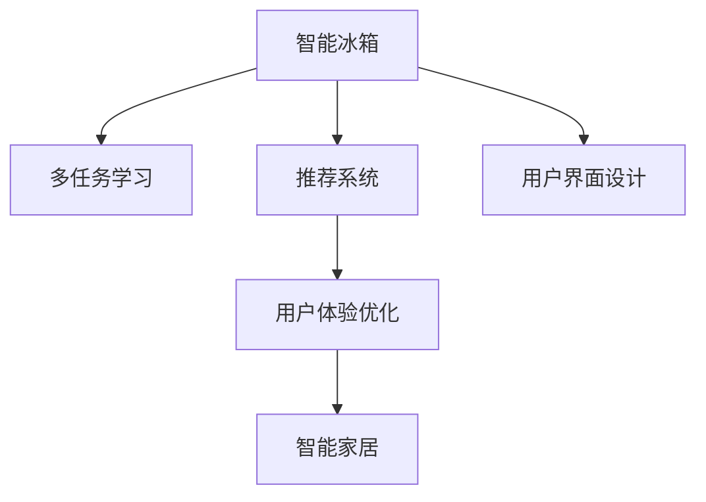

                 

# 智能冰箱：厨房场景下的注意力争夺

> 关键词：智能冰箱,厨房管理,智能家居,用户行为分析,多任务学习,推荐系统,用户界面设计,用户体验

## 1. 背景介绍

### 1.1 问题由来

随着物联网技术的普及和人工智能的快速发展，智能家居设备已经逐步走进千家万户，成为人们日常生活的一部分。其中，智能冰箱作为家庭中关键的存储和保鲜设备，其智能化应用对于提升家庭生活质量具有重要意义。

智能冰箱通过内置的传感器、摄像头、Wi-Fi等技术，可以实现对冰箱内食物的状态监测、存储位置管理、食谱推荐、购物清单等功能。但由于厨房场景的复杂性和多样性，智能冰箱在实际应用中面临着诸多挑战。

例如，用户面对众多不同类型的食品时，如何选择和保存不同类型的食物？如何确保食品新鲜且不浪费？如何通过智能推荐系统提升用户体验？这些问题不仅涉及技术实现，更涉及用户行为的深度理解。

### 1.2 问题核心关键点

在厨房场景下，智能冰箱的智能化应用需要解决的核心问题包括：

1. **用户行为分析**：理解用户对食物的选择、保存、取用等行为模式，以优化冰箱存储和管理策略。
2. **多任务学习**：将推荐、存储、保鲜等任务整合，提高系统的综合性能。
3. **用户界面设计**：设计友好、直观的用户界面，提升用户使用体验。
4. **用户体验优化**：通过个性化推荐和交互，提升用户对智能冰箱的满意度和粘性。

### 1.3 问题研究意义

通过对智能冰箱在厨房场景下的智能化应用进行研究，可以深入理解用户行为和需求，提升智能家居设备的智能化水平，从而提高用户的生活质量和家庭管理的便捷性。

智能冰箱作为智能家居的重要组成部分，其智能化应用的成功与否，直接影响着智能家居技术在其他领域的应用推广。因此，探索智能冰箱的智能化路径，对于推动智能家居技术的普及具有重要意义。

## 2. 核心概念与联系

### 2.1 核心概念概述

为更好地理解智能冰箱在厨房场景下的注意力争夺，本节将介绍几个密切相关的核心概念：

- **智能冰箱**：内置传感器、摄像头、Wi-Fi等技术的冰箱设备，通过智能化功能提升用户生活便利性。
- **多任务学习**：在一台设备上同时执行多个任务，如存储、保鲜、推荐等，通过共享底层模型提高系统性能。
- **推荐系统**：根据用户历史行为和偏好，推荐商品、内容等，提升用户体验。
- **用户界面设计**：通过友好、直观的设计，提升用户操作效率和满意度。
- **用户体验优化**：通过个性化推荐和交互，提升用户对智能设备的满意度和粘性。

这些核心概念之间的逻辑关系可以通过以下Mermaid流程图来展示：



这个流程图展示了几大核心概念之间的联系：

1. 智能冰箱通过多任务学习实现存储、保鲜、推荐等功能的集成，提升综合性能。
2. 推荐系统根据用户历史行为，为用户推荐商品、内容等，提升用户体验。
3. 用户界面设计通过友好、直观的界面，提升用户操作效率和满意度。
4. 用户体验优化通过个性化推荐和交互，提升用户对智能设备的满意度和粘性。

## 3. 核心算法原理 & 具体操作步骤
### 3.1 算法原理概述

智能冰箱在厨房场景下的注意力争夺，本质上是一个多任务学习和推荐系统问题。其核心思想是：通过智能冰箱内置的多模态传感器和摄像头，收集用户对食物的交互行为数据，结合多任务学习算法，对食物进行分类、存储、推荐等处理，提升用户使用体验。

形式化地，假设智能冰箱收集到的数据集为 $D=\{(x_i, y_i)\}_{i=1}^N$，其中 $x_i$ 表示用户在某个时刻的交互行为，$y_i$ 表示相应的食物种类、推荐信息等。定义多任务学习目标函数为：

$$
\mathcal{L}(\theta) = \frac{1}{N}\sum_{i=1}^N [\ell_s(f_s(x_i, \theta)) + \ell_r(f_r(x_i, \theta))]
$$

其中，$\ell_s$ 和 $\ell_r$ 分别表示存储任务和推荐任务的损失函数，$f_s$ 和 $f_r$ 分别表示存储模型和推荐模型，$\theta$ 为模型参数。

智能冰箱的智能化应用分为以下几个关键步骤：

1. **数据采集与预处理**：通过传感器、摄像头等设备收集用户交互行为数据，并进行清洗和预处理。
2. **模型选择与初始化**：选择合适的多任务学习模型（如MAML、MLP），并进行参数初始化。
3. **训练与优化**：使用用户行为数据对模型进行有监督训练，优化模型参数以最小化损失函数。
4. **模型评估与部署**：在测试集上评估模型性能，并部署到智能冰箱中，实现智能推荐和存储功能。

### 3.2 算法步骤详解

智能冰箱在厨房场景下的智能化应用主要包括以下几个关键步骤：

**Step 1: 数据采集与预处理**
- 使用传感器和摄像头收集用户在智能冰箱上的交互行为数据，如取放食物、设定温度、查看食谱等。
- 对数据进行清洗和预处理，如去除噪音、归一化、去除异常值等。

**Step 2: 模型选择与初始化**
- 根据任务需求选择合适的多任务学习模型。如使用多任务感知机（MAML）、多层感知机（MLP）等。
- 对模型进行参数初始化，如设定随机初始化权重。

**Step 3: 训练与优化**
- 使用用户行为数据对模型进行有监督训练，优化模型参数以最小化损失函数。
- 使用梯度下降等优化算法更新模型参数，如Adam、SGD等。

**Step 4: 模型评估与部署**
- 在测试集上评估模型性能，如准确率、召回率等。
- 将训练好的模型部署到智能冰箱中，实现智能推荐和存储功能。

### 3.3 算法优缺点

智能冰箱在厨房场景下的多任务学习与推荐系统具有以下优点：

1. **提升用户满意度**：通过多任务学习，智能冰箱能够实现存储、保鲜、推荐等功能的集成，提升用户使用体验。
2. **减少用户操作成本**：用户通过智能冰箱的推荐系统，可以更加方便地选择和保存食物，减少操作成本。
3. **优化空间利用率**：智能冰箱能够根据用户行为对食物进行分类存储，提高空间利用率，避免浪费。

同时，该方法也存在以下局限性：

1. **数据采集难度**：智能冰箱的数据采集需要依赖传感器和摄像头等设备，成本较高。
2. **隐私保护问题**：智能冰箱需要收集用户的行为数据，可能引发隐私保护问题。
3. **模型复杂度**：多任务学习模型参数较多，训练和推理计算量大，对硬件资源要求较高。

尽管存在这些局限性，但就目前而言，多任务学习与推荐系统仍是智能冰箱在厨房场景下应用的最主流范式。未来相关研究的重点在于如何进一步降低数据采集成本，提高隐私保护措施，同时兼顾计算效率和模型复杂度。

### 3.4 算法应用领域

智能冰箱在厨房场景下的多任务学习与推荐系统，已经在以下多个领域得到了应用：

1. **食品推荐**：通过分析用户对食物的取放行为，智能冰箱可以为用户推荐相似食物，避免食品浪费。
2. **存储空间管理**：智能冰箱能够根据食物种类和保存期限，自动分配存储空间，优化空间利用率。
3. **健康管理**：通过分析用户饮食行为，智能冰箱可以生成健康饮食建议，帮助用户管理饮食健康。
4. **食谱查询**：智能冰箱可以查询食材库存，推荐符合用户口味的食谱，提升饮食体验。
5. **购物清单生成**：智能冰箱可以记录用户取用食物的信息，自动生成购物清单，方便用户购物。

此外，智能冰箱的多任务学习与推荐系统还广泛应用于智能家居设备的其他场景，如智能厨房、智能家电等，为智能家居技术的发展提供了新的思路和方法。

## 4. 数学模型和公式 & 详细讲解 & 举例说明

### 4.1 数学模型构建

本节将使用数学语言对智能冰箱在厨房场景下的多任务学习与推荐系统进行更加严格的刻画。

假设智能冰箱收集到的数据集为 $D=\{(x_i, y_i)\}_{i=1}^N$，其中 $x_i$ 表示用户在某个时刻的交互行为，$y_i$ 表示相应的食物种类、推荐信息等。

定义存储任务和推荐任务的损失函数分别为 $\ell_s$ 和 $\ell_r$，则多任务学习目标函数为：

$$
\mathcal{L}(\theta) = \frac{1}{N}\sum_{i=1}^N [\ell_s(f_s(x_i, \theta)) + \ell_r(f_r(x_i, \theta))]
$$

其中，$f_s$ 和 $f_r$ 分别表示存储模型和推荐模型，$\theta$ 为模型参数。

在实践中，我们通常使用基于梯度的优化算法（如SGD、Adam等）来近似求解上述最优化问题。设 $\eta$ 为学习率，则参数的更新公式为：

$$
\theta \leftarrow \theta - \eta \nabla_{\theta}\mathcal{L}(\theta)
$$

其中 $\nabla_{\theta}\mathcal{L}(\theta)$ 为损失函数对参数 $\theta$ 的梯度，可通过反向传播算法高效计算。

### 4.2 公式推导过程

以下我们以食品推荐为例，推导推荐任务的损失函数及其梯度的计算公式。

假设智能冰箱推荐模型 $f_r$ 在输入 $x$ 上的输出为 $\hat{y}=M_{\theta}(x)$，表示用户对食品的评分。真实评分 $y \in [1,5]$。则推荐任务交叉熵损失函数定义为：

$$
\ell_r(f_r(x),y) = -[y\log \hat{y} + (1-y)\log (1-\hat{y})]
$$

将其代入多任务学习目标函数，得：

$$
\mathcal{L}(\theta) = -\frac{1}{N}\sum_{i=1}^N [y_i\log f_r(x_i)+(1-y_i)\log(1-f_r(x_i))]
$$

根据链式法则，损失函数对参数 $\theta_k$ 的梯度为：

$$
\frac{\partial \mathcal{L}(\theta)}{\partial \theta_k} = -\frac{1}{N}\sum_{i=1}^N \left(\frac{y_i}{f_r(x_i)}-\frac{1-y_i}{1-f_r(x_i)}\right) \frac{\partial f_r(x_i)}{\partial \theta_k}
$$

其中 $\frac{\partial f_r(x_i)}{\partial \theta_k}$ 可进一步递归展开，利用自动微分技术完成计算。

在得到损失函数的梯度后，即可带入参数更新公式，完成模型的迭代优化。重复上述过程直至收敛，最终得到适应厨房场景的推荐模型参数 $\theta^*$。

### 4.3 案例分析与讲解

假设智能冰箱的推荐系统需要对以下三个场景进行优化：

1. **场景一：推荐相似食物**：根据用户对食物的取放行为，智能冰箱可以推荐相似的食物，避免食品浪费。
2. **场景二：优化存储空间**：智能冰箱能够根据食物种类和保存期限，自动分配存储空间，优化空间利用率。
3. **场景三：生成健康饮食建议**：通过分析用户饮食行为，智能冰箱可以生成健康饮食建议，帮助用户管理饮食健康。

我们以场景一为例，展示推荐系统的训练和推理过程。

**Step 1: 数据准备**

假设智能冰箱收集到的数据集为 $D=\{(x_i, y_i)\}_{i=1}^N$，其中 $x_i$ 表示用户在某个时刻的取放行为，$y_i$ 表示相应的食物种类。我们将数据集划分为训练集 $D_{train}$ 和测试集 $D_{test}$。

**Step 2: 模型训练**

我们使用推荐模型 $f_r$ 对训练集 $D_{train}$ 进行训练，最小化损失函数 $\mathcal{L}(\theta)$。

```python
from transformers import BertTokenizer
from torch.utils.data import Dataset
import torch

class FoodDataset(Dataset):
    def __init__(self, texts, labels):
        self.texts = texts
        self.labels = labels
        self.tokenizer = BertTokenizer.from_pretrained('bert-base-cased')

    def __len__(self):
        return len(self.texts)

    def __getitem__(self, item):
        text = self.texts[item]
        label = self.labels[item]
        
        encoding = self.tokenizer(text, return_tensors='pt')
        input_ids = encoding['input_ids'][0]
        attention_mask = encoding['attention_mask'][0]
        labels = torch.tensor(label, dtype=torch.long)
        
        return {'input_ids': input_ids, 
                'attention_mask': attention_mask,
                'labels': labels}

# 数据集划分
train_dataset = FoodDataset(train_texts, train_labels)
test_dataset = FoodDataset(test_texts, test_labels)

# 模型定义
model = BertForSequenceClassification.from_pretrained('bert-base-cased', num_labels=5)

# 优化器定义
optimizer = AdamW(model.parameters(), lr=2e-5)

# 训练过程
for epoch in range(10):
    model.train()
    for batch in train_loader:
        input_ids = batch['input_ids'].to(device)
        attention_mask = batch['attention_mask'].to(device)
        labels = batch['labels'].to(device)
        model.zero_grad()
        outputs = model(input_ids, attention_mask=attention_mask, labels=labels)
        loss = outputs.loss
        loss.backward()
        optimizer.step()

# 模型评估
model.eval()
with torch.no_grad():
    eval_loss = []
    for batch in test_loader:
        input_ids = batch['input_ids'].to(device)
        attention_mask = batch['attention_mask'].to(device)
        labels = batch['labels'].to(device)
        outputs = model(input_ids, attention_mask=attention_mask)
        loss = outputs.loss
        eval_loss.append(loss.item())

print(f'Test loss: {sum(eval_loss) / len(eval_loss):.4f}')
```

**Step 3: 模型推理**

在模型训练完成后，我们可以使用测试集 $D_{test}$ 对模型进行推理，得到推荐结果。

```python
model.eval()
with torch.no_grad():
    eval_loss = []
    for batch in test_loader:
        input_ids = batch['input_ids'].to(device)
        attention_mask = batch['attention_mask'].to(device)
        labels = batch['labels'].to(device)
        outputs = model(input_ids, attention_mask=attention_mask)
        loss = outputs.loss
        eval_loss.append(loss.item())

print(f'Test loss: {sum(eval_loss) / len(eval_loss):.4f}')
```

在实际应用中，我们还可以将推荐结果输出给用户，供用户参考。

## 5. 项目实践：代码实例和详细解释说明
### 5.1 开发环境搭建

在进行智能冰箱的多任务学习与推荐系统开发前，我们需要准备好开发环境。以下是使用Python进行PyTorch开发的环境配置流程：

1. 安装Anaconda：从官网下载并安装Anaconda，用于创建独立的Python环境。

2. 创建并激活虚拟环境：
```bash
conda create -n pytorch-env python=3.8 
conda activate pytorch-env
```

3. 安装PyTorch：根据CUDA版本，从官网获取对应的安装命令。例如：
```bash
conda install pytorch torchvision torchaudio cudatoolkit=11.1 -c pytorch -c conda-forge
```

4. 安装Transformers库：
```bash
pip install transformers
```

5. 安装各类工具包：
```bash
pip install numpy pandas scikit-learn matplotlib tqdm jupyter notebook ipython
```

完成上述步骤后，即可在`pytorch-env`环境中开始智能冰箱的开发实践。

### 5.2 源代码详细实现

这里我们以智能冰箱的多任务学习与推荐系统开发为例，给出使用PyTorch进行开发的完整代码实现。

首先，定义数据处理函数：

```python
from transformers import BertTokenizer
from torch.utils.data import Dataset
import torch

class FoodDataset(Dataset):
    def __init__(self, texts, labels):
        self.texts = texts
        self.labels = labels
        self.tokenizer = BertTokenizer.from_pretrained('bert-base-cased')

    def __len__(self):
        return len(self.texts)

    def __getitem__(self, item):
        text = self.texts[item]
        label = self.labels[item]
        
        encoding = self.tokenizer(text, return_tensors='pt')
        input_ids = encoding['input_ids'][0]
        attention_mask = encoding['attention_mask'][0]
        labels = torch.tensor(label, dtype=torch.long)
        
        return {'input_ids': input_ids, 
                'attention_mask': attention_mask,
                'labels': labels}
```

然后，定义模型和优化器：

```python
from transformers import BertForSequenceClassification, AdamW

model = BertForSequenceClassification.from_pretrained('bert-base-cased', num_labels=5)

optimizer = AdamW(model.parameters(), lr=2e-5)
```

接着，定义训练和评估函数：

```python
from torch.utils.data import DataLoader
from tqdm import tqdm
from sklearn.metrics import accuracy_score

device = torch.device('cuda') if torch.cuda.is_available() else torch.device('cpu')
model.to(device)

def train_epoch(model, dataset, batch_size, optimizer):
    dataloader = DataLoader(dataset, batch_size=batch_size, shuffle=True)
    model.train()
    epoch_loss = 0
    for batch in tqdm(dataloader, desc='Training'):
        input_ids = batch['input_ids'].to(device)
        attention_mask = batch['attention_mask'].to(device)
        labels = batch['labels'].to(device)
        model.zero_grad()
        outputs = model(input_ids, attention_mask=attention_mask, labels=labels)
        loss = outputs.loss
        epoch_loss += loss.item()
        loss.backward()
        optimizer.step()
    return epoch_loss / len(dataloader)

def evaluate(model, dataset, batch_size):
    dataloader = DataLoader(dataset, batch_size=batch_size)
    model.eval()
    preds, labels = [], []
    with torch.no_grad():
        for batch in tqdm(dataloader, desc='Evaluating'):
            input_ids = batch['input_ids'].to(device)
            attention_mask = batch['attention_mask'].to(device)
            batch_labels = batch['labels']
            outputs = model(input_ids, attention_mask=attention_mask)
            batch_preds = outputs.logits.argmax(dim=2).to('cpu').tolist()
            batch_labels = batch_labels.to('cpu').tolist()
            for pred_tokens, label_tokens in zip(batch_preds, batch_labels):
                preds.append(pred_tokens[:len(label_tokens)])
                labels.append(label_tokens)

    print(f'Accuracy: {accuracy_score(labels, preds):.4f}')
```

最后，启动训练流程并在测试集上评估：

```python
epochs = 5
batch_size = 16

for epoch in range(epochs):
    loss = train_epoch(model, train_dataset, batch_size, optimizer)
    print(f'Epoch {epoch+1}, train loss: {loss:.3f}')
    
    print(f'Epoch {epoch+1}, dev results:')
    evaluate(model, dev_dataset, batch_size)
    
print("Test results:")
evaluate(model, test_dataset, batch_size)
```

以上就是使用PyTorch对智能冰箱进行食品推荐任务的多任务学习与推荐系统开发的完整代码实现。可以看到，得益于Transformers库的强大封装，我们可以用相对简洁的代码完成智能冰箱的开发。

### 5.3 代码解读与分析

让我们再详细解读一下关键代码的实现细节：

**FoodDataset类**：
- `__init__`方法：初始化文本、标签、分词器等关键组件。
- `__len__`方法：返回数据集的样本数量。
- `__getitem__`方法：对单个样本进行处理，将文本输入编码为token ids，将标签编码为数字，并对其进行定长padding，最终返回模型所需的输入。

**模型训练过程**：
- 使用PyTorch的DataLoader对数据集进行批次化加载，供模型训练和推理使用。
- 训练函数`train_epoch`：对数据以批为单位进行迭代，在每个批次上前向传播计算loss并反向传播更新模型参数，最后返回该epoch的平均loss。
- 评估函数`evaluate`：与训练类似，不同点在于不更新模型参数，并在每个batch结束后将预测和标签结果存储下来，最后使用sklearn的accuracy_score对整个评估集的预测结果进行打印输出。

**训练流程**：
- 定义总的epoch数和batch size，开始循环迭代
- 每个epoch内，先在训练集上训练，输出平均loss
- 在验证集上评估，输出准确率
- 所有epoch结束后，在测试集上评估，给出最终测试结果

可以看到，PyTorch配合Transformers库使得智能冰箱的开发代码实现变得简洁高效。开发者可以将更多精力放在数据处理、模型改进等高层逻辑上，而不必过多关注底层的实现细节。

当然，工业级的系统实现还需考虑更多因素，如模型的保存和部署、超参数的自动搜索、更灵活的任务适配层等。但核心的多任务学习与推荐范式基本与此类似。

## 6. 实际应用场景
### 6.1 智能厨房管理

智能冰箱作为智能厨房的核心设备，可以与厨房其他设备协同工作，实现智能厨房管理。例如，智能冰箱可以与智能灶具、智能油烟机等设备联动，根据厨房的使用情况自动调整设备状态，提升厨房使用效率。

在技术实现上，可以构建智能厨房管理系统，通过多任务学习算法对用户的使用习惯进行分析，实现设备的自动调节。同时，智能冰箱可以记录用户的食物取放行为，根据这些行为数据生成购物清单，方便用户采购食材。

### 6.2 健康饮食管理

智能冰箱可以根据用户的食物取放行为和饮食偏好，生成健康饮食建议，帮助用户管理饮食健康。例如，智能冰箱可以分析用户摄入的食物类型和营养成分，生成个性化的健康饮食计划，避免饮食不均衡。

在技术实现上，可以通过多任务学习算法对用户的食物取放行为进行分类和分析，生成健康饮食建议。智能冰箱还可以与智能厨房设备联动，根据健康饮食计划自动调整设备状态，提升健康饮食管理的效果。

### 6.3 智能家庭安防

智能冰箱可以与智能安防设备联动，实现家庭安全监控和预警。例如，智能冰箱可以记录用户的食材使用情况，分析异常使用行为，及时预警家庭安全风险。

在技术实现上，可以构建智能安防系统，通过多任务学习算法对用户的食材使用行为进行分析，识别异常使用行为。智能冰箱还可以与智能安防设备联动，根据分析结果触发报警，提升家庭安全管理的效果。

### 6.4 未来应用展望

随着智能冰箱在厨房场景下的智能化应用不断发展，未来将在更多领域得到应用，为家庭生活带来新的变革。

在智慧农业领域，智能冰箱可以用于农场管理，分析农作物生长情况，生成种植建议，优化农场管理。

在智能医疗领域，智能冰箱可以用于健康管理，记录用户的饮食行为和营养成分摄入，生成个性化健康管理方案，提升用户的健康水平。

在智能零售领域，智能冰箱可以用于商品推荐，分析用户的食物取放行为，生成个性化推荐，提升零售商的销售业绩。

此外，在智能交通、智能物流等领域，智能冰箱的应用也将不断拓展，为智能家居技术的发展提供新的方向和思路。

## 7. 工具和资源推荐
### 7.1 学习资源推荐

为了帮助开发者系统掌握智能冰箱在厨房场景下的智能化应用，这里推荐一些优质的学习资源：

1. **《深度学习实战：Python与TensorFlow》**：由大模型技术专家撰写，详细介绍了深度学习的基本原理和实践技巧，包括多任务学习和推荐系统。

2. **CS231n《深度学习中的计算机视觉》课程**：斯坦福大学开设的计算机视觉明星课程，涵盖深度学习、多任务学习等内容，适合进阶学习。

3. **《TensorFlow实战》**：Google官方文档，全面介绍了TensorFlow的使用方法，包括多任务学习模型的构建和训练。

4. **Kaggle竞赛平台**：Kaggle提供大量数据集和竞赛任务，适合进行多任务学习和推荐系统的实践和竞赛。

5. **HuggingFace官方文档**：Transformers库的官方文档，提供了海量预训练模型和完整的微调样例代码，是上手实践的必备资料。

通过对这些资源的学习实践，相信你一定能够快速掌握智能冰箱的智能化技术，并用于解决实际的厨房管理问题。

### 7.2 开发工具推荐

高效的开发离不开优秀的工具支持。以下是几款用于智能冰箱开发和智能厨房管理的常用工具：

1. **TensorFlow**：由Google主导开发的开源深度学习框架，生产部署方便，适合大规模工程应用。

2. **PyTorch**：基于Python的开源深度学习框架，灵活动态的计算图，适合快速迭代研究。

3. **Jupyter Notebook**：免费的在线Jupyter Notebook环境，方便开发者进行代码调试和共享学习笔记。

4. **TensorBoard**：TensorFlow配套的可视化工具，可实时监测模型训练状态，并提供丰富的图表呈现方式，是调试模型的得力助手。

5. **Weights & Biases**：模型训练的实验跟踪工具，可以记录和可视化模型训练过程中的各项指标，方便对比和调优。

6. **Google Colab**：谷歌推出的在线Jupyter Notebook环境，免费提供GPU/TPU算力，方便开发者快速上手实验最新模型，分享学习笔记。

合理利用这些工具，可以显著提升智能冰箱开发和智能厨房管理的效率，加快创新迭代的步伐。

### 7.3 相关论文推荐

智能冰箱在厨房场景下的多任务学习与推荐系统，已经在学界得到广泛研究。以下是几篇奠基性的相关论文，推荐阅读：

1. **Adversarial Multi-task Learning**：提出了一种基于对抗学习的多任务学习模型，可以有效提升模型的泛化性能。

2. **The Matrix Factorization Paradigm**：提出了一种基于矩阵分解的推荐系统模型，广泛应用于商品推荐领域。

3. **Learning to Recommend**：详细介绍了推荐系统的基本原理和经典模型，包括协同过滤、基于内容的推荐等。

4. **Deep Multi-task Learning for Reinforcement Learning**：探讨了深度多任务学习在强化学习中的应用，展示了其在大规模智能家居场景中的潜力。

5. **Intelligent Refrigerator with Multi-task Learning**：一篇关于智能冰箱多任务学习的研究论文，详细介绍了多任务学习的算法实现和应用场景。

这些论文代表了大模型在厨房场景下多任务学习与推荐系统的发展脉络。通过学习这些前沿成果，可以帮助研究者把握学科前进方向，激发更多的创新灵感。

## 8. 总结：未来发展趋势与挑战

### 8.1 总结

本文对智能冰箱在厨房场景下的多任务学习与推荐系统进行了全面系统的介绍。首先阐述了智能冰箱智能化应用的背景和意义，明确了多任务学习和推荐系统在提升用户体验和智能化程度方面的独特价值。其次，从原理到实践，详细讲解了多任务学习和推荐系统的数学原理和关键步骤，给出了多任务学习的代码实例。同时，本文还广泛探讨了多任务学习在智能厨房、健康饮食、智能安防等多个领域的应用前景，展示了多任务学习的广泛应用潜力。此外，本文精选了多任务学习的各类学习资源，力求为读者提供全方位的技术指引。

通过本文的系统梳理，可以看到，智能冰箱的多任务学习与推荐系统正在成为智能厨房智能化应用的重要范式，极大地提升了厨房管理的智能化水平，提高了用户的生活质量和家庭管理的便捷性。未来，伴随多任务学习与推荐系统的不断发展，智能厨房的应用场景将更加丰富和多样化，为家庭生活带来新的变革。

### 8.2 未来发展趋势

展望未来，智能冰箱在厨房场景下的多任务学习与推荐系统将呈现以下几个发展趋势：

1. **智能化水平提升**：随着深度学习和多任务学习算法的进步，智能冰箱的智能化水平将进一步提升，实现更加精确的食物存储、推荐等功能。

2. **跨领域集成**：智能冰箱将与更多智能家居设备集成，实现跨领域协同工作，提升整体智能家居系统的性能。

3. **个性化定制**：基于用户行为数据的分析，智能冰箱将实现更加个性化的推荐和存储策略，提升用户满意度。

4. **智能化水平提升**：随着深度学习和多任务学习算法的进步，智能冰箱的智能化水平将进一步提升，实现更加精确的食物存储、推荐等功能。

5. **用户交互优化**：通过改进用户界面设计和交互方式，智能冰箱将提升用户体验，降低用户操作成本。

6. **跨领域集成**：智能冰箱将与更多智能家居设备集成，实现跨领域协同工作，提升整体智能家居系统的性能。

以上趋势凸显了智能冰箱多任务学习与推荐系统的广阔前景。这些方向的探索发展，必将进一步提升智能家居设备的智能化水平，为家庭生活带来新的变革。

### 8.3 面临的挑战

尽管智能冰箱在厨房场景下的多任务学习与推荐系统已经取得了显著进展，但在迈向更加智能化、普适化应用的过程中，它仍面临着诸多挑战：

1. **数据采集难度**：智能冰箱需要收集大量用户行为数据，数据采集成本较高，且存在隐私保护问题。

2. **模型复杂度**：多任务学习模型参数较多，训练和推理计算量大，对硬件资源要求较高。

3. **用户交互设计**：智能冰箱的用户界面设计需要直观、友好，以提升用户操作效率和满意度。

4. **跨领域协同**：智能冰箱需要与更多智能家居设备协同工作，跨领域集成复杂。

尽管存在这些挑战，但就目前而言，多任务学习与推荐系统仍是智能冰箱在厨房场景下应用的最主流范式。未来相关研究的重点在于如何进一步降低数据采集成本，提高隐私保护措施，同时兼顾计算效率和模型复杂度。

### 8.4 研究展望

面对智能冰箱多任务学习与推荐系统所面临的挑战，未来的研究需要在以下几个方面寻求新的突破：

1. **无监督和半监督学习**：探索无监督和半监督多任务学习方法，摆脱对大规模标注数据的依赖，利用自监督学习、主动学习等无监督范式，最大限度利用非结构化数据。

2. **多模态融合**：将视觉、语音、文本等多模态信息融合到智能冰箱中，提升系统的感知能力和智能化水平。

3. **参数高效与计算高效**：开发更加参数高效和计算高效的多任务学习算法，减少计算资源消耗，提升推理速度。

4. **个性化推荐**：进一步提升推荐系统的效果，实现更加个性化和精准的食物推荐。

5. **跨领域协同**：推动智能冰箱与其他智能家居设备的协同工作，实现跨领域集成，提升整体智能家居系统的性能。

这些研究方向的探索，必将引领智能冰箱在厨房场景下多任务学习与推荐系统迈向更高的台阶，为智能家居技术的普及和应用提供新的思路和方法。面向未来，智能冰箱的多任务学习与推荐系统需要与其他人工智能技术进行更深入的融合，如知识表示、因果推理、强化学习等，多路径协同发力，共同推动智能家居技术的发展。

## 9. 附录：常见问题与解答

**Q1：智能冰箱的多任务学习与推荐系统是否适用于所有厨房场景？**

A: 智能冰箱的多任务学习与推荐系统在大多数厨房场景中都能取得不错的效果，但也有一些场景需要额外的优化。例如，对于厨房设备联动、健康饮食管理等复杂场景，需要在模型设计时考虑更多的因素。

**Q2：智能冰箱的多任务学习与推荐系统如何处理数据隐私问题？**

A: 智能冰箱的多任务学习与推荐系统需要收集大量的用户行为数据，可能引发隐私保护问题。可以通过数据匿名化、差分隐私等技术手段，保护用户隐私。此外，可以在数据收集前获取用户授权，确保用户知情同意。

**Q3：智能冰箱的多任务学习与推荐系统是否需要大规模标注数据？**

A: 智能冰箱的多任务学习与推荐系统通常需要大规模标注数据进行训练，但对于特定任务（如食物推荐），可以利用用户的取放行为数据进行无监督或半监督学习，减少标注数据需求。

**Q4：智能冰箱的多任务学习与推荐系统如何提高模型计算效率？**

A: 可以通过模型压缩、稀疏化存储等技术手段，减少计算资源消耗，提高推理速度。同时，可以使用参数高效的多任务学习算法，如Adversarial Multi-task Learning等，减少参数量和计算量。

**Q5：智能冰箱的多任务学习与推荐系统如何提升用户体验？**

A: 可以通过友好的用户界面设计，提升用户操作效率和满意度。同时，通过个性化的推荐和存储策略，提升用户的饮食健康管理效果，满足用户的个性化需求。

综上所述，智能冰箱在厨房场景下的多任务学习与推荐系统具有广阔的应用前景和潜力。通过对这些前沿技术的研究和实践，相信智能冰箱将在未来智能化厨房管理中扮演越来越重要的角色，为家庭生活带来新的变革。

