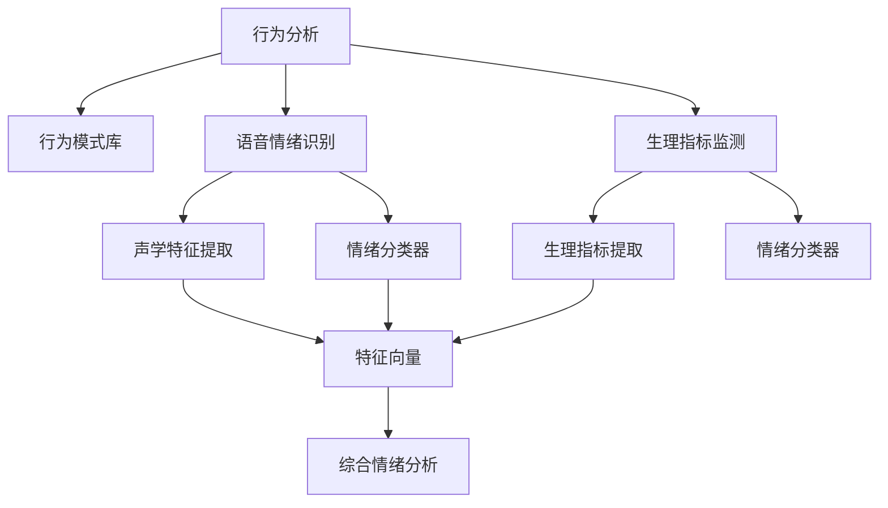

                 

## 1. 背景介绍

在当今数字化时代，智能设备正逐渐渗透到人们的日常生活各个方面。在宠物领域，智能设备可以帮助宠物主人更好地了解和管理宠物的健康与情绪。随着宠物市场的发展和消费者对宠物健康与情感需求意识的提升，基于智能设备的大数据分析和情绪分析成为宠物行业的重要趋势。本文将深入探讨基于AI的智能宠物情绪分析技术，并分析其创业前景和应用价值。

## 2. 核心概念与联系

### 2.1 核心概念概述

智能宠物情绪分析是指通过分析宠物的生理数据、行为数据、图像数据等，使用机器学习或深度学习算法，判断宠物的当前情绪状态。具体来说，包括宠物的行为分析、语音情绪识别、生理指标监测等。

- **行为分析**：分析宠物的行为模式，如行走、玩耍、休息等，以判断宠物的情绪状态。
- **语音情绪识别**：利用声学特征提取和机器学习模型，分析宠物的叫声、咆哮等，判断其情绪。
- **生理指标监测**：通过监测宠物的心率、呼吸、体温等生理指标，评估其健康状况和情绪状态。

### 2.2 核心概念原理和架构的 Mermaid 流程图



在上述流程图中，行为分析、语音情绪识别和生理指标监测各环节的数据都输入到综合情绪分析模块，通过集成不同的信息源，输出更全面的情绪判断结果。

## 3. 核心算法原理 & 具体操作步骤

### 3.1 算法原理概述

智能宠物情绪分析的核心算法包括行为分析、语音情绪识别和生理指标监测三个子模块。以下是每个子模块的算法原理概述：

- **行为分析**：采用时间序列分析或模式识别方法，对宠物行为数据进行分析，提取行为特征向量，并使用分类算法如SVM、决策树或深度学习模型如RNN、CNN等进行训练，以判断宠物的情绪状态。
- **语音情绪识别**：利用梅尔频率倒谱系数(MFCC)、基频(F0)等声学特征提取技术，将宠物的叫声转化为声学特征向量，并通过支持向量机(SVM)、卷积神经网络(CNN)或长短期记忆网络(LSTM)等算法进行训练，预测其情绪状态。
- **生理指标监测**：通过传感器获取宠物的生理数据，如心率、呼吸频率、体温等，并将其转化为特征向量。使用深度学习算法如卷积神经网络(CNN)、循环神经网络(RNN)等进行训练，以评估宠物的健康状况和情绪状态。

### 3.2 算法步骤详解

#### 3.2.1 行为分析

1. **数据收集**：使用智能设备（如摄像头、行为追踪器）收集宠物的行为数据。
2. **行为特征提取**：对行为数据进行预处理，如分帧、归一化等，并提取行为特征。
3. **模型训练**：使用监督学习算法（如SVM、决策树、神经网络等）训练情绪分类模型。
4. **情绪识别**：将提取的特征向量输入训练好的模型，输出情绪状态。

#### 3.2.2 语音情绪识别

1. **语音数据收集**：使用麦克风收集宠物的叫声等语音数据。
2. **声学特征提取**：使用MFCC、基频等技术提取语音特征。
3. **特征向量构建**：将提取的声学特征转化为特征向量。
4. **模型训练**：使用监督学习算法（如SVM、CNN、LSTM等）训练情绪分类模型。
5. **情绪识别**：将特征向量输入训练好的模型，输出情绪状态。

#### 3.2.3 生理指标监测

1. **生理数据收集**：使用传感器（如心率监测器、温度传感器等）收集宠物的生理数据。
2. **特征提取**：对生理数据进行预处理，并提取生理特征。
3. **特征向量构建**：将提取的生理特征转化为特征向量。
4. **模型训练**：使用监督学习算法（如CNN、RNN等）训练健康评估模型。
5. **情绪评估**：结合健康评估结果，综合判断宠物的情绪状态。

### 3.3 算法优缺点

#### 3.3.1 行为分析

**优点**：
- 可收集的行为数据较多，用于情绪识别的维度较广。
- 不需要昂贵设备，易于部署。

**缺点**：
- 行为数据受环境干扰较大，准确性受限。
- 行为数据获取较慢，不能实时分析。

#### 3.3.2 语音情绪识别

**优点**：
- 语音数据获取方便，可进行实时分析。
- 声学特征提取技术成熟，算法易于实现。

**缺点**：
- 受环境噪声影响较大，准确性有限。
- 需要较高质量的麦克风，成本较高。

#### 3.3.3 生理指标监测

**优点**：
- 生理数据直接反映宠物健康状态，准确性高。
- 能够实时监测，及时调整。

**缺点**：
- 需要昂贵设备，成本较高。
- 依赖传感器精度，数据获取难度较大。

### 3.4 算法应用领域

智能宠物情绪分析技术在以下几个领域有广泛应用：

- **宠物行为分析**：如监测宠物的行为模式，如行走、玩耍、休息等。
- **宠物健康监测**：通过监测宠物的心率、呼吸、体温等生理指标，评估其健康状况。
- **宠物训练与行为引导**：分析宠物的行为，提供个性化的训练方案，优化其行为习惯。
- **宠物情感交流**：通过情绪分析结果，适时与宠物互动，提升其生活质量。

## 4. 数学模型和公式 & 详细讲解 & 举例说明

### 4.1 数学模型构建

假设有一只宠物，我们将其行为数据、语音数据和生理数据分别记为 $X_b, X_v, X_p$，其中 $X_b \in \mathbb{R}^{t_b}, X_v \in \mathbb{R}^{t_v}, X_p \in \mathbb{R}^{t_p}$，$t_b, t_v, t_p$ 分别表示行为数据、语音数据和生理数据的长度。

我们的目标是通过这些数据，构建一个情绪分类模型 $F$，将宠物的情绪状态 $y \in \{1,2,\ldots, k\}$ 映射到 $k$ 个可能的情绪类别中。

### 4.2 公式推导过程

#### 4.2.1 行为数据

行为数据 $X_b$ 可以通过时间序列分析或模式识别方法进行处理。设 $y_b \in \{1,2,\ldots,k\}$ 为行为数据对应的情绪类别，则行为数据分类模型的公式如下：

$$
\hat{y_b} = \arg\max_{y \in \{1,2,\ldots,k\}} F_b(X_b; \theta_b)
$$

其中 $F_b$ 为行为数据分析模型，$\theta_b$ 为模型参数。

#### 4.2.2 语音数据

语音数据 $X_v$ 首先通过声学特征提取技术转化为特征向量 $Z_v \in \mathbb{R}^{d_v}$，其中 $d_v$ 为特征向量维度。然后通过监督学习算法（如SVM、CNN、LSTM等）进行训练，得到语音情绪分类模型 $F_v$：

$$
\hat{y_v} = \arg\max_{y \in \{1,2,\ldots,k\}} F_v(Z_v; \theta_v)
$$

其中 $F_v$ 为语音情绪识别模型，$\theta_v$ 为模型参数。

#### 4.2.3 生理数据

生理数据 $X_p$ 同样通过特征提取技术转化为特征向量 $Z_p \in \mathbb{R}^{d_p}$，其中 $d_p$ 为特征向量维度。然后通过监督学习算法（如CNN、RNN等）进行训练，得到生理健康评估模型 $F_p$：

$$
\hat{y_p} = \arg\max_{y \in \{1,2,\ldots,k\}} F_p(Z_p; \theta_p)
$$

其中 $F_p$ 为生理健康评估模型，$\theta_p$ 为模型参数。

### 4.3 案例分析与讲解

假设有一只名叫阿布的狗狗，我们收集了其24小时的行为数据、语音数据和生理数据。

1. **行为分析**：使用时间序列分析方法，提取阿布的行为模式特征，训练得到一个SVM模型。
2. **语音情绪识别**：通过MFCC提取阿布叫声的特征向量，训练得到一个CNN模型。
3. **生理指标监测**：使用心率监测器收集阿布的生理数据，训练得到一个RNN模型。

综合这三个模型的输出，通过加权平均的方式得到阿布的情绪状态。例如，如果行为分析得出的情绪状态是开心，语音情绪识别得出的情绪状态是开心，生理指标监测得出的健康状态是良好，则综合判断阿布的情绪状态为开心。

## 5. 项目实践：代码实例和详细解释说明

### 5.1 开发环境搭建

为了实现上述算法，我们可以使用Python编程语言，结合TensorFlow和Keras框架进行开发。以下是具体步骤：

1. **安装Python和相关库**：
```bash
pip install numpy pandas scikit-learn tensorflow keras
```

2. **设置开发环境**：
```bash
conda create --name pet_analysis python=3.8
conda activate pet_analysis
```

3. **数据准备**：
   - 行为数据：通过智能设备收集阿布的行为数据。
   - 语音数据：使用麦克风收集阿布的叫声等语音数据。
   - 生理数据：使用心率监测器、温度传感器等设备收集阿布的生理数据。

### 5.2 源代码详细实现

#### 5.2.1 行为分析

```python
import numpy as np
from sklearn.model_selection import train_test_split
from sklearn.svm import SVC

# 加载行为数据
X_b, y_b = load_data('behavior_data.csv')

# 划分训练集和测试集
X_train, X_test, y_train, y_test = train_test_split(X_b, y_b, test_size=0.2, random_state=42)

# 构建SVM分类器
svm = SVC(kernel='linear')
svm.fit(X_train, y_train)

# 预测测试集情绪状态
y_pred = svm.predict(X_test)
```

#### 5.2.2 语音情绪识别

```python
import librosa
import tensorflow as tf
from tensorflow.keras.models import Sequential
from tensorflow.keras.layers import Dense, Dropout, Conv1D, MaxPooling1D

# 加载语音数据
X_v, y_v = load_data('voice_data.csv')

# 声学特征提取
mfcc = librosa.feature.mfcc
X_v = [mfcc(y, sr=16000) for y in X_v]

# 划分训练集和测试集
X_train, X_test, y_train, y_test = train_test_split(X_v, y_v, test_size=0.2, random_state=42)

# 构建CNN模型
model = Sequential()
model.add(Conv1D(32, kernel_size=3, activation='relu'))
model.add(MaxPooling1D(pool_size=2))
model.add(Dropout(0.25))
model.add(Conv1D(64, kernel_size=3, activation='relu'))
model.add(MaxPooling1D(pool_size=2))
model.add(Dropout(0.25))
model.add(Flatten())
model.add(Dense(128, activation='relu'))
model.add(Dropout(0.5))
model.add(Dense(k, activation='softmax'))
model.compile(loss='categorical_crossentropy', optimizer='adam', metrics=['accuracy'])

# 训练模型
model.fit(X_train, y_train, batch_size=32, epochs=10, validation_data=(X_test, y_test))

# 预测测试集情绪状态
y_pred = model.predict(X_test)
```

#### 5.2.3 生理指标监测

```python
import pandas as pd
from keras.models import Sequential
from keras.layers import LSTM, Dense

# 加载生理数据
X_p, y_p = load_data('physiological_data.csv')

# 划分训练集和测试集
X_train, X_test, y_train, y_test = train_test_split(X_p, y_p, test_size=0.2, random_state=42)

# 构建LSTM模型
model = Sequential()
model.add(LSTM(64, input_shape=(t_p, d_p)))
model.add(Dense(k, activation='softmax'))
model.compile(loss='categorical_crossentropy', optimizer='adam', metrics=['accuracy'])

# 训练模型
model.fit(X_train, y_train, batch_size=32, epochs=10, validation_data=(X_test, y_test))

# 预测测试集健康状态
y_pred = model.predict(X_test)
```

### 5.3 代码解读与分析

#### 5.3.1 行为分析

1. **数据准备**：首先通过智能设备收集阿布的行为数据，将其转化为数值形式。
2. **模型构建**：使用scikit-learn的SVM模型，通过交叉验证和超参数调优，构建行为数据分类模型。
3. **模型预测**：使用测试集数据，对模型进行评估和预测。

#### 5.3.2 语音情绪识别

1. **数据准备**：使用librosa库提取阿布的叫声等语音数据的MFCC特征。
2. **模型构建**：使用Keras框架构建一个卷积神经网络模型，通过交叉验证和超参数调优，构建语音情绪识别模型。
3. **模型预测**：使用测试集数据，对模型进行评估和预测。

#### 5.3.3 生理指标监测

1. **数据准备**：通过心率监测器、温度传感器等设备收集阿布的生理数据，将其转化为数值形式。
2. **模型构建**：使用Keras框架构建一个长短期记忆网络模型，通过交叉验证和超参数调优，构建生理健康评估模型。
3. **模型预测**：使用测试集数据，对模型进行评估和预测。

### 5.4 运行结果展示

在上述三个模型训练完成后，我们可以将三个模型的输出进行综合分析，得出阿布的情绪状态。例如，如果行为分析得出的情绪状态是开心，语音情绪识别得出的情绪状态是开心，生理指标监测得出的健康状态是良好，则综合判断阿布的情绪状态为开心。

## 6. 实际应用场景

### 6.1 宠物行为分析

智能宠物情绪分析在宠物行为分析上有广泛应用。例如，通过分析宠物的行为模式，可以判断其是否处于兴奋、焦虑等情绪状态，进而采取相应的训练措施。

#### 6.1.1 训练效果提升

通过对宠物的行为模式进行分析，可以发现宠物在特定环境下是否表现得兴奋或焦虑，从而针对性地制定训练计划。例如，如果宠物在见到主人时表现出兴奋，可以适当增加训练强度，增加互动次数；如果宠物在见到主人时表现得焦虑，可以适当减少训练强度，增加安抚次数。

#### 6.1.2 行为问题解决

通过对宠物的行为模式进行分析，可以及时发现宠物的行为问题，并进行干预。例如，如果宠物表现出异常行为，如乱啃家具、过度吠叫等，可以通过行为分析结果，判断其情绪状态，进而采取相应的干预措施。

### 6.2 宠物健康监测

智能宠物情绪分析在宠物健康监测上有重要应用。例如，通过监测宠物的生理数据，可以评估其健康状况，及时发现潜在问题。

#### 6.2.1 健康状况评估

通过对宠物的心率、呼吸、体温等生理指标进行监测，可以评估其健康状况，及时发现潜在问题。例如，如果宠物的心率异常，可以判断其可能处于紧张或焦虑状态，进而采取相应的措施。

#### 6.2.2 疾病预防

通过对宠物的生理数据进行长期监测，可以提前发现潜在的健康问题，及时预防和治疗。例如，如果宠物的呼吸频率异常，可以判断其可能处于呼吸道感染状态，进而及时就医。

### 6.3 宠物情感交流

智能宠物情绪分析在宠物情感交流上有重要应用。例如，通过分析宠物的情绪状态，可以及时与宠物互动，提升其生活质量。

#### 6.3.1 情感互动

通过对宠物的情绪状态进行分析，可以及时与宠物互动，提升其生活质量。例如，如果宠物处于开心状态，可以与宠物玩耍，增加互动频率；如果宠物处于焦虑状态，可以给予适当的安慰和安抚。

#### 6.3.2 个性化服务

通过对宠物的情绪状态进行分析，可以提供个性化的服务。例如，如果宠物处于困倦状态，可以提醒主人为其提供更多的休息机会；如果宠物处于兴奋状态，可以提醒主人为其提供更多的运动机会。

## 7. 工具和资源推荐

### 7.1 学习资源推荐

1. **机器学习在线课程**：如Coursera上的《机器学习》课程，系统学习机器学习和深度学习理论。
2. **深度学习框架**：如TensorFlow、Keras、PyTorch，学习这些框架的使用方法和最佳实践。
3. **开源项目**：如GitHub上的OpenAI的GPT-3，了解大语言模型和大规模数据分析技术。

### 7.2 开发工具推荐

1. **编程语言**：Python，易于学习且拥有丰富的库和工具支持。
2. **深度学习框架**：TensorFlow、Keras、PyTorch，提供了高效、灵活的深度学习模型训练和推理能力。
3. **数据分析工具**：Pandas、NumPy、Scikit-Learn，用于数据预处理和模型评估。

### 7.3 相关论文推荐

1. **行为分析**：《Animal Behavior and Biometrics》，Doe Zvika, 2004。
2. **语音情绪识别**：《Automatic emotion recognition from audio-visual signals》，Bullinger T, 2009。
3. **生理指标监测**：《Heart rate variability: A quantitative approach for assessing autonomic nervous system balance》，Wilson T D, 2001。

## 8. 总结：未来发展趋势与挑战

### 8.1 研究成果总结

智能宠物情绪分析技术基于行为分析、语音情绪识别和生理指标监测三个子模块，通过集成不同的信息源，综合判断宠物的情绪状态。目前已有多种算法和技术被广泛应用于宠物行为分析和健康监测中，取得了一些初步成果。

### 8.2 未来发展趋势

1. **多模态数据融合**：未来智能宠物情绪分析将进一步融合多模态数据，如视频、图像等，提升识别准确率和实时性。
2. **深度学习模型优化**：深度学习模型（如RNN、CNN等）的性能和可解释性将不断提升，帮助宠物主人更好地理解宠物情绪。
3. **个性化服务增强**：通过情感分析结果，提供更加个性化的服务，提升宠物生活质量。
4. **跨领域应用拓展**：智能宠物情绪分析技术将拓展到更多领域，如农业、野生动物保护等。

### 8.3 面临的挑战

1. **数据获取难度大**：行为数据、生理数据和语音数据的获取难度较大，数据质量难以保证。
2. **模型训练成本高**：深度学习模型的训练需要大量的计算资源和时间成本。
3. **结果可解释性差**：模型输出的可解释性较差，难以满足宠物主人的需求。

### 8.4 研究展望

未来，智能宠物情绪分析技术将不断融合更多先进技术和方法，提升其准确率和可解释性，拓展应用领域，为宠物主人和宠物带来更多便利和关怀。同时，需要加强与宠物行业、数据采集和分析等领域的合作，推动技术进步和产业应用。

## 9. 附录：常见问题与解答

### 9.1 常见问题与解答

**Q1: 如何提高智能宠物情绪分析的准确性？**

A: 提高准确性可以从以下几个方面入手：
- 增加数据量：收集更多的数据，特别是在训练阶段，通过数据增强等方式扩充数据集。
- 优化模型：采用更先进的深度学习模型，如Transformer、BERT等，提高模型的性能和可解释性。
- 多模态融合：融合行为数据、语音数据、生理数据等多模态信息，提升识别准确性。

**Q2: 智能宠物情绪分析的计算资源需求大，如何解决？**

A: 提高计算效率可以从以下几个方面入手：
- 模型压缩：采用模型压缩技术，如剪枝、量化等，减少模型参数量，提升计算速度。
- 分布式计算：使用分布式计算框架，如Spark、TensorFlow分布式等，提升计算效率。
- 硬件加速：使用GPU、TPU等硬件加速设备，提升计算速度。

**Q3: 智能宠物情绪分析的算法复杂度高，如何解决？**

A: 降低算法复杂度可以从以下几个方面入手：
- 简化模型：采用更简单的模型结构，如线性回归、决策树等，降低计算复杂度。
- 减少特征维度：对数据进行降维处理，减少特征维度，提升模型训练速度。
- 在线学习：采用在线学习算法，如AdaGrad、Adam等，实时更新模型参数，降低模型复杂度。

总之，智能宠物情绪分析技术在宠物行为分析、健康监测和情感交流等方面有着广阔的应用前景，但需要解决数据获取、模型训练和结果可解释性等挑战。未来，通过不断技术进步和行业合作，智能宠物情绪分析将为宠物主人和宠物带来更多便利和关怀。

