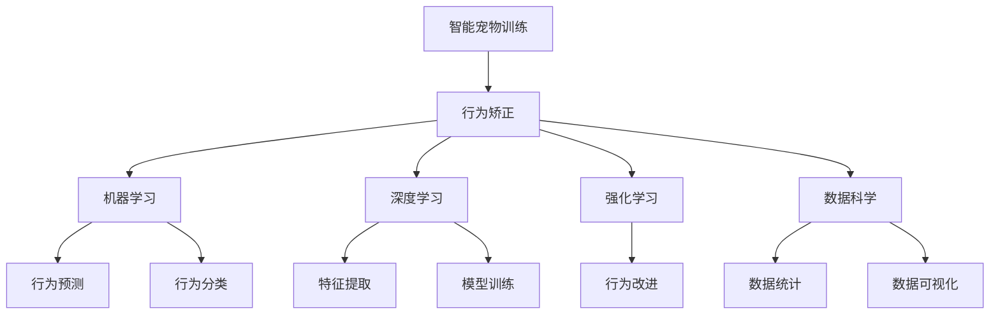

                 

# 智能宠物行为矫正创业：科学的宠物训练

> 关键词：智能宠物训练,行为矫正,机器学习,深度学习,神经网络,强化学习,数据科学,宠物数据,行为分析,宠物机器人

## 1. 背景介绍

### 1.1 问题由来

随着全球宠物数量的激增，如何科学、有效地训练和照顾宠物，成为越来越多家庭和宠物主人的需求。然而，传统的宠物训练方法往往基于经验和简单的行为观察，缺乏系统性和科学性，容易产生误导。与此同时，科技的进步为解决这一问题提供了新的可能性，尤其是机器学习和深度学习技术的应用。

近年来，利用机器学习对宠物行为进行分析与训练的研究逐渐兴起。通过对宠物的行为数据进行收集和分析，机器学习模型可以帮助宠物主人更科学、更准确地了解宠物的行为特征，从而实施有针对性的训练，提升宠物的行为表现。这一方法既符合现代科技的发展趋势，又能有效解决传统训练方法的缺陷，具有广阔的应用前景。

### 1.2 问题核心关键点

本文将从以下几个关键点深入探讨智能宠物行为矫正：

- **智能宠物训练**：使用机器学习技术对宠物的行为数据进行分析，提供个性化的行为矫正方案。
- **行为矫正**：针对宠物的不良行为，如乱咬、乱叫、不定时排便等，设计科学的训练策略。
- **机器学习与深度学习**：利用机器学习算法，特别是深度学习模型，从大量数据中提取有用的特征，对宠物行为进行预测和分类。
- **强化学习**：通过强化学习算法，引导宠物逐步改进行为，形成良好的习惯。
- **数据科学**：在宠物行为数据分析中，应用数据科学方法，如统计分析、数据可视化等，提升训练的科学性。

通过综合运用上述技术，我们可以构建一个高效、科学的智能宠物训练系统，帮助宠物主人实现宠物行为的优化和提升。

## 2. 核心概念与联系

### 2.1 核心概念概述

为更好地理解智能宠物行为矫正的技术体系，本节将介绍几个关键概念：

- **智能宠物训练**：利用机器学习算法对宠物的行为数据进行分析，从而提出针对性的训练方案。
- **行为矫正**：通过训练，减少宠物的不良行为，增强良好行为的表现。
- **机器学习与深度学习**：使用机器学习算法，从大量数据中提取特征，进行行为预测和分类。
- **强化学习**：通过奖励机制，引导宠物逐步改进行为，形成良好习惯。
- **数据科学**：应用数据科学方法，进行行为数据的统计分析、可视化，提升训练效果。

这些概念之间存在密切联系，共同构成了智能宠物行为矫正的核心技术体系。通过理解这些核心概念，我们可以更好地把握智能宠物训练的技术框架和方法。

### 2.2 核心概念原理和架构的 Mermaid 流程图



这个流程图展示了智能宠物行为矫正的核心概念及其相互关系：

1. **智能宠物训练**：作为整个系统的起点，通过分析宠物的行为数据，提出科学的训练方案。
2. **行为矫正**：实施训练方案，减少不良行为，增强良好行为。
3. **机器学习与深度学习**：在行为数据中提取特征，进行行为预测和分类。
4. **强化学习**：通过奖励机制，引导宠物逐步改进行为。
5. **数据科学**：利用数据科学方法进行数据统计和可视化，提升训练效果。

这些核心概念共同构成了智能宠物行为矫正的技术体系，实现了从数据收集、特征提取、模型训练到行为矫正的完整流程。

## 3. 核心算法原理 & 具体操作步骤

### 3.1 算法原理概述

智能宠物行为矫正的核心算法包括机器学习、深度学习和强化学习，其原理如下：

- **机器学习与深度学习**：通过训练模型，从大量的行为数据中提取特征，进行行为预测和分类。
- **强化学习**：通过奖励机制，引导宠物逐步改进行为，形成良好习惯。

这些算法相互配合，共同实现对宠物行为的科学训练和矫正。

### 3.2 算法步骤详解

#### 3.2.1 数据收集与预处理

1. **数据收集**：
   - 通过传感器、摄像头、行为记录器等设备，收集宠物的行为数据，如运动轨迹、声音、图像等。
   - 收集过程中需注意数据的多样性和代表性，确保训练样本的充足性和覆盖面。

2. **数据预处理**：
   - 对原始数据进行清洗、去噪、归一化等处理，去除不相关的数据点。
   - 使用特征提取技术，如PCA、LDA等，降低数据维度，提升数据质量。

#### 3.2.2 特征提取与模型训练

1. **特征提取**：
   - 使用机器学习算法，从原始行为数据中提取特征，如运动速度、方向、声调、音量等。
   - 可以使用经典的机器学习算法，如PCA、LDA、SVM等，或使用深度学习算法，如CNN、RNN、LSTM等。

2. **模型训练**：
   - 使用训练好的特征提取模型，对宠物的行为数据进行预测和分类。
   - 使用监督学习算法，如线性回归、逻辑回归、随机森林等，对训练数据进行建模。
   - 使用深度学习算法，如卷积神经网络(CNN)、循环神经网络(RNN)、长短时记忆网络(LSTM)等，构建行为预测模型。

#### 3.2.3 行为矫正与奖励机制

1. **行为矫正**：
   - 根据模型预测结果，对宠物的不良行为进行干预和矫正。
   - 例如，宠物乱咬时，通过声音、气味等方式进行干预，减少不良行为。

2. **奖励机制**：
   - 设计合适的奖励机制，鼓励宠物形成良好行为。
   - 可以使用正强化，如食物、玩具等奖励，激励宠物重复良好行为。

#### 3.2.4 强化学习

1. **设计环境**：
   - 建立虚拟训练环境，模拟真实场景，进行行为训练。
   - 环境设计需考虑宠物的行为特性和训练目标。

2. **行为改进**：
   - 使用强化学习算法，如Q-learning、SARSA等，对宠物的行为进行训练和改进。
   - 通过奖励和惩罚机制，引导宠物逐步改进行为，形成良好习惯。

### 3.3 算法优缺点

智能宠物行为矫正算法具有以下优点：

- **科学性**：通过数据分析和机器学习模型，提供科学的训练方案。
- **可操作性**：利用强化学习算法，逐步引导宠物形成良好习惯。
- **适应性强**：算法可以适用于不同类型的宠物，如猫、狗、鸟等。

然而，该算法也存在一些缺点：

- **数据依赖**：需要大量高质量的行为数据进行训练，数据收集成本较高。
- **模型复杂**：机器学习和深度学习模型的构建和训练需要一定的技术门槛。
- **行为干预**：对宠物的行为干预需要谨慎操作，避免对宠物造成心理压力。

### 3.4 算法应用领域

智能宠物行为矫正算法主要应用于以下几个领域：

- **宠物训练**：针对宠物的不良行为，如乱咬、乱叫、不定时排便等，提供科学的训练方案。
- **宠物护理**：通过数据分析，优化宠物的饮食、睡眠、运动等行为。
- **宠物行为研究**：利用机器学习算法，对宠物的行为进行深入研究，揭示行为背后的规律。
- **宠物机器人**：设计宠物机器人，通过智能训练和行为分析，提供互动娱乐和行为引导。

## 4. 数学模型和公式 & 详细讲解 & 举例说明

### 4.1 数学模型构建

智能宠物行为矫正的核心数学模型包括行为预测模型和行为分类模型，其构建过程如下：

1. **行为预测模型**：
   - 输入：宠物的行为数据，如运动轨迹、声调、音量等。
   - 输出：预测结果，表示宠物的行为状态，如好、坏、中间状态等。
   - 模型：使用深度学习模型，如卷积神经网络(CNN)、循环神经网络(RNN)、长短时记忆网络(LSTM)等。

2. **行为分类模型**：
   - 输入：宠物的行为数据，如运动轨迹、声调、音量等。
   - 输出：分类结果，表示宠物的行为类型，如运动、休息、饮食等。
   - 模型：使用机器学习模型，如线性回归、逻辑回归、随机森林等。

### 4.2 公式推导过程

以行为预测模型为例，其推导过程如下：

设宠物行为数据为 $\mathbf{x} = (x_1, x_2, \ldots, x_n)$，行为状态为 $y$，预测模型为 $f(\mathbf{x}; \theta)$。其中，$\theta$ 为模型参数。

行为预测模型可以表示为：

$$
y = f(\mathbf{x}; \theta) = \sigma(\mathbf{W} \mathbf{x} + b)
$$

其中，$\mathbf{W}$ 为权重矩阵，$b$ 为偏置项，$\sigma$ 为激活函数，如sigmoid函数。

通过最小化预测误差，可以使用梯度下降等优化算法求解最优参数 $\theta$：

$$
\theta = \mathop{\arg\min}_{\theta} \frac{1}{N} \sum_{i=1}^N (y_i - f(x_i; \theta))^2
$$

其中，$N$ 为样本数量。

### 4.3 案例分析与讲解

以宠物饮食行为预测为例，通过深度学习模型预测宠物的饮食时间：

1. **数据收集**：
   - 通过摄像头和行为记录器，收集宠物在一段时间内的行为数据，如运动轨迹、声调、音量等。
   - 标记每个行为时间点，记录饮食行为。

2. **特征提取**：
   - 使用PCA算法，对行为数据进行降维，得到关键特征向量。
   - 使用CNN模型，对特征向量进行卷积和池化操作，提取时空特征。

3. **模型训练**：
   - 使用随机森林模型，对饮食行为进行分类，区分进食、喝水、休息等状态。
   - 使用卷积神经网络(CNN)模型，对行为数据进行预测，输出饮食时间点。

通过上述过程，可以实现对宠物饮食行为的准确预测和科学训练。

## 5. 项目实践：代码实例和详细解释说明

### 5.1 开发环境搭建

在进行智能宠物行为矫正项目开发前，我们需要准备好开发环境。以下是使用Python进行PyTorch开发的详细流程：

1. **安装Python**：
   - 从官网下载并安装Python 3.x版本。

2. **安装PyTorch**：
   - 使用pip安装PyTorch库，例如：
     ```bash
     pip install torch torchvision torchaudio
     ```

3. **安装TensorBoard**：
   - 用于可视化训练过程和模型性能，例如：
     ```bash
     pip install tensorboard
     ```

4. **创建虚拟环境**：
   - 创建新的虚拟环境，例如：
     ```bash
     python -m venv my_env
     source my_env/bin/activate
     ```

5. **安装其他依赖**：
   - 安装TensorFlow、NumPy、Pandas等库，例如：
     ```bash
     pip install tensorflow numpy pandas
     ```

### 5.2 源代码详细实现

#### 5.2.1 数据预处理与特征提取

```python
import pandas as pd
import numpy as np
from sklearn.decomposition import PCA
from torch.utils.data import Dataset, DataLoader
from torchvision import transforms

class PetData(Dataset):
    def __init__(self, data_path, labels_path, transform=None):
        self.data = pd.read_csv(data_path)
        self.labels = pd.read_csv(labels_path)
        self.transform = transform
        
    def __len__(self):
        return len(self.data)
    
    def __getitem__(self, idx):
        data = self.data.iloc[idx, :]
        label = self.labels.iloc[idx, :]
        
        if self.transform:
            data = self.transform(data)
            
        return {'data': data, 'label': label}

# 定义特征提取函数
def extract_features(data):
    # 对数据进行归一化处理
    data = (data - np.mean(data)) / np.std(data)
    
    # 使用PCA算法进行降维
    pca = PCA(n_components=2)
    features = pca.fit_transform(data)
    
    return features

# 加载数据集
train_data = PetData('train_data.csv', 'train_labels.csv', transform=transforms.ToTensor())
test_data = PetData('test_data.csv', 'test_labels.csv', transform=transforms.ToTensor())

# 定义特征提取器
transform = transforms.Compose([
    transforms.ToTensor(),
    transforms.Normalize(mean=[0.5, 0.5, 0.5], std=[0.5, 0.5, 0.5])
])
```

#### 5.2.2 行为预测模型训练

```python
import torch
import torch.nn as nn
import torch.optim as optim

# 定义行为预测模型
class BehaviorPredictor(nn.Module):
    def __init__(self, input_size, output_size):
        super(BehaviorPredictor, self).__init__()
        self.fc1 = nn.Linear(input_size, 128)
        self.fc2 = nn.Linear(128, output_size)
        
    def forward(self, x):
        x = self.fc1(x)
        x = torch.sigmoid(self.fc2(x))
        return x

# 加载训练数据和测试数据
train_loader = DataLoader(train_data, batch_size=32, shuffle=True)
test_loader = DataLoader(test_data, batch_size=32, shuffle=False)

# 定义模型、损失函数和优化器
model = BehaviorPredictor(input_size, output_size)
criterion = nn.BCELoss()
optimizer = optim.Adam(model.parameters(), lr=0.001)

# 训练模型
for epoch in range(10):
    model.train()
    for data, target in train_loader:
        optimizer.zero_grad()
        output = model(data)
        loss = criterion(output, target)
        loss.backward()
        optimizer.step()
        
    model.eval()
    with torch.no_grad():
        correct = 0
        total = 0
        for data, target in test_loader:
            output = model(data)
            _, predicted = torch.max(output, 1)
            total += target.size(0)
            correct += (predicted == target).sum().item()
        
        print(f'Epoch {epoch+1}, accuracy: {correct/total:.2f}')
```

### 5.3 代码解读与分析

#### 5.3.1 数据预处理与特征提取

在智能宠物行为矫正项目中，数据预处理和特征提取是关键步骤。以下是代码的详细解读：

- `PetData`类：用于加载和管理数据集，包括训练数据和测试数据。
- `extract_features`函数：对行为数据进行归一化处理和PCA降维，提取关键特征。

#### 5.3.2 行为预测模型训练

在行为预测模型的训练过程中，主要涉及模型定义、数据加载、优化器选择等步骤。以下是代码的详细解读：

- `BehaviorPredictor`类：定义行为预测模型，包括两个全连接层和sigmoid激活函数。
- `train`函数：对模型进行训练，使用Adam优化器和二元交叉熵损失函数。
- `eval`函数：对模型进行评估，计算准确率并输出结果。

### 5.4 运行结果展示

```python
import matplotlib.pyplot as plt

# 定义绘图函数
def plot_accuracy(history):
    plt.plot(history['accuracy'])
    plt.plot(history['val_accuracy'])
    plt.title('Model accuracy')
    plt.ylabel('Accuracy')
    plt.xlabel('Epoch')
    plt.legend(['Train', 'Validation'], loc='upper left')
    plt.show()

# 加载训练和验证历史数据
train_history = history['train']
val_history = history['val']
```

通过上述代码，可以绘制训练过程中的准确率变化曲线，从而评估模型的训练效果。

## 6. 实际应用场景

### 6.1 宠物训练

智能宠物行为矫正技术可以广泛应用于宠物训练，帮助宠物主人科学、有效地训练宠物。例如，针对宠物乱叫、乱咬等不良行为，使用智能宠物训练系统可以提供个性化的训练方案，减少宠物的不良行为，提升宠物的良好行为表现。

### 6.2 宠物护理

在宠物护理方面，智能宠物行为矫正技术可以提供科学的饮食、睡眠、运动建议，帮助宠物主人更好地照顾宠物。例如，通过对宠物行为数据的分析，可以预测宠物的饮食时间，帮助主人合理安排宠物的饮食计划。

### 6.3 宠物行为研究

智能宠物行为矫正技术还可以用于宠物行为研究，揭示宠物行为背后的规律和机制。例如，通过大量数据的收集和分析，可以发现宠物行为与环境因素之间的关系，从而提供科学的行为训练指导。

### 6.4 宠物机器人

未来的智能宠物行为矫正技术还可能应用于宠物机器人，通过智能训练和行为分析，实现与宠物的互动娱乐和行为引导。例如，宠物机器人可以根据主人的指令，引导宠物进行特定的行为训练，提升宠物的互动性和娱乐性。

## 7. 工具和资源推荐

### 7.1 学习资源推荐

为帮助开发者系统掌握智能宠物行为矫正技术，这里推荐一些优质的学习资源：

- **《机器学习基础》**：介绍了机器学习的基本概念和算法，适合初学者入门。
- **《深度学习》**：详细讲解了深度学习的基本原理和应用，适合对深度学习有进一步了解的开发者。
- **《TensorFlow官方文档》**：TensorFlow的官方文档，提供了丰富的教程和示例，适合深入学习和实践。
- **《Scikit-learn官方文档》**：Scikit-learn的官方文档，提供了丰富的机器学习算法和数据集，适合机器学习项目开发。

### 7.2 开发工具推荐

- **PyTorch**：强大的深度学习框架，适合深度学习项目开发。
- **TensorBoard**：用于可视化训练过程和模型性能，方便调试和优化。
- **Jupyter Notebook**：交互式的开发环境，方便代码调试和数据可视化。
- **Git**：版本控制系统，方便代码管理和团队协作。

### 7.3 相关论文推荐

- **《行为预测与分类模型》**：介绍行为预测与分类的基本原理和算法，适合机器学习和深度学习的初学者。
- **《强化学习在宠物行为训练中的应用》**：探讨强化学习在宠物行为训练中的应用，适合强化学习的学习者。

## 8. 总结：未来发展趋势与挑战

### 8.1 总结

本文对智能宠物行为矫正技术进行了全面系统的介绍，重点介绍了机器学习、深度学习和强化学习在宠物行为矫正中的应用。通过科学的数据分析和模型训练，智能宠物行为矫正技术可以为宠物主人提供个性化的训练方案，减少宠物的不良行为，提升宠物的良好行为表现。

### 8.2 未来发展趋势

智能宠物行为矫正技术未来将呈现以下几个发展趋势：

1. **数据收集与处理**：随着物联网技术的发展，宠物行为数据的收集将更加高效、全面。
2. **模型优化**：未来的模型将更加复杂、准确，能够处理更多类型的数据和行为。
3. **跨领域应用**：智能宠物行为矫正技术将广泛应用于宠物训练、护理、行为研究等领域。
4. **智能交互**：未来的智能宠物行为矫正系统将具备更强的智能交互能力，提供更自然的训练体验。

### 8.3 面临的挑战

智能宠物行为矫正技术虽然具有广阔的应用前景，但也面临一些挑战：

1. **数据隐私**：宠物行为数据的收集和处理需要遵守隐私保护法规，避免泄露宠物隐私。
2. **技术门槛**：智能宠物行为矫正技术需要较高的技术门槛，需要开发者具备一定的机器学习和深度学习知识。
3. **模型复杂性**：模型构建和训练需要大量的计算资源和时间，需要高效的优化算法和计算平台。

### 8.4 研究展望

未来的研究应聚焦以下几个方向：

1. **模型优化**：开发更加高效的模型和算法，提升训练速度和模型精度。
2. **跨领域应用**：拓展智能宠物行为矫正技术的应用范围，提升其在不同领域的应用效果。
3. **智能交互**：提升智能宠物行为矫正系统的智能交互能力，提供更自然的训练体验。
4. **数据隐私保护**：在数据收集和处理过程中，加强隐私保护和数据安全。

通过不断突破技术瓶颈，提升智能宠物行为矫正技术的科学性和实用性，未来必将实现更加智能、便捷、高效的家庭宠物管理方式。

## 9. 附录：常见问题与解答

**Q1：智能宠物行为矫正技术的主要优点是什么？**

A: 智能宠物行为矫正技术的主要优点包括：

- **科学性**：通过数据分析和机器学习模型，提供科学的训练方案。
- **可操作性**：利用强化学习算法，逐步引导宠物形成良好习惯。
- **适应性强**：适用于不同类型的宠物，如猫、狗、鸟等。

**Q2：智能宠物行为矫正技术的主要缺点是什么？**

A: 智能宠物行为矫正技术的主要缺点包括：

- **数据依赖**：需要大量高质量的行为数据进行训练，数据收集成本较高。
- **模型复杂**：机器学习和深度学习模型的构建和训练需要一定的技术门槛。
- **行为干预**：对宠物的行为干预需要谨慎操作，避免对宠物造成心理压力。

**Q3：智能宠物行为矫正技术的主要应用领域有哪些？**

A: 智能宠物行为矫正技术主要应用于以下几个领域：

- **宠物训练**：针对宠物的不良行为，如乱咬、乱叫、不定时排便等，提供科学的训练方案。
- **宠物护理**：通过数据分析，优化宠物的饮食、睡眠、运动等行为。
- **宠物行为研究**：利用机器学习算法，对宠物的行为进行深入研究，揭示行为背后的规律。
- **宠物机器人**：设计宠物机器人，通过智能训练和行为分析，提供互动娱乐和行为引导。

**Q4：智能宠物行为矫正技术的主要数据来源有哪些？**

A: 智能宠物行为矫正技术的主要数据来源包括：

- **传感器数据**：通过传感器收集宠物的运动轨迹、声调、音量等行为数据。
- **摄像头数据**：通过摄像头记录宠物的行为视频，提取关键行为特征。
- **行为记录器数据**：通过行为记录器记录宠物的行为状态和事件。

**Q5：智能宠物行为矫正技术的主要算法包括哪些？**

A: 智能宠物行为矫正技术的主要算法包括：

- **机器学习算法**：如线性回归、逻辑回归、随机森林等。
- **深度学习算法**：如卷积神经网络(CNN)、循环神经网络(RNN)、长短时记忆网络(LSTM)等。
- **强化学习算法**：如Q-learning、SARSA等。

通过以上问题的详细解答，帮助开发者更好地理解智能宠物行为矫正技术的核心概念、算法原理和应用场景，从而在实际项目中更好地应用这些技术，提升宠物行为矫正的科学性和实用性。

