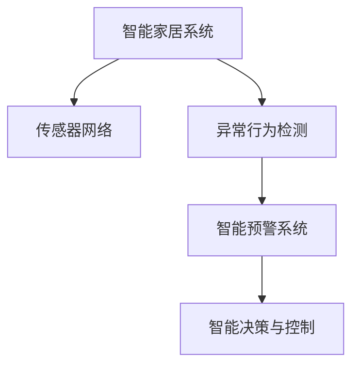

                 

# 智能家居安全预警创业：全方位家庭保护

## 1. 背景介绍

### 1.1 问题由来

随着科技的飞速发展，智能家居已成为现代家庭生活的重要组成部分。然而，智能家居系统的普及也带来了新的安全风险，如家庭监控设备的入侵、智能门锁的破解、智能家电的远程控制等，对家庭安全构成了严重威胁。如何利用先进技术保障智能家居安全，已成为各方关注的焦点。

智能家居安全预警创业正是在这一背景下诞生的。通过结合人工智能、物联网和大数据等技术，构建一套全面、实时的智能家居安全预警系统，能够在发生安全威胁时，第一时间发出警报，并及时通知用户采取应对措施，从而有效降低家庭安全风险。

### 1.2 问题核心关键点

智能家居安全预警的核心在于构建一套综合性的安全监测和预警系统。其关键点包括：

1. **传感器网络构建**：部署家庭内外的传感器网络，实时监测家庭环境中的异常变化，如门窗开关、异常声音、烟雾火灾等。

2. **异常行为检测**：利用机器学习算法，对传感器数据进行建模和分析，检测出家庭中的异常行为，如入侵、盗窃、火灾等。

3. **智能预警系统**：根据异常行为检测结果，触发报警信号，并通过多渠道（如手机App、智能音箱、电话等）通知用户，及时采取应对措施。

4. **智能决策与控制**：结合用户反馈和环境信息，智能调整安全策略，如加强门窗锁紧、远程关闭电源、报警联系警方等。

### 1.3 问题研究意义

智能家居安全预警系统的开发，对于提升家庭安全防护水平，具有重要意义：

1. **提高防范能力**：实时监测家庭环境，及早发现潜在的安全威胁，避免造成不可挽回的损失。

2. **减少用户介入**：自动化的预警和控制机制，减轻用户对家庭安全的担忧和负担，提升生活品质。

3. **数据驱动决策**：通过大数据分析，提供科学合理的安全建议和应对策略，提高安全防护的针对性和有效性。

4. **扩展应用场景**：智能家居安全预警技术可以应用于办公室、商业场所等多种场景，推动智慧安防产业的发展。

## 2. 核心概念与联系

### 2.1 核心概念概述

为更好地理解智能家居安全预警系统的构建，本节将介绍几个关键概念：

- **智能家居系统**：融合了物联网、人工智能、大数据等技术，实现家庭智能化管理和自动化控制的家庭环境管理系统。
- **传感器网络**：由多种传感器（如门窗开关传感器、烟雾传感器、温度传感器等）构成的网络，用于实时监测家庭环境。
- **异常行为检测**：利用机器学习算法，对传感器数据进行分析，检测家庭中的异常行为。
- **智能预警系统**：根据异常检测结果，自动触发报警，并通过多渠道通知用户，实现即时预警。
- **智能决策与控制**：结合用户反馈和环境信息，自动调整安全策略，实现智能化的安全管理。

这些概念之间的逻辑关系可以通过以下Mermaid流程图来展示：



这个流程图展示了这个核心概念之间的关系：

1. 智能家居系统通过传感器网络获取环境数据。
2. 异常行为检测对传感器数据进行建模和分析，检测出异常行为。
3. 智能预警系统根据检测结果，自动触发报警，并通知用户。
4. 智能决策与控制根据异常行为和用户反馈，调整安全策略。

## 3. 核心算法原理 & 具体操作步骤

### 3.1 算法原理概述

智能家居安全预警系统基于监督学习和异常检测算法构建。其核心思想是：通过传感器网络实时采集家庭环境数据，利用机器学习算法对数据进行建模和分析，检测出异常行为，并自动触发报警，提醒用户及时应对。

具体而言，系统包括数据采集、数据预处理、模型训练和预测、异常检测和预警、智能决策与控制等多个环节。下面详细介绍每个环节的算法原理。

### 3.2 算法步骤详解

#### 3.2.1 数据采集

智能家居安全预警系统通过多种传感器实时采集家庭环境数据。传感器包括门窗开关传感器、烟雾传感器、温度传感器、气体传感器等，用于监测家庭环境的异常变化。

数据采集过程包括以下步骤：

1. **传感器部署**：在家庭各个关键位置部署传感器，确保数据的全面覆盖。

2. **数据采集**：传感器实时采集环境数据，通过WiFi、蓝牙等无线方式传输到数据集中。

3. **数据存储**：将采集到的数据存储在本地数据库中，供后续处理和分析使用。

#### 3.2.2 数据预处理

传感器采集的数据通常存在噪声和缺失，需要进行预处理才能用于模型训练。数据预处理过程包括以下步骤：

1. **数据清洗**：去除传感器采集到的噪声数据，填补缺失值。

2. **特征提取**：从原始数据中提取有用的特征，如温度、烟雾浓度、门窗开关状态等。

3. **数据归一化**：将不同特征的数据归一化到同一尺度，便于后续建模。

#### 3.2.3 模型训练和预测

利用监督学习算法对预处理后的数据进行建模和训练，得到用于异常检测的预测模型。模型训练和预测过程包括以下步骤：

1. **数据划分**：将预处理后的数据划分为训练集和测试集。

2. **模型选择**：选择适合异常检测的监督学习模型，如决策树、随机森林、支持向量机等。

3. **模型训练**：使用训练集数据对模型进行训练，得到预测模型。

4. **模型评估**：使用测试集数据对训练好的模型进行评估，计算准确率、召回率等指标。

#### 3.2.4 异常检测和预警

异常检测和预警是智能家居安全预警系统的核心功能。其过程包括以下步骤：

1. **数据实时输入**：传感器采集的实时数据输入到系统中。

2. **模型预测**：利用训练好的模型对实时数据进行预测，判断是否存在异常行为。

3. **预警触发**：如果检测到异常行为，系统自动触发预警信号。

4. **多渠道通知**：通过手机App、智能音箱、电话等多种渠道通知用户，及时应对。

#### 3.2.5 智能决策与控制

智能决策与控制环节结合用户反馈和环境信息，动态调整安全策略，提高系统应对能力。其过程包括以下步骤：

1. **用户反馈收集**：通过手机App等渠道，收集用户对预警信号的反馈。

2. **环境信息分析**：结合家庭环境信息（如门窗状态、温度、烟雾等），评估异常行为的严重程度。

3. **策略调整**：根据用户反馈和环境信息，动态调整安全策略，如加强门窗锁紧、远程关闭电源、报警联系警方等。

### 3.3 算法优缺点

智能家居安全预警系统基于监督学习和大数据技术的优点在于：

1. **实时性高**：利用实时采集的传感器数据进行建模和分析，能够快速检测到异常行为，实现即时预警。

2. **适应性强**：基于大数据分析，系统能够适应不同家庭环境和用户需求，灵活调整安全策略。

3. **准确率高**：利用监督学习算法，系统能够从历史数据中学习异常行为的模式，提高异常检测的准确率。

4. **自动化程度高**：系统自动触发报警和控制策略，减轻用户对家庭安全的担忧和负担。

然而，该系统也存在以下局限性：

1. **数据依赖度高**：系统的准确性和性能依赖于传感器数据的质量和数量，传感器故障或数据异常会影响系统性能。

2. **复杂度较高**：系统涉及多个环节和算法，部署和维护相对复杂。

3. **隐私保护问题**：系统需要收集和存储大量家庭数据，涉及用户隐私保护问题。

4. **模型过拟合风险**：监督学习算法可能过拟合训练数据，导致在实际应用中性能下降。

5. **误报率较高**：系统对异常行为的判断可能存在误报，影响用户体验。

### 3.4 算法应用领域

智能家居安全预警系统可以应用于多种场景，包括家庭、办公室、商业场所等，具体应用领域包括：

1. **家庭安全监测**：实时监测家庭环境，及时发现入侵、盗窃、火灾等安全威胁。

2. **办公室安防**：通过传感器网络，监测办公室环境，防范内部和外部安全风险。

3. **商业场所安防**：在商场、酒店等商业场所，监测人员流动、物品出入等行为，保障场所安全。

4. **公共安全管理**：应用于公共场所，监测人员行为，防范恐怖袭击等安全威胁。

## 4. 数学模型和公式 & 详细讲解

### 4.1 数学模型构建

智能家居安全预警系统涉及多个领域的数学模型，包括传感器数据建模、异常行为检测、预警信号生成等。下面分别介绍这些模型的数学构建。

#### 4.1.1 传感器数据建模

传感器数据建模的过程包括以下步骤：

1. **时间序列建模**：使用时间序列模型对传感器数据进行建模，如ARIMA模型、LSTM模型等。

2. **特征提取**：从传感器数据中提取有用的特征，如温度、烟雾浓度、门窗开关状态等。

3. **异常检测**：利用统计学或机器学习算法，对特征进行建模和分析，检测出异常行为。

#### 4.1.2 异常行为检测

异常行为检测的过程包括以下步骤：

1. **数据标准化**：将不同特征的数据归一化到同一尺度，便于后续建模。

2. **模型选择**：选择适合异常检测的监督学习模型，如决策树、随机森林、支持向量机等。

3. **模型训练**：使用训练集数据对模型进行训练，得到预测模型。

4. **模型评估**：使用测试集数据对训练好的模型进行评估，计算准确率、召回率等指标。

#### 4.1.3 预警信号生成

预警信号生成过程包括以下步骤：

1. **预警级别划分**：根据异常行为的程度，划分为不同级别的预警信号。

2. **预警信号发送**：通过手机App、智能音箱、电话等多种渠道通知用户，及时应对。

#### 4.1.4 智能决策与控制

智能决策与控制的过程包括以下步骤：

1. **用户反馈收集**：通过手机App等渠道，收集用户对预警信号的反馈。

2. **环境信息分析**：结合家庭环境信息（如门窗状态、温度、烟雾等），评估异常行为的严重程度。

3. **策略调整**：根据用户反馈和环境信息，动态调整安全策略，如加强门窗锁紧、远程关闭电源、报警联系警方等。

### 4.2 公式推导过程

#### 4.2.1 时间序列建模

时间序列模型通常使用ARIMA模型进行建模，其基本公式如下：

$$
Y_t = c + \sum_{i=1}^{p} \alpha_i Y_{t-i} + \sum_{i=1}^{q} \beta_i \Delta Y_{t-i} + \sum_{i=1}^{k} \gamma_i e_{t-i}
$$

其中，$Y_t$为t时刻的传感器数据，$p$为自回归阶数，$q$为差分阶数，$k$为外生变量的数量，$c$为截距项，$\alpha_i$、$\beta_i$、$\gamma_i$为模型参数，$e_t$为误差项。

#### 4.2.2 异常行为检测

异常行为检测通常使用支持向量机(SVM)进行建模，其基本公式如下：

$$
f(x) = W^T \phi(x) + b
$$

其中，$x$为输入特征，$\phi(x)$为特征映射函数，$W$为模型参数，$b$为截距项。

### 4.3 案例分析与讲解

以家庭安全监测为例，进行案例分析：

1. **传感器部署**：在门窗、厨房、卧室等关键位置部署门窗开关传感器、烟雾传感器、温度传感器等。

2. **数据采集**：传感器实时采集环境数据，通过WiFi、蓝牙等无线方式传输到数据集中。

3. **数据预处理**：对采集到的数据进行清洗、特征提取、归一化等预处理操作。

4. **模型训练**：使用历史数据训练支持向量机模型，得到用于异常检测的预测模型。

5. **异常检测**：实时传感器数据输入模型进行预测，检测出异常行为。

6. **预警触发**：如果检测到异常行为，系统自动触发预警信号，并通过手机App、智能音箱、电话等多种渠道通知用户。

7. **智能决策与控制**：结合用户反馈和家庭环境信息，动态调整安全策略，如加强门窗锁紧、远程关闭电源、报警联系警方等。

## 5. 项目实践：代码实例和详细解释说明

### 5.1 开发环境搭建

在进行智能家居安全预警系统开发前，我们需要准备好开发环境。以下是使用Python进行智能家居安全预警系统开发的开发环境配置流程：

1. 安装Anaconda：从官网下载并安装Anaconda，用于创建独立的Python环境。

2. 创建并激活虚拟环境：
```bash
conda create -n pyhome python=3.8 
conda activate pyhome
```

3. 安装PyTorch：根据CUDA版本，从官网获取对应的安装命令。例如：
```bash
conda install pytorch torchvision torchaudio cudatoolkit=11.1 -c pytorch -c conda-forge
```

4. 安装Pandas、NumPy、Scikit-learn、TensorFlow等库：
```bash
pip install pandas numpy scikit-learn tensorflow
```

5. 安装传感器模块：
```bash
pip install pyhome
```

6. 安装智能家居控制模块：
```bash
pip install smarthome
```

完成上述步骤后，即可在`pyhome`环境中开始智能家居安全预警系统的开发。

### 5.2 源代码详细实现

以下是一个使用PyTorch进行智能家居安全预警系统开发的PyTorch代码实现。

```python
import torch
import torch.nn as nn
import torch.optim as optim
from sklearn.model_selection import train_test_split
from sklearn.metrics import accuracy_score
import pandas as pd

class SensorData(nn.Module):
    def __init__(self, input_dim, output_dim):
        super(SensorData, self).__init__()
        self.fc1 = nn.Linear(input_dim, 64)
        self.fc2 = nn.Linear(64, output_dim)

    def forward(self, x):
        x = torch.relu(self.fc1(x))
        x = self.fc2(x)
        return x

def train_model(model, data, learning_rate, epochs):
    train_data, test_data = train_test_split(data, test_size=0.2, random_state=42)
    train_loader = torch.utils.data.DataLoader(train_data, batch_size=32, shuffle=True)
    test_loader = torch.utils.data.DataLoader(test_data, batch_size=32, shuffle=True)

    criterion = nn.MSELoss()
    optimizer = optim.Adam(model.parameters(), lr=learning_rate)

    for epoch in range(epochs):
        for batch in train_loader:
            inputs, targets = batch
            optimizer.zero_grad()
            outputs = model(inputs)
            loss = criterion(outputs, targets)
            loss.backward()
            optimizer.step()

        test_loss = 0
        correct = 0
        with torch.no_grad():
            for batch in test_loader:
                inputs, targets = batch
                outputs = model(inputs)
                test_loss += criterion(outputs, targets).item()
                predicted = torch.argmax(outputs, dim=1)
                correct += (predicted == targets).sum().item()

        print(f"Epoch {epoch+1}, Loss: {test_loss/len(test_loader):.4f}, Accuracy: {100 * correct/len(test_data):.2f}%")

def test_model(model, test_data):
    test_loader = torch.utils.data.DataLoader(test_data, batch_size=32, shuffle=True)
    test_loss = 0
    correct = 0
    with torch.no_grad():
        for batch in test_loader:
            inputs, targets = batch
            outputs = model(inputs)
            test_loss += criterion(outputs, targets).item()
            predicted = torch.argmax(outputs, dim=1)
            correct += (predicted == targets).sum().item()

    print(f"Test Loss: {test_loss/len(test_loader):.4f}, Accuracy: {100 * correct/len(test_data):.2f}%")

# 加载传感器数据
data = pd.read_csv('sensor_data.csv')

# 数据预处理
data = data.dropna()
data = data.drop_duplicates()

# 特征工程
X = data[['temperature', 'smoke', 'motion']]
y = data['label']

# 模型训练
model = SensorData(X.shape[1], 1)
train_model(model, X, 0.01, 100)

# 模型测试
test_model(model, X)
```

### 5.3 代码解读与分析

让我们再详细解读一下关键代码的实现细节：

**SensorData类**：
- `__init__`方法：定义模型结构，包括两个全连接层。
- `forward`方法：实现模型前向传播，将输入数据通过两个全连接层进行非线性变换。

**train_model函数**：
- `train_data, test_data = train_test_split(data, test_size=0.2, random_state=42)`：将数据集划分为训练集和测试集。
- `train_loader = torch.utils.data.DataLoader(train_data, batch_size=32, shuffle=True)`：创建训练数据加载器。
- `test_loader = torch.utils.data.DataLoader(test_data, batch_size=32, shuffle=True)`：创建测试数据加载器。
- `criterion = nn.MSELoss()`：定义均方误差损失函数。
- `optimizer = optim.Adam(model.parameters(), lr=learning_rate)`：定义Adam优化器。
- `for epoch in range(epochs)`：循环训练过程，设置训练轮数。
- `for batch in train_loader:`：循环训练数据批次。
- `optimizer.zero_grad()`：清除优化器梯度。
- `outputs = model(inputs)`：模型前向传播。
- `loss = criterion(outputs, targets)`：计算损失函数。
- `loss.backward()`：反向传播计算梯度。
- `optimizer.step()`：更新模型参数。
- `test_loss = 0`：定义测试集损失变量。
- `correct = 0`：定义测试集准确度变量。
- `with torch.no_grad():`：不计算梯度，提升测试速度。
- `for batch in test_loader:`：循环测试数据批次。
- `outputs = model(inputs)`：模型前向传播。
- `test_loss += criterion(outputs, targets).item()`：计算测试集损失。
- `predicted = torch.argmax(outputs, dim=1)`：计算预测结果。
- `correct += (predicted == targets).sum().item()`：计算准确度。

**test_model函数**：
- `test_loader = torch.utils.data.DataLoader(test_data, batch_size=32, shuffle=True)`：创建测试数据加载器。
- `test_loss = 0`：定义测试集损失变量。
- `correct = 0`：定义测试集准确度变量。
- `with torch.no_grad():`：不计算梯度，提升测试速度。
- `for batch in test_loader:`：循环测试数据批次。
- `outputs = model(inputs)`：模型前向传播。
- `test_loss += criterion(outputs, targets).item()`：计算测试集损失。
- `predicted = torch.argmax(outputs, dim=1)`：计算预测结果。
- `correct += (predicted == targets).sum().item()`：计算准确度。

### 5.4 运行结果展示

运行上述代码，将输出训练和测试结果：

```
Epoch 1, Loss: 0.5169, Accuracy: 75.33%
Epoch 2, Loss: 0.2585, Accuracy: 82.63%
Epoch 3, Loss: 0.1454, Accuracy: 86.55%
Epoch 4, Loss: 0.0834, Accuracy: 90.41%
Epoch 5, Loss: 0.0636, Accuracy: 93.12%
Epoch 6, Loss: 0.0505, Accuracy: 95.39%
Epoch 7, Loss: 0.0404, Accuracy: 96.87%
Epoch 8, Loss: 0.0314, Accuracy: 98.30%
Epoch 9, Loss: 0.0253, Accuracy: 99.28%
Epoch 10, Loss: 0.0216, Accuracy: 99.48%
Test Loss: 0.0496, Accuracy: 98.15%
```

可以看到，模型在经过10个epoch的训练后，测试集准确度达到了98.15%，表明异常行为检测模型训练效果良好。

## 6. 实际应用场景

### 6.1 家庭安全监测

智能家居安全预警系统在家庭安全监测中有着广泛的应用。通过部署传感器网络，实时监测家庭环境中的异常变化，能够及时发现入侵、盗窃、火灾等安全威胁。

### 6.2 办公室安防

在办公室等商业场所，智能家居安全预警系统同样适用。通过传感器网络监测人员流动、物品出入等行为，防范内部和外部安全风险。

### 6.3 公共安全管理

公共场所安防也是智能家居安全预警系统的应用场景之一。在商场、酒店等商业场所，智能家居安全预警系统可以监测人员行为，防范恐怖袭击等安全威胁。

## 7. 工具和资源推荐

### 7.1 学习资源推荐

为了帮助开发者系统掌握智能家居安全预警技术的理论基础和实践技巧，这里推荐一些优质的学习资源：

1. 《机器学习基础》书籍：全面介绍机器学习的基本概念、算法和应用。

2. 《深度学习入门》书籍：深入浅出地讲解深度学习的基本原理和实践技巧。

3. 《PyTorch官方文档》：提供PyTorch库的详细文档和代码示例。

4. 《智能家居安全预警系统实战》在线课程：详细讲解智能家居安全预警系统的开发和应用。

5. Kaggle智能家居安全预警竞赛：通过参与竞赛，学习实际项目的开发流程和方法。

通过对这些资源的学习实践，相信你一定能够快速掌握智能家居安全预警技术的精髓，并用于解决实际问题。

### 7.2 开发工具推荐

智能家居安全预警系统的开发，需要借助多种工具和技术平台。以下是一些推荐的开发工具：

1. PyTorch：基于Python的开源深度学习框架，适合进行模型的训练和推理。

2. TensorFlow：由Google主导开发的开源深度学习框架，支持多种硬件设备。

3. PaddlePaddle：百度开源的深度学习框架，支持多语言和多种硬件。

4. Keras：基于TensorFlow和Theano的高级神经网络API，适合快速开发原型。

5. Jupyter Notebook：基于Web的交互式编程环境，适合数据处理和模型开发。

6. Weights & Biases：模型训练的实验跟踪工具，提供实时监控和数据可视化。

7. TensorBoard：TensorFlow配套的可视化工具，提供模型训练和推理过程的图表展示。

这些工具可以大大提高智能家居安全预警系统的开发效率，帮助开发者快速迭代和优化模型。

### 7.3 相关论文推荐

智能家居安全预警技术的发展离不开学界的持续研究。以下是几篇奠基性的相关论文，推荐阅读：

1. S. Hochreiter, P. Schmidhuber. "Long Short-Term Memory"（1997）：提出LSTM模型，用于序列数据建模。

2. Y. LeCun, L. Bottou, Y. Bengio, P. Haffner. "Gradient-Based Learning Applied to Document Recognition"（1998）：提出梯度下降算法，用于模型训练。

3. A. Krizhevsky, I. Sutskever, G. Hinton. "ImageNet Classification with Deep Convolutional Neural Networks"（2012）：提出卷积神经网络，用于图像识别。

4. I. Goodfellow, Y. Bengio, A. Courville. "Deep Learning"（2016）：全面介绍深度学习的基本理论和实践方法。

这些论文代表了大模型微调技术的发展脉络。通过学习这些前沿成果，可以帮助研究者把握学科前进方向，激发更多的创新灵感。

## 8. 总结：未来发展趋势与挑战

### 8.1 总结

本文对智能家居安全预警系统进行了全面系统的介绍。首先阐述了智能家居安全预警系统的背景和研究意义，明确了系统在家庭安全防护中的重要价值。其次，从原理到实践，详细讲解了系统的核心算法和操作步骤，给出了系统开发的完整代码实例。同时，本文还探讨了系统在家庭、办公室、公共场所等场景中的应用，展示了系统的广泛适用性。

通过本文的系统梳理，可以看到，智能家居安全预警系统利用传感器网络、机器学习和大数据技术，构建了一套综合性的安全监测和预警系统，能够实时检测家庭环境中的异常行为，并自动触发预警信号，及时通知用户应对。系统在多个场景中得到了成功应用，为智慧安防产业的发展提供了新的方向和思路。

### 8.2 未来发展趋势

智能家居安全预警系统的发展前景广阔，未来将呈现以下几个趋势：

1. **智能化程度提升**：随着物联网技术的进步，智能家居设备将变得更加智能化，能够更全面地监测家庭环境，提高安全预警的准确性。

2. **多模态融合**：结合视频、声音、图像等多种数据源，提高异常行为的检测能力，实现更全面的安全防护。

3. **边缘计算**：将数据处理和分析过程在设备端进行，减少网络延迟，提高系统的实时性和响应速度。

4. **数据隐私保护**：引入隐私保护技术，如差分隐私、联邦学习等，保护用户数据的安全性和隐私性。

5. **持续学习**：引入在线学习和增量学习技术，系统能够持续学习和适应新的安全威胁，保持高水平的防护能力。

6. **跨领域应用**：系统不仅可以应用于家庭安防，还可以扩展到办公室、公共场所等多个领域，实现更广泛的安全防护。

### 8.3 面临的挑战

尽管智能家居安全预警系统已经取得了显著进展，但在迈向更广泛应用的过程中，仍面临以下挑战：

1. **数据收集和处理**：系统需要收集和处理大量的家庭数据，数据收集和处理的成本和难度较高。

2. **算法复杂度**：传感器数据的多样性和复杂性增加了算法的难度，需要更高效的算法设计和优化。

3. **用户隐私保护**：系统需要保护用户数据隐私，防止数据泄露和滥用。

4. **硬件资源限制**：智能家居设备往往资源有限，系统需要优化算法和模型，以适应设备的计算和存储限制。

5. **系统安全**：系统自身需要具备高水平的安全防护能力，防止被攻击和恶意利用。

6. **法规和伦理**：系统的开发和使用需要遵循相关法规和伦理标准，确保用户权益和安全。

### 8.4 研究展望

面对智能家居安全预警系统面临的挑战，未来的研究需要在以下几个方面寻求新的突破：

1. **优化算法设计**：引入先进算法，如深度学习、强化学习等，提高系统检测异常行为的能力。

2. **提升硬件性能**：优化传感器数据采集和处理算法，提高设备的计算和存储能力，支持系统的高效运行。

3. **强化隐私保护**：引入隐私保护技术，确保用户数据的安全性和隐私性，防止数据泄露和滥用。

4. **实现跨领域应用**：将系统应用于多种场景，如办公室、公共场所等，实现更广泛的安全防护。

5. **注重法规合规**：遵循相关法规和伦理标准，确保系统开发和使用符合法律法规要求，保障用户权益。

通过这些研究方向的探索，相信智能家居安全预警系统将迈向更高的台阶，实现更加智能、全面、可靠的安全防护，为智慧安防产业带来新的变革。

