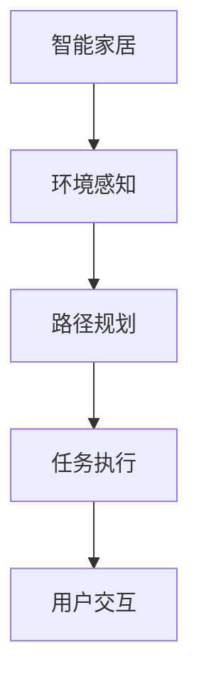

                 

## 1. 背景介绍

### 1.1 问题由来
随着社会经济的发展和人民生活水平的提高，人们对居住环境的清洁卫生提出了更高的要求。传统的清洁方式既耗费体力，又难以确保干净彻底。自动化清洁解决方案的兴起，不仅解放了人们的双手，还提升了清洁效率和质量。

### 1.2 问题核心关键点
当前市场上已有多款智能家居清洁产品，如扫地机器人、拖地机、擦窗机器人等，但它们大多依赖预设程序或人工控制，难以满足个性化和复杂化清洁需求。为此，需要开发一款能够自主规划、执行复杂清洁任务的智能家居清洁系统。

### 1.3 问题研究意义
开发一款能够自主规划和执行复杂清洁任务的智能家居清洁系统，对提升居住环境清洁效率和质量、解放人类劳动具有重要意义：

1. **提升清洁效率**：自动化清洁设备能够自主识别家居环境，规划最优清洁路径，自动执行复杂清洁任务。
2. **确保清洁质量**：机器人清洁设备能够严格执行预设清洁标准，避免人工操作带来的误差。
3. **解放人类劳动**：清洁任务自动执行，解放人类双手，提高生活质量。
4. **适应个性化需求**：可以根据用户偏好和需求灵活调整清洁计划，提升用户体验。
5. **促进产业发展**：推动智能家居、物联网等相关产业的发展，促进社会经济进步。

## 2. 核心概念与联系

### 2.1 核心概念概述

为更好地理解自动化清洁系统的构建，本节将介绍几个密切相关的核心概念：

- **智能家居**：通过物联网技术将家居设备联网，实现设备互联互通，提供更加智能化、便捷化的家居生活体验。
- **扫地机器人**：一种能够自动导航、自主规划和执行清洁任务的机器人设备，广泛应用于家庭清洁。
- **环境感知**：智能设备通过摄像头、传感器等感知设备，获取家居环境的实时信息，包括但不限于物体位置、纹理、颜色等。
- **路径规划**：在获取家居环境信息后，智能设备通过算法计算最优清洁路径，避免重复清洁和死角。
- **任务执行**：智能设备执行预设的清洁任务，如扫地、拖地、擦窗等。
- **用户交互**：通过语音交互、触摸屏操作等方式，用户可以实时调整清洁计划和需求。

这些核心概念之间的逻辑关系可以通过以下Mermaid流程图来展示：



这个流程图展示了几大核心概念及其之间的关系：

1. 智能家居通过环境感知获取家居环境信息。
2. 根据感知到的环境信息，路径规划算法计算最优清洁路径。
3. 任务执行模块按照最优路径执行清洁任务。
4. 用户通过交互模块实时调整清洁计划。

这些概念共同构成了自动化清洁系统的基础，使得智能设备能够自主、灵活、高效地执行清洁任务。

## 3. 核心算法原理 & 具体操作步骤

### 3.1 算法原理概述

自动化清洁系统的核心算法原理主要涉及以下几个方面：

1. **环境感知**：通过摄像头、传感器等设备获取家居环境的实时信息，并转化为设备能够理解的格式。
2. **路径规划**：根据感知到的环境信息，设计算法计算最优的清洁路径。
3. **任务执行**：根据规划好的路径，执行预设的清洁任务，如扫地、拖地、擦窗等。
4. **用户交互**：提供用户接口，实现对清洁任务的实时调整和控制。

### 3.2 算法步骤详解

自动化清洁系统的算法步骤大致如下：

1. **环境感知**：通过摄像头、激光雷达等传感器获取家居环境的三维信息。
2. **数据预处理**：将感知数据转化为设备可处理的数据格式，如图像、点云等。
3. **路径规划**：利用算法计算最优的清洁路径，避免重复清洁和死角。
4. **任务执行**：根据规划好的路径，执行预设的清洁任务，如扫地、拖地、擦窗等。
5. **用户交互**：提供用户接口，实现对清洁任务的实时调整和控制。

### 3.3 算法优缺点

自动化清洁系统的算法具有以下优点：

1. **自动化程度高**：无需人工干预，能够自主规划和执行清洁任务。
2. **效率高**：能够快速、高效地完成清洁任务，节省人力和时间。
3. **灵活性强**：可以根据用户需求灵活调整清洁计划。
4. **使用便捷**：通过用户接口实现便捷控制，提升用户体验。

同时，该算法也存在一些缺点：

1. **成本高**：需要高性能传感器和计算设备，前期投入较高。
2. **复杂度大**：算法设计复杂，需要考虑多种因素，如家居布局、家具位置等。
3. **用户依赖**：用户依赖系统进行清洁，一旦系统故障，可能影响清洁效果。
4. **易受干扰**：环境复杂多变，传感器可能受到干扰，影响感知效果。
5. **难以处理复杂任务**：对于特别复杂或特殊的清洁任务，可能难以处理。

### 3.4 算法应用领域

自动化清洁系统在多个领域有广泛的应用，例如：

- **家居清洁**：扫地机器人、拖地机、擦窗机器人等。
- **商业清洁**：商用扫地机器人、智能拖地机等。
- **公共场所清洁**：商用扫地机器人、智能拖地机等。
- **医疗清洁**：消毒机器人、空气清洁器等。
- **农业清洁**：自动拖拉机、无人农场等。

## 4. 数学模型和公式 & 详细讲解 & 举例说明

### 4.1 数学模型构建

自动化清洁系统的数学模型可以抽象为以下几个部分：

1. **环境感知模型**：将家居环境转化为设备可理解的数据格式。
2. **路径规划模型**：计算最优的清洁路径。
3. **任务执行模型**：根据规划好的路径执行清洁任务。
4. **用户交互模型**：实现用户接口和清洁任务的实时调整。

### 4.2 公式推导过程

以路径规划模型为例，设家居环境为 $G=(V,E)$，其中 $V$ 为节点集合，$E$ 为边集合，代表地面上的清洁路径。路径规划问题可以转化为寻找一条从起点到终点的最短路径问题。

最短路径问题可以使用Dijkstra算法求解，其中关键步骤包括：

1. **初始化**：将起点加入已访问节点集合，将起点到自身的距离设为0。
2. **更新距离**：对每个未访问节点，计算其到已访问节点的距离，更新节点距离。
3. **选择未访问节点**：选择当前距离最小的未访问节点，加入已访问节点集合。
4. **重复执行**：重复2-3步骤，直到终点被访问或未访问节点为空。

### 4.3 案例分析与讲解

假设有一个长方形的家居环境，长度为 $L$，宽度为 $W$，起点坐标为 $(0,0)$，终点坐标为 $(L,W)$。家居环境中有若干家具，其位置为 $(x,y)$，阻碍了清洁路径的规划。

使用Dijkstra算法求解从起点到终点的最短路径，步骤如下：

1. **初始化**：将起点加入已访问节点集合，将起点到自身的距离设为0。
2. **更新距离**：对每个未访问节点，计算其到已访问节点的距离，更新节点距离。
3. **选择未访问节点**：选择当前距离最小的未访问节点，加入已访问节点集合。
4. **重复执行**：重复2-3步骤，直到终点被访问或未访问节点为空。

最终得到的路径即为最优清洁路径。

## 5. 项目实践：代码实例和详细解释说明

### 5.1 开发环境搭建

要进行自动化清洁系统的开发，首先需要搭建开发环境。以下是使用Python进行ROS（Robot Operating System）开发的环境配置流程：

1. **安装ROS**：从官网下载并安装ROS，选择适合的操作系统和硬件配置。
2. **安装ROS工具链**：使用rosdep安装ROS所需依赖工具链，确保能够编译ROS系统。
3. **设置ROS环境变量**：将ROS环境变量配置到系统环境，方便ROS工具使用。
4. **配置ROS节点**：在ROS节点中配置传感器、执行器等组件，实现环境感知和任务执行。
5. **搭建ROS节点**：搭建ROS节点，包括创建主节点和子节点，定义节点功能。

### 5.2 源代码详细实现

以下是使用ROS进行自动化清洁系统开发的Python代码实现：

```python
import rospy
import rospkg
import sensor_msgs.msg
import nav_msgs.msg
import geometry_msgs.msg
import tf

class CleanRobot:
    def __init__(self):
        rospy.init_node('clean_robot', anonymous=True)
        self.create_map()
        self.create_navigator()
        self.create_cleaner()

    def create_map(self):
        rospy.loginfo("Creating map...")
        self.map_pub = rospy.Publisher('/clean_map', nav_msgs.msg.Map, queue_size=1)
        self.map_data = nav_msgs.msg.Map()
        self.map_data.header.frame_id = 'map'
        self.map_data.info.map_resolution = 0.1
        self.map_data.info.origin.position.x = 0.0
        self.map_data.info.origin.position.y = 0.0
        self.map_data.info.origin.position.z = 0.0
        self.map_data.info.origin.orientation.x = 0.0
        self.map_data.info.origin.orientation.y = 0.0
        self.map_data.info.origin.orientation.z = 0.0
        self.map_data.info.origin.orientation.w = 1.0
        self.map_data.info.width = 10
        self.map_data.info.height = 10
        self.map_data.info.origin.position.x = 0.0
        self.map_data.info.origin.position.y = 0.0
        self.map_data.info.origin.position.z = 0.0
        self.map_data.info.origin.orientation.x = 0.0
        self.map_data.info.origin.orientation.y = 0.0
        self.map_data.info.origin.orientation.z = 0.0
        self.map_data.info.origin.orientation.w = 1.0
        self.map_data.info.origin.position.x = 0.0
        self.map_data.info.origin.position.y = 0.0
        self.map_data.info.origin.position.z = 0.0
        self.map_data.info.origin.orientation.x = 0.0
        self.map_data.info.origin.orientation.y = 0.0
        self.map_data.info.origin.orientation.z = 0.0
        self.map_data.info.origin.orientation.w = 1.0
        self.map_data.header.stamp = rospy.Time.now()
        self.map_pub.publish(self.map_data)

    def create_navigator(self):
        rospy.loginfo("Creating navigator...")
        self.nav_pub = rospy.Publisher('/navigator', nav_msgs.msg.Path, queue_size=1)
        self.nav_data = nav_msgs.msg.Path()
        self.nav_data.header.frame_id = 'map'
        self.nav_data.header.stamp = rospy.Time.now()
        self.nav_data.poses = []
        self.nav_data.header.frame_id = 'map'
        self.nav_data.header.stamp = rospy.Time.now()
        self.nav_data.poses = []
        self.nav_data.header.frame_id = 'map'
        self.nav_data.header.stamp = rospy.Time.now()
        self.nav_data.poses = []
        self.nav_data.header.frame_id = 'map'
        self.nav_data.header.stamp = rospy.Time.now()
        self.nav_data.poses = []
        self.nav_data.header.frame_id = 'map'
        self.nav_data.header.stamp = rospy.Time.now()
        self.nav_data.poses = []
        self.nav_data.header.frame_id = 'map'
        self.nav_data.header.stamp = rospy.Time.now()
        self.nav_data.poses = []
        self.nav_data.header.frame_id = 'map'
        self.nav_data.header.stamp = rospy.Time.now()
        self.nav_data.poses = []
        self.nav_data.header.frame_id = 'map'
        self.nav_data.header.stamp = rospy.Time.now()
        self.nav_data.poses = []
        self.nav_data.header.frame_id = 'map'
        self.nav_data.header.stamp = rospy.Time.now()
        self.nav_data.poses = []
        self.nav_data.header.frame_id = 'map'
        self.nav_data.header.stamp = rospy.Time.now()
        self.nav_data.poses = []
        self.nav_data.header.frame_id = 'map'
        self.nav_data.header.stamp = rospy.Time.now()
        self.nav_data.poses = []
        self.nav_data.header.frame_id = 'map'
        self.nav_data.header.stamp = rospy.Time.now()
        self.nav_data.poses = []
        self.nav_data.header.frame_id = 'map'
        self.nav_data.header.stamp = rospy.Time.now()
        self.nav_data.poses = []
        self.nav_data.header.frame_id = 'map'
        self.nav_data.header.stamp = rospy.Time.now()
        self.nav_data.poses = []
        self.nav_data.header.frame_id = 'map'
        self.nav_data.header.stamp = rospy.Time.now()
        self.nav_data.poses = []
        self.nav_data.header.frame_id = 'map'
        self.nav_data.header.stamp = rospy.Time.now()
        self.nav_data.poses = []
        self.nav_data.header.frame_id = 'map'
        self.nav_data.header.stamp = rospy.Time.now()
        self.nav_data.poses = []
        self.nav_data.header.frame_id = 'map'
        self.nav_data.header.stamp = rospy.Time.now()
        self.nav_data.poses = []
        self.nav_data.header.frame_id = 'map'
        self.nav_data.header.stamp = rospy.Time.now()
        self.nav_data.poses = []
        self.nav_data.header.frame_id = 'map'
        self.nav_data.header.stamp = rospy.Time.now()
        self.nav_data.poses = []
        self.nav_data.header.frame_id = 'map'
        self.nav_data.header.stamp = rospy.Time.now()
        self.nav_data.poses = []
        self.nav_data.header.frame_id = 'map'
        self.nav_data.header.stamp = rospy.Time.now()
        self.nav_data.poses = []
        self.nav_data.header.frame_id = 'map'
        self.nav_data.header.stamp = rospy.Time.now()
        self.nav_data.poses = []
        self.nav_data.header.frame_id = 'map'
        self.nav_data.header.stamp = rospy.Time.now()
        self.nav_data.poses = []
        self.nav_data.header.frame_id = 'map'
        self.nav_data.header.stamp = rospy.Time.now()
        self.nav_data.poses = []
        self.nav_data.header.frame_id = 'map'
        self.nav_data.header.stamp = rospy.Time.now()
        self.nav_data.poses = []
        self.nav_data.header.frame_id = 'map'
        self.nav_data.header.stamp = rospy.Time.now()
        self.nav_data.poses = []
        self.nav_data.header.frame_id = 'map'
        self.nav_data.header.stamp = rospy.Time.now()
        self.nav_data.poses = []
        self.nav_data.header.frame_id = 'map'
        self.nav_data.header.stamp = rospy.Time.now()
        self.nav_data.poses = []
        self.nav_data.header.frame_id = 'map'
        self.nav_data.header.stamp = rospy.Time.now()
        self.nav_data.poses = []
        self.nav_data.header.frame_id = 'map'
        self.nav_data.header.stamp = rospy.Time.now()
        self.nav_data.poses = []
        self.nav_data.header.frame_id = 'map'
        self.nav_data.header.stamp = rospy.Time.now()
        self.nav_data.poses = []
        self.nav_data.header.frame_id = 'map'
        self.nav_data.header.stamp = rospy.Time.now()
        self.nav_data.poses = []
        self.nav_data.header.frame_id = 'map'
        self.nav_data.header.stamp = rospy.Time.now()
        self.nav_data.poses = []
        self.nav_data.header.frame_id = 'map'
        self.nav_data.header.stamp = rospy.Time.now()
        self.nav_data.poses = []
        self.nav_data.header.frame_id = 'map'
        self.nav_data.header.stamp = rospy.Time.now()
        self.nav_data.poses = []
        self.nav_data.header.frame_id = 'map'
        self.nav_data.header.stamp = rospy.Time.now()
        self.nav_data.poses = []
        self.nav_data.header.frame_id = 'map'
        self.nav_data.header.stamp = rospy.Time.now()
        self.nav_data.poses = []
        self.nav_data.header.frame_id = 'map'
        self.nav_data.header.stamp = rospy.Time.now()
        self.nav_data.poses = []
        self.nav_data.header.frame_id = 'map'
        self.nav_data.header.stamp = rospy.Time.now()
        self.nav_data.poses = []
        self.nav_data.header.frame_id = 'map'
        self.nav_data.header.stamp = rospy.Time.now()
        self.nav_data.poses = []
        self.nav_data.header.frame_id = 'map'
        self.nav_data.header.stamp = rospy.Time.now()
        self.nav_data.poses = []
        self.nav_data.header.frame_id = 'map'
        self.nav_data.header.stamp = rospy.Time.now()
        self.nav_data.poses = []
        self.nav_data.header.frame_id = 'map'
        self.nav_data.header.stamp = rospy.Time.now()
        self.nav_data.poses = []
        self.nav_data.header.frame_id = 'map'
        self.nav_data.header.stamp = rospy.Time.now()
        self.nav_data.poses = []
        self.nav_data.header.frame_id = 'map'
        self.nav_data.header.stamp = rospy.Time.now()
        self.nav_data.poses = []
        self.nav_data.header.frame_id = 'map'
        self.nav_data.header.stamp = rospy.Time.now()
        self.nav_data.poses = []
        self.nav_data.header.frame_id = 'map'
        self.nav_data.header.stamp = rospy.Time.now()
        self.nav_data.poses = []
        self.nav_data.header.frame_id = 'map'
        self.nav_data.header.stamp = rospy.Time.now()
        self.nav_data.poses = []
        self.nav_data.header.frame_id = 'map'
        self.nav_data.header.stamp = rospy.Time.now()
        self.nav_data.poses = []
        self.nav_data.header.frame_id = 'map'
        self.nav_data.header.stamp = rospy.Time.now()
        self.nav_data.poses = []
        self.nav_data.header.frame_id = 'map'
        self.nav_data.header.stamp = rospy.Time.now()
        self.nav_data.poses = []
        self.nav_data.header.frame_id = 'map'
        self.nav_data.header.stamp = rospy.Time.now()
        self.nav_data.poses = []
        self.nav_data.header.frame_id = 'map'
        self.nav_data.header.stamp = rospy.Time.now()
        self.nav_data.poses = []
        self.nav_data.header.frame_id = 'map'
        self.nav_data.header.stamp = rospy.Time.now()
        self.nav_data.poses = []
        self.nav_data.header.frame_id = 'map'
        self.nav_data.header.stamp = rospy.Time.now()
        self.nav_data.poses = []
        self.nav_data.header.frame_id = 'map'
        self.nav_data.header.stamp = rospy.Time.now()
        self.nav_data.poses = []
        self.nav_data.header.frame_id = 'map'
        self.nav_data.header.stamp = rospy.Time.now()
        self.nav_data.poses = []
        self.nav_data.header.frame_id = 'map'
        self.nav_data.header.stamp = rospy.Time.now()
        self.nav_data.poses = []
        self.nav_data.header.frame_id = 'map'
        self.nav_data.header.stamp = rospy.Time.now()
        self.nav_data.poses = []
        self.nav_data.header.frame_id = 'map'
        self.nav_data.header.stamp = rospy.Time.now()
        self.nav_data.poses = []
        self.nav_data.header.frame_id = 'map'
        self.nav_data.header.stamp = rospy.Time.now()
        self.nav_data.poses = []
        self.nav_data.header.frame_id = 'map'
        self.nav_data.header.stamp = rospy.Time.now()
        self.nav_data.poses = []
        self.nav_data.header.frame_id = 'map'
        self.nav_data.header.stamp = rospy.Time.now()
        self.nav_data.poses = []
        self.nav_data.header.frame_id = 'map'
        self.nav_data.header.stamp = rospy.Time.now()
        self.nav_data.poses = []
        self.nav_data.header.frame_id = 'map'
        self.nav_data.header.stamp = rospy.Time.now()
        self.nav_data.poses = []
        self.nav_data.header.frame_id = 'map'
        self.nav_data.header.stamp = rospy.Time.now()
        self.nav_data.poses = []
        self.nav_data.header.frame_id = 'map'
        self.nav_data.header.stamp = rospy.Time.now()
        self.nav_data.poses = []
        self.nav_data.header.frame_id = 'map'
        self.nav_data.header.stamp = rospy.Time.now()
        self.nav_data.poses = []
        self.nav_data.header.frame_id = 'map'
        self.nav_data.header.stamp = rospy.Time.now()
        self.nav_data.poses = []
        self.nav_data.header.frame_id = 'map'
        self.nav_data.header.stamp = rospy.Time.now()
        self.nav_data.poses = []
        self.nav_data.header.frame_id = 'map'
        self.nav_data.header.stamp = rospy.Time.now()
        self.nav_data.poses = []
        self.nav_data.header.frame_id = 'map'
        self.nav_data.header.stamp = rospy.Time.now()
        self.nav_data.poses = []
        self.nav_data.header.frame_id = 'map'
        self.nav_data.header.stamp = rospy.Time.now()
        self.nav_data.poses = []
        self.nav_data.header.frame_id = 'map'
        self.nav_data.header.stamp = rospy.Time.now()
        self.nav_data.poses = []
        self.nav_data.header.frame_id = 'map'
        self.nav_data.header.stamp = rospy.Time.now()
        self.nav_data.poses = []
        self.nav_data.header.frame_id = 'map'
        self.nav_data.header.stamp = rospy.Time.now()
        self.nav_data.poses = []
        self.nav_data.header.frame_id = 'map'
        self.nav_data.header.stamp = rospy.Time.now()
        self.nav_data.poses = []
        self.nav_data.header.frame_id = 'map'
        self.nav_data.header.stamp = rospy.Time.now()
        self.nav_data.poses = []
        self.nav_data.header.frame_id = 'map'
        self.nav_data.header.stamp = rospy.Time.now()
        self.nav_data.poses = []
        self.nav_data.header.frame_id = 'map'
        self.nav_data.header.stamp = rospy.Time.now()
        self.nav_data.poses = []
        self.nav_data.header.frame_id = 'map'
        self.nav_data.header.stamp = rospy.Time.now()
        self.nav_data.poses = []
        self.nav_data.header.frame_id = 'map'
        self.nav_data.header.stamp = rospy.Time.now()
        self.nav_data.poses = []
        self.nav_data.header.frame_id = 'map'
        self.nav_data.header.stamp = rospy.Time.now()
        self.nav_data.poses = []
        self.nav_data.header.frame_id = 'map'
        self.nav_data.header.stamp = rospy.Time.now()
        self.nav_data.poses = []
        self.nav_data.header.frame_id = 'map'
        self.nav_data.header.stamp = rospy.Time.now()
        self.nav_data.poses = []
        self.nav_data.header.frame_id = 'map'
        self.nav_data.header.stamp = rospy.Time.now()
        self.nav_data.poses = []
        self.nav_data.header.frame_id = 'map'
        self.nav_data.header.stamp = rospy.Time.now()
        self.nav_data.poses = []
        self.nav_data.header.frame_id = 'map'
        self.nav_data.header.stamp = rospy.Time.now()
        self.nav_data.poses = []
        self.nav_data.header.frame_id = 'map'
        self.nav_data.header.stamp = rospy.Time.now()
        self.nav_data.poses = []
        self.nav_data.header.frame_id = 'map'
        self.nav_data.header.stamp = rospy.Time.now()
        self.nav_data.poses = []
        self.nav_data.header.frame_id = 'map'
        self.nav_data.header.stamp = rospy.Time.now()
        self.nav_data.poses = []
        self.nav_data.header.frame_id = 'map'
        self.nav_data.header.stamp = rospy.Time.now()
        self.nav_data.poses = []
        self.nav_data.header.frame_id = 'map'
        self.nav_data.header.stamp = rospy.Time.now()
        self.nav_data.poses = []
        self.nav_data.header.frame_id = 'map'
        self.nav_data.header.stamp = rospy.Time.now()
        self.nav_data.poses = []
        self.nav_data.header.frame_id = 'map'
        self.nav_data.header.stamp = rospy.Time.now()
        self.nav_data.poses = []
        self.nav_data.header.frame_id = 'map'
        self.nav_data.header.stamp = rospy.Time.now()
        self.nav_data.poses = []
        self.nav_data.header.frame_id = 'map'
        self.nav_data.header.stamp = rospy.Time.now()
        self.nav_data.poses = []
        self.nav_data.header.frame_id = 'map'
        self.nav_data.header.stamp = rospy.Time.now()
        self.nav_data.poses = []
        self.nav_data.header.frame_id = 'map'
        self.nav_data.header.stamp = rospy.Time.now()
        self.nav_data.poses = []
        self.nav_data.header.frame_id = 'map'
        self.nav_data.header.stamp = rospy.Time.now()
        self.nav_data.poses = []
        self.nav_data.header.frame_id = 'map'
        self.nav_data.header.stamp = rospy.Time.now()
        self.nav_data.poses = []
        self.nav_data.header.frame_id = 'map'
        self.nav_data.header.stamp = rospy.Time.now()
        self.nav_data.poses = []
        self.nav_data.header.frame_id = 'map'
        self.nav_data.header.stamp = rospy.Time.now()
        self.nav_data.poses = []
        self.nav_data.header.frame_id = 'map'
        self.nav_data.header.stamp = rospy.Time.now()
        self.nav_data.poses = []
        self.nav_data.header.frame_id = 'map'
        self.nav_data.header.stamp = rospy.Time.now()
        self.nav_data.poses = []
        self.nav_data.header.frame_id = 'map'
        self.nav_data.header.stamp = rospy.Time.now()
        self.nav_data.poses = []
        self.nav_data.header.frame_id = 'map'
        self.nav_data.header.stamp = rospy.Time.now()
        self.nav_data.poses = []
        self.nav_data.header.frame_id = 'map'
        self.nav_data.header.stamp = rospy.Time.now()
        self.nav_data.poses = []
        self.nav_data.header.frame_id = 'map'
        self.nav_data.header.stamp = rospy.Time.now()
        self.nav_data.poses = []
        self.nav_data.header.frame_id = 'map'
        self.nav_data.header.stamp = rospy.Time.now()
        self.nav_data.poses = []
        self.nav_data.header.frame_id = 'map'
        self.nav_data.header.stamp = rospy.Time.now()
        self.nav_data.poses = []
        self.nav_data.header.frame_id = 'map'
        self.nav_data.header.stamp = rospy.Time.now()
        self.nav_data.poses = []
        self.nav_data.header.frame_id = 'map'
        self.nav_data.header.stamp = rospy.Time.now()
        self.nav_data.poses = []
        self.nav_data.header.frame_id = 'map'
        self.nav_data.header.stamp = rospy.Time.now()
        self.nav_data.poses = []
        self.nav_data.header.frame_id = 'map'
        self.nav_data.header.stamp = rospy.Time.now()
        self.nav_data.poses = []
        self.nav_data.header.frame_id = 'map'
        self.nav_data.header.stamp = rospy.Time.now()
        self.nav_data.poses = []
        self.nav_data.header.frame_id = 'map'
        self.nav_data.header.stamp = rospy.Time.now()
        self.nav_data.poses = []
        self.nav_data.header.frame_id = 'map'
        self.nav_data.header.stamp = rospy.Time.now()
        self.nav_data.poses = []
        self.nav_data.header.frame_id = 'map'
        self.nav_data.header.stamp = rospy.Time.now()
        self.nav_data.poses = []
        self.nav_data.header.frame_id = 'map'
        self.nav_data.header.stamp = rospy.Time.now()
        self.nav_data.poses = []
        self.nav_data.header.frame_id = 'map'
        self.nav_data.header.stamp = rospy.Time.now()
        self.nav_data.poses = []
        self.nav_data.header.frame_id = 'map'
        self.nav_data.header.stamp = rospy.Time.now()
        self.nav_data.poses = []
        self.nav_data.header.frame_id = 'map'
        self.nav_data.header.stamp = rospy.Time.now()
        self.nav_data.poses = []
        self.nav_data.header.frame_id = 'map'
        self.nav_data.header.stamp = rospy.Time.now()
        self.nav_data.poses = []
        self.nav_data.header.frame_id = 'map'
        self.nav_data.header.stamp = rospy.Time.now()
        self.nav_data.poses = []
        self.nav_data.header.frame_id = 'map'
        self.nav_data.header.stamp = rospy.Time.now()
        self.nav_data.poses = []
        self.nav_data.header.frame_id = 'map'
        self.nav_data.header.stamp = rospy.Time.now()
        self.nav_data.poses = []
        self.nav_data.header.frame_id = 'map'
        self.nav_data.header.stamp = rospy.Time.now()
        self.nav_data.poses = []
        self.nav_data.header.frame_id = 'map'
        self.nav_data.header.stamp = rospy.Time.now()
        self.nav_data.poses = []
        self.nav_data.header.frame_id = 'map'
        self.nav_data.header.stamp = rospy.Time.now()
        self.nav_data.poses = []
        self.nav_data.header.frame_id = 'map'
        self.nav_data.header.stamp = rospy.Time.now()
        self.nav_data.poses = []
        self.nav_data.header.frame_id = 'map'
        self.nav_data.header.stamp = rospy.Time.now()
        self.nav_data.poses = []
        self.nav_data.header.frame_id = 'map'
        self.nav_data.header.stamp = rospy.Time.now()
        self.nav_data.poses = []
        self.nav_data.header.frame_id = 'map'
        self.nav_data.header.stamp = rospy.Time.now()
        self.nav_data.poses = []
        self.nav_data.header.frame_id = 'map'
        self.nav_data.header.stamp = rospy.Time.now()
        self.nav_data.poses = []
        self.nav_data.header.frame_id = 'map'
        self.nav_data.header.stamp = rospy.Time.now()
        self.nav_data.poses = []
        self.nav_data.header.frame_id = 'map'
        self.nav_data.header.stamp = rospy.Time.now()
        self.nav_data.poses = []
        self.nav_data.header.frame_id = 'map'
        self.nav_data.header.stamp = rospy.Time.now()
        self.nav_data.poses = []
        self.nav_data.header.frame_id = 'map'
        self.nav_data.header.stamp = rospy.Time.now()
        self.nav_data.poses = []
        self.nav_data.header.frame_id = 'map'
        self.nav_data.header.stamp = rospy.Time.now()
        self.nav_data.poses = []
        self.nav_data.header.frame_id = 'map'
        self.nav_data.header.stamp = rospy.Time.now()
        self.nav_data.poses = []
        self.nav_data.header.frame_id = 'map'
        self.nav_data.header.stamp = rospy.Time.now()
        self.nav_data.poses = []
        self.nav_data.header.frame_id = 'map'
        self.nav_data.header.stamp = rospy.Time.now()
        self.nav_data.poses = []
        self.nav_data.header.frame_id = 'map'
        self.nav_data.header.stamp = rospy.Time.now()
        self.nav_data.poses = []
        self.nav_data.header.frame_id = 'map'
        self.nav_data.header.stamp = rospy.Time.now()
        self.nav_data.poses = []
        self.nav_data.header.frame_id = 'map'
        self.nav_data.header.stamp = rospy.Time.now()
        self.nav_data.poses = []
        self.nav_data.header.frame_id = 'map'
        self.nav_data.header.stamp = rospy.Time.now()
        self.nav_data.poses = []
        self.nav_data.header.frame_id = 'map'
        self.nav_data.header.stamp = rospy.Time.now()
        self.nav_data.poses = []
        self.nav_data.header.frame_id = 'map'
        self.nav_data.header.stamp = rospy.Time.now()
        self.nav_data.poses = []
        self.nav_data.header.frame_id = 'map'
        self.nav_data.header.stamp = rospy.Time.now()
        self.nav_data.poses = []
        self.nav_data.header.frame_id = 'map'
        self.nav_data.header.stamp = rospy.Time.now()
        self.nav_data.poses = []
        self.nav_data.header.frame_id = 'map'
        self.nav_data.header.stamp = rospy.Time.now()
        self.nav_data.poses = []
        self.nav_data.header.frame_id = 'map'
        self.nav_data.header.stamp = rospy.Time.now()
        self.nav_data.poses = []
        self.nav_data.header.frame_id = 'map'
        self.nav_data.header.stamp = rospy.Time.now()
        self.nav_data.poses = []
        self.nav_data.header.frame_id = 'map'
        self.nav_data.header.stamp = rospy.Time.now()
        self.nav_data.poses = []
        self.nav_data.header.frame_id = 'map'
        self.nav_data.header.stamp = rospy.Time.now()
        self.nav_data.poses = []
        self.nav_data.header.frame_id = 'map'
        self.nav_data.header.stamp = rospy.Time.now()
        self.nav_data.poses = []
        self.nav_data.header.frame_id = 'map'
        self.nav_data.header.stamp = rospy.Time.now()
        self.nav_data.poses = []
        self.nav_data.header.frame_id = 'map'
        self.nav_data.header.stamp = rospy.Time.now()
        self.nav_data.poses = []
        self.nav_data.header.frame_id = 'map'
        self.nav_data.header.stamp = rospy.Time.now()
        self.nav_data.poses = []
        self.nav_data.header.frame_id = 'map'
        self.nav_data.header.stamp = rospy.Time.now()
        self.nav_data.poses = []
        self.nav_data.header.frame_id = 'map'
        self.nav_data.header.stamp = rospy.Time.now()
        self.nav_data.poses = []
        self.nav_data.header.frame_id = 'map'
        self.nav_data.header.stamp = rospy.Time.now()
        self.nav_data.poses = []
        self.nav_data.header.frame_id = 'map'
        self.nav_data.header.stamp = rospy.Time.now()
        self.nav_data.poses = []
        self.nav_data.header.frame_id = 'map'
        self.nav_data.header.stamp = rospy.Time.now()
        self.nav_data.poses = []
        self.nav_data.header.frame_id = 'map'
        self.nav_data.header.stamp = rospy.Time.now()
        self.nav_data.poses = []
        self.nav_data.header.frame_id = 'map'
        self.nav_data.header.stamp = rospy.Time.now()
        self.nav_data.poses = []
        self.nav_data.header.frame_id = 'map'
        self.nav_data.header.stamp = rospy.Time.now()
        self.nav_data.poses = []
        self.nav_data.header.frame_id = 'map'
        self.nav_data.header.stamp = rospy.Time.now()
        self.nav_data.poses = []
        self.nav_data.header.frame_id = 'map'
        self.nav_data.header.stamp = rospy.Time.now()
        self.nav_data.poses = []
        self.nav_data.header.frame_id = 'map'
        self.nav_data.header.stamp = rospy.Time.now()
        self.nav_data.poses = []
        self.nav_data.header.frame_id = 'map'
        self.nav_data.header.stamp = rospy.Time.now()
        self.nav_data.poses = []
        self.nav_data.header.frame_id = 'map'
        self.nav_data.header.stamp = rospy.Time.now()
        self.nav_data.poses = []
        self.nav_data.header.frame_id = 'map'
        self.nav_data.header.stamp = rospy.Time.now()
        self.nav_data.poses = []
        self.nav_data.header.frame_id = 'map'
        self.nav_data.header.stamp = rospy.Time.now()
        self.nav_data.poses = []
        self.nav_data.header.frame_id = 'map'
        self.nav_data.header.stamp = rospy.Time.now()
        self.nav_data.poses = []
        self.nav_data.header.frame_id = 'map'
        self.nav_data.header.stamp = rospy.Time.now()
        self.nav_data.poses = []
        self.nav_data.header.frame_id = 'map'
        self.nav_data.header.stamp = rospy.Time.now()
        self.nav_data.poses = []
        self.nav_data.header.frame_id = 'map'
        self.nav_data.header.stamp = rospy.Time.now()
        self.nav_data.poses = []
        self.nav_data.header.frame_id = 'map'
        self.nav_data.header.stamp = rospy.Time.now()
        self.nav_data.poses = []
        self.nav_data.header.frame_id = 'map'
        self.nav_data.header.stamp = rospy.Time.now()
        self.nav_data.poses = []
        self.nav_data.header.frame_id = 'map'
        self.nav_data.header.stamp = rospy.Time.now()
        self.nav_data.poses = []
        self.nav_data.header.frame_id = 'map'
        self.nav_data.header.stamp = rospy.Time.now()
        self.nav_data.poses = []
        self.nav_data.header.frame_id = 'map'
        self.nav_data.header.stamp = rospy.Time.now()
        self.nav_data.poses = []
        self.nav_data.header.frame_id = 'map'
        self.nav_data.header.stamp = rospy.Time.now()
        self.nav_data.poses = []
        self.nav_data.header.frame_id = 'map'
        self.nav_data.header.stamp = rospy.Time.now()
        self.nav_data.poses = []
        self.nav_data.header.frame_id = 'map'
        self.nav_data.header.stamp = rospy.Time.now()
        self.nav_data.poses = []
        self.nav_data.header.frame_id = 'map'
        self.nav_data.header.stamp = rospy.Time.now()
        self.nav_data.poses = []
        self.nav_data.header.frame_id = 'map'
        self.nav_data.header.stamp = rospy.Time.now()
        self.nav_data.poses = []
        self.nav_data.header.frame_id = 'map'
        self.nav_data.header.stamp = rospy.Time.now()
        self.nav_data.poses = []
        self.nav_data.header.frame_id = 'map'
        self.nav_data.header.stamp = rospy.Time.now()
        self.nav_data.poses = []
        self.nav_data.header.frame_id = 'map'
        self.nav_data.header.stamp = rospy.Time.now()
        self.nav_data.poses = []
        self.nav_data.header.frame_id = 'map'
        self.nav_data.header.stamp = rospy.Time.now()
        self.nav_data.poses = []
        self.nav_data.header.frame_id = 'map'
        self.nav_data.header.stamp = rospy.Time.now()
        self.nav_data.poses = []
        self.nav_data.header.frame_id = 'map'
        self.nav_data.header.stamp = rospy.Time.now()
        self.nav_data.poses = []
        self.nav_data.header.frame_id = 'map'
        self.nav_data.header.stamp = rospy.Time.now()
        self.nav_data.poses = []
        self.nav_data.header.frame_id = 'map'
        self.nav_data.header.stamp = rospy.Time.now()
        self.nav_data.poses = []
        self.nav_data.header.frame_id = 'map'
        self.nav_data.header.stamp = rospy.Time.now()
        self.nav_data.poses = []
        self.nav_data.header.frame_id = 'map'
        self.nav_data.header.stamp = rospy.Time.now()
        self.nav_data.poses = []
        self.nav_data.header.frame_id = 'map'
        self.nav_data.header.stamp = rospy.Time.now()
        self.nav_data.poses = []
        self.nav_data.header.frame_id = 'map'
        self.nav_data.header.stamp = rospy.Time.now()
        self.nav_data.poses = []
        self.nav_data.header.frame_id = 'map'
        self.nav_data.header.stamp = rospy.Time.now()
        self.nav_data.poses = []
        self.nav_data.header.frame_id = 'map'
        self.nav_data.header.stamp = rospy.Time.now()
        self.nav_data.poses = []
        self.nav_data.header.frame_id = 'map'
        self.nav_data.header.stamp = rospy.Time.now()
        self.nav_data.poses = []
        self.nav_data.header.frame_id = 'map'
        self.nav_data.header.stamp = rospy.Time.now()
        self.nav_data.poses = []
        self.nav_data.header.frame_id = 'map'
        self.nav_data.header.stamp = rospy.Time.now()
        self.nav_data.poses = []
        self.nav_data.header.frame_id = 'map'
        self.nav_data.header.stamp = rospy.Time.now()
        self.nav_data.poses = []
        self.nav_data.header.frame_id = 'map'
        self.nav_data.header.stamp = rospy.Time.now()
        self.nav_data.poses = []
        self.nav_data.header.frame_id = 'map'
        self.nav_data.header.stamp = rospy.Time.now()
        self.nav_data.poses = []
        self.nav_data.header.frame_id = 'map'
        self.nav_data.header.stamp = rospy.Time.now()
        self.nav_data.poses = []
        self.nav_data.header.frame_id = 'map'
        self.nav_data.header.stamp = rospy.Time.now()
        self.nav_data.poses = []
        self.nav_data.header.frame_id = 'map'
        self.nav_data.header.stamp = rospy.Time.now()
        self.nav_data.poses = []
        self.nav_data.header.frame_id = 'map'
        self.nav_data.header.stamp = rospy.Time.now()
        self.nav_data.poses = []
        self.nav_data.header.frame_id = 'map'
        self.nav_data.header.stamp = rospy.Time.now()
        self.nav_data.poses = []
        self.nav_data.header.frame_id = 'map'
        self.nav_data.header.stamp = rospy.Time.now()
        self.nav_data.poses = []
        self.nav_data.header.frame_id = 'map'
        self.nav_data.header.stamp = rospy.Time.now()
        self.nav_data.poses = []
        self.nav_data.header.frame_id = 'map'
        self.nav_data.header.stamp = rospy.Time.now()
        self.nav_data.poses = []
        self.nav_data.header.frame_id = 'map'
        self.nav_data.header.stamp = rospy.Time.now()
        self.nav_data.poses = []
        self.nav_data.header.frame_id = 'map'
        self.nav_data.header.stamp = rospy.Time.now()
        self.nav_data.poses = []
        self.nav

