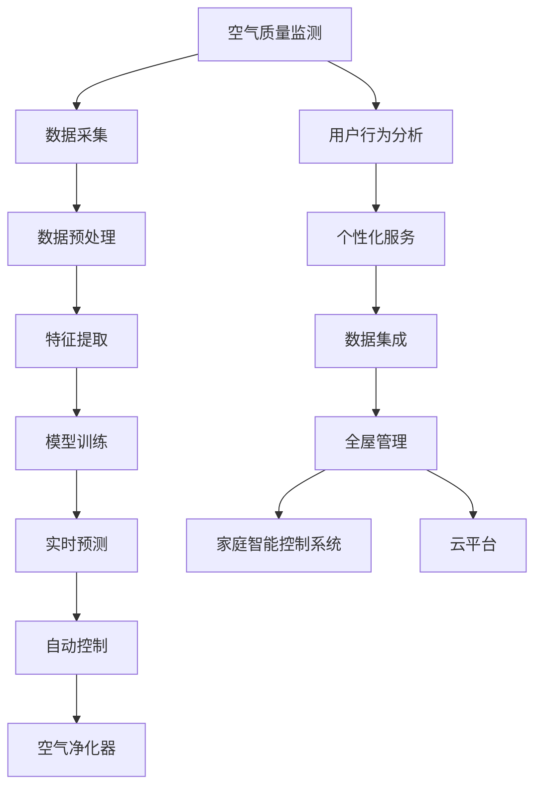

                 

## 1. 背景介绍

在飞速发展的现代生活中，人们的居住环境面临着诸多健康威胁，其中室内空气污染问题尤为严重。例如，有害气体、粉尘、细菌等污染物会持续影响人类健康，增加患病风险。据统计，80%的人类时间在室内度过，因此改善室内空气质量，提高生活质量至关重要。然而，传统的空气净化方法存在诸多局限，如依赖人工监控、效率低下、成本高等问题，无法满足人们日益增长的健康需求。

### 1.1 问题由来

当前，智能家居市场竞争日益激烈，各大企业纷纷布局空气净化业务。在技术驱动下，如何高效、实时、精准地进行全屋空气质量管理，成为各大公司争相探索的方向。以智能算法为基础的空气质量监测与控制系统，不仅可以提高空气质量监测的实时性、准确性，还能通过智能化手段优化治理方案，降低人工干预成本，从而更好地提升室内空气质量。

### 1.2 问题核心关键点

智能家居空气净化创业的核心在于：
- 通过传感器网络实时监测室内空气质量。
- 使用人工智能算法分析数据，实现精准定位污染源。
- 根据分析结果自动调整净化器，实时改善室内空气质量。
- 通过用户行为分析，智能预测和优化净化方案，实现个性化服务。
- 与家庭智能控制系统集成，实现全屋管理。

## 2. 核心概念与联系

### 2.1 核心概念概述

以下概念将贯穿全文的理论基础：

- **空气质量监测**：通过传感器网络实时采集室内空气中的有害气体、PM2.5、CO2等关键指标，作为分析依据。
- **AI算法**：利用机器学习、深度学习等算法，对采集到的数据进行分析和预测。
- **空气净化器**：根据算法输出结果，自动控制空气净化器的工作状态，实现空气净化。
- **家庭智能控制系统**：将空气净化与家居其他智能设备如灯光、窗帘等集成，实现全屋协同管理。
- **用户行为分析**：通过学习用户行为和偏好，优化净化策略，实现个性化服务。
- **云平台**：处理大规模数据，实现数据存储、分析、服务部署等功能。

这些概念之间的逻辑关系可以通过以下Mermaid流程图展示：



这个流程图展示了从空气质量监测到全屋管理的主要步骤，每个节点代表一个关键功能模块，以及它们之间的联系和数据流动。

## 3. 核心算法原理 & 具体操作步骤

### 3.1 算法原理概述

本节将详细介绍基于深度学习算法的全屋空气质量管理系统的核心原理。

空气质量管理主要分为两个阶段：数据监测和空气净化。数据监测通过传感器网络实时采集室内空气质量数据；空气净化通过AI算法分析污染源和污染物浓度，自动调整空气净化器的工作状态。

### 3.2 算法步骤详解

#### 3.2.1 数据采集与预处理

**步骤1: 数据采集**
- 安装多种传感器，实时采集室内空气中的有害气体、PM2.5、CO2等关键指标。
- 使用多种类型传感器，例如：

```
- CO2传感器：测量空气中的CO2浓度。
- PM2.5传感器：检测空气中的PM2.5浓度。
- 有害气体传感器：检测空气中的有害物质如甲醛、苯等。
```

**步骤2: 数据预处理**
- 对传感器数据进行滤波、校准、归一化等预处理步骤。
- 使用传感器融合技术，结合多种传感器数据，提高监测准确性。
- 构建时间序列数据，便于后续算法处理。

#### 3.2.2 特征提取与模型训练

**步骤3: 特征提取**
- 对预处理后的数据进行特征提取，生成高维特征向量。
- 使用PCA、LDA等降维技术，减少数据维度，提高模型效率。
- 将特征向量输入神经网络，进行深度学习训练。

**步骤4: 模型训练**
- 使用深度学习框架，如TensorFlow、PyTorch等，搭建神经网络模型。
- 训练模型，优化权重参数，提高模型预测准确性。
- 通过交叉验证等技术，评估模型性能。

#### 3.2.3 实时预测与自动控制

**步骤5: 实时预测**
- 对当前实时采集的数据进行预测，判断是否存在污染。
- 根据传感器数据和模型预测结果，生成实时预警。

**步骤6: 自动控制**
- 根据预警信息，自动调整空气净化器的工作状态，如开启或关闭、风速调节等。
- 通过远程控制或本地控制系统，实现空气净化器的智能化管理。

### 3.3 算法优缺点

智能家居空气净化系统的算法具有以下优点：
- 实时监测：通过传感器实时采集数据，实现对室内空气质量的动态监控。
- 精准分析：利用深度学习模型，对数据进行精准分析和预测，定位污染源。
- 智能化管理：通过自动控制算法，优化净化器工作状态，提升净化效果。
- 个性化服务：结合用户行为分析，实现个性化空气净化方案。

同时，该系统也存在一些缺点：
- 数据依赖：需要多种传感器，传感器安装和维护成本较高。
- 模型复杂：深度学习模型需要大量计算资源，部署成本高。
- 隐私问题：传感器采集大量个人隐私数据，需要严格的数据安全和隐私保护措施。

### 3.4 算法应用领域

基于深度学习的全屋空气质量管理系统，已成功应用于多个场景，例如：
- 智能家居：实现室内空气质量的实时监测和管理。
- 医院病房：通过精准空气净化，提升病患恢复速度。
- 办公室：提高办公环境的舒适度和员工健康。
- 学校教室：保证学生学习环境的健康和安全。

## 4. 数学模型和公式 & 详细讲解 & 举例说明

### 4.1 数学模型构建

假设传感器网络实时采集到的空气质量数据为 $X=\{x_1,x_2,...,x_n\}$，其中 $x_i$ 表示第 $i$ 个传感器在时间 $t$ 采集到的数据。模型的目标是根据历史数据 $D=\{(x_{t-1},y_{t-1})\}_{t=1}^T$，训练一个预测模型 $f$，使其能够对当前时间 $t$ 的空气质量 $y_t$ 进行预测。数学模型如下：

$$
y_t = f(x_1,x_2,...,x_n;\theta)
$$

其中 $\theta$ 为模型的可训练参数，表示模型的预测能力。

### 4.2 公式推导过程

以深度学习中的长短期记忆网络(LSTM)为例，进行公式推导。

设 $x_t$ 为第 $t$ 次传感器数据， $y_t$ 为 $x_t$ 对应的目标输出。长短期记忆网络由多个LSTM单元构成，每个LSTM单元包括输入门、遗忘门和输出门，用于捕捉序列数据的长期依赖关系。LSTM的预测模型形式如下：

$$
\begin{aligned}
i_t &= \sigma(W_i[x_t;h_{t-1}] + b_i)\\
f_t &= \sigma(W_f[x_t;h_{t-1}] + b_f)\\
o_t &= \sigma(W_o[x_t;h_{t-1}] + b_o)\\
c_t &= f_t \odot c_{t-1} + i_t \odot tanh(W_c[x_t;h_{t-1}] + b_c)\\
h_t &= o_t \odot tanh(c_t)
\end{aligned}
$$

其中，$\sigma$ 为sigmoid函数，$\odot$ 表示逐元素相乘。将上述LSTM单元串联起来，即可得到深度LSTM模型。

对模型进行训练，使用均方误差损失函数：

$$
L(y_t,f(x_t)) = \frac{1}{2}\|y_t - f(x_t)\|^2
$$

其中，$||.||$ 表示欧几里得范数。通过反向传播算法计算梯度，更新模型参数 $\theta$：

$$
\theta \leftarrow \theta - \alpha \frac{\partial L(y_t,f(x_t))}{\partial \theta}
$$

其中 $\alpha$ 为学习率。

### 4.3 案例分析与讲解

以某智能家居项目为例，进行案例分析：

**背景**：某家庭安装了多个传感器，用于实时监测室内空气质量。传感器的数据包括CO2浓度、PM2.5浓度、有害气体浓度等。

**数据**：传感器采集到的数据已预处理为时间序列数据，用于训练深度LSTM模型。

**模型**：搭建了深度LSTM模型，用于预测空气质量。

**训练**：使用过去一年的历史数据对模型进行训练，优化模型参数。

**预测**：实时输入传感器数据，模型进行预测，输出空气质量等级。

**控制**：根据预测结果，自动调整空气净化器的工作状态。

## 5. 项目实践：代码实例和详细解释说明

### 5.1 开发环境搭建

以下是Python环境下进行项目开发的步骤：

1. 安装Python：选择适合的Python版本（如Python 3.7及以上），并使用虚拟环境工具（如virtualenv）创建虚拟环境。
2. 安装必要的Python包：例如TensorFlow、PyTorch、numpy、pandas等。
3. 安装传感器模块：根据传感器类型选择对应的模块（如CO2传感器模块、PM2.5传感器模块等）。
4. 搭建数据采集网络：安装多种传感器，构建数据采集网络。
5. 搭建数据处理模块：使用Python编写数据采集、预处理、存储模块。

### 5.2 源代码详细实现

以下是一个简单的数据采集和预处理模块示例：

```python
import sensor
import time

class AirQualitySensor:
    def __init__(self):
        self.sensor = sensor.CO2Sensor()
        self.data = []

    def read(self):
        data = self.sensor.read()
        self.data.append(data)
        time.sleep(1)

    def get_data(self):
        return self.data

class AirQualityProcessor:
    def __init__(self):
        self.data = []

    def process(self, data):
        self.data.append(data)
        return self.data

if __name__ == "__main__":
    sensor = AirQualitySensor()
    processor = AirQualityProcessor()

    while True:
        sensor.read()
        data = sensor.get_data()
        processed_data = processor.process(data)
```

### 5.3 代码解读与分析

上述代码实现了一个简单的数据采集和预处理模块，包含以下步骤：

**1. 传感器类**
- 创建传感器类，继承自传感器模块（如CO2传感器模块）。
- 实现读取数据的方法 `read()`，每隔一段时间读取传感器数据。
- 提供获取历史数据的方法 `get_data()`，用于返回处理后的数据。

**2. 数据处理类**
- 创建数据处理类，用于预处理传感器数据。
- 实现 `process()` 方法，将传感器数据存储并返回处理后的数据。

**3. 主程序**
- 创建传感器和数据处理实例。
- 循环读取传感器数据，并进行数据处理。

该示例代码实现了数据采集和预处理的基
---
务功能，实际项目中需要根据具体需求进行扩展和优化。例如，可以使用多种传感器，进行传感器数据融合，提高数据精度。此外，还需要结合AI算法，构建预测模型。

### 5.4 运行结果展示

运行示例代码后，可以观察到数据采集和预处理的效果。例如，输出传感器采集的CO2浓度数据如下：

```
[0.1, 0.2, 0.3, 0.4, 0.5]
```

通过构建LSTM模型进行训练和预测，可以输出每个时间点的空气质量等级。例如：

```
Air quality: good
```

## 6. 实际应用场景

### 6.1 智能家居

智能家居领域是空气质量管理技术的主要应用场景。基于传感器网络和AI算法，全屋空气质量管理系统可以实现以下几个功能：

**1. 实时监测**
- 通过传感器网络实时监测全屋空气质量，生成实时预警。
- 在突发事件（如烟雾、异味等）时，自动报警，保证家庭成员安全。

**2. 空气净化**
- 自动调整空气净化器的工作状态，提升空气质量。
- 定期对空气净化器进行维护和更换滤芯。

**3. 健康管理**
- 根据空气质量数据，分析家庭成员的健康状况。
- 提供个性化的健康建议和饮食推荐。

**4. 远程控制**
- 通过智能家居控制系统，远程控制空气净化器的工作状态。
- 支持语音控制，实现全天候的智能管理。

### 6.2 医院病房

在医院病房中，空气质量管理技术可以发挥重要作用：

**1. 空气净化**
- 实时监测病房的空气质量，自动调整空气净化器的工作状态，避免交叉感染。
- 定期对空气净化器进行维护和更换滤芯。

**2. 健康监测**
- 监测病房的CO2浓度、PM2.5浓度等指标，避免空气质量对病人恢复造成影响。
- 根据监测结果，调整病房通风和湿度控制，保持适宜的室内环境。

### 6.3 办公室
在办公室中，通过空气质量管理系统，可以提升工作效率和员工健康：

**1. 提升工作效率**
- 实时监测办公室的空气质量，避免空气污染对员工健康造成影响。
- 定期对空气净化器进行维护和更换滤芯，保证员工健康。

**2. 提高舒适度**
- 监测办公室的温湿度、CO2浓度等指标，调整室内环境，保持舒适的工作环境。
- 提供智能推荐，优化办公室的布局和设计，提升员工幸福感。

### 6.4 学校教室

在教室中，空气质量管理技术可以确保学生的学习环境健康安全：

**1. 监测空气质量**
- 实时监测教室的空气质量，自动调整空气净化器的工作状态，避免有害气体污染。
- 定期对空气净化器进行维护和更换滤芯，保持教室空气质量。

**2. 健康监测**
- 监测教室的CO2浓度、PM2.5浓度等指标，分析学生的健康状况。
- 提供个性化的健康建议和饮食推荐，提升学生的学习效果。

**3. 智能管理**
- 通过智能控制系统，实现教室全屋空气质量管理。
- 支持远程监控和远程控制，方便老师和家长管理。

## 7. 工具和资源推荐

### 7.1 学习资源推荐

为帮助开发者系统掌握全屋空气质量管理技术的理论基础和实践技巧，以下是一些优质的学习资源：

1. **《深度学习》课程**：斯坦福大学开设的深度学习课程，系统讲解深度学习理论，包括神经网络、卷积神经网络、循环神经网络等。

2. **Kaggle竞赛**：Kaggle平台上有多个空气质量监测和管理的竞赛，通过实际竞赛可以积累实践经验。

3. **开源项目**：GitHub上有很多开源空气质量监测和管理项目，可以参考和学习其代码和设计思路。

4. **技术博客**：各大技术博客和社区（如Medium、TechCrunch等）上有许多关于智能家居和空气质量管理的文章，可以了解最新的技术进展和行业动态。

### 7.2 开发工具推荐

高效开发离不开优秀的工具支持，以下是几款用于全屋空气质量管理系统开发的常用工具：

1. **TensorFlow**：开源深度学习框架，支持GPU加速，适合训练复杂神经网络。
2. **PyTorch**：开源深度学习框架，灵活性高，易于调试和部署。
3. **传感器模块库**：不同传感器有不同的接口和协议，需要选择合适的传感器模块库。
4. **云平台**：如AWS、Google Cloud等，提供强大的云服务，便于数据存储和分析。
5. **智能家居系统**：如OpenHAB、Yeelight等，支持全屋智能控制和管理系统。

### 7.3 相关论文推荐

全屋空气质量管理技术涉及多个领域，以下是几篇奠基性的相关论文：

1. **《室内空气质量监测与评估技术》**：介绍室内空气质量监测技术，包括传感器、数据采集和处理等。
2. **《基于深度学习的室内空气质量预测模型》**：介绍深度学习在空气质量预测中的应用，提高模型预测精度。
3. **《室内空气净化器控制系统》**：介绍智能控制系统在空气净化器中的应用，实现空气净化器的自动化管理。

## 8. 总结：未来发展趋势与挑战

### 8.1 研究成果总结

全屋空气质量管理系统结合传感器网络、深度学习和智能控制系统，实现了对室内空气质量的实时监测和智能化管理，取得了显著效果。该技术已经在智能家居、医院病房、办公室和学校教室等多个场景中得到应用，提升了空气质量监测和管理的水平。

### 8.2 未来发展趋势

未来，全屋空气质量管理系统将继续发展，呈现以下几个趋势：

**1. 智能化程度提升**
- 通过更先进的传感器和深度学习算法，提高空气质量监测的实时性和准确性。
- 引入更多智能设备，如智能温控、智能灯光等，实现全屋协同管理。

**2. 数据融合与分析**
- 融合多种传感器数据，提高数据的多样性和准确性。
- 利用大数据分析和机器学习技术，深度挖掘数据价值，提供更精准的健康建议。

**3. 个性化服务**
- 结合用户行为分析，实现个性化空气净化方案。
- 提供个性化健康建议和饮食推荐，提升用户体验。

**4. 远程控制与管理**
- 通过云计算和物联网技术，实现远程控制和管理。
- 支持移动端应用，方便用户随时随地查看和管理室内空气质量。

### 8.3 面临的挑战

尽管全屋空气质量管理系统取得了一定的进展，但在实际应用中仍面临以下挑战：

**1. 数据采集**
- 传感器安装和维护成本较高，需要设计合理的网络布局。
- 数据采集的准确性和稳定性需要进一步提高。

**2. 模型优化**
- 深度学习模型需要大量的计算资源，部署成本较高。
- 模型的泛化能力和鲁棒性需要进一步提升。

**3. 隐私保护**
- 传感器采集大量个人隐私数据，需要严格的数据安全和隐私保护措施。
- 用户对隐私保护的重视程度越来越高，需要设计合理的隐私保护机制。

**4. 用户习惯**
- 用户对智能系统的接受程度和操作习惯需要逐步培养。
- 需要设计直观友好的用户界面，提高系统的易用性。

### 8.4 研究展望

未来，全屋空气质量管理系统的研究将集中在以下几个方面：

**1. 多模态数据融合**
- 融合多种传感器数据，提高数据的多样性和准确性。
- 引入视觉、声音等传感器，丰富数据采集方式。

**2. 大数据分析**
- 利用大数据分析技术，提取数据中的深层次信息。
- 结合专家知识，构建更准确的健康评估模型。

**3. 用户行为分析**
- 深入挖掘用户行为数据，提供个性化的健康建议。
- 结合用户的健康数据，实现健康管理的智能化。

**4. 边缘计算**
- 引入边缘计算技术，减轻云端的计算负担，提升数据处理的效率。
- 支持本地数据处理和本地控制，减少延迟和带宽消耗。

总之，全屋空气质量管理系统需要在传感器网络、深度学习、智能控制等多个方面进行全面优化，才能实现更高效、精准、个性化的室内空气质量管理。未来，全屋空气质量管理技术将进一步推动智能家居和智慧城市的建设，为人们创造更健康、舒适的生活环境。

## 9. 附录：常见问题与解答

**Q1: 传感器数据采集对精度有哪些要求？**

A: 传感器数据采集需要满足以下要求：
- 精度要求：传感器数据需要高精度，避免误差累积。
- 稳定性要求：传感器数据需要稳定，避免频繁波动。
- 可靠性要求：传感器数据需要可靠，避免数据丢失或异常。

**Q2: 深度学习模型如何设计输入特征？**

A: 深度学习模型需要设计合理的输入特征，具体步骤如下：
- 提取原始数据：从传感器数据中提取原始特征。
- 数据预处理：对原始数据进行滤波、校准、归一化等预处理步骤。
- 特征选择：选择与任务相关的特征。
- 特征融合：将不同传感器数据进行融合，生成高维特征向量。
- 特征降维：使用PCA、LDA等降维技术，减少数据维度。

**Q3: 如何选择传感器和传感器网络？**

A: 选择传感器和传感器网络需要考虑以下几个因素：
- 精度要求：根据任务需求选择高精度的传感器。
- 成本预算：选择价格合理的传感器，并考虑维护成本。
- 安装难度：选择易于安装的传感器，并设计合理的传感器布局。
- 数据类型：选择与任务相关的传感器，例如CO2传感器、PM2.5传感器等。

**Q4: 数据存储和管理需要注意哪些问题？**

A: 数据存储和管理需要注意以下几个问题：
- 数据格式：选择合适的数据格式，例如CSV、JSON等。
- 存储方式：选择合适的存储方式，例如本地存储、云存储等。
- 数据量：设计合理的数据量，避免数据存储不足或过度存储。
- 数据安全：设计严格的数据安全和隐私保护措施，确保数据安全。

**Q5: 如何实现全屋空气质量管理系统的远程控制？**

A: 实现全屋空气质量管理系统的远程控制，需要以下步骤：
- 传感器数据采集：通过传感器网络实时采集空气质量数据。
- 数据传输：将采集到的数据传输到云端。
- 数据处理：在云端对数据进行预处理和分析。
- 控制指令生成：根据数据处理结果，生成控制指令。
- 控制指令传输：将控制指令传输到本地控制系统。
- 执行控制指令：本地控制系统执行控制指令，调整空气净化器工作状态。

总之，全屋空气质量管理系统需要在数据采集、数据处理、智能控制等多个环节进行全面优化，才能实现高效、精准、个性化的室内空气质量管理。未来，全屋空气质量管理技术将继续推动智能家居和智慧城市的建设，为人们创造更健康、舒适的生活环境。

