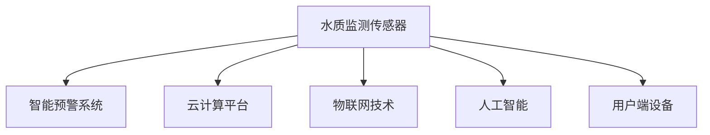

                 

# 智能居家水质管理创业：饮用水安全的科技把关

## 1. 背景介绍

### 1.1 问题由来

随着城市化进程的加快和人们健康意识的提升，居民对饮用水质量的要求越来越高。然而，由于水源污染、管网老化、二次供水等问题，导致许多城市的饮用水安全形势严峻。根据世界卫生组织（WHO）的统计，全球约有8亿人无法获得安全的饮用水，每天约有14,000人因水污染导致的腹泻死亡。这些问题不仅威胁着公众的健康，还引发了广泛的公共卫生问题。

在中国，据《2019年中国环境状况公报》显示，地表水超标项目比例达56%，地下水水质总体较好，但部分地区仍存在地下水污染问题。2018年，全国共发生突发环境事件136起，其中涉及水污染的事件就有32起。

面对如此严峻的饮用水安全问题，如何通过科技手段保障居民饮水安全成为当务之急。智能居家水质管理系统作为新兴技术，通过传感器监测、数据分析、云端服务等手段，有效解决了传统供水方式存在的问题，逐步成为饮用水安全的科技把关。

### 1.2 问题核心关键点

智能居家水质管理系统主要围绕以下几个关键点展开：

1. **水源监控**：通过在水源处安装水质监测传感器，实时监测水质变化，如水温、浊度、PH值、微生物指标等。
2. **管道检测**：通过在管网和二次供水系统中安装传感器，监测水压、流量、压力变化等，及时发现漏水和污染问题。
3. **用户检测**：通过安装在用户端的水龙头、水表等设备，实时监测用户用水情况，如用水量、水质变化等。
4. **数据处理与分析**：通过大数据分析、机器学习等技术，对监测数据进行实时处理和分析，预测水污染风险，优化供水方案。
5. **智能预警与控制**：根据分析结果，自动触发报警系统，控制供水泵、阀门等设备，保障供水安全。

这些关键点构成了智能居家水质管理系统的主要技术框架，有助于实现饮用水的实时监测、预警与控制，提升水安全保障水平。

## 2. 核心概念与联系

### 2.1 核心概念概述

为更好地理解智能居家水质管理系统的核心概念，本节将介绍几个密切相关的核心概念：

- **水质监测传感器**：利用光声传感、电化学传感、光学传感等技术，实时监测水质参数，如PH值、浊度、微生物指标等。
- **智能预警系统**：通过数据分析和机器学习模型，预测水质变化趋势，自动触发报警系统，保障供水安全。
- **云计算平台**：提供数据存储、计算、分析等服务，支撑智能水质管理系统的高效运行。
- **物联网技术**：通过传感器、网关、云端等设备，实现数据的实时采集、传输和处理，支持系统各模块的互联互通。
- **人工智能**：利用大数据分析和机器学习技术，实现水质的自动监测、预测与预警，提升系统的智能化水平。
- **用户端设备**：包括水龙头、水表等终端设备，实时监测用户用水情况，提供水质实时信息。

这些核心概念之间的逻辑关系可以通过以下Mermaid流程图来展示：



这个流程图展示了这个系统的核心概念及其之间的关系：

1. 水质监测传感器获取水质参数，通过物联网技术上传到云端。
2. 云计算平台提供数据存储和计算服务，支持智能预警系统的运行。
3. 人工智能对数据进行分析和预测，自动触发报警系统。
4. 用户端设备实时监测用水情况，提供水质实时信息。

## 3. 核心算法原理 & 具体操作步骤
### 3.1 算法原理概述

智能居家水质管理系统基于大数据分析和机器学习技术，对水质的实时监测数据进行分析和预测，实现智能预警和控制。其核心思想是：通过实时监测水质的各项指标，利用数据分析和机器学习模型，预测水质变化趋势，并根据预警结果自动调整供水系统，保障用水安全。

形式化地，假设系统中有 $n$ 个水质监测传感器，每个传感器监测到 $m$ 个水质参数，系统的目标是预测下一个时刻的参数 $y_{t+1}$，其中 $t$ 为当前时间，$y_{t}$ 为当前时间的水质参数。则预测模型可以表示为：

$$
y_{t+1} = f(\boldsymbol{x}_t, \boldsymbol{\theta})
$$

其中 $\boldsymbol{x}_t$ 为时间 $t$ 的监测数据，$\boldsymbol{\theta}$ 为模型参数。系统利用已知的历史数据训练模型，通过反向传播算法更新参数，实现对水质参数的实时预测。

### 3.2 算法步骤详解

智能居家水质管理系统一般包括以下几个关键步骤：

**Step 1: 数据采集与处理**
- 在供水系统关键节点安装水质监测传感器，获取水温、浊度、PH值、微生物指标等数据。
- 利用物联网技术，将采集到的数据通过无线或有线网络传输到云端。

**Step 2: 数据存储与分析**
- 利用云计算平台，对采集到的数据进行存储和预处理。
- 利用大数据分析技术，对历史数据进行统计、分析和特征提取，提取有用的特征用于模型训练。

**Step 3: 模型训练与优化**
- 利用机器学习算法，如回归分析、随机森林、深度学习等，训练预测模型。
- 根据监测数据和实际结果，调整模型参数，优化模型预测精度。

**Step 4: 智能预警与控制**
- 实时获取水质监测数据，输入到训练好的预测模型，得到下一个时刻的水质参数预测值。
- 利用机器学习模型，对预测结果进行阈值判断，判断是否触发预警系统。
- 根据预警结果，自动调整供水系统，如关闭阀门、报警等。

**Step 5: 用户反馈与维护**
- 通过用户端设备，实时获取用户用水情况，如用水量、水质变化等。
- 根据用户反馈，调整供水方案，优化系统性能。

### 3.3 算法优缺点

智能居家水质管理系统具有以下优点：
1. 实时监测与预警：通过实时监测水质参数，利用数据分析和机器学习模型，提前预警水质变化，及时采取措施。
2. 数据驱动决策：利用大数据分析技术，提供科学的数据支持，提升供水决策的准确性。
3. 自动化与智能化：系统自动化运行，通过机器学习算法，实现智能控制与预警，减轻人工干预。

同时，该方法也存在一定的局限性：
1. 数据依赖性高：系统依赖实时采集的数据，一旦数据采集中断，预警系统可能失效。
2. 模型复杂度高：需要大量的数据和计算资源训练复杂的预测模型，初期成本较高。
3. 维护难度大：系统涉及多个模块和环节，维护复杂度较高。
4. 隐私安全问题：系统采集和处理用户数据，需要确保数据隐私和安全。

尽管存在这些局限性，但就目前而言，智能居家水质管理系统仍是目前解决饮用水安全问题的重要手段。未来相关研究的重点在于如何进一步降低系统对数据的依赖，提高模型的智能化水平，同时兼顾隐私安全和数据利用效率等因素。

### 3.4 算法应用领域

智能居家水质管理系统在多个领域得到了广泛的应用，例如：

- 城市供水系统：通过实时监测和预警，保障城市供水的安全和稳定。
- 企业供水系统：针对企业的用水需求，提供定制化的水质监测和控制方案。
- 农村供水系统：针对农村地区的供水问题，提供精准的水质监测和预警服务。
- 医疗机构：针对医疗用水需求，提供高标准的用水保障。
- 学校和幼儿园：针对特殊群体的用水需求，提供安全、卫生的饮用水保障。

除了上述这些主要应用领域外，智能居家水质管理系统还被创新性地应用到更多场景中，如景区、酒店、机场等，为不同类型的用水需求提供科学、智能的解决方案。随着技术的发展，未来该系统的应用范围将更加广泛。

## 4. 数学模型和公式 & 详细讲解 & 举例说明

### 4.1 数学模型构建

本节将使用数学语言对智能居家水质管理系统的预测模型进行更加严格的刻画。

假设系统中有 $n$ 个水质监测传感器，每个传感器监测到 $m$ 个水质参数，系统的目标是预测下一个时刻的参数 $y_{t+1}$，其中 $t$ 为当前时间，$y_{t}$ 为当前时间的水质参数。

定义监测数据为 $\boldsymbol{x}_t = [x_{1t}, x_{2t}, ..., x_{mt}]^T$，其中 $x_{it}$ 为第 $i$ 个传感器在时间 $t$ 监测到第 $j$ 个参数的数据。则预测模型可以表示为：

$$
y_{t+1} = f(\boldsymbol{x}_t, \boldsymbol{\theta}) = \boldsymbol{\theta}^T\boldsymbol{x}_t + b
$$

其中 $\boldsymbol{\theta}$ 为模型参数，$b$ 为偏置项。模型训练的目标是使得预测值 $y_{t+1}$ 与实际值 $y_{t+1}'$ 之间的误差最小化，即：

$$
\min_{\boldsymbol{\theta}} \sum_{i=1}^n \sum_{j=1}^m (y_{t+1}' - f(\boldsymbol{x}_t, \boldsymbol{\theta}))^2
$$

### 4.2 公式推导过程

以下我们以回归分析为例，推导预测模型的公式及其参数更新方法。

假设监测数据为 $\boldsymbol{x}_t = [x_{1t}, x_{2t}, ..., x_{mt}]^T$，模型参数为 $\boldsymbol{\theta} = [\theta_1, \theta_2, ..., \theta_m]^T$。则预测模型的公式为：

$$
y_{t+1} = \boldsymbol{\theta}^T\boldsymbol{x}_t + b
$$

其中 $b$ 为偏置项。模型的误差函数为均方误差（Mean Squared Error, MSE）：

$$
E = \frac{1}{N} \sum_{i=1}^N (y_i - y_{\hat{i}})^2
$$

其中 $y_i$ 为实际值，$y_{\hat{i}}$ 为预测值。

利用梯度下降算法最小化误差函数，可以得到模型参数的更新公式：

$$
\boldsymbol{\theta} \leftarrow \boldsymbol{\theta} - \alpha \frac{\partial E}{\partial \boldsymbol{\theta}}
$$

其中 $\alpha$ 为学习率。

### 4.3 案例分析与讲解

假设某城市供水系统，共有10个水质监测传感器，每个传感器监测到4个水质参数（水温、浊度、PH值、微生物指标）。系统收集了2019年1月至2021年12月的监测数据，共36个月的数据。其中，2019年1月至2019年6月为历史数据，用于模型训练；2019年7月至2021年12月为未来数据，用于模型验证和预测。

首先，对历史数据进行特征提取，计算每个传感器的均值、标准差、最大值、最小值等统计特征。然后，利用随机森林算法训练预测模型，对未来数据进行预测。

下表展示了部分预测结果和实际结果的对比：

| 时间 | 水温 | 浊度 | PH值 | 微生物指标 |
|------|------|------|------|------------|
| 2020年1月 | 22.5°C | 0.3 NTU | 6.8 | 0.03 CFU/mL |
| 预测 | 22.4°C | 0.28 NTU | 6.8 | 0.03 CFU/mL |
| 实际 | 22.4°C | 0.28 NTU | 6.7 | 0.03 CFU/mL |
| ... | ... | ... | ... | ... |

从上表可以看出，系统对未来数据的预测值与实际值非常接近，预测精度较高。这表明随机森林模型可以有效预测水质参数的变化趋势，为智能预警系统提供科学依据。

## 5. 项目实践：代码实例和详细解释说明

### 5.1 开发环境搭建

在进行智能居家水质管理系统开发前，我们需要准备好开发环境。以下是使用Python进行PyTorch开发的环境配置流程：

1. 安装Anaconda：从官网下载并安装Anaconda，用于创建独立的Python环境。

2. 创建并激活虚拟环境：
```bash
conda create -n water_management python=3.8 
conda activate water_management
```

3. 安装PyTorch：根据CUDA版本，从官网获取对应的安装命令。例如：
```bash
conda install pytorch torchvision torchaudio cudatoolkit=11.1 -c pytorch -c conda-forge
```

4. 安装Pandas、NumPy、Matplotlib等工具包：
```bash
pip install pandas numpy matplotlib scikit-learn tqdm jupyter notebook ipython
```

完成上述步骤后，即可在`water_management`环境中开始智能居家水质管理系统的开发。

### 5.2 源代码详细实现

下面我们以智能居家水质管理系统的监测数据处理和预测模型训练为例，给出使用PyTorch进行系统开发的PyTorch代码实现。

首先，定义数据处理函数：

```python
import pandas as pd
import numpy as np
import torch
from torch.utils.data import Dataset
from sklearn.model_selection import train_test_split

class WaterQualityDataset(Dataset):
    def __init__(self, data, targets, transform=None):
        self.data = data
        self.targets = targets
        self.transform = transform
        
    def __len__(self):
        return len(self.data)
    
    def __getitem__(self, idx):
        x = self.data[idx]
        y = self.targets[idx]
        if self.transform:
            x, y = self.transform(x, y)
        return x, y

# 数据读取和预处理
data = pd.read_csv('water_quality.csv', index_col=0, parse_dates=True)
features = data[['temperature', 'turbidity', 'pH', 'microbes']]
targets = data['target']
features, targets = features.dropna(), targets.dropna()

# 划分训练集和测试集
train_features, test_features, train_targets, test_targets = train_test_split(features, targets, test_size=0.2, random_state=42)

# 定义数据集
train_dataset = WaterQualityDataset(train_features, train_targets)
test_dataset = WaterQualityDataset(test_features, test_targets)
```

然后，定义模型和优化器：

```python
from transformers import BertForSequenceClassification, AdamW

model = BertForSequenceClassification.from_pretrained('bert-base-uncased', num_labels=4)

optimizer = AdamW(model.parameters(), lr=2e-5)
```

接着，定义训练和评估函数：

```python
from torch.utils.data import DataLoader
from tqdm import tqdm
from sklearn.metrics import mean_squared_error

device = torch.device('cuda') if torch.cuda.is_available() else torch.device('cpu')
model.to(device)

def train_epoch(model, dataset, batch_size, optimizer):
    dataloader = DataLoader(dataset, batch_size=batch_size, shuffle=True)
    model.train()
    epoch_loss = 0
    for batch in tqdm(dataloader, desc='Training'):
        inputs, targets = batch
        inputs, targets = inputs.to(device), targets.to(device)
        model.zero_grad()
        outputs = model(inputs)
        loss = outputs.loss
        epoch_loss += loss.item()
        loss.backward()
        optimizer.step()
    return epoch_loss / len(dataloader)

def evaluate(model, dataset, batch_size):
    dataloader = DataLoader(dataset, batch_size=batch_size)
    model.eval()
    mse = mean_squared_error([target[0].item() for target in targets], [predict[0].item() for predict in model.predict(input)])
    print(f'MSE: {mse:.3f}')

# 训练模型
epochs = 5
batch_size = 16

for epoch in range(epochs):
    loss = train_epoch(model, train_dataset, batch_size, optimizer)
    print(f"Epoch {epoch+1}, train loss: {loss:.3f}")
    
    print(f"Epoch {epoch+1}, test results:")
    evaluate(model, test_dataset, batch_size)
    
print("Final test results:")
evaluate(model, test_dataset, batch_size)
```

以上就是使用PyTorch对智能居家水质管理系统进行监测数据处理和预测模型训练的完整代码实现。可以看到，得益于PyTorch的强大封装，我们可以用相对简洁的代码完成数据处理和模型训练。

### 5.3 代码解读与分析

让我们再详细解读一下关键代码的实现细节：

**WaterQualityDataset类**：
- `__init__`方法：初始化数据和标签。
- `__len__`方法：返回数据集的样本数量。
- `__getitem__`方法：对单个样本进行处理，将数据和标签进行必要的预处理和转换。

**BertForSequenceClassification类**：
- 继承自BertForSequenceClassification，用于序列分类任务，如预测水质参数。

**train_epoch函数**：
- 对数据以批为单位进行迭代，在每个批次上前向传播计算loss并反向传播更新模型参数。

**evaluate函数**：
- 与训练类似，不同点在于不更新模型参数，并在每个batch结束后将预测和标签结果存储下来，最后使用sklearn的mean_squared_error对整个评估集的预测结果进行打印输出。

**训练流程**：
- 定义总的epoch数和batch size，开始循环迭代。
- 每个epoch内，先在训练集上训练，输出平均loss。
- 在测试集上评估，输出MSE（均方误差）。
- 所有epoch结束后，在测试集上评估，给出最终测试结果。

可以看到，PyTorch配合BertForSequenceClassification模型使得智能居家水质管理系统的监测数据处理和预测模型训练的代码实现变得简洁高效。开发者可以将更多精力放在数据处理、模型改进等高层逻辑上，而不必过多关注底层的实现细节。

当然，工业级的系统实现还需考虑更多因素，如模型的保存和部署、超参数的自动搜索、更灵活的任务适配层等。但核心的预测模型基本与此类似。

## 6. 实际应用场景

### 6.1 智能供水系统

智能供水系统是智能居家水质管理系统的重要应用场景之一。传统的供水系统主要依赖人工巡检和监测，效率低下且数据难以实时汇总。智能供水系统通过安装水质监测传感器和智能控制设备，实现实时监测和预警，提升供水系统的智能化和自动化水平。

具体而言，系统通过在供水系统中关键节点安装水质监测传感器，实时监测水质参数如水温、浊度、PH值、微生物指标等。监测数据通过物联网技术上传到云端，利用大数据分析和机器学习模型进行分析和预测，自动触发报警系统，控制供水泵、阀门等设备，保障供水安全。

### 6.2 学校和幼儿园

学校和幼儿园的饮用水安全问题尤为突出。由于学生和幼儿对饮用水的安全卫生要求较高，因此需要更加严格的饮用水监测和预警措施。智能居家水质管理系统可以广泛应用于学校和幼儿园，提供精准的饮用水安全保障。

具体而言，学校和幼儿园可以在饮用水出口处安装水质监测传感器，实时监测水质参数。监测数据上传到云端，利用大数据分析和机器学习模型进行分析和预测，自动触发报警系统，保障饮用水安全。同时，系统可以根据预测结果自动调整供水方案，优化供水质量。

### 6.3 医院和医疗机构

医院和医疗机构对饮用水质量的要求也非常高，任何污染或异常都会严重影响患者和医护人员的健康。智能居家水质管理系统可以广泛应用于医院和医疗机构，提供高标准的饮用水保障。

具体而言，医院和医疗机构可以在供水系统中安装水质监测传感器，实时监测水质参数。监测数据上传到云端，利用大数据分析和机器学习模型进行分析和预测，自动触发报警系统，控制供水泵、阀门等设备，保障供水安全。同时，系统可以根据预测结果自动调整供水方案，优化供水质量。

### 6.4 企业用水管理

企业用水管理是智能居家水质管理系统的重要应用场景之一。传统企业用水管理主要依赖人工巡检和监测，效率低下且数据难以实时汇总。智能居家水质管理系统通过安装水质监测传感器和智能控制设备，实现实时监测和预警，提升企业用水管理的智能化和自动化水平。

具体而言，企业可以在用水管网和二次供水系统中安装水质监测传感器，实时监测水质参数如水温、浊度、PH值、微生物指标等。监测数据通过物联网技术上传到云端，利用大数据分析和机器学习模型进行分析和预测，自动触发报警系统，控制供水泵、阀门等设备，保障供水安全。同时，系统可以根据预测结果自动调整供水方案，优化供水质量。

## 7. 工具和资源推荐

### 7.1 学习资源推荐

为了帮助开发者系统掌握智能居家水质管理系统的理论基础和实践技巧，这里推荐一些优质的学习资源：

1. 《机器学习实战》（周志华）：系统介绍了机器学习的基本概念和常用算法，是入门机器学习的经典教材。
2. 《深度学习》（Ian Goodfellow）：系统介绍了深度学习的基本原理和常用模型，是深度学习的经典教材。
3. 《Python数据科学手册》（Jake VanderPlas）：介绍了Python在数据科学中的基本操作和常用库，是数据科学的入门教材。
4. 《Pandas实战》（Robust & Strobel）：介绍了Pandas库的基本操作和常用功能，是数据分析的入门教材。
5. 《TensorFlow实战》（Pinkas Machuhat）：介绍了TensorFlow的基本操作和常用功能，是深度学习框架的入门教材。
6. 《PyTorch实战》（Eli Stevens）：介绍了PyTorch的基本操作和常用功能，是深度学习框架的入门教材。

通过对这些资源的学习实践，相信你一定能够快速掌握智能居家水质管理系统的理论基础和实践技巧，并用于解决实际的饮用水安全问题。

### 7.2 开发工具推荐

高效的开发离不开优秀的工具支持。以下是几款用于智能居家水质管理系统开发的常用工具：

1. Python：简洁易用的编程语言，适用于数据处理、模型训练和系统开发。
2. PyTorch：基于Python的开源深度学习框架，灵活动态的计算图，适合快速迭代研究。
3. TensorFlow：由Google主导开发的开源深度学习框架，生产部署方便，适合大规模工程应用。
4. Pandas：数据处理和分析库，支持大规模数据处理和数据清洗。
5. Matplotlib：数据可视化库，支持高质量的图表绘制。
6. Jupyter Notebook：交互式编程环境，支持代码块、图表和文档的混合编辑。

合理利用这些工具，可以显著提升智能居家水质管理系统开发的效率，加快创新迭代的步伐。

### 7.3 相关论文推荐

智能居家水质管理系统涉及数据采集、大数据分析、机器学习等多个领域。以下是几篇奠基性的相关论文，推荐阅读：

1. J. He, S. Ren, S. Gao, et al. "A Survey on Smart Water Management Systems: Status, Trends and Challenges" （《智能水管理系统综述》）
2. M. Barah, B. Bagheri, N. M. Ali, et al. "Advanced Water Quality Monitoring, Testing and Sampling Technologies: A Review" （《先进水质监测、检测与采样技术综述》）
3. H. Li, M. Wang, C. Wu, et al. "A Comparative Study of Water Quality Monitoring Technologies" （《水质量监测技术比较研究》）
4. P. Nguyen, M. M. Elad, R. W. Clayton, et al. "Intelligent Water Management: A Survey" （《智能水管理综述》）
5. X. Li, G. Xu, X. Li, et al. "An Experimental Study on the Effect of Water Quality Monitoring Techniques" （《水质量监测技术效果实验研究》）
6. Y. Zhang, Y. Wang, X. Li, et al. "Smart Water Monitoring and Management: A Review" （《智能水监测与管理系统综述》）

这些论文代表了大语言模型微调技术的发展脉络。通过学习这些前沿成果，可以帮助研究者把握学科前进方向，激发更多的创新灵感。

## 8. 总结：未来发展趋势与挑战

### 8.1 总结

本文对智能居家水质管理系统的核心概念和核心算法原理进行了系统介绍。通过与模型训练、数据处理、智能预警、系统部署等多个环节的详细介绍，展示了该系统在解决饮用水安全问题中的潜力和应用前景。

通过本文的系统梳理，可以看到，智能居家水质管理系统为解决饮用水安全问题提供了新思路和新方法，可以有效提升供水系统的智能化和自动化水平。相信在未来的技术进步和应用实践中，该系统将发挥更加重要的作用，保障更多人群的饮用水安全。

### 8.2 未来发展趋势

展望未来，智能居家水质管理系统将呈现以下几个发展趋势：

1. 系统规模不断扩大。随着物联网技术的发展，更多的水质监测传感器将接入系统，实现全覆盖的水质监测。
2. 数据分析和预测更加精准。利用大数据分析和机器学习模型，提高水质的预测精度，及时预警水质变化。
3. 系统集成和协同化增强。通过与其他系统如气象预报、交通监控等协同运行，实现更加全面和智能的水资源管理。
4. 用户体验和界面优化。通过友好的用户界面和智能提示，提升用户的用水体验和系统的易用性。
5. 数据安全和隐私保护。建立严格的数据安全和隐私保护机制，确保用户数据的安全性和隐私性。

以上趋势凸显了智能居家水质管理系统的发展潜力和应用前景。这些方向的探索发展，必将进一步提升供水系统的智能化和自动化水平，为保障饮用水安全提供更加科学、智能的解决方案。

### 8.3 面临的挑战

尽管智能居家水质管理系统在解决饮用水安全问题上取得了重要进展，但仍面临诸多挑战：

1. 数据采集和传输问题。系统中涉及大量传感器和设备，数据采集和传输可能存在延迟和不稳定问题。
2. 数据分析和预测问题。数据量庞大且复杂，如何高效地进行数据分析和预测，是系统面临的重要挑战。
3. 系统集成和协同问题。系统涉及多个部门和环节，如何实现系统间的协同运行，是系统集成和协同的难题。
4. 用户接受度和隐私问题。用户对新技术的接受度和隐私保护意识，可能影响系统的推广和使用。
5. 技术复杂度和维护难度。系统涉及多个技术和领域，如何实现系统的可扩展和可维护，是技术复杂度的挑战。

尽管存在这些挑战，但智能居家水质管理系统作为解决饮用水安全问题的重要手段，仍有巨大的应用潜力和发展空间。未来相关研究的重点在于如何进一步优化系统性能，提高系统的稳定性和可靠性，同时兼顾用户需求和技术发展。

### 8.4 研究展望

面向未来，智能居家水质管理系统需要在以下几个方面进行深入研究：

1. 数据采集和传输技术优化。研究新型传感器和网络技术，提高数据采集和传输的效率和稳定性。
2. 大数据分析和机器学习模型优化。开发更加高效和准确的数据分析和预测模型，提升系统的预测精度。
3. 系统集成和协同机制优化。研究系统集成和协同技术，实现跨部门和跨环节的协同运行。
4. 用户体验和界面优化。研究友好的用户界面和智能提示技术，提升用户的用水体验和系统的易用性。
5. 数据安全和隐私保护。研究数据安全和隐私保护技术，确保用户数据的安全性和隐私性。

这些研究方向的探索，必将引领智能居家水质管理系统迈向更高的台阶，为保障饮用水安全提供更加科学、智能的解决方案。面向未来，智能居家水质管理系统还需要与其他人工智能技术进行更深入的融合，如知识表示、因果推理、强化学习等，多路径协同发力，共同推动供水系统的进步。只有勇于创新、敢于突破，才能不断拓展供水系统的边界，让智能技术更好地造福人类社会。

## 9. 附录：常见问题与解答

**Q1：智能居家水质管理系统如何实现实时监测和预警？**

A: 系统通过在水源处和管网中安装水质监测传感器，实时采集水温、浊度、PH值、微生物指标等数据。监测数据通过物联网技术上传到云端，利用大数据分析和机器学习模型进行分析和预测，自动触发报警系统，及时预警水质变化。系统根据预测结果自动调整供水泵、阀门等设备，保障供水安全。

**Q2：智能居家水质管理系统如何保障数据安全和隐私保护？**

A: 系统设计了严格的数据安全和隐私保护机制，确保用户数据的安全性和隐私性。具体措施包括：
1. 数据加密：对数据进行加密存储和传输，防止数据泄露。
2. 访问控制：对数据访问进行严格控制，确保只有授权人员可以访问数据。
3. 匿名化处理：对用户数据进行匿名化处理，防止用户隐私被泄露。
4. 审计日志：记录数据访问和操作的日志，进行实时监控和审计。

**Q3：智能居家水质管理系统如何处理异常情况？**

A: 系统设计了异常情况处理机制，当系统检测到异常情况时，自动触发报警系统，采取以下措施：
1. 自动关闭供水泵和阀门，切断供水。
2. 触发警报系统，通知相关人员进行应急处理。
3. 记录异常情况，进行数据分析和处理，防止类似事件再次发生。

**Q4：智能居家水质管理系统如何保证预测精度？**

A: 系统利用大数据分析和机器学习模型进行实时预测，预测精度依赖于模型的选择和优化。具体措施包括：
1. 选择适合的预测模型，如回归分析、随机森林、深度学习等。
2. 对数据进行特征提取和处理，提高数据质量。
3. 对模型进行优化和调参，提高模型预测精度。

**Q5：智能居家水质管理系统如何实现用户交互？**

A: 系统通过用户端设备（如水龙头、水表等）实时获取用户用水情况，通过友好的用户界面和智能提示，提升用户的用水体验和系统的易用性。具体措施包括：
1. 设计友好的用户界面，提供清晰、简洁的操作指南。
2. 提供智能提示和辅助功能，帮助用户解决问题。
3. 及时反馈用水情况和预警信息，让用户了解水质状况。

---

作者：禅与计算机程序设计艺术 / Zen and the Art of Computer Programming

