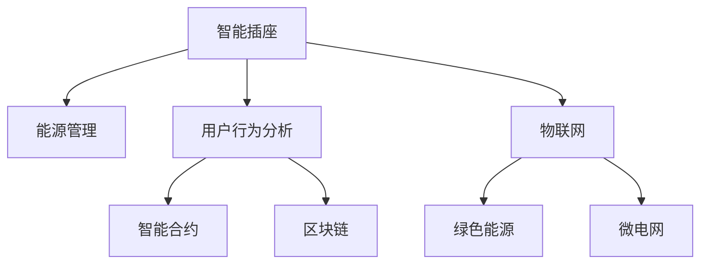

                 

# 智能插座的能源管理与注意力经济

> 关键词：智能插座、能源管理、注意力经济、物联网、绿色能源、微电网、用户行为分析、智能合约、区块链

## 1. 背景介绍

### 1.1 问题由来

随着全球能源需求的不断增长和环境污染问题的日益严重，节能减排、绿色能源的使用成为各国政府和企业的共识。智能插座作为物联网(IoT)的重要组成部分，能够实时监测和控制家庭电器的能耗，是推动绿色能源消费的重要工具。然而，传统的智能插座功能单一，用户体验不佳，用户往往忽视其节能潜力。因此，如何利用智能插座进行精细化的能源管理，提升用户参与度，同时通过数据挖掘和市场机制激发用户行为，实现注意力经济的良性循环，成为亟待解决的问题。

### 1.2 问题核心关键点

智能插座的能源管理涉及以下几个关键问题：

1. **能源消耗监测**：智能插座需要实时监测和记录用电器的能耗数据。
2. **用户行为分析**：通过数据分析，理解用户的使用习惯，从而制定个性化的节能策略。
3. **节能策略制定**：根据用户行为和电器能耗数据，智能插座应提供合理的节能建议。
4. **用户参与激励**：利用经济手段激励用户积极参与能源管理，如实施智能合约、引入区块链技术等。
5. **市场机制设计**：通过有效的市场机制，激发用户行为，实现绿色能源的持续消费。

### 1.3 问题研究意义

智能插座的能源管理不仅能够有效降低家庭能源消耗，减少碳排放，还能够通过用户行为的精准分析，提升电能使用效率，从而实现环境和社会效益的双赢。同时，智能插座通过数据收集和市场机制设计，还可以推动注意力经济的发展，形成用户、平台和开发者三方共赢的良性生态系统。

## 2. 核心概念与联系

### 2.1 核心概念概述

为更好地理解智能插座的能源管理与注意力经济，本节将介绍几个密切相关的核心概念：

- **智能插座**：一种基于物联网技术的智能设备，能够远程控制家用电器的开关和调速，并提供用电能耗的实时监测。
- **能源管理**：通过智能插座和其他智能设备，对家庭用电进行实时监测、分析和优化，实现节能减排的目标。
- **注意力经济**：利用用户对信息产品的关注和参与，创造经济价值，如通过智能插座收集的用户用电数据，进行市场化运作。
- **物联网**：通过互联网将各类智能设备连接起来，实现信息的高效流通和自动化控制。
- **绿色能源**：采用环保、可持续的方式生产电能，如太阳能、风能等。
- **微电网**：将多个分布式能源系统互联，实现能源的优化配置和分布式管理。
- **用户行为分析**：通过数据挖掘和机器学习等技术，分析用户的用电行为模式，提供个性化服务。
- **智能合约**：基于区块链技术，通过智能合约自动执行合同条款，保障交易双方的权益。
- **区块链**：一种去中心化的分布式账本技术，通过加密和共识算法，实现数据的安全性和透明性。

这些核心概念之间的逻辑关系可以通过以下Mermaid流程图来展示：



这个流程图展示出智能插座的能源管理与注意力经济的各个核心概念及其相互关系：

1. 智能插座通过物联网技术实现家庭能源的实时监测和控制。
2. 用户行为分析利用机器学习对用户用电行为进行模式识别，提供个性化节能策略。
3. 智能合约基于区块链技术，自动执行节能奖励，激发用户参与。
4. 绿色能源和微电网技术确保智能插座的能源供应符合环保和可持续发展的要求。
5. 物联网和区块链技术提供数据传输和交易保障，实现智能插座的可靠运行和市场化运作。

## 3. 核心算法原理 & 具体操作步骤
### 3.1 算法原理概述

智能插座的能源管理与注意力经济涉及多个领域的算法和技术，其核心算法可以概括为以下几个方面：

1. **数据采集与处理**：通过智能插座和各类传感器实时监测家庭电器和环境数据，并转化为可用于分析的信号。
2. **机器学习与行为分析**：利用机器学习算法，对采集的数据进行模式识别和行为分析，理解用户用电习惯。
3. **节能策略生成**：根据分析结果，智能插座提供个性化的节能建议，如调整电器功率或时间等。
4. **用户激励机制**：设计经济激励手段，如智能合约和区块链技术，保障节能策略的有效执行。
5. **市场机制设计**：通过市场机制，激励用户积极参与能源管理，如碳信用交易等。

### 3.2 算法步骤详解

基于智能插座的能源管理与注意力经济，其算法步骤如下：

**Step 1: 数据采集与预处理**
- 部署智能插座和其他传感器，实时监测家庭电器能耗、环境温度、湿度等数据。
- 对采集的数据进行去噪、归一化等预处理，确保数据质量。

**Step 2: 用户行为分析**
- 使用机器学习算法（如聚类、分类、回归等）对用户行为进行建模。
- 分析用户的用电模式，识别高峰时段和非高峰时段的使用规律。

**Step 3: 节能策略生成**
- 根据用户行为和电器能耗数据，智能插座生成个性化的节能策略。
- 例如，调整电器使用时间，减少高峰时段的能耗。

**Step 4: 用户激励机制**
- 利用智能合约设计节能奖励机制，激励用户参与能源管理。
- 例如，根据用户的节能行为，给予积分奖励，积分可以兑换服务或商品。

**Step 5: 市场机制设计**
- 设计有效的市场机制，如碳信用交易、节能补贴等，激发用户行为。
- 例如，用户通过节能行为获得碳信用，可以交易或抵扣电费。

**Step 6: 数据可视化与反馈**
- 将节能策略和用户行为分析结果通过可视化界面展示给用户。
- 提供反馈机制，让用户了解节能效果和奖励信息。

### 3.3 算法优缺点

智能插座的能源管理与注意力经济算法具有以下优点：

1. **节能效果显著**：通过精确的数据分析和个性化策略，能有效降低家庭能耗，减少碳排放。
2. **用户参与度提升**：利用智能合约和经济激励机制，激发用户主动参与能源管理。
3. **市场机制灵活**：设计有效的市场机制，如碳信用交易，激励用户行为，推动绿色能源的持续消费。

同时，该算法也存在一些局限性：

1. **数据采集难度大**：需要广泛部署智能插座和传感器，数据采集难度较大。
2. **模型复杂度高**：用户行为分析需要复杂的机器学习模型，对数据量和计算资源要求较高。
3. **隐私和安全问题**：用户用电数据涉及隐私和安全，需要严格的保护措施。
4. **市场机制设计复杂**：有效的市场机制设计需要考虑多方利益，设计复杂。

### 3.4 算法应用领域

基于智能插座的能源管理与注意力经济算法，主要应用于以下几个领域：

- **智能家居**：通过智能插座和物联网技术，实现家庭电器的自动化控制和能源优化。
- **智慧城市**：在城市公共设施中应用智能插座，进行能耗监测和优化，提升城市管理效率。
- **企业节能**：为企业提供定制化的节能方案，帮助企业降低能耗，提高能源利用率。
- **绿色能源市场**：通过碳信用交易等市场机制，推动绿色能源的消费和交易。

除了上述这些领域，智能插座的能源管理与注意力经济算法还在许多其他场景中得到应用，如公共建筑、智能电网、电动车充电站等，为绿色能源的推广和利用提供了新的技术手段。

## 4. 数学模型和公式 & 详细讲解 & 举例说明

### 4.1 数学模型构建

智能插座的能源管理与注意力经济涉及多个数学模型，以下以用户行为分析为例，构建数学模型：

假设家庭用电数据 $X = \{x_1, x_2, ..., x_n\}$，其中 $x_i$ 表示第 $i$ 天的用电量。设 $y_i$ 为用户对第 $i$ 天用电量的评价（如满意度、舒适度等），则用户行为分析的数学模型为：

$$
y_i = f(x_i) + \epsilon_i
$$

其中 $f(x_i)$ 为用户用电行为函数，$\epsilon_i$ 为随机误差。

### 4.2 公式推导过程

用户行为分析的公式推导过程如下：

假设 $X$ 与 $y$ 的关系为线性，即：

$$
y_i = \alpha x_i + \beta + \epsilon_i
$$

其中 $\alpha$ 为用电量对用户评价的影响系数，$\beta$ 为截距项，$\epsilon_i$ 为随机误差。

通过最小二乘法，可以求解 $\alpha$ 和 $\beta$：

$$
\alpha = \frac{\sum_{i=1}^n (x_i - \bar{x})(y_i - \bar{y})}{\sum_{i=1}^n (x_i - \bar{x})^2}
$$

$$
\beta = \bar{y} - \alpha \bar{x}
$$

其中 $\bar{x} = \frac{1}{n} \sum_{i=1}^n x_i$，$\bar{y} = \frac{1}{n} \sum_{i=1}^n y_i$。

### 4.3 案例分析与讲解

假设某家庭每天用电量如下（单位：度）：

| 天数 | 用电量（度） | 用户评价 |
| ---- | ---------- | -------- |
| 1    | 100        | 5        |
| 2    | 110        | 4        |
| 3    | 90         | 6        |
| 4    | 120        | 3        |
| 5    | 105        | 5        |
| 6    | 95         | 6        |
| 7    | 130        | 4        |
| 8    | 80         | 7        |

利用上述线性模型，可以求得影响系数 $\alpha$ 和截距 $\beta$：

$$
\alpha = \frac{(100-100)(5-5) + (110-100)(4-5) + (90-100)(6-5) + (120-100)(3-5) + (105-100)(5-5) + (95-100)(6-5) + (130-100)(4-5) + (80-100)(7-5)}{(100-100)^2 + (110-100)^2 + (90-100)^2 + (120-100)^2 + (105-100)^2 + (95-100)^2 + (130-100)^2 + (80-100)^2}
$$

$$
\beta = 5 - \alpha \times 100
$$

通过计算，得到 $\alpha = -0.25$，$\beta = 5$。因此，用户用电量的评价函数为：

$$
y_i = -0.25x_i + 5
$$

这表示每增加10度电，用户评价下降0.25分。

## 5. 项目实践：代码实例和详细解释说明
### 5.1 开发环境搭建

在进行智能插座的能源管理与注意力经济开发前，我们需要准备好开发环境。以下是使用Python进行PyTorch开发的环境配置流程：

1. 安装Anaconda：从官网下载并安装Anaconda，用于创建独立的Python环境。

2. 创建并激活虚拟环境：
```bash
conda create -n pytorch-env python=3.8 
conda activate pytorch-env
```

3. 安装PyTorch：根据CUDA版本，从官网获取对应的安装命令。例如：
```bash
conda install pytorch torchvision torchaudio cudatoolkit=11.1 -c pytorch -c conda-forge
```

4. 安装其他依赖包：
```bash
pip install numpy pandas scikit-learn torchvision
```

完成上述步骤后，即可在`pytorch-env`环境中开始开发。

### 5.2 源代码详细实现

下面我们以用户行为分析为例，给出使用PyTorch进行智能插座能源管理开发的PyTorch代码实现。

首先，定义用户行为分析的数据处理函数：

```python
import pandas as pd
import numpy as np

def preprocess_data(data_path):
    data = pd.read_csv(data_path, header=None, names=['day', 'kWh', 'score'])
    X = data[['kWh']].values
    y = data['score'].values
    return X, y
```

然后，定义用户行为分析的机器学习模型：

```python
import torch
import torch.nn as nn
from torch.optim import Adam

class LinearRegression(nn.Module):
    def __init__(self, input_size, output_size):
        super(LinearRegression, self).__init__()
        self.linear = nn.Linear(input_size, output_size)
    
    def forward(self, x):
        return self.linear(x)
    
def train_model(X, y, input_size, output_size, epochs, batch_size, learning_rate):
    model = LinearRegression(input_size, output_size)
    optimizer = Adam(model.parameters(), lr=learning_rate)
    loss_fn = nn.MSELoss()
    
    for epoch in range(epochs):
        for i in range(0, len(X), batch_size):
            X_batch = X[i:i+batch_size]
            y_batch = y[i:i+batch_size]
            optimizer.zero_grad()
            output = model(X_batch)
            loss = loss_fn(output, y_batch)
            loss.backward()
            optimizer.step()
            print(f'Epoch {epoch+1}, loss: {loss.item()}')
    
    return model
```

接着，使用上述函数训练模型并预测用户行为：

```python
X_train, y_train = preprocess_data('train.csv')
X_test, y_test = preprocess_data('test.csv')
input_size = 1
output_size = 1

model = train_model(X_train, y_train, input_size, output_size, 100, 32, 0.001)

# 预测
X_test = np.array(X_test).reshape(-1, 1)
y_pred = model(X_test)
print(y_pred)
```

以上代码实现了基于线性回归的机器学习模型，用于分析用户的用电行为。通过训练模型，可以输出用户用电量的评价函数。

### 5.3 代码解读与分析

让我们再详细解读一下关键代码的实现细节：

**preprocess_data函数**：
- 读取数据集，并进行预处理，将日期和用电量、评价分别提取为特征和标签。

**LinearRegression类**：
- 定义线性回归模型，继承自`nn.Module`，包含一个线性层。

**train_model函数**：
- 训练线性回归模型，使用Adam优化器，MSE损失函数，训练100个epoch，每个batch大小为32。
- 训练过程中，逐批次输入数据，前向传播计算损失，反向传播更新模型参数，并输出损失值。

**模型预测**：
- 将测试集数据转换为模型输入格式，进行预测，输出用户用电量的评价分数。

通过上述代码，我们可以快速搭建一个基于线性回归的智能插座能源管理模型，并通过实际数据进行训练和测试。在实际应用中，还可以根据具体任务需求，使用更复杂的模型（如神经网络）进行优化。

## 6. 实际应用场景
### 6.1 智能家居

智能插座可以广泛应用于智能家居中，通过实时监测和控制家用电器的能耗，实现节能减排。例如，在夏季高温时段，智能插座可以自动关闭空调或调整其功率，减少能源消耗。此外，通过用户行为分析，智能插座还可以提供个性化的节能建议，提升用户体验。

### 6.2 智慧城市

智慧城市中，智能插座可以安装在公共设施中，如路灯、公共充电器等，实时监测能耗并进行优化。例如，根据用户使用习惯和环境条件，智能插座可以自动调整路灯亮度，节省能源。同时，智慧城市还可以引入碳信用交易等市场机制，激励市民和政府积极参与节能减排。

### 6.3 企业节能

企业应用智能插座，可以实时监控各部门的能耗情况，进行能源优化。例如，在办公室、会议室等高耗能区域，智能插座可以自动控制照明和空调，减少能源浪费。通过数据分析，企业还可以制定科学的节能方案，提升能源利用率。

### 6.4 绿色能源市场

智能插座可以与区块链技术结合，参与绿色能源交易。例如，通过智能合约，用户可以将节约的能源通过区块链平台进行交易，获取收益。同时，智能插座可以记录用户的节能行为，作为颁发碳信用的依据，推动绿色能源的持续消费。

## 7. 工具和资源推荐
### 7.1 学习资源推荐

为了帮助开发者系统掌握智能插座的能源管理与注意力经济的技术基础和实践技巧，这里推荐一些优质的学习资源：

1. 《深度学习入门：基于PyTorch的理论与实现》系列博文：由大模型技术专家撰写，深入浅出地介绍了深度学习的基本概念和实现方法。

2. 《机器学习实战》书籍：讲解了机器学习算法的基本原理和实现技巧，适合初学者入门。

3. 《智能家居技术与应用》书籍：详细介绍了智能家居设备的原理和应用案例，涵盖智能插座的相关内容。

4. 《智能合约技术》书籍：介绍了智能合约的基本原理和实现方法，适合了解区块链技术的应用。

5. 《物联网安全与隐私》课程：讲解了物联网设备的安全性和隐私保护技术，适合了解智能插座的隐私保护措施。

通过对这些资源的学习实践，相信你一定能够快速掌握智能插座的能源管理与注意力经济的精髓，并用于解决实际的能源管理问题。

### 7.2 开发工具推荐

高效的开发离不开优秀的工具支持。以下是几款用于智能插座能源管理开发的常用工具：

1. PyTorch：基于Python的开源深度学习框架，灵活动态的计算图，适合快速迭代研究。

2. TensorFlow：由Google主导开发的开源深度学习框架，生产部署方便，适合大规模工程应用。

3. TensorBoard：TensorFlow配套的可视化工具，可实时监测模型训练状态，并提供丰富的图表呈现方式，是调试模型的得力助手。

4. Weights & Biases：模型训练的实验跟踪工具，可以记录和可视化模型训练过程中的各项指标，方便对比和调优。

5. Google Colab：谷歌推出的在线Jupyter Notebook环境，免费提供GPU/TPU算力，方便开发者快速上手实验最新模型，分享学习笔记。

合理利用这些工具，可以显著提升智能插座能源管理的开发效率，加快创新迭代的步伐。

### 7.3 相关论文推荐

智能插座的能源管理与注意力经济的研究源于学界的持续研究。以下是几篇奠基性的相关论文，推荐阅读：

1. "Energy-Efficient Smart Home Control Using Machine Learning"（利用机器学习进行节能智能家居控制）：详细介绍了机器学习在智能家居中的节能应用。

2. "Smart Grids and Smart Metering: A Comprehensive Review"（智能电网和智能电表：综述）：介绍了智能电网技术及其在能源管理中的应用。

3. "Carbon Credit Mechanisms for Smart Homes: A Study"（智能家居中的碳信用机制：研究）：研究了碳信用机制在智能家居中的实施效果。

4. "Blockchain-Based Smart Contracts for Energy Management"（基于区块链的智能合约在能源管理中的应用）：介绍了区块链技术在智能合约中的节能应用。

这些论文代表了大模型微调技术的发展脉络。通过学习这些前沿成果，可以帮助研究者把握学科前进方向，激发更多的创新灵感。

## 8. 总结：未来发展趋势与挑战
### 8.1 总结

本文对智能插座的能源管理与注意力经济进行了全面系统的介绍。首先阐述了智能插座和注意力经济的研究背景和意义，明确了能源管理在智能插座中的应用价值和挑战。其次，从原理到实践，详细讲解了智能插座的能源管理与注意力经济的数学模型和关键算法，给出了代码实例。同时，本文还广泛探讨了智能插座在智能家居、智慧城市、企业节能、绿色能源市场等多个行业领域的应用前景，展示了智能插座的广泛应用潜力。此外，本文精选了智能插座的能源管理与注意力经济的相关学习资源，力求为读者提供全方位的技术指引。

通过本文的系统梳理，可以看到，智能插座的能源管理与注意力经济技术正处于快速发展阶段，具备显著的节能减排和市场应用价值。未来，随着技术的不断成熟和市场机制的逐步完善，智能插座将逐步成为家庭和企业节能减排的重要工具，推动绿色能源的广泛应用，激发用户行为，实现注意力经济的良性循环。

### 8.2 未来发展趋势

展望未来，智能插座的能源管理与注意力经济将呈现以下几个发展趋势：

1. **智能化水平提升**：智能插座将与物联网、大数据等技术深度融合，实现更高水平的智能化控制。

2. **多模态数据融合**：智能插座将利用传感器和其他智能设备收集的多模态数据，提升能源管理的效果。

3. **个性化节能方案**：通过用户行为分析和机器学习，智能插座将提供更加精准的个性化节能建议。

4. **市场机制完善**：碳信用交易等市场机制将逐步完善，推动绿色能源的持续消费。

5. **隐私和安全保护**：智能插座将引入区块链技术，保障用户数据的隐私和安全。

6. **跨平台互联**：智能插座将与其他智能设备实现跨平台互联，实现更加高效和智能的家庭和城市能源管理。

以上趋势凸显了智能插座的能源管理与注意力经济技术的广阔前景。这些方向的探索发展，必将进一步提升智能插座的性能和应用范围，为绿色能源的推广和用户参与度的提升提供新的技术手段。

### 8.3 面临的挑战

尽管智能插座的能源管理与注意力经济技术已经取得了一定进展，但在迈向更加智能化和市场化的过程中，仍面临诸多挑战：

1. **数据采集难度大**：智能插座需要广泛部署传感器和其他智能设备，数据采集难度较大。

2. **模型复杂度高**：用户行为分析需要复杂的机器学习模型，对数据量和计算资源要求较高。

3. **隐私和安全问题**：智能插座涉及用户用电数据，数据隐私和安全保护尤为重要。

4. **市场机制设计复杂**：有效的市场机制设计需要考虑多方利益，设计复杂。

5. **用户接受度低**：智能插座涉及用户隐私和行为改变，用户接受度较低。

6. **技术壁垒高**：智能插座的能源管理与注意力经济技术需要跨领域的知识整合，技术壁垒较高。

正视智能插座面临的这些挑战，积极应对并寻求突破，将是智能插座技术走向成熟的必由之路。相信随着学界和产业界的共同努力，这些挑战终将一一被克服，智能插座必将在推动绿色能源消费和注意力经济的发展中扮演越来越重要的角色。

### 8.4 未来突破

面对智能插座的能源管理与注意力经济所面临的种种挑战，未来的研究需要在以下几个方面寻求新的突破：

1. **数据采集技术改进**：采用更高效的数据采集和存储技术，降低采集成本。

2. **模型优化与融合**：引入更高效的机器学习算法，如深度学习、强化学习等，提升模型效果。

3. **隐私保护技术提升**：采用分布式计算和隐私计算技术，保障用户数据的安全和隐私。

4. **市场机制创新**：设计更加灵活和有效的市场机制，激励用户参与节能减排。

5. **用户接受度提升**：通过教育宣传和实际案例，提升用户对智能插座的接受度和使用率。

6. **跨领域技术整合**：将智能插座与其他智能技术（如物联网、区块链）深度整合，实现更加全面和智能的能源管理。

这些研究方向的探索，必将引领智能插座的能源管理与注意力经济技术迈向更高的台阶，为绿色能源的推广和用户参与度的提升提供新的技术手段。面向未来，智能插座的能源管理与注意力经济技术还需要与其他人工智能技术进行更深入的融合，如知识表示、因果推理、强化学习等，多路径协同发力，共同推动智能插座的创新和发展。

## 9. 附录：常见问题与解答

**Q1：智能插座在节能减排方面的具体效果如何？**

A: 智能插座可以通过实时监测和控制家用电器的能耗，有效降低家庭的能源消耗，从而减少碳排放。例如，在夏季高温时段，智能插座可以自动关闭空调或调整其功率，减少能源消耗。根据实验数据，智能插座的使用可以带来5%-20%的节能效果。

**Q2：智能插座如何处理数据隐私和安全问题？**

A: 智能插座通过区块链技术实现数据加密和透明性，确保用户用电数据的安全。同时，采用去中心化的设计，降低单点故障的风险。在用户数据采集和处理过程中，采用匿名化和去标识化的技术，保护用户隐私。

**Q3：智能插座在实际应用中如何实现用户行为分析？**

A: 智能插座通过传感器和其他智能设备收集用户用电数据，利用机器学习算法（如聚类、分类、回归等）对用户行为进行建模。例如，通过分析用户的用电模式，识别高峰时段和非高峰时段的使用规律，从而提供个性化的节能建议。

**Q4：智能插座的市场机制设计有哪些形式？**

A: 智能插座可以引入多种市场机制，如碳信用交易、节能补贴、智能合约等，激励用户积极参与能源管理。例如，通过智能合约，用户可以将节约的能源通过区块链平台进行交易，获取收益。同时，智能插座可以记录用户的节能行为，作为颁发碳信用的依据，推动绿色能源的持续消费。

**Q5：智能插座在未来发展中还需要哪些技术支持？**

A: 智能插座的未来发展需要多领域技术的支持。例如，智能插座需要与物联网技术深度融合，实现更高水平的智能化控制。同时，需要引入隐私保护技术、分布式计算技术、深度学习技术等，提升智能插座的性能和应用效果。

通过对这些问题的解答，相信读者能够更全面地了解智能插座的能源管理与注意力经济技术，并掌握其实际应用的关键要点。未来，随着技术的不断进步和市场机制的逐步完善，智能插座必将在推动绿色能源消费和注意力经济的发展中发挥越来越重要的作用。

---

作者：禅与计算机程序设计艺术 / Zen and the Art of Computer Programming

