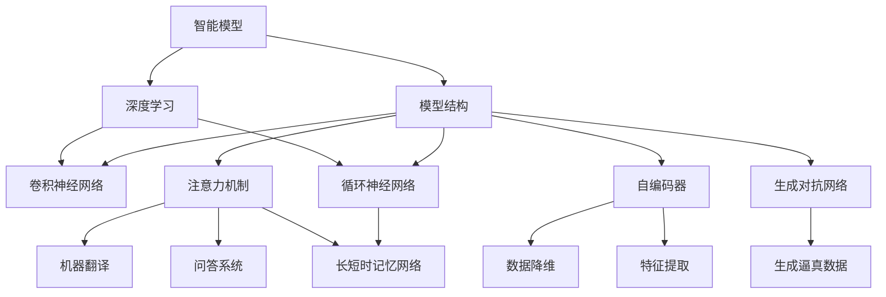

                 

# 智能模型与模型结构的探索

## 1. 背景介绍

人工智能的飞速发展正在不断改变我们的世界。从自动驾驶到语音识别，从智能推荐系统到智能客服，AI技术在各个领域的落地应用越来越广泛。智能模型的设计和使用，成为了推动AI技术进步的核心要素。然而，构建高效、准确、可靠的智能模型，需要深入理解模型结构、算法原理、优化技术等方面的知识。本文将对智能模型与模型结构进行全面的探索，以期为开发者和研究者提供深刻的见解和实用的技术指导。

## 2. 核心概念与联系

### 2.1 核心概念概述

为更好地理解智能模型与模型结构，本节将介绍几个密切相关的核心概念：

- 智能模型：指的是能够执行复杂任务的机器学习模型，包括但不限于分类、回归、聚类、生成等任务。智能模型通过学习数据特征，能够预测未来行为或生成新数据。
- 模型结构：指智能模型的内部组成形式，包括输入、中间层、输出等结构元素。模型结构直接影响模型的表达能力和训练效率。
- 深度学习：一种基于神经网络的机器学习技术，通过多层次的抽象表达，能够处理非结构化数据，并进行复杂的特征提取和模式识别。
- 卷积神经网络(CNN)：一种针对图像、视频等结构化数据的深度学习模型，通过卷积操作实现局部特征提取。
- 循环神经网络(RNN)：一种处理序列数据的深度学习模型，通过循环结构实现时间依赖关系建模。
- 长短时记忆网络(LSTM)：一种优化了梯度消失问题的RNN变体，适用于处理长序列数据，广泛用于文本生成、语音识别等任务。
- 注意力机制(Attention)：一种在序列数据中引导模型关注重要信息的机制，能够在机器翻译、问答系统等任务中取得显著效果。
- 自编码器(Autoencoder)：一种无监督学习的深度学习模型，能够实现数据的降维和特征提取。
- 生成对抗网络(GAN)：一种通过对抗训练的方式生成新数据的深度学习模型，能够生成逼真的图像、视频、音频等数据。

这些核心概念之间的逻辑关系可以通过以下Mermaid流程图来展示：



这个流程图展示了这个核心概念之间的相互联系：

1. 智能模型通过深度学习获取数据表示。
2. CNN 用于处理图像、视频等结构化数据。
3. RNN 和 LSTM 用于处理序列数据。
4. 注意力机制用于引导模型关注关键信息。
5. 自编码器用于降维和特征提取。
6. GAN 用于生成新数据。

这些概念共同构成了深度学习模型的基础框架，为其在各种任务中的应用提供了可能。

## 3. 核心算法原理 & 具体操作步骤

### 3.1 算法原理概述

智能模型的设计和优化，主要依赖于数据驱动的训练过程。在这一过程中，模型通过反向传播算法，不断调整模型参数，以最小化预测误差。这一过程可以概括为以下几个步骤：

1. **数据准备**：收集和预处理数据，包括数据清洗、数据增强、数据划分等。
2. **模型选择**：根据任务特性选择合适的模型结构，如CNN、RNN、LSTM、注意力机制等。
3. **损失函数设计**：定义用于评估模型性能的损失函数，如交叉熵损失、均方误差损失、对数似然损失等。
4. **优化算法选择**：选择适合的优化算法，如随机梯度下降(SGD)、Adam、Adagrad等，并设置相应的超参数。
5. **模型训练**：使用训练集对模型进行迭代训练，最小化损失函数。
6. **模型评估**：在验证集上评估模型性能，调整超参数和模型结构，以提高模型泛化能力。
7. **模型部署**：将训练好的模型部署到实际应用中，进行推理预测。

### 3.2 算法步骤详解

以下将详细介绍每个步骤的具体操作过程。

**Step 1: 数据准备**

数据准备是模型训练的基础。主要包括以下几个步骤：

- **数据收集**：从各种数据源收集数据，包括但不限于公开数据集、企业数据、用户数据等。
- **数据清洗**：处理数据中的缺失值、异常值、重复值等，确保数据质量。
- **数据增强**：通过旋转、裁剪、变换等方式扩充数据集，以提高模型的泛化能力。
- **数据划分**：将数据划分为训练集、验证集和测试集，确保模型在未见过的数据上仍能表现良好。

**Step 2: 模型选择**

模型选择是构建智能模型的第一步。根据任务特点选择合适的模型结构，包括但不限于：

- **CNN**：适用于图像分类、目标检测等任务，能够提取局部特征。
- **RNN**：适用于序列标注、语音识别等任务，能够处理时间依赖关系。
- **LSTM**：适用于长序列数据处理，能够缓解梯度消失问题。
- **注意力机制**：适用于需要关注关键信息的任务，如机器翻译、问答系统等。

**Step 3: 损失函数设计**

损失函数用于衡量模型预测值与真实值之间的差异，是训练过程中优化目标的核心。常见的损失函数包括：

- **交叉熵损失**：用于分类任务，衡量预测概率分布与真实标签之间的差异。
- **均方误差损失**：用于回归任务，衡量预测值与真实值之间的差异。
- **对数似然损失**：用于概率模型，衡量预测概率与真实概率之间的差异。

**Step 4: 优化算法选择**

优化算法用于更新模型参数，以最小化损失函数。常见的优化算法包括：

- **随机梯度下降(SGD)**：通过随机采样数据，快速更新参数。
- **Adam**：结合了动量优化和自适应学习率，收敛速度较快。
- **Adagrad**：自适应地调整学习率，适用于稀疏数据。

**Step 5: 模型训练**

模型训练是智能模型构建的核心环节。主要包括以下几个步骤：

- **初始化模型参数**：设置模型的初始参数值，一般使用随机初始化。
- **迭代训练**：通过反向传播算法更新模型参数，以最小化损失函数。
- **超参数调整**：在训练过程中不断调整超参数，如学习率、批大小、迭代轮数等，以提高模型性能。

**Step 6: 模型评估**

模型评估用于评估模型在未见过的数据上的性能。主要包括以下几个步骤：

- **验证集评估**：在验证集上评估模型性能，如准确率、召回率、F1分数等。
- **超参数调整**：根据验证集评估结果，调整超参数和模型结构，以提高模型泛化能力。

**Step 7: 模型部署**

模型部署是将训练好的模型应用到实际场景中。主要包括以下几个步骤：

- **模型保存**：将训练好的模型保存到文件或数据库中，方便后续使用。
- **推理预测**：使用保存好的模型进行推理预测，得到模型输出结果。

### 3.3 算法优缺点

智能模型与模型结构的选择和设计，需要综合考虑以下几个因素：

**优点**：

- **表达能力强**：通过深度学习和多层次抽象，智能模型能够处理复杂的非结构化数据。
- **泛化能力强**：通过大规模数据训练，智能模型能够在未见过的数据上表现良好。
- **灵活性高**：不同的模型结构适用于不同的任务，能够灵活选择和使用。

**缺点**：

- **计算资源需求高**：深度学习模型需要大量的计算资源进行训练和推理。
- **训练时间长**：大规模数据和复杂模型导致训练时间较长，需要耐心和资源投入。
- **可解释性差**：深度学习模型的黑盒特性，难以解释其内部决策过程。

### 3.4 算法应用领域

智能模型与模型结构在各个领域都有广泛的应用，以下是几个典型的应用领域：

- **计算机视觉**：如图像分类、目标检测、图像生成等任务，使用CNN模型处理图像数据。
- **自然语言处理**：如机器翻译、文本生成、情感分析等任务，使用RNN、LSTM、注意力机制等模型处理文本数据。
- **语音识别**：如语音转写、语音合成等任务，使用RNN、LSTM、自编码器等模型处理语音数据。
- **推荐系统**：如协同过滤、基于内容的推荐等任务，使用深度学习模型进行用户行为预测和物品推荐。
- **金融风控**：如信用评分、欺诈检测等任务，使用深度学习模型进行数据分析和风险评估。
- **医疗诊断**：如影像诊断、疾病预测等任务，使用深度学习模型处理医疗影像和数据。

以上应用领域展示了智能模型与模型结构的多样性和广泛性，为深度学习技术在实际应用中提供了丰富的场景和机会。

## 4. 数学模型和公式 & 详细讲解 & 举例说明

### 4.1 数学模型构建

本节将使用数学语言对智能模型与模型结构的构建进行更加严格的刻画。

设输入数据为 $X \in \mathbb{R}^{m \times n}$，其中 $m$ 表示样本数量，$n$ 表示样本维度。模型的参数表示为 $\theta$，其中 $\theta = (\theta_1, \theta_2, \ldots, \theta_k)$，$k$ 表示模型参数的总数。模型的输出表示为 $Y \in \mathbb{R}^{m \times t}$，其中 $t$ 表示输出维度。

定义模型的损失函数为 $\mathcal{L}(\theta, X, Y)$，用于衡量模型预测值与真实值之间的差异。常见的损失函数包括交叉熵损失、均方误差损失等。在模型训练过程中，优化算法用于最小化损失函数，即求解如下优化问题：

$$
\theta^* = \mathop{\arg\min}_{\theta} \mathcal{L}(\theta, X, Y)
$$

在训练过程中，通过反向传播算法计算梯度，更新模型参数。具体公式如下：

$$
\frac{\partial \mathcal{L}(\theta, X, Y)}{\partial \theta_i} = \frac{\partial \mathcal{L}(\theta, X, Y)}{\partial Y} \cdot \frac{\partial Y}{\partial X} \cdot \frac{\partial X}{\partial \theta_i}
$$

其中，$\frac{\partial \mathcal{L}(\theta, X, Y)}{\partial Y}$ 表示输出层梯度，$\frac{\partial Y}{\partial X}$ 表示中间层梯度，$\frac{\partial X}{\partial \theta_i}$ 表示输入层梯度。

### 4.2 公式推导过程

以下我们以二分类任务为例，推导交叉熵损失函数及其梯度的计算公式。

假设模型的输出为 $\hat{y} \in [0, 1]$，表示样本属于正类的概率。真实标签 $y \in \{0, 1\}$。则二分类交叉熵损失函数定义为：

$$
\ell(\hat{y}, y) = -[y\log \hat{y} + (1-y)\log (1-\hat{y})]
$$

将其代入损失函数，得：

$$
\mathcal{L}(\theta, X, Y) = -\frac{1}{N}\sum_{i=1}^N [y_i\log \hat{y}_i+(1-y_i)\log(1-\hat{y}_i)]
$$

在模型训练过程中，通过反向传播算法计算梯度，更新模型参数。具体公式如下：

$$
\frac{\partial \mathcal{L}(\theta, X, Y)}{\partial \theta_i} = -\frac{1}{N}\sum_{i=1}^N (\frac{y_i}{\hat{y}_i}-\frac{1-y_i}{1-\hat{y}_i}) \frac{\partial \hat{y}_i}{\partial \theta_i}
$$

其中 $\frac{\partial \hat{y}_i}{\partial \theta_i}$ 可以通过链式法则递归展开，利用自动微分技术完成计算。

### 4.3 案例分析与讲解

以图像分类任务为例，分析CNN模型的构建和训练过程。

**CNN模型构建**

CNN模型主要由卷积层、池化层、全连接层等组成。卷积层用于提取局部特征，池化层用于降维和特征融合，全连接层用于将特征映射到输出空间。

具体步骤如下：

- **卷积层**：通过卷积操作提取局部特征，公式如下：

$$
h_{conv} = \sigma(\sum_{i=1}^{C} \sum_{j=1}^{n} W_{i,j} * X_{i,j} + b_{i})
$$

其中 $W_{i,j}$ 表示卷积核，$X_{i,j}$ 表示输入数据，$b_{i}$ 表示偏置项，$\sigma$ 表示激活函数。

- **池化层**：通过池化操作降低特征维度，公式如下：

$$
h_{pool} = \frac{1}{k} \sum_{i=1}^{k} h_{conv}
$$

其中 $k$ 表示池化窗口大小。

- **全连接层**：通过全连接操作将特征映射到输出空间，公式如下：

$$
h_{fc} = \sigma(\sum_{i=1}^{M} W_{i,j} * h_{pool} + b_{i})
$$

其中 $W_{i,j}$ 表示权重矩阵，$b_{i}$ 表示偏置项，$\sigma$ 表示激活函数，$M$ 表示全连接层神经元数量。

**模型训练**

模型训练主要包括以下几个步骤：

- **数据准备**：将图像数据进行预处理，包括归一化、裁剪、旋转等操作。
- **模型选择**：选择适当的CNN模型结构，如VGG、ResNet等。
- **损失函数设计**：使用交叉熵损失函数作为训练目标。
- **优化算法选择**：使用Adam优化算法进行参数更新。
- **模型训练**：在训练集上训练模型，最小化交叉熵损失函数。
- **模型评估**：在验证集上评估模型性能，调整超参数和模型结构。

## 5. 项目实践：代码实例和详细解释说明

### 5.1 开发环境搭建

在进行模型构建和训练之前，需要准备好开发环境。以下是使用Python进行TensorFlow开发的环境配置流程：

1. 安装Anaconda：从官网下载并安装Anaconda，用于创建独立的Python环境。

2. 创建并激活虚拟环境：
```bash
conda create -n tf-env python=3.8 
conda activate tf-env
```

3. 安装TensorFlow：根据CUDA版本，从官网获取对应的安装命令。例如：
```bash
conda install tensorflow -c pytorch -c conda-forge
```

4. 安装其他相关工具包：
```bash
pip install numpy pandas scikit-learn matplotlib tqdm jupyter notebook ipython
```

完成上述步骤后，即可在`tf-env`环境中开始模型构建和训练。

### 5.2 源代码详细实现

下面我们以图像分类任务为例，给出使用TensorFlow进行CNN模型构建和训练的代码实现。

首先，定义CNN模型的层结构：

```python
import tensorflow as tf

def build_model(input_shape):
    model = tf.keras.models.Sequential([
        tf.keras.layers.Conv2D(32, (3,3), activation='relu', input_shape=input_shape),
        tf.keras.layers.MaxPooling2D((2,2)),
        tf.keras.layers.Flatten(),
        tf.keras.layers.Dense(64, activation='relu'),
        tf.keras.layers.Dense(10, activation='softmax')
    ])
    return model
```

然后，定义模型编译过程：

```python
model = build_model((32, 32, 3))
model.compile(optimizer='adam', loss='categorical_crossentropy', metrics=['accuracy'])
```

接着，定义模型训练过程：

```python
model.fit(x_train, y_train, batch_size=32, epochs=10, validation_data=(x_val, y_val))
```

最后，在测试集上评估模型：

```python
test_loss, test_acc = model.evaluate(x_test, y_test)
print('Test accuracy:', test_acc)
```

以上就是使用TensorFlow进行CNN模型构建和训练的完整代码实现。可以看到，TensorFlow提供了高效的模型构建和训练API，使得模型开发变得简洁高效。

### 5.3 代码解读与分析

让我们再详细解读一下关键代码的实现细节：

**build_model函数**：
- `Sequential`方法：创建一个按顺序排列的模型层。
- `Conv2D`层：定义卷积层，输入维度为$(32, 32, 3)$，卷积核大小为$(3, 3)$，激活函数为ReLU。
- `MaxPooling2D`层：定义池化层，池化窗口大小为$(2, 2)$。
- `Flatten`层：将池化后的特征展平，以便进行全连接操作。
- `Dense`层：定义全连接层，神经元数量为64，激活函数为ReLU。
- `Dense`层：定义输出层，神经元数量为10，激活函数为Softmax。

**model.compile方法**：
- `optimizer`参数：设置优化算法为Adam。
- `loss`参数：设置损失函数为交叉熵损失。
- `metrics`参数：设置评估指标为准确率。

**model.fit方法**：
- `x_train`参数：训练集输入数据，形状为`(m, 32, 32, 3)`。
- `y_train`参数：训练集输出标签，形状为`(m, 10)`。
- `batch_size`参数：设置批大小为32。
- `epochs`参数：设置训练轮数为10。
- `validation_data`参数：设置验证集输入数据和输出标签，用于评估模型性能。

**model.evaluate方法**：
- `x_test`参数：测试集输入数据，形状为`(n, 32, 32, 3)`。
- `y_test`参数：测试集输出标签，形状为`(n, 10)`。
- 返回值为测试集的损失和准确率。

可以看到，TensorFlow提供了丰富的API支持模型构建和训练过程，使得开发者能够快速高效地开发和优化模型。

当然，工业级的系统实现还需考虑更多因素，如模型的保存和部署、超参数的自动搜索、更多的训练技巧等。但核心的构建和训练过程基本与此类似。

## 6. 实际应用场景

### 6.1 智能推荐系统

智能推荐系统广泛应用于电商、视频、音乐等领域，能够根据用户的历史行为和兴趣，推荐符合用户需求的物品。基于CNN、RNN等模型构建的推荐系统，能够从用户行为数据中提取特征，预测用户对物品的评分，从而生成个性化推荐结果。

在技术实现上，可以收集用户的行为数据，如浏览历史、购买记录、评分反馈等，使用CNN模型提取物品的视觉特征，使用RNN模型处理用户的行为序列，最终通过注意力机制融合视觉特征和行为序列，生成推荐结果。在模型训练过程中，可以使用交叉熵损失函数进行训练，优化算法选择Adam等。

### 6.2 自然语言处理

自然语言处理是人工智能的重要应用领域，涉及文本分类、情感分析、机器翻译等任务。基于RNN、LSTM、注意力机制等模型构建的NLP模型，能够从文本数据中提取语言特征，进行序列标注、生成等任务。

在文本分类任务中，可以使用RNN或LSTM模型处理文本序列，使用全连接层进行分类。在情感分析任务中，可以使用LSTM模型处理文本序列，使用Softmax层进行情感分类。在机器翻译任务中，可以使用注意力机制引导模型关注关键信息，生成翻译结果。

### 6.3 医疗影像分析

医疗影像分析是医疗领域的重要应用，能够从医学影像中提取特征，辅助医生进行诊断。基于CNN模型构建的医疗影像分析模型，能够从影像中提取局部特征，进行分类、分割等任务。

在技术实现上，可以使用卷积层提取影像的局部特征，使用池化层进行特征降维和融合，使用全连接层进行分类或分割。在模型训练过程中，可以使用交叉熵损失函数进行训练，优化算法选择Adam等。

### 6.4 未来应用展望

随着深度学习技术的不断进步，基于智能模型与模型结构的AI应用将更加广泛和深入。

在智慧城市治理中，智能推荐系统、NLP技术等将广泛应用于城市管理、公共服务等领域，提升城市治理效率和居民满意度。

在金融风控领域，深度学习模型将广泛应用于信用评分、欺诈检测等任务，提高金融系统的风险控制能力。

在医疗影像分析领域，基于CNN模型的医疗影像分析技术将进一步提升医学影像诊断的准确性和效率。

此外，在智慧教育、智能制造、智能交通等多个领域，基于深度学习的智能模型与模型结构的应用也将不断涌现，为各行各业带来深刻的变革和创新。

## 7. 工具和资源推荐

### 7.1 学习资源推荐

为了帮助开发者系统掌握深度学习模型的设计和优化方法，这里推荐一些优质的学习资源：

1. 《深度学习》一书：Ian Goodfellow等著，深入讲解深度学习的基础理论和实践技巧。
2. 《TensorFlow实战》一书：张岩等著，全面介绍TensorFlow的使用方法和最佳实践。
3. CS231n《卷积神经网络》课程：斯坦福大学开设的计算机视觉课程，有Lecture视频和配套作业。
4. CS224n《自然语言处理》课程：斯坦福大学开设的自然语言处理课程，有Lecture视频和配套作业。
5. DeepLearning.AI《深度学习专项课程》：Andrew Ng等主持的深度学习专项课程，涵盖深度学习的基础理论和应用实践。

通过对这些资源的学习实践，相信你一定能够快速掌握深度学习模型的构建和优化方法，并用于解决实际的AI问题。

### 7.2 开发工具推荐

高效的开发离不开优秀的工具支持。以下是几款用于深度学习模型构建和训练的常用工具：

1. TensorFlow：由Google主导开发的深度学习框架，生产部署方便，支持多种模型结构。
2. PyTorch：由Facebook主导开发的深度学习框架，灵活高效，适合研究与实验。
3. Keras：基于TensorFlow和Theano的高级API，易于上手，支持多种模型结构。
4. Jupyter Notebook：开源的交互式笔记本环境，支持Python、R等语言，方便调试和分享代码。
5. Google Colab：谷歌推出的在线Jupyter Notebook环境，免费提供GPU/TPU算力，方便快速实验最新模型。
6.Weights & Biases：模型训练的实验跟踪工具，可以记录和可视化模型训练过程中的各项指标，方便对比和调优。

合理利用这些工具，可以显著提升深度学习模型的开发效率，加快创新迭代的步伐。

### 7.3 相关论文推荐

深度学习模型和优化算法的发展源于学界的持续研究。以下是几篇奠基性的相关论文，推荐阅读：

1. Convolutional Neural Networks for Visual Recognition（卷积神经网络论文）：由LeNet-5等论文奠定卷积神经网络在图像识别领域的地位。
2. Recurrent Neural Network for Sequence Prediction（循环神经网络论文）：由RNN、LSTM等论文奠定了循环神经网络在序列数据处理领域的应用。
3. Attention Is All You Need（注意力机制论文）：由Transformer论文开创了自注意力机制，为NLP领域带来了新的突破。
4. A Tutorial on Attention and Transformers（注意力机制教程）：由Ashish Vaswani等撰写，深入讲解注意力机制的原理和应用。
5. Parameter-Efficient Training of Deep Learning Models（参数高效训练论文）：由Andrej Karpathy等撰写，提出参数高效训练方法，减少了模型训练的时间和计算资源。

这些论文代表了大模型优化技术的发展脉络。通过学习这些前沿成果，可以帮助研究者把握学科前进方向，激发更多的创新灵感。

## 8. 总结：未来发展趋势与挑战

### 8.1 总结

本文对智能模型与模型结构的构建和优化进行了全面系统的介绍。首先阐述了深度学习模型的设计和优化方法，明确了智能模型在各种任务中的应用价值。其次，从原理到实践，详细讲解了模型构建和优化过程，给出了深度学习模型的完整代码实例。同时，本文还广泛探讨了智能模型在推荐系统、自然语言处理、医疗影像分析等多个领域的应用前景，展示了智能模型的巨大潜力。此外，本文精选了深度学习模型的各类学习资源，力求为开发者提供全方位的技术指引。

通过本文的系统梳理，可以看到，深度学习模型的设计和优化是构建高效、准确、可靠的智能系统的核心要素。随着深度学习技术的不断进步，基于智能模型与模型结构的AI应用将在各个领域得到广泛应用，为各行各业带来深刻的变革和创新。

### 8.2 未来发展趋势

展望未来，深度学习模型与模型结构的设计和优化，将呈现以下几个发展趋势：

1. 模型规模持续增大。随着算力成本的下降和数据规模的扩张，深度学习模型的参数量还将持续增长。超大规模模型蕴含的丰富语言知识，有望支撑更加复杂多变的任务微调。
2. 模型鲁棒性提升。在模型设计中引入对抗训练、数据增强等方法，增强模型的鲁棒性和泛化能力，减少对标注数据的依赖。
3. 可解释性增强。引入可解释性方法，如Attention可视化、LIME等，提高深度学习模型的可解释性和可理解性。
4. 联邦学习应用。在模型设计中引入联邦学习，实现模型在分布式数据上的训练，保护数据隐私和模型安全。
5. 多模态融合。在模型设计中引入多模态数据融合，实现视觉、语音、文本等多种数据类型的协同建模。
6. 持续学习能力。在模型设计中引入持续学习机制，使模型能够不断从新数据中学习，避免灾难性遗忘，保持模型的时效性和适应性。

以上趋势凸显了深度学习模型在各个领域的应用前景和潜在价值。这些方向的探索发展，必将进一步提升深度学习模型的性能和应用范围，为人工智能技术的发展注入新的动力。

### 8.3 面临的挑战

尽管深度学习模型与模型结构的设计和优化取得了显著进展，但在迈向更加智能化、普适化应用的过程中，它仍面临着诸多挑战：

1. 数据质量瓶颈。深度学习模型对标注数据的质量和数量要求较高，获取高质量标注数据的成本较高。如何降低对标注数据的依赖，提高模型的自监督学习能力，将是未来研究的重要方向。
2. 模型鲁棒性不足。深度学习模型面对域外数据时，泛化性能往往大打折扣。如何提高模型的鲁棒性，避免过拟合和灾难性遗忘，将是重要的研究课题。
3. 推理效率低下。深度学习模型尽管精度高，但在实际部署时往往面临推理速度慢、内存占用大等效率问题。如何优化模型结构，提高推理效率，将是重要的优化方向。
4. 模型可解释性差。深度学习模型的黑盒特性，难以解释其内部决策过程。如何赋予深度学习模型更强的可解释性，将是亟待攻克的难题。
5. 模型安全性问题。深度学习模型在应用过程中可能面临模型窃取、数据泄露等安全风险。如何确保模型的安全性和隐私保护，将是重要的研究课题。

以上挑战凸显了深度学习模型在各个领域的应用过程中，仍需要进一步探索和优化。唯有不断突破技术瓶颈，才能充分发挥深度学习模型在实际应用中的潜力。

### 8.4 研究展望

面向未来，深度学习模型的设计和优化，需要从以下几个方向进行深入研究：

1. 自监督学习研究。通过引入自监督学习技术，减少对标注数据的依赖，提高模型的自监督学习能力。
2. 参数高效训练研究。开发更加参数高效的训练方法，如模型裁剪、量化加速等，减少模型参数量和计算资源消耗。
3. 模型解释性研究。引入可解释性方法，如Attention可视化、LIME等，提高深度学习模型的可解释性和可理解性。
4. 联邦学习研究。在分布式数据上设计联邦学习算法，保护数据隐私和模型安全。
5. 多模态融合研究。在模型设计中引入多模态数据融合，实现视觉、语音、文本等多种数据类型的协同建模。
6. 持续学习研究。在模型设计中引入持续学习机制，使模型能够不断从新数据中学习，避免灾难性遗忘，保持模型的时效性和适应性。

这些研究方向将进一步推动深度学习模型的发展和应用，为人工智能技术的落地提供更加坚实的基础。

## 9. 附录：常见问题与解答

**Q1：深度学习模型在实际应用中面临哪些挑战？**

A: 深度学习模型在实际应用中面临以下挑战：

1. 数据质量瓶颈。深度学习模型对标注数据的质量和数量要求较高，获取高质量标注数据的成本较高。如何降低对标注数据的依赖，提高模型的自监督学习能力，将是未来研究的重要方向。
2. 模型鲁棒性不足。深度学习模型面对域外数据时，泛化性能往往大打折扣。如何提高模型的鲁棒性，避免过拟合和灾难性遗忘，将是重要的研究课题。
3. 推理效率低下。深度学习模型尽管精度高，但在实际部署时往往面临推理速度慢、内存占用大等效率问题。如何优化模型结构，提高推理效率，将是重要的优化方向。
4. 模型可解释性差。深度学习模型的黑盒特性，难以解释其内部决策过程。如何赋予深度学习模型更强的可解释性，将是亟待攻克的难题。
5. 模型安全性问题。深度学习模型在应用过程中可能面临模型窃取、数据泄露等安全风险。如何确保模型的安全性和隐私保护，将是重要的研究课题。

**Q2：如何设计高效的深度学习模型？**

A: 设计高效的深度学习模型需要从以下几个方面入手：

1. 选择合适的模型结构。根据任务特点选择合适的模型结构，如CNN、RNN、LSTM、注意力机制等。
2. 合理设置超参数。根据模型结构和任务特点合理设置超参数，如学习率、批大小、迭代轮数等。
3. 引入自监督学习。通过引入自监督学习技术，减少对标注数据的依赖，提高模型的自监督学习能力。
4. 开发参数高效训练方法。开发更加参数高效的训练方法，如模型裁剪、量化加速等，减少模型参数量和计算资源消耗。
5. 引入多模态数据融合。在模型设计中引入多模态数据融合，实现视觉、语音、文本等多种数据类型的协同建模。

**Q3：如何在实际应用中优化深度学习模型？**

A: 在实际应用中优化深度学习模型需要从以下几个方面入手：

1. 数据预处理。对输入数据进行归一化、数据增强等预处理操作，提高数据质量。
2. 模型剪枝和量化。通过剪枝和量化方法，减少模型参数量和计算资源消耗，提高推理效率。
3. 参数高效训练。开发更加参数高效的训练方法，如模型裁剪、量化加速等，减少模型参数量和计算资源消耗。
4. 引入联邦学习。在分布式数据上设计联邦学习算法，保护数据隐私和模型安全。
5. 引入持续学习。在模型设计中引入持续学习机制，使模型能够不断从新数据中学习，避免灾难性遗忘，保持模型的时效性和适应性。

**Q4：如何理解深度学习模型的表达能力和泛化能力？**

A: 深度学习模型的表达能力和泛化能力主要受以下几个因素影响：

1. 模型规模。大规模深度学习模型具有较强的表达能力，能够学习到复杂的非线性关系。
2. 数据质量。高质量标注数据和多样化的数据分布能够提高模型的泛化能力。
3. 模型结构。合理的模型结构和激活函数选择能够提高模型的表达能力和泛化能力。
4. 超参数设置。合理的超参数设置能够提高模型的表达能力和泛化能力。

**Q5：如何评估深度学习模型的性能？**

A: 评估深度学习模型的性能主要包括以下几个方面：

1. 准确率。用于分类任务，衡量模型预测结果与真实结果之间的匹配程度。
2. 召回率和F1分数。用于分类任务，衡量模型对正例和负例的识别能力。
3. 均方误差和交叉熵损失。用于回归任务，衡量模型预测值与真实值之间的差异。
4. 模型评估指标。如ROC曲线、AUC等，用于衡量模型的分类能力和泛化能力。
5. 模型对比实验。通过比较不同模型和算法的效果，选择最优的模型和算法。

通过对这些指标的学习和应用，能够全面评估深度学习模型的性能，指导模型的优化和改进。

---

作者：禅与计算机程序设计艺术 / Zen and the Art of Computer Programming

