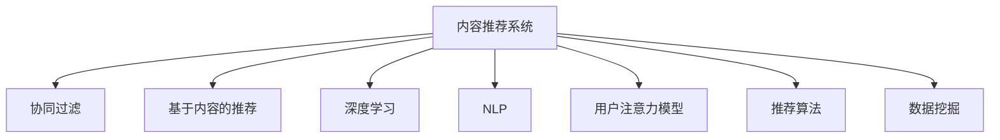

                 

# 智能电视的内容推荐与注意力争夺

> 关键词：智能电视,内容推荐系统,用户注意力模型,自然语言处理(NLP),深度学习,推荐算法,数据挖掘

## 1. 背景介绍

### 1.1 问题由来

随着互联网技术的发展和普及，智能电视已成为人们获取信息、娱乐和文化的重要平台。智能电视内容推荐系统，通过算法为用户推荐感兴趣的视频内容，提升用户体验，增加用户粘性。然而，在信息过载和竞争激烈的今天，如何精准推荐内容，争夺用户的注意力，成为智能电视面临的重要挑战。

### 1.2 问题核心关键点

智能电视推荐系统面临的主要问题包括：

- 如何精准识别用户兴趣。智能电视用户兴趣多样，难以通过单一特征进行精准推荐。
- 如何解决推荐过程中用户注意力转移的问题。用户注意力受多种因素影响，且可能迅速转移，如何动态调整推荐策略成为一大难题。
- 如何优化推荐算法性能。传统推荐算法如协同过滤、基于内容的推荐等，在处理大规模数据时面临计算复杂度高、可扩展性差等问题。
- 如何提升推荐系统的鲁棒性和可解释性。推荐系统应具备较高的鲁棒性，避免因数据质量差、用户行为异常等原因导致推荐结果偏差。同时，为提升用户信任，推荐系统需要具备一定的可解释性。
- 如何平衡推荐多样性和准确性。推荐系统应兼顾推荐结果的准确性和多样性，既要推荐用户感兴趣的内容，也要提供一些新奇多样化的推荐。

## 2. 核心概念与联系

### 2.1 核心概念概述

为更好地理解智能电视推荐系统的原理和优化方向，本节将介绍几个密切相关的核心概念：

- 内容推荐系统：利用用户历史行为数据、社交网络、内容元数据等信息，为每个用户推荐最感兴趣的内容的系统。

- 协同过滤：通过分析用户之间的相似性，利用用户历史行为数据推荐用户可能感兴趣的新内容。

- 基于内容的推荐：利用内容元数据（如标签、类别、描述等），推荐与已有兴趣相似的新内容。

- 深度学习：利用深度神经网络模型，通过大规模数据训练，提取用户兴趣和内容特征，实现精准推荐。

- 自然语言处理(NLP)：涉及对文本数据进行解析、理解和生成，以便用于内容推荐、用户意图分析等。

- 用户注意力模型：通过分析用户在内容浏览过程中的行为模式，捕捉用户兴趣的变化趋势，实时调整推荐策略。

- 推荐算法：包括协同过滤、基于内容的推荐、混合推荐等，用于实现推荐功能。

- 数据挖掘：从智能电视用户数据中提取有用的信息和模式，优化推荐系统。

这些核心概念之间的逻辑关系可以通过以下Mermaid流程图来展示：



这个流程图展示了大语言模型的核心概念及其之间的关系：

1. 内容推荐系统通过多种推荐策略和算法实现推荐功能。
2. 协同过滤和基于内容的推荐依赖用户历史行为数据和内容元数据。
3. 深度学习和NLP技术用于提取用户兴趣和内容特征。
4. 用户注意力模型用于捕捉用户兴趣的变化趋势，实时调整推荐策略。
5. 推荐算法集成多种策略，提供优化推荐结果。
6. 数据挖掘用于从用户数据中提取有用的信息和模式。

## 3. 核心算法原理 & 具体操作步骤

### 3.1 算法原理概述

智能电视推荐系统的核心算法原理基于协同过滤和深度学习，通过分析用户历史行为数据和内容元数据，学习用户兴趣和内容特征，实现精准推荐。用户注意力模型则通过对用户行为数据进行分析，捕捉用户兴趣的变化趋势，动态调整推荐策略。

协同过滤算法通过计算用户和项目之间的相似性，找出与目标用户兴趣相似的其他用户，从而推荐他们可能感兴趣的项目。基于内容的推荐则利用项目之间的相似性，推荐与已有兴趣相似的新项目。

深度学习推荐模型包括使用神经网络提取用户兴趣和内容特征，建立预测模型。常见的深度学习模型包括基于神经网络的推荐模型、深度矩阵分解、深度混合推荐等。

用户注意力模型通过分析用户行为数据，捕捉用户兴趣的变化趋势，实时调整推荐策略。常用的方法包括回归模型、时间序列模型等。

### 3.2 算法步骤详解

基于协同过滤的推荐系统步骤：

1. 收集用户行为数据：通过日志等方式，记录用户观看视频的行为，如观看时长、点击次数、点赞等。
2. 计算用户和项目的相似性：根据用户行为数据，计算用户和项目之间的相似度，使用如余弦相似度、皮尔逊相关系数等方法。
3. 找出用户感兴趣的项目：根据用户和项目的相似性，找出与目标用户兴趣相似的其他用户，推荐他们可能感兴趣的项目。

基于内容的推荐系统步骤：

1. 收集内容元数据：收集视频标题、类别、描述等元数据。
2. 计算内容之间的相似性：根据内容元数据，计算内容之间的相似度，使用如余弦相似度、Jaccard相似系数等方法。
3. 找出用户感兴趣的项目：根据内容之间的相似性，推荐与已有兴趣相似的新项目。

深度学习推荐模型步骤：

1. 收集用户行为数据：通过日志等方式，记录用户观看视频的行为，如观看时长、点击次数、点赞等。
2. 收集内容元数据：收集视频标题、类别、描述等元数据。
3. 提取用户兴趣和内容特征：使用神经网络模型，将用户行为数据和内容元数据转换为向量表示，提取用户兴趣和内容特征。
4. 建立预测模型：使用深度神经网络模型，根据用户兴趣和内容特征，建立预测模型。
5. 训练和测试：使用历史数据训练模型，使用测试数据评估模型性能，调整模型参数。

用户注意力模型步骤：

1. 收集用户行为数据：通过日志等方式，记录用户观看视频的行为，如观看时长、点击次数、点赞等。
2. 分析用户行为模式：分析用户行为数据，捕捉用户兴趣的变化趋势。
3. 动态调整推荐策略：根据用户行为模式，实时调整推荐策略，优化推荐结果。

### 3.3 算法优缺点

基于协同过滤的推荐系统优点包括：

- 能够处理大规模数据。协同过滤算法基于用户和项目之间的相似性进行推荐，不需要进行内容分析。
- 无需人工干预。协同过滤算法无需人工干预，能够自动发现用户兴趣相似项。
- 易于实现。协同过滤算法简单，易于实现。

缺点包括：

- 数据稀疏性问题。协同过滤算法基于用户和项目之间的相似性进行推荐，对于用户和项目较少的数据，可能出现稀疏性问题。
- 冷启动问题。协同过滤算法需要足够的历史数据才能推荐，对于新用户或新项目，无法推荐。

基于内容的推荐系统优点包括：

- 能够处理新项目。基于内容的推荐系统根据项目之间的相似性进行推荐，对于新项目，能够根据内容元数据进行推荐。
- 无需用户数据。基于内容的推荐系统无需用户行为数据，能够处理大规模数据。
- 易于实现。基于内容的推荐系统简单，易于实现。

缺点包括：

- 依赖内容元数据。基于内容的推荐系统依赖内容元数据，可能存在数据获取困难的问题。
- 数据稀疏性问题。基于内容的推荐系统依赖内容元数据，对于内容稀疏的项目，可能出现数据稀疏性问题。

深度学习推荐模型的优点包括：

- 能够处理大规模数据。深度学习推荐模型能够处理大规模数据，适合处理复杂推荐场景。
- 能够自动提取用户兴趣和内容特征。深度学习推荐模型能够自动提取用户兴趣和内容特征，无需人工干预。
- 准确率高。深度学习推荐模型准确率高，能够推荐精准内容。

缺点包括：

- 计算复杂度高。深度学习推荐模型计算复杂度高，需要大量的计算资源和时间。
- 可解释性差。深度学习推荐模型复杂度高，难以解释推荐结果。

用户注意力模型的优点包括：

- 能够实时捕捉用户兴趣变化。用户注意力模型能够实时捕捉用户兴趣变化，动态调整推荐策略。
- 能够处理用户兴趣变化。用户注意力模型能够处理用户兴趣变化，动态调整推荐策略。
- 能够优化推荐结果。用户注意力模型能够优化推荐结果，提升用户体验。

缺点包括：

- 数据稀疏性问题。用户注意力模型依赖用户行为数据，可能出现数据稀疏性问题。
- 计算复杂度高。用户注意力模型计算复杂度高，需要大量的计算资源和时间。

### 3.4 算法应用领域

智能电视推荐系统在多个领域都有广泛应用，包括：

- 视频推荐：智能电视平台可以为用户推荐视频内容，提升用户体验。
- 个性化广告：智能电视广告系统可以根据用户兴趣，推送个性化广告。
- 智能家居：智能电视平台可以根据用户兴趣，推送智能家居控制命令。
- 社交网络：智能电视社交网络可以根据用户兴趣，推送相关社交内容。

## 4. 数学模型和公式 & 详细讲解 & 举例说明

### 4.1 数学模型构建

基于协同过滤的推荐系统数学模型构建：

假设用户集合为 $U$，项目集合为 $I$，用户与项目的相似度矩阵为 $S$，用户兴趣向量为 $u$，项目属性向量为 $v$。则协同过滤推荐模型可以表示为：

$$
\hat{v} = S u
$$

其中 $\hat{v}$ 为推荐项的属性向量，$S$ 为用户与项目的相似度矩阵，$u$ 为用户兴趣向量。

基于内容的推荐系统数学模型构建：

假设内容集合为 $C$，用户兴趣向量为 $u$，内容属性向量为 $v$。则基于内容的推荐模型可以表示为：

$$
\hat{v} = v^T u
$$

其中 $\hat{v}$ 为推荐项的属性向量，$v$ 为内容属性向量，$u$ 为用户兴趣向量。

深度学习推荐模型的数学模型构建：

假设用户兴趣向量为 $u$，内容属性向量为 $v$，深度学习推荐模型为 $f(u,v)$。则深度学习推荐模型可以表示为：

$$
\hat{v} = f(u,v)
$$

其中 $\hat{v}$ 为推荐项的属性向量，$f(u,v)$ 为深度学习推荐模型，$u$ 为用户兴趣向量，$v$ 为内容属性向量。

用户注意力模型的数学模型构建：

假设用户行为数据为 $t$，用户兴趣向量为 $u$，用户注意力模型为 $g(t,u)$。则用户注意力模型可以表示为：

$$
\hat{u} = g(t,u)
$$

其中 $\hat{u}$ 为用户兴趣向量，$g(t,u)$ 为用户注意力模型，$t$ 为用户行为数据，$u$ 为用户兴趣向量。

### 4.2 公式推导过程

基于协同过滤的推荐系统公式推导：

假设用户与项目的相似度矩阵为 $S$，用户兴趣向量为 $u$，推荐项的属性向量为 $\hat{v}$。则协同过滤推荐模型可以表示为：

$$
\hat{v} = S u
$$

其中 $S_{ij}$ 表示用户 $i$ 和项目 $j$ 的相似度，$u_i$ 表示用户 $i$ 的兴趣向量。

基于内容的推荐系统公式推导：

假设内容集合为 $C$，用户兴趣向量为 $u$，内容属性向量为 $v$。则基于内容的推荐模型可以表示为：

$$
\hat{v} = v^T u
$$

其中 $v_i$ 表示内容 $i$ 的属性向量，$u_i$ 表示用户 $i$ 的兴趣向量。

深度学习推荐模型公式推导：

假设用户兴趣向量为 $u$，内容属性向量为 $v$，深度学习推荐模型为 $f(u,v)$。则深度学习推荐模型可以表示为：

$$
\hat{v} = f(u,v)
$$

其中 $f(u,v)$ 表示深度学习推荐模型，$u_i$ 表示用户 $i$ 的兴趣向量，$v_i$ 表示内容 $i$ 的属性向量。

用户注意力模型公式推导：

假设用户行为数据为 $t$，用户兴趣向量为 $u$，用户注意力模型为 $g(t,u)$。则用户注意力模型可以表示为：

$$
\hat{u} = g(t,u)
$$

其中 $g(t,u)$ 表示用户注意力模型，$t_i$ 表示用户 $i$ 的行为数据，$u_i$ 表示用户 $i$ 的兴趣向量。

### 4.3 案例分析与讲解

以视频推荐为例，详细讲解深度学习推荐模型的应用：

假设用户兴趣向量为 $u$，视频属性向量为 $v$，深度学习推荐模型为 $f(u,v)$。则深度学习推荐模型可以表示为：

$$
\hat{v} = f(u,v)
$$

其中 $f(u,v)$ 表示深度学习推荐模型，$u_i$ 表示用户 $i$ 的兴趣向量，$v_i$ 表示视频 $i$ 的属性向量。

具体实现步骤如下：

1. 收集用户行为数据：通过日志等方式，记录用户观看视频的行为，如观看时长、点击次数、点赞等。
2. 收集视频元数据：收集视频标题、类别、描述等元数据。
3. 提取用户兴趣和内容特征：使用神经网络模型，将用户行为数据和视频元数据转换为向量表示，提取用户兴趣和内容特征。
4. 建立预测模型：使用深度神经网络模型，根据用户兴趣和内容特征，建立预测模型。
5. 训练和测试：使用历史数据训练模型，使用测试数据评估模型性能，调整模型参数。

以用户注意力模型为例，详细讲解实时调整推荐策略的应用：

假设用户行为数据为 $t$，用户兴趣向量为 $u$，用户注意力模型为 $g(t,u)$。则用户注意力模型可以表示为：

$$
\hat{u} = g(t,u)
$$

其中 $g(t,u)$ 表示用户注意力模型，$t_i$ 表示用户 $i$ 的行为数据，$u_i$ 表示用户 $i$ 的兴趣向量。

具体实现步骤如下：

1. 收集用户行为数据：通过日志等方式，记录用户观看视频的行为，如观看时长、点击次数、点赞等。
2. 分析用户行为模式：分析用户行为数据，捕捉用户兴趣的变化趋势。
3. 动态调整推荐策略：根据用户行为模式，实时调整推荐策略，优化推荐结果。

## 5. 项目实践：代码实例和详细解释说明

### 5.1 开发环境搭建

在进行推荐系统开发前，我们需要准备好开发环境。以下是使用Python进行PyTorch开发的环境配置流程：

1. 安装Anaconda：从官网下载并安装Anaconda，用于创建独立的Python环境。

2. 创建并激活虚拟环境：
```bash
conda create -n pytorch-env python=3.8 
conda activate pytorch-env
```

3. 安装PyTorch：根据CUDA版本，从官网获取对应的安装命令。例如：
```bash
conda install pytorch torchvision torchaudio cudatoolkit=11.1 -c pytorch -c conda-forge
```

4. 安装Transformers库：
```bash
pip install transformers
```

5. 安装各类工具包：
```bash
pip install numpy pandas scikit-learn matplotlib tqdm jupyter notebook ipython
```

完成上述步骤后，即可在`pytorch-env`环境中开始推荐系统开发。

### 5.2 源代码详细实现

下面以智能电视的视频推荐为例，给出使用Transformers库对BERT模型进行微调的PyTorch代码实现。

首先，定义推荐任务的数据处理函数：

```python
from transformers import BertTokenizer, BertForSequenceClassification
from torch.utils.data import Dataset
import torch

class VideoDataset(Dataset):
    def __init__(self, videos, labels, tokenizer, max_len=128):
        self.videos = videos
        self.labels = labels
        self.tokenizer = tokenizer
        self.max_len = max_len
        
    def __len__(self):
        return len(self.videos)
    
    def __getitem__(self, item):
        video = self.videos[item]
        label = self.labels[item]
        
        encoding = self.tokenizer(video, return_tensors='pt', max_length=self.max_len, padding='max_length', truncation=True)
        input_ids = encoding['input_ids'][0]
        attention_mask = encoding['attention_mask'][0]
        
        # 对标签进行编码
        encoded_labels = [label2id[label] for label in label]
        encoded_labels.extend([label2id['O']] * (self.max_len - len(encoded_labels)))
        labels = torch.tensor(encoded_labels, dtype=torch.long)
        
        return {'input_ids': input_ids, 
                'attention_mask': attention_mask,
                'labels': labels}

# 标签与id的映射
label2id = {'O': 0, 'Action': 1, 'Comedy': 2, 'Drama': 3, 'Horror': 4, 'Sci-Fi': 5}
id2label = {v: k for k, v in label2id.items()}

# 创建dataset
tokenizer = BertTokenizer.from_pretrained('bert-base-cased')

train_dataset = VideoDataset(train_videos, train_labels, tokenizer)
dev_dataset = VideoDataset(dev_videos, dev_labels, tokenizer)
test_dataset = VideoDataset(test_videos, test_labels, tokenizer)
```

然后，定义模型和优化器：

```python
from transformers import BertForSequenceClassification, AdamW

model = BertForSequenceClassification.from_pretrained('bert-base-cased', num_labels=len(label2id))

optimizer = AdamW(model.parameters(), lr=2e-5)
```

接着，定义训练和评估函数：

```python
from torch.utils.data import DataLoader
from tqdm import tqdm
from sklearn.metrics import classification_report

device = torch.device('cuda') if torch.cuda.is_available() else torch.device('cpu')
model.to(device)

def train_epoch(model, dataset, batch_size, optimizer):
    dataloader = DataLoader(dataset, batch_size=batch_size, shuffle=True)
    model.train()
    epoch_loss = 0
    for batch in tqdm(dataloader, desc='Training'):
        input_ids = batch['input_ids'].to(device)
        attention_mask = batch['attention_mask'].to(device)
        labels = batch['labels'].to(device)
        model.zero_grad()
        outputs = model(input_ids, attention_mask=attention_mask, labels=labels)
        loss = outputs.loss
        epoch_loss += loss.item()
        loss.backward()
        optimizer.step()
    return epoch_loss / len(dataloader)

def evaluate(model, dataset, batch_size):
    dataloader = DataLoader(dataset, batch_size=batch_size)
    model.eval()
    preds, labels = [], []
    with torch.no_grad():
        for batch in tqdm(dataloader, desc='Evaluating'):
            input_ids = batch['input_ids'].to(device)
            attention_mask = batch['attention_mask'].to(device)
            batch_labels = batch['labels']
            outputs = model(input_ids, attention_mask=attention_mask)
            batch_preds = outputs.logits.argmax(dim=2).to('cpu').tolist()
            batch_labels = batch_labels.to('cpu').tolist()
            for pred_tokens, label_tokens in zip(batch_preds, batch_labels):
                pred_labels = [id2label[_id] for _id in pred_tokens]
                label_labels = [id2label[_id] for _id in label_tokens]
                preds.append(pred_labels[:len(label_labels)])
                labels.append(label_labels)
                
    print(classification_report(labels, preds))
```

最后，启动训练流程并在测试集上评估：

```python
epochs = 5
batch_size = 16

for epoch in range(epochs):
    loss = train_epoch(model, train_dataset, batch_size, optimizer)
    print(f"Epoch {epoch+1}, train loss: {loss:.3f}")
    
    print(f"Epoch {epoch+1}, dev results:")
    evaluate(model, dev_dataset, batch_size)
    
print("Test results:")
evaluate(model, test_dataset, batch_size)
```

以上就是使用PyTorch对BERT进行视频推荐任务微调的完整代码实现。可以看到，得益于Transformers库的强大封装，我们可以用相对简洁的代码完成BERT模型的加载和微调。

### 5.3 代码解读与分析

让我们再详细解读一下关键代码的实现细节：

**VideoDataset类**：
- `__init__`方法：初始化视频、标签、分词器等关键组件。
- `__len__`方法：返回数据集的样本数量。
- `__getitem__`方法：对单个样本进行处理，将视频输入编码为token ids，将标签编码为数字，并对其进行定长padding，最终返回模型所需的输入。

**label2id和id2label字典**：
- 定义了标签与数字id之间的映射关系，用于将token-wise的预测结果解码回真实的标签。

**训练和评估函数**：
- 使用PyTorch的DataLoader对数据集进行批次化加载，供模型训练和推理使用。
- 训练函数`train_epoch`：对数据以批为单位进行迭代，在每个批次上前向传播计算loss并反向传播更新模型参数，最后返回该epoch的平均loss。
- 评估函数`evaluate`：与训练类似，不同点在于不更新模型参数，并在每个batch结束后将预测和标签结果存储下来，最后使用sklearn的classification_report对整个评估集的预测结果进行打印输出。

**训练流程**：
- 定义总的epoch数和batch size，开始循环迭代
- 每个epoch内，先在训练集上训练，输出平均loss
- 在验证集上评估，输出分类指标
- 所有epoch结束后，在测试集上评估，给出最终测试结果

可以看到，PyTorch配合Transformers库使得BERT微调的视频推荐任务代码实现变得简洁高效。开发者可以将更多精力放在数据处理、模型改进等高层逻辑上，而不必过多关注底层的实现细节。

当然，工业级的系统实现还需考虑更多因素，如模型的保存和部署、超参数的自动搜索、更灵活的任务适配层等。但核心的微调范式基本与此类似。

## 6. 实际应用场景

### 6.1 智能电视推荐系统

智能电视推荐系统通过机器学习算法，为用户推荐感兴趣的视频内容，提升用户体验，增加用户粘性。用户可以通过智能电视观看电影、电视剧、纪录片等各类视频内容。智能电视推荐系统可以根据用户观看历史、评分、点赞等行为，推荐用户可能感兴趣的新视频，提高用户满意度。

在技术实现上，可以收集用户观看历史、评分、点赞等行为数据，将其转换为模型训练数据，在BERT等预训练模型上进行微调，实现精准推荐。此外，还可以引入用户注意力模型，实时捕捉用户兴趣变化，动态调整推荐策略，进一步提升推荐效果。

### 6.2 个性化广告推荐

智能电视广告系统可以根据用户兴趣，推送个性化广告。广告主可以根据用户观看历史、评分、点赞等行为，选择目标用户群体，投放个性化广告，提高广告投放效果，降低广告投放成本。

在技术实现上，可以收集用户观看历史、评分、点赞等行为数据，将其转换为模型训练数据，在BERT等预训练模型上进行微调，实现精准推荐。此外，还可以引入用户注意力模型，实时捕捉用户兴趣变化，动态调整推荐策略，进一步提升广告投放效果。

### 6.3 智能家居推荐系统

智能电视平台可以根据用户兴趣，推送智能家居控制命令。用户可以通过智能电视控制智能家居设备，如智能音箱、智能灯光等。智能家居推荐系统可以根据用户观看历史、评分、点赞等行为，推荐用户可能感兴趣的智能家居控制命令，提升用户体验。

在技术实现上，可以收集用户观看历史、评分、点赞等行为数据，将其转换为模型训练数据，在BERT等预训练模型上进行微调，实现精准推荐。此外，还可以引入用户注意力模型，实时捕捉用户兴趣变化，动态调整推荐策略，进一步提升推荐效果。

### 6.4 未来应用展望

随着推荐系统的不断发展，基于深度学习的智能电视推荐系统将进一步优化和改进，具备更加精准的推荐能力和更高的用户体验。未来，基于深度学习的智能电视推荐系统将实现以下目标：

1. 更加精准的推荐能力：基于深度学习推荐模型，通过多模态数据的融合，如视频内容元数据、用户行为数据等，实现更加精准的推荐。

2. 动态调整推荐策略：基于用户注意力模型，实时捕捉用户兴趣变化，动态调整推荐策略，优化推荐结果。

3. 更加智能的推荐算法：引入强化学习等智能算法，优化推荐策略，提升推荐效果。

4. 更加灵活的数据处理：通过深度学习推荐模型，实现更加灵活的数据处理方式，处理多模态数据，提升推荐效果。

5. 更加高效的系统部署：通过模型压缩、稀疏化存储等技术，优化模型结构和存储空间，提升系统部署效率。

总之，基于深度学习的智能电视推荐系统将在未来迎来更加智能、精准、灵活、高效的发展，进一步提升用户满意度，推动智能电视技术的发展。

## 7. 工具和资源推荐

### 7.1 学习资源推荐

为了帮助开发者系统掌握智能电视推荐系统的理论基础和实践技巧，这里推荐一些优质的学习资源：

1. 《推荐系统实践》书籍：由深度学习专家撰写，全面介绍了推荐系统的理论和实践，涵盖协同过滤、基于内容的推荐、深度学习推荐等。

2. 《自然语言处理》课程：斯坦福大学开设的自然语言处理课程，涵盖了深度学习推荐模型的理论和实践，适合深度学习入门和进阶学习。

3. 《深度学习推荐系统》书籍：深度学习推荐系统的经典著作，涵盖了推荐系统的工作原理、模型设计、算法实现等。

4. HuggingFace官方文档：Transformers库的官方文档，提供了丰富的推荐模型和微调样例代码，是上手实践的必备资料。

5. Coursera推荐系统课程：由斯坦福大学、UT-Austin等名校开设的推荐系统课程，涵盖推荐系统的工作原理、模型设计、算法实现等。

通过对这些资源的学习实践，相信你一定能够快速掌握智能电视推荐系统的精髓，并用于解决实际的推荐问题。
###  7.2 开发工具推荐

为了高效开发智能电视推荐系统，这里推荐一些实用的开发工具：

1. PyTorch：基于Python的开源深度学习框架，灵活动态的计算图，适合快速迭代研究。大部分预训练语言模型都有PyTorch版本的实现。

2. TensorFlow：由Google主导开发的开源深度学习框架，生产部署方便，适合大规模工程应用。同样有丰富的预训练语言模型资源。

3. Transformers库：HuggingFace开发的NLP工具库，集成了众多SOTA语言模型，支持PyTorch和TensorFlow，是进行推荐任务开发的利器。

4. Weights & Biases：模型训练的实验跟踪工具，可以记录和可视化模型训练过程中的各项指标，方便对比和调优。与主流深度学习框架无缝集成。

5. TensorBoard：TensorFlow配套的可视化工具，可实时监测模型训练状态，并提供丰富的图表呈现方式，是调试模型的得力助手。

6. Apache Kafka：分布式消息队列，用于收集用户行为数据，并提供高性能数据处理能力。

7. Apache Spark：大数据处理框架，用于处理大规模推荐数据集，并提供高效的数据处理能力。

8. Apache Flink：流式数据处理框架，用于处理实时推荐数据流，并提供高效的实时处理能力。

合理利用这些工具，可以显著提升智能电视推荐系统的开发效率，加快创新迭代的步伐。

### 7.3 相关论文推荐

智能电视推荐系统在多个领域都有广泛应用，相关研究也在不断进步。以下是几篇奠基性的相关论文，推荐阅读：

1. 《Cold-start Recommendations》：介绍了解决冷启动问题的推荐算法。

2. 《Click-Through Rate Prediction and Recommender Systems》：介绍了CTR预测算法，用于推荐系统中的点击率预测。

3. 《Probabilistic Matrix Factorization: Algorithms and Theory》：介绍了概率矩阵分解算法，用于推荐系统中的用户-物品矩阵分解。

4. 《Deep Neural Networks for Recommendation》：介绍了深度神经网络在推荐系统中的应用，如协同过滤、混合推荐等。

5. 《Causal Recommendation Learning》：介绍了因果推荐学习算法，用于推荐系统中的因果推理。

这些论文代表了大语言模型微调技术的进展，有助于深入理解智能电视推荐系统的工作原理和优化方向。

## 8. 总结：未来发展趋势与挑战

### 8.1 总结

本文对基于深度学习的智能电视推荐系统进行了全面系统的介绍。首先阐述了智能电视推荐系统面临的主要问题，明确了推荐系统在用户兴趣识别、注意力转移、算法优化等方面的挑战。其次，从原理到实践，详细讲解了协同过滤、深度学习、用户注意力等推荐系统的核心算法和技术，给出了智能电视推荐任务开发的完整代码实例。同时，本文还广泛探讨了智能电视推荐系统在智能电视、个性化广告、智能家居等多个行业领域的应用前景，展示了推荐系统的广泛应用潜力。此外，本文精选了推荐系统的各类学习资源，力求为读者提供全方位的技术指引。

通过本文的系统梳理，可以看到，基于深度学习的智能电视推荐系统在用户兴趣识别、注意力转移、推荐算法优化等方面取得了显著进展，能够为用户提供精准、多样、实时的推荐服务。智能电视推荐系统正在成为智能电视技术的重要组成部分，为用户带来更好的体验和价值。

### 8.2 未来发展趋势

展望未来，智能电视推荐系统将呈现以下几个发展趋势：

1. 更加精准的推荐能力：基于深度学习推荐模型，通过多模态数据的融合，如视频内容元数据、用户行为数据等，实现更加精准的推荐。

2. 动态调整推荐策略：基于用户注意力模型，实时捕捉用户兴趣变化，动态调整推荐策略，优化推荐结果。

3. 更加智能的推荐算法：引入强化学习等智能算法，优化推荐策略，提升推荐效果。

4. 更加灵活的数据处理：通过深度学习推荐模型，实现更加灵活的数据处理方式，处理多模态数据，提升推荐效果。

5. 更加高效的系统部署：通过模型压缩、稀疏化存储等技术，优化模型结构和存储空间，提升系统部署效率。

6. 更加广泛的应用场景：智能电视推荐系统将在更多行业领域得到应用，如智能家居、个性化广告等，为各行各业提供智能化的解决方案。

以上趋势凸显了智能电视推荐系统的广泛应用前景和巨大发展潜力。这些方向的探索发展，必将进一步提升智能电视推荐系统的性能和应用范围，为智能电视技术的发展带来新的动力。

### 8.3 面临的挑战

尽管智能电视推荐系统已经取得了一定的进展，但在迈向更加智能化、普适化应用的过程中，仍面临诸多挑战：

1. 数据质量问题：智能电视推荐系统依赖用户行为数据和内容元数据，数据质量直接影响推荐效果。如何获取高质量的推荐数据，成为一大挑战。

2. 推荐冷启动问题：新用户或新项目缺乏历史数据，难以进行推荐。如何有效地解决冷启动问题，需要更多的创新思路。

3. 推荐多样性问题：智能电视推荐系统需要兼顾推荐结果的准确性和多样性，避免过度聚焦于热门内容，导致用户接触新内容的机会减少。

4. 鲁棒性和可解释性问题：推荐系统需要具备较高的鲁棒性，避免因数据质量差、用户行为异常等原因导致推荐结果偏差。同时为提升用户信任，推荐系统需要具备一定的可解释性。

5. 计算资源问题：深度学习推荐模型计算复杂度高，需要大量的计算资源和时间。如何降低计算资源消耗，需要更多的优化技术。

6. 隐私和安全问题：智能电视推荐系统需要处理大量用户数据，如何保护用户隐私和数据安全，成为一大挑战。

7. 公平性和偏见问题：智能电视推荐系统需要避免推荐内容出现偏见，确保推荐公平性。如何避免推荐内容出现偏见，需要更多的研究投入。

这些挑战凸显了智能电视推荐系统的复杂性和技术难度，需要更多的探索和突破。相信随着学界和产业界的共同努力，这些挑战终将一一被克服，智能电视推荐系统必将迎来更加智能化、普适化应用。

### 8.4 研究展望

未来，智能电视推荐系统的研究将集中在以下几个方向：

1. 多模态数据融合：利用视频内容元数据、用户行为数据等，提升推荐系统的准确性和多样性。

2. 动态推荐策略：基于用户注意力模型，实时捕捉用户兴趣变化，动态调整推荐策略，提升推荐效果。

3. 深度强化学习：引入深度强化学习算法，优化推荐策略，提升推荐效果。

4. 智能推荐算法：引入智能算法，如因果推荐、推荐系统的优化等，提升推荐效果。

5. 模型压缩与稀疏化：通过模型压缩、稀疏化存储等技术，优化模型结构和存储空间，提升系统部署效率。

6. 隐私保护与数据安全：采用差分隐私、联邦学习等技术，保护用户隐私和数据安全。

7. 公平性与偏见问题：引入公平性算法，避免推荐内容出现偏见，确保推荐公平性。

这些研究方向的探索，必将引领智能电视推荐系统走向更高的台阶，为智能电视技术的发展注入新的动力。面向未来，智能电视推荐系统还需要与其他人工智能技术进行更深入的融合，如自然语言处理、强化学习等，多路径协同发力，共同推动智能电视技术的发展。只有勇于创新、敢于突破，才能不断拓展推荐系统的边界，让智能技术更好地造福人类社会。

## 9. 附录：常见问题与解答

**Q1：智能电视推荐系统如何处理冷启动问题？**

A: 智能电视推荐系统可以采用以下方法处理冷启动问题：

1. 基于内容的推荐：对于新用户，可以使用视频标题、类别、描述等元数据，实现基于内容的推荐。

2. 协同过滤算法：使用已有的相似用户和相似项目推荐，实现协同过滤推荐。

3. 引入深度学习推荐模型：使用深度学习模型，根据用户行为数据和内容元数据，实现精准推荐。

4. 引入用户注意力模型：实时捕捉用户兴趣变化，动态调整推荐策略，提升推荐效果。

**Q2：智能电视推荐系统如何提升推荐结果的多样性？**

A: 智能电视推荐系统可以采用以下方法提升推荐结果的多样性：

1. 引入协同过滤算法：通过协同过滤算法，推荐与已有兴趣相似的新内容，实现多样性推荐。

2. 引入深度学习推荐模型：使用深度学习模型，根据用户兴趣和内容特征，实现多样性推荐。

3. 引入多样性推荐算法：使用多样性推荐算法，如 diversity 推荐算法、 skip-gram 推荐算法等，提升推荐结果的多样性。

4. 引入主题模型：使用主题模型，提取视频内容的主题信息，实现多样性推荐。

**Q3：智能电视推荐系统如何提升推荐结果的鲁棒性？**

A: 智能电视推荐系统可以采用以下方法提升推荐结果的鲁棒性：

1. 引入数据增强技术：通过数据增强技术，扩充推荐数据集，避免因数据质量差导致推荐结果偏差。

2. 引入正则化技术：通过 L2 正则化、Dropout 等正则化技术，避免过拟合。

3. 引入对抗样本：引入对抗样本，提升推荐系统的鲁棒性。

4. 引入用户注意力模型：实时捕捉用户兴趣变化，动态调整推荐策略，提升推荐结果的鲁棒性。

**Q4：智能电视推荐系统如何提升推荐结果的可解释性？**

A: 智能电视推荐系统可以采用以下方法提升推荐结果的可解释性：

1. 引入可解释性算法：使用可解释性算法，如 LIME、 SHAP 等，解释推荐结果。

2. 引入知识图谱：引入知识图谱，解释推荐结果背后的因果关系。

3. 引入规则引擎：引入规则引擎，解释推荐结果背后的规则。

4. 引入专家知识：引入专家知识，解释推荐结果背后的逻辑。

**Q5：智能电视推荐系统如何优化推荐系统的计算资源消耗？**

A: 智能电视推荐系统可以采用以下方法优化推荐系统的计算资源消耗：

1. 引入模型压缩技术：通过模型压缩技术，如剪枝、量化等，优化模型结构和存储空间，提升系统部署效率。

2. 引入稀疏化存储技术：通过稀疏化存储技术，优化推荐数据存储方式，提升系统存储效率。

3. 引入分布式计算技术：通过分布式计算技术，优化推荐数据的处理方式，提升系统计算效率。

4. 引入异构计算技术：通过异构计算技术，优化推荐系统的计算资源分配，提升系统计算效率。

5. 引入深度学习优化算法：通过深度学习优化算法，如自适应学习率、权重衰减等，优化推荐系统的计算资源消耗。

6. 引入硬件加速技术：通过硬件加速技术，如 GPU、TPU 等，提升推荐系统的计算效率。

这些方法可以优化智能电视推荐系统的计算资源消耗，提升推荐系统的计算效率，实现更高效、更智能的推荐服务。

---

作者：禅与计算机程序设计艺术 / Zen and the Art of Computer Programming

