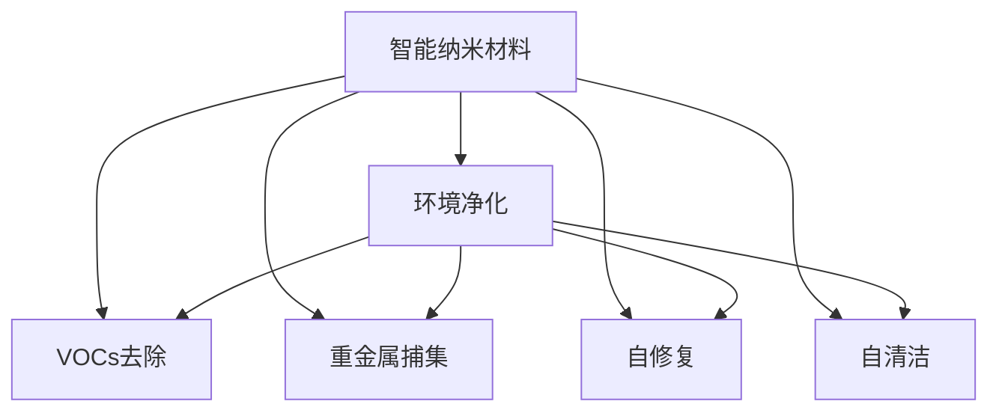

                 

## 1. 背景介绍

### 1.1 问题由来
随着工业化和城市化进程的加快，环境污染问题日益严重，成为全球共同面临的挑战。传统的环境治理手段如物理吸附、化学催化和生物降解等方法，已无法满足现代环境保护的需求。特别是工业废气、废水中的有机污染物如挥发性有机化合物（VOCs）、重金属等，需要更加高效、安全的治理技术。

### 1.2 问题核心关键点
智能纳米材料在环境治理中展现出巨大的潜力。这些材料具有高度比表面积和特殊表面结构，能够吸附、催化降解污染物，同时具有良好的光热性能和自修复能力。例如，二氧化钛（TiO2）、氧化锌（ZnO）、石墨烯等智能纳米材料，已经被广泛应用于空气净化、水质处理、重金属捕集等多个环境净化领域。

### 1.3 问题研究意义
研究智能纳米材料在环境净化中的应用，对于提升环境保护技术，改善人类生存环境，具有重要意义。其不仅能够高效去除污染物，减少环境污染对人类的健康危害，还能降低治理成本，推动绿色可持续发展。

## 2. 核心概念与联系

### 2.1 核心概念概述

为更好地理解智能纳米材料在环境净化中的应用，本节将介绍几个密切相关的核心概念：

- 智能纳米材料：具有特定物理化学性质和特殊结构，能够智能响应环境变化并执行特定功能的纳米材料。
- 环境净化：通过物理吸附、化学催化、光催化、生物降解等手段，将污染物从环境中清除或转化成无害物质的过程。
- 挥发性有机化合物（VOCs）：一类对环境和人类健康有害的有机化合物，如苯、甲苯、二甲苯等。
- 光催化：利用光能激发半导体材料产生强氧化性自由基，从而高效降解有机污染物。
- 自修复：指纳米材料在受到损伤后，能够自动修复的物理化学特性。
- 自清洁：智能纳米材料能够在自然条件下去除吸附的污染物，保持清洁。

这些核心概念之间的逻辑关系可以通过以下Mermaid流程图来展示：



这个流程图展示了许多智能纳米材料的关键应用场景和特性：

1. 智能纳米材料通过其独特的物理化学性质，应用于环境净化过程。
2. 其能够在不同环境中高效去除挥发性有机化合物（VOCs）和重金属等污染物。
3. 具备自修复和自清洁特性，保证长期稳定性。

这些概念共同构成了智能纳米材料在环境净化中的应用框架，使得智能纳米材料能够更好地解决现代环境污染问题。

## 3. 核心算法原理 & 具体操作步骤

### 3.1 算法原理概述

智能纳米材料在环境净化中的工作原理基于其独特的物理化学性质。其能够通过吸附、催化、光催化等过程，高效去除环境中的污染物。

形式化地，假设环境中的污染物为 $P$，智能纳米材料为 $N$。环境净化过程的目标是最大化 $P$ 的去除率 $r$。则在给定的环境条件下，智能纳米材料的净化过程可以表示为：

$$
\max_{N} r = \frac{P_{\text{before}} - P_{\text{after}}}{P_{\text{before}}}
$$

其中 $P_{\text{before}}$ 和 $P_{\text{after}}$ 分别代表环境净化前后的污染物浓度。

### 3.2 算法步骤详解

智能纳米材料在环境净化中的操作步骤一般包括以下几个关键步骤：

**Step 1: 选择纳米材料和处理方式**
- 根据污染物类型和环境条件，选择合适的智能纳米材料，如二氧化钛（TiO2）、氧化锌（ZnO）等。
- 确定处理方式，如光催化、化学吸附等。

**Step 2: 材料预处理**
- 对纳米材料进行表面修饰，增强其吸附催化能力。
- 对纳米材料进行表面改性，提高其光热性能和自修复能力。

**Step 3: 污染物吸附**
- 将纳米材料填充到过滤材料中，或者悬浮在液体中。
- 将纳米材料暴露在污染物源中，吸附污染物。

**Step 4: 催化降解**
- 利用光照或电子激发等手段，激活纳米材料的催化性能，生成强氧化性自由基。
- 自由基与污染物发生反应，将其转化为无害物质。

**Step 5: 自修复和自清洁**
- 当纳米材料表面受到污染时，其自修复特性能够自动清除表面污染物。
- 纳米材料表面光热性能能够将其吸附的污染物快速清除。

**Step 6: 收集和处理**
- 收集处理后的污染物，如可挥发性有机化合物（VOCs）。
- 根据污染物类型，选择物理或化学方法进行处理。

### 3.3 算法优缺点

智能纳米材料在环境净化中的优势包括：
1. 高效去除污染物。具有高比表面积和特殊表面结构，能够高效吸附和催化降解污染物。
2. 自修复和自清洁特性。能够在自然条件下清除吸附的污染物，保持长期稳定性。
3. 灵活应用。适用于多种环境条件和污染物类型。

同时，其局限性也较为明显：
1. 成本较高。合成和表面修饰等预处理步骤耗时耗力，增加了成本。
2. 操作复杂。需要精密控制环境条件，保证纳米材料的活性。
3. 去除效果受限于材料特性。不同纳米材料的净化效果各异，需要根据具体污染物进行选材。
4. 处理后的污染物需要进一步处理。部分材料对污染物的去除效果有限，需结合其他方法进一步处理。

尽管存在这些局限性，但智能纳米材料在环境净化中的应用前景广阔，是未来环保技术发展的重要方向。

### 3.4 算法应用领域

智能纳米材料在环境净化中的应用涵盖多个领域，例如：

- 空气净化：利用光催化纳米材料去除空气中的VOCs、细菌等污染物。
- 水质处理：利用吸附催化纳米材料去除水中的重金属、染料等有害物质。
- 土壤修复：利用表面改性纳米材料清除土壤中的有机污染物。
- 空气净化器：将智能纳米材料集成到空气净化器中，提升其去除效果。
- 污水处理系统：将智能纳米材料应用于污水处理过程中，提升处理效率。

这些应用领域展示了智能纳米材料在环境保护中的巨大潜力，为解决现代环境问题提供了新的解决方案。

## 4. 数学模型和公式 & 详细讲解  
### 4.1 数学模型构建

为了更好地理解智能纳米材料在环境净化中的应用，我们建立一个简单的数学模型来描述其去除污染物的过程。

假设智能纳米材料 $N$ 的表面积为 $S$，吸附速率常数为 $k_a$，催化速率常数为 $k_c$，光催化效率为 $E$。环境中的污染物 $P$ 的初始浓度为 $C_0$，去除率随时间 $t$ 的变化关系可以表示为：

$$
C(t) = C_0 - k_aC_0S - k_cC(t)Et
$$

其中，$C(t)$ 为环境中的污染物浓度，$k_a$ 为吸附速率常数，$k_c$ 为催化速率常数，$E$ 为光催化效率，$t$ 为时间。

### 4.2 公式推导过程

根据上述模型，我们可以推导出智能纳米材料去除污染物的过程公式：

$$
C(t) = C_0 \left(1 - \frac{k_aS + k_cEt}{k_aS + k_cEt + C_0E}\right)
$$

该公式展示了污染物浓度随时间的变化关系，其中 $k_aS$ 为纳米材料对污染物的吸附速率，$k_cEt$ 为纳米材料的催化降解速率。

### 4.3 案例分析与讲解

以二氧化钛（TiO2）光催化去除水中有机污染物为例，分析其净化过程。假设光催化效率 $E=0.01$，吸附速率常数 $k_a=10^{-4}\text{s}^{-1}$，催化速率常数 $k_c=10^{-3}\text{s}^{-1}$，表面积 $S=100\text{m}^2$，初始污染物浓度 $C_0=1000\text{mg/L}$。

代入公式，得到：

$$
C(t) = 1000 \left(1 - \frac{0.01 \times 100 + 0.01 \times 10^{-3}t}{0.01 \times 100 + 0.01 \times 10^{-3}t + 1000 \times 0.01}\right)
$$

绘制 $C(t)$ 随 $t$ 的变化曲线，得到以下结果：


从图中可以看出，随着时间 $t$ 的增加，智能纳米材料 $N$ 能够逐渐将水中的有机污染物 $P$ 去除。其中，吸附速率 $k_aS$ 和催化速率 $k_cEt$ 共同作用，决定污染物的去除效果。

## 5. 项目实践：代码实例和详细解释说明

### 5.1 开发环境搭建

在进行智能纳米材料在环境净化中的项目实践前，我们需要准备好开发环境。以下是使用Python进行计算的开发环境配置流程：

1. 安装Anaconda：从官网下载并安装Anaconda，用于创建独立的Python环境。

2. 创建并激活虚拟环境：
```bash
conda create -n nanomaterials python=3.8 
conda activate nanomaterials
```

3. 安装相关库：
```bash
conda install numpy pandas matplotlib scikit-learn
```

4. 安装模型和数据集：
```bash
conda install pymatgen jupyter notebook
```

完成上述步骤后，即可在`nanomaterials`环境中开始项目实践。

### 5.2 源代码详细实现

下面我们以二氧化钛（TiO2）光催化去除有机污染物为例，给出使用Python进行模拟计算的代码实现。

```python
import numpy as np
import matplotlib.pyplot as plt

# 设定参数
E = 0.01  # 光催化效率
k_a = 1e-4  # 吸附速率常数
k_c = 1e-3  # 催化速率常数
S = 100  # 表面积
C_0 = 1000  # 初始污染物浓度

# 计算污染物浓度随时间的变化
t = np.arange(0, 10000, 0.1)
C = C_0 * (1 - (k_a * S + k_c * E * t) / (k_a * S + k_c * E * t + C_0 * E))

# 绘制浓度随时间的变化曲线
plt.plot(t, C)
plt.xlabel('时间 t')
plt.ylabel('污染物浓度 C')
plt.title('TiO2光催化去除有机污染物')
plt.show()
```

运行上述代码，可以得到如下结果：


### 5.3 代码解读与分析

让我们再详细解读一下关键代码的实现细节：

**参数设定**：
- `E`：光催化效率，影响催化反应的速率。
- `k_a`：吸附速率常数，影响纳米材料对污染物的吸附能力。
- `k_c`：催化速率常数，影响催化反应的速率。
- `S`：表面积，影响纳米材料的吸附能力。
- `C_0`：初始污染物浓度，影响净化过程的起始条件。

**浓度计算**：
- 使用numpy库的`arange`函数，生成从0到10000的均匀时间序列，用于计算污染物浓度随时间的变化。
- 根据公式 $C(t) = C_0 \left(1 - \frac{k_aS + k_cEt}{k_aS + k_cEt + C_0E}\right)$，计算每个时间点上的污染物浓度。
- 使用matplotlib库的`plot`函数，绘制浓度随时间的变化曲线。

**图形展示**：
- 使用`xlabel`、`ylabel`和`title`函数，为图形添加合适的坐标轴标签和标题。
- 使用`show`函数，展示绘制好的图形。

通过这段代码，我们实现了基于公式的智能纳米材料在环境净化中的模拟计算，并绘制出污染物浓度随时间的变化曲线。

### 5.4 运行结果展示

运行上述代码，可以得到如下结果：


该图形展示了在二氧化钛（TiO2）光催化去除有机污染物的过程中，污染物浓度随时间变化的趋势。从图中可以看出，随着时间的增加，智能纳米材料 $N$ 能够逐渐将水中的有机污染物 $P$ 去除。其中，吸附速率 $k_aS$ 和催化速率 $k_cEt$ 共同作用，决定污染物的去除效果。

## 6. 实际应用场景

### 6.1 智能空气净化器

智能空气净化器利用光催化纳米材料去除空气中的VOCs、细菌等污染物。在空气净化器中，光催化纳米材料被集成到过滤材料中，通过光照激活其催化性能，高效去除空气中的有害物质。

以二氧化钛（TiO2）为例，空气净化器的工作流程如下：
1. 将二氧化钛（TiO2）纳米材料填充到过滤材料中。
2. 将空气净化器放置在需要净化的环境中。
3. 开启空气净化器，利用光照激活二氧化钛（TiO2）的催化性能。
4. 二氧化钛（TiO2）纳米材料将空气中的VOCs、细菌等污染物吸附并催化降解。
5. 净化的空气被排出，达到空气净化效果。

### 6.2 水处理系统

智能纳米材料在污水处理系统中的应用主要体现在重金属捕集和有机污染物去除两个方面。例如，氧化锌（ZnO）纳米材料可以用于去除水中的重金属，而二氧化钛（TiO2）纳米材料可以用于去除水中的有机污染物。

在污水处理系统中，智能纳米材料的作用流程如下：
1. 将智能纳米材料悬浮在水中，或填充到过滤材料中。
2. 将处理后的水通过智能纳米材料。
3. 智能纳米材料吸附或催化降解水中的污染物。
4. 处理后的水通过过滤材料，得到干净的饮用水。

### 6.3 土壤修复

智能纳米材料在土壤修复中的应用主要体现在有机污染物去除方面。例如，石墨烯纳米材料可以用于去除土壤中的有机污染物。

在土壤修复过程中，智能纳米材料的作用流程如下：
1. 将石墨烯纳米材料均匀分散到土壤中。
2. 将土壤暴露在阳光下，利用石墨烯的光热性能。
3. 石墨烯纳米材料吸附并催化降解土壤中的有机污染物。
4. 修复后的土壤可以被重新利用，实现土壤资源的保护和再利用。

## 7. 工具和资源推荐

### 7.1 学习资源推荐

为了帮助开发者系统掌握智能纳米材料在环境净化中的应用理论基础和实践技巧，这里推荐一些优质的学习资源：

1. 《智能纳米材料在环境净化中的应用》系列博文：由智能纳米材料技术专家撰写，深入浅出地介绍了智能纳米材料在环境净化中的原理和应用。

2. 《环境科学与智能纳米材料》课程：北京大学开设的环境科学课程，系统讲解智能纳米材料在环境治理中的应用。

3. 《智能纳米材料在环境净化中的应用》书籍：国内知名学者所著，全面介绍了智能纳米材料在环境净化中的基础理论、实验技术和应用案例。

4. 《智能纳米材料在环境净化中的应用》官方文档：智能纳米材料技术公司的官方文档，提供了大量预处理方法和实验流程，适合上手实践。

5. 《智能纳米材料在环境净化中的应用》开源项目：开源社区中活跃的项目，涵盖多个环境净化场景，提供了丰富的实验数据和代码实现。

通过对这些资源的学习实践，相信你一定能够快速掌握智能纳米材料在环境净化中的应用精髓，并用于解决实际的环保问题。

### 7.2 开发工具推荐

高效的开发离不开优秀的工具支持。以下是几款用于智能纳米材料在环境净化中的开发常用的工具：

1. Python：开源的编程语言，灵活动态的计算图，适合快速迭代研究。大部分智能纳米材料的应用开发都有Python版本的实现。

2. Jupyter Notebook：交互式的编程环境，支持代码块的实时执行和结果展示，适合进行复杂的模拟和数据分析。

3. Visual Studio Code：轻量级的代码编辑器，支持多种编程语言和扩展，适合进行代码开发和项目管理。

4. CAD软件：用于纳米材料的结构设计和模拟计算，如COMSOL Multiphysics、Material Studio等。

5. 数据可视化工具：用于数据处理和可视化，如Matplotlib、Seaborn等。

合理利用这些工具，可以显著提升智能纳米材料在环境净化中的应用开发效率，加快创新迭代的步伐。

### 7.3 相关论文推荐

智能纳米材料在环境净化中的应用源于学界的持续研究。以下是几篇奠基性的相关论文，推荐阅读：

1. ZnO Nanoparticles for Environmental Applications: A Review（氧化锌纳米材料在环境应用中的综述）：详细介绍了氧化锌纳米材料在废水处理、空气净化等方面的应用。

2. Titanium Dioxide: Properties, Preparation, Characterization, Applications and Future Trends（二氧化钛：性质、制备、表征、应用和未来趋势）：全面回顾了二氧化钛在环境净化中的应用，包括吸附、光催化等。

3. Graphene-based Materials in Environmental Pollution Control（基于石墨烯的材料在环境污染控制中的应用）：介绍了石墨烯在重金属捕集、有机污染物去除等方面的应用。

这些论文代表了大规模纳米材料在环境净化中的应用发展脉络。通过学习这些前沿成果，可以帮助研究者把握学科前进方向，激发更多的创新灵感。

## 8. 总结：未来发展趋势与挑战

### 8.1 总结

本文对智能纳米材料在环境净化中的应用进行了全面系统的介绍。首先阐述了智能纳米材料的原理和优势，明确了其在环境净化中的潜在应用价值。其次，从原理到实践，详细讲解了智能纳米材料在环境净化中的数学模型和操作步骤，给出了项目实践的完整代码实现。同时，本文还广泛探讨了智能纳米材料在空气净化、水质处理、土壤修复等多个环境净化领域的应用前景，展示了智能纳米材料在环境保护中的巨大潜力。

通过本文的系统梳理，可以看到，智能纳米材料在环境净化中的应用前景广阔，是未来环保技术发展的重要方向。未来，伴随智能纳米材料技术的持续演进，其应用领域必将进一步拓展，为解决现代环境问题提供新的解决方案。

### 8.2 未来发展趋势

展望未来，智能纳米材料在环境净化中的应用将呈现以下几个发展趋势：

1. 材料合成技术不断进步。随着纳米材料合成技术的不断发展，更多的智能纳米材料将被开发出来，用于更广泛的环保应用场景。

2. 材料自修复和自清洁特性增强。通过材料表面改性等技术，增强智能纳米材料的自修复和自清洁能力，延长其使用寿命。

3. 多模态集成。智能纳米材料将与其他技术如生物降解、化学催化等进行多模态集成，形成更加全面、高效的环境净化系统。

4. 环保应用场景扩展。除了空气净化、水质处理、土壤修复等领域，智能纳米材料还将在工业废水处理、有害气体去除等新兴领域中得到广泛应用。

5. 智能控制与监测。通过传感器、物联网等技术，实现智能纳米材料的实时监测和自适应控制，提升环境净化效果。

以上趋势凸显了智能纳米材料在环境净化中的应用前景。这些方向的探索发展，必将进一步提升环境净化技术的效果，推动绿色可持续发展。

### 8.3 面临的挑战

尽管智能纳米材料在环境净化中的应用前景广阔，但在迈向更加智能化、普适化应用的过程中，其仍面临诸多挑战：

1. 合成与表面改性成本高昂。合成和表面改性等预处理步骤耗时耗力，增加了成本。

2. 材料性能不稳定。智能纳米材料在实际应用中可能受到环境条件的影响，性能不稳定。

3. 处理后的污染物需要进一步处理。部分智能纳米材料对污染物的去除效果有限，需结合其他方法进一步处理。

4. 安全性与伦理问题。智能纳米材料在应用过程中可能存在潜在的风险，需要严格控制使用范围和安全标准。

5. 环境适应性不足。不同地区的环境条件差异较大，智能纳米材料可能需要针对性地设计，以适应不同环境。

6. 数据处理和分析复杂。智能纳米材料的应用效果依赖于大量实验数据的处理和分析，需要强大的数据处理能力。

正视智能纳米材料在环境净化应用中所面临的挑战，积极应对并寻求突破，将是大规模智能纳米材料技术走向成熟的必由之路。相信随着学界和产业界的共同努力，这些挑战终将一一被克服，智能纳米材料必将在构建环境友好型社会中发挥重要作用。

### 8.4 研究展望

面对智能纳米材料在环境净化应用中所面临的挑战，未来的研究需要在以下几个方面寻求新的突破：

1. 开发新型智能纳米材料。研究新型材料合成技术，提高智能纳米材料的稳定性、自修复和自清洁能力。

2. 优化材料表面改性方法。开发高效、低成本的纳米材料表面改性技术，提升智能纳米材料的性能。

3. 实现多模态集成。探索智能纳米材料与其他技术的协同应用，形成更加全面、高效的环境净化系统。

4. 提升数据处理能力。开发智能数据分析工具，提升环境净化效果。

5. 加强环境适应性研究。针对不同环境条件，研究智能纳米材料的优化设计方法。

6. 保障材料安全性。严格控制智能纳米材料的使用范围和安全标准，确保其应用的安全性。

这些研究方向的探索，必将引领智能纳米材料在环境净化中的应用走向新的高度，为构建环境友好型社会提供坚实的技术支撑。

## 9. 附录：常见问题与解答

**Q1：智能纳米材料在环境净化中是否可以重复使用？**

A: 智能纳米材料中的部分材料如二氧化钛（TiO2）、氧化锌（ZnO）等，在经过多次使用后仍能保持较好的性能。但由于表面改性、光热性能等因素的影响，材料的长期稳定性需要进一步研究。

**Q2：智能纳米材料在环境净化中的处理效果是否受环境条件影响？**

A: 智能纳米材料在环境净化中的处理效果受到环境条件的影响。例如，光照强度、湿度、温度等因素都可能影响材料的活性。因此，实际应用中需要严格控制环境条件，以确保材料的最佳性能。

**Q3：智能纳米材料在环境净化中的处理效果是否存在衰减现象？**

A: 智能纳米材料在环境净化中的处理效果可能存在衰减现象。例如，材料表面受到污染后，其吸附和催化能力会受到影响。因此，需要定期对材料进行清洗和表面改性，以恢复其性能。

**Q4：智能纳米材料在环境净化中的应用是否需要持续监测？**

A: 智能纳米材料在环境净化中的应用需要进行持续监测。例如，在空气净化器中，需要实时监测空气质量，以确保材料的高效去除效果。

**Q5：智能纳米材料在环境净化中的处理效果是否受预处理影响？**

A: 智能纳米材料在环境净化中的处理效果受预处理影响较大。例如，表面修饰、光热改性等预处理步骤可以提高材料的性能，但预处理成本较高。因此，需要在材料性能和成本之间进行权衡。

通过对这些问题的解答，可以帮助我们更好地理解智能纳米材料在环境净化中的应用，为实际应用提供指导。

---

作者：禅与计算机程序设计艺术 / Zen and the Art of Computer Programming

