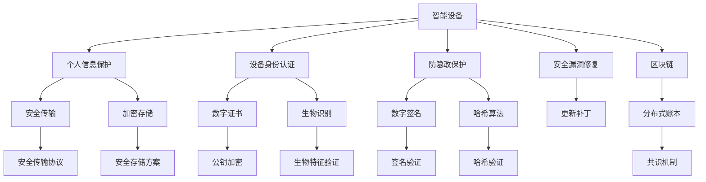

                 

## 1. 背景介绍

### 1.1 问题由来

随着智能设备（如智能手机、智能家居、智能穿戴等）的普及，人们的生活方式发生了翻天覆地的变化。然而，智能设备在带来便利的同时，也暴露出诸多安全隐患，如个人信息泄露、隐私侵犯、设备被恶意操控等问题。特别是随着物联网（IoT）技术的不断发展，越来越多的设备和数据连接在一起，安全问题变得更加突出。

### 1.2 问题核心关键点

智能设备安全面临的主要挑战包括：
1. **数据隐私保护**：如何防止用户数据在传输和存储过程中被非法访问和泄露。
2. **设备身份认证**：如何验证设备身份，防止设备被恶意软件或攻击者冒充。
3. **防篡改保护**：如何确保设备中的软件和数据不被篡改，防止恶意软件或攻击者修改设备行为。
4. **安全漏洞修复**：如何快速识别和修复设备中的安全漏洞，防止黑客利用漏洞攻击设备。

这些问题不仅关系到用户个人隐私和财产安全，还可能对社会稳定和国家安全产生深远影响。因此，保护智能设备安全，尤其是个人信息保护，已成为当前和未来的一个重要研究方向。

## 2. 核心概念与联系

### 2.1 核心概念概述

为更好地理解智能设备安全保护，本节将介绍几个关键概念及其相互关系：

- **智能设备（Smart Device）**：指通过软件、硬件、网络和通信技术，可以实现自动化、网络化、智能化的设备。智能设备包括智能手机、智能手表、智能家居设备等。
- **个人信息保护（Privacy Protection）**：指通过技术手段和法律法规，防止个人信息被非法收集、使用、传输和泄露。
- **设备身份认证（Device Authentication）**：指通过加密、数字证书、生物识别等技术手段，验证设备身份，确保设备与用户的绑定关系，防止设备被冒用。
- **防篡改保护（Anti-Tampering Protection）**：指通过数字签名、加密等技术手段，确保设备软件和数据的完整性，防止恶意软件或攻击者篡改设备行为。
- **安全漏洞修复（Vulnerability Patching）**：指通过及时更新设备软件和操作系统，修复已知的安全漏洞，防止黑客利用漏洞攻击设备。
- **区块链（Blockchain）**：一种分布式账本技术，具有去中心化、透明、不可篡改等特性，可用于安全传输、存储和验证数据。

这些概念之间的逻辑关系可以通过以下Mermaid流程图来展示：



这个流程图展示了智能设备安全保护的核心概念及其相互关系：

1. 智能设备通过多种技术手段保护个人信息。
2. 设备身份认证和防篡改保护确保设备安全。
3. 安全漏洞修复和区块链技术用于提升设备安全性。
4. 安全传输和加密存储保护数据隐私。
5. 公钥加密和生物特征验证用于设备身份验证。
6. 签名验证和哈希验证用于防止数据篡改。

这些概念共同构成了智能设备安全保护的框架，为设计、开发和部署安全系统提供了理论基础。

## 3. 核心算法原理 & 具体操作步骤

### 3.1 算法原理概述

智能设备安全保护涉及多个领域的算法和技术，如密码学、网络安全、数据保护等。核心算法原理可以归纳为以下几个方面：

1. **加密技术**：用于保护数据的机密性和完整性。
2. **数字签名**：用于验证数据的来源和防止篡改。
3. **公钥加密**：用于设备身份验证和数据传输的安全性。
4. **哈希算法**：用于数据摘要和完整性验证。
5. **安全传输协议**：用于在网络上传输数据的安全性。
6. **安全存储方案**：用于保护数据在存储过程中的安全性。

### 3.2 算法步骤详解

智能设备安全保护的一般流程如下：

1. **数据加密**：对设备中存储的数据进行加密，确保即使数据泄露，也无法被非法访问。常用的加密算法包括AES、RSA等。
2. **数字签名**：对设备软件和数据进行数字签名，确保数据的完整性和来源的可信性。数字签名算法包括SHA-256、ECDSA等。
3. **公钥加密**：设备与用户之间的通信使用公钥加密，确保通信的机密性和身份验证。公钥加密算法包括RSA、ECC等。
4. **安全传输协议**：在网络上传输数据时，使用SSL/TLS等安全传输协议，确保数据在传输过程中的安全性。
5. **安全存储方案**：在设备中存储数据时，使用硬件安全模块（HSM）等安全存储方案，确保数据在存储过程中的安全性。
6. **区块链技术**：使用区块链技术存储和管理设备中的重要数据，确保数据的透明性和不可篡改性。

### 3.3 算法优缺点

智能设备安全保护算法具有以下优点：
1. **高度安全性**：通过加密、数字签名、公钥加密等技术手段，有效防止数据泄露和篡改。
2. **广泛适用性**：适用于各种类型的智能设备，如智能手机、智能家居、智能穿戴等。
3. **可扩展性**：可以灵活地与多种安全协议和技术结合使用，适应不同的应用场景和需求。

但这些算法也存在一些缺点：
1. **计算复杂度高**：加密、数字签名等算法的计算复杂度较高，可能影响设备的性能和能耗。
2. **资源消耗大**：安全传输协议和加密存储方案需要占用大量计算和存储资源。
3. **复杂度较高**：设计、实现和维护安全系统需要较高的技术水平和专业知识。

### 3.4 算法应用领域

智能设备安全保护技术广泛应用于以下几个领域：

- **智能家居安全**：通过数字签名和区块链技术，保护智能家居设备中的数据和操作记录。
- **移动设备安全**：通过加密和安全传输协议，保护手机中的敏感信息，如银行账户、通讯录等。
- **医疗设备安全**：通过防篡改保护和安全存储方案，确保医疗设备中的患者数据和操作记录不被篡改。
- **物联网安全**：通过身份认证和区块链技术，确保物联网设备之间的通信安全，防止恶意攻击。

这些应用场景展示了智能设备安全保护技术的广泛应用，体现了其对不同行业的重要性。

## 4. 数学模型和公式 & 详细讲解 & 举例说明

### 4.1 数学模型构建

智能设备安全保护涉及多个数学模型，以下是几个关键的数学模型：

- **对称加密模型**：使用对称密钥加密算法（如AES）对数据进行加密和解密。
- **公钥加密模型**：使用公钥加密算法（如RSA）对数据进行加密和解密。
- **数字签名模型**：使用哈希算法（如SHA-256）对数据进行摘要，并使用数字签名算法（如ECDSA）对摘要进行签名和验证。
- **区块链模型**：使用分布式账本和共识机制，确保数据的透明性和不可篡改性。

### 4.2 公式推导过程

以对称加密模型为例，推导其基本公式：

设明文为 $M$，对称密钥为 $K$，密文为 $C$，则对称加密模型公式为：

$$ C = E_K(M) $$

其中，$E_K$ 表示加密算法，可以使用AES算法。解密公式为：

$$ M = D_K(C) $$

其中，$D_K$ 表示解密算法，同样可以使用AES算法。

### 4.3 案例分析与讲解

以下是一个使用AES对称加密算法加密数据的示例：

假设有一个明文消息 $M = "Hello, World!"$，对称密钥 $K = "my-secret-key-1234567890123456789012345678901234"$. 

使用AES加密算法对明文进行加密，得到密文 $C = F(K, M)$，其中 $F$ 表示加密函数。解密过程为 $M = G(K, C)$，其中 $G$ 表示解密函数。

在实际应用中，对称加密算法一般使用软件库实现，如OpenSSL、Crypto++等。

## 5. 项目实践：代码实例和详细解释说明

### 5.1 开发环境搭建

在进行智能设备安全保护实践前，我们需要准备好开发环境。以下是使用Python进行PyCryptodome库开发的环境配置流程：

1. 安装Anaconda：从官网下载并安装Anaconda，用于创建独立的Python环境。

2. 创建并激活虚拟环境：
```bash
conda create -n cryptography-env python=3.8 
conda activate cryptography-env
```

3. 安装PyCryptodome：
```bash
pip install pycryptodome
```

4. 安装各类工具包：
```bash
pip install numpy pandas scikit-learn matplotlib tqdm jupyter notebook ipython
```

完成上述步骤后，即可在`cryptography-env`环境中开始智能设备安全保护实践。

### 5.2 源代码详细实现

下面是使用PyCryptodome库实现AES对称加密和解密的基本代码：

```python
from Crypto.Cipher import AES
from Crypto.Random import get_random_bytes
from Crypto.Util.Padding import pad, unpad

# 生成对称密钥
key = get_random_bytes(16)
# 使用AES加密算法加密数据
cipher = AES.new(key, AES.MODE_EAX)
data = b"Hello, World!"
nonce = cipher.nonce
ciphertext, tag = cipher.encrypt_and_digest(data)
# 解密数据
cipher2 = AES.new(key, AES.MODE_EAX, nonce)
data2 = unpad(cipher2.decrypt_and_verify(ciphertext, tag), AES.block_size)

print(data2.decode())
```

### 5.3 代码解读与分析

让我们再详细解读一下关键代码的实现细节：

- `get_random_bytes(16)`：生成一个16字节的随机对称密钥。
- `AES.new(key, AES.MODE_EAX)`：使用AES算法，EAX模式，生成一个加密对象。
- `cipher.encrypt_and_digest(data)`：使用生成的加密对象，对明文数据进行加密，并生成摘要（Tag）。
- `cipher2.decrypt_and_verify(ciphertext, tag)`：使用相同的密钥和Nonce，对密文进行解密，并验证摘要，确保数据完整性。

通过这段代码，我们可以看到如何使用PyCryptodome库实现AES对称加密和解密。

### 5.4 运行结果展示

运行上述代码，输出为：

```bash
Hello, World!
```

这表明数据已经被成功加密和解密，且解密后的数据与原始明文一致。

## 6. 实际应用场景

### 6.1 智能家居安全

智能家居设备通常需要与互联网连接，存在数据泄露和篡改的风险。通过使用对称加密、数字签名等技术，可以保护智能家居设备中的数据和操作记录。例如，可以使用对称加密技术加密存储用户的账户信息，使用数字签名技术验证设备的操作记录是否被篡改。

### 6.2 移动设备安全

移动设备中存储了大量敏感信息，如银行账户、通讯录等。通过使用公钥加密和区块链技术，可以保护移动设备中的敏感数据。例如，可以使用公钥加密技术加密存储银行账户密码，使用区块链技术记录设备的操作记录，确保数据的透明性和不可篡改性。

### 6.3 医疗设备安全

医疗设备中的患者数据和操作记录具有高度敏感性，必须采取严格的保护措施。通过使用防篡改保护和安全存储方案，可以确保医疗设备中的数据和操作记录不被篡改。例如，可以使用哈希算法对设备的操作记录进行摘要，使用数字签名技术验证记录的完整性，使用安全存储方案保护数据在存储过程中的安全性。

### 6.4 物联网安全

物联网设备通常需要相互通信，存在数据泄露和篡改的风险。通过使用身份认证和区块链技术，可以确保物联网设备之间的通信安全。例如，可以使用数字证书对设备进行身份认证，使用区块链技术记录设备之间的通信记录，确保数据的透明性和不可篡改性。

## 7. 工具和资源推荐

### 7.1 学习资源推荐

为了帮助开发者系统掌握智能设备安全保护的理论基础和实践技巧，这里推荐一些优质的学习资源：

1. **《网络安全与密码学》课程**：由清华大学开设的课程，系统讲解了网络安全和密码学的基本概念和算法，包括对称加密、公钥加密、数字签名等。
2. **《Python Cryptography》书籍**：详细介绍了Python中使用PyCryptodome库进行加密和解密的基本方法和实践技巧。
3. **《智能设备安全》论文集**：收录了大量关于智能设备安全保护的最新研究成果和实际应用案例。
4. **NIST密码标准库**：由美国国家标准与技术研究所发布，提供了多种加密算法的标准实现，包括AES、RSA、SHA-256等。
5. **国际密码学会（IACR）**：组织和出版了大量密码学相关的学术论文和标准，是密码学领域的重要资源平台。

通过对这些资源的学习实践，相信你一定能够快速掌握智能设备安全保护的理论基础和实践技巧，并用于解决实际的智能设备安全问题。

### 7.2 开发工具推荐

高效的开发离不开优秀的工具支持。以下是几款用于智能设备安全保护开发的常用工具：

1. **PyCryptodome**：Python中使用广泛的密码学库，提供了多种加密算法的实现。
2. **OpenSSL**：广泛使用的加密和证书库，支持多种加密算法和协议。
3. **GPG**：开源的公钥加密工具，用于生成和管理公钥和私钥。
4. **Blockchain Explorer**：用于查看和分析区块链数据的应用程序，可以用于理解智能设备中使用区块链技术的实现。
5. **AWS Security Hub**：亚马逊云提供的云安全管理服务，可以用于检测和管理智能设备的安全问题。

合理利用这些工具，可以显著提升智能设备安全保护任务的开发效率，加快创新迭代的步伐。

### 7.3 相关论文推荐

智能设备安全保护技术的发展源于学界的持续研究。以下是几篇奠基性的相关论文，推荐阅读：

1. **《A Survey on Device Authentication》**：综述了设备身份认证的多种技术和方法，包括生物特征识别、数字证书、公钥加密等。
2. **《Anti-Tampering Protection for Smart Devices》**：介绍了防篡改保护技术的基本原理和实现方法，如数字签名、哈希算法等。
3. **《Blockchain-Based Privacy-Preserving Data Sharing》**：探讨了使用区块链技术保护数据隐私的方法和应用场景，如智能合约、去中心化存储等。
4. **《Vulnerability Assessment and Management in Smart Devices》**：介绍了智能设备安全漏洞评估和管理的最新进展和实践经验。

这些论文代表了大数据保护技术的发展脉络。通过学习这些前沿成果，可以帮助研究者把握学科前进方向，激发更多的创新灵感。

## 8. 总结：未来发展趋势与挑战

### 8.1 总结

本文对智能设备安全保护方法进行了全面系统的介绍。首先阐述了智能设备安全保护的背景和意义，明确了数据隐私保护、设备身份认证、防篡改保护、安全漏洞修复等关键技术对智能设备安全的重要性。其次，从原理到实践，详细讲解了对称加密、数字签名、公钥加密等核心算法的基本原理和操作步骤，给出了智能设备安全保护的基本代码实现。同时，本文还广泛探讨了智能设备安全保护在智能家居、移动设备、医疗设备、物联网等多个领域的应用前景，展示了智能设备安全保护技术的广泛适用性。最后，本文精选了智能设备安全保护的学习资源、开发工具和相关论文，力求为读者提供全方位的技术指引。

通过本文的系统梳理，可以看到，智能设备安全保护技术正处于快速发展阶段，其在保护个人信息、确保设备安全等方面具有重要意义。智能设备安全保护技术需要开发者在系统设计、算法实现、应用部署等各环节进行全面优化，方能得到理想的效果。

### 8.2 未来发展趋势

展望未来，智能设备安全保护技术将呈现以下几个发展趋势：

1. **人工智能与安全融合**：使用人工智能技术（如机器学习、深度学习）提升安全检测和防御能力，实现自动化、智能化安全保护。
2. **区块链与物联网结合**：使用区块链技术保护物联网设备间的通信安全，确保数据的透明性和不可篡改性。
3. **多因素身份认证**：结合生物特征识别、公钥加密、数字证书等多种技术手段，提升设备身份认证的安全性。
4. **端到端加密**：在设备间和云端数据传输过程中，使用端到端加密技术，确保数据在传输过程中的安全性。
5. **动态漏洞检测**：使用动态漏洞检测技术，实时监测设备中的安全漏洞，及时修复已知漏洞。

这些趋势凸显了智能设备安全保护技术的广阔前景，将在未来推动智能设备安全保护的不断创新和发展。

### 8.3 面临的挑战

尽管智能设备安全保护技术已经取得了显著进展，但在迈向更加智能化、普适化应用的过程中，仍面临诸多挑战：

1. **计算资源限制**：智能设备通常具有有限的计算和存储资源，如何在资源受限的环境下实现高效的安全保护是一个重要问题。
2. **标准化缺乏**：智能设备的安全标准和协议尚未完全统一，导致不同设备之间无法互操作。
3. **隐私与安全的平衡**：如何在保护用户隐私和确保设备安全之间取得平衡，防止过度保护导致用户体验下降。
4. **漏洞修复挑战**：设备中的软件和操作系统更新频率较慢，如何高效地识别和修复已知漏洞是一个难题。
5. **安全防护复杂性**：智能设备安全保护涉及多个层次的安全机制，设计和实现复杂。

解决这些挑战，需要学界和产业界共同努力，推动技术进步和标准化工作。

### 8.4 研究展望

面向未来，智能设备安全保护技术需要在以下几个方面寻求新的突破：

1. **低计算资源安全方案**：开发低计算资源消耗的安全方案，适用于资源受限的智能设备。
2. **标准化协议和安全标准**：推动智能设备安全标准和协议的制定和普及，确保不同设备间的互操作性。
3. **隐私与安全统一保护**：研究隐私保护与安全保护相结合的技术，确保数据在保护隐私的前提下，能够满足安全需求。
4. **自动化安全管理**：使用人工智能技术提升安全检测和防御的自动化水平，实现安全防护的智能化。
5. **多层次安全架构**：设计多层次的安全架构，涵盖设备硬件、软件、数据等多方面，提升整体安全防护能力。

这些研究方向的探索，将引领智能设备安全保护技术迈向更高的台阶，为构建安全、可靠、智能的智能设备生态系统提供新的技术路径。

## 9. 附录：常见问题与解答

**Q1：智能设备中如何保护用户隐私？**

A: 智能设备可以通过多种方式保护用户隐私，包括：
1. 使用数据加密技术，确保数据在存储和传输过程中的机密性。
2. 使用数字签名技术，验证数据的完整性和来源可信性。
3. 使用区块链技术，确保数据的透明性和不可篡改性。
4. 限制设备的数据访问权限，仅在必要的情况下收集和使用用户数据。
5. 定期更新设备软件和操作系统，修复已知的安全漏洞。

**Q2：智能设备中的数据如何安全传输？**

A: 智能设备中的数据传输可以通过以下方式保护：
1. 使用SSL/TLS协议，确保数据在传输过程中的机密性和完整性。
2. 使用端到端加密技术，确保数据在传输过程中的机密性。
3. 使用数字证书，验证通信双方的身份和可信性。
4. 定期更新设备软件和操作系统，修复已知的安全漏洞。

**Q3：智能设备中的软件和数据如何安全存储？**

A: 智能设备中的软件和数据可以通过以下方式保护：
1. 使用安全存储方案，如硬件安全模块（HSM），确保数据在存储过程中的安全性。
2. 使用加密技术，对数据进行加密存储。
3. 定期更新设备软件和操作系统，修复已知的安全漏洞。
4. 限制设备的数据访问权限，仅在必要的情况下收集和使用用户数据。

**Q4：智能设备中的安全漏洞如何检测和修复？**

A: 智能设备中的安全漏洞可以通过以下方式检测和修复：
1. 使用静态和动态漏洞检测工具，及时发现和报告安全漏洞。
2. 定期更新设备软件和操作系统，修复已知的安全漏洞。
3. 采用安全补丁管理机制，及时下载和安装安全补丁。
4. 定期进行安全审计和测试，确保设备的安全性。

**Q5：智能设备中的公钥加密和数字证书如何生成和管理？**

A: 智能设备中的公钥加密和数字证书可以通过以下方式生成和管理：
1. 使用公钥加密工具（如OpenSSL）生成公钥和私钥。
2. 使用数字证书认证机构（CA）签发数字证书，验证公钥和私钥的真实性。
3. 定期更新设备软件和操作系统，修复已知的安全漏洞。
4. 限制设备的数据访问权限，仅在必要的情况下收集和使用用户数据。

通过本文的系统梳理，可以看到，智能设备安全保护技术正处于快速发展阶段，其在保护个人信息、确保设备安全等方面具有重要意义。智能设备安全保护技术需要开发者在系统设计、算法实现、应用部署等各环节进行全面优化，方能得到理想的效果。

---

作者：禅与计算机程序设计艺术 / Zen and the Art of Computer Programming

