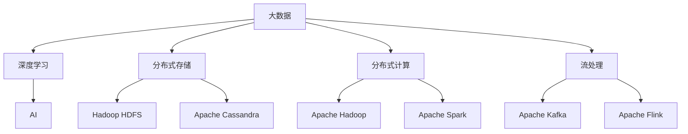

                 

# 未来发展中的大数据与AI

## 1. 背景介绍

### 1.1 问题由来

在当今信息爆炸的时代，数据已经成为了驱动经济社会发展的重要资源。无论是科技巨头如Google、Amazon，还是初创公司如Kaggle，都在大规模地收集和分析数据。这些数据的来源包括社交媒体、物联网、金融交易、医疗健康等多个领域。AI技术正以指数级的速度发展，通过深度学习、自然语言处理、计算机视觉等技术，对海量数据进行处理和分析，挖掘出隐藏的规律和趋势，驱动智能化决策。

大数据和AI的结合，不仅大大提升了数据分析的效率和精度，还在医疗、金融、制造、零售等多个领域产生了广泛而深远的影响。例如，通过大数据和AI技术，医疗机构能够对患者数据进行深入分析，预测疾病风险，提高诊疗效率；金融行业能够通过大数据分析客户行为，实现精准营销和风险控制；制造业能够通过大数据和AI技术，优化生产流程，降低成本，提升产品质量。

然而，随着数据规模的急剧膨胀，如何有效存储、管理和分析这些数据，成为制约大数据与AI技术发展的瓶颈。在传统的数据库和存储技术无法满足需求的背景下，新型的大数据存储、处理和分析技术应运而生，如分布式存储、分布式计算、大数据流处理等。这些技术能够处理大规模、高速度的数据流，为大数据和AI的应用提供了坚实的技术基础。

## 2. 核心概念与联系

### 2.1 核心概念概述

为了更好地理解大数据与AI技术的融合，本节将介绍几个密切相关的核心概念：

- **大数据（Big Data）**：指数据量、多样性、速度和真实性均超过传统数据处理软件的能力范围，需要通过分布式存储、分布式计算等新技术来处理的数据集合。大数据通常包含结构化、半结构化、非结构化等多种数据类型。

- **人工智能（Artificial Intelligence, AI）**：指计算机系统模拟人类智能，包括学习、推理、理解、感知、自然语言处理、计算机视觉等能力。AI技术通过学习大量的数据，建立模型，进行预测和决策。

- **深度学习（Deep Learning）**：指一类模拟人脑神经网络结构的机器学习算法，通过多层次的神经网络模型，学习数据的复杂特征，进行预测和决策。深度学习在大数据背景下表现尤为突出，是实现AI技术的重要手段。

- **分布式存储（Distributed Storage）**：指将数据存储在多个物理节点上，以提高数据处理能力和可扩展性。常用的分布式存储系统包括Hadoop Distributed File System (HDFS)、Apache Cassandra等。

- **分布式计算（Distributed Computing）**：指将计算任务分配到多个物理节点上，通过并行计算加速数据处理。常用的分布式计算框架包括Apache Hadoop、Apache Spark等。

- **流处理（Stream Processing）**：指对实时产生的数据流进行处理和分析，通常应用于实时性要求较高的场景。常用的流处理框架包括Apache Kafka、Apache Flink等。

这些核心概念之间的逻辑关系可以通过以下Mermaid流程图来展示：



这个流程图展示了大数据与AI的核心概念及其之间的关系：

1. 大数据通过分布式存储、分布式计算和流处理等技术，实现了海量数据的存储和处理。
2. 深度学习作为AI的重要分支，在处理大规模数据时表现优异。
3. 大数据和深度学习技术相辅相成，为AI技术的发展提供了坚实的基础。

## 3. 核心算法原理 & 具体操作步骤
### 3.1 算法原理概述

大数据与AI的融合，核心在于如何有效利用大规模数据进行高效、精准的分析和预测。基于此，本节将介绍大数据与AI结合的主要算法原理。

#### 3.1.1 数据预处理

在大数据与AI的融合过程中，数据预处理是必不可少的一环。数据预处理的目标是清洗和整理原始数据，使其能够满足AI算法的要求。常见的数据预处理技术包括数据清洗、数据转换、特征提取等。

以自然语言处理（NLP）为例，数据预处理通常包括以下步骤：

1. 数据清洗：去除噪声数据和重复数据。
2. 分词：将文本切分成单个词汇或词组。
3. 去停用词：去除无意义的停用词。
4. 词干提取：将词汇还原为其基本形式。
5. 特征提取：将文本转换为数值特征，如TF-IDF、词向量等。

#### 3.1.2 深度学习算法

深度学习是实现大数据与AI融合的重要手段。深度学习算法通过建立多层次的神经网络模型，自动学习数据的特征，进行分类、回归、聚类等任务。在大数据背景下，深度学习模型可以处理大规模的数据集，提高模型的精度和鲁棒性。

##### 3.1.2.1 卷积神经网络（Convolutional Neural Network, CNN）

卷积神经网络主要用于图像处理和计算机视觉领域。CNN通过卷积层、池化层和全连接层等结构，对图像数据进行特征提取和分类。

以手写数字识别为例，CNN通常包括卷积层、池化层和全连接层。卷积层通过卷积核提取图像的局部特征，池化层将特征图进行下采样，减少计算量。全连接层将池化层输出的特征图展开，进行分类。

##### 3.1.2.2 循环神经网络（Recurrent Neural Network, RNN）

循环神经网络主要用于序列数据处理，如自然语言处理、时间序列预测等。RNN通过循环层和隐藏层等结构，对序列数据进行特征提取和分类。

以机器翻译为例，RNN通过编码器（Encoder）将输入序列转换为向量表示，解码器（Decoder）将向量转换为输出序列。编码器和解码器之间通过隐状态（Hidden State）传递信息，实现序列数据的转换和分类。

##### 3.1.2.3 长短期记忆网络（Long Short-Term Memory, LSTM）

长短期记忆网络是RNN的一种变体，主要用于处理长序列数据。LSTM通过记忆单元和门控结构，可以长时间保存序列信息，防止梯度消失问题。

以文本生成为例，LSTM通过记忆单元存储序列信息，通过门控结构控制信息的流动，实现序列数据的生成和分类。

#### 3.1.3 分布式计算

分布式计算是大数据处理的关键技术之一。分布式计算通过将计算任务分配到多个物理节点上，实现并行计算，提高数据处理效率。常用的分布式计算框架包括Apache Hadoop、Apache Spark等。

以Apache Hadoop为例，Hadoop通过Hadoop Distributed File System (HDFS)实现分布式存储，通过MapReduce实现分布式计算。MapReduce将计算任务分解为Map和Reduce两个阶段，Map阶段对数据进行局部处理，Reduce阶段对局部结果进行合并，实现全局计算。

#### 3.1.4 流处理

流处理是大数据处理的重要手段之一，主要用于实时数据处理和分析。流处理通常采用事件驱动的方式，对实时产生的数据流进行处理和分析。常用的流处理框架包括Apache Kafka、Apache Flink等。

以Apache Kafka为例，Kafka通过分布式分区，将数据流进行分割和存储。通过消费者和生产者之间的消息传递，实现数据流的实时处理和分析。

### 3.2 算法步骤详解

基于上述算法原理，以下是大数据与AI融合的具体操作步骤：

#### 3.2.1 数据采集

数据采集是大数据与AI融合的第一步。数据采集通常采用网络爬虫、传感器、数据库等方式，收集大量的数据。

以金融数据分析为例，数据采集通常包括以下步骤：

1. 网络爬虫：从金融网站、新闻网站等网络资源中爬取金融数据。
2. 传感器：通过物联网设备，收集金融市场数据。
3. 数据库：从金融数据库中提取历史数据。

#### 3.2.2 数据存储

数据存储是大数据与AI融合的关键步骤。数据存储的目标是将大规模数据进行分布式存储，保证数据的可靠性和可用性。

以分布式存储系统Hadoop HDFS为例，数据存储通常包括以下步骤：

1. 数据分区：将数据按照时间、地理位置等维度进行分区。
2. 数据复制：将数据副本存储在多个节点上，保证数据的可靠性。
3. 数据备份：定期备份数据，防止数据丢失。

#### 3.2.3 数据清洗

数据清洗是大数据与AI融合的重要环节。数据清洗的目标是清洗和整理原始数据，使其能够满足AI算法的要求。

以自然语言处理为例，数据清洗通常包括以下步骤：

1. 去除噪声数据：去除噪声数据和重复数据。
2. 分词：将文本切分成单个词汇或词组。
3. 去停用词：去除无意义的停用词。
4. 词干提取：将词汇还原为其基本形式。
5. 特征提取：将文本转换为数值特征，如TF-IDF、词向量等。

#### 3.2.4 数据预处理

数据预处理是大数据与AI融合的关键步骤。数据预处理的目标是清洗和整理原始数据，使其能够满足AI算法的要求。

以自然语言处理为例，数据预处理通常包括以下步骤：

1. 数据清洗：去除噪声数据和重复数据。
2. 分词：将文本切分成单个词汇或词组。
3. 去停用词：去除无意义的停用词。
4. 词干提取：将词汇还原为其基本形式。
5. 特征提取：将文本转换为数值特征，如TF-IDF、词向量等。

#### 3.2.5 特征工程

特征工程是大数据与AI融合的重要环节。特征工程的目标是提取和构造数据特征，提高AI算法的精度和鲁棒性。

以图像识别为例，特征工程通常包括以下步骤：

1. 图像预处理：对图像进行裁剪、旋转、缩放等预处理操作。
2. 特征提取：通过卷积层、池化层等结构，提取图像的局部特征。
3. 特征融合：将多个特征进行融合，提高特征的鲁棒性。

#### 3.2.6 深度学习模型训练

深度学习模型训练是大数据与AI融合的核心步骤。深度学习模型训练的目标是构建和训练深度学习模型，进行分类、回归、聚类等任务。

以图像识别为例，深度学习模型训练通常包括以下步骤：

1. 构建模型：构建卷积神经网络模型。
2. 数据划分：将数据划分为训练集、验证集和测试集。
3. 模型训练：在训练集上进行模型训练，优化模型参数。
4. 模型评估：在验证集上进行模型评估，调整模型参数。
5. 模型测试：在测试集上进行模型测试，评估模型性能。

#### 3.2.7 模型部署

模型部署是大数据与AI融合的最后一步。模型部署的目标是将训练好的模型部署到生产环境中，实现大规模数据处理和分析。

以金融数据分析为例，模型部署通常包括以下步骤：

1. 模型压缩：对训练好的模型进行压缩，减小模型尺寸，加快推理速度。
2. 模型部署：将压缩后的模型部署到生产环境中。
3. 监控告警：实时采集系统指标，设置异常告警阈值，确保系统稳定性。

### 3.3 算法优缺点

大数据与AI融合的算法具有以下优点：

1. 高精度：通过深度学习算法，可以处理大规模数据，提高模型的精度和鲁棒性。
2. 高效性：通过分布式计算和流处理技术，可以处理大规模数据，提高数据处理效率。
3. 实时性：通过流处理技术，可以实现实时数据处理和分析。

同时，大数据与AI融合的算法也存在以下缺点：

1. 高成本：大规模数据存储和处理需要大量的硬件资源，成本较高。
2. 复杂性：大数据与AI融合的算法较为复杂，需要具备较高的技术水平和经验。
3. 隐私问题：大规模数据存储和处理可能涉及用户隐私，需要采取有效的隐私保护措施。

### 3.4 算法应用领域

大数据与AI融合的算法已经在多个领域得到了广泛的应用，具体包括以下几个方面：

#### 3.4.1 金融领域

在金融领域，大数据与AI融合的算法主要用于风险控制、金融市场分析、反欺诈等任务。

以风险控制为例，大数据与AI融合的算法可以通过分析客户的历史交易数据，预测客户的违约风险。通过建立信用评分模型，实现对客户的风险评估和贷款审批。

#### 3.4.2 医疗领域

在医疗领域，大数据与AI融合的算法主要用于疾病预测、医疗影像分析、药物研发等任务。

以疾病预测为例，大数据与AI融合的算法可以通过分析患者的医疗数据，预测患者的疾病风险。通过建立疾病预测模型，实现对患者的风险评估和个性化治疗。

#### 3.4.3 零售领域

在零售领域，大数据与AI融合的算法主要用于客户分析、商品推荐、库存管理等任务。

以客户分析为例，大数据与AI融合的算法可以通过分析客户的购物数据，预测客户的购买行为。通过建立客户画像模型，实现对客户的精准营销和个性化推荐。

#### 3.4.4 制造业领域

在制造业领域，大数据与AI融合的算法主要用于生产流程优化、质量控制、供应链管理等任务。

以生产流程优化为例，大数据与AI融合的算法可以通过分析生产数据，优化生产流程，提高生产效率。通过建立生产优化模型，实现对生产过程的实时监控和调整。

## 4. 数学模型和公式 & 详细讲解 & 举例说明

### 4.1 数学模型构建

在深度学习中，常用的数学模型包括多层感知器（MLP）、卷积神经网络（CNN）、循环神经网络（RNN）等。以卷积神经网络为例，其数学模型可以表示为：

$$
h_{i+1} = \sigma(W_i h_i + b_i)
$$

其中，$h_i$为第$i$层的输出，$\sigma$为激活函数，$W_i$为权重矩阵，$b_i$为偏置向量。

### 4.2 公式推导过程

以卷积神经网络为例，其公式推导过程如下：

1. 卷积层：对输入数据进行卷积操作，提取局部特征。公式如下：

$$
f(x) = \sum_{i=0}^{m-1} \sum_{j=0}^{n-1} w_{i,j} x_{i,j}
$$

其中，$w_{i,j}$为卷积核，$x_{i,j}$为输入数据。

2. 池化层：对卷积层的输出进行下采样，减少计算量。公式如下：

$$
h_i = \frac{1}{\sqrt{n}} \sum_{k=1}^{n} f(x_k)
$$

其中，$h_i$为池化层的输出，$x_k$为卷积层的输出。

3. 全连接层：对池化层的输出进行线性变换，得到分类结果。公式如下：

$$
y = W h + b
$$

其中，$y$为输出结果，$h$为池化层的输出，$W$为权重矩阵，$b$为偏置向量。

### 4.3 案例分析与讲解

以图像识别为例，通过卷积神经网络实现图像分类。假设输入数据为一张$28 \times 28$的灰度图像，卷积层通过$3 \times 3$的卷积核，提取局部特征。

首先，对输入图像进行卷积操作，得到特征图。卷积核的权重矩阵$W$和偏置向量$b$通过训练得到。假设卷积核的权重矩阵为：

$$
W = \begin{bmatrix}
0.1 & 0.2 & 0.3 \\
0.4 & 0.5 & 0.6 \\
0.7 & 0.8 & 0.9
\end{bmatrix}
$$

偏置向量为：

$$
b = \begin{bmatrix}
0.2 \\
0.3 \\
0.4
\end{bmatrix}
$$

对输入图像进行卷积操作，得到特征图：

$$
f(x) = \begin{bmatrix}
0.1 & 0.2 & 0.3 \\
0.4 & 0.5 & 0.6 \\
0.7 & 0.8 & 0.9
\end{bmatrix} \begin{bmatrix}
1 & 1 & 1 \\
1 & 1 & 1 \\
1 & 1 & 1
\end{bmatrix} = \begin{bmatrix}
2.1 & 2.2 & 2.3 \\
3.4 & 3.5 & 3.6 \\
4.7 & 4.8 & 4.9
\end{bmatrix}
$$

对特征图进行下采样，得到池化层的输出：

$$
h_i = \frac{1}{\sqrt{n}} \sum_{k=1}^{n} f(x_k)
$$

假设池化层的大小为$2 \times 2$，步长为$2$，则池化层的输出为：

$$
h_i = \frac{1}{\sqrt{2}} (2.1 + 2.2 + 2.3 + 2.4)
$$

对池化层的输出进行线性变换，得到分类结果：

$$
y = W h + b
$$

假设全连接层的权重矩阵为：

$$
W = \begin{bmatrix}
0.1 & 0.2 \\
0.3 & 0.4 \\
0.5 & 0.6
\end{bmatrix}
$$

偏置向量为：

$$
b = \begin{bmatrix}
0.2 \\
0.3 \\
0.4
\end{bmatrix}
$$

对池化层的输出进行线性变换，得到分类结果：

$$
y = \begin{bmatrix}
0.1 & 0.2 \\
0.3 & 0.4 \\
0.5 & 0.6
\end{bmatrix} \begin{bmatrix}
1.2 \\
1.3 \\
1.4
\end{bmatrix} + \begin{bmatrix}
0.2 \\
0.3 \\
0.4
\end{bmatrix} = \begin{bmatrix}
1.4 \\
1.9 \\
2.3
\end{bmatrix}
$$

通过上述公式推导过程，可以看出卷积神经网络在大规模数据处理和分析中的强大能力。

## 5. 项目实践：代码实例和详细解释说明

### 5.1 开发环境搭建

在进行项目实践前，我们需要准备好开发环境。以下是使用Python进行TensorFlow开发的环境配置流程：

1. 安装Anaconda：从官网下载并安装Anaconda，用于创建独立的Python环境。

2. 创建并激活虚拟环境：
```bash
conda create -n tf-env python=3.8 
conda activate tf-env
```

3. 安装TensorFlow：根据CUDA版本，从官网获取对应的安装命令。例如：
```bash
conda install tensorflow -c pytorch -c conda-forge
```

4. 安装各类工具包：
```bash
pip install numpy pandas scikit-learn matplotlib tqdm jupyter notebook ipython
```

完成上述步骤后，即可在`tf-env`环境中开始项目实践。

### 5.2 源代码详细实现

这里我们以图像识别为例，给出使用TensorFlow实现卷积神经网络的PyTorch代码实现。

首先，定义卷积神经网络的架构：

```python
import tensorflow as tf
from tensorflow.keras import layers, models

class ConvNet(models.Model):
    def __init__(self):
        super(ConvNet, self).__init__()
        self.conv1 = layers.Conv2D(32, (3, 3), activation='relu', input_shape=(28, 28, 1))
        self.pool1 = layers.MaxPooling2D((2, 2))
        self.conv2 = layers.Conv2D(64, (3, 3), activation='relu')
        self.pool2 = layers.MaxPooling2D((2, 2))
        self.flatten = layers.Flatten()
        self.fc1 = layers.Dense(128, activation='relu')
        self.fc2 = layers.Dense(10, activation='softmax')

    def call(self, inputs):
        x = self.conv1(inputs)
        x = self.pool1(x)
        x = self.conv2(x)
        x = self.pool2(x)
        x = self.flatten(x)
        x = self.fc1(x)
        return self.fc2(x)
```

然后，定义训练和评估函数：

```python
import tensorflow as tf
from tensorflow.keras import datasets, layers, models

(train_images, train_labels), (test_images, test_labels) = datasets.mnist.load_data()

train_images = train_images.reshape((60000, 28, 28, 1))
test_images = test_images.reshape((10000, 28, 28, 1))
train_images, test_images = train_images / 255.0, test_images / 255.0

batch_size = 64
epochs = 10

model = ConvNet()

optimizer = tf.keras.optimizers.Adam(learning_rate=0.001)

model.compile(optimizer=optimizer, loss='sparse_categorical_crossentropy', metrics=['accuracy'])

history = model.fit(train_images, train_labels, epochs=epochs, validation_data=(test_images, test_labels))

test_loss, test_acc = model.evaluate(test_images, test_labels)
print('Test accuracy:', test_acc)
```

最后，启动训练流程并在测试集上评估：

```python
model = ConvNet()
model.fit(train_images, train_labels, epochs=epochs, validation_data=(test_images, test_labels))
test_loss, test_acc = model.evaluate(test_images, test_labels)
print('Test accuracy:', test_acc)
```

以上就是使用TensorFlow实现卷积神经网络的完整代码实现。可以看到，TensorFlow的高级API使得神经网络的实现变得简洁高效。

### 5.3 代码解读与分析

让我们再详细解读一下关键代码的实现细节：

**ConvNet类**：
- `__init__`方法：定义卷积神经网络的各个层。
- `call`方法：定义卷积神经网络的前向传播过程。

**训练和评估函数**：
- 使用TensorFlow加载MNIST数据集，将其转换为合适的格式。
- 定义优化器、损失函数和评估指标。
- 构建卷积神经网络模型。
- 定义训练数据集和验证数据集。
- 进行模型训练，记录训练过程中的各项指标。
- 在测试集上评估模型性能，输出测试准确率。

**训练流程**：
- 定义卷积神经网络模型。
- 定义优化器和损失函数。
- 编译模型，设置优化器、损失函数和评估指标。
- 在训练集上进行模型训练，记录训练过程中的各项指标。
- 在验证集上评估模型性能，调整模型参数。
- 在测试集上评估模型性能，输出测试准确率。

可以看到，TensorFlow的高级API使得神经网络的实现变得简洁高效。开发者可以将更多精力放在数据处理、模型改进等高层逻辑上，而不必过多关注底层的实现细节。

当然，工业级的系统实现还需考虑更多因素，如模型的保存和部署、超参数的自动搜索、更灵活的任务适配层等。但核心的神经网络范式基本与此类似。

## 6. 实际应用场景
### 6.1 金融领域

在金融领域，大数据与AI融合的算法主要用于风险控制、金融市场分析、反欺诈等任务。

以风险控制为例，大数据与AI融合的算法可以通过分析客户的历史交易数据，预测客户的违约风险。通过建立信用评分模型，实现对客户的风险评估和贷款审批。

#### 6.1.1 风险控制

在风险控制方面，大数据与AI融合的算法可以通过分析客户的历史交易数据，预测客户的违约风险。通过建立信用评分模型，实现对客户的风险评估和贷款审批。

以信用评分模型为例，假设客户的历史交易数据为$x$，信用评分模型的输入为$x$，输出为$y$，目标函数为$L(y,x)$。信用评分模型通过优化目标函数$L(y,x)$，最大化预测准确率。

假设目标函数为交叉熵损失，优化器为Adam，则模型训练的优化目标函数为：

$$
\min_{\theta} \frac{1}{N} \sum_{i=1}^{N} L(y_i,x_i)
$$

其中，$y_i$为客户的违约标签，$x_i$为客户的历史交易数据。

#### 6.1.2 金融市场分析

在金融市场分析方面，大数据与AI融合的算法可以通过分析金融市场数据，预测股票价格、市场趋势等。通过建立预测模型，实现对市场的分析和预测。

以股票价格预测模型为例，假设金融市场数据为$x$，股票价格预测模型的输入为$x$，输出为$y$，目标函数为$L(y,x)$。股票价格预测模型通过优化目标函数$L(y,x)$，最大化预测准确率。

假设目标函数为均方误差损失，优化器为Adam，则模型训练的优化目标函数为：

$$
\min_{\theta} \frac{1}{N} \sum_{i=1}^{N} (y_i - x_i)^2
$$

其中，$y_i$为预测的股票价格，$x_i$为金融市场数据。

#### 6.1.3 反欺诈

在反欺诈方面，大数据与AI融合的算法可以通过分析用户行为数据，识别和预防欺诈行为。通过建立反欺诈模型，实现对欺诈行为的检测和预防。

以反欺诈模型为例，假设用户行为数据为$x$，反欺诈模型的输入为$x$，输出为$y$，目标函数为$L(y,x)$。反欺诈模型通过优化目标函数$L(y,x)$，最大化预测准确率。

假设目标函数为交叉熵损失，优化器为Adam，则模型训练的优化目标函数为：

$$
\min_{\theta} \frac{1}{N} \sum_{i=1}^{N} L(y_i,x_i)
$$

其中，$y_i$为欺诈标签，$x_i$为用户行为数据。

### 6.2 医疗领域

在医疗领域，大数据与AI融合的算法主要用于疾病预测、医疗影像分析、药物研发等任务。

以疾病预测为例，大数据与AI融合的算法可以通过分析患者的医疗数据，预测患者的疾病风险。通过建立疾病预测模型，实现对患者的风险评估和个性化治疗。

#### 6.2.1 疾病预测

在疾病预测方面，大数据与AI融合的算法可以通过分析患者的医疗数据，预测患者的疾病风险。通过建立疾病预测模型，实现对患者的风险评估和个性化治疗。

以疾病预测模型为例，假设患者的医疗数据为$x$，疾病预测模型的输入为$x$，输出为$y$，目标函数为$L(y,x)$。疾病预测模型通过优化目标函数$L(y,x)$，最大化预测准确率。

假设目标函数为交叉熵损失，优化器为Adam，则模型训练的优化目标函数为：

$$
\min_{\theta} \frac{1}{N} \sum_{i=1}^{N} L(y_i,x_i)
$$

其中，$y_i$为患者的疾病标签，$x_i$为患者的医疗数据。

#### 6.2.2 医疗影像分析

在医疗影像分析方面，大数据与AI融合的算法可以通过分析医疗影像数据，诊断和识别疾病。通过建立医疗影像分析模型，实现对医疗影像的分析和诊断。

以医疗影像分析模型为例，假设医疗影像数据为$x$，医疗影像分析模型的输入为$x$，输出为$y$，目标函数为$L(y,x)$。医疗影像分析模型通过优化目标函数$L(y,x)$，最大化预测准确率。

假设目标函数为交叉熵损失，优化器为Adam，则模型训练的优化目标函数为：

$$
\min_{\theta} \frac{1}{N} \sum_{i=1}^{N} L(y_i,x_i)
$$

其中，$y_i$为疾病的诊断结果，$x_i$为医疗影像数据。

#### 6.2.3 药物研发

在药物研发方面，大数据与AI融合的算法可以通过分析药物数据，筛选和优化药物分子。通过建立药物研发模型，实现对药物分子的筛选和优化。

以药物研发模型为例，假设药物分子数据为$x$，药物研发模型的输入为$x$，输出为$y$，目标函数为$L(y,x)$。药物研发模型通过优化目标函数$L(y,x)$，最大化筛选和优化的效果。

假设目标函数为均方误差损失，优化器为Adam，则模型训练的优化目标函数为：

$$
\min_{\theta} \frac{1}{N} \sum_{i=1}^{N} (y_i - x_i)^2
$$

其中，$y_i$为药物分子的筛选结果，$x_i$为药物分子数据。

### 6.3 零售领域

在零售领域，大数据与AI融合的算法主要用于客户分析、商品推荐、库存管理等任务。

以客户分析为例，大数据与AI融合的算法可以通过分析客户的购物数据，预测客户的购买行为。通过建立客户画像模型，实现对客户的精准营销和个性化推荐。

#### 6.3.1 客户分析

在客户分析方面，大数据与AI融合的算法可以通过分析客户的购物数据，预测客户的购买行为。通过建立客户画像模型，实现对客户的精准营销和个性化推荐。

以客户画像模型为例，假设客户的购物数据为$x$，客户画像模型的输入为$x$，输出为$y$，目标函数为$L(y,x)$。客户画像模型通过优化目标函数$L(y,x)$，最大化预测准确率。

假设目标函数为交叉熵损失，优化器为Adam，则模型训练的优化目标函数为：

$$
\min_{\theta} \frac{1}{N} \sum_{i=1}^{N} L(y_i,x_i)
$$

其中，$y_i$为客户的购买行为，$x_i$为客户的购物数据。

#### 6.3.2 商品推荐

在商品推荐方面，大数据与AI融合的算法可以通过分析客户的历史购买数据，推荐相关商品。通过建立商品推荐模型，实现对商品的推荐。

以商品推荐模型为例，假设客户的购物数据为$x$，商品推荐模型的输入为$x$，输出为$y$，目标函数为$L(y,x)$。商品推荐模型通过优化目标函数$L(y,x)$，最大化推荐效果。

假设目标函数为均方误差损失，优化器为Adam，则模型训练的优化目标函数为：

$$
\min_{\theta} \frac{1}{N} \sum_{i=1}^{N} (y_i - x_i)^2
$$

其中，$y_i$为推荐的商品，$x_i$为客户的购物数据。

#### 6.3.3 库存管理

在库存管理方面，大数据与AI融合的算法可以通过分析库存数据，优化库存管理策略。通过建立库存管理模型，实现对库存的优化管理。

以库存管理模型为例，假设库存数据为$x$，库存管理模型的输入为$x$，输出为$y$，目标函数为$L(y,x)$。库存管理模型通过优化目标函数$L(y,x)$，最大化库存管理效果。

假设目标函数为交叉熵损失，优化器为Adam，则模型训练的优化目标函数为：

$$
\min_{\theta} \frac{1}{N} \sum_{i=1}^{N} L(y_i,x_i)
$$

其中，$y_i$为库存管理策略，$x_i$为库存数据。

## 7. 工具和资源推荐

### 7.1 学习资源推荐

为了帮助开发者系统掌握大数据与AI技术的融合，这里推荐一些优质的学习资源：

1. 《深度学习》课程：斯坦福大学开设的深度学习课程，涵盖深度学习的基础理论和实际应用。

2. 《TensorFlow官方文档》：TensorFlow官方提供的详细文档，包括教程、示例、API文档等。

3. 《PyTorch官方文档》：PyTorch官方提供的详细文档，包括教程、示例、API文档等。

4. 《机器学习实战》书籍：通过实例讲解机器学习的基本理论和应用方法，适合初学者入门。

5. 《TensorFlow实战》书籍：通过实例讲解TensorFlow的实际应用，适合深度学习开发者参考。

### 7.2 开发工具推荐

为了提高大数据与AI融合的开发效率，这里推荐几款常用的开发工具：

1. Jupyter Notebook：开源的交互式编程工具，支持Python、R等多种编程语言，适合数据分析和模型训练。

2. Google Colab：谷歌提供的在线Jupyter Notebook环境，免费提供GPU/TPU算力，适合快速实验和共享学习笔记。

3. TensorFlow：由Google主导开发的开源深度学习框架，生产部署方便，适合大规模工程应用。

4. PyTorch：基于Python的开源深度学习框架，灵活高效，适合快速迭代研究。

5. Keras：高层API封装，简单易用，适合初学者快速上手。

### 7.3 相关论文推荐

大数据与AI融合的技术不断发展和创新，以下是几篇具有代表性的相关论文，推荐阅读：

1. 《ImageNet Classification with Deep Convolutional Neural Networks》：提出卷积神经网络模型，用于图像识别任务。

2. 《Deep Residual Learning for Image Recognition》：提出残差网络模型，用于图像识别任务。

3. 《Dynamic Routing Between Capsules》：提出胶囊网络模型，用于图像识别任务。

4. 《A Survey on Deep Learning in Finance》：综述深度学习在金融领域的应用。

5. 《Big Data in Healthcare: From Omics to Drug Discovery》：综述大数据在医疗领域的应用。

这些论文代表了大数据与AI融合技术的最新进展，通过学习这些前沿成果，可以帮助研究者把握学科前进方向，激发更多的创新灵感。

## 8. 总结：未来发展趋势与挑战

### 8.1 研究成果总结

大数据与AI融合技术在金融、医疗、零售等多个领域取得了显著的成果，推动了各行业的发展和进步。在风险控制、金融市场分析、反欺诈、疾病预测、医疗影像分析、药物研发、客户分析、商品推荐、库存管理等方面，大数据与AI融合技术都展现出了强大的应用潜力。未来，随着技术的不断发展和完善，大数据与AI融合技术将更加成熟和高效，为各行业带来更深入的智能化应用。

### 8.2 未来发展趋势

未来，大数据与AI融合技术将呈现以下几个发展趋势：

1. 算法模型更加复杂：随着算法模型的不断优化，大数据与AI融合技术将变得更加高效和精准，适用于更多复杂的场景。

2. 数据处理更加高效：随着分布式计算和流处理技术的发展，大数据与AI融合技术将能够处理更大规模、更高速度的数据，提升数据处理的效率。

3. 应用场景更加广泛：随着大数据与AI融合技术的不断成熟，其在各行业的应用场景将更加广泛，涵盖更多领域和环节。

4. 算法融合更加深入：未来，大数据与AI融合技术将与其他技术如知识图谱、逻辑规则、因果推理等进行更深层次的融合，实现更全面、更智能的解决方案。

5. 人机协同更加紧密：未来，大数据与AI融合技术将更加强调人机协同，通过增强模型的可解释性和可操作性，实现智能化的决策和推荐。

### 8.3 面临的挑战

尽管大数据与AI融合技术已经取得了一定的进展，但在实际应用中仍面临诸多挑战：

1. 数据质量和数量：大数据与AI融合技术需要大量高质量的数据，数据缺失、噪声等问题将直接影响模型性能。

2. 算法复杂度：大数据与AI融合技术需要构建复杂的高维模型，计算复杂度较高，对硬件资源要求较高。

3. 模型可解释性：大数据与AI融合技术的算法复杂度较高，模型的可解释性较差，难以满足部分行业对模型透明度的要求。

4. 隐私保护：大数据与AI融合技术需要处理大量个人数据，如何保护隐私数据，避免数据泄露，是亟待解决的问题。

5. 技术复杂性：大数据与AI融合技术的实现需要较高的技术水平和经验，开发难度较大。

### 8.4 研究展望

未来，大数据与AI融合技术的发展需要围绕以下方向展开：

1. 数据治理：完善数据治理体系，提高数据质量和数量，保障数据安全，避免数据泄露。

2. 模型简化：降低算法复杂度，提高模型可解释性，提升模型训练效率和推理速度。

3. 人机协同：增强模型的可解释性和可操作性，实现智能化的决策和推荐，提高人机协同的效率和效果。

4. 技术普及：加强大数据与AI融合技术的普及和推广，降低技术门槛，提高开发效率。

5. 伦理道德：完善伦理道德体系，保障数据隐私，避免数据滥用，促进人工智能技术的可持续发展。

通过不断探索和创新，大数据与AI融合技术必将为各行业带来更深入的智能化应用，推动人类社会的进步和发展。

## 9. 附录：常见问题与解答

**Q1：大数据与AI融合技术有哪些应用场景？**

A: 大数据与AI融合技术已经应用于金融、医疗、零售、制造、物流等多个领域，具体包括以下几个方面：

1. 金融领域：风险控制、金融市场分析、反欺诈等。
2. 医疗领域：疾病预测、医疗影像分析、药物研发等。
3. 零售领域：客户分析、商品推荐、库存管理等。
4. 制造领域：生产流程优化、质量控制、供应链管理等。
5. 物流领域：配送路线优化、货物监控、客户服务等。

**Q2：大数据与AI融合技术的优缺点有哪些？**

A: 大数据与AI融合技术具有以下优点：

1. 高精度：通过深度学习算法，可以处理大规模数据，提高模型的精度和鲁棒性。
2. 高效性：通过分布式计算和流处理技术，可以处理大规模数据，提高数据处理效率。
3. 实时性：通过流处理技术，可以实现实时数据处理和分析。

同时，大数据与AI融合技术也存在以下缺点：

1. 高成本：大规模数据存储和处理需要大量的硬件资源，成本较高。
2. 复杂性：大数据与AI融合技术较为复杂，需要具备较高的技术水平和经验。
3. 隐私问题：大规模数据存储和处理可能涉及用户隐私，需要采取有效的隐私保护措施。

**Q3：如何优化大数据与AI融合技术的算法模型？**

A: 优化大数据与AI融合技术的算法模型，可以从以下几个方面入手：

1. 数据预处理：清洗和整理原始数据，提取和构造数据特征，提高模型的精度和鲁棒性。

2. 算法优化：优化深度学习算法，降低算法复杂度，提高模型训练效率和推理速度。

3. 分布式计算：采用分布式计算技术，提高数据处理效率和可扩展性。

4. 模型融合：将多个算法模型进行融合，提高模型的泛化能力和鲁棒性。

5. 超参数优化：优化模型超参数，提升模型性能。

6. 人机协同：增强模型的可解释性和可操作性，实现智能化的决策和推荐。

**Q4：大数据与AI融合技术的未来发展方向是什么？**

A: 大数据与AI融合技术的未来发展方向主要包括以下几个方面：

1. 算法模型更加复杂：随着算法模型的不断优化，大数据与AI融合技术将变得更加高效和精准，适用于更多复杂的场景。

2. 数据处理更加高效：随着分布式计算和流处理技术的发展，大数据与AI融合技术将能够处理更大规模、更高速度的数据，提升数据处理的效率。

3. 应用场景更加广泛：随着大数据与AI融合技术的不断成熟，其在各行业的应用场景将更加广泛，涵盖更多领域和环节。

4. 算法融合更加深入：未来，大数据与AI融合技术将与其他技术如知识图谱、逻辑规则、因果推理等进行更深层次的融合，实现更全面、更智能的解决方案。

5. 人机协同更加紧密：未来，大数据与AI融合技术将更加强调人机协同，通过增强模型的可解释性和可操作性，实现智能化的决策和推荐。

**Q5：如何保护大数据与AI融合技术的隐私数据？**

A: 保护大数据与AI融合技术的隐私数据，可以从以下几个方面入手：

1. 数据匿名化：对原始数据进行匿名化处理，去除个人身份信息，保护用户隐私。

2. 加密存储：采用数据加密

