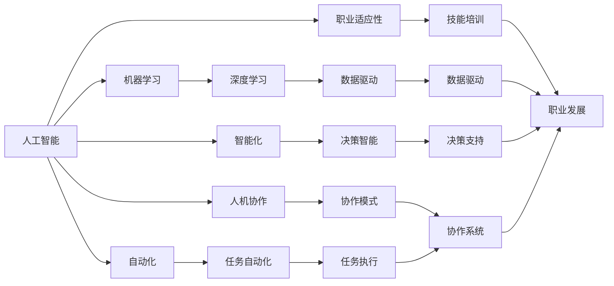

                 

# 未来工作：人机协作，重塑职业未来

> 关键词：未来工作,人机协作,职业变革,自动化,智能化,生产力提升,人工智能,机器学习,数据驱动,职业适应性

## 1. 背景介绍

### 1.1 问题由来
随着人工智能技术的迅猛发展，人机协作已成为现代工作的重要趋势。人工智能不仅在生产、制造、物流、金融等传统行业广泛应用，也在医疗、教育、艺术、娱乐等非传统行业发挥着日益重要的作用。人机协作正逐步改变我们的工作方式、生产模式和生活习惯。

本专题将全面解析未来工作的趋势和特征，探讨人工智能与人类协作的全新模式，研究如何通过智能化手段提升个人和组织的工作效率，以及在这一过程中应考虑的问题和挑战。

### 1.2 问题核心关键点
- 人工智能和机器学习如何改变工作模式？
- 人机协作的原理是什么？
- 哪些行业将首先受到人工智能的影响？
- 职业适应性和技能提升如何实现？
- 人工智能应用中的伦理和法律问题。
- 人类与机器的未来互动关系。

### 1.3 问题研究意义
探索未来工作的人机协作模式，对于推动技术进步、提升产业效率、优化人力资源配置、促进社会公平具有重要意义。通过对人工智能和人类协作的深入研究，可以为职业转型、教育培训、人力资源管理提供新的思路，推动社会整体的智能化升级。

## 2. 核心概念与联系

### 2.1 核心概念概述

为更好地理解未来工作的趋势和特征，本节将介绍几个核心概念及其相互关系：

- **人工智能（AI）**：使用机器学习、深度学习等技术，通过算法和模型处理大量数据，模拟人类智能的行为和决策。

- **机器学习（ML）**：一种通过数据训练模型，使其具备预测、分类、聚类等功能的算法。

- **深度学习（DL）**：一种基于神经网络的机器学习方法，其算法和模型结构复杂，适用于处理大规模数据和高维数据。

- **人机协作（Human-Machine Collaboration）**：指人类与机器在工作中的相互配合，共同完成任务，发挥各自的优势。

- **职业适应性（Job Adaptability）**：指个人或组织适应新技术、新环境、新任务的能力。

- **自动化（Automation）**：指使用人工智能和机器人技术，替代或辅助人类完成重复性、危险性或高复杂度的任务。

- **智能化（Intelligence）**：指通过大数据分析和人工智能技术，提升决策的科学性和效率。

这些核心概念通过相互作用，形成了未来工作的复杂生态系统，推动着职业和产业的深刻变革。

### 2.2 核心概念原理和架构的 Mermaid 流程图



该流程图展示了人工智能、机器学习、深度学习等核心概念之间的关系，以及这些技术如何通过自动化、智能化、人机协作等路径影响职业适应性和技能提升。

## 3. 核心算法原理 & 具体操作步骤

### 3.1 算法原理概述

人机协作的核心在于利用人工智能技术，通过数据分析和机器学习算法，辅助人类完成各种任务。以自然语言处理（NLP）为例，预训练大语言模型（如BERT、GPT-3等）通过在海量无标签文本上进行预训练，获得了强大的语言理解和生成能力。这些模型在特定领域的应用中，通过微调（Fine-Tuning），可以适应特定任务，实现更高效、更精准的输出。

人机协作的算法原理包括以下几个关键步骤：

1. **数据收集与预处理**：收集相关领域的数据，并对数据进行清洗、归一化等预处理。
2. **模型训练**：使用机器学习算法和模型训练数据，优化模型参数。
3. **模型微调**：将训练好的模型针对特定任务进行微调，以获得更好的性能。
4. **模型集成**：结合多个模型和算法，提升整体的性能和鲁棒性。
5. **决策制定**：根据任务需求和反馈，通过AI算法制定最优决策。

### 3.2 算法步骤详解

以下是人机协作在NLP任务中具体实现的详细步骤：

1. **数据收集**：从任务相关的文本数据集中收集数据，如医疗记录、新闻文章、客户评论等。

2. **数据预处理**：清洗数据，去除噪声，进行文本标注，如分词、去除停用词等。

3. **模型训练**：使用预训练模型（如BERT）作为初始参数，通过有监督学习优化模型。常用的损失函数包括交叉熵损失、F1分数、ROC曲线等。

4. **模型微调**：针对特定任务，如情感分析、命名实体识别、关系抽取等，对预训练模型进行微调。微调过程中，可以使用正则化、Dropout、早停等策略避免过拟合。

5. **模型评估与优化**：在验证集上评估模型性能，调整超参数，如学习率、批次大小等，以提升模型效果。

6. **实际应用**：将微调后的模型部署到实际应用中，如智能客服、金融舆情监测、个性化推荐等。

### 3.3 算法优缺点

基于人机协作的AI应用具有以下优点：

- **高效性**：自动化的流程减少了人工操作的时间和成本，提升了工作效率。
- **准确性**：机器算法可以在处理大数据时减少人为偏差，提供更高精度的结果。
- **一致性**：机器算法可以保持操作的一致性，减少人为失误。
- **可扩展性**：模型和算法可以通过微调不断优化，适应新任务和新数据。

同时，存在一些缺点：

- **缺乏灵活性**：固定模型无法处理复杂情境和异常情况。
- **高成本**：初期开发和模型训练需要高昂的计算资源和数据资源。
- **依赖数据质量**：模型效果依赖高质量的标注数据，数据质量差会影响结果。
- **伦理问题**：算法决策可能存在偏见和歧视，需要特别注意伦理和法律问题。

### 3.4 算法应用领域

人机协作的AI技术在众多领域得到广泛应用，如：

- **智能客服**：通过NLP模型自动理解客户需求，提供个性化服务。
- **金融舆情监测**：分析金融新闻和市场动态，提供投资建议。
- **个性化推荐**：分析用户行为，推荐产品和服务。
- **智能医疗**：通过NLP模型处理医学文本，辅助医生诊断。
- **智慧交通**：通过传感器和AI算法优化交通管理。
- **教育培训**：利用AI提供个性化学习方案和智能评估。

## 4. 数学模型和公式 & 详细讲解

### 4.1 数学模型构建

在人机协作的AI应用中，数学模型通常涉及以下几类：

1. **线性回归模型**：用于建立输入变量和输出变量之间的关系，如预测股票价格。
2. **决策树模型**：通过树形结构进行分类和预测，如预测用户流失。
3. **随机森林模型**：通过集成多个决策树，提升模型的泛化能力和鲁棒性。
4. **支持向量机（SVM）**：用于分类和回归问题，如图像分类和标注。
5. **神经网络模型**：通过多层神经元结构进行复杂的非线性拟合，如深度学习模型。

以深度学习模型为例，其数学模型可以表示为：

$$
y = f(x; \theta)
$$

其中 $y$ 表示输出变量，$x$ 表示输入变量，$\theta$ 表示模型参数。

### 4.2 公式推导过程

以线性回归模型为例，其公式推导过程如下：

设输入变量为 $x$，输出变量为 $y$，模型参数为 $\theta$，线性回归模型的目标是最小化损失函数：

$$
\min_{\theta} \frac{1}{2N} \sum_{i=1}^N (y_i - f(x_i; \theta))^2
$$

其中 $N$ 为样本数量，$y_i$ 为第 $i$ 个样本的真实值，$f(x_i; \theta)$ 为模型预测值。

使用梯度下降算法，求解 $\theta$：

$$
\theta_{t+1} = \theta_t - \eta \nabla_{\theta} \mathcal{L}(\theta_t)
$$

其中 $\eta$ 为学习率，$\nabla_{\theta} \mathcal{L}(\theta_t)$ 为损失函数对 $\theta$ 的梯度。

### 4.3 案例分析与讲解

以金融舆情监测为例，展示人机协作的AI应用：

1. **数据收集**：从金融新闻网站和社交媒体收集数据，包括新闻标题、文章内容、评论等。
2. **数据预处理**：清洗数据，去除无用信息，进行情感分析标注。
3. **模型训练**：使用预训练模型（如BERT）作为初始参数，通过有监督学习优化模型。
4. **模型微调**：针对情感分类任务，对预训练模型进行微调。
5. **模型评估与优化**：在验证集上评估模型性能，调整超参数。
6. **实际应用**：部署模型到金融舆情监测系统中，实时监测舆情动态，提供投资建议。

## 5. 项目实践：代码实例和详细解释说明

### 5.1 开发环境搭建

在进行人机协作的AI应用开发前，需要先准备好开发环境：

1. **安装Python**：确保Python版本为3.6及以上。
2. **安装TensorFlow和Keras**：TensorFlow是广泛使用的深度学习框架，Keras是其高级API。
3. **安装相关库**：如numpy、pandas、scikit-learn等。
4. **安装Jupyter Notebook**：用于交互式数据处理和模型训练。

### 5.2 源代码详细实现

以金融舆情监测为例，展示人机协作的AI应用的代码实现：

```python
import tensorflow as tf
from tensorflow.keras import layers
from tensorflow.keras.datasets import imdb

# 加载IMDB数据集
(x_train, y_train), (x_test, y_test) = imdb.load_data(num_words=10000)

# 数据预处理
x_train = tf.keras.preprocessing.sequence.pad_sequences(x_train, maxlen=256)
x_test = tf.keras.preprocessing.sequence.pad_sequences(x_test, maxlen=256)

# 构建模型
model = tf.keras.Sequential([
    layers.Embedding(10000, 16, input_length=256),
    layers.GlobalAveragePooling1D(),
    layers.Dense(16, activation='relu'),
    layers.Dense(1, activation='sigmoid')
])

# 编译模型
model.compile(optimizer='adam', loss='binary_crossentropy', metrics=['accuracy'])

# 训练模型
model.fit(x_train, y_train, epochs=10, batch_size=32, validation_data=(x_test, y_test))
```

### 5.3 代码解读与分析

**代码解读**：

1. **数据加载与预处理**：使用IMDB数据集，将文本序列转换为固定长度的序列，并进行padding处理。
2. **模型构建**：构建了一个包含嵌入层、池化层和全连接层的序列模型。
3. **模型编译**：使用Adam优化器和二元交叉熵损失函数。
4. **模型训练**：在训练集上训练模型，设置训练轮数为10，批次大小为32。
5. **模型评估**：在验证集上评估模型性能。

**代码分析**：

- **数据处理**：使用Keras的pad_sequences函数对文本序列进行padding，确保模型输入的统一长度。
- **模型构建**：嵌入层将文本转换为向量表示，池化层提取特征，全连接层进行分类。
- **优化器选择**：使用Adam优化器，具有较好的收敛性和稳定性。
- **损失函数**：使用二元交叉熵损失函数，适用于二分类问题。

## 6. 实际应用场景

### 6.1 智能客服系统

智能客服系统通过人机协作的AI技术，可以实现24小时不间断服务，快速响应客户咨询。系统自动理解客户意图，匹配最佳答案模板进行回复。

**具体实现**：

1. **数据收集**：收集历史客服对话记录，标注问题和最佳答复。
2. **模型训练**：使用预训练模型（如BERT）进行微调，优化模型预测能力和回复质量。
3. **系统部署**：将训练好的模型部署到智能客服系统中，实时处理客户咨询。

### 6.2 金融舆情监测

金融舆情监测系统通过人机协作的AI技术，实时监测市场动态和舆情变化，提供投资建议。

**具体实现**：

1. **数据收集**：收集金融新闻、社交媒体评论等数据，标注情感倾向。
2. **模型训练**：使用预训练模型进行微调，优化情感分类效果。
3. **系统部署**：将训练好的模型部署到金融舆情监测系统中，实时监测舆情变化，提供投资建议。

### 6.3 个性化推荐系统

个性化推荐系统通过人机协作的AI技术，分析用户行为，推荐产品和服务。

**具体实现**：

1. **数据收集**：收集用户浏览、点击、评论等行为数据，标注产品信息。
2. **模型训练**：使用预训练模型进行微调，优化推荐效果。
3. **系统部署**：将训练好的模型部署到推荐系统中，实时推荐个性化产品和服务。

### 6.4 未来应用展望

未来，人机协作的AI技术将在更多领域得到广泛应用，带来深远影响：

1. **医疗**：通过NLP模型处理医学文本，辅助医生诊断和治疗。
2. **教育**：利用AI提供个性化学习方案和智能评估，提升教育效果。
3. **交通**：通过传感器和AI算法优化交通管理，提高交通效率。
4. **农业**：利用AI分析农业数据，优化种植方案，提升农业生产效率。
5. **城市治理**：通过AI技术优化城市管理，提升居民生活质量。

## 7. 工具和资源推荐

### 7.1 学习资源推荐

1. **TensorFlow官网**：提供丰富的文档和教程，涵盖深度学习和机器学习基础知识。
2. **Keras官网**：提供高级API文档和示例代码，方便快速上手。
3. **Google Colab**：免费在线Jupyter Notebook环境，方便共享和学习。
4. **Coursera**：提供多门深度学习和机器学习课程，适合初学者和进阶者。
5. **Arxiv**：提供最新的AI研究论文，了解前沿技术动态。

### 7.2 开发工具推荐

1. **TensorFlow**：广泛使用的深度学习框架，具有强大的计算图和分布式训练功能。
2. **Keras**：基于TensorFlow的高级API，提供简单易用的模型构建和训练接口。
3. **Jupyter Notebook**：交互式数据处理和模型训练工具，支持Python和多种编程语言。
4. **Google Colab**：免费在线Jupyter Notebook环境，支持GPU和TPU资源。
5. **GitHub**：代码托管平台，方便版本控制和协作开发。

### 7.3 相关论文推荐

1. **TensorFlow深度学习论文**：深入探讨深度学习的原理和实现，适合深度学习领域的研究者。
2. **Keras深度学习论文**：探讨高级API的设计和应用，适合Keras用户和开发者。
3. **机器学习实践论文**：介绍机器学习算法和实际应用，适合业界开发者。
4. **人机协作论文**：探讨人机协作的技术和应用，适合人机协作领域的研究者。

## 8. 总结：未来发展趋势与挑战

### 8.1 研究成果总结

人机协作的AI技术通过数据驱动和智能化手段，显著提升了工作效率和决策质量。在金融、医疗、教育等诸多领域，AI技术已展现出强大的应用潜力。未来，随着技术的不断进步，人机协作将更加高效和智能化，推动各行各业的全面升级。

### 8.2 未来发展趋势

1. **自动化水平提升**：AI技术将逐步替代重复性、危险性高的工作，提升整体工作效率。
2. **智能化程度提升**：通过大数据分析和深度学习，AI将具备更强的决策能力和适应性。
3. **协作模式多样化**：人机协作将更加灵活，支持跨领域、跨模态的协作，拓展应用边界。
4. **伦理和法律问题关注**：随着AI应用的普及，伦理和法律问题将更加重要，需制定相关规范和标准。
5. **人机共生**：未来，人机协作将成为工作的重要模式，人类将更加依赖机器，但同时也需要不断提升自身技能。

### 8.3 面临的挑战

尽管AI技术发展迅速，但在实际应用中仍面临诸多挑战：

1. **数据质量和隐私问题**：高质量标注数据的获取和保护是AI应用的基础。
2. **算法偏见和歧视**：AI模型可能存在偏见，需注意算法的公平性和公正性。
3. **算法透明性**：AI模型决策过程缺乏透明性，需提升算法的可解释性和可控性。
4. **伦理和法律问题**：AI应用可能带来伦理和法律风险，需制定相关规范和标准。
5. **技能转型和就业问题**：AI应用可能导致部分岗位消失，需关注员工的技能转型和再就业问题。

### 8.4 研究展望

未来，人机协作的AI技术需要在技术、伦理、法律等方面进行全面探讨和优化，实现健康、可持续的发展。研究方向包括：

1. **数据增强和生成**：通过数据增强和生成技术，提升AI模型的泛化能力和鲁棒性。
2. **因果学习和推理**：引入因果推断和推理方法，提升AI模型的决策能力和解释性。
3. **跨领域协作**：推动跨领域的人机协作，拓展AI应用的多样性。
4. **人机共生**：探索人机共生的工作模式，提升人类与机器的协同效率。
5. **伦理和法律规范**：制定AI应用的伦理和法律规范，保障用户权益和社会公平。

通过持续研究和优化，人机协作的AI技术将更加智能化、高效化和伦理化，推动各行各业的全面升级，为社会带来更大的福祉。

## 9. 附录：常见问题与解答

### Q1: 人机协作的AI技术如何提升工作效率？

A: AI技术通过自动化和智能化手段，可以快速处理大量数据，提供精确的决策支持，提升工作效率。例如，智能客服系统可以24小时不间断服务，快速响应客户咨询，提升客户满意度。

### Q2: 人机协作的AI技术有哪些应用场景？

A: 人机协作的AI技术广泛应用于金融、医疗、教育、交通、农业等多个领域。例如，智能客服系统、金融舆情监测、个性化推荐系统等。

### Q3: 如何确保AI模型的公平性和公正性？

A: 通过数据预处理、算法设计、结果验证等手段，确保AI模型的公平性和公正性。例如，在金融舆情监测中，使用公平性约束，避免对特定群体的歧视。

### Q4: 未来人机协作的AI技术面临哪些挑战？

A: 数据质量和隐私问题、算法偏见和歧视、算法透明性、伦理和法律问题、技能转型和就业问题等。

### Q5: 如何提升AI模型的可解释性和可控性？

A: 通过可解释性算法和规则设计，提升AI模型的可解释性和可控性。例如，在金融舆情监测中，引入因果推断方法，解释模型决策的逻辑和依据。

---

作者：禅与计算机程序设计艺术 / Zen and the Art of Computer Programming

