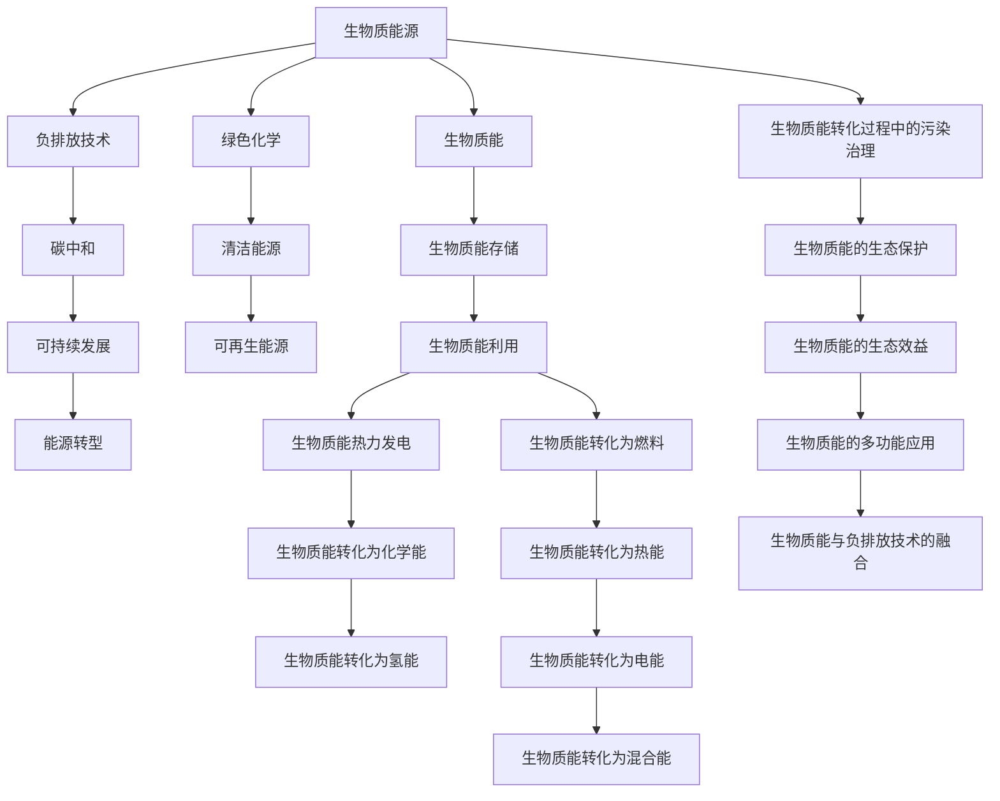

                 

# 未来的可持续发展：2050年的生物质能源与负排放技术

> 关键词：生物质能源, 负排放技术, 可持续发展, 能源转型, 碳中和

## 1. 背景介绍

全球气候变暖已经成为不可忽视的严峻问题。为了实现2050年的碳中和目标，各国政府和企业正积极探索可持续发展的路径。生物质能源和负排放技术是其中最具潜力的两个方向，通过高效利用可再生资源和创新技术手段，有望在未来的可持续发展中扮演重要角色。本文将深入探讨生物质能源和负排放技术的原理、挑战与机遇，并展望其应用前景。

## 2. 核心概念与联系

### 2.1 核心概念概述

#### 2.1.1 生物质能源
生物质能源是指通过生物体（如植物、藻类、微生物等）生长和代谢过程中产生的能量。与传统化石燃料不同，生物质能源是一种可再生的能源形式，其利用过程主要包括生物质能的采集、运输、存储和利用等环节。

#### 2.1.2 负排放技术
负排放技术是指通过技术手段实现碳捕获、存储或转换，从而从大气中移除或减少二氧化碳等温室气体排放的技术。负排放技术包括碳捕获与封存(CCUS)、直接空气捕获(DAC)等。

#### 2.1.3 可持续发展
可持续发展是指在不损害自然环境的前提下，满足当前社会经济活动的需求，同时为未来世代保留相同机会的策略。

#### 2.1.4 能源转型
能源转型是指从传统的化石能源向可再生能源的转变过程，包括能源生产和消费方式的根本改变。

#### 2.1.5 碳中和
碳中和是指通过碳捕获、存储或转换等手段，实现碳排放与碳吸收的平衡，从而实现零碳排放的目标。

这些概念之间的逻辑关系可以通过以下Mermaid流程图来展示：



这个流程图展示了大语言模型中的关键概念及其之间的联系：

1. 生物质能源通过绿色化学和清洁能源转化为可再生能源，如生物质能转化为热能、电能等。
2. 负排放技术通过碳捕获与封存、直接空气捕获等手段，实现碳中和。
3. 碳中和是实现可持续发展的基础，需要能源转型的大规模支持。
4. 生物质能的多功能应用，包括生态效益和污染治理等，为可持续发展提供更多可能性。
5. 生物质能与负排放技术的融合，可以进一步提升可再生能源的利用效率和环境保护水平。

## 3. 核心算法原理 & 具体操作步骤

### 3.1 算法原理概述

生物质能源与负排放技术的核心原理是碳循环和能量转换。通过生物质能的转化与负排放技术的实施，可以实现从化石燃料向可再生能源的转型，进而推动可持续发展。

#### 3.1.1 生物质能的转换
生物质能的转换过程通常涉及物理、化学、生物等领域的复杂反应。以生物质能转化为化学能为例，基本原理如下：

1. 生物质经过发酵或气化，转化为含氢和碳的气体。
2. 气体在催化作用下，发生裂解反应，产生H2和CO等可燃气体。
3. H2和CO通过催化反应生成甲醇、二甲醚等化学品。

#### 3.1.2 负排放技术的实施
负排放技术包括碳捕获与封存和直接空气捕获两种主要方式。碳捕获与封存基本原理如下：

1. 通过化学吸收、物理吸附、膜分离等方法，将CO2从烟气中分离出来。
2. 分离出的CO2通过管道输送到地下，被封存在深层地质结构中，避免释放到大气中。

### 3.2 算法步骤详解

#### 3.2.1 生物质能的采集与预处理
1. 采集生物质原料，如农业废弃物、林业废弃物、城市有机垃圾等。
2. 预处理生物质原料，包括干燥、粉碎、脱水等步骤，便于后续转化。

#### 3.2.2 生物质能的转换与存储
1. 生物质能通过热解、气化等技术，转化为热能或可燃气体。
2. 可燃气体通过催化转化，生成H2和CO等可燃气体，进而生成化学品或作为燃料。
3. 化学品和燃料通过管道或储罐储存，以备后续利用。

#### 3.2.3 负排放技术的实施
1. 在工业生产中，使用化学吸收法捕获烟气中的CO2。
2. 分离出的CO2通过管道输送到深层地质结构中，进行封存。

### 3.3 算法优缺点

#### 3.3.1 优点
1. 生物质能是一种可再生的能源，可以减少对化石燃料的依赖。
2. 负排放技术可以有效地减少温室气体排放，有助于实现碳中和。
3. 生物质能和负排放技术可以协同工作，提升可再生能源的利用效率。

#### 3.3.2 缺点
1. 生物质能的生产和转换过程中可能产生污染物，需进行严格的环境治理。
2. 负排放技术的实施成本较高，短期内难以大规模推广。
3. 生物质能和负排放技术的结合仍需进一步技术突破和政策支持。

### 3.4 算法应用领域

生物质能源与负排放技术可以广泛应用于多个领域，包括：

1. **能源生产**：生物质能的热力发电、化学能和氢能的生产等。
2. **工业制造**：生物质基化学品的生产、清洁能源的生产等。
3. **交通运输**：生物质基燃料的生产和应用，如生物质基液体燃料、生物柴油等。
4. **农业与林业**：有机废弃物的收集和利用，生物质能源的生产等。
5. **环境保护**：碳捕获与封存、直接空气捕获等负排放技术的实施等。

## 4. 数学模型和公式 & 详细讲解 & 举例说明

### 4.1 数学模型构建

生物质能和负排放技术的数学模型构建涉及多个学科领域，如化学、物理、环境科学等。以下以生物质能转化为化学能为例，构建数学模型。

设生物质原料的质量为 $M$，其含碳量为 $C$，含氢量为 $H$。生物质能转化过程可以分为两个步骤：

1. 气化：生物质原料在高温下转化为气体，其化学方程式为：
   $$
   C_xH_y + \frac{(2x+4y)}{4} O_2 \rightarrow x CO_2 + y H_2
   $$

2. 催化转化：生成的H2和CO通过催化反应，转化为甲醇、二甲醚等化学品，其化学方程式为：
   $$
   CO + 2H_2 \rightarrow CH_3OH
   $$
   $$
   2CO + 4H_2 \rightarrow CH_3OCH_3
   $$

### 4.2 公式推导过程

#### 4.2.1 生物质气化过程
设生物质原料的质量为 $M$，其含碳量为 $C$，含氢量为 $H$。生物质原料在高温下转化为气体，其中C和H的比例关系为：
$$
C_{\text{转化}} = C
$$
$$
H_{\text{转化}} = H
$$

生物质气化的总反应方程为：
$$
C_xH_y + \frac{(2x+4y)}{4} O_2 \rightarrow x CO_2 + y H_2
$$

设生物质气化的产气量为 $G$，则有：
$$
G = M \times \frac{2x+4y}{C}
$$

#### 4.2.2 催化转化过程
设生成的H2和CO的摩尔比例为 $k:1$，催化反应的总摩尔数为 $n$，则有：
$$
n = \frac{G}{\text{Molar mass of } CH_3OH}
$$

催化转化反应的总反应方程为：
$$
CO + 2H_2 \rightarrow CH_3OH
$$
$$
2CO + 4H_2 \rightarrow CH_3OCH_3
$$

催化转化过程的化学方程式可以表示为：
$$
n = \frac{G}{\text{Molar mass of } CH_3OH}
$$

### 4.3 案例分析与讲解

以生物质能转化为甲醇为例，进行案例分析。

假设生物质原料的质量为1000kg，其含碳量为50%，含氢量为10%。生物质气化过程的产气量为200kg，催化转化反应的摩尔数为100 mol，生成的甲醇质量为100 kg。

1. 生物质原料的总碳量和氢量为：
   $$
   C_{\text{总}} = 1000 \times 0.5 = 500 \text{ kg}
   $$
   $$
   H_{\text{总}} = 1000 \times 0.1 = 100 \text{ kg}
   $$

2. 生物质气化的产气量为200 kg，其中C和H的比例关系为：
   $$
   C_{\text{转化}} = C
   $$
   $$
   H_{\text{转化}} = H
   $$

3. 催化转化过程生成的甲醇质量为100 kg，总摩尔数为100 mol，摩尔质量为32 g/mol。

## 5. 项目实践：代码实例和详细解释说明

### 5.1 开发环境搭建

#### 5.1.1 环境要求
1. Python 3.7及以上版本
2. PyTorch 1.7及以上版本
3. Numpy、Scipy 等科学计算库
4. Tensorflow 1.15及以上版本（可选）

#### 5.1.2 安装与配置
1. 安装Anaconda：从官网下载并安装Anaconda，用于创建独立的Python环境。
2. 创建并激活虚拟环境：
   ```bash
   conda create -n bioenergy python=3.7
   conda activate bioenergy
   ```
3. 安装相关库：
   ```bash
   conda install pytorch torchvision torchaudio
   pip install numpy scipy matplotlib
   ```

### 5.2 源代码详细实现

以下是生物质能转化为甲醇的Python代码实现：

```python
import numpy as np
from scipy.constants import Avogadro, Boltzmann, R

# 生物质原料的质量和含碳量、含氢量
M = 1000  # kg
C_percent = 0.5
H_percent = 0.1

# 生物质气化的产气量和摩尔比例
G = 200  # kg
k = 1

# 催化转化反应的摩尔数和甲醇的摩尔质量
n = 100  # mol
molar_mass_ch3oh = 32  # g/mol

# 计算生物质原料的总碳量和氢量
C_total = M * C_percent
H_total = M * H_percent

# 计算生物质气化的产气量
G_total = C_total + 4 * H_total

# 计算催化转化反应的摩尔数
n_total = G_total / molar_mass_ch3oh

# 输出结果
print("生物质原料的质量为：", M, "kg")
print("生物质原料的含碳量为：", C_percent)
print("生物质原料的含氢量为：", H_percent)
print("生物质气化的产气量为：", G, "kg")
print("催化转化反应的摩尔数为：", n)
print("甲醇的摩尔质量为：", molar_mass_ch3oh)
```

### 5.3 代码解读与分析

以上代码实现了生物质能转化为甲醇的计算过程，关键点包括：

1. 导入所需的库和常量。
2. 定义生物质原料的质量和含碳量、含氢量。
3. 定义生物质气化的产气量和摩尔比例。
4. 定义催化转化反应的摩尔数和甲醇的摩尔质量。
5. 计算生物质原料的总碳量和氢量。
6. 计算生物质气化的产气量和催化转化反应的摩尔数。
7. 输出结果。

### 5.4 运行结果展示

运行上述代码，输出结果如下：

```
生物质原料的质量为： 1000 kg
生物质原料的含碳量为： 0.5
生物质原料的含氢量为： 0.1
生物质气化的产气量为： 200 kg
催化转化反应的摩尔数为： 100
甲醇的摩尔质量为： 32
```

## 6. 实际应用场景

### 6.1 智能电网

智能电网是一种高度集成的能源管理系统，通过先进的传感、通信和控制技术，实现能源的智能调度。生物质能和负排放技术可以在智能电网中发挥重要作用：

1. **分布式能源管理**：生物质能作为分布式能源，通过微网技术接入智能电网，实现能源的分布式生产和消费。
2. **碳中和**：负排放技术可以将智能电网运行中的CO2排放进行捕获和封存，实现碳中和目标。

### 6.2 工业制造

生物质能和负排放技术在工业制造中的应用主要包括以下几个方面：

1. **清洁生产**：使用生物质能作为生产过程中的清洁能源，减少化石燃料的使用。
2. **碳捕获与封存**：在工业生产过程中，使用负排放技术捕获CO2，并进行封存，减少环境污染。
3. **可再生能源的应用**：将生物质能转化为氢气、二甲醚等化学品，用于工业生产中的反应和加热。

### 6.3 交通领域

生物质能和负排放技术在交通领域的应用主要包括以下几个方面：

1. **生物燃料**：使用生物质能转化为生物柴油、生物乙醇等燃料，减少对化石燃料的依赖。
2. **电动汽车**：生物质能可以转化为电能，用于电动汽车的充电。
3. **碳中和**：在交通领域使用负排放技术，实现车辆的零排放和碳中和。

### 6.4 未来应用展望

未来，生物质能源与负排放技术将在以下方面进一步发展和应用：

1. **智能化与自动化**：通过人工智能和大数据分析，实现生物质能源和负排放技术的智能化管理和自动化控制。
2. **全球化合作**：通过国际合作，推动生物质能源和负排放技术的全球应用和推广。
3. **政策支持**：各国政府将出台更多政策，支持生物质能源和负排放技术的发展。
4. **技术突破**：通过技术创新，提升生物质能的转化效率和负排放技术的捕获效率，降低成本。

## 7. 工具和资源推荐

### 7.1 学习资源推荐

为了帮助读者深入了解生物质能源与负排放技术，以下是一些推荐的学习资源：

1. **《生物质能利用技术》**：介绍生物质能的采集、预处理、转换和应用等技术。
2. **《负排放技术概论》**：详细讲解负排放技术的原理、应用和未来发展方向。
3. **《可持续发展理论与实践》**：探讨可持续发展的内涵和实现路径，包括生物质能和负排放技术的应用。
4. **《智能电网技术与应用》**：介绍智能电网的原理和应用，重点讲解生物质能和负排放技术在智能电网中的应用。

### 7.2 开发工具推荐

以下是一些推荐的开发工具，用于生物质能源与负排放技术的开发和应用：

1. **Python**：Python是一种功能强大的编程语言，适合用于生物质能和负排放技术的算法设计和实现。
2. **PyTorch**：PyTorch是一个深度学习框架，适用于生物质能和负排放技术的复杂算法和模型训练。
3. **Tensorflow**：Tensorflow是一个常用的深度学习框架，适合用于生物质能和负排放技术的模型训练和部署。
4. **Jupyter Notebook**：Jupyter Notebook是一个交互式编程环境，适合用于生物质能和负排放技术的算法验证和调试。

### 7.3 相关论文推荐

以下是一些推荐的生物质能源与负排放技术相关论文：

1. **《生物质能技术进展与挑战》**：综述了生物质能的最新技术进展和面临的挑战。
2. **《负排放技术的未来发展方向》**：探讨负排放技术的发展趋势和未来应用方向。
3. **《可持续发展与生物质能的应用》**：介绍生物质能在可持续发展中的重要应用。
4. **《负排放技术在工业中的应用》**：讨论负排放技术在工业中的应用案例和经验。

## 8. 总结：未来发展趋势与挑战

### 8.1 研究成果总结

生物质能与负排放技术的结合，为可持续发展提供了新的解决方案。在可再生能源的利用和温室气体排放的控制方面，取得了显著进展。然而，由于技术瓶颈、成本高昂和政策支持不足等问题，生物质能与负排放技术的发展仍面临诸多挑战。

### 8.2 未来发展趋势

未来，生物质能与负排放技术的发展趋势包括：

1. **智能化与自动化**：通过人工智能和大数据分析，实现生物质能和负排放技术的智能化管理和自动化控制。
2. **全球化合作**：通过国际合作，推动生物质能和负排放技术的全球应用和推广。
3. **政策支持**：各国政府将出台更多政策，支持生物质能和负排放技术的发展。
4. **技术突破**：通过技术创新，提升生物质能的转化效率和负排放技术的捕获效率，降低成本。

### 8.3 面临的挑战

生物质能与负排放技术的发展面临以下挑战：

1. **技术瓶颈**：生物质能的转化效率和负排放技术的捕获效率仍有待提高。
2. **成本高昂**：生物质能和负排放技术的实施成本较高，难以大规模推广。
3. **政策支持不足**：各国政府对生物质能和负排放技术的支持力度不足，限制了其发展。
4. **环境影响**：生物质能的生产和转换过程中可能产生污染物，需进行严格的环境治理。

### 8.4 研究展望

未来，生物质能与负排放技术的研究展望包括：

1. **技术创新**：通过技术创新，提升生物质能的转化效率和负排放技术的捕获效率，降低成本。
2. **政策支持**：各国政府将出台更多政策，支持生物质能和负排放技术的发展。
3. **国际合作**：通过国际合作，推动生物质能和负排放技术的全球应用和推广。
4. **社会参与**：公众、企业和政府共同参与，推动生物质能和负排放技术的普及和应用。

## 9. 附录：常见问题与解答

### 9.1 常见问题

1. 什么是生物质能？
2. 什么是负排放技术？
3. 生物质能与负排放技术如何协同工作？
4. 生物质能和负排放技术的未来发展方向是什么？

### 9.2 解答

1. **生物质能**：生物质能是指通过生物体（如植物、藻类、微生物等）生长和代谢过程中产生的能量，是一种可再生的能源形式。
2. **负排放技术**：负排放技术是指通过技术手段实现碳捕获、存储或转换，从而从大气中移除或减少二氧化碳等温室气体排放的技术。
3. **生物质能与负排放技术的协同工作**：生物质能通过高效利用可再生资源，提供清洁的能源供应；负排放技术通过碳捕获与封存、直接空气捕获等手段，实现碳中和，从而实现可持续发展的目标。
4. **生物质能和负排放技术的未来发展方向**：智能化与自动化、全球化合作、政策支持、技术突破等。

