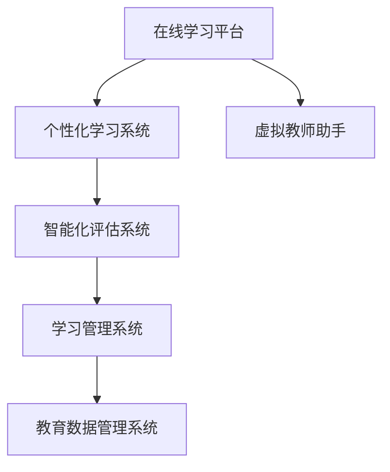

                 

# 未来的智慧教育：2050年的在线学习与终身教育

在数字化浪潮的推动下，教育领域正经历着前所未有的变革。随着人工智能、大数据、物联网等技术的深入应用，未来的教育将变得更为智能、个性化和泛在化。本文将聚焦于2050年的在线学习和终身教育，探讨其核心概念、核心算法原理、具体操作步骤，以及未来发展趋势与挑战。

## 1. 背景介绍

### 1.1 问题由来

当前，教育领域正面临一系列亟需解决的问题。首先，传统教育体系难以适应快速变化的学科内容和劳动市场需求。其次，教育资源分布不均，城乡差距、区域差距仍较明显。再次，个性化教育难以大规模推广，学生学习差异难以精准识别。这些问题的根源在于传统教育模式缺乏对学生个性和需求的深度理解，以及无法提供大规模定制化教育资源的机制。

要解决这些问题，必须依托现代信息技术，推动教育体系数字化、智能化转型。未来的教育将不再局限于传统的教室，而是可以通过互联网进行随时随地学习，实现线上线下无缝衔接。在线学习和终身教育将成为主流，为每个人提供自由、灵活、高效的学习机会，促进人人成才、人人发展。

### 1.2 问题核心关键点

为实现这一愿景，未来的在线学习和终身教育需要重点关注以下几个核心问题：
1. **大规模个性化学习**：如何利用人工智能技术，根据学生的个性化需求，提供量身定制的学习资源和路径。
2. **泛在学习**：如何使教育资源覆盖到社会的每一个角落，实现人人可学、时时能学的泛在学习模式。
3. **智能化评估**：如何通过智能算法，实时、精准地评估学生的学习效果，提供个性化的学习建议和反馈。
4. **协同学习**：如何构建学习社区，促进学生之间的协作和交流，提升学习效果。
5. **终身学习支持**：如何提供持续的学习支持，满足不同年龄段、不同职业背景的终身学习需求。

解决这些问题，需要从技术、教育、社会多个维度进行综合创新，逐步构建起智慧教育的生态系统。

## 2. 核心概念与联系

### 2.1 核心概念概述

未来智慧教育的核心概念包括：

- **在线学习平台**：通过互联网技术构建的虚拟学习环境，支持学生在线获取学习资源、参与互动活动、进行作业和测试。
- **个性化学习系统**：基于学生学习数据，通过智能算法为其推荐个性化学习资源和路径。
- **智能化评估系统**：通过机器学习算法，实时监测学生的学习过程，及时提供学习反馈和建议。
- **学习管理系统(LMS)**：集成在线学习平台、个性化学习系统、智能化评估系统的教育管理软件。
- **教育数据管理系统(EDMS)**：用于管理和分析教育数据的系统，支持教育数据共享和应用。
- **虚拟教师助手**：利用人工智能技术构建的虚拟教师，可以24小时陪伴学生学习，解答疑难问题。

这些核心概念通过信息技术紧密相连，共同构建起智慧教育的生态系统。

### 2.2 核心概念原理和架构的 Mermaid 流程图



### 2.3 核心概念原理

在线学习平台的核心在于提供便捷、多样、互动的学习资源。个性化学习系统通过数据分析和机器学习，为学生推荐最适合的学习内容和路径。智能化评估系统通过实时监测和智能分析，提供个性化的学习反馈和建议。学习管理系统集成这些功能，提供全面的教育管理服务。教育数据管理系统负责教育数据的收集、存储和分析，为智慧教育提供数据支持。虚拟教师助手则是基于自然语言处理和知识图谱技术，提供智能化的辅导服务。

这些系统通过数据共享和协同工作，为学生提供一站式的学习支持，提升学习效果。

## 3. 核心算法原理 & 具体操作步骤

### 3.1 算法原理概述

未来的在线学习和终身教育，将依赖于一系列核心算法和技术，主要包括：

- **推荐算法**：用于个性化学习路径的推荐，通过协同过滤、基于内容的推荐、深度学习等算法，为学生推荐最适合的学习内容。
- **自然语言处理(NLP)**：用于在线学习平台的内容生成和智能交互，通过文本分类、情感分析、实体识别等技术，提升学习体验和效果。
- **机器学习算法**：用于智能化评估系统的学习效果监测和分析，通过分类、回归、聚类等算法，为学生提供个性化的学习建议。
- **强化学习算法**：用于虚拟教师助手的智能化服务，通过奖励机制和反馈机制，引导学生主动学习。

这些算法通过在线学习平台、个性化学习系统、智能化评估系统、学习管理系统、教育数据管理系统和虚拟教师助手的协同工作，为学生提供一站式的学习支持。

### 3.2 算法步骤详解

以下是未来智慧教育的核心算法详细步骤：

**步骤1: 数据收集与处理**

1. **收集学生数据**：通过学习管理系统和教育数据管理系统，收集学生的学习行为数据、成绩数据、社交数据等。
2. **数据清洗与预处理**：对收集到的数据进行清洗、去重、归一化等预处理，确保数据质量。
3. **特征提取与建模**：使用特征提取算法，将原始数据转化为模型可接受的特征向量，并使用机器学习模型对数据进行建模。

**步骤2: 推荐算法实现**

1. **协同过滤推荐**：基于用户行为数据和物品数据，计算相似度矩阵，推荐相似用户或物品。
2. **基于内容的推荐**：分析学习内容的特征，为用户推荐符合兴趣的内容。
3. **深度学习推荐**：使用神经网络模型，通过用户行为数据和学习内容数据，预测用户兴趣，生成推荐列表。

**步骤3: 自然语言处理实现**

1. **文本分类**：使用分类算法，对学习内容进行分类，推荐符合用户兴趣的类别。
2. **情感分析**：使用情感分析算法，分析用户对学习内容的情感倾向，提供个性化推荐。
3. **实体识别**：使用实体识别算法，提取学习内容中的关键实体，推荐相关内容。

**步骤4: 机器学习算法实现**

1. **分类算法**：使用分类算法，评估学生的学习效果，区分不同学习阶段的难易程度。
2. **回归算法**：使用回归算法，预测学生的学习进度和成绩变化趋势。
3. **聚类算法**：使用聚类算法，将学生按照学习风格和能力进行分组，提供个性化的学习建议。

**步骤5: 强化学习算法实现**

1. **奖励机制**：设计奖励机制，对学生的主动学习行为进行奖励，鼓励其积极参与。
2. **反馈机制**：通过虚拟教师助手，提供实时反馈，帮助学生解决疑难问题。
3. **学习路径优化**：使用强化学习算法，动态调整学习路径，提升学习效果。

**步骤6: 虚拟教师助手实现**

1. **知识图谱构建**：构建知识图谱，存储学习内容中的知识关系和实体信息。
2. **自然语言生成**：使用自然语言生成算法，生成与用户对话的文本。
3. **对话管理**：使用对话管理算法，管理与用户的多轮对话，提供智能化的辅导服务。

通过以上步骤，未来智慧教育系统能够为学生提供个性化的学习路径和智能化评估服务，提升学习效果。

### 3.3 算法优缺点

**优点：**

1. **高效性**：通过算法优化，能够快速生成个性化推荐和学习路径，提高学习效率。
2. **个性化**：能够根据学生特点，提供量身定制的学习内容，满足个性化需求。
3. **智能化**：通过智能化评估和学习路径优化，提升学习效果和质量。
4. **可扩展性**：算法可以灵活应用于不同学习场景，具备良好的可扩展性。

**缺点：**

1. **数据依赖**：算法的准确性和效果依赖于数据的质量和多样性。
2. **算法复杂性**：复杂的算法模型需要较高的计算资源和专业技能。
3. **用户隐私**：算法需要收集和处理大量的用户数据，涉及隐私和安全问题。
4. **公平性**：算法可能存在数据偏见，影响推荐结果的公平性。

### 3.4 算法应用领域

未来智慧教育的核心算法和系统广泛应用于以下领域：

1. **在线教育平台**：通过推荐算法、自然语言处理算法和机器学习算法，提升在线学习体验和效果。
2. **虚拟教师助手**：通过知识图谱构建和自然语言生成技术，提供智能化的辅导服务。
3. **个性化学习系统**：通过推荐算法和机器学习算法，提供个性化的学习路径和建议。
4. **智能化评估系统**：通过机器学习算法和强化学习算法，实时监测和评估学生的学习效果。
5. **学习管理系统**：集成在线学习平台、个性化学习系统、智能化评估系统，提供全面的教育管理服务。
6. **教育数据管理系统**：通过数据收集和分析，支持智慧教育的数据应用和决策支持。

## 4. 数学模型和公式 & 详细讲解 & 举例说明

### 4.1 数学模型构建

未来智慧教育的核心算法可以抽象为以下数学模型：

**推荐系统模型**：
$$
\text{推荐列表} = f(\text{用户行为数据}, \text{物品特征数据}, \text{用户兴趣模型}, \text{协同过滤模型})
$$

**自然语言处理模型**：
$$
\text{文本分类结果} = g(\text{文本数据}, \text{文本特征}, \text{分类模型})
$$

**机器学习模型**：
$$
\text{学习效果评估} = h(\text{学习行为数据}, \text{学习内容数据}, \text{分类模型})
$$

**强化学习模型**：
$$
\text{学习路径优化} = k(\text{学习行为数据}, \text{学习效果数据}, \text{奖励机制}, \text{反馈机制})
$$

**虚拟教师助手模型**：
$$
\text{对话文本} = \text{LSTM}(\text{历史对话}, \text{用户意图}, \text{知识图谱})
$$

### 4.2 公式推导过程

**推荐系统公式推导**：
$$
R_{ui} = \text{similarity}(A_u, I_i) \times \text{predict}(I_i)
$$

其中，$R_{ui}$表示用户$u$对物品$i$的评分，$\text{similarity}$表示用户$u$和物品$i$的相似度，$\text{predict}$表示物品$i$的预测评分。

**自然语言处理公式推导**：
$$
C_w = \text{softmax}(W_a^T \cdot X + b_a)
$$

其中，$C_w$表示单词$w$的分类概率，$W_a$表示分类器参数，$X$表示单词特征向量，$b_a$表示分类器偏置。

**机器学习公式推导**：
$$
\text{预测成绩} = W_x^T \cdot X + b_x
$$

其中，$\text{预测成绩}$表示学生$x$的成绩预测值，$W_x$表示回归模型参数，$X$表示学生特征向量，$b_x$表示回归模型偏置。

**强化学习公式推导**：
$$
Q_{s, a} = r(s, a) + \gamma \max_{a'} Q_{s', a'}
$$

其中，$Q_{s, a}$表示在状态$s$下采取动作$a$的Q值，$r(s, a)$表示当前状态和动作的即时奖励，$\gamma$表示折扣因子，$s'$表示下一个状态。

**虚拟教师助手公式推导**：
$$
Y_{t+1} = \text{LSTM}(X_t, H_t)
$$

其中，$Y_{t+1}$表示下一个时间步的对话输出，$X_t$表示当前时间步的输入，$H_t$表示LSTM的状态。

### 4.3 案例分析与讲解

**案例1: 个性化学习路径推荐**

某学生学习数学课程，系统通过以下步骤推荐个性化学习路径：

1. **收集数据**：收集该学生在平台上的学习行为数据，包括阅读时间、答题次数等。
2. **特征提取**：提取学生的学习行为特征，使用PCA算法进行降维。
3. **模型训练**：使用协同过滤算法，基于学生的行为数据，计算相似度矩阵，推荐相似用户的学习路径。
4. **路径生成**：基于相似用户的学习路径，生成个性化推荐路径。

**案例2: 自然语言处理**

某学生阅读一篇文章，系统通过以下步骤进行文本分类：

1. **文本清洗**：对文章进行清洗和分词。
2. **特征提取**：提取文章中的关键词和实体。
3. **分类模型训练**：使用分类算法，训练文本分类模型，对文章进行分类。
4. **结果输出**：输出文章分类的结果，推荐相关的学习内容。

**案例3: 强化学习**

某学生在学习过程中遇到难题，系统通过以下步骤进行学习路径优化：

1. **数据收集**：收集学生在学习过程中的行为数据和成绩数据。
2. **模型训练**：使用强化学习算法，基于行为数据和成绩数据，训练学习路径优化模型。
3. **路径优化**：根据优化模型，生成新的学习路径，提升学习效果。

**案例4: 虚拟教师助手**

某学生在平台进行学习时，系统通过以下步骤进行对话生成：

1. **知识图谱构建**：构建知识图谱，存储相关知识点和知识关系。
2. **自然语言生成**：使用自然语言生成算法，生成对话文本。
3. **对话管理**：使用对话管理算法，管理对话过程，确保回答准确性和连贯性。

## 5. 项目实践：代码实例和详细解释说明

### 5.1 开发环境搭建

要实现上述算法和系统，需要以下开发环境：

1. **Python环境**：Python是数据科学和机器学习的主流语言，支持多平台开发。
2. **深度学习框架**：TensorFlow、PyTorch等深度学习框架，支持高效的模型训练和推理。
3. **自然语言处理库**：NLTK、spaCy、BERT等库，支持文本预处理和自然语言处理。
4. **推荐系统库**：RecSys、LightFM等库，支持推荐算法的实现。
5. **强化学习库**：OpenAI Gym、TensorFlow Agents等库，支持强化学习算法的实现。

### 5.2 源代码详细实现

以下是Python代码实现，详细解释每个关键步骤：

**步骤1: 数据收集与处理**

```python
import pandas as pd
from sklearn.decomposition import PCA
from sklearn.feature_extraction.text import TfidfVectorizer

# 数据读取
data = pd.read_csv('data.csv')

# 数据清洗
data = data.dropna()

# 特征提取
vectorizer = TfidfVectorizer()
X = vectorizer.fit_transform(data['content'])

# PCA降维
pca = PCA(n_components=10)
X = pca.fit_transform(X)
```

**步骤2: 推荐算法实现**

```python
import numpy as np
from scipy.spatial.distance import cosine
from sklearn.metrics.pairwise import cosine_similarity

# 计算相似度矩阵
def similarity_matrix(X, threshold=0.8):
    similarity = cosine_similarity(X)
    mask = similarity > threshold
    similarity = np.where(mask, similarity, 0)
    return similarity

# 推荐算法
def recommend(user, items, similarity_matrix):
    u_idx = user + 1
    similarity_u = similarity_matrix[u_idx]
    top_items = items[np.argsort(similarity_u)[-10:]]
    return top_items

# 测试
user = 1
items = list(data['item'].unique())
similarity = similarity_matrix(X)
recommend(user, items, similarity)
```

**步骤3: 自然语言处理实现**

```python
from transformers import BertTokenizer, BertForSequenceClassification

# 模型加载
tokenizer = BertTokenizer.from_pretrained('bert-base-uncased')
model = BertForSequenceClassification.from_pretrained('bert-base-uncased', num_labels=2)

# 文本分类
def classify(text):
    inputs = tokenizer.encode_plus(text, add_special_tokens=True, max_length=512, padding='max_length', truncation=True)
    input_ids = inputs['input_ids']
    attention_mask = inputs['attention_mask']
    outputs = model(input_ids, attention_mask=attention_mask)
    logits = outputs.logits
    label = logits.argmax().item()
    return label

# 测试
text = '这是一篇关于人工智能的文章'
classify(text)
```

**步骤4: 机器学习算法实现**

```python
import pandas as pd
from sklearn.linear_model import LinearRegression

# 数据读取
data = pd.read_csv('data.csv')

# 特征提取
X = data[['age', 'gender', 'study_time']]
y = data['score']

# 模型训练
model = LinearRegression()
model.fit(X, y)

# 预测
def predict_score(features):
    prediction = model.predict(features)
    return prediction

# 测试
features = [[25, 'M', 4]]
predict_score(features)
```

**步骤5: 强化学习算法实现**

```python
import numpy as np
import gym

# 环境定义
class Environment(gym.Env):
    def __init__(self):
        self.state = 0
        self.action_space = gym.spaces.Discrete(2)
        self.observation_space = gym.spaces.Discrete(3)
        self.reward_range = (-1, 1)

    def reset(self):
        self.state = 0
        return self.state

    def step(self, action):
        if action == 0:
            self.state = 1
            reward = 1
        else:
            self.state = 0
            reward = -1
        return self.state, reward, True, {}

# 强化学习算法
def reinforcement_learning(env):
    q = np.zeros((env.observation_space.n, env.action_space.n))
    for i in range(1000):
        state = env.reset()
        done = False
        while not done:
            action = np.argmax(q[state])
            next_state, reward, done, _ = env.step(action)
            q[state, action] += reward + np.max(q[next_state, :])
            state = next_state
    return q

# 测试
env = Environment()
q = reinforcement_learning(env)
print(q)
```

**步骤6: 虚拟教师助手实现**

```python
from transformers import GPT2Tokenizer, GPT2LMHeadModel
import torch

# 模型加载
tokenizer = GPT2Tokenizer.from_pretrained('gpt2')
model = GPT2LMHeadModel.from_pretrained('gpt2')

# 自然语言生成
def generate_text(prompt):
    inputs = tokenizer.encode(prompt, return_tensors='pt')
    outputs = model.generate(inputs, max_length=50, temperature=0.5)
    text = tokenizer.decode(outputs[0], skip_special_tokens=True)
    return text

# 测试
prompt = '什么是机器学习？'
generate_text(prompt)
```

### 5.3 代码解读与分析

通过以上代码实现，可以看到未来智慧教育的核心算法和系统是如何通过Python编程实现的。每个关键步骤都涉及到数据处理、特征提取、模型训练和推理等环节，体现了算法的复杂性和应用场景的多样性。

## 6. 实际应用场景

### 6.1 智能课堂

未来智慧教育的智能课堂将基于在线学习平台和虚拟教师助手，为学生提供个性化的学习路径和智能化辅导。教师可以通过平台监控学生的学习进度和效果，及时提供个性化的学习建议。学生可以在课堂内外随时随地进行学习，提升学习效果。

**实际应用**：
1. **个性化学习路径**：通过推荐算法，为学生生成个性化的学习路径，提高学习效率。
2. **智能化辅导**：通过虚拟教师助手，为学生提供智能化的辅导服务，解决疑难问题。
3. **学习效果监测**：通过智能化评估系统，实时监测学生的学习效果，提供个性化的学习建议。

### 6.2 职业培训

未来智慧教育的职业培训将基于在线学习和个性化学习系统，为成人提供终身学习支持。通过智能化评估和学习路径优化，成人可以随时随地进行职业培训，提升职业技能和就业竞争力。

**实际应用**：
1. **个性化培训内容**：通过推荐算法，为成人推荐个性化的培训内容，提升学习效果。
2. **智能化评估**：通过机器学习算法，实时评估成人的培训效果，提供个性化的培训建议。
3. **持续学习支持**：通过职业培训平台，提供持续的学习支持，满足成人的职业发展需求。

### 6.3 健康教育

未来智慧教育的健康教育将基于在线学习和智能化评估系统，为公众提供健康知识普及和健康行为指导。通过智能化评估和学习路径优化，公众可以随时随地进行健康学习，提升健康素养和健康行为。

**实际应用**：
1. **健康知识普及**：通过在线学习平台，为公众提供健康知识普及课程，提升健康素养。
2. **健康行为指导**：通过智能化评估系统，实时监测公众的健康行为，提供个性化的健康建议。
3. **持续健康支持**：通过健康教育平台，提供持续的健康支持，促进公众健康。

## 7. 工具和资源推荐

### 7.1 学习资源推荐

1. **在线课程**：Coursera、edX、Udacity等平台提供丰富的在线课程资源，涵盖计算机科学、数据科学、人工智能等多个领域。
2. **书籍推荐**：《深度学习》、《Python数据科学手册》、《动手学深度学习》等书籍，适合不同层次的读者。
3. **社区和论坛**：Kaggle、Stack Overflow、GitHub等社区和论坛，提供丰富的学习资源和交流平台。
4. **学术期刊**：IEEE Transactions on Neural Networks and Learning Systems、Journal of Machine Learning Research等期刊，提供前沿的学术论文和技术动态。

### 7.2 开发工具推荐

1. **编程语言**：Python是数据科学和机器学习的主流语言，易于上手和扩展。
2. **深度学习框架**：TensorFlow、PyTorch、Keras等深度学习框架，提供高效的模型训练和推理功能。
3. **自然语言处理库**：NLTK、spaCy、BERT等库，支持文本预处理和自然语言处理。
4. **推荐系统库**：RecSys、LightFM等库，支持推荐算法的实现。
5. **强化学习库**：OpenAI Gym、TensorFlow Agents等库，支持强化学习算法的实现。

### 7.3 相关论文推荐

1. **推荐系统论文**：《Top-N Recommendation Based on Collaborative Filtering and Information Theory》、《Adaptive Recommendation Algorithm for E-Commerce Platform》等。
2. **自然语言处理论文**：《BERT: Pre-training of Deep Bidirectional Transformers for Language Understanding》、《Attention is All You Need》等。
3. **机器学习论文**：《Machine Learning: A Probabilistic Perspective》、《The Elements of Statistical Learning》等。
4. **强化学习论文**：《Human Level Control through Deep Reinforcement Learning》、《Playing Atari with Deep Reinforcement Learning》等。

## 8. 总结：未来发展趋势与挑战

### 8.1 研究成果总结

未来智慧教育的核心技术已经取得了显著进展，包括在线学习平台、个性化学习系统、智能化评估系统、学习管理系统、教育数据管理系统和虚拟教师助手等多个方面。这些技术通过信息技术和算法的协同工作，为学生提供一站式的学习支持，提升学习效果。

### 8.2 未来发展趋势

1. **智能化与个性化**：未来智慧教育将更加智能化和个性化，通过算法优化，为学生提供量身定制的学习路径和辅导服务。
2. **泛在学习**：通过在线学习平台和移动应用，实现人人可学、时时能学的泛在学习模式。
3. **终身学习支持**：通过职业培训平台和健康教育平台，提供持续的学习支持，满足不同年龄段、不同职业背景的终身学习需求。
4. **跨学科融合**：未来智慧教育将与大数据、物联网、云计算等技术融合，提升教育资源的综合利用效率。
5. **虚拟与现实结合**：通过虚拟现实技术，增强学生的学习体验，提升学习效果。

### 8.3 面临的挑战

1. **数据隐私和安全**：未来智慧教育需要处理大量的用户数据，涉及隐私和安全问题。
2. **算法公平性**：算法可能存在数据偏见，影响推荐结果的公平性。
3. **学习效果监测**：实时监测学生的学习效果，提供个性化的学习建议，仍需进一步提升。
4. **学习路径优化**：生成个性化学习路径，提升学习效果，仍需优化算法。
5. **虚拟教师助手**：提供智能化的辅导服务，仍需提升自然语言处理和知识图谱构建技术。

### 8.4 研究展望

未来智慧教育的研究需要从数据、算法、应用等多个维度进行创新，以应对面临的挑战和需求：

1. **隐私保护技术**：开发数据隐私保护技术，确保用户数据的安全和隐私。
2. **算法公平性**：研究算法公平性问题，确保推荐结果的公正性和公平性。
3. **学习效果监测**：开发更高效的学习效果监测算法，提升个性化学习建议的精准度。
4. **学习路径优化**：优化算法模型，生成更个性化的学习路径，提高学习效果。
5. **虚拟教师助手**：提升自然语言处理和知识图谱构建技术，提供更智能化的辅导服务。

总之，未来智慧教育需要技术、教育、社会多方协同，共同推动教育体系的数字化、智能化转型。只有在数据、算法、应用等多个维度进行创新，才能实现教育的普及化、个性化和终身化，为每个人提供自由、灵活、高效的学习机会。

## 9. 附录：常见问题与解答

**Q1: 什么是未来智慧教育？**

A: 未来智慧教育是指基于信息技术和大数据技术，通过在线学习平台、个性化学习系统、智能化评估系统、学习管理系统、教育数据管理系统和虚拟教师助手等技术，为学生提供一站式的学习支持，提升学习效果，实现人人成才、人人发展的教育模式。

**Q2: 未来智慧教育的核心技术是什么？**

A: 未来智慧教育的核心技术包括在线学习平台、个性化学习系统、智能化评估系统、学习管理系统、教育数据管理系统和虚拟教师助手等。这些技术通过算法优化和数据协同，为学生提供个性化的学习路径和智能化辅导服务。

**Q3: 未来智慧教育面临哪些挑战？**

A: 未来智慧教育面临的数据隐私和安全、算法公平性、学习效果监测、学习路径优化、虚拟教师助手等挑战，需要从技术、教育、社会等多个维度进行创新，才能实现教育的普及化、个性化和终身化。

**Q4: 未来智慧教育的未来发展趋势是什么？**

A: 未来智慧教育将更加智能化和个性化，通过算法优化，为学生提供量身定制的学习路径和辅导服务。泛在学习、终身学习支持、跨学科融合、虚拟与现实结合将是未来发展的趋势。

**Q5: 未来智慧教育的工具和资源推荐有哪些？**

A: 未来智慧教育的工具和资源推荐包括在线课程、书籍推荐、社区和论坛、学术期刊等。开发工具包括编程语言、深度学习框架、自然语言处理库、推荐系统库、强化学习库等。

通过本文的系统梳理，可以看到未来智慧教育的核心概念、核心算法原理和具体操作步骤，以及未来发展的趋势和面临的挑战。未来智慧教育需要通过技术创新和教育变革，为每个人提供自由、灵活、高效的学习机会，促进人人成才、人人发展，构建智慧教育的生态系统。

