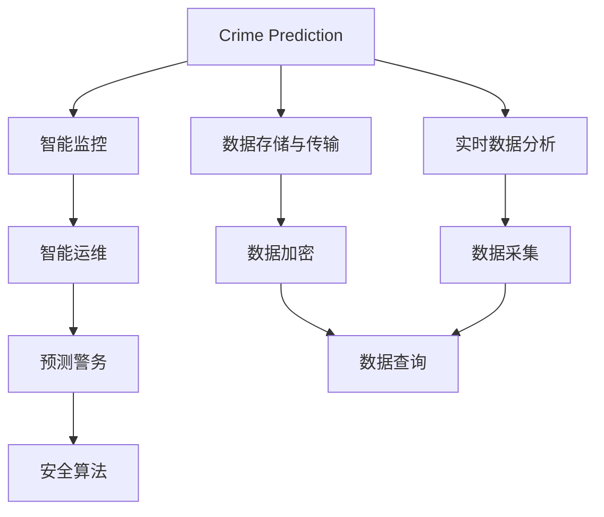

                 

## 1. 背景介绍

### 1.1 问题由来
随着人工智能(AI)技术的快速发展，智能化安防系统在过去十年中取得了显著进步。然而，目前的安防系统更多依赖于事后处理，难以实时预警潜在犯罪行为。因此，如何在未来构建更加智能化的安防系统，实现提前预警和精准打击，成为当前安防技术面临的重要挑战。

### 1.2 问题核心关键点
本节将介绍基于未来技术的大规模智能安防系统构想。在2050年的智能安防场景中，Crime Prediction（犯罪预测）与Predictive Policing（预测警务）将成为核心技术，通过AI技术对犯罪行为进行预测和干预。

### 1.3 问题研究意义
研究智能安防技术的未来发展趋势，对于构建更加安全、高效的现代城市环境具有重要意义：

1. **提升安全水平**：通过预测和干预，提前预防犯罪行为，降低犯罪率。
2. **优化警力资源**：合理分配警力，提高警务效率和响应速度。
3. **改善社区环境**：提高社区居民的安全感和满意度。
4. **推动技术创新**：为人工智能技术的发展提供新的应用场景和挑战。

## 2. 核心概念与联系

### 2.1 核心概念概述

为更好地理解2050年智能安防系统，本节将介绍几个密切相关的核心概念：

- **Crime Prediction**：使用机器学习和大数据技术，对犯罪行为进行预测。通过分析历史数据、社会经济数据和实时监控数据，预测潜在犯罪发生的时空位置、类型和规模。
- **Predictive Policing**：基于Crime Prediction的结果，智能警务系统在犯罪发生前进行预防和干预。通过自动化决策和现场执法，减少犯罪发生率。
- **智能监控**：结合视频监控、物联网传感器、GPS定位等多模态数据，实时监测社区环境，提升数据获取的广度和精度。
- **实时数据分析**：在数据采集、传输、存储、处理等各环节实现实时处理，快速响应潜在犯罪行为。
- **安全算法**：使用密码学、区块链等技术，保护数据安全和隐私，防止数据滥用和攻击。
- **智能运维**：通过自动化运维工具，持续优化系统性能，保障系统稳定性和可靠性。

这些核心概念之间的逻辑关系可以通过以下Mermaid流程图来展示：



这个流程图展示了大规模智能安防系统的核心概念及其之间的关系：

1. **数据采集与存储**：从智能监控、物联网等多种来源获取数据，并进行存储和管理。
2. **实时数据分析**：对数据进行实时处理和分析，提取有用信息。
3. **犯罪预测**：利用机器学习模型对犯罪行为进行预测。
4. **预测警务**：基于预测结果，智能警务系统进行预防和干预。
5. **安全算法**：保障数据安全和隐私。
6. **智能运维**：持续优化系统性能。

这些概念共同构成了2050年智能安防系统的技术框架，使得系统能够在未来社会中发挥更强大的安全保障作用。

## 3. 核心算法原理 & 具体操作步骤
### 3.1 算法原理概述

Crime Prediction和Predictive Policing的核心算法是基于机器学习和数据分析的技术，通过构建复杂的预测模型和决策模型，对犯罪行为进行预测和干预。以下是对核心算法原理的详细说明：

### 3.2 算法步骤详解

**3.2.1 数据预处理**

智能安防系统需要处理海量数据，包括视频监控、物联网传感器、GPS定位、社交媒体等多种类型的数据。数据预处理主要包括：

1. **数据清洗**：去除噪声和异常数据，确保数据质量。
2. **数据整合**：将不同来源的数据进行统一格式，方便后续处理。
3. **数据增强**：使用数据增强技术，丰富数据样本，提升模型泛化能力。

**3.2.2 特征工程**

数据预处理后，需要进行特征工程，提取有用特征，提升模型性能：

1. **特征选择**：选择对犯罪预测有较高影响的重要特征，如犯罪历史数据、人口密度、社区经济情况等。
2. **特征提取**：使用各种算法（如PCA、LDA等）进行降维，减少计算量和噪声。
3. **特征变换**：使用数据标准化、归一化等方法，提高模型训练效率。

**3.2.3 模型训练与预测**

模型训练与预测是大规模智能安防系统的核心环节，主要包括以下步骤：

1. **选择模型**：选择适合预测任务的机器学习模型，如随机森林、支持向量机、神经网络等。
2. **训练模型**：使用历史数据对模型进行训练，优化模型参数。
3. **模型评估**：使用交叉验证、ROC曲线等方法评估模型性能。
4. **实时预测**：将实时采集的数据输入模型，进行预测和推理，生成犯罪预警信息。

**3.2.4 预测警务**

预测警务是基于Crime Prediction的结果，智能警务系统对犯罪行为进行干预和预防。主要包括以下步骤：

1. **自动化决策**：使用决策树、规则引擎等技术，自动化生成警务指令。
2. **现场执法**：智能警务机器人或警务人员根据决策结果，进行现场巡逻和干预。
3. **结果反馈**：对干预结果进行评估，优化模型和算法，提高预测准确率。

### 3.3 算法优缺点

基于机器学习和数据分析的Crime Prediction与Predictive Policing算法具有以下优点：

1. **高效性**：能够实时处理海量数据，快速生成预测结果。
2. **准确性**：通过优化模型和算法，预测准确率较高。
3. **灵活性**：适用于各种犯罪类型和场景，具备较强的泛化能力。
4. **可扩展性**：能够轻松集成多种数据源，实现全局监控和预测。

同时，该算法也存在一些局限性：

1. **依赖高质量数据**：模型性能依赖于数据质量，数据采集和预处理较为复杂。
2. **模型复杂度高**：需要高性能计算资源，训练和推理效率较低。
3. **算法透明度低**：模型的决策过程缺乏可解释性，难以调试和优化。
4. **安全风险**：涉及大量敏感数据，数据泄露和隐私侵犯的风险较高。

尽管存在这些局限性，基于机器学习的Crime Prediction与Predictive Policing仍是目前智能安防系统中较为成熟和高效的技术方案。

### 3.4 算法应用领域

Crime Prediction与Predictive Policing技术在以下领域得到广泛应用：

1. **城市安防**：对城市公共安全进行实时监控和预警，提升城市安全水平。
2. **校园安全**：对学校内的行为进行监测，防止校园暴力和欺凌。
3. **企业安防**：对企业员工行为进行监控，防止内盗和违规操作。
4. **交通安防**：对交通违法行为进行预测和干预，提升道路安全。
5. **公共安全**：对突发事件进行预测和响应，保障公共安全。

## 4. 数学模型和公式 & 详细讲解
### 4.1 数学模型构建

以下我们将使用数学语言对基于机器学习和数据分析的Crime Prediction与Predictive Policing过程进行详细描述。

**4.1.1 数据表示**

设智能安防系统采集的数据集为 $D=\{(x_i, y_i)\}_{i=1}^N$，其中 $x_i$ 为输入特征向量，$y_i$ 为输出标签（如犯罪类型、犯罪地点等）。

**4.1.2 预测模型**

使用随机森林模型进行犯罪预测，模型的训练目标为：

$$
\min_{\theta} \frac{1}{N}\sum_{i=1}^N L(y_i, f_\theta(x_i))
$$

其中 $f_\theta(x)$ 为模型预测函数，$L$ 为损失函数（如均方误差）。

**4.1.3 预测警务模型**

使用决策树模型进行预测警务，模型的训练目标为：

$$
\min_{\phi} \frac{1}{N}\sum_{i=1}^N L(y_i, g_\phi(x_i))
$$

其中 $g_\phi(x)$ 为模型决策函数，$L$ 为损失函数（如准确率）。

### 4.2 公式推导过程

**4.2.1 随机森林模型**

随机森林模型基于决策树，通过集成多个决策树，提升预测性能。设决策树数量为 $m$，决策树预测函数为 $f_{\theta_k}(x)$，则随机森林预测函数为：

$$
f_{\theta}(x) = \frac{1}{m} \sum_{k=1}^m f_{\theta_k}(x)
$$

其中 $\theta_k$ 为第 $k$ 个决策树的参数。

**4.2.2 决策树模型**

决策树模型使用信息增益或基尼指数等指标，选择最优特征进行划分。设决策树结构为 $T$，特征集合为 $F$，特征 $f_j$ 在节点 $i$ 上的信息增益为 $IG(f_j, i)$，则节点 $i$ 的特征选择如下：

$$
f_i = \arg\max_{f_j \in F} IG(f_j, i)
$$

其中 $IG(f_j, i)$ 为特征 $f_j$ 在节点 $i$ 上的信息增益。

### 4.3 案例分析与讲解

**4.3.1 案例描述**

假设某城市需要构建智能安防系统，预防盗窃行为。系统采集了过去一年的犯罪数据，包括犯罪地点、犯罪时间、犯罪类型等特征。使用随机森林模型进行犯罪预测，预测未来一周内各个地点的盗窃发生概率。

**4.3.2 数据预处理**

数据清洗后，选择人口密集度、历史犯罪率、天气状况等特征作为输入。使用数据标准化方法，对特征进行归一化处理。

**4.3.3 模型训练**

选择随机森林模型，使用历史犯罪数据进行训练，优化模型参数。使用交叉验证方法评估模型性能。

**4.3.4 预测警务**

根据预测结果，智能警务系统生成犯罪预警信息，自动分配警力，进行巡逻和干预。对预警结果进行评估，优化模型和算法，提高预测准确率。

## 5. 项目实践：代码实例和详细解释说明
### 5.1 开发环境搭建

在进行智能安防系统的开发前，需要准备好开发环境。以下是使用Python进行TensorFlow开发的环境配置流程：

1. 安装Anaconda：从官网下载并安装Anaconda，用于创建独立的Python环境。

2. 创建并激活虚拟环境：
```bash
conda create -n pytorch-env python=3.8 
conda activate pytorch-env
```

3. 安装TensorFlow：根据CUDA版本，从官网获取对应的安装命令。例如：
```bash
conda install tensorflow -c pytorch -c conda-forge
```

4. 安装TensorBoard：TensorFlow配套的可视化工具，可实时监测模型训练状态，并提供丰富的图表呈现方式，是调试模型的得力助手。

5. 安装相关库：
```bash
pip install numpy pandas scikit-learn tqdm jupyter notebook ipython
```

完成上述步骤后，即可在`pytorch-env`环境中开始智能安防系统的开发。

### 5.2 源代码详细实现

下面我们以智能安防系统中的Crime Prediction为例，给出使用TensorFlow进行模型开发的PyTorch代码实现。

首先，定义Crime Prediction任务的数据处理函数：

```python
import tensorflow as tf
from tensorflow.keras import layers, models

class CrimePredictionDataset(tf.keras.utils.Sequence):
    def __init__(self, features, labels, batch_size):
        self.features = features
        self.labels = labels
        self.batch_size = batch_size
        
    def __len__(self):
        return len(self.features) // self.batch_size
        
    def __getitem__(self, idx):
        batch_features = self.features[idx*self.batch_size:(idx+1)*self.batch_size]
        batch_labels = self.labels[idx*self.batch_size:(idx+1)*self.batch_size]
        return batch_features, batch_labels
```

然后，定义模型和优化器：

```python
from tensorflow.keras import Sequential
from tensorflow.keras.layers import Dense, Dropout
from tensorflow.keras.optimizers import Adam

model = Sequential([
    Dense(64, activation='relu', input_shape=(6,)),
    Dropout(0.2),
    Dense(64, activation='relu'),
    Dropout(0.2),
    Dense(1, activation='sigmoid')
])

optimizer = Adam(learning_rate=0.001)
```

接着，定义训练和评估函数：

```python
def train_epoch(model, dataset, batch_size, optimizer):
    model.compile(optimizer=optimizer, loss='binary_crossentropy', metrics=['accuracy'])
    model.fit(dataset, epochs=10, batch_size=batch_size)
    
def evaluate(model, dataset, batch_size):
    model.evaluate(dataset, batch_size=batch_size)
```

最后，启动训练流程并在测试集上评估：

```python
train_features = []
train_labels = []

# 训练数据集
# ...

test_features = []
test_labels = []

# 测试数据集
# ...

train_dataset = CrimePredictionDataset(train_features, train_labels, 32)
test_dataset = CrimePredictionDataset(test_features, test_labels, 32)

train_epoch(model, train_dataset, 32, optimizer)
evaluate(model, test_dataset, 32)
```

以上就是使用TensorFlow进行智能安防系统Crime Prediction的完整代码实现。可以看到，TensorFlow提供的功能强大且易于使用的API，使得模型开发变得更加简单和高效。

### 5.3 代码解读与分析

让我们再详细解读一下关键代码的实现细节：

**CrimePredictionDataset类**：
- `__init__`方法：初始化训练和测试特征、标签以及批量大小。
- `__len__`方法：返回数据集样本数量。
- `__getitem__`方法：对单个样本进行处理，返回特征和标签。

**模型定义**：
- 使用Sequential模型定义多层神经网络，包括两个全连接层和一个输出层。
- 使用ReLU激活函数，引入Dropout正则化，减少过拟合。
- 输出层使用Sigmoid激活函数，适用于二分类问题。

**优化器和损失函数**：
- 选择Adam优化器，学习率为0.001。
- 使用二元交叉熵损失函数，适用于二分类问题。

**训练和评估函数**：
- 使用Keras的fit方法进行模型训练，设定批量大小为32。
- 使用evaluate方法在测试集上评估模型性能。

**训练流程**：
- 定义训练特征和标签，测试特征和标签。
- 创建训练和测试数据集。
- 在训练集上进行训练，设定批量大小为32。
- 在测试集上评估模型性能。

可以看到，TensorFlow提供的高层API使得模型开发变得更为简便。通过定义模型、优化器和损失函数，我们可以快速搭建和训练一个简单的Crime Prediction模型。在实际开发中，我们可以根据具体需求添加更多层、调整超参数，进一步提升模型性能。

## 6. 实际应用场景

### 6.1 智能监控

智能监控是智能安防系统的核心组成部分，通过实时监控视频和传感器数据，获取环境信息。智能监控系统需要具备以下特点：

- **高分辨率摄像头**：确保视频监控的清晰度和覆盖范围。
- **多种传感器**：如温度传感器、声音传感器、烟雾传感器等，获取更多环境信息。
- **边缘计算**：在视频监控设备上完成初步处理，减少数据传输和存储压力。
- **数据加密**：对监控数据进行加密处理，保障数据安全。

**实际应用**：
某购物中心部署智能监控系统，实时监控客流、异常行为等。系统通过摄像头、传感器获取数据，并使用机器学习模型进行实时分析，生成预警信息，提升购物环境的安全性。

### 6.2 预测警务

预测警务是智能安防系统的关键应用场景，通过实时预测和干预，实现犯罪预防。预测警务系统需要具备以下特点：

- **自动化决策**：使用智能算法自动生成警务指令。
- **现场执法**：智能警务机器人或警务人员根据决策结果，进行现场巡逻和干预。
- **结果反馈**：对干预结果进行评估，优化模型和算法。

**实际应用**：
某城市部署预测警务系统，实时预测盗窃、抢劫等犯罪行为，自动分配警力进行巡逻和干预。系统通过历史数据和实时监控数据，生成预警信息，提升警务效率和响应速度。

### 6.3 社区安全

社区安全是智能安防系统的重要应用方向，通过实时监控和预警，提升社区居民的安全感和满意度。社区安全系统需要具备以下特点：

- **实时监控**：对社区环境进行实时监控，及时发现异常行为。
- **社区预警**：通过社区公告牌、手机APP等渠道，向居民发布预警信息。
- **居民互动**：允许居民通过APP报告异常情况，提升社区治理效果。

**实际应用**：
某社区部署智能安防系统，实时监控社区环境，及时发现异常行为。系统通过摄像头、传感器等设备，获取数据并进行实时分析，生成预警信息，提升社区居民的安全感和满意度。

## 7. 工具和资源推荐
### 7.1 学习资源推荐

为了帮助开发者系统掌握智能安防技术的理论基础和实践技巧，这里推荐一些优质的学习资源：

1. **TensorFlow官方文档**：提供全面的TensorFlow开发指南，涵盖模型训练、优化器、损失函数等多个方面。

2. **Scikit-learn官方文档**：提供Scikit-learn机器学习库的详细文档，涵盖各种机器学习算法和工具。

3. **Keras官方文档**：提供Keras深度学习库的详细文档，涵盖神经网络模型的搭建和训练。

4. **Google AI Blog**：Google AI团队发布的最新研究成果和技术博客，涵盖深度学习、机器学习等多个方向。

5. **GitHub开源项目**：提供大量开源智能安防项目，包括模型训练、数据处理、系统部署等多个环节的代码实现。

通过学习这些资源，相信你一定能够快速掌握智能安防技术的精髓，并用于解决实际的安防问题。

### 7.2 开发工具推荐

高效的开发离不开优秀的工具支持。以下是几款用于智能安防系统开发的常用工具：

1. **TensorFlow**：由Google主导开发的深度学习框架，生产部署方便，适合大规模工程应用。

2. **Scikit-learn**：提供简单易用的机器学习算法，适合快速原型开发和实验。

3. **Keras**：提供高层次的API，使得深度学习模型搭建更加简便。

4. **TensorBoard**：TensorFlow配套的可视化工具，可实时监测模型训练状态，并提供丰富的图表呈现方式。

5. **Jupyter Notebook**：交互式的开发环境，支持Python代码的编写和执行。

6. **PyCharm**：功能强大的Python开发工具，提供代码高亮、自动补全、调试等功能。

合理利用这些工具，可以显著提升智能安防系统的开发效率，加快创新迭代的步伐。

### 7.3 相关论文推荐

智能安防技术的发展源于学界的持续研究。以下是几篇奠基性的相关论文，推荐阅读：

1. **"Object Detection with Deep Learning: A Review"**：综述了深度学习在目标检测领域的研究进展，为智能安防系统的数据采集和处理提供了理论基础。

2. **"Deep Learning for Crime Prediction: A Survey"**：综述了深度学习在犯罪预测领域的研究进展，为智能安防系统的模型训练和预测提供了理论支持。

3. **"Predictive Policing: An Empirical Evaluation of Predictive Crime Policing Algorithms"**：对预测警务算法进行了实验评估，为智能安防系统的预测警务提供了实践指导。

4. **"Blockchain Technology for Smart Security System: A Survey"**：综述了区块链技术在智能安防系统中的应用，为数据安全和隐私保护提供了技术支撑。

5. **"Real-Time Crime Prediction and Detection Using Machine Learning"**：提出了一种基于机器学习的实时犯罪预测和检测系统，为智能安防系统的实时预警和干预提供了技术方案。

这些论文代表了大规模智能安防技术的发展脉络。通过学习这些前沿成果，可以帮助研究者把握学科前进方向，激发更多的创新灵感。

## 8. 总结：未来发展趋势与挑战

### 8.1 总结

本文对基于机器学习和数据分析的智能安防系统进行了全面系统的介绍。首先阐述了智能安防系统的背景和意义，明确了2050年智能安防系统中的核心技术Crime Prediction与Predictive Policing。其次，从原理到实践，详细讲解了智能安防系统的核心算法原理和操作步骤，给出了智能安防系统开发的完整代码实例。同时，本文还广泛探讨了智能安防系统在智能监控、预测警务、社区安全等多个领域的应用前景，展示了智能安防系统的广阔应用空间。此外，本文精选了智能安防系统的各类学习资源，力求为开发者提供全方位的技术指引。

通过本文的系统梳理，可以看到，基于机器学习的智能安防技术将成为未来安防领域的重要发展方向。Crime Prediction与Predictive Policing技术有望提升城市安全水平、优化警务资源、改善社区环境，带来深远的社会影响。

### 8.2 未来发展趋势

展望未来，智能安防技术将呈现以下几个发展趋势：

1. **智能监控系统的智能化升级**：通过AI技术对视频监控数据进行深度分析，实现行为识别、异常检测等功能，提升监控效果。

2. **预测警务系统的自动化优化**：通过智能算法自动生成警务指令，提高警务效率和响应速度。

3. **社区安全系统的智能化部署**：通过智能设备和算法，实时监控社区环境，及时发现异常行为。

4. **数据隐私与安全技术的突破**：引入区块链、隐私计算等技术，保障数据安全和隐私，防止数据滥用和攻击。

5. **跨领域融合的智能安防系统**：融合物联网、5G、人工智能等技术，构建跨领域、全场景的智能安防网络。

以上趋势凸显了智能安防技术的广阔前景。这些方向的探索发展，必将进一步提升智能安防系统的性能和应用范围，为构建安全、高效、智能的智能安防系统铺平道路。

### 8.3 面临的挑战

尽管智能安防技术已经取得了显著进步，但在迈向更加智能化、普适化应用的过程中，仍面临诸多挑战：

1. **数据质量和多样性**：智能安防系统依赖于高质量、多样化的数据，但数据采集和预处理较为复杂。如何获取和处理大规模、高质量的数据，仍是重大难题。

2. **模型复杂性和资源消耗**：智能安防系统需要高性能计算资源，模型复杂度高，训练和推理效率较低。如何优化模型结构，提高计算效率，是亟待解决的问题。

3. **隐私和安全风险**：智能安防系统涉及大量敏感数据，数据泄露和隐私侵犯的风险较高。如何保障数据安全和隐私，防止数据滥用和攻击，是重要的研究方向。

4. **算法透明度和可解释性**：智能安防系统的决策过程缺乏可解释性，难以调试和优化。如何赋予模型更强的可解释性，提高算法的透明度，是研究者需要关注的问题。

5. **跨领域技术融合**：智能安防系统需要融合多种技术，如AI、物联网、区块链等，技术复杂度高，实现难度大。如何实现跨领域技术的无缝集成，提升系统整体性能，是重要的研究方向。

这些挑战将影响智能安防技术的发展进程，需要研究者不断探索和突破。只有解决这些问题，智能安防技术才能在实际应用中发挥更大的作用。

### 8.4 研究展望

面对智能安防技术面临的挑战，未来的研究需要在以下几个方面寻求新的突破：

1. **数据采集与处理技术的优化**：研究高效的数据采集与预处理技术，提高数据质量和多样性。

2. **模型压缩与优化**：研究轻量化模型和高效的优化算法，提升智能安防系统的计算效率。

3. **数据隐私与安全技术**：研究数据加密、隐私计算等技术，保障智能安防系统的数据安全和隐私。

4. **算法透明性与可解释性**：研究可解释性算法和模型，提高智能安防系统的透明度和可解释性。

5. **跨领域技术融合**：研究跨领域技术融合的架构和方法，提升智能安防系统的整体性能。

这些研究方向的探索，将引领智能安防技术迈向更高的台阶，为构建安全、可靠、智能的智能安防系统提供坚实的理论和技术基础。面向未来，智能安防技术需要与其他AI技术进行更深入的融合，共同推动智能安防系统的进步。

## 9. 附录：常见问题与解答

**Q1：智能安防系统中的Crime Prediction与Predictive Policing技术是否适用于所有犯罪类型？**

A: 智能安防系统中的Crime Prediction与Predictive Policing技术主要适用于常见犯罪类型，如盗窃、抢劫、诈骗等。但对于某些特殊犯罪类型，如恐怖袭击、网络犯罪等，仍需结合其他技术手段进行应对。

**Q2：智能安防系统中的数据采集和处理如何保障数据安全和隐私？**

A: 智能安防系统中的数据采集和处理应采取以下措施保障数据安全和隐私：
1. 数据加密：对采集的数据进行加密处理，防止数据泄露。
2. 数据匿名化：对数据进行去标识化处理，保护用户隐私。
3. 访问控制：对数据访问进行严格的权限控制，防止数据滥用。
4. 安全协议：使用SSL/TLS等安全协议，保障数据传输安全。

**Q3：智能安防系统中的模型训练和预测需要高性能计算资源，如何解决计算效率问题？**

A: 智能安防系统中的模型训练和预测需要高性能计算资源，可以通过以下措施解决计算效率问题：
1. 模型压缩：使用模型压缩技术，如剪枝、量化等，减小模型参数量和计算量。
2. 模型并行：使用分布式训练和推理，提升计算效率。
3. 算法优化：使用高效的优化算法，如AdamW、Adafactor等，提高训练速度。
4. 硬件加速：使用GPU、TPU等高性能设备，提升计算效率。

**Q4：智能安防系统中的算法透明性和可解释性如何实现？**

A: 智能安防系统中的算法透明性和可解释性可以通过以下措施实现：
1. 可解释性算法：使用可解释性算法，如线性模型、规则引擎等，提升算法的透明度。
2. 可视化工具：使用可视化工具，如TensorBoard、WandB等，展示算法的决策过程。
3. 规则集成：将专家规则与算法结合，提升算法的透明性和可解释性。

**Q5：智能安防系统中的跨领域技术融合如何实现？**

A: 智能安防系统中的跨领域技术融合可以通过以下措施实现：
1. 统一标准：制定统一的技术标准，实现不同技术之间的无缝集成。
2. 中间件架构：设计中间件架构，提供跨领域的通用接口。
3. 集成平台：建立集成平台，实现跨领域技术的一体化部署和管理。

这些措施将有助于实现智能安防系统中的跨领域技术融合，提升系统的整体性能和应用效果。

---

作者：禅与计算机程序设计艺术 / Zen and the Art of Computer Programming

